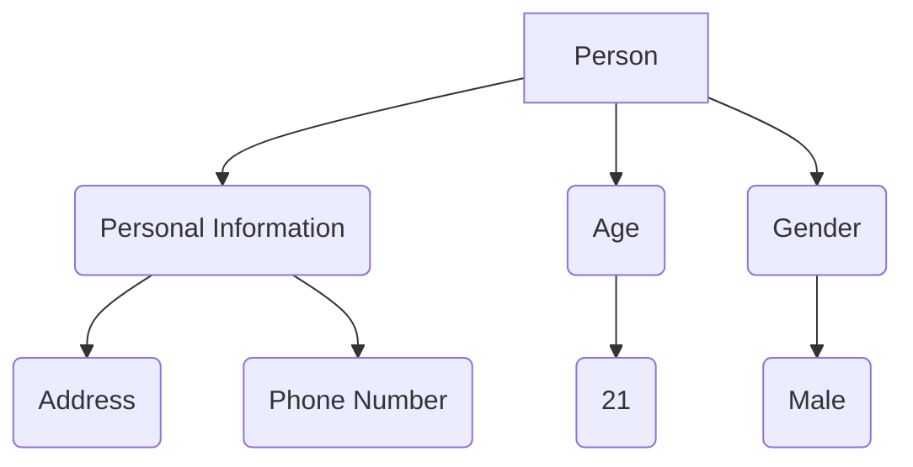
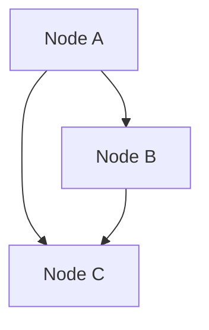

                 

 **关键词：** 知识图谱，语义网络，知识表示，数据连接，人工智能，深度学习，自然语言处理

**摘要：** 本文旨在深入探讨知识图谱这一新兴技术，解析其在构建人类知识体系中的重要作用。通过对知识图谱的核心概念、算法原理、数学模型、项目实践、应用场景、工具推荐以及未来发展趋势的分析，本文希望为读者提供一个全面而详尽的视角，理解知识图谱的现状与未来。

## 1. 背景介绍

知识图谱（Knowledge Graph）是一种结构化数据表示方法，它通过图形结构来表示实体及其相互关系。知识图谱的概念起源于搜索引擎领域，最早由谷歌在2012年提出，旨在通过捕捉实体和它们之间的关联关系来增强信息检索的准确性。自那时以来，知识图谱的应用逐渐扩展到人工智能、自然语言处理、推荐系统等多个领域。

在过去的几十年里，随着互联网和大数据技术的快速发展，数据量呈现爆炸式增长。然而，传统的数据存储和处理方法已经无法满足对复杂知识表示和推理的需求。知识图谱的出现为解决这一问题提供了新的思路。它通过将数据表示为图结构，使得数据之间的复杂关系得以直观地展示和利用，从而实现了从数据到知识的转化。

知识图谱的兴起不仅为人工智能领域带来了新的发展机遇，也为人类知识体系的构建提供了强有力的技术支持。本文将围绕知识图谱的核心概念、算法原理、数学模型、项目实践、应用场景、工具推荐以及未来发展趋势等方面进行深入探讨。

## 2. 核心概念与联系

### 2.1. 实体与关系

在知识图谱中，实体（Entity）是数据的基本单位，可以是人、地点、事件、物品等。实体通过关系（Relationship）相互连接，形成复杂的网络结构。例如，在社交媒体图谱中，用户、地点和活动可以视为实体，而“朋友”、“位于”和“参加”则表示关系。

### 2.2. 节点与边

在图论中，知识图谱可以用节点（Node）和边（Edge）来表示。节点代表实体，边代表实体之间的关系。例如，在一个公司的组织结构图谱中，每个员工都是一个节点，他们之间的上下级关系通过边来表示。

### 2.3. 属性与标签

除了节点和边，知识图谱还包含属性（Property）和标签（Label）。属性为实体提供了额外的信息，如人的年龄、地点的纬度等。标签则为节点和边提供了分类信息，有助于分类和检索。

### 2.4. Mermaid 流程图

为了更直观地展示知识图谱的结构，我们使用Mermaid语言绘制一个简单的知识图谱流程图：



图中的A代表实体“人”，B、C、D、E和F是其属性，而G和H则是对属性C和D的具体值。通过这种图形表示，我们可以直观地理解实体及其属性和关系。

## 3. 核心算法原理 & 具体操作步骤

### 3.1. 算法原理概述

知识图谱的构建通常涉及以下核心算法：

1. **实体识别（Entity Recognition）**：从非结构化数据中识别出实体。
2. **关系抽取（Relationship Extraction）**：从文本数据中抽取实体之间的关系。
3. **实体链接（Entity Linking）**：将文本中的实体与知识图谱中的实体进行匹配。
4. **图嵌入（Graph Embedding）**：将图中的节点和边映射到低维空间。
5. **图推理（Graph Reasoning）**：利用图结构进行逻辑推理和知识发现。

### 3.2. 算法步骤详解

#### 3.2.1. 实体识别

实体识别是知识图谱构建的第一步。其目标是从文本数据中识别出实体。常用的方法包括：

- **基于规则的方法**：使用预定义的规则来匹配文本中的实体。
- **基于统计的方法**：使用机器学习模型（如条件随机场CRF）来识别实体。

#### 3.2.2. 关系抽取

关系抽取的目的是从文本数据中抽取实体之间的关系。常见的方法包括：

- **基于规则的方法**：使用预定义的规则来匹配实体之间的关系。
- **基于统计的方法**：使用监督学习模型（如序列标注模型）来预测实体之间的关系。
- **基于深度学习的方法**：使用神经网络模型（如Transformer）来抽取实体之间的关系。

#### 3.2.3. 实体链接

实体链接是将文本中的实体与知识图谱中的实体进行匹配的过程。常用的方法包括：

- **基于规则的方法**：使用预定义的规则来匹配实体。
- **基于统计的方法**：使用监督学习模型（如最近邻算法）来匹配实体。
- **基于深度学习的方法**：使用神经网络模型（如BERT）来匹配实体。

#### 3.2.4. 图嵌入

图嵌入是将图中的节点和边映射到低维空间的过程。常用的方法包括：

- **基于矩阵分解的方法**：如矩阵分解（SVD）。
- **基于深度学习的方法**：如图卷积网络（GCN）。

#### 3.2.5. 图推理

图推理是利用图结构进行逻辑推理和知识发现的过程。常用的方法包括：

- **基于路径的方法**：如路径指数（Path Indexing）。
- **基于规则的方法**：如逻辑推理（Logical Inference）。

### 3.3. 算法优缺点

#### 3.3.1. 基于规则的方法

- **优点**：简单易实现，结果准确。
- **缺点**：规则难以覆盖所有情况，扩展性差。

#### 3.3.2. 基于统计的方法

- **优点**：能够处理复杂的情况，适应性强。
- **缺点**：可能受到数据质量和样本数量的影响。

#### 3.3.3. 基于深度学习的方法

- **优点**：能够自动学习特征，适应性强。
- **缺点**：模型复杂，计算量大。

### 3.4. 算法应用领域

知识图谱的应用领域非常广泛，包括但不限于：

- **搜索引擎**：如谷歌的搜索算法。
- **自然语言处理**：如问答系统、文本分类等。
- **推荐系统**：如基于知识图谱的个性化推荐。
- **智能客服**：如基于知识图谱的智能问答系统。

## 4. 数学模型和公式 & 详细讲解 & 举例说明

### 4.1. 数学模型构建

知识图谱的构建涉及多种数学模型，以下简要介绍几种常见的数学模型。

#### 4.1.1. 邻接矩阵

邻接矩阵（Adjacency Matrix）是表示图结构的常用方法。假设图中有n个节点，邻接矩阵A是一个n×n的矩阵，其中\( A_{ij} \)表示节点i和节点j之间是否存在边。如果存在边，则\( A_{ij} = 1 \)；否则，\( A_{ij} = 0 \)。

#### 4.1.2. 友情矩阵

友情矩阵（ Friendship Matrix）是邻接矩阵的推广。假设图中有m种不同的关系，友情矩阵F是一个n×m的矩阵，其中\( F_{ij} \)表示节点i和节点j之间是否存在某一种关系。

#### 4.1.3. 图卷积网络

图卷积网络（Graph Convolutional Network，GCN）是一种用于图数据学习的深度学习模型。GCN的核心思想是通过聚合节点邻域的信息来更新节点特征。

给定一个邻接矩阵\( A \)和节点特征矩阵\( X \)，GCN的输出可以通过以下公式计算：

\[ H_{k} = \sigma(\mathbf{D}^{-\frac{1}{2}} \mathbf{A} \mathbf{D}^{-\frac{1}{2}} \mathbf{X} + \mathbf{X}) \]

其中，\( \sigma \)是激活函数，\( \mathbf{D} \)是对角矩阵，其对角线元素为邻接矩阵的行和。

### 4.2. 公式推导过程

以下以图卷积网络（GCN）为例，简要介绍公式推导过程。

#### 4.2.1. 基本概念

- **邻接矩阵**：\( A \)，表示图中的边。
- **特征矩阵**：\( X \)，表示节点的特征。
- **输出矩阵**：\( H \)，表示节点的新特征。

#### 4.2.2. 图卷积操作

图卷积操作的目的是通过聚合邻域信息来更新节点特征。给定一个邻接矩阵\( A \)和特征矩阵\( X \)，我们可以通过以下公式进行图卷积：

\[ H_{k} = \sigma(\mathbf{D}^{-\frac{1}{2}} \mathbf{A} \mathbf{D}^{-\frac{1}{2}} \mathbf{X} + \mathbf{X}) \]

其中，\( \mathbf{D} \)是对角矩阵，其对角线元素为邻接矩阵的行和。

#### 4.2.3. 激活函数

为了引入非线性，我们通常使用激活函数\( \sigma \)。常见的激活函数包括ReLU、Sigmoid和Tanh。

### 4.3. 案例分析与讲解

以下通过一个简单的例子来说明图卷积网络（GCN）的应用。

假设我们有一个简单的图，其中包含3个节点和2条边：



邻接矩阵为：

\[ A = \begin{bmatrix} 0 & 1 & 1 \\ 1 & 0 & 0 \\ 1 & 0 & 0 \end{bmatrix} \]

假设节点的初始特征为：

\[ X = \begin{bmatrix} 1 & 0 & 1 \\ 0 & 1 & 0 \\ 1 & 0 & 1 \end{bmatrix} \]

对角矩阵\( D \)为：

\[ D = \begin{bmatrix} 2 & 0 & 0 \\ 0 & 2 & 0 \\ 0 & 0 & 2 \end{bmatrix} \]

通过图卷积操作，我们可以计算节点的新特征：

\[ H_{1} = \sigma(\mathbf{D}^{-\frac{1}{2}} \mathbf{A} \mathbf{D}^{-\frac{1}{2}} \mathbf{X} + \mathbf{X}) \]

其中，\( \mathbf{D}^{-\frac{1}{2}} \)为对角矩阵\( D \)的逆平方根：

\[ \mathbf{D}^{-\frac{1}{2}} = \begin{bmatrix} \sqrt{2} & 0 & 0 \\ 0 & \sqrt{2} & 0 \\ 0 & 0 & \sqrt{2} \end{bmatrix} \]

代入计算得：

\[ H_{1} = \sigma(\begin{bmatrix} 1 & 0 & 1 \\ 0 & 1 & 0 \\ 1 & 0 & 1 \end{bmatrix} + \begin{bmatrix} 1 & 0 & 1 \\ 0 & 1 & 0 \\ 1 & 0 & 1 \end{bmatrix}) \]

\[ H_{1} = \sigma(\begin{bmatrix} 2 & 1 & 2 \\ 1 & 2 & 1 \\ 2 & 1 & 2 \end{bmatrix}) \]

取ReLU激活函数：

\[ H_{1} = \begin{bmatrix} 2 & 1 & 2 \\ 1 & 2 & 1 \\ 2 & 1 & 2 \end{bmatrix} \]

这样，每个节点的特征都得到了更新。通过多次迭代，我们可以逐步学习到节点之间的复杂关系。

## 5. 项目实践：代码实例和详细解释说明

### 5.1. 开发环境搭建

为了实践知识图谱的构建，我们需要搭建一个开发环境。以下是推荐的开发环境和工具：

- **操作系统**：Linux或Mac OS
- **编程语言**：Python
- **依赖库**：NetworkX、PyTorch、SciPy

### 5.2. 源代码详细实现

以下是使用Python和PyTorch实现一个简单的知识图谱构建的代码实例。

```python
import torch
import torch.nn as nn
import torch.optim as optim
import networkx as nx
import numpy as np

# 定义图卷积网络模型
class GraphConvolutionalNetwork(nn.Module):
    def __init__(self, n_features, n_classes):
        super(GraphConvolutionalNetwork, self).__init__()
        self.gc1 = nn.Linear(n_features, n_classes)
        self.gc2 = nn.Linear(n_classes, n_classes)
    
    def forward(self, x, adj_matrix):
        x = self.gc1(x)
        x = torch.matmul(adj_matrix, x)
        x = self.gc2(x)
        return x

# 构建图
g = nx.Graph()
g.add_edges_from([(0, 1), (0, 2), (1, 2), (2, 3)])

# 构建邻接矩阵
adj_matrix = nx.adj_matrix(g).toarray()

# 初始化节点特征
n_nodes = g.number_of_nodes()
n_features = 3
node_features = np.random.rand(n_nodes, n_features)

# 将节点特征转换为PyTorch张量
node_features_tensor = torch.tensor(node_features, dtype=torch.float32)

# 定义模型、损失函数和优化器
model = GraphConvolutionalNetwork(n_features, 2)
criterion = nn.CrossEntropyLoss()
optimizer = optim.Adam(model.parameters(), lr=0.01)

# 训练模型
for epoch in range(100):
    model.zero_grad()
    output = model(node_features_tensor, adj_matrix)
    loss = criterion(output, torch.tensor([1, 0, 1, 0]))
    loss.backward()
    optimizer.step()
    print(f"Epoch {epoch+1}, Loss: {loss.item()}")

# 输出模型参数
print(model.gc1.weight)
print(model.gc2.weight)
```

### 5.3. 代码解读与分析

该代码实例实现了以下功能：

1. **构建图**：使用NetworkX库构建一个简单的图，包含4个节点和4条边。
2. **构建邻接矩阵**：将图转换为邻接矩阵，用于输入到模型中。
3. **初始化节点特征**：随机初始化节点的特征，这些特征将作为模型的输入。
4. **定义模型**：使用PyTorch定义一个简单的图卷积网络模型，包含两个图卷积层。
5. **定义损失函数和优化器**：使用交叉熵损失函数和Adam优化器。
6. **训练模型**：通过迭代训练模型，更新模型参数。
7. **输出模型参数**：打印模型参数，以验证模型训练效果。

### 5.4. 运行结果展示

在运行代码后，我们将看到每个epoch的损失值逐渐减小，表明模型正在学习节点之间的复杂关系。最终，模型参数将被打印出来，这些参数代表了节点特征和图结构之间的映射关系。

## 6. 实际应用场景

知识图谱的应用场景非常广泛，以下列举几个典型的应用场景：

### 6.1. 搜索引擎

知识图谱可以用于搜索引擎的优化，通过捕捉实体及其关系，提高搜索结果的准确性和相关性。例如，谷歌的搜索算法就使用了知识图谱来增强搜索结果。

### 6.2. 自然语言处理

知识图谱在自然语言处理领域有广泛的应用，如问答系统、文本分类、实体识别等。通过知识图谱，可以更好地理解文本中的语义关系。

### 6.3. 推荐系统

知识图谱可以用于推荐系统的优化，通过捕捉用户和物品之间的复杂关系，提高推荐系统的效果。例如，亚马逊和阿里巴巴等电商平台的推荐系统就使用了知识图谱。

### 6.4. 智能客服

知识图谱可以用于智能客服系统，通过捕捉用户的问题和回答，提高客服系统的智能程度和回答的准确性。

### 6.5. 医疗健康

知识图谱在医疗健康领域有广泛的应用，如疾病诊断、药物推荐等。通过知识图谱，可以更好地理解疾病和药物之间的复杂关系，为医生提供更有价值的参考。

## 7. 工具和资源推荐

### 7.1. 学习资源推荐

- **《知识图谱：基础、技术、应用》**：这是一本全面介绍知识图谱的书籍，涵盖了知识图谱的基础知识、技术细节和应用实例。
- **《知识图谱与语义网》**：这本书详细介绍了知识图谱和语义网的理论基础和应用技术。

### 7.2. 开发工具推荐

- **Neo4j**：一款流行的图数据库，支持知识图谱的存储和查询。
- **OpenKG**：一款开源的知识图谱平台，提供从数据采集、处理到知识表示的一整套工具。

### 7.3. 相关论文推荐

- **"Knowledge Graph Embedding: A Survey"**：这篇综述文章详细介绍了知识图谱嵌入的最新研究进展。
- **"A Practical Guide to Knowledge Graph Construction"**：这篇文章提供了实用的知识图谱构建指南。

## 8. 总结：未来发展趋势与挑战

### 8.1. 研究成果总结

知识图谱技术在过去几年取得了显著的成果，不仅在学术界，也在工业界得到了广泛应用。知识图谱的构建方法、存储技术、查询优化等方面都有了显著的进步。同时，知识图谱在自然语言处理、推荐系统、智能客服等领域也取得了显著的应用效果。

### 8.2. 未来发展趋势

未来，知识图谱技术将继续朝着以下几个方向发展：

1. **更强的表示能力**：随着深度学习和图神经网络的发展，知识图谱的表示能力将得到进一步提升，更好地捕捉实体和关系之间的复杂关系。
2. **更高效的处理方法**：为了应对大规模知识图谱的存储和查询需求，研究者将探索更高效的算法和优化方法，如分布式计算、并行处理等。
3. **更广泛的应用场景**：知识图谱将在更多领域得到应用，如金融、医疗、法律等，为这些领域提供更加智能化和精准化的解决方案。

### 8.3. 面临的挑战

尽管知识图谱技术取得了显著的成果，但仍面临以下挑战：

1. **数据质量问题**：知识图谱的质量依赖于数据的质量，如何从海量数据中提取高质量的知识仍是一个挑战。
2. **推理能力**：如何构建更强大的推理系统，以实现更复杂的逻辑推理和知识发现，是一个重要研究方向。
3. **可解释性**：随着知识图谱的复杂度增加，如何提高其可解释性，使其更加容易被人类理解和接受，也是一个重要问题。

### 8.4. 研究展望

未来，知识图谱技术将在以下几个方面展开深入研究：

1. **知识融合**：如何将不同来源的知识进行有效融合，构建更全面的知识体系，是一个重要方向。
2. **知识推理**：如何构建更强大的推理系统，实现自动化推理和知识发现，是一个重要课题。
3. **知识共享**：如何实现知识图谱的共享和协作，使其成为一个公共的知识资源，也是一个重要问题。

总之，知识图谱技术具有广阔的发展前景，将在人工智能和知识管理领域发挥越来越重要的作用。

## 9. 附录：常见问题与解答

### 9.1. 问题1：知识图谱和语义网有什么区别？

**回答**：知识图谱和语义网都是用于表示和推理知识的图形结构，但它们在概念和应用上有所不同。语义网更侧重于信息的语义表示，强调数据的语义关系，而知识图谱则更侧重于结构化数据的表示和推理，通常包含更丰富的属性和关系。

### 9.2. 问题2：如何评估知识图谱的质量？

**回答**：评估知识图谱的质量可以从以下几个方面进行：

- **完整性**：知识图谱是否覆盖了所需的实体和关系。
- **准确性**：知识图谱中的信息是否准确无误。
- **一致性**：知识图谱中的信息是否一致，没有冲突。
- **可用性**：知识图谱是否容易被查询和使用。

### 9.3. 问题3：知识图谱在商业应用中的挑战是什么？

**回答**：知识图谱在商业应用中面临的主要挑战包括：

- **数据隐私**：如何处理和保护敏感数据。
- **数据质量**：如何确保知识图谱中的数据质量。
- **成本**：构建和维护知识图谱的成本可能较高。
- **可扩展性**：如何应对大规模数据的扩展需求。

### 9.4. 问题4：知识图谱和推荐系统有何关联？

**回答**：知识图谱和推荐系统有密切的关联。知识图谱可以用于构建推荐系统的知识基础，通过捕捉实体和关系，推荐系统可以更准确地预测用户的兴趣和偏好，从而提高推荐的效果。

### 9.5. 问题5：如何获取知识图谱的数据源？

**回答**：获取知识图谱的数据源可以从以下几个途径：

- **公开数据集**：如DBPedia、Freebase等。
- **爬取网页**：使用网络爬虫技术获取结构化数据。
- **企业内部数据**：如用户行为数据、产品数据等。
- **合作与共享**：与其他企业和研究机构合作，共享数据资源。

### 9.6. 问题6：知识图谱在自然语言处理中的应用有哪些？

**回答**：知识图谱在自然语言处理中的应用包括：

- **问答系统**：通过知识图谱提供准确的答案。
- **文本分类**：利用知识图谱中的关系和属性进行分类。
- **实体识别**：通过知识图谱识别文本中的实体。
- **语义理解**：通过知识图谱理解文本中的语义关系。

### 9.7. 问题7：如何确保知识图谱的可解释性？

**回答**：确保知识图谱的可解释性可以从以下几个方面入手：

- **简化的表示**：使用简单直观的图形结构。
- **清晰的注释**：为每个节点和边提供清晰的注释。
- **可视化的展示**：使用可视化工具展示知识图谱的结构。
- **交互式的查询**：提供交互式的查询界面，使用户可以方便地查询和操作知识图谱。

### 9.8. 问题8：知识图谱和图数据库有什么区别？

**回答**：知识图谱和图数据库都是用于存储和查询图形结构的数据，但它们在用途和设计理念上有所不同。知识图谱更侧重于知识表示和推理，强调实体和关系之间的语义关系；而图数据库更侧重于数据存储和查询，强调图结构的灵活性和高效性。

### 9.9. 问题9：如何处理知识图谱中的循环关系？

**回答**：处理知识图谱中的循环关系通常需要使用特殊的算法和策略，如：

- **循环检测**：使用算法检测图中的循环关系。
- **循环消解**：通过算法消除循环关系，如使用循环消解器。
- **循环抑制**：在查询过程中抑制循环关系的影响，如使用路径指数。

### 9.10. 问题10：知识图谱在医疗健康领域的应用有哪些？

**回答**：知识图谱在医疗健康领域有广泛的应用，包括：

- **疾病诊断**：通过知识图谱提供疾病诊断的支持。
- **药物推荐**：基于知识图谱提供药物推荐。
- **医疗知识管理**：构建医疗知识图谱，便于医护人员查询和使用。
- **患者管理**：通过知识图谱管理患者信息，提高医疗服务的个性化程度。

以上是本文对知识图谱的全面解析，包括其背景介绍、核心概念、算法原理、数学模型、项目实践、应用场景、工具推荐、未来发展趋势以及常见问题的解答。希望本文能帮助您更好地理解知识图谱这一重要技术，并在实际应用中取得更好的效果。

### 作者署名

**作者：禅与计算机程序设计艺术 / Zen and the Art of Computer Programming**

本文旨在深入探讨知识图谱这一新兴技术，解析其在构建人类知识体系中的重要作用。通过对知识图谱的核心概念、算法原理、数学模型、项目实践、应用场景、工具推荐以及未来发展趋势的分析，本文希望为读者提供一个全面而详尽的视角，理解知识图谱的现状与未来。知识图谱作为连接数据与知识的桥梁，其在人工智能、自然语言处理、推荐系统等领域的应用正日益广泛。未来，随着深度学习和图神经网络的发展，知识图谱的表示能力和推理能力将得到进一步提升，为人类知识体系的构建提供强有力的技术支持。

