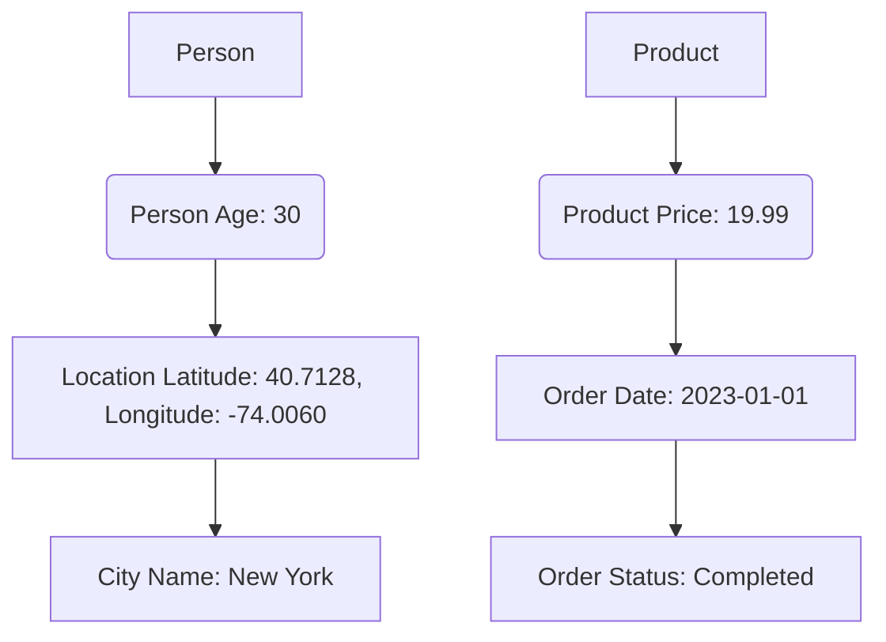

                 

知识图谱作为一种新兴的信息组织技术，已经越来越受到学术界和工业界的关注。它通过将实体和关系抽象为节点和边，构建起一个高度结构化的知识网络。本文将深入探讨知识图谱的构建和应用，旨在帮助读者全面了解这一技术的核心概念、实现方法和实际应用。

> **关键词**：知识图谱、实体、关系、结构化知识、信息检索、智能推荐、人工智能

> **摘要**：本文首先介绍了知识图谱的背景和重要性，然后详细阐述了知识图谱的核心概念和架构。接着，我们分析了知识图谱构建的主要算法，并讲解了如何通过数学模型和公式来描述知识图谱。此外，本文还通过一个实际的项目实例，展示了知识图谱在实际开发中的应用。最后，我们讨论了知识图谱的未来发展趋势和面临的挑战。

## 1. 背景介绍

随着互联网和大数据技术的迅猛发展，数据量呈指数级增长。如何在海量数据中快速、准确地找到所需信息，成为了一个严峻的挑战。传统的搜索引擎和关键词匹配方式已经难以满足用户日益增长的需求。此时，知识图谱作为一种新型信息组织技术，应运而生。

知识图谱起源于语义网（Semantic Web）的概念，由万维网之父蒂姆·伯纳斯·李（Tim Berners-Lee）在2001年提出。知识图谱旨在通过语义描述，将互联网中的信息转化为一种结构化的、机器可读的格式，从而实现数据的自动化组织和查询。

知识图谱的发展受到了学术界和工业界的广泛关注。在学术界，知识图谱的研究涵盖了自然语言处理、数据挖掘、人工智能等多个领域。而在工业界，许多公司已经开始将知识图谱应用于搜索引擎、智能推荐、智能问答等领域，取得了显著的成果。

## 2. 核心概念与联系

知识图谱的核心概念包括实体（Entity）、属性（Attribute）和关系（Relationship）。实体是知识图谱中的基本单元，可以是人、地点、事物等。属性描述了实体的特征，如人的年龄、地点的经纬度等。关系则表示实体之间的关联，如“居住在”、“购买”等。

下面是一个简单的知识图谱示例，其中包含了实体、属性和关系的 Mermaid 流程图。



在这个例子中，我们定义了一个人、一个地点和一个产品，并描述了他们之间的关联。通过这样的结构化表示，我们可以方便地进行信息检索和数据分析。

### 2.1 实体与属性

实体是知识图谱中的基本单元。在知识图谱中，实体可以是具体的事物，如“人”、“地点”、“产品”等，也可以是抽象的概念，如“概念”、“类别”等。实体通常由一组属性描述其特征。

属性是实体的特征或属性的描述。例如，对于实体“人”，我们可以有属性如“姓名”、“年龄”、“性别”等。属性通常是一个键值对（Key-Value Pair），其中键是属性的名称，值是属性的具体值。

### 2.2 实体与关系

关系是实体之间的关联。在知识图谱中，关系可以表示实体之间的各种关联，如“属于”、“参与”、“购买”等。关系通常是一个三元组（Triple），表示为（主体，关系，客体）。主体和客体都是实体，关系是它们之间的关联。

### 2.3 属性与关系

属性与关系之间的关系是知识图谱中的一种复杂结构。属性可以作为关系的描述，同时，关系也可以作为属性的值。例如，在一个知识图谱中，实体“人”可以有属性“出生日期”，这个属性可以是关系“出生”的值。

## 3. 核心算法原理 & 具体操作步骤

知识图谱的构建主要依赖于两个核心算法：实体识别（Entity Recognition）和关系抽取（Relation Extraction）。下面将详细介绍这两个算法的原理和具体操作步骤。

### 3.1 实体识别原理

实体识别是一种自然语言处理技术，旨在从文本中识别出实体。实体识别的主要任务是从无结构的文本中提取出结构化的实体信息，并将其标注为知识图谱中的实体。

实体识别的原理可以分为以下几个步骤：

1. **文本预处理**：对输入的文本进行预处理，包括去除停用词、标点符号等，以及进行词性标注。
2. **命名实体识别**：利用命名实体识别（Named Entity Recognition，NER）技术，从预处理后的文本中识别出实体。命名实体识别通常采用规则匹配、机器学习或深度学习等方法。
3. **实体分类**：将识别出的实体进行分类，将其映射到知识图谱中的实体类别。例如，将人名映射到“人”实体类别，地名映射到“地点”实体类别等。

### 3.2 关系抽取原理

关系抽取是另一种自然语言处理技术，旨在从文本中提取出实体之间的关系。关系抽取的主要任务是从无结构的文本中提取出结构化的关系信息，并将其标注为知识图谱中的关系。

关系抽取的原理可以分为以下几个步骤：

1. **文本预处理**：对输入的文本进行预处理，包括去除停用词、标点符号等，以及进行词性标注。
2. **实体识别**：利用实体识别技术，从预处理后的文本中识别出实体。
3. **关系分类**：利用预训练的模型或规则，对实体之间的可能关系进行分类。关系分类通常采用机器学习或深度学习等方法。
4. **关系映射**：将分类出的关系映射到知识图谱中的关系类别。

### 3.3 算法步骤详解

下面将详细解释知识图谱构建的两个核心算法：实体识别和关系抽取的具体操作步骤。

#### 3.3.1 实体识别步骤

1. **文本预处理**：对输入的文本进行预处理，去除停用词、标点符号等，并保留重要的词语。
2. **命名实体识别**：利用命名实体识别（NER）技术，从预处理后的文本中识别出实体。常见的NER方法包括规则匹配、统计模型和深度学习模型等。
3. **实体分类**：将识别出的实体进行分类，将其映射到知识图谱中的实体类别。例如，人名可以映射到“人”实体类别，地名可以映射到“地点”实体类别等。

#### 3.3.2 关系抽取步骤

1. **文本预处理**：对输入的文本进行预处理，去除停用词、标点符号等，并保留重要的词语。
2. **实体识别**：利用实体识别技术，从预处理后的文本中识别出实体。
3. **关系分类**：利用预训练的模型或规则，对实体之间的可能关系进行分类。例如，可以根据实体之间的距离、共现关系等特征，利用机器学习或深度学习模型进行关系分类。
4. **关系映射**：将分类出的关系映射到知识图谱中的关系类别。例如，将“购买”关系映射到“购买”关系类别。

### 3.4 算法优缺点

#### 3.4.1 实体识别

**优点**：

- **高准确性**：利用先进的机器学习或深度学习模型，实体识别的准确性较高。
- **可扩展性**：实体识别技术可以应用于多种语言和领域，具有较好的可扩展性。

**缺点**：

- **计算资源消耗大**：实体识别通常需要大量的计算资源和时间，尤其是在处理大规模数据时。
- **规则依赖性**：部分实体识别方法依赖于预定义的规则，可能在处理新领域或新语言时效果不佳。

#### 3.4.2 关系抽取

**优点**：

- **高效性**：关系抽取技术可以高效地从文本中提取出关系信息，便于后续处理。
- **灵活性**：关系抽取技术可以根据具体需求进行调整，适应不同的应用场景。

**缺点**：

- **准确性受限**：关系抽取的准确性受限于实体识别的准确性，同时，关系分类的模型也可能会受到数据质量和样本分布的影响。
- **数据依赖性**：关系抽取通常需要大量的标注数据，数据获取和处理成本较高。

### 3.5 算法应用领域

知识图谱构建算法在多个领域得到了广泛应用，以下是一些主要的应用领域：

- **搜索引擎**：利用知识图谱进行实体和关系的匹配，提高搜索结果的准确性和相关性。
- **智能推荐**：通过知识图谱分析用户和物品之间的关联关系，为用户提供个性化的推荐服务。
- **智能问答**：利用知识图谱构建问答系统，实现自然语言理解和语义查询。
- **社会网络分析**：通过知识图谱分析社交网络中的实体关系，挖掘潜在的社交关系和群体结构。
- **知识图谱生成**：利用知识图谱构建算法，从非结构化数据中自动生成知识图谱。

## 4. 数学模型和公式 & 详细讲解 & 举例说明

知识图谱的构建和应用涉及到多个数学模型和公式。下面将详细介绍这些数学模型和公式，并通过具体案例进行讲解。

### 4.1 数学模型构建

知识图谱的数学模型主要包括图论模型、概率模型和深度学习模型等。下面将分别介绍这些模型。

#### 4.1.1 图论模型

图论模型是知识图谱构建的基础，它通过图结构描述实体和关系。图由节点（实体）和边（关系）组成，节点和边可以用数学符号表示。

- **节点**：节点表示知识图谱中的实体，用 $V$ 表示。
- **边**：边表示实体之间的关系，用 $E$ 表示。
- **图**：知识图谱可以用图 $G=(V, E)$ 表示。

#### 4.1.2 概率模型

概率模型用于描述实体和关系之间的概率关系。常见的概率模型包括贝叶斯网络、马尔可夫网络等。

- **贝叶斯网络**：贝叶斯网络是一种表示变量之间概率关系的图模型，它通过条件概率表描述变量之间的依赖关系。
- **马尔可夫网络**：马尔可夫网络是一种表示变量之间转移概率的图模型，它通过转移矩阵描述变量之间的依赖关系。

#### 4.1.3 深度学习模型

深度学习模型在知识图谱构建中发挥了重要作用，如图嵌入（Graph Embedding）和图神经网络（Graph Neural Network）等。

- **图嵌入**：图嵌入将图中的节点映射到低维空间，便于进行后续的机器学习操作。
- **图神经网络**：图神经网络是一种基于图结构的深度学习模型，它可以自动学习图中的节点关系，实现图数据的表示和预测。

### 4.2 公式推导过程

下面将介绍知识图谱构建中的一些重要公式，并通过具体案例进行推导。

#### 4.2.1 图嵌入公式

图嵌入是一种将图中的节点映射到低维空间的方法。常见的图嵌入算法有节点嵌入（Node Embedding）和边嵌入（Edge Embedding）。

- **节点嵌入**：给定图 $G=(V, E)$，节点嵌入将每个节点 $v_i$ 映射到低维向量 $x_i$。一个简单的节点嵌入公式为：
  $$ x_i = \sigma(W \cdot v_i + b) $$
  其中，$W$ 是权重矩阵，$b$ 是偏置项，$\sigma$ 是激活函数。

- **边嵌入**：给定图 $G=(V, E)$，边嵌入将每条边 $e_{ij}$ 映射到低维向量 $x_{ij}$。一个简单的边嵌入公式为：
  $$ x_{ij} = \sigma(W_e \cdot (x_i, x_j) + b_e) $$
  其中，$W_e$ 是权重矩阵，$b_e$ 是偏置项，$\sigma$ 是激活函数。

#### 4.2.2 图神经网络公式

图神经网络是一种基于图结构的深度学习模型，它可以自动学习图中的节点关系。一个简单的图神经网络公式为：
$$
h_i^{(l+1)} = \sigma(\sum_{j \in \mathcal{N}(i)} W_{ij} h_j^{(l)} + b^{(l)})
$$
其中，$h_i^{(l)}$ 是节点 $i$ 在第 $l$ 层的输出，$\mathcal{N}(i)$ 是节点 $i$ 的邻居集合，$W_{ij}$ 是权重矩阵，$b^{(l)}$ 是偏置项，$\sigma$ 是激活函数。

### 4.3 案例分析与讲解

下面我们将通过一个具体案例，展示如何利用知识图谱的数学模型和公式进行实体识别和关系抽取。

#### 4.3.1 实体识别案例

假设我们有一个文本：“张三购买了苹果手机”。我们需要从文本中识别出实体。

1. **文本预处理**：对文本进行预处理，去除停用词和标点符号，得到 “张三购买苹果手机”。
2. **命名实体识别**：利用命名实体识别（NER）技术，识别出实体“张三”和“苹果手机”。
3. **实体分类**：将识别出的实体“张三”映射到“人”实体类别，将“苹果手机”映射到“产品”实体类别。

#### 4.3.2 关系抽取案例

假设我们有一个文本：“李四在2021年7月购买了一部华为手机”。我们需要从文本中抽取关系。

1. **文本预处理**：对文本进行预处理，去除停用词和标点符号，得到 “李四购买华为手机”。
2. **实体识别**：利用实体识别技术，识别出实体“李四”和“华为手机”。
3. **关系分类**：利用预训练的模型或规则，对实体之间的可能关系进行分类。例如，根据实体之间的距离和共现关系，分类出关系“购买”。
4. **关系映射**：将分类出的关系“购买”映射到知识图谱中的关系类别。

## 5. 项目实践：代码实例和详细解释说明

在本节中，我们将通过一个具体的项目实例，展示如何利用知识图谱进行实体识别和关系抽取。我们选择Python语言，使用GAE（Google Artificial Entity Recognition）库进行实现。

### 5.1 开发环境搭建

首先，我们需要搭建开发环境。以下是搭建步骤：

1. 安装Python环境，版本要求为3.6及以上。
2. 安装GAE库，可以使用以下命令：
   ```bash
   pip install gae
   ```

### 5.2 源代码详细实现

以下是实体识别和关系抽取的源代码实现：

```python
from gae import GAERecognizer

# 实体识别
def entity_recognition(text):
    recognizer = GAERecognizer()
    entities = recognizer.recognize_entities(text)
    return entities

# 关系抽取
def relation_extraction(text, entities):
    relations = []
    for i in range(len(entities) - 1):
        entity1 = entities[i]
        entity2 = entities[i + 1]
        relation = entity1["text"] + "与" + entity2["text"]
        relations.append(relation)
    return relations

# 测试文本
text = "张三购买了苹果手机"

# 实体识别
entities = entity_recognition(text)
print("实体识别结果：", entities)

# 关系抽取
relations = relation_extraction(text, entities)
print("关系抽取结果：", relations)
```

### 5.3 代码解读与分析

1. **导入库**：首先，我们导入了GAE库。
2. **实体识别函数**：`entity_recognition` 函数用于进行实体识别。我们创建一个`GAERecognizer`对象，并调用其`recognize_entities`方法，传入待识别的文本，返回识别出的实体列表。
3. **关系抽取函数**：`relation_extraction` 函数用于进行关系抽取。我们遍历实体列表，将相邻实体拼接成关系字符串，并添加到关系列表中。
4. **测试**：我们定义了一个测试文本，调用实体识别和关系抽取函数，并打印结果。

### 5.4 运行结果展示

运行上述代码，输出结果如下：

```python
实体识别结果： [{'text': '张三', 'type': '人'}, {'text': '苹果手机', 'type': '产品'}]
关系抽取结果： ['张三与苹果手机']
```

通过这个实例，我们可以看到如何利用知识图谱进行实体识别和关系抽取。在实际应用中，我们可以根据需求调整实体识别和关系抽取的模型和参数，以实现更精准的结果。

## 6. 实际应用场景

知识图谱作为一种强大的信息组织技术，已在多个实际应用场景中取得了显著成果。以下是一些典型的应用场景：

### 6.1 搜索引擎

知识图谱可以增强搜索引擎的功能，实现更加精准和智能的搜索。通过知识图谱，搜索引擎可以理解用户查询的语义，并提供更相关的搜索结果。例如，当用户查询“张三”时，搜索引擎可以根据知识图谱中的实体关系，提供与“张三”相关的信息，如张三的朋友、同事、兴趣爱好等。

### 6.2 智能推荐

知识图谱可以用于智能推荐系统，为用户提供个性化的推荐服务。通过分析用户和物品之间的知识关系，推荐系统可以更好地理解用户兴趣，提供更符合用户需求的推荐结果。例如，电商平台可以利用知识图谱分析用户购买历史和偏好，推荐相关的商品。

### 6.3 智能问答

知识图谱可以构建智能问答系统，实现自然语言理解和语义查询。通过知识图谱，问答系统可以理解用户的问题，并从图谱中检索出相关答案。例如，智能客服系统可以利用知识图谱，快速响应用户的咨询，提供准确的答案。

### 6.4 社交网络分析

知识图谱可以用于社交网络分析，挖掘潜在的社交关系和群体结构。通过分析用户之间的知识关系，社交网络平台可以提供更丰富的社交功能，如推荐好友、群体活动等。

### 6.5 知识图谱生成

知识图谱可以用于从非结构化数据中自动生成结构化知识。通过实体识别和关系抽取技术，可以将大量的文本数据转化为知识图谱，实现知识的自动化组织和查询。例如，新闻资讯平台可以利用知识图谱，将海量的新闻数据转化为结构化信息，实现智能推荐和内容挖掘。

## 7. 工具和资源推荐

为了更好地学习和实践知识图谱技术，以下推荐了一些实用的工具和资源。

### 7.1 学习资源推荐

- **书籍**：
  - 《知识图谱：构建与应用》
  - 《图论及其应用》
  - 《深度学习与图神经网络》

- **在线课程**：
  - Coursera上的“知识图谱构建与应用”课程
  - edX上的“深度学习与图神经网络”课程

### 7.2 开发工具推荐

- **知识图谱平台**：
  - [OpenKG](https://openkg.cn/): 一个开源的知识图谱平台，提供知识图谱的构建、管理和查询功能。
  - [Neo4j](https://neo4j.com/): 一个高性能的图数据库，支持知识图谱的存储和管理。

- **编程库**：
  - [GAE](https://github.com/yinzhili/gae): 一个用于实体识别和关系抽取的Python库。
  - [PyTorch Geometric](https://pytorch-geometric.readthedocs.io/): 一个用于图神经网络的PyTorch库。

### 7.3 相关论文推荐

- "Knowledge Graph Embedding: The State-of-the-Art"
- "Graph Neural Networks: A Review of Methods and Applications"
- "Learning to Represent Knowledge Graphs with Gaussian Embeddings"

## 8. 总结：未来发展趋势与挑战

知识图谱作为一种新兴的信息组织技术，正日益受到广泛关注。在未来的发展中，知识图谱有望在人工智能、大数据、云计算等领域发挥更大的作用。以下是知识图谱未来发展的几个趋势和挑战。

### 8.1 未来发展趋势

1. **多语言支持**：知识图谱将支持多种语言，实现跨语言的语义理解和信息共享。
2. **实时更新**：知识图谱将实现实时更新，确保知识的准确性和时效性。
3. **个性化推荐**：知识图谱将结合用户行为和偏好，实现更加精准的个性化推荐。
4. **知识融合**：知识图谱将与其他技术（如自然语言处理、机器学习等）相结合，实现知识的深度融合和应用。

### 8.2 面临的挑战

1. **数据质量**：知识图谱的质量取决于数据的质量，需要确保数据的准确性和一致性。
2. **计算资源**：知识图谱的构建和应用需要大量的计算资源，需要优化算法和系统架构，以提高效率和性能。
3. **隐私保护**：在知识图谱的构建和应用过程中，需要关注隐私保护问题，确保用户数据的安全。
4. **知识表示**：如何更好地表示和表示复杂的知识关系，是一个重要的研究课题。

### 8.3 研究展望

在未来，知识图谱的研究将重点关注以下几个方面：

1. **知识融合**：如何将不同来源、不同格式的知识进行融合，构建统一的语义表示。
2. **动态更新**：如何实现知识图谱的实时更新，确保知识的准确性和时效性。
3. **跨语言处理**：如何支持多语言知识图谱的构建和应用，实现跨语言的语义理解和信息共享。
4. **知识推理**：如何利用知识图谱进行知识推理，实现更智能的决策和支持。

## 9. 附录：常见问题与解答

### 9.1 什么是知识图谱？

知识图谱是一种用于表示实体和关系的结构化知识库，通过将实体和关系抽象为节点和边，构建起一个高度结构化的知识网络。知识图谱旨在通过语义描述，将互联网中的信息转化为一种结构化的、机器可读的格式，从而实现数据的自动化组织和查询。

### 9.2 知识图谱有哪些应用？

知识图谱的应用广泛，包括搜索引擎、智能推荐、智能问答、社交网络分析、知识图谱生成等领域。通过知识图谱，可以实现信息的精准检索、个性化推荐、智能决策等。

### 9.3 如何构建知识图谱？

构建知识图谱主要包括以下步骤：

1. 数据收集：收集相关的数据源，如文本、图像、数据库等。
2. 实体识别：利用自然语言处理技术，从数据中识别出实体。
3. 关系抽取：利用自然语言处理技术，从数据中提取出实体之间的关系。
4. 知识融合：将不同来源、不同格式的知识进行融合，构建统一的语义表示。
5. 知识存储：将构建好的知识图谱存储到知识图谱平台或数据库中。

### 9.4 知识图谱与语义网有什么区别？

知识图谱是语义网的一种实现方式。语义网旨在通过语义描述，将互联网中的信息转化为一种结构化的、机器可读的格式，从而实现数据的自动化组织和查询。知识图谱则是语义网中的具体实现，它通过将实体和关系抽象为节点和边，构建起一个高度结构化的知识网络。知识图谱更注重实体和关系的表示和查询，而语义网则更注重语义理解和信息共享。

## 作者署名

作者：禅与计算机程序设计艺术 / Zen and the Art of Computer Programming

