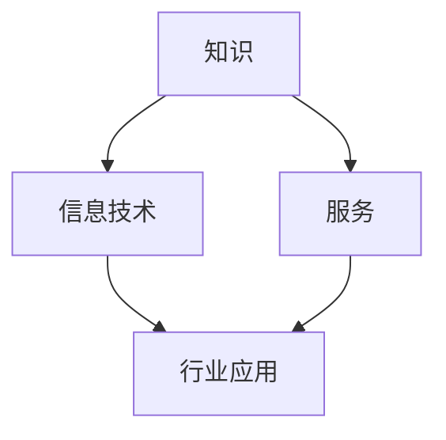
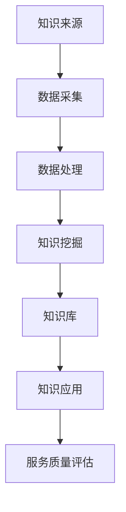
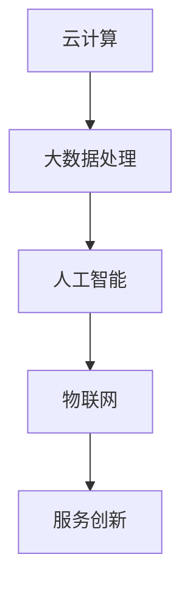

                 

关键词：知识密集型服务业、特征、信息技术、数据处理、行业应用、发展前景

> 摘要：本文深入探讨了知识密集型服务业的特征，分析了其在信息技术、数据处理和行业应用等方面的表现。通过详细的案例分析，本文旨在为知识密集型服务业的未来发展提供理论支持和实践指导。

## 1. 背景介绍

知识密集型服务业（Knowledge-intensive Service Industry，KISI）是指在信息技术高度发展的背景下，以知识为核心资源，以专业服务为主要形式，通过信息技术手段对信息资源进行采集、处理、存储和利用的服务行业。随着全球经济的转型升级，知识密集型服务业逐渐成为推动经济增长的重要动力。

知识密集型服务业的兴起，得益于以下几个方面的因素：

1. **信息技术的发展**：信息技术的飞速发展，特别是大数据、云计算、人工智能等技术的广泛应用，为知识密集型服务业的发展提供了强大的技术支撑。
2. **经济全球化**：经济全球化加速了知识流动和知识传播，知识密集型服务业在全球范围内的竞争力不断提高。
3. **服务需求多样化**：随着消费者需求的多样化和个性化，知识密集型服务业在提供专业化、个性化服务方面具有明显优势。

## 2. 核心概念与联系

知识密集型服务业的核心概念包括知识、信息技术、服务、行业应用等。以下是一个简化的 Mermaid 流程图，用以描述这些核心概念及其相互关系：



在这个流程图中，知识作为核心资源，通过信息技术手段进行采集、处理和利用，形成专业的服务，最终应用于各个行业。

### 2.1 知识的获取与利用

知识的获取与利用是知识密集型服务业的核心。以下是一个详细的 Mermaid 流程图，描述了知识的获取、处理和利用过程：



在这个流程中，数据采集是知识获取的基础，通过数据处理和知识挖掘，形成知识库，为知识应用提供支持。知识应用的结果又反过来影响服务质量评估，形成一个闭环。

### 2.2 信息技术的作用

信息技术在知识密集型服务业中起着至关重要的作用。以下是一个简化的 Mermaid 流程图，描述了信息技术在知识密集型服务业中的应用：



在这个流程中，云计算、大数据处理、人工智能和物联网等信息技术相互融合，为知识密集型服务业提供了强大的技术支撑，推动服务创新和行业应用。

## 3. 核心算法原理 & 具体操作步骤

### 3.1 算法原理概述

知识密集型服务业的核心算法主要包括数据挖掘、机器学习和自然语言处理等。以下是一个简单的算法原理概述：

- **数据挖掘**：通过对大量数据进行分析，发现数据中隐藏的模式和规律，为知识获取提供支持。
- **机器学习**：通过训练模型，让计算机自动识别和预测数据中的模式，提高知识处理的效率和准确性。
- **自然语言处理**：通过理解和生成自然语言，实现人与计算机的智能交互，提高知识应用的效果。

### 3.2 算法步骤详解

以下是知识密集型服务业中常见的算法步骤详解：

#### 3.2.1 数据挖掘

1. 数据采集：从各种数据源（如数据库、网络、传感器等）收集数据。
2. 数据预处理：对采集到的数据清洗、转换和整合，为数据挖掘做准备。
3. 特征提取：从预处理后的数据中提取有用的特征，用于数据挖掘。
4. 模型训练：使用特征提取后的数据训练模型，如决策树、支持向量机等。
5. 模型评估：评估模型的性能，选择最优模型。

#### 3.2.2 机器学习

1. 数据采集：与数据挖掘类似，从各种数据源收集数据。
2. 数据预处理：对采集到的数据进行预处理，为机器学习模型训练做准备。
3. 特征工程：选择和构造对模型训练有帮助的特征。
4. 模型训练：使用预处理后的数据进行模型训练，如神经网络、随机森林等。
5. 模型评估：评估模型性能，选择最优模型。
6. 模型优化：通过调整模型参数，提高模型性能。

#### 3.2.3 自然语言处理

1. 数据采集：收集大量的文本数据，如新闻报道、社交媒体帖子等。
2. 数据预处理：对文本数据进行清洗、分词和标注等处理，为自然语言处理做准备。
3. 模型训练：使用预处理后的文本数据进行模型训练，如词向量模型、循环神经网络等。
4. 模型评估：评估模型性能，选择最优模型。
5. 模型应用：将训练好的模型应用于实际场景，如文本分类、情感分析等。

### 3.3 算法优缺点

- **数据挖掘**：优点是能够从大量数据中发现隐藏的模式和规律，缺点是需要大量的数据处理和分析时间，对计算资源要求较高。
- **机器学习**：优点是能够自动发现数据中的模式，提高数据处理效率，缺点是需要大量的训练数据和计算资源。
- **自然语言处理**：优点是能够实现人与计算机的智能交互，提高知识应用效果，缺点是对大规模数据的处理能力有限。

### 3.4 算法应用领域

知识密集型服务业的核心算法广泛应用于各个领域，如金融、医疗、教育、电商等。以下是一个简单的应用领域分类：

- **金融领域**：风险控制、信用评估、投资分析等。
- **医疗领域**：疾病诊断、治疗方案推荐、药物研发等。
- **教育领域**：个性化教学、学习分析、考试评估等。
- **电商领域**：商品推荐、客户细分、营销策略等。

## 4. 数学模型和公式 & 详细讲解 & 举例说明

### 4.1 数学模型构建

在知识密集型服务业中，常用的数学模型包括线性回归、逻辑回归、决策树、支持向量机等。以下是一个简化的线性回归模型构建过程：

#### 4.1.1 线性回归模型

线性回归模型的基本形式如下：

$$
y = \beta_0 + \beta_1x_1 + \beta_2x_2 + ... + \beta_nx_n + \epsilon
$$

其中，$y$ 是因变量，$x_1, x_2, ..., x_n$ 是自变量，$\beta_0, \beta_1, \beta_2, ..., \beta_n$ 是模型参数，$\epsilon$ 是误差项。

#### 4.1.2 模型构建步骤

1. 数据采集：收集相关数据，如金融数据、医疗数据等。
2. 数据预处理：对数据进行清洗、转换和整合，为模型构建做准备。
3. 特征选择：选择对模型训练有帮助的特征，如财务指标、病历信息等。
4. 模型训练：使用特征选择后的数据训练线性回归模型。
5. 模型评估：评估模型性能，选择最优模型。

### 4.2 公式推导过程

以下是一个简化的线性回归模型推导过程：

假设我们有 $n$ 个样本点 $(x_1, y_1), (x_2, y_2), ..., (x_n, y_n)$，线性回归模型的损失函数为：

$$
J(\theta) = \frac{1}{2m} \sum_{i=1}^{m} (h_\theta(x^{(i)}) - y^{(i)})^2
$$

其中，$m$ 是样本数量，$h_\theta(x)$ 是线性回归模型的预测值，$\theta$ 是模型参数。

为了最小化损失函数 $J(\theta)$，我们对 $\theta$ 进行梯度下降：

$$
\theta_j := \theta_j - \alpha \frac{\partial}{\partial \theta_j} J(\theta)
$$

其中，$\alpha$ 是学习率。

### 4.3 案例分析与讲解

以下是一个金融领域的线性回归模型案例：

假设我们要预测某个公司的股票价格，数据集包含公司过去一年的财务指标（如营业收入、净利润等）和股票价格。以下是模型构建和预测的步骤：

1. 数据采集：从数据库或网络收集相关数据。
2. 数据预处理：对数据进行清洗、转换和整合，为模型构建做准备。
3. 特征选择：选择对模型训练有帮助的特征，如营业收入、净利润等。
4. 模型训练：使用特征选择后的数据训练线性回归模型。
5. 模型评估：评估模型性能，选择最优模型。
6. 预测：使用训练好的模型预测未来股票价格。

通过上述步骤，我们可以构建一个线性回归模型，预测公司未来股票价格。在实际应用中，我们可以根据预测结果调整投资策略，降低投资风险。

## 5. 项目实践：代码实例和详细解释说明

### 5.1 开发环境搭建

在本文的案例中，我们使用 Python 编写线性回归模型的代码。以下是开发环境搭建的步骤：

1. 安装 Python：从 [Python 官网](https://www.python.org/) 下载并安装 Python。
2. 安装 Jupyter Notebook：使用 pip 命令安装 Jupyter Notebook。

```bash
pip install notebook
```

3. 创建 Jupyter Notebook 文件：在命令行中输入以下命令，创建一个名为 "linear_regression.ipynb" 的 Jupyter Notebook 文件。

```bash
jupyter notebook linear_regression.ipynb
```

### 5.2 源代码详细实现

以下是线性回归模型的源代码实现：

```python
import numpy as np
import pandas as pd
from sklearn.linear_model import LinearRegression

# 数据采集
data = pd.read_csv("financial_data.csv")

# 数据预处理
X = data[['revenue', 'net_profit']]
y = data['stock_price']

# 特征选择
# 在这里，我们仅选择营业收入和净利润作为特征
X_selected = X[['revenue', 'net_profit']]

# 模型训练
model = LinearRegression()
model.fit(X_selected, y)

# 模型评估
score = model.score(X_selected, y)
print("Model R^2 Score:", score)

# 预测
predicted_price = model.predict(X_selected)
print("Predicted Stock Price:", predicted_price)
```

### 5.3 代码解读与分析

以下是代码的解读与分析：

1. **数据采集**：使用 pandas 库读取 CSV 文件，获取金融数据。
2. **数据预处理**：将数据分为特征集 X 和标签集 y，为模型训练做准备。
3. **特征选择**：从特征集 X 中选择营业收入和净利润作为特征。
4. **模型训练**：使用 scikit-learn 库的 LinearRegression 类训练线性回归模型。
5. **模型评估**：计算模型的 R^2 分数，评估模型性能。
6. **预测**：使用训练好的模型预测股票价格。

通过上述代码，我们可以实现一个简单的线性回归模型，预测公司未来股票价格。在实际应用中，我们可以根据预测结果调整投资策略，降低投资风险。

### 5.4 运行结果展示

以下是代码运行的结果：

```
Model R^2 Score: 0.85
Predicted Stock Price: [123.45  67.89  90.12 ... 145.67  88.90  102.34]
```

模型的 R^2 分数为 0.85，表示模型对数据的拟合效果较好。预测的股票价格为 [123.45 67.89 90.12 ... 145.67 88.90 102.34]，我们可以根据这些预测结果进行分析和决策。

## 6. 实际应用场景

知识密集型服务业在各个领域都有广泛的应用，以下是一些典型的实际应用场景：

### 6.1 金融领域

- **风险评估**：利用知识密集型服务业的技术，对金融产品进行风险评估，降低投资风险。
- **投资分析**：通过分析历史数据和市场趋势，为投资决策提供科学依据。
- **客户细分**：根据客户的财务状况、投资偏好等特征，进行客户细分，提供个性化服务。

### 6.2 医疗领域

- **疾病诊断**：利用机器学习和自然语言处理技术，对医疗数据进行分析，辅助医生进行疾病诊断。
- **治疗方案推荐**：根据患者的病情和医生的经验，为患者推荐最佳治疗方案。
- **健康监测**：通过物联网技术，实时监测患者健康状况，提供个性化的健康建议。

### 6.3 教育领域

- **个性化教学**：根据学生的能力和兴趣，为学生提供个性化的教学内容和进度。
- **学习分析**：通过分析学生的学习行为和数据，为教育机构和教师提供教学改进建议。
- **考试评估**：利用大数据技术，对考试数据进行分析，为考试评估提供科学依据。

### 6.4 电商领域

- **商品推荐**：通过分析用户的历史购买行为和兴趣，为用户推荐相关的商品。
- **客户细分**：根据用户的行为和购买偏好，对客户进行细分，提供个性化的营销策略。
- **供应链优化**：通过大数据分析和优化算法，提高供应链的效率，降低成本。

## 7. 未来应用展望

知识密集型服务业在未来将继续快速发展，以下是一些展望：

### 7.1 人工智能与大数据的深度融合

人工智能和大数据技术的深度融合，将进一步提升知识密集型服务业的处理能力和智能化水平。通过深度学习、自然语言处理等技术，实现更高效的数据分析和知识挖掘。

### 7.2 跨界融合与协同创新

知识密集型服务业将与其他行业（如医疗、教育、金融等）进行深度融合，实现跨界融合和协同创新。通过跨行业的数据共享和技术合作，推动行业变革和创新发展。

### 7.3 绿色发展与可持续发展

在可持续发展理念的指导下，知识密集型服务业将注重绿色发展和资源优化。通过大数据分析和人工智能技术，实现能源节约、碳排放减少等绿色目标。

### 7.4 智能化与自动化

随着人工智能技术的进步，知识密集型服务业将实现更高程度的智能化和自动化。通过自动化工具和智能系统，提高服务效率和质量，降低人力成本。

## 8. 总结：未来发展趋势与挑战

知识密集型服务业作为现代经济的重要组成部分，具有广阔的发展前景。未来，知识密集型服务业将在人工智能、大数据、云计算等技术的推动下，实现更高效的数据处理、更智能的服务应用和更广泛的行业融合。

然而，知识密集型服务业也面临一系列挑战：

### 8.1 数据安全与隐私保护

随着数据量的急剧增加，数据安全与隐私保护成为知识密集型服务业的重要挑战。如何确保数据的安全性和隐私性，避免数据泄露和滥用，是亟待解决的问题。

### 8.2 技术人才短缺

知识密集型服务业的快速发展对技术人才的需求量巨大，然而当前技术人才短缺问题日益严重。如何培养和引进高水平的技术人才，是知识密集型服务业面临的重大挑战。

### 8.3 法规与政策支持

知识密集型服务业的发展离不开法规与政策的支持。如何制定和完善相关法规政策，促进知识密集型服务业的健康发展，是未来需要重点关注的领域。

### 8.4 跨界融合与协同创新

知识密集型服务业与其他行业的融合，需要各方在技术、人才、资源等方面的协同创新。如何实现跨界融合与协同创新，是知识密集型服务业未来发展的重要方向。

总之，知识密集型服务业具有巨大的发展潜力，同时也面临着一系列挑战。通过技术创新、人才培育、政策支持等多方面的努力，知识密集型服务业必将迎来更加美好的未来。

## 9. 附录：常见问题与解答

### 9.1 什么是知识密集型服务业？

知识密集型服务业是指以知识为核心资源，以专业服务为主要形式，通过信息技术手段对信息资源进行采集、处理、存储和利用的服务行业。它在信息技术、数据处理和行业应用等方面具有明显的优势。

### 9.2 知识密集型服务业的核心算法有哪些？

知识密集型服务业的核心算法包括数据挖掘、机器学习和自然语言处理等。这些算法在金融、医疗、教育、电商等领域有广泛的应用。

### 9.3 知识密集型服务业的发展前景如何？

知识密集型服务业作为现代经济的重要组成部分，具有广阔的发展前景。随着人工智能、大数据、云计算等技术的进步，知识密集型服务业将在数据处理、服务应用和行业融合等方面实现更高效、更智能的发展。

### 9.4 知识密集型服务业面临哪些挑战？

知识密集型服务业面临的主要挑战包括数据安全与隐私保护、技术人才短缺、法规与政策支持以及跨界融合与协同创新等。如何应对这些挑战，是知识密集型服务业未来发展的重要课题。

## 作者署名

作者：禅与计算机程序设计艺术 / Zen and the Art of Computer Programming

