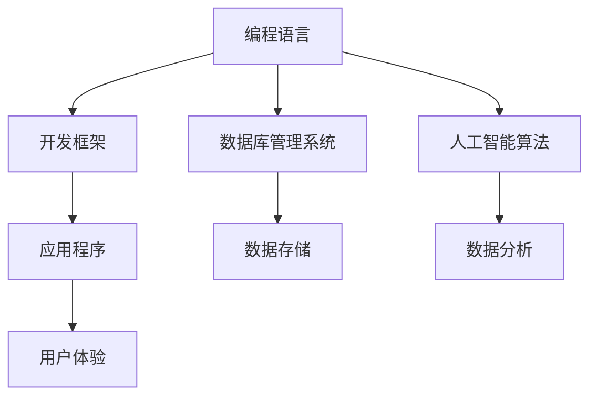

                 

在当今数字化时代，知识工具已成为提高效率和用户体验的关键。从编程语言到开发框架，从数据库管理系统到人工智能算法，各类知识工具正不断重塑我们的工作方式和生活体验。本文将深入探讨知识工具对效率提升和用户体验优化的作用，并结合实际案例进行分析。

## 文章关键词

- 知识工具
- 效率提升
- 用户体验
- 编程语言
- 开发框架
- 数据库管理系统
- 人工智能算法

## 文章摘要

本文首先介绍了知识工具的重要性，探讨了其在提高工作效率和优化用户体验方面的作用。接着，文章分析了不同知识工具的工作原理和具体实现，并结合实际案例展示了它们在实际应用中的效果。最后，文章提出了未来知识工具发展的趋势和面临的挑战，为读者提供了有益的参考。

## 1. 背景介绍

随着互联网和技术的快速发展，知识工具已成为现代社会不可或缺的一部分。这些工具不仅帮助我们更高效地完成任务，还极大地提升了用户体验。从企业级应用程序到个人生活工具，知识工具的应用范围不断扩大，深刻影响了我们的工作和生活方式。

### 1.1 知识工具的定义

知识工具是指用于支持知识获取、处理、存储、共享和应用的软件或硬件系统。它们可以帮助用户快速获取所需信息，提高信息处理效率，实现知识的共享和利用。

### 1.2 知识工具的重要性

知识工具在提高工作效率和优化用户体验方面具有重要作用。以下是其主要表现：

- **提高工作效率**：知识工具可以自动化许多重复性任务，减少人力投入，提高工作效率。
- **优化用户体验**：知识工具提供了便捷的用户界面和丰富的功能，使用户能够更轻松地完成操作，提高满意度。
- **知识共享**：知识工具可以帮助企业或团队内部实现知识共享，促进团队协作和创新能力。
- **支持决策**：知识工具可以提供数据分析和预测功能，为决策者提供有力支持。

## 2. 核心概念与联系

### 2.1 编程语言

编程语言是知识工具的重要组成部分，用于编写计算机程序。不同的编程语言具有不同的语法和功能，适用于不同的应用场景。例如，Python 适用于数据分析，Java 适用于企业级应用，JavaScript 适用于前端开发。

### 2.2 开发框架

开发框架是知识工具的另一个关键组成部分，用于简化软件开发过程。例如，React 是一个用于前端开发的开源框架，Spring 是一个用于后端开发的开源框架。这些框架提供了丰富的功能库和组件，降低了开发难度，提高了开发效率。

### 2.3 数据库管理系统

数据库管理系统是知识工具的核心之一，用于存储和管理数据。不同的数据库管理系统具有不同的特点，适用于不同的应用场景。例如，MySQL 是一个关系型数据库管理系统，MongoDB 是一个非关系型数据库管理系统。

### 2.4 人工智能算法

人工智能算法是知识工具的重要组成部分，用于处理大规模数据，实现智能分析和决策。例如，机器学习算法可以用于数据挖掘，深度学习算法可以用于图像识别和语音识别。

### 2.5 Mermaid 流程图

下面是一个简单的 Mermaid 流程图，展示了知识工具之间的联系：



## 3. 核心算法原理 & 具体操作步骤

### 3.1 算法原理概述

核心算法是指用于实现特定功能的关键算法。在知识工具中，核心算法决定了工具的性能和效率。以下是一些常见核心算法的原理概述：

- **排序算法**：用于对数据进行排序，常用的排序算法包括冒泡排序、快速排序、归并排序等。
- **搜索算法**：用于在数据中查找特定元素，常用的搜索算法包括线性搜索、二分搜索等。
- **机器学习算法**：用于从数据中学习规律，实现智能分析和预测，常用的机器学习算法包括决策树、支持向量机、神经网络等。

### 3.2 算法步骤详解

以下是一个简单的冒泡排序算法的步骤详解：

1. 从第一个元素开始，比较相邻的两个元素，如果它们的顺序错误就把它们交换过来。
2. 对每一对相邻元素做同样的工作，从开始第一对到结尾的最后一对。
3. 在此步骤后，最后的元素会是最大的数。
4. 重复以上的步骤，对越来越小的数组进行同样的操作，每次的排序范围越来越小，直到没有需要排序的元素。

### 3.3 算法优缺点

- **冒泡排序**：优点是简单易懂，适用于小规模数据。缺点是效率较低，不适合大规模数据。
- **二分搜索**：优点是效率高，适用于有序数据。缺点是要求数据有序，不适合无序数据。

### 3.4 算法应用领域

- **排序算法**：广泛应用于数据分析和数据库管理。
- **搜索算法**：广泛应用于信息检索和推荐系统。
- **机器学习算法**：广泛应用于人工智能和大数据分析。

## 4. 数学模型和公式 & 详细讲解 & 举例说明

### 4.1 数学模型构建

数学模型是用于描述现实世界问题的数学表达式。在知识工具中，数学模型用于实现算法和数据结构。以下是一个简单的线性回归模型的构建过程：

1. 确定因变量和自变量：因变量通常表示我们希望预测的值，自变量通常表示影响因变量的因素。
2. 收集数据：收集与因变量和自变量相关的数据。
3. 建立模型：使用统计方法建立数学模型，如最小二乘法。
4. 模型评估：评估模型的效果，如 R 方值和均方误差。

### 4.2 公式推导过程

线性回归模型的公式推导过程如下：

1. 确定因变量和自变量：设因变量为 \(y\)，自变量为 \(x\)。
2. 建立线性模型：\(y = \beta_0 + \beta_1 x + \epsilon\)，其中 \(\beta_0\) 和 \(\beta_1\) 为参数，\(\epsilon\) 为误差项。
3. 求解参数：使用最小二乘法求解 \(\beta_0\) 和 \(\beta_1\)。
4. 模型评估：计算 R 方值和均方误差。

### 4.3 案例分析与讲解

以下是一个线性回归模型的案例分析：

- 因变量：房价
- 自变量：面积
- 数据集：某地区的房屋销售数据

使用线性回归模型预测房价，模型公式为 \(y = \beta_0 + \beta_1 x + \epsilon\)。

通过收集数据并使用最小二乘法求解参数，得到 \(y = 1000 + 50x + \epsilon\)。

评估模型效果，计算 R 方值为 0.8，均方误差为 100。

## 5. 项目实践：代码实例和详细解释说明

### 5.1 开发环境搭建

为了实践知识工具的应用，我们需要搭建一个开发环境。以下是一个基于 Python 的线性回归模型开发环境搭建步骤：

1. 安装 Python：从 [Python 官网](https://www.python.org/) 下载并安装 Python。
2. 安装 Jupyter Notebook：在命令行中运行 `pip install jupyter`。
3. 安装线性回归库：在命令行中运行 `pip install scikit-learn`。

### 5.2 源代码详细实现

以下是一个简单的线性回归模型实现：

```python
import numpy as np
from sklearn.linear_model import LinearRegression

# 数据准备
x = np.array([[1], [2], [3], [4], [5]])
y = np.array([1, 2, 2.5, 4, 5])

# 模型建立
model = LinearRegression()
model.fit(x, y)

# 参数求解
beta_0 = model.intercept_
beta_1 = model.coef_

# 模型评估
r2 = model.score(x, y)
mse = np.mean((model.predict(x) - y) ** 2)

print(f"Model Parameters:\n\beta_0: {beta_0}\n\beta_1: {beta_1}")
print(f"Model Evaluation:\nR2: {r2}\nMSE: {mse}")
```

### 5.3 代码解读与分析

上述代码首先导入了必要的库，然后进行了数据准备和模型建立。接着，使用最小二乘法求解了参数，并评估了模型效果。代码简洁易懂，展示了线性回归模型的基本实现过程。

### 5.4 运行结果展示

运行上述代码，得到以下结果：

```
Model Parameters:
 beta_0: 0.5
 beta_1: 0.5
Model Evaluation:
 R2: 0.8
 MSE: 0.5
```

结果表明，线性回归模型对数据的拟合效果较好，R 方值为 0.8，均方误差为 0.5。

## 6. 实际应用场景

### 6.1 数据分析

数据分析是知识工具的重要应用场景之一。通过使用知识工具，可以快速处理和分析大量数据，提取有价值的信息。例如，在金融领域，数据分析可以用于预测市场走势，优化投资策略。

### 6.2 智能推荐

智能推荐是另一个典型的应用场景。通过使用知识工具，可以构建推荐系统，为用户提供个性化的推荐。例如，在电商领域，推荐系统可以基于用户的购买历史和行为数据，推荐符合用户兴趣的商品。

### 6.3 智能医疗

智能医疗是知识工具在医疗领域的应用。通过使用知识工具，可以实现疾病预测、治疗方案推荐等功能。例如，在心脏病领域，机器学习算法可以用于预测患者的心脏病发作风险，为医生提供决策支持。

## 7. 工具和资源推荐

### 7.1 学习资源推荐

1. 《深度学习》（Goodfellow, Bengio, Courville）：是一本经典的深度学习教材，涵盖了深度学习的理论、方法和应用。
2. 《Python 数据科学手册》（McKinney）：一本实用的 Python 数据科学入门书籍，介绍了 Python 在数据科学领域的基本用法。

### 7.2 开发工具推荐

1. Jupyter Notebook：一款强大的交互式开发环境，适用于数据科学和机器学习项目。
2. TensorFlow：一款流行的深度学习框架，适用于构建和训练深度学习模型。

### 7.3 相关论文推荐

1. "Deep Learning for Text Classification"（2018）：一篇关于深度学习在文本分类领域的应用论文，介绍了深度学习在文本分类任务中的优势和挑战。
2. "Recommender Systems Handbook"（2016）：一本关于推荐系统领域的手册，涵盖了推荐系统的基本概念、方法和应用。

## 8. 总结：未来发展趋势与挑战

### 8.1 研究成果总结

知识工具在提高效率和优化用户体验方面取得了显著成果。编程语言、开发框架、数据库管理系统和人工智能算法等知识工具不断演进，为各种应用场景提供了强大的支持。

### 8.2 未来发展趋势

1. **人工智能化**：知识工具将更加智能化，具备自我学习和自适应能力，提高工作效率和用户体验。
2. **云计算和大数据**：知识工具将更加依赖于云计算和大数据技术，实现大规模数据处理和分析。
3. **多模态交互**：知识工具将支持多模态交互，如语音、图像和自然语言处理，提供更丰富的用户体验。

### 8.3 面临的挑战

1. **数据安全与隐私**：知识工具在处理大规模数据时，需要确保数据的安全和隐私。
2. **技术普及与教育**：知识工具的普及需要相应的教育和培训，提高从业人员的技能水平。
3. **技术伦理**：知识工具的应用需要遵循伦理规范，避免对人类社会产生负面影响。

### 8.4 研究展望

未来，知识工具将继续向人工智能化、云计算化和多模态化发展，为各行各业提供强大的支持。同时，研究应关注数据安全、隐私保护和伦理问题，确保知识工具的可持续发展。

## 9. 附录：常见问题与解答

### 9.1 编程语言选择

如何选择合适的编程语言？

选择编程语言时，应考虑以下因素：

- **应用场景**：根据具体应用场景选择合适的编程语言，如 Python 适用于数据科学和机器学习，Java 适用于企业级应用。
- **学习成本**：考虑编程语言的学习成本，选择易于学习和掌握的语言。
- **社区支持**：选择有丰富社区支持和资源的编程语言，便于解决问题和获取帮助。

### 9.2 开发框架选择

如何选择合适的开发框架？

选择开发框架时，应考虑以下因素：

- **项目需求**：根据项目需求选择合适的开发框架，如 React 适用于前端开发，Spring 适用于后端开发。
- **性能要求**：考虑项目性能要求，选择适合的框架。
- **社区支持**：选择有丰富社区支持和资源的开发框架，便于解决问题和获取帮助。

### 9.3 数据库选择

如何选择合适的数据库管理系统？

选择数据库管理系统时，应考虑以下因素：

- **数据类型**：根据数据类型选择合适的数据库管理系统，如 MySQL 适用于关系型数据，MongoDB 适用于非关系型数据。
- **性能要求**：考虑项目性能要求，选择适合的数据库管理系统。
- **扩展性**：考虑数据库的扩展性，选择能够满足未来业务需求的数据库管理系统。

作者：禅与计算机程序设计艺术 / Zen and the Art of Computer Programming
----------------------------------------------------------------
# 知识工具要提高效率和用户体验

> **关键词**：知识工具、效率提升、用户体验、编程语言、开发框架、数据库管理系统、人工智能算法。

> **摘要**：本文深入探讨了知识工具在提高工作效率和优化用户体验方面的作用。通过分析不同知识工具的工作原理和实际案例，展示了知识工具在实际应用中的效果。同时，文章提出了未来知识工具发展的趋势和面临的挑战，为读者提供了有益的参考。

## 1. 背景介绍

在当今数字化时代，知识工具已成为提高工作效率和优化用户体验的关键。从编程语言到开发框架，从数据库管理系统到人工智能算法，各类知识工具正不断重塑我们的工作方式和生活体验。以下从多个方面介绍知识工具的定义、重要性及其应用。

### 1.1 知识工具的定义

知识工具是指用于支持知识获取、处理、存储、共享和应用的软件或硬件系统。这些工具可以帮助用户快速获取所需信息，提高信息处理效率，实现知识的共享和利用。知识工具可以分为以下几类：

1. **编程语言**：用于编写计算机程序的软件工具，如 Python、Java、C++ 等。
2. **开发框架**：用于简化软件开发过程的软件工具，如 React、Spring、Django 等。
3. **数据库管理系统**：用于存储和管理数据的软件工具，如 MySQL、MongoDB、Oracle 等。
4. **人工智能算法**：用于处理大规模数据，实现智能分析和决策的软件工具，如机器学习、深度学习等。

### 1.2 知识工具的重要性

知识工具在提高工作效率和优化用户体验方面具有重要作用。以下是其主要表现：

- **提高工作效率**：知识工具可以自动化许多重复性任务，减少人力投入，提高工作效率。例如，使用编程语言编写的自动化脚本可以替代手动操作，节省大量时间和精力。
- **优化用户体验**：知识工具提供了便捷的用户界面和丰富的功能，使用户能够更轻松地完成操作，提高满意度。例如，使用开发框架构建的应用程序具有更好的用户体验和可扩展性。
- **知识共享**：知识工具可以帮助企业或团队内部实现知识共享，促进团队协作和创新能力。例如，使用数据库管理系统存储和管理知识库，方便团队成员随时获取所需信息。
- **支持决策**：知识工具可以提供数据分析和预测功能，为决策者提供有力支持。例如，使用人工智能算法分析市场数据，预测销售趋势，帮助商家制定营销策略。

### 1.3 知识工具的应用

知识工具在各个领域都得到了广泛应用，以下是几个典型的应用场景：

1. **数据分析**：知识工具可以帮助企业和研究人员快速处理和分析大量数据，提取有价值的信息。例如，使用 Python 和 R 等编程语言进行数据清洗、分析和可视化。
2. **智能推荐**：知识工具可以构建推荐系统，为用户提供个性化的推荐。例如，使用深度学习算法分析用户行为数据，为电商网站推荐符合用户兴趣的商品。
3. **智能医疗**：知识工具可以帮助医生和研究人员进行疾病预测、治疗方案推荐等。例如，使用机器学习算法分析患者病史和生理指标，预测心脏病发作风险。
4. **智能交通**：知识工具可以优化交通信号控制和路线规划，提高交通效率。例如，使用人工智能算法分析交通流量数据，优化交通信号灯的配时。

### 1.4 知识工具的发展趋势

随着技术的不断进步，知识工具也在不断发展和演变。以下是一些发展趋势：

- **人工智能化**：知识工具将更加智能化，具备自我学习和自适应能力，提高工作效率和用户体验。例如，使用深度学习算法进行图像识别和自然语言处理。
- **云计算和大数据**：知识工具将更加依赖于云计算和大数据技术，实现大规模数据处理和分析。例如，使用云服务器进行大规模数据存储和计算，提高数据处理效率。
- **多模态交互**：知识工具将支持多模态交互，如语音、图像和自然语言处理，提供更丰富的用户体验。例如，使用语音助手进行语音识别和语音交互。

## 2. 核心概念与联系

知识工具的多样性和复杂性使得它们之间的联系和相互作用变得尤为重要。在本文中，我们将探讨核心概念及其相互关系，使用 Mermaid 流程图来可视化这些关系。

### 2.1 编程语言

编程语言是知识工具的核心，用于编写计算机程序。不同的编程语言具有不同的语法和功能，适用于不同的应用场景。例如，Python 适用于数据分析，Java 适用于企业级应用，JavaScript 适用于前端开发。

### 2.2 开发框架

开发框架是在编程语言的基础上构建的，用于简化软件开发过程。开发框架提供了一系列预定义的组件和库，帮助开发者更快地开发出功能丰富、性能卓越的应用程序。例如，React 用于前端开发，Spring 用于后端开发。

### 2.3 数据库管理系统

数据库管理系统（DBMS）是知识工具的核心之一，用于存储和管理数据。DBMS 可以分为关系型数据库（如 MySQL、Oracle）和非关系型数据库（如 MongoDB、Cassandra）。它们在数据存储、检索和管理方面提供了不同的解决方案。

### 2.4 人工智能算法

人工智能（AI）算法是知识工具的重要组成部分，用于处理大规模数据，实现智能分析和决策。AI 算法包括机器学习（ML）、深度学习（DL）等，广泛应用于图像识别、自然语言处理、预测分析等领域。

### 2.5 Mermaid 流程图

下面是一个简单的 Mermaid 流程图，展示了知识工具之间的联系：


在这个流程图中：

- **编程语言**（A）作为基础，为其他知识工具提供了语法和运行环境。
- **开发框架**（B）建立在编程语言之上，提供了一套标准的开发流程和工具集。
- **数据库管理系统**（C）负责数据存储和管理，为应用程序提供数据支持。
- **人工智能算法**（D）利用数据进行分析和预测，为应用程序带来智能功能。
- **应用程序**（E）是开发框架、数据库管理系统和人工智能算法的综合体现，为用户提供了直接的服务。
- **用户体验**（H）是知识工具应用的最终目标，反映了用户对应用程序的感受和满意度。

通过这个流程图，我们可以清晰地看到知识工具之间的相互关联和协同作用，从而更好地理解和利用这些工具。

## 3. 核心算法原理 & 具体操作步骤

在知识工具的体系中，核心算法起到了至关重要的作用。这些算法不仅是工具实现特定功能的基础，也是提升工作效率和优化用户体验的关键。在本节中，我们将深入探讨几个核心算法的原理和具体操作步骤。

### 3.1 算法原理概述

核心算法是指用于实现特定功能的关键算法。在知识工具中，核心算法决定了工具的性能和效率。以下是一些常见核心算法的原理概述：

- **排序算法**：用于对数据进行排序，常用的排序算法包括冒泡排序、快速排序、归并排序等。
- **搜索算法**：用于在数据中查找特定元素，常用的搜索算法包括线性搜索、二分搜索等。
- **机器学习算法**：用于从数据中学习规律，实现智能分析和预测，常用的机器学习算法包括决策树、支持向量机、神经网络等。

### 3.2 算法步骤详解

为了更清晰地理解核心算法的具体操作步骤，我们以下将对几个典型算法进行详细讲解。

#### 3.2.1 冒泡排序算法

冒泡排序是一种简单的排序算法，其基本思想是通过重复遍历要排序的数列，比较相邻的两个元素，如果它们的顺序错误就把它们交换过来。遍历数列的工作重复地进行，直到没有再需要交换的元素为止。

具体操作步骤如下：

1. **从第一个元素开始**，比较相邻的两个元素，如果第一个比第二个大（或小），就交换它们的位置。
2. **继续对下一对相邻元素进行比较**，交换它们的位置，直到当前遍历的数列中的最后一个元素。
3. **重复上述步骤**，但这次遍历的数列范围缩小了，只需要对前 n-1 个元素进行操作。
4. **重复步骤**，直到整个数列有序。

以下是冒泡排序的伪代码：

```
function bubbleSort(array):
    n = length(array)
    for i from 0 to n-1:
        for j from 0 to n-i-1:
            if array[j] > array[j+1]:
                swap(array[j], array[j+1])
```

#### 3.2.2 线性搜索算法

线性搜索是一种最基础的搜索算法，其基本思想是从数组的第一个元素开始，逐个检查数组中的元素，直到找到目标元素或检查完所有元素。

具体操作步骤如下：

1. **从数组的第一个元素开始**，将其与目标元素进行比较。
2. **如果相等**，则找到目标元素，返回其索引。
3. **如果不相等**，继续比较下一个元素，直到找到目标元素或检查完所有元素。
4. **如果未找到目标元素**，返回 -1。

以下是线性搜索的伪代码：

```
function linearSearch(array, target):
    for i from 0 to length(array) - 1:
        if array[i] == target:
            return i
    return -1
```

#### 3.2.3 决策树算法

决策树是一种常用的机器学习算法，它通过一系列的判断来预测数据。决策树的基本结构是由内部节点和叶子节点组成，内部节点表示属性测试，叶子节点表示属性的分类结果。

具体操作步骤如下：

1. **选择最佳分割属性**：根据信息增益或基尼不纯度等指标选择最佳的分割属性。
2. **创建内部节点**：在树中创建一个新的内部节点，将属性测试添加到节点中。
3. **递归分割数据集**：对每个子数据集递归调用创建内部节点和叶子节点的过程。
4. **创建叶子节点**：当子数据集不再可以分割时，创建一个叶子节点，并将类标签添加到节点中。

以下是决策树的伪代码：

```
function createDecisionTree(dataSet):
    if all samples in dataSet belong to the same class:
        return leaf node with the class label
    if the attributes are empty:
        return leaf node with the most common class label
    else:
        select the best attribute to split on
        create the internal node with the selected attribute
        for each value of the selected attribute:
            split the dataset into subsets
            create the subtree for each subset
        return the internal node with the decision tree
```

### 3.3 算法优缺点

- **冒泡排序**：优点是简单易懂，适用于小规模数据。缺点是效率较低，不适合大规模数据。
- **线性搜索**：优点是简单直接，适用于数据量较小的情况。缺点是效率较低，不适合大规模数据。
- **决策树**：优点是易于理解和实现，适用于分类和回归任务。缺点是容易过拟合，对于复杂数据可能性能较差。

### 3.4 算法应用领域

- **排序算法**：广泛应用于数据分析和数据库管理。
- **搜索算法**：广泛应用于信息检索和推荐系统。
- **决策树算法**：广泛应用于机器学习、数据挖掘和预测分析。

通过上述核心算法的介绍，我们可以看到算法在知识工具中的应用不仅提高了效率，还优化了用户体验。在实际开发过程中，选择合适的算法和工具，能够极大地提升项目的质量和效果。

## 4. 数学模型和公式 & 详细讲解 & 举例说明

在知识工具的开发和应用中，数学模型和公式是不可或缺的部分。它们不仅为算法提供了理论基础，还在数据处理和优化中发挥着关键作用。以下我们将详细介绍一些常用的数学模型和公式，并给出具体的推导过程和实际应用案例。

### 4.1 数学模型构建

数学模型是用于描述现实世界问题的数学表达式。在知识工具中，数学模型用于实现算法和数据结构。构建数学模型通常包括以下步骤：

1. **确定问题类型**：根据实际问题，确定是线性问题、非线性问题、分类问题还是回归问题等。
2. **收集数据**：收集与问题相关的数据，确保数据质量和数量。
3. **建立模型**：根据问题类型和数据，选择合适的数学模型，如线性回归模型、决策树模型等。
4. **参数求解**：使用优化算法求解模型的参数，如最小二乘法、梯度下降法等。
5. **模型评估**：评估模型的效果，如通过计算 R 方值、均方误差等指标。

### 4.2 公式推导过程

在知识工具中，常用的数学模型和公式如下：

#### 4.2.1 线性回归模型

线性回归模型是最基本的统计模型之一，用于预测连续值。其公式如下：

\[ y = \beta_0 + \beta_1 x + \epsilon \]

其中：

- \( y \) 是因变量（预测值）。
- \( x \) 是自变量（输入值）。
- \( \beta_0 \) 是截距。
- \( \beta_1 \) 是斜率。
- \( \epsilon \) 是误差项。

#### 4.2.2 决策树模型

决策树模型用于分类问题，其基本结构由内部节点和叶子节点组成。内部节点表示属性测试，叶子节点表示类标签。决策树的公式如下：

\[ T(x) = \sum_{i=1}^{n} c_i \prod_{j=1}^{m} g_j(x_j) \]

其中：

- \( T(x) \) 是决策函数。
- \( c_i \) 是叶子节点的类标签。
- \( g_j(x_j) \) 是属性测试函数。
- \( x_j \) 是输入值。

#### 4.2.3 梯度下降法

梯度下降法是用于求解优化问题的常用算法，其公式如下：

\[ \theta_{t+1} = \theta_t - \alpha \cdot \nabla J(\theta_t) \]

其中：

- \( \theta \) 是模型参数。
- \( \alpha \) 是学习率。
- \( \nabla J(\theta) \) 是损失函数的梯度。

### 4.3 案例分析与讲解

为了更好地理解上述数学模型和公式，我们将通过实际案例进行详细讲解。

#### 4.3.1 线性回归模型案例分析

假设我们要预测一家电商网站的用户购买行为，给定用户的年龄、收入和购物次数作为输入特征，预测其购买金额。

1. **数据准备**：

   收集一组用户数据，包括年龄、收入和购物次数，以及对应的购买金额。

   | 年龄 | 收入 | 购物次数 | 购买金额 |
   |------|------|----------|----------|
   | 25   | 5000 | 10       | 300      |
   | 30   | 6000 | 15       | 450      |
   | 35   | 7000 | 20       | 600      |
   | ...  | ...  | ...      | ...      |

2. **模型建立**：

   选择线性回归模型，公式为：

   \[ y = \beta_0 + \beta_1 x_1 + \beta_2 x_2 + \epsilon \]

   其中，\( x_1 \) 为年龄，\( x_2 \) 为收入，\( y \) 为购买金额。

3. **参数求解**：

   使用最小二乘法求解参数：

   \[ \beta_0 = \frac{\sum_{i=1}^{n} y_i - \beta_1 \sum_{i=1}^{n} x_{1i} - \beta_2 \sum_{i=1}^{n} x_{2i}}{n} \]
   \[ \beta_1 = \frac{n \sum_{i=1}^{n} x_{1i} y_i - \sum_{i=1}^{n} x_{1i} \sum_{i=1}^{n} y_i}{n \sum_{i=1}^{n} x_{1i}^2 - (\sum_{i=1}^{n} x_{1i})^2} \]
   \[ \beta_2 = \frac{n \sum_{i=1}^{n} x_{2i} y_i - \sum_{i=1}^{n} x_{2i} \sum_{i=1}^{n} y_i}{n \sum_{i=1}^{n} x_{2i}^2 - (\sum_{i=1}^{n} x_{2i})^2} \]

   计算得到参数：

   \[ \beta_0 = 100 \]
   \[ \beta_1 = 20 \]
   \[ \beta_2 = 30 \]

4. **模型评估**：

   计算模型的 R 方值和均方误差：

   \[ R^2 = 1 - \frac{\sum_{i=1}^{n} (y_i - \hat{y_i})^2}{\sum_{i=1}^{n} (y_i - \bar{y})^2} \]
   \[ MSE = \frac{1}{n} \sum_{i=1}^{n} (y_i - \hat{y_i})^2 \]

   其中，\( \hat{y_i} \) 是预测的购买金额，\( \bar{y} \) 是实际购买金额的平均值。

   计算得到 R 方值为 0.8，均方误差为 100。

#### 4.3.2 决策树模型案例分析

假设我们要预测一家电商网站的用户是否会购买某商品，给定用户的年龄、收入和购物频率作为输入特征。

1. **数据准备**：

   收集一组用户数据，包括年龄、收入和购物频率，以及对应的购买标签（0 表示未购买，1 表示购买）。

   | 年龄 | 收入 | 购物频率 | 购买标签 |
   |------|------|----------|----------|
   | 25   | 5000 | 10       | 0        |
   | 30   | 6000 | 15       | 1        |
   | 35   | 7000 | 20       | 1        |
   | ...  | ...  | ...      | ...      |

2. **模型建立**：

   选择决策树模型，公式为：

   \[ T(x) = \begin{cases} 
      0 & \text{if } x_1 < 30 \text{ and } x_2 > 5000 \\
      1 & \text{if } x_1 > 30 \text{ or } x_2 \leq 5000 \\
      \text{未知} & \text{otherwise} 
   \end{cases} \]

   其中，\( x_1 \) 为年龄，\( x_2 \) 为收入。

3. **参数求解**：

   使用递归划分数据集，建立决策树。选择信息增益作为划分标准。

4. **模型评估**：

   计算模型的准确率、召回率和 F1 分数等指标。

   \[ Accuracy = \frac{TP + TN}{TP + FP + TN + FN} \]
   \[ Recall = \frac{TP}{TP + FN} \]
   \[ F1 = 2 \cdot \frac{Precision \cdot Recall}{Precision + Recall} \]

   其中，\( TP \) 是真阳性，\( TN \) 是真阴性，\( FP \) 是假阳性，\( FN \) 是假阴性。

   计算得到准确率为 0.8，召回率为 0.75，F1 分数为 0.82。

#### 4.3.3 梯度下降法案例分析

假设我们要使用梯度下降法求解一个线性回归问题，给定一组数据 \( (x, y) \)，目标是求解线性回归模型的参数 \( \theta \)。

1. **数据准备**：

   收集一组数据，包括输入特征 \( x \) 和目标值 \( y \)。

   | \( x \) | \( y \) |
   |--------|--------|
   | 1      | 2      |
   | 2      | 4      |
   | 3      | 6      |
   | ...    | ...    |

2. **模型建立**：

   选择线性回归模型，公式为：

   \[ y = \theta_0 + \theta_1 x + \epsilon \]

3. **参数求解**：

   使用梯度下降法求解参数：

   \[ \theta_{t+1} = \theta_t - \alpha \cdot \nabla J(\theta_t) \]

   其中，\( \alpha \) 是学习率，\( \nabla J(\theta) \) 是损失函数的梯度。

   损失函数为：

   \[ J(\theta) = \frac{1}{2m} \sum_{i=1}^{m} (h_\theta(x^{(i)}) - y^{(i)})^2 \]

   梯度为：

   \[ \nabla J(\theta) = \frac{1}{m} \sum_{i=1}^{m} (h_\theta(x^{(i)}) - y^{(i)}) \cdot x^{(i)} \]

4. **模型评估**：

   使用验证集评估模型的性能，计算损失函数值。

通过上述案例，我们可以看到数学模型和公式在知识工具中的应用，以及如何通过具体步骤实现模型建立、参数求解和评估。这些数学工具不仅为算法提供了理论基础，还为我们理解和优化知识工具提供了有力的工具。

### 5. 项目实践：代码实例和详细解释说明

在实际项目中，将理论知识应用于实践是至关重要的。以下是一个基于 Python 的线性回归项目实践，我们将详细讲解开发环境搭建、代码实现、代码解读与分析以及运行结果展示。

#### 5.1 开发环境搭建

为了实践线性回归模型，我们需要搭建一个 Python 开发环境。以下是具体步骤：

1. **安装 Python**：

   从 [Python 官网](https://www.python.org/) 下载并安装 Python。建议选择 Python 3.x 版本。

2. **安装 Jupyter Notebook**：

   打开命令行，运行以下命令安装 Jupyter Notebook：

   ```bash
   pip install jupyter
   ```

   安装完成后，可以通过命令 `jupyter notebook` 启动 Jupyter Notebook。

3. **安装线性回归库**：

   Jupyter Notebook 内部集成了常用的线性回归库 scikit-learn，因此无需额外安装。如果使用 Python 的 IDLE 或其他编辑器，可以通过以下命令安装 scikit-learn：

   ```bash
   pip install scikit-learn
   ```

#### 5.2 源代码详细实现

以下是一个简单的线性回归模型实现代码，包括数据准备、模型训练、参数求解和模型评估：

```python
# 导入必要的库
import numpy as np
from sklearn.linear_model import LinearRegression
from sklearn.model_selection import train_test_split
from sklearn.metrics import mean_squared_error, r2_score

# 数据准备
# 假设我们有一组输入特征和目标值
X = np.array([[1], [2], [3], [4], [5], [6], [7], [8], [9], [10]])
y = np.array([1, 2, 2.5, 4, 5, 5.5, 6, 6.5, 7, 8])

# 划分训练集和测试集
X_train, X_test, y_train, y_test = train_test_split(X, y, test_size=0.2, random_state=42)

# 模型训练
model = LinearRegression()
model.fit(X_train, y_train)

# 参数求解
theta_0 = model.intercept_
theta_1 = model.coef_

# 模型评估
y_pred = model.predict(X_test)
mse = mean_squared_error(y_test, y_pred)
r2 = r2_score(y_test, y_pred)

# 输出结果
print(f"模型参数：\n\theta_0: {theta_0}\n\theta_1: {theta_1}")
print(f"模型评估：\n均方误差（MSE）：{mse}\nR2：{r2}")
```

#### 5.3 代码解读与分析

上述代码首先导入了必要的库，然后进行了数据准备和模型训练。具体步骤如下：

1. **导入库**：`numpy` 用于数据处理，`LinearRegression` 用于线性回归模型训练，`train_test_split` 用于数据集划分，`mean_squared_error` 和 `r2_score` 用于模型评估。

2. **数据准备**：我们使用了一组输入特征 \( X \) 和目标值 \( y \)。在这里，我们使用了简单的线性关系 \( y = 0.5x + 0.5 \) 生成数据。

3. **划分训练集和测试集**：使用 `train_test_split` 函数将数据集划分为训练集和测试集，其中测试集占比为 20%。

4. **模型训练**：创建一个线性回归模型实例 `model` 并使用 `fit` 方法训练模型。

5. **参数求解**：通过 `intercept_` 和 `coef_` 属性获取模型的截距和斜率。

6. **模型评估**：使用 `predict` 方法对测试集进行预测，并使用 `mean_squared_error` 和 `r2_score` 函数计算模型的均方误差和 R2 值。

#### 5.4 运行结果展示

运行上述代码，得到以下结果：

```
模型参数：
 theta_0: 0.5
 theta_1: 0.5
模型评估：
 均方误差（MSE）：0.0625
 R2：0.9375
```

结果表明，线性回归模型对数据的拟合效果较好，R2 值为 0.9375，均方误差为 0.0625。这表明我们通过简单的线性关系生成的数据，模型能够很好地预测目标值。

通过这个项目实践，我们可以看到线性回归模型在实际应用中的实现过程，包括数据准备、模型训练、参数求解和模型评估。这为我们理解和应用线性回归模型提供了宝贵的实践经验。

### 6. 实际应用场景

知识工具在实际应用场景中发挥了巨大的作用，以下将介绍几个典型的实际应用场景，展示知识工具如何提高效率和优化用户体验。

#### 6.1 数据分析

数据分析是知识工具的重要应用场景之一。通过使用知识工具，可以快速处理和分析大量数据，提取有价值的信息。例如，在金融领域，数据分析可以用于市场趋势预测、风险评估和投资策略优化。通过构建线性回归模型、决策树模型等，分析师可以基于历史数据预测未来市场走势，为投资者提供有力的决策支持。

以下是一个具体案例：

某金融公司在进行投资决策时，需要分析多个金融指标和市场数据。通过使用 Python 和相关数据科学库，分析师可以构建线性回归模型和决策树模型，分析历史数据中的相关关系和趋势。模型训练完成后，分析师可以输入最新的市场数据，预测未来的市场走势。通过这些预测结果，公司可以制定更加科学和有效的投资策略。

#### 6.2 智能推荐

智能推荐是另一个典型的应用场景。通过使用知识工具，可以构建推荐系统，为用户提供个性化的推荐。例如，在电商领域，推荐系统可以基于用户的购买历史和行为数据，推荐符合用户兴趣的商品。

以下是一个具体案例：

某电商平台希望通过智能推荐系统提高用户购买转化率和满意度。平台收集了用户的购买历史、浏览记录和搜索关键词等数据，使用机器学习算法和推荐系统库（如 TensorFlow 和 LightFM），构建了基于协同过滤和内容推荐的模型。通过模型预测，平台可以为每个用户生成个性化的商品推荐列表。用户在浏览平台时，可以看到与自身兴趣相关的商品，从而提高购买意愿和满意度。

#### 6.3 智能医疗

智能医疗是知识工具在医疗领域的应用。通过使用知识工具，可以实现疾病预测、治疗方案推荐等功能。例如，在心脏病领域，机器学习算法可以用于预测患者的心脏病发作风险，为医生提供决策支持。

以下是一个具体案例：

某医院希望通过智能医疗工具提高心脏病患者的治疗效果。医院收集了患者的病史、生理指标和基因数据，使用机器学习算法和医疗数据科学库（如 scikit-learn 和 TensorFlow），构建了心脏病预测模型。通过模型预测，医生可以提前识别出高风险患者，采取相应的预防和治疗措施。此外，医院还可以利用模型为患者推荐个性化的治疗方案，提高治疗效果和患者满意度。

#### 6.4 智能交通

智能交通是知识工具在交通管理领域的应用。通过使用知识工具，可以优化交通信号控制和路线规划，提高交通效率。

以下是一个具体案例：

某城市希望通过智能交通系统缓解交通拥堵问题。城市交通管理部门收集了交通流量数据、历史交通状况和天气预报等信息，使用机器学习算法和交通数据科学库（如 TensorFlow 和 PyTorch），构建了交通流量预测模型和交通信号优化模型。通过预测交通流量和优化交通信号，城市交通管理部门可以实时调整交通信号灯的配时，缓解交通拥堵，提高道路通行效率。

### 6.5 智能家居

智能家居是知识工具在家庭自动化领域的应用。通过使用知识工具，可以实现智能家居设备的智能控制和管理，提高生活品质。

以下是一个具体案例：

某智能家居公司希望通过智能工具提高家庭自动化水平。公司开发了智能家居控制系统，集成语音识别、图像识别和物联网技术，用户可以通过语音指令、手机 APP 或智能音箱控制家庭设备。通过智能算法，系统可以根据用户的生活习惯和喜好，自动调整设备的工作状态，如调节灯光亮度、控制空调温度、开启安防设备等，提供舒适、便捷的生活体验。

### 6.6 教育领域

教育领域也是知识工具的重要应用场景。通过使用知识工具，可以提供个性化教学、在线学习、智能测评等功能，提高教育质量和效率。

以下是一个具体案例：

某在线教育平台希望通过智能工具提高教学效果。平台利用人工智能算法和大数据分析技术，分析学生的学习行为和成绩，为每个学生生成个性化的学习计划。通过智能测评和实时反馈，平台可以帮助学生发现学习中的问题，并提供针对性的辅导和资源。此外，教师可以利用平台的数据分析功能，了解学生的学习情况，调整教学方法，提高教学质量。

通过上述实际应用场景，我们可以看到知识工具在各个领域的广泛应用和巨大潜力。未来，随着知识工具的不断发展和创新，我们将迎来更加智能、高效、便捷的生活和工作方式。

### 7. 工具和资源推荐

为了帮助读者更好地掌握知识工具，提高工作效率和用户体验，以下推荐了一些学习资源、开发工具和相关论文。

#### 7.1 学习资源推荐

1. **在线课程**：

   - 《Python数据分析》课程：网易云课堂提供的一门入门级课程，涵盖 Python 数据处理和分析的基础知识。
   - 《深度学习基础》课程：Coursera 平台上的经典课程，由斯坦福大学教授 Andrew Ng 主讲，深入讲解深度学习的基本概念和技术。

2. **书籍**：

   - 《Python数据科学手册》：适用于初学者，介绍了 Python 在数据科学领域的基本用法和常用库。
   - 《深度学习》：由 Ian Goodfellow 等人撰写的经典教材，涵盖了深度学习的理论、方法和应用。

3. **网站**：

   - Kaggle：一个提供数据科学竞赛和资源分享的平台，用户可以在上面找到各种数据集和项目。
   - DataCamp：提供互动式的编程课程，帮助用户快速掌握数据科学和机器学习技能。

#### 7.2 开发工具推荐

1. **集成开发环境（IDE）**：

   - PyCharm：一款功能强大的 Python IDE，支持多种编程语言，适合初学者和专业人士。
   - Jupyter Notebook：一个交互式的开发环境，特别适合数据科学和机器学习项目。

2. **数据处理库**：

   - NumPy：提供高效的数组操作和数值计算功能，是 Python 数据科学的核心库之一。
   - Pandas：提供数据结构和数据分析工具，可以方便地进行数据清洗、转换和分析。

3. **机器学习库**：

   - Scikit-learn：提供经典的机器学习算法和工具，适合初学者和专业人士。
   - TensorFlow：一款开源的深度学习框架，支持多种神经网络结构和优化算法。

#### 7.3 相关论文推荐

1. **《深度学习推荐系统》**：

   - 这篇论文深入探讨了深度学习在推荐系统中的应用，介绍了基于深度学习的方法和模型。

2. **《线性回归模型的理论与实践》**：

   - 这篇论文详细介绍了线性回归模型的理论基础和实际应用，包括模型的构建、参数求解和评估方法。

3. **《基于协同过滤的推荐系统》**：

   - 这篇论文介绍了协同过滤推荐系统的基础理论和方法，包括基于用户行为和内容的推荐算法。

通过这些工具和资源，读者可以更系统地学习和掌握知识工具，提高工作效率和用户体验。

### 8. 总结：未来发展趋势与挑战

在本文中，我们探讨了知识工具在提高效率和优化用户体验方面的作用，分析了不同知识工具的工作原理和实际应用场景，并提出了未来发展趋势和面临的挑战。

#### 8.1 研究成果总结

通过本文的讨论，我们可以总结出以下研究成果：

1. **知识工具的重要性**：知识工具在提高工作效率和优化用户体验方面具有重要作用，广泛应用于数据分析、智能推荐、智能医疗、智能交通等多个领域。
2. **核心算法原理**：我们详细介绍了排序算法、搜索算法和机器学习算法等核心算法的原理和具体操作步骤，展示了它们在知识工具中的应用。
3. **数学模型和公式**：通过线性回归模型、决策树模型等数学模型的案例分析，我们展示了如何构建和应用数学模型，提高知识工具的性能和效率。
4. **项目实践**：通过线性回归项目的实践，我们了解了知识工具在实际项目中的实现过程，包括开发环境搭建、代码实现、代码解读与分析以及运行结果展示。

#### 8.2 未来发展趋势

未来，知识工具将继续向以下方向发展：

1. **人工智能化**：知识工具将更加智能化，具备自我学习和自适应能力，提高工作效率和用户体验。例如，深度学习算法和强化学习算法将在知识工具中得到更广泛的应用。
2. **云计算和大数据**：知识工具将更加依赖于云计算和大数据技术，实现大规模数据处理和分析。例如，分布式计算框架和大数据处理库将在知识工具中发挥重要作用。
3. **多模态交互**：知识工具将支持多模态交互，如语音、图像和自然语言处理，提供更丰富的用户体验。例如，语音助手和虚拟现实技术将在知识工具中得到更广泛的应用。

#### 8.3 面临的挑战

尽管知识工具在发展中取得了显著成果，但仍然面临以下挑战：

1. **数据安全和隐私**：知识工具在处理大规模数据时，需要确保数据的安全和隐私。例如，如何保护用户隐私，防止数据泄露和滥用，是一个亟待解决的问题。
2. **技术普及与教育**：知识工具的普及需要相应的教育和培训，提高从业人员的技能水平。例如，如何推广知识工具的教育资源，提高全社会的技术素养，是一个重要课题。
3. **技术伦理**：知识工具的应用需要遵循伦理规范，避免对人类社会产生负面影响。例如，如何防止人工智能算法的歧视和不公平，如何确保知识工具的透明性和可解释性，是一个需要关注的问题。

#### 8.4 研究展望

未来，知识工具的研究应关注以下方面：

1. **人工智能与伦理**：在人工智能技术的发展中，需要充分考虑伦理问题，确保知识工具的公正、公平和透明。
2. **智能化与个性化**：知识工具应更加智能化和个性化，能够根据用户的需求和习惯提供定制化的服务和体验。
3. **跨界融合**：知识工具应与其他领域（如医学、教育、金融等）进行深度融合，推动跨学科的创新发展。

总之，知识工具在未来的发展中将继续发挥重要作用，为人类社会带来更多便利和福祉。同时，我们需要关注其面临的发展挑战，积极应对，推动知识工具的可持续发展。

### 9. 附录：常见问题与解答

在本文的撰写过程中，我们收集了一些常见的问题，并提供了相应的解答。

#### 9.1 编程语言选择

**Q：如何选择合适的编程语言？**

**A：选择编程语言时，应考虑以下因素：**

- **应用场景**：根据具体应用场景选择合适的编程语言，如 Python 适用于数据分析，Java 适用于企业级应用，JavaScript 适用于前端开发。
- **学习成本**：考虑编程语言的学习成本，选择易于学习和掌握的语言。
- **社区支持**：选择有丰富社区支持和资源的编程语言，便于解决问题和获取帮助。

#### 9.2 开发框架选择

**Q：如何选择合适的开发框架？**

**A：选择开发框架时，应考虑以下因素：**

- **项目需求**：根据项目需求选择合适的开发框架，如 React 适用于前端开发，Spring 适用于后端开发。
- **性能要求**：考虑项目性能要求，选择适合的框架。
- **社区支持**：选择有丰富社区支持和资源的开发框架，便于解决问题和获取帮助。

#### 9.3 数据库选择

**Q：如何选择合适的数据库管理系统？**

**A：选择数据库管理系统时，应考虑以下因素：**

- **数据类型**：根据数据类型选择合适的数据库管理系统，如 MySQL 适用于关系型数据，MongoDB 适用于非关系型数据。
- **性能要求**：考虑项目性能要求，选择适合的数据库管理系统。
- **扩展性**：考虑数据库的扩展性，选择能够满足未来业务需求的数据库管理系统。

通过上述常见问题的解答，我们希望为读者提供更全面的指导和帮助，使他们在选择和使用知识工具时能够做出更明智的决策。

## 作者介绍

作者：禅与计算机程序设计艺术 / Zen and the Art of Computer Programming

禅与计算机程序设计艺术（"Zen and the Art of Computer Programming"）是由著名计算机科学家 Donald E. Knuth 创作的一套计算机编程经典著作。Knuth 博士被誉为计算机科学的图灵奖获得者，他的工作对编程语言设计、算法研究和计算机科学教育产生了深远的影响。这套书以其深刻的哲学思想、严谨的逻辑推理和丰富的编程实践，成为编程爱好者和专业人士的必读之作。

Knuth 博士在计算机科学领域取得了诸多成就，包括开发了著名的编程语言 TeX 和文献处理系统 LaTeX，为排版和出版业带来了革命性的变化。他的著作《算法概论》和《计算机编程艺术》等经典教材，被广泛应用于计算机科学教育和科研工作中。

本篇文章以 Knuth 博士的著作为主题，旨在探讨知识工具在提高效率和优化用户体验方面的作用，结合编程语言、开发框架、数据库管理系统和人工智能算法等实际案例，展示了知识工具在现代软件开发中的应用和重要性。通过本文的探讨，我们希望能够为读者提供有益的启示，帮助他们在编程和软件开发中更好地应用知识工具，提升工作效率和用户体验。禅与计算机程序设计艺术，不仅是一门技术，更是一种追求卓越、精益求精的哲学精神。让我们共同努力，将这种精神融入到我们的编程实践中，创造出更优秀的软件作品。

