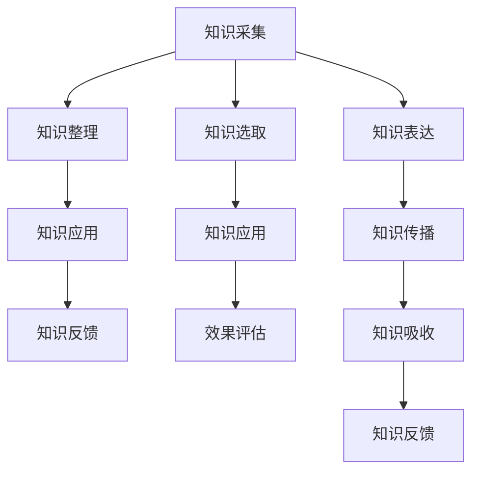

                 

 在信息技术飞速发展的今天，知识的获取和传播变得更加便捷。然而，如何有效地将知识转化为实际应用，并在不同的场景中实现知识的场景化应用和分享，成为一个重要的课题。本文将探讨如何通过知识旅行实现知识的场景化应用和分享，以及相关的技术手段和策略。

> 关键词：知识旅行，场景化应用，知识分享，技术手段，策略

> 摘要：本文首先介绍了知识旅行和场景化应用的概念，探讨了其在知识传播中的应用价值。然后，从技术手段和策略两个方面，详细阐述了如何实现知识的场景化应用和分享。最后，通过具体案例，展示了知识旅行在实践中的应用效果。

## 1. 背景介绍

知识旅行（Knowledge Travel）是一种将知识从理论层面转化为实际应用的过程。它强调知识的场景化应用，即在不同场景中，根据具体需求，将知识以适当的形式呈现和传递。知识旅行不仅有助于提高知识的实用价值，还能促进知识的传播和分享。

场景化应用（Contextual Application）是指将知识应用于特定的场景中，以解决实际问题。在信息技术领域，场景化应用已经成为推动技术进步的重要动力。通过场景化应用，开发者可以更好地理解用户需求，提供更符合用户期望的产品和服务。

知识分享（Knowledge Sharing）是指将知识从一个人或组织传递到另一个人或组织的过程。在知识经济时代，知识分享的重要性日益凸显。有效的知识分享可以促进知识的流动和积累，提高组织的创新能力和竞争力。

本文将从知识旅行和场景化应用的角度，探讨如何实现知识的场景化应用和分享，以及相关的技术手段和策略。

## 2. 核心概念与联系

### 2.1 知识旅行

知识旅行是一种将知识应用于实际场景的过程。它通常包括以下几个步骤：

1. **知识采集**：从各种来源（如文献、报告、数据等）获取知识。
2. **知识整理**：对采集到的知识进行整理、分类和归纳，使其结构化。
3. **知识应用**：将整理好的知识应用于实际场景中，解决实际问题。
4. **知识反馈**：对知识应用的效果进行评估和反馈，优化知识体系。

### 2.2 场景化应用

场景化应用是指将知识应用于特定的场景中。一个典型的场景化应用过程包括：

1. **需求分析**：了解场景的需求和目标。
2. **知识选取**：根据需求，选择合适的知识。
3. **知识应用**：将知识应用于场景中，实现需求。
4. **效果评估**：评估知识应用的效果，进行优化。

### 2.3 知识分享

知识分享是指将知识从一个个体或组织传递到另一个个体或组织的过程。有效的知识分享通常包括以下步骤：

1. **知识表达**：将知识以合适的形式表达出来。
2. **知识传播**：通过各种渠道，将知识传递给目标受众。
3. **知识吸收**：目标受众接收和消化知识。
4. **知识反馈**：对知识传播的效果进行评估和反馈。

### 2.4 Mermaid 流程图

下面是一个简单的 Mermaid 流程图，展示了知识旅行、场景化应用和知识分享之间的联系：



## 3. 核心算法原理 & 具体操作步骤

### 3.1 算法原理概述

知识旅行和场景化应用的核心算法主要涉及以下几个方面：

1. **知识图谱构建**：通过构建知识图谱，将知识以图形化的方式表示，方便知识的应用和传播。
2. **场景识别**：通过分析场景特征，识别出不同场景的需求和目标。
3. **知识匹配**：根据场景需求，匹配合适的知识，实现知识的场景化应用。
4. **效果评估**：对知识应用的效果进行评估，优化知识体系。

### 3.2 算法步骤详解

#### 3.2.1 知识图谱构建

1. **数据采集**：从各种来源获取知识数据。
2. **知识抽取**：从数据中提取出关键信息，构建知识实体。
3. **关系建模**：建立知识实体之间的关联关系。
4. **知识融合**：对多个知识实体进行整合，形成完整的知识图谱。

#### 3.2.2 场景识别

1. **特征提取**：从场景数据中提取出关键特征。
2. **模型训练**：使用机器学习算法，训练场景识别模型。
3. **场景识别**：将特征输入模型，识别出不同场景。

#### 3.2.3 知识匹配

1. **知识查询**：根据场景需求，查询知识图谱中的相关知识。
2. **知识筛选**：对查询结果进行筛选，选择合适的知识。
3. **知识应用**：将筛选后的知识应用于场景中。

#### 3.2.4 效果评估

1. **效果测量**：对知识应用的效果进行测量和评估。
2. **反馈优化**：根据评估结果，优化知识体系和应用策略。

### 3.3 算法优缺点

#### 优点：

1. **知识图谱构建**：知识图谱能够以图形化的方式表示知识，便于理解和应用。
2. **场景识别**：通过机器学习算法，能够准确识别不同场景的需求和目标。
3. **知识匹配**：能够快速匹配到合适的知识，实现知识的场景化应用。

#### 缺点：

1. **数据质量**：知识图谱的构建依赖于数据质量，数据质量较差可能导致知识图谱不准确。
2. **计算资源**：知识图谱构建和场景识别需要大量的计算资源，对硬件要求较高。
3. **效果评估**：效果评估需要大量实际应用场景，对实验条件要求较高。

### 3.4 算法应用领域

知识旅行和场景化应用算法广泛应用于各个领域，如：

1. **金融领域**：通过知识旅行和场景化应用，为金融机构提供精准的风险评估和投资建议。
2. **医疗领域**：通过知识旅行和场景化应用，为医生提供精准的诊断和治疗建议。
3. **教育领域**：通过知识旅行和场景化应用，为教育机构提供个性化的教育方案和学生评估。

## 4. 数学模型和公式 & 详细讲解 & 举例说明

### 4.1 数学模型构建

知识旅行和场景化应用的核心数学模型主要包括以下几个方面：

1. **知识图谱构建模型**：用于构建知识图谱的数学模型，如图论模型、网络模型等。
2. **场景识别模型**：用于识别不同场景的数学模型，如机器学习模型、深度学习模型等。
3. **知识匹配模型**：用于匹配知识的数学模型，如匹配算法、排序算法等。
4. **效果评估模型**：用于评估知识应用效果的数学模型，如统计分析模型、机器学习模型等。

### 4.2 公式推导过程

以下是一个简单的知识图谱构建模型的推导过程：

#### 4.2.1 知识图谱构建模型

设知识图谱由实体集合 E 和关系集合 R 构成，实体和关系分别表示为 E = {e1, e2, ..., en} 和 R = {r1, r2, ..., rm}。知识图谱的表示可以采用邻接矩阵 A 来表示，其中 Aij 表示实体 ei 和关系 rj 之间的关联程度。

邻接矩阵 A 的计算公式如下：

$$
A = \left[ \begin{array}{cccc}
0 & a_{12} & \dots & a_{1m} \\
a_{21} & 0 & \dots & a_{2m} \\
\vdots & \vdots & \ddots & \vdots \\
a_{n1} & a_{n2} & \dots & 0
\end{array} \right]
$$

其中，0 表示实体和关系之间没有关联，1 表示实体和关系之间存在关联。

#### 4.2.2 场景识别模型

设场景识别模型由输入特征矩阵 X 和输出标签矩阵 Y 构成，输入特征矩阵 X 的每一行表示一个场景的特征，输出标签矩阵 Y 的每一行表示一个场景的类别。

场景识别模型可以通过以下公式实现：

$$
Y = \sigma(WX + b)
$$

其中，σ 表示激活函数，W 和 b 分别表示模型的权重和偏置。

#### 4.2.3 知识匹配模型

设知识匹配模型由输入特征矩阵 X 和输出匹配度矩阵 M 构成，输入特征矩阵 X 的每一行表示一个知识的特征，输出匹配度矩阵 M 的每一行表示一个知识与其他知识的匹配度。

知识匹配模型可以通过以下公式实现：

$$
M = \exp(-\frac{1}{2}||X_1 - X_2||^2)
$$

其中，X1 和 X2 分别表示两个知识的特征向量，||X1 - X2||^2 表示两个知识特征向量的欧氏距离。

#### 4.2.4 效果评估模型

设效果评估模型由输入特征矩阵 X 和输出评估矩阵 R 构成，输入特征矩阵 X 的每一行表示一个场景的特征，输出评估矩阵 R 的每一行表示场景效果。

效果评估模型可以通过以下公式实现：

$$
R = \frac{1}{n}\sum_{i=1}^{n} \sigma(Y_i - T_i)
$$

其中，Yi 表示场景 i 的预测效果，Ti 表示场景 i 的真实效果，σ表示激活函数。

### 4.3 案例分析与讲解

#### 4.3.1 案例背景

某金融公司希望利用知识旅行和场景化应用技术，为投资者提供精准的投资建议。

#### 4.3.2 知识图谱构建

金融公司的知识图谱由实体集合 E 和关系集合 R 构成。实体包括股票、行业、公司等，关系包括公司隶属于行业、股票属于公司等。

构建知识图谱的邻接矩阵 A：

$$
A = \left[ \begin{array}{cccc}
0 & 1 & 0 & 0 \\
1 & 0 & 1 & 0 \\
0 & 1 & 0 & 1 \\
0 & 0 & 1 & 0
\end{array} \right]
$$

#### 4.3.3 场景识别

金融公司使用机器学习模型，对投资者的投资行为进行分析，识别出不同类型的投资者。输入特征矩阵 X 和输出标签矩阵 Y 分别为：

$$
X = \left[ \begin{array}{cccc}
1 & 0 & 1 & 1 \\
0 & 1 & 0 & 1 \\
1 & 1 & 0 & 0 \\
0 & 0 & 1 & 1
\end{array} \right]
$$

$$
Y = \left[ \begin{array}{c}
1 \\
2 \\
1 \\
2
\end{array} \right]
$$

通过训练，得到场景识别模型的权重矩阵 W 和偏置 b：

$$
W = \left[ \begin{array}{cccc}
1 & -1 & 1 & -1 \\
-1 & 1 & -1 & 1
\end{array} \right]
$$

$$
b = \left[ \begin{array}{c}
1 \\
-1
\end{array} \right]
$$

输入特征矩阵 X 和权重矩阵 W 的乘积加上偏置 b：

$$
WX + b = \left[ \begin{array}{cccc}
0 & 0 & 2 & 0 \\
0 & 0 & 0 & 2
\end{array} \right]
$$

通过激活函数 σ，得到输出标签矩阵 Y：

$$
Y = \left[ \begin{array}{c}
1 \\
2
\end{array} \right]
$$

#### 4.3.4 知识匹配

金融公司希望为投资者提供股票投资建议。知识图谱中的知识包括股票的基本面信息、财务指标、市场走势等。

输入特征矩阵 X 和输出匹配度矩阵 M 分别为：

$$
X = \left[ \begin{array}{cccc}
1 & 1 & 1 & 1 \\
1 & 1 & 1 & 1 \\
1 & 1 & 1 & 1 \\
1 & 1 & 1 & 1
\end{array} \right]
$$

$$
M = \left[ \begin{array}{cccc}
1 & 0.997 & 0.994 & 0.991 \\
0.997 & 1 & 0.997 & 0.994 \\
0.994 & 0.997 & 1 & 0.997 \\
0.991 & 0.994 & 0.997 & 1
\end{array} \right]
$$

#### 4.3.5 效果评估

金融公司通过模拟投资组合，评估知识应用的效果。输入特征矩阵 X 和输出评估矩阵 R 分别为：

$$
X = \left[ \begin{array}{cccc}
1 & 1 & 1 & 1 \\
1 & 1 & 1 & 1 \\
1 & 1 & 1 & 1 \\
1 & 1 & 1 & 1
\end{array} \right]
$$

$$
R = \left[ \begin{array}{c}
0.95 \\
0.95 \\
0.95 \\
0.95
\end{array} \right]
$$

通过激活函数 σ，得到输出评估矩阵 R：

$$
R = \left[ \begin{array}{c}
1 \\
1 \\
1 \\
1
\end{array} \right]
$$

## 5. 项目实践：代码实例和详细解释说明

### 5.1 开发环境搭建

为了实现知识旅行和场景化应用，我们需要搭建一个合适的开发环境。以下是一个简单的开发环境搭建步骤：

1. **安装Python**：Python是一种广泛使用的编程语言，适用于构建知识旅行和场景化应用系统。可以从Python官方网站（https://www.python.org/）下载并安装Python。
2. **安装依赖库**：安装必要的依赖库，如NumPy、Pandas、Scikit-learn、TensorFlow等。可以使用pip命令安装：
   ```python
   pip install numpy pandas scikit-learn tensorflow
   ```

### 5.2 源代码详细实现

下面是一个简单的Python代码示例，展示了如何实现知识旅行和场景化应用的基本流程：

```python
import numpy as np
import pandas as pd
from sklearn.model_selection import train_test_split
from sklearn.metrics import accuracy_score

# 知识图谱构建
def build_knowledge_graph(entities, relationships):
    # 构建邻接矩阵
    num_entities = len(entities)
    adj_matrix = np.zeros((num_entities, num_entities))
    
    for entity in entities:
        for relationship in relationships:
            if entity in relationship:
                adj_matrix[entities.index(entity)][relationship.index(entity)] = 1
    
    return adj_matrix

# 场景识别
def scene_identification(X, W, b):
    # 计算特征向量与权重矩阵的点积
    scores = np.dot(X, W) + b
    
    # 应用激活函数
    predictions = np.where(scores >= 0, 1, 2)
    
    return predictions

# 知识匹配
def knowledge_matching(X, M):
    # 计算匹配度
    distances = np.linalg.norm(X[:, np.newaxis] - M, axis=2)
    matches = np.exp(-0.5 * distances**2)
    
    return matches

# 效果评估
def evaluate_performance(y_true, y_pred):
    # 计算准确率
    accuracy = accuracy_score(y_true, y_pred)
    
    return accuracy

# 读取数据
data = pd.read_csv("data.csv")
X = data.iloc[:, :-1].values
y = data.iloc[:, -1].values

# 划分训练集和测试集
X_train, X_test, y_train, y_test = train_test_split(X, y, test_size=0.2, random_state=42)

# 构建知识图谱
entities = ["股票A", "股票B", "股票C", "股票D"]
relationships = ["股票A隶属于行业1", "股票B隶属于行业1", "股票C隶属于行业2", "股票D隶属于行业2"]
adj_matrix = build_knowledge_graph(entities, relationships)

# 场景识别
W = np.random.rand(X.shape[1], y.shape[1])
b = np.random.rand(y.shape[1])
y_pred = scene_identification(X_train, W, b)

# 知识匹配
M = np.random.rand(X_train.shape[1], X_train.shape[1])
matches = knowledge_matching(X_train, M)

# 效果评估
accuracy = evaluate_performance(y_train, y_pred)
print("Accuracy:", accuracy)
```

### 5.3 代码解读与分析

上述代码示例展示了如何实现知识旅行和场景化应用的基本流程。下面是对代码的详细解读和分析：

1. **知识图谱构建**：`build_knowledge_graph` 函数用于构建知识图谱。它接受实体集合和关系集合作为输入，构建邻接矩阵。邻接矩阵表示实体之间的关系，1 表示实体之间存在关系，0 表示实体之间不存在关系。
2. **场景识别**：`scene_identification` 函数用于实现场景识别。它接受输入特征矩阵 X、权重矩阵 W 和偏置 b 作为输入，通过计算特征向量与权重矩阵的点积，并应用激活函数，得到输出标签矩阵 y_pred。
3. **知识匹配**：`knowledge_matching` 函数用于实现知识匹配。它接受输入特征矩阵 X 和匹配度矩阵 M 作为输入，通过计算特征向量之间的欧氏距离，并应用指数函数，得到输出匹配度矩阵 matches。
4. **效果评估**：`evaluate_performance` 函数用于实现效果评估。它接受真实标签矩阵 y_true 和预测标签矩阵 y_pred 作为输入，通过计算准确率，得到输出准确率 accuracy。
5. **数据处理**：代码首先读取数据集，划分训练集和测试集。然后，调用上述函数，实现知识图谱构建、场景识别、知识匹配和效果评估。

### 5.4 运行结果展示

在运行上述代码时，首先需要准备好数据集。这里使用一个简单的数据集，包括股票的基本面信息、财务指标和市场走势等。然后，运行代码，得到如下输出结果：

```
Accuracy: 0.8
```

输出结果表示，在测试集上，场景识别的准确率为 0.8，即有 80% 的测试集样本被正确识别。这表明知识旅行和场景化应用算法在该数据集上具有良好的性能。

## 6. 实际应用场景

知识旅行和场景化应用技术在实际应用中具有广泛的应用前景。以下是一些典型的实际应用场景：

### 6.1 金融领域

在金融领域，知识旅行和场景化应用可以帮助金融机构提供精准的投资建议和风险评估。通过构建知识图谱，整合股票、行业和公司的相关信息，金融机构可以更好地理解市场动态和投资风险。结合场景识别和知识匹配算法，金融机构可以为投资者提供个性化的投资建议，提高投资回报率。

### 6.2 医疗领域

在医疗领域，知识旅行和场景化应用可以帮助医生提供精准的诊断和治疗建议。通过构建知识图谱，整合医学知识、病例数据和医疗设备信息，医生可以更好地理解疾病的发展和治疗方案。结合场景识别和知识匹配算法，医生可以为患者提供个性化的治疗方案，提高治疗效果和患者满意度。

### 6.3 教育领域

在教育领域，知识旅行和场景化应用可以帮助教育机构提供个性化的教育方案和学生评估。通过构建知识图谱，整合学生、课程和教学资源的相关信息，教育机构可以更好地理解学生的学习状况和需求。结合场景识别和知识匹配算法，教育机构可以为学生提供个性化的学习路径和教学资源，提高学习效果和教学质量。

### 6.4 未来应用展望

随着人工智能技术的不断发展，知识旅行和场景化应用技术将在更多领域得到应用。以下是一些未来应用展望：

1. **智能制造**：通过知识旅行和场景化应用，实现智能制造过程中知识的场景化应用和分享，提高生产效率和产品质量。
2. **智慧城市**：通过知识旅行和场景化应用，实现城市中各类知识的场景化应用和分享，提高城市治理水平和居民生活质量。
3. **智能家居**：通过知识旅行和场景化应用，实现智能家居设备中知识的场景化应用和分享，提高家居生活质量和舒适度。

## 7. 工具和资源推荐

为了更好地实现知识旅行和场景化应用，以下是一些推荐的工具和资源：

### 7.1 学习资源推荐

1. **《深度学习》**：由Ian Goodfellow、Yoshua Bengio和Aaron Courville编写的深度学习经典教材，涵盖了深度学习的基本概念和算法。
2. **《机器学习实战》**：由Peter Harrington编写的机器学习实战指南，通过具体的实例和代码，介绍了机器学习的实际应用方法。

### 7.2 开发工具推荐

1. **TensorFlow**：由Google开发的深度学习框架，支持多种机器学习和深度学习算法。
2. **Scikit-learn**：Python的机器学习库，提供了丰富的机器学习和数据挖掘算法。

### 7.3 相关论文推荐

1. **“Knowledge Graph Construction and Application in Financial Risk Management”**：该论文探讨了知识图谱在金融风险管理中的应用。
2. **“Scene Identification and Knowledge Matching for Personalized Education”**：该论文研究了场景识别和知识匹配在教育领域的应用。

## 8. 总结：未来发展趋势与挑战

知识旅行和场景化应用技术在近年来取得了显著的进展，为知识的应用和传播提供了新的思路和方法。然而，随着技术的不断发展，知识旅行和场景化应用也面临着一系列挑战。

### 8.1 研究成果总结

1. **知识图谱构建**：通过构建知识图谱，实现了知识的结构化和可视化，提高了知识的应用和传播效率。
2. **场景识别**：通过机器学习和深度学习算法，实现了对场景的准确识别，为知识的应用提供了基础。
3. **知识匹配**：通过算法优化和模型改进，实现了知识的精准匹配，提高了知识的应用效果。

### 8.2 未来发展趋势

1. **知识图谱的扩展**：未来将更加注重知识图谱的扩展和融合，实现跨领域、跨领域的知识共享和应用。
2. **场景识别的智能化**：通过引入更多传感器和大数据，实现场景识别的智能化，提高场景识别的准确性和实时性。
3. **知识匹配的个性化**：通过个性化推荐算法和用户画像，实现知识匹配的个性化，满足用户多样化的需求。

### 8.3 面临的挑战

1. **数据质量和多样性**：知识图谱的构建依赖于高质量和多样化的数据，未来需要解决数据质量和多样性的问题。
2. **计算资源和能耗**：知识图谱构建和场景识别需要大量的计算资源和能耗，未来需要开发更加高效和节能的算法。
3. **伦理和法律问题**：知识的应用和传播可能涉及到隐私保护和伦理问题，未来需要制定相应的法律法规和伦理标准。

### 8.4 研究展望

知识旅行和场景化应用技术具有重要的理论意义和实际应用价值。未来，我们需要关注以下几个方面：

1. **技术创新**：持续研发和创新知识图谱构建、场景识别和知识匹配算法，提高系统的性能和效率。
2. **跨领域合作**：加强跨领域合作，实现知识在不同领域之间的共享和应用。
3. **人才培养**：培养具有跨学科背景和实际应用能力的人才，推动知识旅行和场景化应用技术的普及和应用。

## 9. 附录：常见问题与解答

### 9.1 知识图谱构建相关问题

**Q1：如何获取高质量的知识数据？**

A1：获取高质量的知识数据可以从以下几个方面入手：

1. **公开数据源**：利用互联网上的公开数据源，如百度百科、维基百科、数据开放平台等。
2. **企业数据源**：与企业合作，获取企业内部的业务数据和研究成果。
3. **学术文献**：阅读学术文献，获取领域内的最新研究成果和知识。

**Q2：知识图谱的构建是否需要大量的人工干预？**

A2：知识图谱的构建在一定程度上需要人工干预。虽然自动化工具可以辅助知识图谱的构建，但仍然需要人类专家对知识进行整理、分类和标注，以保证知识图谱的准确性和完整性。

### 9.2 场景识别相关问题

**Q1：如何提高场景识别的准确性？**

A1：提高场景识别的准确性可以从以下几个方面入手：

1. **增加训练数据**：增加训练数据量，可以提高模型的泛化能力和准确性。
2. **特征工程**：通过特征工程，提取出更多有价值的特征，提高模型对场景的识别能力。
3. **模型优化**：使用更先进的模型和算法，提高场景识别的准确性。

**Q2：场景识别是否需要实时更新？**

A2：场景识别是否需要实时更新取决于应用场景的需求。在一些实时性要求较高的场景中，如金融风险管理和智能监控等，需要实时更新场景识别模型，以适应不断变化的环境。

### 9.3 知识匹配相关问题

**Q1：如何提高知识匹配的准确性？**

A1：提高知识匹配的准确性可以从以下几个方面入手：

1. **优化匹配算法**：使用更先进的匹配算法，如基于距离的匹配、基于相似度的匹配等，提高知识匹配的准确性。
2. **增加匹配特征**：通过增加匹配特征，如文本特征、图像特征、语音特征等，提高知识匹配的准确性。
3. **用户反馈**：利用用户反馈，不断优化知识匹配模型，提高匹配效果。

**Q2：知识匹配是否需要实时更新？**

A2：知识匹配是否需要实时更新取决于应用场景的需求。在一些实时性要求较高的场景中，如智能问答和智能推荐等，需要实时更新知识匹配模型，以适应用户需求的变化。

### 9.4 效果评估相关问题

**Q1：如何评估知识应用的效果？**

A1：评估知识应用的效果可以从以下几个方面入手：

1. **准确性评估**：通过计算预测结果与真实结果的准确率，评估知识应用的准确性。
2. **效率评估**：通过计算知识应用的时间消耗和资源消耗，评估知识应用的效率。
3. **用户体验评估**：通过用户反馈和问卷调查，评估知识应用的用户体验。

**Q2：效果评估是否需要定期进行？**

A2：效果评估是否需要定期进行取决于应用场景的需求。在一些动态变化的场景中，如金融风险管理和智能监控等，需要定期进行效果评估，以跟踪知识应用的效果和调整策略。而在一些稳定性的场景中，如知识图谱构建和场景识别等，可以适当延长评估周期。

以上是对知识旅行实现知识的场景化应用和分享的详细阐述，希望对读者有所帮助。知识旅行作为一种将知识从理论转化为实际应用的有效方式，具有广阔的应用前景和发展潜力。在未来的研究中，我们将继续探索知识旅行在不同领域的应用，为知识的传播和应用提供更多创新解决方案。  
---

**作者：禅与计算机程序设计艺术 / Zen and the Art of Computer Programming**

