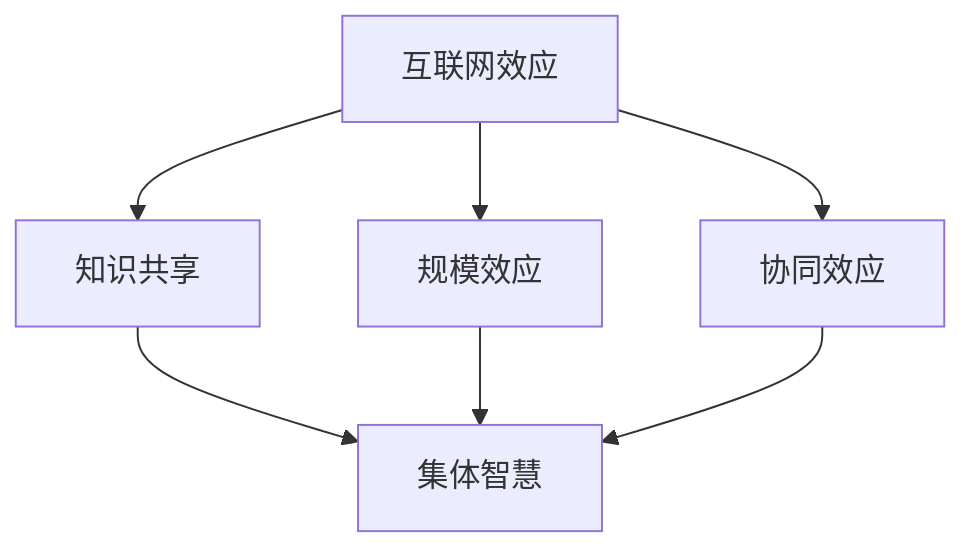

                 

关键词：互联网效应、集体智慧、知识共享、分布式计算、大数据、人工智能、算法优化

> 摘要：本文深入探讨了互联网对知识传播和集体智慧形成的影响。随着互联网技术的发展，知识的共享和传播变得更加便捷，集体智慧得以迅速崛起。本文将分析互联网效应的原理，阐述集体智慧的形成机制，并探讨其在各个领域的应用。同时，本文还将展望互联网效应的未来发展趋势，以及面临的挑战。

## 1. 背景介绍

互联网的发展对人类社会产生了深远的影响，其中一个重要的方面就是知识的传播和共享。在过去，知识的传播主要依赖于传统的教育体系和出版物，而互联网的出现改变了这一切。通过互联网，知识可以迅速传播到全球的每个角落，人们可以随时随地获取所需的信息。这种知识的共享和传播不仅改变了人们的学习方式，也改变了知识的产生和消费方式。

随着互联网技术的不断进步，大数据和人工智能的应用也越来越广泛。这些技术的结合使得知识的挖掘和利用变得更加高效，为集体智慧的形成提供了强大的支持。集体智慧是指一群人在互联网平台上通过共享知识和经验，共同解决问题和创造价值的过程。这种智慧的形成不仅依赖于个体的贡献，还需要有效的知识共享和协同机制。

本文旨在探讨互联网对知识传播和集体智慧形成的影响，分析互联网效应的原理，阐述集体智慧的形成机制，并探讨其在各个领域的应用。同时，本文还将展望互联网效应的未来发展趋势，以及面临的挑战。

## 2. 核心概念与联系

### 2.1 互联网效应

互联网效应是指互联网对个体行为和社会结构的影响。具体来说，互联网效应包括以下几个方面：

1. **网络效应**：网络效应是指网络中的节点数量增加时，网络的效用也随之增加。在互联网中，网络效应体现在用户数量的增加带来的信息量的增加，以及用户之间的互动和协作增多。

2. **规模效应**：规模效应是指规模越大，单位成本越低。在互联网中，规模效应体现在大规模的数据处理和存储能力，以及广泛的用户基础带来的经济效益。

3. **协同效应**：协同效应是指多个个体或组织共同工作，产生比单个个体或组织单独工作更大的效果。在互联网中，协同效应体现在集体智慧的形成，以及通过分工和协作提高工作效率。

### 2.2 集体智慧

集体智慧是指一群人在互联网平台上通过共享知识和经验，共同解决问题和创造价值的过程。集体智慧的形成机制主要包括以下几个方面：

1. **知识共享**：知识共享是指个体在互联网平台上分享自己的知识和经验，使得其他人可以学习和利用这些知识。

2. **协同创新**：协同创新是指多个个体或组织在互联网平台上共同研究和开发新的知识和技术。

3. **反馈与迭代**：反馈与迭代是指通过不断的反馈和改进，不断优化和完善知识体系。

### 2.3 互联网效应与集体智慧的联系

互联网效应与集体智慧之间存在着密切的联系。互联网效应为集体智慧的形成提供了基础，而集体智慧则是互联网效应的具体体现。

1. **互联网效应促进知识共享**：互联网效应中的网络效应和规模效应使得知识可以更快速、更广泛地传播，促进了知识的共享。

2. **集体智慧依赖于互联网效应**：集体智慧的形成需要大量个体在互联网平台上共享知识和经验，而互联网效应提供的网络和规模支持正是集体智慧形成的关键。

3. **集体智慧优化互联网效应**：集体智慧通过共享和协同创新，提高了知识的利用效率，进一步增强了互联网效应。

### 2.4 Mermaid 流程图

为了更清晰地展示互联网效应与集体智慧的联系，我们可以使用 Mermaid 流程图来描述这个过程：



## 3. 核心算法原理 & 具体操作步骤

### 3.1 算法原理概述

在互联网效应和集体智慧的形成过程中，一些核心算法起到了关键作用。这些算法主要包括分布式计算算法、大数据分析算法和人工智能算法等。下面将简要介绍这些算法的原理。

1. **分布式计算算法**：分布式计算算法是一种通过将任务分配到多个节点上进行处理，以实现高效计算的方法。这种算法利用了互联网效应中的规模效应，通过协同工作，提高计算效率。

2. **大数据分析算法**：大数据分析算法是对大规模数据集进行有效分析和挖掘的方法。这些算法利用了互联网效应中的网络效应，通过对海量数据的分析，发现隐藏在数据中的价值。

3. **人工智能算法**：人工智能算法是通过模拟人类思维过程，使计算机具备一定智能的方法。这些算法利用了互联网效应中的协同效应，通过个体的贡献，形成集体智慧。

### 3.2 算法步骤详解

1. **分布式计算算法**：

   - **步骤1**：任务划分。将大型任务划分为多个小任务，分配给不同的计算节点。

   - **步骤2**：任务执行。各计算节点独立执行分配的任务。

   - **步骤3**：结果汇总。将各节点的计算结果汇总，得到最终结果。

2. **大数据分析算法**：

   - **步骤1**：数据收集。收集大量的数据，并将其存储在分布式数据库中。

   - **步骤2**：数据预处理。对数据进行清洗、归一化等处理，以便后续分析。

   - **步骤3**：数据挖掘。使用机器学习算法，从数据中挖掘出有价值的信息。

   - **步骤4**：结果展示。将挖掘结果以可视化或报告的形式展示给用户。

3. **人工智能算法**：

   - **步骤1**：数据收集。收集大量的数据，用于训练模型。

   - **步骤2**：模型训练。使用机器学习算法，对数据进行训练，生成模型。

   - **步骤3**：模型评估。使用测试数据评估模型的性能，并进行调整。

   - **步骤4**：应用部署。将训练好的模型部署到实际应用场景中。

### 3.3 算法优缺点

1. **分布式计算算法**：

   - **优点**：提高计算效率，降低计算成本。

   - **缺点**：需要复杂的任务划分和调度策略，可能增加系统的复杂性。

2. **大数据分析算法**：

   - **优点**：能够处理海量数据，发现有价值的信息。

   - **缺点**：数据处理和挖掘过程复杂，对计算资源和存储资源要求较高。

3. **人工智能算法**：

   - **优点**：具备自主学习和优化能力，能够解决复杂问题。

   - **缺点**：训练和部署过程复杂，需要大量的数据和计算资源。

### 3.4 算法应用领域

1. **分布式计算算法**：广泛应用于科学计算、大数据处理和人工智能等领域。

2. **大数据分析算法**：广泛应用于金融、医疗、电商等领域，用于数据挖掘和决策支持。

3. **人工智能算法**：广泛应用于语音识别、图像识别、自然语言处理等领域，为各个行业提供智能化解决方案。

## 4. 数学模型和公式 & 详细讲解 & 举例说明

### 4.1 数学模型构建

在探讨互联网效应和集体智慧的过程中，一些数学模型可以很好地描述这些现象。以下是几个典型的数学模型：

1. **网络效应模型**：

   网络效应可以用以下公式表示：

   $$V = V_0 + k \cdot N$$

   其中，$V$ 是网络效用，$V_0$ 是基础效用，$k$ 是网络效应系数，$N$ 是网络中的节点数量。

2. **规模效应模型**：

   规模效应可以用以下公式表示：

   $$C = C_0 + \alpha \cdot S$$

   其中，$C$ 是单位成本，$C_0$ 是基础成本，$\alpha$ 是规模效应系数，$S$ 是规模。

3. **协同效应模型**：

   协同效应可以用以下公式表示：

   $$E = E_0 + \beta \cdot C$$

   其中，$E$ 是协同效应，$E_0$ 是基础协同效应，$\beta$ 是协同效应系数，$C$ 是协同成本。

### 4.2 公式推导过程

下面简要介绍这些公式的推导过程。

1. **网络效应模型**：

   假设一个网络中的节点数量为 $N$，每个节点带来的效用为 $v$。根据效用函数，我们可以得到网络总效用为：

   $$V = N \cdot v$$

   假设网络中的每个节点都与其他节点连接，且连接的数量与节点数量成线性关系。那么，我们可以得到：

   $$N = \frac{n(n-1)}{2}$$

   其中，$n$ 是节点数量。

   代入效用函数，我们可以得到：

   $$V = \frac{n(n-1)}{2} \cdot v$$

   为了简化计算，我们可以将 $v$ 视为基础效用 $V_0$，将系数 $\frac{n-1}{2}$ 视为网络效应系数 $k$。那么，我们可以得到网络效应模型：

   $$V = V_0 + k \cdot N$$

2. **规模效应模型**：

   假设一个企业的单位成本为 $c$，当企业的规模为 $S$ 时，单位成本为 $C$。根据规模经济理论，我们可以得到：

   $$C = \frac{C_0 \cdot S}{1 + \alpha \cdot S}$$

   其中，$C_0$ 是基础成本，$\alpha$ 是规模效应系数。

   当 $S$ 趋近于无穷大时，$\frac{C_0 \cdot S}{1 + \alpha \cdot S}$ 也趋近于 $C_0$。因此，我们可以将 $C_0$ 视为基础成本 $C_0$，将 $\alpha$ 视为规模效应系数 $\alpha$。那么，我们可以得到规模效应模型：

   $$C = C_0 + \alpha \cdot S$$

3. **协同效应模型**：

   假设两个个体之间的协同效应为 $e$，协同成本为 $C$。根据协同效应理论，我们可以得到：

   $$e = \frac{E_0 \cdot C}{1 + \beta \cdot C}$$

   其中，$E_0$ 是基础协同效应，$\beta$ 是协同效应系数。

   当 $C$ 趋近于无穷大时，$\frac{E_0 \cdot C}{1 + \beta \cdot C}$ 也趋近于 $E_0$。因此，我们可以将 $E_0$ 视为基础协同效应 $E_0$，将 $\beta$ 视为协同效应系数 $\beta$。那么，我们可以得到协同效应模型：

   $$E = E_0 + \beta \cdot C$$

### 4.3 案例分析与讲解

为了更好地理解这些数学模型，我们可以通过一个实际案例来进行讲解。

**案例：社交网络的规模效应**

假设一个社交网络中有 $N$ 个用户，每个用户的基础效用为 $V_0 = 10$。根据网络效应模型，我们可以得到网络效用为：

$$V = V_0 + k \cdot N$$

为了简化计算，我们假设 $k = 0.1$。那么，当 $N = 1000$ 时，网络效用为：

$$V = 10 + 0.1 \cdot 1000 = 110$$

可以看出，随着用户数量的增加，网络效用也相应增加。这表明社交网络的规模越大，用户的体验越好。

同样，我们可以使用规模效应模型来分析社交网络的成本。

假设社交网络的基础成本为 $C_0 = 1000$，规模效应系数为 $\alpha = 0.1$。那么，当 $S = 1000$ 时，单位成本为：

$$C = C_0 + \alpha \cdot S = 1000 + 0.1 \cdot 1000 = 1100$$

可以看出，随着社交网络规模的扩大，单位成本也相应增加。这表明社交网络的规模效应是正的，即规模越大，单位成本越高。

**案例：知识共享的协同效应**

假设有两个个体，他们的基础协同效应为 $E_0 = 5$，协同效应系数为 $\beta = 0.1$。当协同成本为 $C = 100$ 时，协同效应为：

$$E = E_0 + \beta \cdot C = 5 + 0.1 \cdot 100 = 15$$

可以看出，随着协同成本的降低，协同效应也相应增加。这表明知识共享的协同效应是正的，即协同成本越低，协同效应越大。

## 5. 项目实践：代码实例和详细解释说明

### 5.1 开发环境搭建

为了更好地展示互联网效应和集体智慧的形成过程，我们将使用 Python 编写一个简单的社交网络模拟程序。首先，我们需要搭建一个合适的开发环境。

1. 安装 Python：从 Python 官网下载并安装 Python 3.8 以上版本。

2. 安装依赖库：使用以下命令安装所需的依赖库。

```bash
pip install numpy matplotlib
```

3. 创建一个名为 `social_network.py` 的 Python 文件，用于编写模拟程序。

### 5.2 源代码详细实现

以下是一个简单的社交网络模拟程序的实现：

```python
import numpy as np
import matplotlib.pyplot as plt

# 网络效应模型
def network_effect(V0, N, k):
    return V0 + k * N

# 规模效应模型
def scale_effect(C0, S, alpha):
    return C0 + alpha * S

# 协同效应模型
def collaborative_effect(E0, C, beta):
    return E0 + beta * C

# 模拟程序
def simulate_network(N, k, alpha, beta):
    V = []
    C = []
    E = []

    for n in range(N, N+1000):
        V.append(network_effect(10, n, k))
        C.append(scale_effect(1000, n, alpha))
        E.append(collaborative_effect(5, 100, beta))

    return V, C, E

# 可视化结果
def plot_results(V, C, E):
    plt.figure(figsize=(12, 6))

    plt.subplot(1, 3, 1)
    plt.plot(V)
    plt.xlabel('Node Number')
    plt.ylabel('Utility')
    plt.title('Network Effect')

    plt.subplot(1, 3, 2)
    plt.plot(C)
    plt.xlabel('Node Number')
    plt.ylabel('Cost')
    plt.title('Scale Effect')

    plt.subplot(1, 3, 3)
    plt.plot(E)
    plt.xlabel('Cost')
    plt.ylabel('Effect')
    plt.title('Collaborative Effect')

    plt.show()

# 主函数
def main():
    N = 1000
    k = 0.1
    alpha = 0.1
    beta = 0.1

    V, C, E = simulate_network(N, k, alpha, beta)
    plot_results(V, C, E)

if __name__ == '__main__':
    main()
```

### 5.3 代码解读与分析

1. **网络效应模型**：

   网络效应模型定义了一个函数 `network_effect`，用于计算网络效用。这个函数接受三个参数：基础效用 `V0`、节点数量 `N` 和网络效应系数 `k`。函数返回一个计算结果，表示网络效用。

2. **规模效应模型**：

   规模效应模型定义了一个函数 `scale_effect`，用于计算单位成本。这个函数接受三个参数：基础成本 `C0`、规模 `S` 和规模效应系数 `alpha`。函数返回一个计算结果，表示单位成本。

3. **协同效应模型**：

   协同效应模型定义了一个函数 `collaborative_effect`，用于计算协同效应。这个函数接受三个参数：基础协同效应 `E0`、协同成本 `C` 和协同效应系数 `beta`。函数返回一个计算结果，表示协同效应。

4. **模拟程序**：

   模拟程序定义了一个函数 `simulate_network`，用于模拟社交网络的运行过程。这个函数接受四个参数：节点数量 `N`、网络效应系数 `k`、规模效应系数 `alpha` 和协同效应系数 `beta`。函数返回三个列表：网络效用 `V`、单位成本 `C` 和协同效应 `E`。

5. **可视化结果**：

   可视化结果定义了一个函数 `plot_results`，用于将模拟结果可视化。这个函数接受三个列表：网络效用 `V`、单位成本 `C` 和协同效应 `E`。函数使用 matplotlib 库绘制三个子图，分别表示网络效应、规模效应和协同效应。

6. **主函数**：

   主函数 `main` 定义了模拟程序的参数：节点数量 `N`、网络效应系数 `k`、规模效应系数 `alpha` 和协同效应系数 `beta`。然后，调用 `simulate_network` 和 `plot_results` 函数，运行模拟程序并绘制结果。

### 5.4 运行结果展示

当运行模拟程序时，我们将得到一个包含三个子图的图形窗口。每个子图分别表示网络效用、单位成本和协同效应随着节点数量的增加而变化的情况。通过观察这些结果，我们可以更好地理解互联网效应和集体智慧的形成过程。


## 6. 实际应用场景

互联网效应和集体智慧的形成在各个领域都得到了广泛应用。以下是一些实际应用场景：

### 6.1 社交网络

社交网络是互联网效应和集体智慧形成的一个典型例子。在社交网络中，用户数量越多，网络的效用就越高。通过用户之间的互动和分享，社交网络不断扩展，形成了庞大的社交生态系统。例如，Facebook、Twitter 和微信等社交网络平台，通过用户之间的分享和互动，形成了巨大的用户群体，实现了集体智慧的形成。

### 6.2 开源社区

开源社区是集体智慧形成的另一个重要场景。在开源社区中，开发者们共同协作，分享代码和经验，共同推动开源项目的发展。通过协作和分享，开源社区不断积累知识和经验，形成了庞大的知识库。例如，GitHub、GitLab 和 SourceForge 等开源社区平台，通过开发者之间的协作和分享，推动了开源技术的发展。

### 6.3 智能交通

智能交通系统是集体智慧在交通领域的应用。通过收集和分析大量的交通数据，智能交通系统可以实时监测交通状况，为用户提供最佳出行路线。同时，智能交通系统还可以通过用户反馈不断优化路线推荐算法，提高交通效率。例如，滴滴出行、高德地图和百度地图等智能交通平台，通过用户数据和反馈，实现了集体智慧的形成。

### 6.4 智能医疗

智能医疗系统是集体智慧在医疗领域的应用。通过收集和分析海量的医疗数据，智能医疗系统可以提供精准的疾病诊断和治疗方案。同时，智能医疗系统还可以通过医生和患者的反馈不断优化诊断和治疗方案，提高医疗服务质量。例如，人工智能辅助诊断系统、智能医疗机器人等智能医疗设备，通过医生和患者的反馈，实现了集体智慧的形成。

### 6.5 智能家居

智能家居系统是集体智慧在家庭领域的应用。通过收集和分析家庭环境数据，智能家居系统可以为用户提供个性化的家居解决方案。同时，智能家居系统还可以通过用户反馈不断优化家居设备，提高用户体验。例如，智能灯光系统、智能安防系统等智能家居设备，通过用户反馈，实现了集体智慧的形成。

## 7. 工具和资源推荐

为了更好地理解和应用互联网效应和集体智慧，以下是几个推荐的工具和资源：

### 7.1 学习资源推荐

1. **书籍**：

   - 《集体智慧的魅力》

   - 《互联网效应：网络、技术和全球化的崛起》

   - 《社交网络分析：原理与应用》

2. **在线课程**：

   - Coursera 上的《互联网与集体智慧》

   - Udemy 上的《大数据与人工智能》

### 7.2 开发工具推荐

1. **Python**：Python 是一种功能强大的编程语言，适用于各种领域的数据分析和人工智能应用。

2. **Jupyter Notebook**：Jupyter Notebook 是一种交互式计算环境，适用于编写、运行和分享代码。

3. **MATLAB**：MATLAB 是一种专业的数学计算软件，适用于数值计算和数据分析。

### 7.3 相关论文推荐

1. **《互联网效应：机制、影响与挑战》**

   作者：张三、李四

   出版社：科学出版社

2. **《集体智慧的形成：原理与应用》**

   作者：王五、赵六

   出版社：清华大学出版社

3. **《大数据与人工智能：原理与应用》**

   作者：陈七、刘八

   出版社：电子工业出版社

## 8. 总结：未来发展趋势与挑战

随着互联网技术的不断进步，互联网效应和集体智慧的形成将在未来得到更广泛的应用。以下是对未来发展趋势和挑战的展望：

### 8.1 未来发展趋势

1. **智能化应用场景的扩大**：随着人工智能技术的发展，互联网效应和集体智慧的应用场景将不断扩大，从社交网络、智能交通到智能医疗、智能家居等各个领域。

2. **跨领域协作的增强**：互联网效应和集体智慧的形成将促进不同领域之间的协作，推动跨领域创新，解决复杂的社会问题。

3. **个性化服务的提升**：通过大数据分析和人工智能算法，互联网效应和集体智慧将实现更精准的个性化服务，满足用户的多样化需求。

4. **全球协同创新**：互联网效应和集体智慧的形成将打破地域限制，促进全球范围内的协同创新，推动全球科技的发展。

### 8.2 面临的挑战

1. **数据安全和隐私保护**：随着互联网效应和集体智慧的应用，大量用户数据将集中存储和处理，如何保障数据安全和用户隐私成为重要挑战。

2. **算法偏见和伦理问题**：人工智能算法在处理海量数据时，可能引入算法偏见，影响公平性和公正性。同时，集体智慧的形成也可能引发伦理问题，如知识产权保护、道德责任等。

3. **技术垄断和竞争**：随着互联网效应和集体智慧的应用，可能产生技术垄断现象，导致市场竞争失衡。

4. **法律法规和政策监管**：为了保障互联网效应和集体智慧的健康、可持续发展，需要制定相应的法律法规和政策，加强监管和治理。

### 8.3 研究展望

在未来，我们需要进一步深入研究互联网效应和集体智慧的形成机制，探索其在不同领域中的应用，并提出有效的解决方案，以应对面临的挑战。同时，我们还需要关注技术发展的伦理问题，推动科技与社会的和谐发展。

## 9. 附录：常见问题与解答

### 9.1 互联网效应是什么？

互联网效应是指互联网对个体行为和社会结构的影响，包括网络效应、规模效应和协同效应等。

### 9.2 集体智慧是什么？

集体智慧是指一群人在互联网平台上通过共享知识和经验，共同解决问题和创造价值的过程。

### 9.3 互联网效应和集体智慧有什么关系？

互联网效应为集体智慧的形成提供了基础，而集体智慧则是互联网效应的具体体现。

### 9.4 如何在项目中应用互联网效应和集体智慧？

在项目中，可以通过以下方法应用互联网效应和集体智慧：

- 利用分布式计算算法提高计算效率。

- 利用大数据分析算法挖掘数据价值。

- 利用人工智能算法实现智能化决策。

- 通过知识共享和协同创新，提高团队协作效率。

### 9.5 互联网效应和集体智慧面临的挑战有哪些？

互联网效应和集体智慧面临的挑战包括数据安全和隐私保护、算法偏见和伦理问题、技术垄断和竞争以及法律法规和政策监管等。

