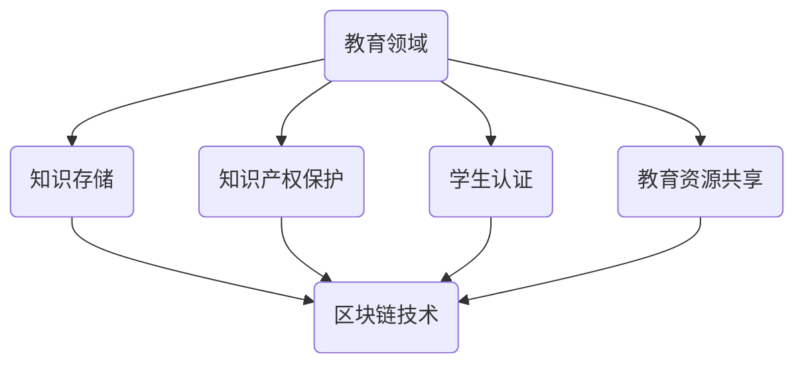

                 

关键词：区块链、分布式存储、教育技术、智能合约、透明性、去中心化、数据安全

> 摘要：本文探讨了区块链技术在教育领域的应用，特别是在知识的分布式存储方面。通过介绍区块链的基本概念和原理，分析其在教育中的应用场景，探讨其带来的挑战和解决方案，为教育行业的数字化转型提供了新的思路和方向。

## 1. 背景介绍

随着互联网技术的飞速发展，信息的获取和传播变得更加便捷。然而，传统中心化的信息存储方式也逐渐暴露出了一些问题，如数据不安全、易篡改、不透明等。为了解决这些问题，分布式存储技术应运而生，其中最具代表性的就是区块链技术。

区块链是一种去中心化的分布式数据库技术，通过加密算法和分布式共识机制，确保数据的不可篡改性和安全性。近年来，区块链技术在金融、物流、医疗等多个领域取得了显著的成果，其应用潜力也引起了教育领域的广泛关注。

教育行业长期以来面临着诸多挑战，如教育资源不均衡、信息孤岛现象严重、知识产权保护困难等。区块链技术的引入，有望解决这些问题，为教育行业的创新和发展提供新的动力。

## 2. 核心概念与联系

### 2.1 区块链的基本概念

区块链是一种去中心化的分布式数据库，由多个区块组成，每个区块包含一定数量的数据记录。区块之间通过加密算法和哈希函数相互连接，形成一条链式结构。区块链的核心特点是数据不可篡改，确保了系统的透明性和安全性。

### 2.2 教育与区块链的联系

在教育领域，区块链技术可以应用于知识存储、知识产权保护、学生认证、教育资源共享等方面。其核心优势在于去中心化、透明性、安全性和不可篡改性，这些特点与教育的本质需求相契合。

### 2.3 Mermaid 流程图



## 3. 核心算法原理 & 具体操作步骤

### 3.1 算法原理概述

区块链技术的核心在于分布式存储和共识机制。分布式存储确保数据不会集中在一个地方，从而提高了系统的容错性和安全性。共识机制则通过多个节点之间的协作，确保数据的真实性和一致性。

### 3.2 算法步骤详解

1. **数据收集**：将教育领域的知识、信息等数据收集起来，进行预处理。
2. **加密存储**：使用加密算法对数据进行加密，确保数据在存储过程中的安全性。
3. **分布式存储**：将加密后的数据分散存储到多个节点上，每个节点保存一部分数据。
4. **共识机制**：节点之间通过共识机制，确保数据的真实性和一致性。
5. **数据访问**：用户可以通过访问不同的节点，获取所需的知识和信息。

### 3.3 算法优缺点

**优点**：
- **去中心化**：数据存储在多个节点上，提高了系统的容错性和安全性。
- **透明性**：区块链上的数据可以被所有节点查看，保证了系统的透明性。
- **不可篡改**：数据一旦被记录在区块链上，就不可篡改，保证了数据的一致性和可信度。

**缺点**：
- **计算资源消耗**：区块链技术需要大量的计算资源来维持系统的运行，可能不适合对计算资源要求较高的应用场景。
- **扩展性受限**：区块链技术的设计初衷是为了去中心化，因此在扩展性方面存在一定限制。

### 3.4 算法应用领域

区块链技术可以应用于多个领域，如金融、物流、医疗等。在教育领域，其应用主要包括知识存储、知识产权保护、学生认证、教育资源共享等。

## 4. 数学模型和公式 & 详细讲解 & 举例说明

### 4.1 数学模型构建

区块链技术中的数学模型主要包括哈希函数、加密算法和共识机制。

- **哈希函数**：将任意长度的输入数据映射为固定长度的输出数据，输出数据被称为哈希值。哈希函数具有不可逆性、抗碰撞性和固定输出长度等特点。
- **加密算法**：对数据进行加密和解密，保证数据在传输和存储过程中的安全性。常见的加密算法包括对称加密、非对称加密和哈希加密。
- **共识机制**：确保区块链上数据的一致性和真实性。常见的共识机制包括工作量证明（PoW）、权益证明（PoS）和委托权益证明（DPoS）等。

### 4.2 公式推导过程

- **哈希函数**：\( H(k) = hash(k) \)，其中 \( H \) 表示哈希函数，\( k \) 表示输入数据，\( hash \) 表示哈希函数的运算结果。
- **加密算法**：设 \( E \) 为加密算法，\( D \) 为解密算法，\( k \) 为密钥，\( m \) 为明文，则加密过程为 \( c = E(m, k) \)，解密过程为 \( m = D(c, k) \)。
- **共识机制**：设 \( P \) 为参与共识的节点集合，\( S \) 为区块链上的数据集合，则共识过程为 \( consensus(P, S) \)。

### 4.3 案例分析与讲解

以比特币为例，比特币是一种基于区块链技术的数字货币。比特币的共识机制为工作量证明（PoW），节点通过解决数学难题来获得记账权。具体过程如下：

1. **数据收集**：比特币网络中的节点将交易数据打包成区块。
2. **加密存储**：区块被加密并存储在区块链上。
3. **共识机制**：节点通过解决数学难题，竞争记账权。难题的难度会根据网络的算力进行调整。
4. **数据访问**：用户可以通过比特币网络进行交易和查询。

## 5. 项目实践：代码实例和详细解释说明

### 5.1 开发环境搭建

在开始项目实践之前，需要搭建开发环境。这里我们使用Node.js作为开发环境，具体步骤如下：

1. 安装Node.js：从官方网站下载并安装Node.js。
2. 安装npm：Node.js附带npm（Node Package Manager），用于管理项目依赖。
3. 初始化项目：在项目目录下执行 `npm init`，按照提示生成 `package.json` 文件。

### 5.2 源代码详细实现

以下是一个简单的区块链实现示例：

```javascript
class Block {
  constructor(index, timestamp, data, previousHash = '') {
    this.index = index;
    this.timestamp = timestamp;
    this.data = data;
    this.previousHash = previousHash;
    this.hash = this.computeHash();
  }

  computeHash() {
    return sha256(this.index + this.timestamp + this.data + this.previousHash).toString();
  }
}

class Blockchain {
  constructor() {
    this.chain = [this.createGenesisBlock()];
  }

  createGenesisBlock() {
    return new Block(0, "01/01/2021", "Genesis Block", "0");
  }

  getLatestBlock() {
    return this.chain[this.chain.length - 1];
  }

  addBlock(newBlock) {
    newBlock.previousHash = this.getLatestBlock().hash;
    newBlock.hash = newBlock.computeHash();
    this.chain.push(newBlock);
  }

  isChainValid() {
    for (let i = 1; i < this.chain.length; i++) {
      const currentBlock = this.chain[i];
      const previousBlock = this.chain[i - 1];

      if (currentBlock.hash !== currentBlock.computeHash()) {
        return false;
      }

      if (currentBlock.previousHash !== previousBlock.hash) {
        return false;
      }
    }
    return true;
  }
}

const myBlockchain = new Blockchain();
myBlockchain.addBlock(new Block(1, "02/01/2021", "First Block"));
myBlockchain.addBlock(new Block(2, "03/01/2021", "Second Block"));

console.log(myBlockchain.isChainValid());
```

### 5.3 代码解读与分析

上述代码实现了最基本的区块链功能，包括创建创世区块、添加区块和验证链的合法性。

1. **Block 类**：表示一个区块，包含区块索引、时间戳、数据和前一个区块的哈希值。还包含一个计算哈希值的方法 `computeHash`。
2. **Blockchain 类**：表示整个区块链，包含一个包含所有区块的数组 `chain`。还包括创建创世区块、获取最新区块、添加区块和验证链合法性的方法。
3. **addBlock 方法**：用于添加新的区块到区块链。在添加新区块之前，需要确保新区块的前一个区块哈希值与当前区块链的最新区块哈希值一致。这确保了区块链的连续性和一致性。
4. **isChainValid 方法**：用于验证区块链的合法性。该方法遍历整个区块链，检查每个区块的哈希值和前一个区块的哈希值是否一致，以及当前区块的哈希值是否通过 `computeHash` 方法计算得出。如果所有区块都满足条件，则区块链被认为是合法的。

### 5.4 运行结果展示

在运行上述代码后，区块链会包含三个区块：创世区块、第一个区块和第二个区块。通过调用 `myBlockchain.isChainValid()` 方法，可以验证区块链的合法性。输出结果为 `true`，表示区块链是合法的。

## 6. 实际应用场景

### 6.1 知识存储

在教育领域，区块链技术可以用于存储大量的教育内容，如课程资料、学术论文、教学视频等。通过区块链技术，这些内容可以实现去中心化存储，确保数据的真实性和安全性。

### 6.2 知识产权保护

区块链技术可以用于保护教育领域的知识产权。例如，教师可以将自己的教学视频上传到区块链上，通过加密和去中心化存储，确保视频不会被篡改或盗用。同时，区块链上的交易记录可以证明内容的原创性和归属权。

### 6.3 学生认证

区块链技术可以用于学生的身份认证和成绩记录。例如，学生在入学时可以使用区块链技术进行身份认证，确保信息的真实性和唯一性。在学期间，学生的成绩、证书等信息也可以存储在区块链上，确保数据的可信度和透明性。

### 6.4 教育资源共享

区块链技术可以促进教育资源的共享和优化。例如，教师可以将自己的优质课程资源上传到区块链上，供其他教师和学生免费或付费使用。通过区块链技术，资源的使用情况可以实时记录和统计，为教育资源的管理和优化提供数据支持。

## 7. 未来应用展望

### 7.1 研究方向

1. **性能优化**：随着区块链应用规模的不断扩大，如何提高区块链的性能和扩展性成为一个重要研究方向。例如，通过改进共识机制、优化数据结构等手段，提高区块链的处理能力和响应速度。
2. **隐私保护**：在区块链应用中，如何保护用户的隐私信息是一个重要问题。未来的研究方向包括隐私计算、零知识证明等技术的应用，以提高区块链的隐私保护能力。
3. **跨链技术**：跨链技术是实现区块链之间数据互操作的关键。未来的研究方向包括跨链协议的设计与实现，以及跨链交易的优化和安全性保障。

### 7.2 潜在挑战

1. **技术成熟度**：尽管区块链技术取得了显著进展，但其技术成熟度仍然有待提高。例如，性能优化、隐私保护等方面仍然存在许多挑战。
2. **法律法规**：区块链技术的应用涉及多个领域，需要相应的法律法规进行规范和监管。未来需要完善相关法律法规，以确保区块链技术的健康发展。
3. **用户接受度**：区块链技术的普及程度和用户接受度仍然较低。未来需要加强宣传和推广，提高用户对区块链技术的认知和信任度。

## 8. 总结：未来发展趋势与挑战

区块链技术在教育领域的应用具有巨大的潜力和价值。通过分布式存储、去中心化、透明性等特性，区块链技术可以解决教育行业面临的诸多问题，如知识存储、知识产权保护、学生认证等。

然而，区块链技术仍面临一系列挑战，包括技术成熟度、法律法规和用户接受度等。未来，需要进一步研究和探索区块链技术在教育领域的应用，解决现有问题，推动教育行业的数字化转型。

### 9. 附录：常见问题与解答

**Q1：区块链技术是否安全？**

A1：区块链技术具有较高的安全性，其去中心化、加密算法和共识机制等特点确保了数据的安全性和不可篡改性。然而，任何技术都存在一定的安全风险，包括区块链技术。因此，在应用区块链技术时，需要采取相应的安全措施，如加密存储、身份认证等。

**Q2：区块链技术如何保证数据的一致性？**

A2：区块链技术通过分布式存储和共识机制，确保数据的一致性。在区块链网络中，多个节点同时存储数据，并通过共识机制达成一致。这样，即使某个节点出现故障或被攻击，其他节点仍然可以维持数据的一致性。

**Q3：区块链技术是否适合所有应用场景？**

A3：区块链技术具有去中心化、透明性、安全性等优点，但在某些场景下可能不适合使用。例如，对于对性能要求较高的应用场景，区块链技术可能存在一定的性能瓶颈。因此，在考虑使用区块链技术时，需要根据具体应用场景进行评估和选择。

## 作者署名

作者：禅与计算机程序设计艺术 / Zen and the Art of Computer Programming
----------------------------------------------------------------
以上就是关于《知识的分布式存储：区块链技术在教育中的应用》的完整文章。文章涵盖了区块链技术的基本概念、原理、应用场景以及具体实现，并对未来发展趋势和挑战进行了分析。希望这篇文章能够为教育行业的数字化转型提供一些有价值的参考和启示。

