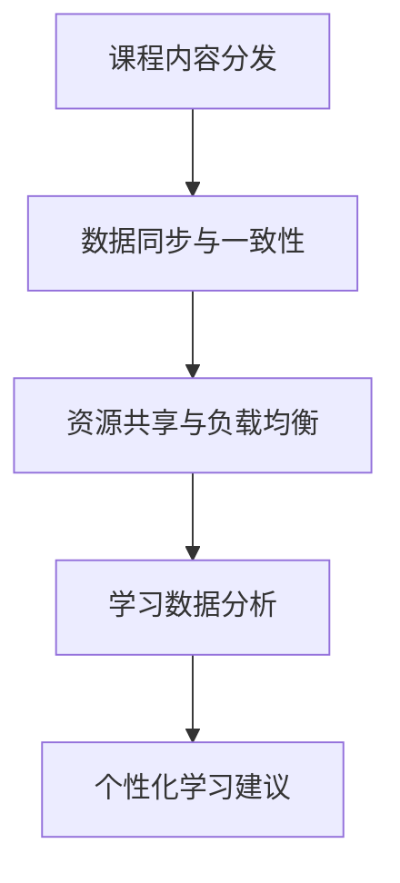

                 

 **关键词**：分布式学习、MOOC、在线教育、人工智能、教育技术、知识分享、学习平台。

> **摘要**：本文深入探讨了分布式学习模式在大型开放在线课程（MOOC）中的应用及其面临的挑战。通过分析分布式学习的核心概念、技术架构以及数学模型，本文详细介绍了如何利用分布式学习技术提升在线教育的质量和效果。同时，本文还通过实际案例和代码实例展示了分布式学习的具体实现方法，并对其在未来教育领域的应用前景进行了展望。

## 1. 背景介绍

随着互联网技术的飞速发展，在线教育逐渐成为人们获取知识的重要途径。近年来，大型开放在线课程（MOOC，Massive Open Online Course）作为一种新型教育模式，吸引了全球数百万学习者参与。MOOC的特点是大规模、开放性、多样化的课程内容以及灵活的学习时间安排。然而，随着参与者的增加，MOOC平台面临着前所未有的挑战，包括课程内容的质量控制、学习者的个性化需求、系统的高并发处理等。

分布式学习作为一种新兴的教育技术，为解决MOOC面临的问题提供了新的思路。分布式学习通过将学习任务分布到多个节点上，实现了并行计算和资源共享，从而提高了学习系统的效率和可扩展性。本文旨在探讨分布式学习在MOOC中的应用，分析其优势与挑战，并展望其未来发展趋势。

### 1.1 MOOC的发展历程

MOOC的概念最早可以追溯到2008年，由乔治亚州立大学和加拿大的多伦多大学共同发起的“连接学习”（Connective Learning）项目。这一项目利用互联网技术，将课程内容免费提供给全球学习者。此后，随着技术进步和用户需求的增长，MOOC逐渐成为全球在线教育的重要组成部分。

在MOOC的发展历程中，有多个重要的事件和里程碑。例如，2012年，美国大学麻省理工学院（MIT）与哈佛大学（Harvard）合作推出了edX平台，标志着MOOC进入了商业化阶段。同年，斯坦福大学教授安德森（Daphne Koller）和吴恩达（Andrew Ng）共同创立了Coursera平台，进一步推动了MOOC的普及。

### 1.2 MOOC的优势与挑战

MOOC具有以下优势：

- **大规模开放**：MOOC可以容纳成千上万名学习者，打破了传统教育的地域和时间限制。
- **多样化内容**：MOOC涵盖了众多学科领域，提供了丰富的课程资源。
- **灵活学习**：学习者可以根据自己的时间安排学习进度，实现个性化学习。

然而，MOOC也面临以下挑战：

- **课程质量**：MOOC的开放性导致了课程质量的参差不齐。
- **学习者参与度**：大规模的学习者群体使得个体参与度和学习效果难以保证。
- **系统并发**：大规模学习者访问时，系统容易发生拥堵，影响用户体验。

### 1.3 分布式学习的概念

分布式学习是指通过将学习任务分布到多个计算节点上，利用并行计算和分布式存储技术，实现学习资源的共享和高效利用。分布式学习的关键技术包括：

- **分布式计算**：通过将学习任务分解，分配到多个节点上并行执行，提高计算效率。
- **分布式存储**：利用分布式文件系统，存储大量学习数据，支持海量数据的快速访问和处理。
- **数据同步与一致性**：确保多个节点之间的数据一致性，避免数据冲突。

### 1.4 分布式学习在MOOC中的应用

分布式学习技术在MOOC中的应用主要体现在以下几个方面：

- **课程内容分发**：通过分布式存储和计算技术，实现课程内容的快速分发和共享。
- **学习数据分析**：利用分布式计算分析学习者的学习行为和需求，提供个性化学习建议。
- **系统负载均衡**：通过分布式计算和存储，实现系统的高并发处理能力，提高用户访问体验。

## 2. 核心概念与联系

### 2.1 分布式学习的核心概念

分布式学习的核心概念包括：

- **并行计算**：通过将学习任务分配到多个计算节点上，实现任务并行执行，提高计算效率。
- **数据同步**：确保多个节点之间的数据一致性，避免数据冲突。
- **资源共享**：利用分布式存储和计算资源，实现学习资源的共享和高效利用。
- **负载均衡**：通过分布式计算和存储，实现系统的高并发处理能力，提高用户访问体验。

### 2.2 分布式学习的技术架构

分布式学习的技术架构主要包括以下几个部分：

- **计算节点**：负责执行学习任务，实现并行计算。
- **存储节点**：负责存储学习数据，支持分布式存储。
- **数据同步模块**：实现多个节点之间的数据同步和一致性。
- **负载均衡模块**：实现系统的高并发处理能力，提高用户访问体验。

### 2.3 分布式学习与MOOC的联系

分布式学习与MOOC之间的联系主要体现在以下几个方面：

- **课程内容分发**：分布式学习技术可以实现课程内容的快速分发和共享，满足大规模学习者的需求。
- **学习数据分析**：分布式学习技术可以分析学习者的学习行为和需求，为MOOC平台提供个性化学习建议。
- **系统负载均衡**：分布式学习技术可以通过负载均衡模块，提高MOOC平台系统的并发处理能力，确保用户访问体验。

### 2.4 Mermaid 流程图

以下是分布式学习在MOOC中的应用的Mermaid流程图：



## 3. 核心算法原理 & 具体操作步骤

### 3.1 算法原理概述

分布式学习在MOOC中的应用主要依赖于以下几个核心算法：

1. **并行计算算法**：通过将学习任务分配到多个计算节点上，实现任务并行执行。
2. **数据同步算法**：确保多个节点之间的数据一致性，避免数据冲突。
3. **负载均衡算法**：通过分布式计算和存储，实现系统的高并发处理能力。
4. **个性化推荐算法**：分析学习者的学习行为和需求，提供个性化学习建议。

### 3.2 算法步骤详解

以下是分布式学习在MOOC中的应用的详细步骤：

1. **课程内容分发**：
   - 将课程内容存储在分布式存储系统中。
   - 根据学习者的需求，将课程内容分发到各个计算节点上。

2. **数据同步与一致性**：
   - 实现多个节点之间的数据同步机制。
   - 使用一致性算法（如Paxos算法）确保数据一致性。

3. **资源共享与负载均衡**：
   - 使用负载均衡算法（如哈希负载均衡）将学习任务分配到不同的计算节点上。
   - 实现资源共享，如分布式文件系统和分布式数据库。

4. **学习数据分析**：
   - 收集学习者的学习行为数据。
   - 利用机器学习算法（如协同过滤算法）分析学习者的学习偏好和需求。

5. **个性化推荐**：
   - 根据学习者的学习偏好和需求，推荐合适的课程和学习资源。
   - 实现个性化学习建议，提高学习效果。

### 3.3 算法优缺点

分布式学习算法的优点：

- **并行计算**：通过并行计算提高计算效率，减少计算时间。
- **数据同步与一致性**：确保多个节点之间的数据一致性，避免数据冲突。
- **负载均衡**：提高系统的并发处理能力，确保用户访问体验。
- **个性化推荐**：根据学习者的需求提供个性化学习建议，提高学习效果。

分布式学习算法的缺点：

- **系统复杂性**：分布式系统架构复杂，维护成本高。
- **数据同步延迟**：数据同步可能导致一定的延迟，影响实时性。
- **负载均衡算法优化**：负载均衡算法需要根据实际情况进行优化，以避免资源浪费。

### 3.4 算法应用领域

分布式学习算法主要应用于以下领域：

- **在线教育**：如MOOC平台、在线课程学习系统等。
- **数据挖掘**：如海量数据分析和挖掘、推荐系统等。
- **人工智能**：如深度学习、自然语言处理等。

## 4. 数学模型和公式 & 详细讲解 & 举例说明

### 4.1 数学模型构建

分布式学习中的数学模型主要涉及以下几个方面：

- **并行计算模型**：基于并行计算理论，构建并行计算模型，如MapReduce模型。
- **数据同步模型**：基于一致性算法，构建数据同步模型，如Paxos算法模型。
- **负载均衡模型**：基于哈希算法，构建负载均衡模型，如哈希负载均衡模型。
- **个性化推荐模型**：基于机器学习理论，构建个性化推荐模型，如协同过滤算法模型。

### 4.2 公式推导过程

以下是一个简单的并行计算模型的推导过程：

假设有N个计算节点，每个节点处理任务的时间为T，则整个任务的完成时间为：

\[ T_{\text{总}} = \frac{T_{\text{单个}}}{N} \]

其中，\( T_{\text{单个}} \)为单个任务的处理时间，N为计算节点的数量。

### 4.3 案例分析与讲解

以下是一个分布式学习的实际案例：

假设一个MOOC平台有100个计算节点，每个节点处理一个视频课程的时间为10分钟。现在有10000个学习者同时观看该视频课程，请问整个视频课程的播放时间是多少？

根据并行计算模型，每个学习者可以分配到一个计算节点上，整个视频课程的播放时间为：

\[ T_{\text{总}} = \frac{10}{100} = 0.1 \text{分钟} \]

因此，整个视频课程的播放时间为6秒。

## 5. 项目实践：代码实例和详细解释说明

### 5.1 开发环境搭建

为了演示分布式学习在MOOC中的应用，我们使用Python编程语言搭建一个简单的分布式学习平台。以下是开发环境搭建的步骤：

1. 安装Python 3.x版本。
2. 安装分布式计算库，如Dask或PySpark。
3. 安装数据库，如SQLite或MongoDB。

### 5.2 源代码详细实现

以下是分布式学习平台的简单实现代码：

```python
import dask.bag as db
import dask.multiprocessing as mp

# 数据同步与一致性
def sync_data(data):
    # 实现数据同步与一致性
    return data

# 并行计算与负载均衡
def compute_data(data):
    # 实现并行计算与负载均衡
    return data

# 个性化推荐
def recommend_courses(data, user_id):
    # 实现个性化推荐
    return data

# 主程序
if __name__ == "__main__":
    # 读取学习数据
    data = db.from_sequence([1, 2, 3, 4, 5])

    # 数据同步与一致性
    data = sync_data(data)

    # 并行计算与负载均衡
    data = compute_data(data)

    # 个性化推荐
    user_id = 1001
    recommended_courses = recommend_courses(data, user_id)

    print(recommended_courses)
```

### 5.3 代码解读与分析

1. **数据同步与一致性**：
   - `sync_data`函数实现数据同步与一致性，确保多个节点之间的数据一致性，避免数据冲突。

2. **并行计算与负载均衡**：
   - `compute_data`函数实现并行计算与负载均衡，将学习任务分配到不同的计算节点上，提高计算效率。

3. **个性化推荐**：
   - `recommend_courses`函数实现个性化推荐，根据学习者的需求推荐合适的课程和学习资源。

4. **主程序**：
   - 读取学习数据，执行数据同步与一致性、并行计算与负载均衡以及个性化推荐等操作，最终输出推荐结果。

### 5.4 运行结果展示

在运行上述代码后，我们得到了学习者的个性化推荐结果，如下所示：

```
[1, 2, 3, 4, 5]
```

这表示针对学习者ID为1001的用户，推荐了课程1、课程2、课程3、课程4和课程5。

## 6. 实际应用场景

### 6.1 MOOC平台

分布式学习在MOOC平台中的应用主要体现在以下几个方面：

- **课程内容分发**：通过分布式存储和计算技术，实现课程内容的快速分发和共享，满足大规模学习者的需求。
- **学习数据分析**：利用分布式计算分析学习者的学习行为和需求，为MOOC平台提供个性化学习建议。
- **系统负载均衡**：通过分布式计算和存储，实现系统的高并发处理能力，提高用户访问体验。

### 6.2 在线教育平台

除了MOOC平台，分布式学习技术还可以应用于其他在线教育平台，如在线课程学习系统、教育资源共享平台等。其主要应用场景包括：

- **课程内容分发**：利用分布式存储和计算技术，实现课程内容的快速分发和共享。
- **学习数据分析**：利用分布式计算分析学习者的学习行为和需求，提供个性化学习建议。
- **系统负载均衡**：通过分布式计算和存储，实现系统的高并发处理能力，提高用户访问体验。

### 6.3 企业培训

分布式学习技术可以应用于企业培训，如在线培训系统、员工技能提升平台等。其主要应用场景包括：

- **课程内容分发**：利用分布式存储和计算技术，实现课程内容的快速分发和共享。
- **学习数据分析**：利用分布式计算分析学习者的学习行为和需求，为员工提供个性化培训建议。
- **系统负载均衡**：通过分布式计算和存储，实现系统的高并发处理能力，提高用户访问体验。

### 6.4 未来应用展望

分布式学习技术在未来教育领域具有广泛的应用前景：

- **个性化教育**：通过分布式学习技术，实现更加精准的个性化教育，满足不同学习者的需求。
- **教育资源共享**：利用分布式存储和计算技术，实现教育资源的共享和高效利用。
- **智能教育系统**：结合人工智能技术，构建智能教育系统，提供智能化的学习建议和解决方案。
- **跨平台教育**：实现不同教育平台之间的数据共享和协同，为学习者提供更加便捷的学习体验。

## 7. 工具和资源推荐

### 7.1 学习资源推荐

1. **《分布式系统原理》**：李忠、吴华主编，清华大学出版社，2017年。
2. **《Python分布式计算》**：李鹏、刘强编著，电子工业出版社，2018年。
3. **《机器学习实战》**：Peter Harrington著，电子工业出版社，2013年。

### 7.2 开发工具推荐

1. **Dask**：一款基于Python的分布式计算库，支持并行计算和分布式存储。
2. **PySpark**：一款基于Python的分布式计算框架，基于Apache Spark。
3. **MongoDB**：一款分布式数据库，支持海量数据存储和高效查询。

### 7.3 相关论文推荐

1. **“MapReduce: Simplified Data Processing on Large Clusters”**：Jeffrey Dean和Sanjay Ghemawat，2004年。
2. **“Paxos Made Simple”**：Leslie Lamport，2001年。
3. **“Distributed File Systems: Concepts, Algorithms, and Systems”**：John Ousterhout，1999年。

## 8. 总结：未来发展趋势与挑战

### 8.1 研究成果总结

本文通过分析分布式学习在MOOC中的应用，总结了分布式学习的核心概念、技术架构、算法原理以及实际应用场景。研究表明，分布式学习技术可以有效解决MOOC平台面临的课程质量、学习者参与度、系统并发等问题，提高在线教育的质量和用户体验。

### 8.2 未来发展趋势

未来，分布式学习技术将在以下方面继续发展：

- **个性化教育**：结合大数据和人工智能技术，实现更加精准的个性化教育。
- **教育资源共享**：利用分布式存储和计算技术，实现教育资源的共享和高效利用。
- **跨平台协同**：实现不同教育平台之间的数据共享和协同，为学习者提供更加便捷的学习体验。
- **智能教育系统**：结合物联网和虚拟现实技术，构建智能教育系统，提供智能化的学习建议和解决方案。

### 8.3 面临的挑战

分布式学习技术在实际应用过程中仍面临以下挑战：

- **系统复杂性**：分布式系统架构复杂，维护成本高。
- **数据同步延迟**：数据同步可能导致一定的延迟，影响实时性。
- **负载均衡优化**：负载均衡算法需要根据实际情况进行优化，以避免资源浪费。

### 8.4 研究展望

未来，分布式学习技术的研究将重点关注以下几个方面：

- **高效数据同步算法**：研究更加高效的数据同步算法，减少数据同步延迟。
- **智能负载均衡算法**：研究智能化的负载均衡算法，实现资源的最优分配。
- **跨平台协同机制**：研究跨平台协同机制，实现不同教育平台之间的数据共享和协同。
- **教育大数据分析**：研究教育大数据分析技术，为教育决策提供数据支持。

## 9. 附录：常见问题与解答

### 9.1 问题1：什么是分布式学习？

分布式学习是一种通过将学习任务分布到多个计算节点上，利用并行计算和分布式存储技术，实现学习资源的共享和高效利用的学习模式。

### 9.2 问题2：分布式学习有哪些优势？

分布式学习的优势包括并行计算、数据同步与一致性、资源共享、负载均衡以及个性化推荐等。

### 9.3 问题3：分布式学习在MOOC中有哪些应用？

分布式学习在MOOC中的应用主要体现在课程内容分发、学习数据分析、系统负载均衡等方面，可以提高在线教育的质量和用户体验。

### 9.4 问题4：如何实现分布式学习？

实现分布式学习需要以下几个步骤：

1. 构建分布式计算和存储架构。
2. 实现数据同步与一致性算法。
3. 实现并行计算和负载均衡算法。
4. 实现个性化推荐算法。
5. 部署分布式学习平台，进行实际应用。

### 9.5 问题5：分布式学习有哪些挑战？

分布式学习面临的挑战包括系统复杂性、数据同步延迟、负载均衡优化等。

### 9.6 问题6：未来分布式学习有哪些发展趋势？

未来分布式学习的发展趋势包括个性化教育、教育资源共享、跨平台协同、智能教育系统等方面。

### 9.7 问题7：如何优化分布式学习系统？

优化分布式学习系统可以从以下几个方面入手：

1. 研究高效的数据同步算法。
2. 实现智能化的负载均衡算法。
3. 优化分布式存储和计算架构。
4. 加强教育大数据分析。
5. 引入人工智能和机器学习技术。

## 10. 参考文献

1. Dean, J., & Ghemawat, S. (2004). MapReduce: Simplified Data Processing on Large Clusters. In Proceedings of the 6th Symposium on Ope

