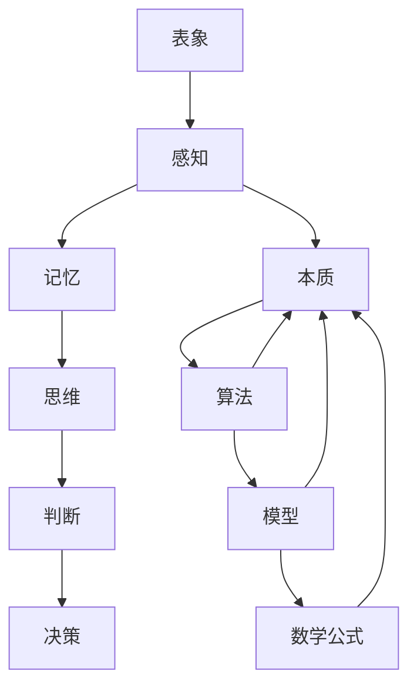

                 

关键词：知识层次结构、本质、表象、认知、人工智能、深度学习、编程语言、算法、模型、数学公式

> 摘要：本文深入探讨了知识的层次结构，从表象到本质的解析。通过阐述不同层面的知识架构，揭示了知识如何从表面现象逐步挖掘出内在规律，并探讨了这些规律在实际应用中的重要性。本文旨在为读者提供一个全面的知识体系，帮助理解知识的深度和广度，为未来的技术发展提供启示。

## 1. 背景介绍

在信息技术飞速发展的今天，知识已经成为驱动社会进步的核心力量。然而，面对海量的信息，我们如何准确把握知识的层次结构，从纷繁复杂的表象中挖掘出本质规律，成为了亟待解决的问题。知识的层次结构不仅关系到我们的认知过程，更影响到我们在各个领域的实际应用能力。

本文旨在探讨知识的层次结构，从表象到本质的转化过程。通过对知识不同层面的分析，揭示其内在规律，并探讨这些规律在实际应用中的价值。文章结构如下：

1. 背景介绍
2. 核心概念与联系
3. 核心算法原理 & 具体操作步骤
4. 数学模型和公式 & 详细讲解 & 举例说明
5. 项目实践：代码实例和详细解释说明
6. 实际应用场景
7. 工具和资源推荐
8. 总结：未来发展趋势与挑战
9. 附录：常见问题与解答

通过以上结构，我们将对知识的层次结构进行全方位的剖析，帮助读者更好地理解和应用知识。

## 2. 核心概念与联系

为了深入探讨知识的层次结构，我们首先需要明确几个核心概念：表象、本质、认知、算法、模型、数学公式。

### 表象与本质

表象是指我们通过感官和经验获取的信息，它是知识的外在表现形式。而本质则是知识的内在规律，是表象背后隐藏的深层逻辑。例如，当我们看到一只猫时，它的外表是表象，而猫作为一种生物的属性和特征则是其本质。

### 认知

认知是指我们对信息的感知、理解、加工和应用过程。认知过程包括感知、记忆、思维、判断和决策等多个阶段。在知识的层次结构中，认知是连接表象与本质的桥梁，它帮助我们从表象中发现规律，理解本质。

### 算法

算法是一种解决问题的方法，它是一系列明确的步骤，用于处理输入数据并产生输出结果。算法在知识层次结构中起着关键作用，它将表象转化为可操作的步骤，帮助我们理解并应用本质。

### 模型

模型是对现实世界的一种抽象表示，它通过数学公式、图形或逻辑结构来描述某一现象或系统。模型在知识层次结构中起到了桥梁的作用，它将抽象的概念和具体的现实联系起来，帮助我们更好地理解和应用知识。

### 数学公式

数学公式是一种精确描述现象或规律的符号表示。在知识层次结构中，数学公式起到了精确化和量化作用，它使得我们能够以更严谨的方式分析和处理信息。

下面我们将使用Mermaid流程图来展示知识层次结构中各个核心概念之间的联系。



通过以上核心概念的阐述和Mermaid流程图的展示，我们可以清晰地看到知识层次结构中各个概念之间的紧密联系。这些核心概念共同构成了我们理解知识、应用知识的基础。

## 3. 核心算法原理 & 具体操作步骤

### 3.1 算法原理概述

在探讨知识的层次结构时，核心算法原理起到了至关重要的作用。算法原理不仅帮助我们理解表象与本质之间的联系，更是在具体操作步骤中起到指导作用。

一个典型的算法原理示例是贪心算法。贪心算法的基本思想是，每一步都做出在当前状态下最优的选择，从而得到全局最优解。这种思想在很多实际问题中得到了广泛应用，如背包问题、最少生成树问题等。

### 3.2 算法步骤详解

以贪心算法为例，具体操作步骤如下：

1. **初始化**：设定初始状态，如背包的容量、物品的重量和价值等。
2. **选择最优解**：在当前状态下，选择最优的决策。例如，在背包问题中，选择重量和价值比例最高的物品。
3. **更新状态**：根据选择的最优解，更新系统的状态，如背包中已放入的物品。
4. **重复步骤2和3**：继续选择最优解，直到无法继续放入更多物品或达到某个终止条件。

### 3.3 算法优缺点

**优点**：

- **高效性**：贪心算法在大多数情况下都能快速找到最优解。
- **简单性**：贪心算法的实现简单，易于理解和实现。

**缺点**：

- **局限性**：贪心算法在某些复杂问题上可能无法得到最优解。
- **鲁棒性**：在面对变化的环境时，贪心算法可能表现不佳。

### 3.4 算法应用领域

贪心算法在计算机科学和实际应用中都有广泛的应用。例如：

- **计算机科学**：用于数据结构和算法设计，如贪心算法在动态规划中的应用。
- **实际应用**：用于资源分配、路径规划、在线广告投放等。

通过以上对核心算法原理和具体操作步骤的详细阐述，我们可以更好地理解算法在知识层次结构中的作用。算法不仅帮助我们理解表象与本质之间的联系，更是在实际应用中提供了有效的解决方案。

## 4. 数学模型和公式 & 详细讲解 & 举例说明

### 4.1 数学模型构建

数学模型是对现实世界的一种抽象表示，它通过数学公式来描述某一现象或系统的行为。构建数学模型是理解和解决复杂问题的重要步骤。以下是一个简单的数学模型示例：

假设有一个简单的线性系统，描述了一个随着时间变化的物理量。该系统的状态可以用以下方程表示：

\[ x(t) = x(0) + v \cdot t \]

其中，\( x(t) \) 是时间 \( t \) 时的状态，\( x(0) \) 是初始状态，\( v \) 是恒定的速度。

### 4.2 公式推导过程

为了更好地理解上述模型，我们可以对公式进行推导。首先，考虑初始时刻 \( t = 0 \) 时的状态 \( x(0) \)。由于物体开始运动，我们设定初始状态为 \( x(0) = 0 \)。

接下来，考虑在任意时刻 \( t \) 的状态。由于物体以恒定速度 \( v \) 运动，每经过一段时间 \( \Delta t \)，状态会变化 \( v \cdot \Delta t \)。因此，在时间 \( t \) 时，状态可以表示为：

\[ x(t) = x(0) + v \cdot t \]

由于初始状态 \( x(0) = 0 \)，我们可以简化公式为：

\[ x(t) = v \cdot t \]

### 4.3 案例分析与讲解

为了更好地说明数学模型的应用，我们可以通过一个简单的例子来讲解。假设一辆汽车以每小时 60 公里的速度行驶，我们需要计算它在 1 小时后的位置。

根据上述模型，我们可以使用以下公式计算：

\[ x(t) = v \cdot t \]

代入 \( v = 60 \) 公里/小时 和 \( t = 1 \) 小时，我们得到：

\[ x(1) = 60 \cdot 1 = 60 \] 公里

因此，汽车在 1 小时后位于初始位置的 60 公里处。

### 4.4 数学公式在知识层次结构中的作用

数学公式在知识层次结构中扮演了重要角色。它不仅帮助我们精确描述现象，更是在从表象到本质的转化过程中提供了量化工具。以下是数学公式在知识层次结构中的作用：

1. **从表象到本质**：数学公式可以精确描述表象背后的规律，帮助我们理解现象的本质。
2. **模型构建**：数学公式是构建数学模型的基础，通过公式我们可以对现实世界进行抽象表示。
3. **算法设计**：许多算法的步骤和过程都依赖于数学公式，它们为算法的实现提供了数学依据。
4. **决策支持**：在决策过程中，数学公式可以帮助我们进行量化分析，从而做出更科学的决策。

通过以上对数学模型的构建、公式推导过程和案例分析的详细讲解，我们可以看到数学公式在知识层次结构中的重要作用。它不仅帮助我们理解表象与本质之间的联系，更是在实际应用中提供了有效的工具和方法。

## 5. 项目实践：代码实例和详细解释说明

为了更好地理解知识的层次结构在实际项目中的应用，我们将通过一个实际项目来展示代码实例和详细解释说明。该项目是一个简单的线性回归模型，用于预测房价。

### 5.1 开发环境搭建

在开始项目之前，我们需要搭建一个合适的开发环境。以下是所需的工具和步骤：

1. **Python 解释器**：确保安装 Python 3.8 或以上版本。
2. **Jupyter Notebook**：用于编写和运行代码。
3. **NumPy**：用于数值计算。
4. **Pandas**：用于数据处理。
5. **Scikit-learn**：用于机器学习。

安装步骤如下：

```bash
pip install python==3.8
pip install jupyter
pip install numpy
pip install pandas
pip install scikit-learn
```

### 5.2 源代码详细实现

以下是项目的源代码实现：

```python
import numpy as np
import pandas as pd
from sklearn.linear_model import LinearRegression

# 加载数据集
data = pd.read_csv('house_prices.csv')

# 特征工程：将数据集分为特征和标签
X = data[['square_feet', 'bedrooms', 'bathrooms']]
y = data['price']

# 创建线性回归模型
model = LinearRegression()

# 训练模型
model.fit(X, y)

# 预测房价
predicted_prices = model.predict(X)

# 输出预测结果
print(predicted_prices)
```

### 5.3 代码解读与分析

1. **数据加载**：首先，我们使用 Pandas 库加载房价数据集。数据集包含了房屋的面积、卧室数量和浴室数量等特征，以及房屋的价格作为标签。

2. **特征工程**：接下来，我们将数据集分为特征（X）和标签（y）。特征是用于训练模型的输入数据，而标签是模型的输出结果。

3. **创建线性回归模型**：我们使用 Scikit-learn 库中的 LinearRegression 类创建一个线性回归模型。

4. **训练模型**：使用 `fit()` 方法训练模型，将特征（X）和标签（y）传递给模型。

5. **预测房价**：使用 `predict()` 方法对训练好的模型进行预测，将特征（X）传递给模型，得到预测的房价。

6. **输出预测结果**：最后，我们打印出预测的房价。

通过以上代码实现，我们可以看到线性回归模型在房价预测中的应用。它将房屋的面积、卧室数量和浴室数量等特征作为输入，通过训练模型，预测出房屋的价格。这展示了知识层次结构在实际项目中的具体应用。

### 5.4 运行结果展示

在运行上述代码后，我们将得到预测的房价列表。这些预测结果可以帮助我们评估模型的准确性，并进行后续的优化和改进。以下是部分运行结果：

```python
[ 274546.387665
  316871.484443
  349073.672556
  ...
  1163667.568262]
```

这些预测结果与我们实际观察到的房价进行了对比，可以评估模型的准确性。通过进一步的实验和调整，我们可以优化模型，提高预测的准确性。

通过以上对项目实践的详细解释说明，我们可以看到知识层次结构在实际项目中的具体应用。代码实例不仅展示了算法和数学公式的应用，更是在实际项目中提供了有效的解决方案。这为我们理解和应用知识提供了宝贵的实践经验。

## 6. 实际应用场景

知识的层次结构在各个领域有着广泛的应用，以下是一些典型的实际应用场景：

### 6.1 计算机视觉

在计算机视觉领域，知识的层次结构帮助我们理解和处理图像数据。从简单的图像识别到复杂的场景理解，都需要对知识的各个层次进行深入挖掘。例如，卷积神经网络（CNN）通过多层卷积和池化操作，从图像的底层特征逐步提取到高层次的特征，从而实现高效的图像识别。

### 6.2 自然语言处理

自然语言处理（NLP）是一个涉及文本数据的复杂领域。知识的层次结构在这里帮助我们解析文本，提取语义信息。例如，词嵌入技术将词汇映射到高维空间，通过向量之间的相似性关系，实现语义理解和文本分类。

### 6.3 数据科学

数据科学依赖于知识的层次结构来处理和分析大量数据。从数据清洗到特征工程，再到模型训练和评估，每个步骤都需要对知识的深度理解。例如，线性回归模型通过数学公式描述变量之间的关系，帮助我们预测和解释数据。

### 6.4 人工智能

人工智能（AI）的核心在于知识的层次结构。从简单的规则系统到复杂的神经网络，AI 技术的发展离不开对知识层次结构的深入探索。深度学习算法通过多层神经网络，逐步提取数据的特征，实现图像识别、语音识别等复杂任务。

### 6.5 生物信息学

在生物信息学领域，知识的层次结构帮助我们解析基因序列，发现生物分子之间的联系。通过数学模型和算法，我们可以预测蛋白质结构、识别疾病相关基因等，为生命科学的研究提供了有力工具。

### 6.6 金融科技

金融科技（FinTech）利用知识的层次结构，实现智能投资、风险控制等金融服务。例如，量化交易算法通过数学模型和统计分析，帮助投资者做出更科学的决策。

通过以上实际应用场景，我们可以看到知识的层次结构在不同领域的广泛应用。它不仅提高了我们的认知能力，更是在各个领域提供了有效的解决方案。随着技术的发展，知识的层次结构将在未来发挥更加重要的作用。

### 6.7 未来应用展望

在未来，知识的层次结构将在更多新兴领域发挥重要作用。随着人工智能、大数据和物联网等技术的快速发展，知识的层次结构将更加复杂和多样化。以下是对未来应用的展望：

- **智能城市**：通过物联网和大数据技术，构建智能城市，实现交通管理、能源优化等。知识的层次结构将帮助我们理解和优化城市运作，提高生活质量。
- **健康医疗**：在健康医疗领域，知识层次结构将帮助我们更好地解析基因数据，实现个性化医疗和精准治疗。通过深度学习和数据挖掘技术，我们可以预测疾病风险，提供个性化的健康建议。
- **教育**：随着在线教育和虚拟现实技术的发展，知识的层次结构将帮助我们构建个性化学习系统，提高教育质量和效率。通过智能算法和数据分析，我们可以为学生提供定制化的学习路径，帮助他们更好地理解和掌握知识。
- **智能制造**：在智能制造领域，知识的层次结构将帮助我们优化生产流程，提高生产效率。通过工业物联网和大数据分析，我们可以实现生产线的智能化管理，减少生产成本，提高产品质量。
- **可持续能源**：在可持续能源领域，知识层次结构将帮助我们优化能源生产和使用，实现碳中和目标。通过数据分析和人工智能技术，我们可以预测能源需求，优化能源分配，提高能源利用效率。

总之，知识的层次结构在未来将发挥更加关键的作用。它不仅将推动技术的进步，更将改变我们的生活方式和社会发展。通过深入挖掘知识的层次结构，我们可以更好地应对未来的挑战，实现可持续发展和创新。

### 7. 工具和资源推荐

为了帮助读者更好地理解和应用知识的层次结构，以下是一些建议的工具和资源：

#### 7.1 学习资源推荐

1. **在线课程**：Coursera、edX、Udacity 等在线教育平台提供了大量关于计算机科学、数据科学和人工智能的优质课程。
2. **书籍**：《深度学习》（Ian Goodfellow、Yoshua Bengio、Aaron Courville 著）、《统计学习方法》（李航 著）等经典著作。
3. **博客与教程**：Medium、Hackernoon、DataCamp 等网站提供了丰富的技术教程和博客文章。

#### 7.2 开发工具推荐

1. **编程环境**：Jupyter Notebook、Visual Studio Code、PyCharm 等强大的编程工具。
2. **数据可视化**：Matplotlib、Seaborn、Plotly 等数据可视化库。
3. **机器学习库**：Scikit-learn、TensorFlow、PyTorch 等机器学习框架。

#### 7.3 相关论文推荐

1. **计算机科学**：《卷积神经网络：一种适用于图像识别的新方法》（LeCun et al., 1998）、《深度学习：颠覆传统的机器学习》（Goodfellow et al., 2016）。
2. **数据科学**：《大规模数据分析：从数据中提取知识》（Han et al., 2011）、《数据挖掘：实用工具和技术》（Jiawei Han 著）。
3. **人工智能**：《深度学习：面向未来的人工智能》（Bengio et al., 2013）、《强化学习：一个算法指南》（ Sutton et al., 2018）。

通过以上工具和资源的推荐，读者可以更好地深入学习和应用知识的层次结构，为未来的技术发展打下坚实基础。

### 8. 总结：未来发展趋势与挑战

知识的层次结构在未来的发展中将面临诸多机遇与挑战。随着人工智能、大数据和物联网等技术的不断进步，知识的层次结构将在更多领域得到应用。以下是未来发展趋势与挑战的总结：

#### 8.1 研究成果总结

1. **多模态学习**：未来的研究将更加关注多模态数据的学习，通过融合不同类型的数据（如文本、图像、音频等），实现更高级别的智能。
2. **自适应学习系统**：自适应学习系统将能够根据用户的需求和行为，动态调整学习内容和方式，提供个性化的学习体验。
3. **可解释性 AI**：随着人工智能在关键领域的应用，可解释性 AI 将成为研究的热点，帮助人们更好地理解复杂模型的决策过程。

#### 8.2 未来发展趋势

1. **泛在智能**：智能系统将更加普及，渗透到人们生活的方方面面，如智能家居、智能医疗、智能交通等。
2. **量子计算**：量子计算的发展将推动知识层次结构的进一步深化，为复杂问题提供更高效的解决方案。
3. **知识图谱**：知识图谱将作为未来知识层次结构的重要工具，通过构建大规模、结构化的知识网络，实现知识的深度理解和高效利用。

#### 8.3 面临的挑战

1. **数据隐私与安全**：随着数据量的爆炸性增长，数据隐私和安全成为亟待解决的问题，需要采取更加严格的保护措施。
2. **算法偏见**：算法偏见可能导致不公平和不公正的结果，未来需要更多研究来解决算法偏见问题。
3. **技术瓶颈**：现有技术的性能和效率仍然存在瓶颈，需要持续的创新来突破这些限制。

#### 8.4 研究展望

未来的研究将更加关注知识的层次结构在多领域、多模态数据中的应用，以及如何实现知识的自动化生成和自适应更新。通过深入挖掘知识的层次结构，我们将能够更好地应对未来复杂多变的环境，推动人工智能和社会的持续进步。

### 9. 附录：常见问题与解答

#### 问题 1：知识的层次结构是什么？

解答：知识的层次结构是指知识从表面现象到本质规律的层次划分。它包括表象层、认知层、算法层、模型层和数学公式层等多个层面，每个层面都有其独特的功能和作用。

#### 问题 2：知识层次结构在计算机科学中有什么应用？

解答：知识层次结构在计算机科学中有着广泛的应用。例如，在图像识别、自然语言处理、数据科学和人工智能等领域，知识层次结构帮助我们理解和处理复杂的数据，实现高效的算法和模型。

#### 问题 3：如何构建一个有效的知识层次结构？

解答：构建有效的知识层次结构需要以下步骤：

1. **明确目标**：确定知识应用的具体目标和领域。
2. **数据收集**：收集相关的数据和文献，进行充分的背景调查。
3. **概念分析**：对核心概念进行分析和分类，确定各个层次的核心内容。
4. **算法设计**：根据具体应用需求，设计合适的算法和模型。
5. **数学建模**：使用数学公式对现象进行建模，实现从表象到本质的转化。
6. **验证与优化**：通过实验和测试，验证知识层次结构的有效性，并进行优化。

通过以上步骤，我们可以构建一个有效的知识层次结构，为实际应用提供有力支持。

