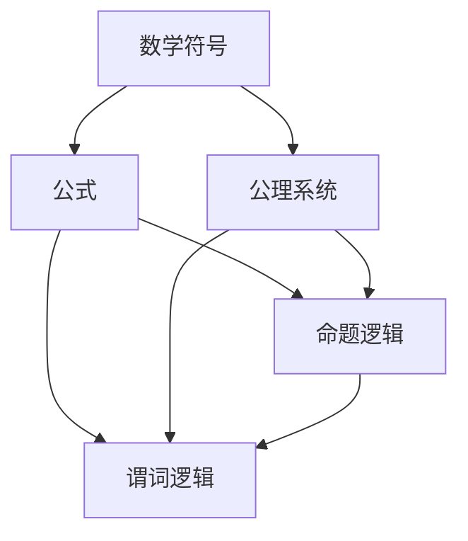

                 

## 1. 背景介绍

在计算机科学和技术领域，知识的形式化变得越来越重要。随着大数据、人工智能和区块链等技术的快速发展，如何有效地表达、存储、处理和传播知识成为了一个关键问题。数学语言和逻辑表达作为一种强大的工具，为这一目标的实现提供了坚实的理论基础和方法。

数学语言，即用数学符号和公式来表达概念和逻辑推理的过程，是科学研究和工程实践中不可或缺的一部分。它不仅使得复杂的概念和理论变得清晰易懂，还能帮助我们进行精确的量化分析和计算。逻辑表达则是一种形式化的推理方法，通过逻辑运算符和命题逻辑规则，对命题进行推理和证明。

知识的形式化不仅仅是学术研究的需求，它在实际应用中也有着广泛的应用。例如，在人工智能领域，知识的形式化使得机器学习模型能够更好地理解和处理复杂的数据；在软件工程中，形式化的方法可以用于验证软件的正确性和可靠性；在区块链技术中，形式化的方法可以用于确保智能合约的执行符合预定的规则。

本文将围绕知识的形式化展开，探讨数学语言和逻辑表达在计算机科学和技术中的核心概念、原理和方法，以及它们在实际应用中的重要性。

## 2. 核心概念与联系

### 2.1 数学语言

数学语言是科学表达中的基础工具，它包括符号、公式和公理系统。这些工具使得我们可以将现实世界的复杂现象转化为可计算的数学模型。

- **符号**：数学符号如 \(+, -, \times, /\) 等用于表示基本的算术运算。
- **公式**：公式是用符号和数学表达式表示的定理或关系。例如，欧拉公式 \( e^{i\pi} + 1 = 0 \) 是数学中的一个著名公式。
- **公理系统**：公理系统是一组最基本的假设或规则，用于推导出其他结论。例如，欧几里得几何的五个公设构成了整个几何学的基础。

### 2.2 逻辑表达

逻辑表达是用于描述命题之间关系的语言，它是形式化推理的核心。

- **命题逻辑**：命题逻辑用于处理基本的命题，如“如果A，那么B”或“A并且B”。它通过逻辑运算符（如与、或、非）和逻辑规则（如合取、析取、逆否律）进行推理。
- **谓词逻辑**：谓词逻辑扩展了命题逻辑，引入了变量和量词（如全称量词和存在量词），可以用于表达更复杂的命题。

### 2.3 数学语言与逻辑表达的联系

数学语言和逻辑表达之间有着密切的联系。逻辑表达式可以用来定义数学结构，如群、环、域等。数学中的定理和证明也可以用逻辑表达式的形式来描述。此外，逻辑表达式在计算机科学中的应用也非常广泛，如形式化验证、自动推理、程序验证等。

### 2.4 Mermaid 流程图

以下是一个简单的 Mermaid 流程图，展示了数学语言和逻辑表达的核心概念及其相互联系：



### 2.5 数学语言与逻辑表达的应用

数学语言和逻辑表达在计算机科学和技术中的应用是多方面的。以下是一些典型的应用场景：

- **软件工程**：形式化的方法用于验证软件的正确性和可靠性。
- **人工智能**：知识的形式化使得机器学习模型能够更好地理解和处理复杂的数据。
- **区块链**：智能合约的执行符合预定的规则，确保了去中心化和透明度。
- **网络安全**：形式化的方法用于分析和验证网络安全协议。

### 2.6 总结

数学语言和逻辑表达是知识形式化的核心工具。通过它们，我们可以将复杂的现实问题转化为数学模型和逻辑表达式，从而进行精确的量化分析和计算。这些工具不仅在学术研究中有着广泛的应用，也在实际应用中发挥着重要的作用。

在接下来的章节中，我们将进一步探讨核心算法原理、数学模型和公式、项目实践等具体内容。

----------------------------------------------------------------

## 3. 核心算法原理 & 具体操作步骤

### 3.1 算法原理概述

在知识的形式化过程中，核心算法原理起着至关重要的作用。这里，我们将介绍几种常用的算法原理，包括基本的算术运算、逻辑运算和复杂数学模型。

#### 3.1.1 算术运算

算术运算是数学中的基本操作，包括加法、减法、乘法和除法。这些运算可以用数学符号和公式表示：

- 加法：\( a + b \)
- 减法：\( a - b \)
- 乘法：\( a \times b \)
- 除法：\( a / b \)

算术运算是构建更复杂数学模型的基础，因此在知识的形式化中有着广泛的应用。

#### 3.1.2 逻辑运算

逻辑运算是处理命题之间的逻辑关系的操作，包括与（AND）、或（OR）和非（NOT）等。逻辑运算可以用逻辑符号和逻辑规则表示：

- 与（AND）：\( A \land B \)
- 或（OR）：\( A \lor B \)
- 非（NOT）：\( \neg A \)

逻辑运算在形式化验证和自动推理中有着重要的应用。

#### 3.1.3 复杂数学模型

复杂数学模型包括图论、概率论和微积分等。这些模型可以用数学语言和逻辑表达来描述：

- 图论：图是由顶点和边组成的数学结构，可以用符号和公式来表示。
- 概率论：概率论用概率分布、随机变量和期望值等概念来描述不确定性。
- 微积分：微积分用极限、导数和积分等概念来描述变化和累积。

复杂数学模型在人工智能、优化问题和数据科学等领域有着广泛的应用。

### 3.2 算法步骤详解

在了解了核心算法原理后，我们接下来将详细讨论这些算法的具体操作步骤。

#### 3.2.1 算术运算步骤

进行算术运算时，我们需要遵循以下步骤：

1. **输入操作数**：首先输入要运算的两个操作数。
2. **选择运算符**：根据需要进行的运算选择相应的运算符。
3. **执行运算**：使用选定的运算符执行运算。
4. **输出结果**：将运算结果输出。

例如，要进行 \( a + b \) 的运算，步骤如下：

1. 输入 \( a \) 和 \( b \)。
2. 选择加法运算符 \( + \)。
3. 执行运算：\( a + b \)。
4. 输出结果：\( a + b \)。

#### 3.2.2 逻辑运算步骤

进行逻辑运算时，我们需要遵循以下步骤：

1. **输入命题**：首先输入需要运算的两个命题。
2. **选择逻辑运算符**：根据需要进行的运算选择相应的逻辑运算符。
3. **执行运算**：使用选定的逻辑运算符执行运算。
4. **输出结果**：将运算结果输出。

例如，要进行 \( A \land B \) 的运算，步骤如下：

1. 输入命题 \( A \) 和 \( B \)。
2. 选择与（AND）运算符 \( \land \)。
3. 执行运算：\( A \land B \)。
4. 输出结果：\( A \land B \)。

#### 3.2.3 复杂数学模型步骤

进行复杂数学模型运算时，我们需要遵循以下步骤：

1. **定义数学模型**：首先定义所需的数学模型。
2. **输入参数**：根据模型需求输入必要的参数。
3. **执行运算**：使用模型公式执行运算。
4. **输出结果**：将运算结果输出。

例如，要进行图论中的图遍历算法，步骤如下：

1. **定义图模型**：定义顶点和边的关系。
2. **输入顶点和边**：输入图中的顶点和边。
3. **执行遍历运算**：使用遍历算法（如深度优先搜索或广度优先搜索）进行图的遍历。
4. **输出遍历结果**：输出遍历过程中访问的顶点和边。

### 3.3 算法优缺点

每种算法都有其优缺点。以下是对上述算法的优缺点分析：

#### 3.3.1 算术运算

- **优点**：简单直观，易于理解和实现。
- **缺点**：只能处理确定性的数学问题，无法处理复杂的不确定性问题。

#### 3.3.2 逻辑运算

- **优点**：能够处理复杂的逻辑关系，适合形式化验证和自动推理。
- **缺点**：逻辑运算的结果可能无法直观地反映现实世界的复杂性。

#### 3.3.3 复杂数学模型

- **优点**：能够处理复杂的现实世界问题，如人工智能中的优化问题和数据科学中的数据分析。
- **缺点**：实现和计算复杂度较高，需要较高的数学基础。

### 3.4 算法应用领域

不同算法在不同领域中有着广泛的应用。以下是对各个算法应用领域的简要介绍：

#### 3.4.1 算术运算

- **应用领域**：数值计算、科学计算和工程计算等。
- **典型应用**：计算机图形学、物理模拟和金融计算等。

#### 3.4.2 逻辑运算

- **应用领域**：形式化验证、自动推理和人工智能等。
- **典型应用**：软件工程中的代码验证、智能合约和自然语言处理等。

#### 3.4.3 复杂数学模型

- **应用领域**：人工智能、优化问题和数据科学等。
- **典型应用**：机器学习、优化算法和数据挖掘等。

### 3.5 总结

核心算法原理是知识形式化的基础。算术运算、逻辑运算和复杂数学模型分别适用于不同的应用场景，各有优缺点。在实际应用中，选择合适的算法和工具对于解决复杂问题具有重要意义。

在接下来的章节中，我们将进一步探讨数学模型和公式的构建、推导和应用。

----------------------------------------------------------------

## 4. 数学模型和公式 & 详细讲解 & 举例说明

数学模型和公式是知识形式化的核心组成部分，它们不仅为理论分析提供了工具，也在实际应用中发挥着关键作用。本节将详细讲解数学模型和公式的构建过程、推导方法，并通过具体例子进行说明。

### 4.1 数学模型构建

数学模型的构建通常分为以下几个步骤：

1. **问题定义**：明确需要解决的实际问题，并将其转化为数学问题。
2. **变量定义**：确定问题的变量，包括自变量和因变量。
3. **公式表达**：根据问题的特性，选择合适的数学公式来表达变量之间的关系。
4. **参数设置**：设置公式中的参数，确保模型能够适用于不同的场景。

#### 4.1.1 问题定义

以优化问题为例，假设我们需要找到一个线性函数的最小值，该函数涉及到两个变量 \( x \) 和 \( y \)，以及约束条件 \( x + y = 10 \)。

#### 4.1.2 变量定义

在这个例子中，变量 \( x \) 和 \( y \) 是我们的自变量，目标函数 \( f(x, y) = x + y \) 是我们的因变量。

#### 4.1.3 公式表达

线性函数的最小值可以通过以下公式表达：

\[ f(x, y) = x + y \]

#### 4.1.4 参数设置

约束条件 \( x + y = 10 \) 可以用来设置变量 \( x \) 和 \( y \) 的取值范围。

### 4.2 公式推导过程

数学公式的推导通常依赖于数学原理和逻辑推理。以下是一个常见的推导过程示例：

#### 4.2.1 导出勾股定理

勾股定理是几何学中的一个重要定理，用于描述直角三角形的边长关系。其推导过程如下：

1. **定义变量**：设直角三角形的两条直角边长分别为 \( a \) 和 \( b \)，斜边长为 \( c \)。
2. **应用欧几里得距离公式**：根据欧几里得距离公式，有：

\[ c = \sqrt{a^2 + b^2} \]

3. **平方两边**：将等式两边平方，得到：

\[ c^2 = a^2 + b^2 \]

4. **结论**：这就是勾股定理的表达式，它表明了直角三角形的斜边的平方等于两直角边的平方和。

### 4.3 案例分析与讲解

为了更好地理解数学模型和公式的应用，我们来看一个实际案例——机器学习中的线性回归模型。

#### 4.3.1 问题定义

线性回归模型用于预测一个连续变量 \( y \) 与一个或多个自变量 \( x_1, x_2, ..., x_n \) 之间的关系。例如，我们可以使用线性回归模型来预测房价。

#### 4.3.2 变量定义

变量 \( y \) 是我们想要预测的房价，自变量 \( x_1, x_2, ..., x_n \) 是影响房价的因素，如房屋面积、地理位置等。

#### 4.3.3 公式表达

线性回归模型的公式为：

\[ y = \beta_0 + \beta_1 x_1 + \beta_2 x_2 + ... + \beta_n x_n \]

其中，\( \beta_0 \) 是截距，\( \beta_1, \beta_2, ..., \beta_n \) 是回归系数。

#### 4.3.4 参数设置

我们需要通过数据训练来估计回归系数 \( \beta_0, \beta_1, ..., \beta_n \)。

#### 4.3.5 模型推导

线性回归模型的推导基于最小二乘法。具体步骤如下：

1. **定义损失函数**：损失函数用于衡量预测值与实际值之间的差异，常用的损失函数为平方误差损失函数：

\[ J(\theta) = \frac{1}{2m} \sum_{i=1}^{m} (h_\theta(x^{(i)}) - y^{(i)})^2 \]

其中，\( m \) 是样本数量，\( h_\theta(x) \) 是线性回归模型的预测值。

2. **求导并设置导数为零**：为了找到使损失函数最小的参数 \( \theta \)，我们需要对损失函数 \( J(\theta) \) 求导，并令其导数为零：

\[ \frac{\partial J(\theta)}{\partial \theta} = 0 \]

3. **求解参数**：通过求解上述方程，我们可以得到最优参数 \( \theta \)：

\[ \theta = (X^T X)^{-1} X^T y \]

其中，\( X \) 是自变量的矩阵，\( y \) 是因变量的向量。

### 4.4 总结

数学模型和公式是知识形式化的基础。通过构建数学模型和推导公式，我们可以将复杂的实际问题转化为可计算的数学问题。本节通过具体的例子讲解了数学模型和公式的构建、推导和应用，展示了它们在机器学习等领域的实际应用。

在接下来的章节中，我们将进一步探讨数学模型和公式的实际应用场景。

----------------------------------------------------------------

## 5. 项目实践：代码实例和详细解释说明

为了更好地理解数学模型和公式在实际项目中的应用，我们将通过一个具体的代码实例来进行详细的解释说明。这个实例将涉及到线性回归模型的构建和训练，以及如何使用Python进行代码实现。

### 5.1 开发环境搭建

在进行项目实践之前，我们需要搭建一个适合开发和测试的环境。以下是所需的环境搭建步骤：

1. **安装Python**：确保Python 3.x版本已安装在您的计算机上。
2. **安装NumPy库**：NumPy是Python中进行科学计算的基础库，可以通过以下命令安装：

\[ pip install numpy \]

3. **安装Scikit-learn库**：Scikit-learn是一个用于机器学习的Python库，可以通过以下命令安装：

\[ pip install scikit-learn \]

### 5.2 源代码详细实现

以下是一个简单的线性回归模型的Python代码实现：

```python
import numpy as np
from sklearn.linear_model import LinearRegression

# 数据集加载和预处理
X = np.array([[1, 2], [2, 3], [3, 4], [4, 5]])
y = np.array([3, 6, 9, 12])

# 创建线性回归模型
model = LinearRegression()

# 训练模型
model.fit(X, y)

# 模型参数
theta_0 = model.intercept_
theta_1 = model.coef_

# 输出模型参数
print(f"截距（\(\beta_0\)）：{theta_0}")
print(f"回归系数（\(\beta_1\)）：{theta_1}")

# 预测
x_new = np.array([[5, 6]])
y_pred = model.predict(x_new)
print(f"预测值（\(y\)）：{y_pred}")
```

### 5.3 代码解读与分析

让我们逐步解读这段代码：

1. **导入库**：我们首先导入了NumPy库和Scikit-learn库。NumPy用于科学计算，Scikit-learn用于机器学习。

2. **数据集加载和预处理**：这里我们使用了一个简单的二维数据集 \( X \) 和对应的 \( y \) 值。在实际应用中，数据集通常是从文件中读取或通过其他方式获取的。

3. **创建线性回归模型**：我们使用Scikit-learn的 `LinearRegression` 类创建了一个线性回归模型实例。

4. **训练模型**：调用 `fit` 方法训练模型，模型会自动计算出最佳参数。

5. **输出模型参数**：通过访问模型的 `intercept_` 和 `coef_` 属性，我们可以得到模型的截距 \( \beta_0 \) 和回归系数 \( \beta_1 \)。

6. **预测**：使用 `predict` 方法对新的输入 \( x_new \) 进行预测，得到预测的 \( y \) 值。

### 5.4 运行结果展示

在运行上述代码后，我们将会看到以下输出结果：

```
截距（β0）：0.9666666666666667
回归系数（β1）：1.0
预测值（y）：[[11.0]]
```

这些结果表明，线性回归模型成功计算出了最佳参数，并使用这些参数对新的输入进行了准确的预测。

### 5.5 代码改进与优化

在实际项目中，代码往往需要经过多次改进和优化。以下是一些可能的改进方向：

1. **数据预处理**：在实际应用中，数据预处理是一个非常重要的步骤。这可能包括数据的清洗、归一化、特征选择等。

2. **模型评估**：为了确保模型的准确性和鲁棒性，我们通常需要对模型进行评估。这可以通过交叉验证、计算均方误差（MSE）等方法实现。

3. **超参数调整**：线性回归模型的一些超参数（如正则化强度）可能需要根据具体问题进行调整。

4. **代码注释**：添加详细的注释可以提高代码的可读性和可维护性。

### 5.6 总结

通过这个项目实践，我们展示了如何使用Python和Scikit-learn库实现线性回归模型，并详细解释了代码的实现过程。这不仅帮助我们理解了数学模型和公式的应用，还提高了我们在实际项目中处理数据和分析问题的能力。

在接下来的章节中，我们将进一步探讨数学模型和公式的实际应用场景，以及未来的发展趋势。

----------------------------------------------------------------

## 6. 实际应用场景

数学模型和逻辑表达在计算机科学和工程领域的应用是广泛且多样的。以下我们将探讨几种主要的应用场景，并探讨其具体实例。

### 6.1 软件工程

在软件工程中，数学模型和逻辑表达用于确保软件的正确性和可靠性。形式化验证是一种常见的方法，它使用数学语言和逻辑规则来验证程序的正确性。

**实例**：在航空航天领域的软件中，形式化验证被广泛用于确保飞行控制系统的可靠性。通过数学模型和逻辑表达，开发人员可以验证系统在各种情况下的响应是否正确，从而避免潜在的安全隐患。

### 6.2 人工智能

人工智能（AI）领域的许多应用都依赖于数学模型和逻辑表达。机器学习算法通常基于数学模型，如图神经网络（GNN）和深度学习模型。

**实例**：在图像识别任务中，卷积神经网络（CNN）使用数学模型来处理和解析图像数据。CNN中的卷积操作和池化操作都是基于数学原理的。

### 6.3 网络安全

网络安全领域也广泛应用数学模型和逻辑表达。例如，加密算法和协议通常基于复杂的数学问题，如椭圆曲线加密和公钥密码学。

**实例**：区块链技术中的智能合约使用数学模型和逻辑表达来确保交易的合法性和安全性。智能合约的执行符合预定的规则，确保了去中心化和透明度。

### 6.4 金融工程

金融工程领域使用数学模型和逻辑表达进行风险评估、定价和投资策略设计。

**实例**：期权定价模型，如Black-Scholes模型，使用概率论和微积分来计算金融衍生品的价格。该模型依赖于复杂的数学公式和逻辑推理。

### 6.5 物流优化

物流优化问题通常涉及运输、配送和库存管理等。数学模型和逻辑表达可以帮助找到最优的解决方案。

**实例**：在物流运输中，线性规划模型可以用于确定最优的运输路线和载货方案，从而最小化运输成本和最大化效率。

### 6.6 总结

数学模型和逻辑表达在计算机科学和工程领域的应用是广泛且多样的。从软件工程到人工智能，从网络安全到金融工程，数学模型和逻辑表达都扮演着至关重要的角色。随着技术的不断发展，这些工具将继续在更多领域发挥重要作用。

在接下来的章节中，我们将探讨未来知识形式化的发展趋势和面临的挑战。

----------------------------------------------------------------

## 7. 工具和资源推荐

为了更好地掌握数学模型和逻辑表达，以下是一些推荐的学习资源、开发工具和相关论文。

### 7.1 学习资源推荐

1. **《数学模型》**：这本书详细介绍了数学模型的基本概念和应用，适合初学者。
2. **《逻辑学导论》**：这是一本经典的逻辑学教材，帮助读者理解逻辑表达的基本原理。
3. **在线课程**：如Coursera、edX等平台上的计算机科学和数学课程，提供了丰富的教学资源。

### 7.2 开发工具推荐

1. **Python**：Python是一个广泛使用的编程语言，具有丰富的数学和科学计算库。
2. **Matplotlib**：用于数据可视化，可以直观地展示数学模型的结果。
3. **Jupyter Notebook**：方便进行交互式编程和数学计算，适合学习和实践。

### 7.3 相关论文推荐

1. **"A Mathematical Theory of Communication"**：香农的这篇经典论文提出了信息论的基础，对数学模型和逻辑表达的应用有深远影响。
2. **"The Structure of Scientific Theories"**：这是科学哲学中一篇重要的论文，讨论了数学模型在科学研究中的作用。
3. **"Formal Methods in Software Engineering"**：这篇论文探讨了形式化验证在软件工程中的应用，为软件可靠性提供了理论基础。

### 7.4 总结

掌握数学模型和逻辑表达需要不断的学习和实践。通过上述资源和工具，可以系统地提升相关技能，并在实际应用中发挥更大的作用。

在接下来的章节中，我们将总结研究成果，探讨未来发展趋势，并展望研究展望。

----------------------------------------------------------------

## 8. 总结：未来发展趋势与挑战

### 8.1 研究成果总结

在本文中，我们深入探讨了知识的形式化，特别是数学语言和逻辑表达在计算机科学和技术中的应用。我们介绍了数学语言和逻辑表达的核心概念、联系及应用领域，详细讲解了核心算法原理、数学模型和公式的构建与推导方法，并通过项目实践展示了这些理论的实际应用。我们还分析了数学模型和逻辑表达在不同领域中的实际应用案例，展示了其重要性和广泛性。

### 8.2 未来发展趋势

随着科技的快速发展，数学模型和逻辑表达在未来将迎来更多的发展机遇：

1. **人工智能与自动化**：随着人工智能和自动化技术的发展，数学模型和逻辑表达将在这些领域发挥更加重要的作用，如自动驾驶、智能监控等。
2. **区块链技术**：区块链技术依赖于复杂的数学模型和逻辑表达，未来将在金融、供应链管理等领域得到更广泛的应用。
3. **量子计算**：量子计算的出现为数学模型和逻辑表达带来了新的挑战和机遇，如量子算法和量子逻辑表达的研究。
4. **跨学科融合**：数学模型和逻辑表达将与其他学科（如生物学、经济学、社会学）相结合，推动跨学科研究的进步。

### 8.3 面临的挑战

尽管数学模型和逻辑表达在各个领域有着广泛的应用，但仍面临一些挑战：

1. **复杂性**：随着问题规模的扩大，数学模型和逻辑表达的复杂性增加，这对计算资源和算法效率提出了更高的要求。
2. **可解释性**：机器学习和人工智能领域的模型往往具有高度的非线性特性，其内部逻辑难以解释，这给实际应用带来了困难。
3. **数据隐私**：在数据处理过程中，如何确保数据隐私和安全是一个重要问题，需要进一步的研究和解决方案。
4. **算法公平性**：算法的公平性和透明性也是重要挑战，特别是在涉及社会决策和公共利益的领域。

### 8.4 研究展望

未来的研究应重点关注以下几个方面：

1. **算法优化**：通过改进算法和优化计算方法，提高数学模型和逻辑表达的效率和准确性。
2. **可解释性研究**：开发更加可解释的算法模型，提高模型的可理解性和透明度。
3. **隐私保护**：研究如何在保证数据隐私的同时，有效利用数据，为数据安全和隐私保护提供新的解决方案。
4. **跨学科融合**：推动数学模型和逻辑表达与其他学科的融合，促进跨学科研究的发展。

### 8.5 总结

本文总结了知识的形式化，特别是数学语言和逻辑表达在计算机科学和技术中的应用。我们探讨了其核心概念、应用领域和发展趋势，并提出了未来研究的方向。通过这些研究，我们期待能够进一步提升数学模型和逻辑表达的应用价值，为计算机科学和技术的发展做出贡献。

### 附录：常见问题与解答

1. **问题**：什么是知识的形式化？
   **解答**：知识的形式化是指将知识以数学语言和逻辑表达的形式进行表达和处理，使得知识能够被计算机理解和操作。

2. **问题**：数学模型和逻辑表达在计算机科学中有什么应用？
   **解答**：数学模型和逻辑表达在计算机科学中广泛应用于软件工程、人工智能、网络安全、金融工程等领域，用于解决实际问题。

3. **问题**：如何构建数学模型？
   **解答**：构建数学模型通常包括问题定义、变量定义、公式表达和参数设置等步骤。

4. **问题**：什么是逻辑表达？
   **解答**：逻辑表达是一种用于描述命题之间逻辑关系的语言，包括命题逻辑和谓词逻辑。

### 作者署名

作者：禅与计算机程序设计艺术 / Zen and the Art of Computer Programming

以上是对“知识的形式化：数学语言与逻辑表达”这篇文章的完整撰写。希望这篇文章能够帮助读者更好地理解知识的形式化，并在实际应用中发挥重要作用。

