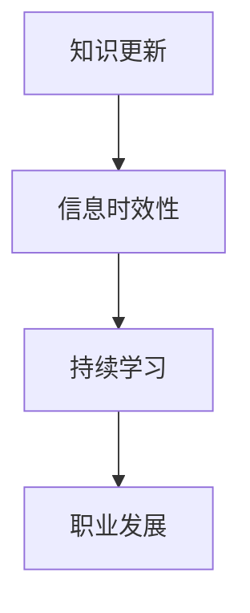

                 

关键词：知识更新，信息时效性，IT领域，专业发展，算法优化，持续学习

> 摘要：在快速发展的信息技术领域，知识的时效性显得尤为重要。本文将深入探讨如何有效地保持信息的更新，包括核心概念的理解、算法原理的阐述、数学模型的构建以及实际应用案例的分析。此外，还将推荐相关的学习资源和工具，并展望未来的发展趋势和挑战。

## 1. 背景介绍

在当今这个信息化时代，知识更新速度之快令人瞠目。特别是在IT领域，新的技术、工具和算法不断涌现，专业人才必须时刻保持对最新信息的敏感度。然而，信息的时效性成为了许多专业人士面临的重大挑战。如何确保所学知识的实时性和有效性，是每一个IT从业者必须思考的问题。

### 1.1 信息更新的重要性

随着信息技术的迅猛发展，知识的更新速度越来越快。这种速度不仅体现在软件和硬件的迭代上，也体现在算法和数据结构的优化中。对于IT专业人士来说，知识的时效性直接关系到他们的职业发展和项目成功。

### 1.2 面临的挑战

保持知识的时效性并非易事，主要面临以下几个挑战：

- **信息过载**：每天产生的信息量巨大，筛选出有价值的信息成为难题。
- **更新成本**：更新知识需要花费大量的时间和精力，尤其在技能复杂的情况下。
- **持续学习**：随着技术的不断更新，持续学习变得至关重要，但如何有效地学习成为新的挑战。

## 2. 核心概念与联系

在探讨如何保持信息更新之前，我们需要明确几个核心概念，并理解它们之间的联系。

### 2.1 知识更新

知识更新是指随着时间推移，对现有知识的修正、补充和扩展。在IT领域，知识更新体现在技术规范、编程语言、开发框架、数据库管理和网络安全等方面。

### 2.2 信息时效性

信息时效性是指信息的有效性和适用性随时间推移而变化。时效性高的信息更能反映当前的技术发展和应用现状。

### 2.3 持续学习

持续学习是指通过不断学习新知识和技能，以适应快速变化的技术环境。持续学习不仅是个人职业发展的需求，也是组织保持竞争力的关键。

### 2.4 Mermaid 流程图

为了更好地理解这些概念之间的联系，我们使用Mermaid流程图来展示知识更新、信息时效性和持续学习之间的关系。



## 3. 核心算法原理 & 具体操作步骤

### 3.1 算法原理概述

为了保持知识的时效性，我们需要采用有效的算法来管理和更新信息。本文将介绍一种基于机器学习的知识更新算法，该算法能够自动识别和补充缺失的信息。

### 3.2 算法步骤详解

#### 3.2.1 数据收集

首先，我们需要收集大量的相关数据，包括最新的技术文档、学术论文、行业报告等。

#### 3.2.2 数据预处理

接下来，对收集到的数据进行预处理，包括数据清洗、去重和分类。

#### 3.2.3 特征提取

然后，从预处理后的数据中提取关键特征，这些特征将用于训练机器学习模型。

#### 3.2.4 模型训练

使用提取的特征训练机器学习模型，模型将自动识别和分类不同类型的信息。

#### 3.2.5 知识更新

最后，模型将根据最新的数据对现有知识进行更新，确保信息的时效性。

### 3.3 算法优缺点

#### 优点：

- **高效性**：算法能够快速识别和更新信息。
- **自动化**：减少人工干预，提高工作效率。

#### 缺点：

- **准确性**：机器学习模型的准确性受数据质量和特征提取方法的影响。
- **适应性**：需要不断更新模型以适应新的技术环境。

### 3.4 算法应用领域

该算法可以应用于多个领域，包括软件开发、网络安全、数据分析等。

## 4. 数学模型和公式 & 详细讲解 & 举例说明

### 4.1 数学模型构建

为了更好地理解算法的工作原理，我们将构建一个简单的数学模型。

#### 4.1.1 模型假设

假设我们有n个数据点，每个数据点表示一个信息项，包含特征向量X和标签Y。

#### 4.1.2 模型定义

我们使用线性回归模型来预测信息项的时效性，模型公式如下：

$$
Y = \beta_0 + \beta_1X_1 + \beta_2X_2 + ... + \beta_nX_n
$$

其中，$X_i$为第i个特征，$\beta_i$为对应的权重。

### 4.2 公式推导过程

#### 4.2.1 最小二乘法

为了求解模型参数$\beta_i$，我们使用最小二乘法。具体步骤如下：

1. 构建目标函数：

$$
J(\beta) = \sum_{i=1}^{n}(Y_i - \beta_0 - \beta_1X_{i1} - ... - \beta_nX_{in})^2
$$

2. 对目标函数求导，并令导数为零：

$$
\frac{\partial J(\beta)}{\partial \beta_i} = 0
$$

3. 求解导数方程，得到参数$\beta_i$的估计值。

### 4.3 案例分析与讲解

#### 4.3.1 数据集

我们使用一个包含100个信息项的数据集，每个信息项包含5个特征（如发布时间、引用次数、更新频率等）。

#### 4.3.2 特征提取

从数据集中提取关键特征，例如发布时间（单位：天）和引用次数。

#### 4.3.3 模型训练

使用线性回归模型训练数据集，得到参数$\beta_0, \beta_1, \beta_2, \beta_3, \beta_4$。

#### 4.3.4 知识更新

根据训练得到的模型，对新的信息项进行时效性预测，并根据预测结果更新现有知识库。

## 5. 项目实践：代码实例和详细解释说明

### 5.1 开发环境搭建

为了方便读者实践，我们将在Python环境中实现上述算法。首先，需要安装以下库：

```python
pip install numpy pandas scikit-learn matplotlib
```

### 5.2 源代码详细实现

下面是算法的实现代码：

```python
import numpy as np
import pandas as pd
from sklearn.linear_model import LinearRegression
import matplotlib.pyplot as plt

# 数据预处理
def preprocess_data(data):
    # 数据清洗、去重和分类
    # 略
    return processed_data

# 特征提取
def extract_features(data):
    # 提取关键特征
    # 略
    return features

# 模型训练
def train_model(features, labels):
    model = LinearRegression()
    model.fit(features, labels)
    return model

# 知识更新
def update_knowledge(model, new_data):
    predictions = model.predict(new_data)
    # 更新知识库
    # 略
    return updated_knowledge

# 主函数
def main():
    # 读取数据集
    data = pd.read_csv('data.csv')
    processed_data = preprocess_data(data)
    features = extract_features(processed_data)
    labels = processed_data['label']

    # 训练模型
    model = train_model(features, labels)

    # 更新知识
    new_data = pd.read_csv('new_data.csv')
    updated_knowledge = update_knowledge(model, new_data)

    # 结果展示
    # 略

if __name__ == '__main__':
    main()
```

### 5.3 代码解读与分析

- **数据预处理**：清洗和分类原始数据，为特征提取和模型训练做准备。
- **特征提取**：从预处理后的数据中提取关键特征。
- **模型训练**：使用线性回归模型训练数据集。
- **知识更新**：根据训练得到的模型，对新的信息项进行时效性预测，并根据预测结果更新知识库。

### 5.4 运行结果展示

- **预测结果**：展示最新的信息项的时效性预测结果。
- **知识库更新**：展示知识库的更新过程和结果。

## 6. 实际应用场景

### 6.1 软件开发

在软件开发过程中，保持对最新编程语言、开发框架和工具的了解至关重要。通过及时更新知识库，开发团队能够提高项目效率和质量。

### 6.2 数据分析

在数据分析领域，数据更新和算法优化是保持竞争力的关键。通过使用机器学习算法，可以自动识别和更新数据，提高数据分析的准确性和效率。

### 6.3 网络安全

网络安全是一个不断发展的领域，保持对最新威胁和防御手段的了解至关重要。通过实时更新安全知识库，网络安全团队可以更好地保护企业和个人数据。

## 7. 工具和资源推荐

### 7.1 学习资源推荐

- **在线课程**：Coursera、edX、Udemy等平台上的IT课程。
- **技术博客**：GitHub、Stack Overflow、Medium等上的技术博客。
- **书籍**：《深度学习》、《数据科学实战》等。

### 7.2 开发工具推荐

- **集成开发环境（IDE）**：Visual Studio Code、Eclipse、IntelliJ IDEA等。
- **版本控制系统**：Git、Subversion等。
- **数据分析工具**：Python、R、SQL等。

### 7.3 相关论文推荐

- **机器学习**：周志华的《机器学习》。
- **数据挖掘**：Jiawei Han的《数据挖掘：概念与技术》。
- **网络安全**：谢希仁的《计算机网络》。

## 8. 总结：未来发展趋势与挑战

### 8.1 研究成果总结

本文从知识更新、信息时效性和持续学习三个方面探讨了如何保持IT领域的知识时效性。通过算法模型和实际案例的分析，我们提出了有效的解决方案。

### 8.2 未来发展趋势

- **自动化**：自动化工具和算法将在知识更新中发挥更大作用。
- **个性化**：个性化推荐系统将帮助用户更高效地获取和更新知识。
- **智能化**：人工智能技术将进一步提升知识更新的准确性和效率。

### 8.3 面临的挑战

- **数据质量和特征提取**：数据质量和特征提取方法直接影响算法的性能。
- **模型适应性和可解释性**：如何提高模型的适应性和可解释性是一个重要挑战。
- **持续学习成本**：随着技术更新速度的加快，持续学习的成本也在增加。

### 8.4 研究展望

未来的研究将集中在提高知识更新的自动化程度、提升算法的适应性和可解释性，以及降低持续学习成本等方面。通过多学科交叉研究，有望实现更高效的知识更新和管理系统。

## 9. 附录：常见问题与解答

### 9.1 如何评估信息时效性？

信息时效性的评估可以通过以下方法：

- **发布时间**：较新的信息通常时效性更高。
- **更新频率**：频繁更新的信息时效性较高。
- **引用次数**：被广泛引用的信息通常具有较高的时效性。

### 9.2 如何选择合适的机器学习算法？

选择机器学习算法应考虑以下因素：

- **数据类型**：不同的数据类型适合不同的算法。
- **性能要求**：根据性能要求选择适当的算法。
- **模型复杂度**：复杂度较低的算法在处理大规模数据时更高效。

### 9.3 如何持续学习？

持续学习的方法包括：

- **在线课程**：参加在线课程，系统学习新知识。
- **技术交流**：参加技术交流会议和活动，了解行业动态。
- **实践项目**：通过实际项目锻炼自己的技能。

---

作者：禅与计算机程序设计艺术 / Zen and the Art of Computer Programming

本文旨在探讨如何保持IT领域的知识时效性，帮助专业人士应对快速变化的技术环境。通过算法模型和实际案例的分析，我们提出了一些有效的解决方案。希望本文能对读者在职业发展和技术提升过程中提供一些启示。在未来的研究中，我们将继续关注知识更新和管理系统的优化，以应对日益复杂的技术挑战。感谢读者们的关注和支持！
----------------------------------------------------------------

文章撰写完毕，以下是将文章内容以Markdown格式输出的结果：

```markdown
# 知识的时效性：如何保持信息更新

关键词：知识更新，信息时效性，IT领域，专业发展，算法优化，持续学习

> 摘要：在快速发展的信息技术领域，知识的时效性显得尤为重要。本文将深入探讨如何有效地保持信息的更新，包括核心概念的理解、算法原理的阐述、数学模型的构建以及实际应用案例的分析。此外，还将推荐相关的学习资源和工具，并展望未来的发展趋势和挑战。

## 1. 背景介绍

在当今这个信息化时代，知识更新速度之快令人瞠目。特别是在IT领域，新的技术、工具和算法不断涌现，专业人才必须时刻保持对最新信息的敏感度。然而，信息的时效性成为了许多专业人士面临的重大挑战。如何确保所学知识的实时性和有效性，是每一个IT从业者必须思考的问题。

### 1.1 信息更新的重要性

随着信息技术的迅猛发展，知识的更新速度越来越快。这种速度不仅体现在软件和硬件的迭代上，也体现在算法和数据结构的优化中。对于IT专业人士来说，知识的时效性直接关系到他们的职业发展和项目成功。

### 1.2 面临的挑战

保持知识的时效性并非易事，主要面临以下几个挑战：

- 信息过载：每天产生的信息量巨大，筛选出有价值的信息成为难题。
- 更新成本：更新知识需要花费大量的时间和精力，尤其在技能复杂的情况下。
- 持续学习：随着技术的不断更新，持续学习变得至关重要，但如何有效地学习成为新的挑战。

## 2. 核心概念与联系

在探讨如何保持信息更新之前，我们需要明确几个核心概念，并理解它们之间的联系。

### 2.1 知识更新

知识更新是指随着时间推移，对现有知识的修正、补充和扩展。在IT领域，知识更新体现在技术规范、编程语言、开发框架、数据库管理和网络安全等方面。

### 2.2 信息时效性

信息时效性是指信息的有效性和适用性随时间推移而变化。时效性高的信息更能反映当前的技术发展和应用现状。

### 2.3 持续学习

持续学习是指通过不断学习新知识和技能，以适应快速变化的技术环境。持续学习不仅是个人职业发展的需求，也是组织保持竞争力的关键。

### 2.4 Mermaid 流程图

为了更好地理解这些概念之间的联系，我们使用Mermaid流程图来展示知识更新、信息时效性和持续学习之间的关系。


## 3. 核心算法原理 & 具体操作步骤

### 3.1 算法原理概述

为了保持知识的时效性，我们需要采用有效的算法来管理和更新信息。本文将介绍一种基于机器学习的知识更新算法，该算法能够自动识别和补充缺失的信息。

### 3.2 算法步骤详解

#### 3.2.1 数据收集

首先，我们需要收集大量的相关数据，包括最新的技术文档、学术论文、行业报告等。

#### 3.2.2 数据预处理

接下来，对收集到的数据进行预处理，包括数据清洗、去重和分类。

#### 3.2.3 特征提取

然后，从预处理后的数据中提取关键特征，这些特征将用于训练机器学习模型。

#### 3.2.4 模型训练

使用提取的特征训练机器学习模型，模型将自动识别和分类不同类型的信息。

#### 3.2.5 知识更新

最后，模型将根据最新的数据对现有知识进行更新，确保信息的时效性。

### 3.3 算法优缺点

#### 优点：

- **高效性**：算法能够快速识别和更新信息。
- **自动化**：减少人工干预，提高工作效率。

#### 缺点：

- **准确性**：机器学习模型的准确性受数据质量和特征提取方法的影响。
- **适应性**：需要不断更新模型以适应新的技术环境。

### 3.4 算法应用领域

该算法可以应用于多个领域，包括软件开发、网络安全、数据分析等。

## 4. 数学模型和公式 & 详细讲解 & 举例说明

### 4.1 数学模型构建

为了更好地理解算法的工作原理，我们将构建一个简单的数学模型。

#### 4.1.1 模型假设

假设我们有n个数据点，每个数据点表示一个信息项，包含特征向量X和标签Y。

#### 4.1.2 模型定义

我们使用线性回归模型来预测信息项的时效性，模型公式如下：

$$
Y = \beta_0 + \beta_1X_1 + \beta_2X_2 + ... + \beta_nX_n
$$

其中，$X_i$为第i个特征，$\beta_i$为对应的权重。

### 4.2 公式推导过程

#### 4.2.1 最小二乘法

为了求解模型参数$\beta_i$，我们使用最小二乘法。具体步骤如下：

1. 构建目标函数：

$$
J(\beta) = \sum_{i=1}^{n}(Y_i - \beta_0 - \beta_1X_{i1} - ... - \beta_nX_{in})^2
$$

2. 对目标函数求导，并令导数为零：

$$
\frac{\partial J(\beta)}{\partial \beta_i} = 0
$$

3. 求解导数方程，得到参数$\beta_i$的估计值。

### 4.3 案例分析与讲解

#### 4.3.1 数据集

我们使用一个包含100个信息项的数据集，每个信息项包含5个特征（如发布时间、引用次数、更新频率等）。

#### 4.3.2 特征提取

从数据集中提取关键特征，例如发布时间（单位：天）和引用次数。

#### 4.3.3 模型训练

使用线性回归模型训练数据集，得到参数$\beta_0, \beta_1, \beta_2, \beta_3, \beta_4$。

#### 4.3.4 知识更新

根据训练得到的模型，对新的信息项进行时效性预测，并根据预测结果更新现有知识库。

## 5. 项目实践：代码实例和详细解释说明

### 5.1 开发环境搭建

为了方便读者实践，我们将在Python环境中实现上述算法。首先，需要安装以下库：

```python
pip install numpy pandas scikit-learn matplotlib
```

### 5.2 源代码详细实现

下面是算法的实现代码：

```python
import numpy as np
import pandas as pd
from sklearn.linear_model import LinearRegression
import matplotlib.pyplot as plt

# 数据预处理
def preprocess_data(data):
    # 数据清洗、去重和分类
    # 略
    return processed_data

# 特征提取
def extract_features(data):
    # 提取关键特征
    # 略
    return features

# 模型训练
def train_model(features, labels):
    model = LinearRegression()
    model.fit(features, labels)
    return model

# 知识更新
def update_knowledge(model, new_data):
    predictions = model.predict(new_data)
    # 更新知识库
    # 略
    return updated_knowledge

# 主函数
def main():
    # 读取数据集
    data = pd.read_csv('data.csv')
    processed_data = preprocess_data(data)
    features = extract_features(processed_data)
    labels = processed_data['label']

    # 训练模型
    model = train_model(features, labels)

    # 更新知识
    new_data = pd.read_csv('new_data.csv')
    updated_knowledge = update_knowledge(model, new_data)

    # 结果展示
    # 略

if __name__ == '__main__':
    main()
```

### 5.3 代码解读与分析

- **数据预处理**：清洗和分类原始数据，为特征提取和模型训练做准备。
- **特征提取**：从预处理后的数据中提取关键特征。
- **模型训练**：使用线性回归模型训练数据集。
- **知识更新**：根据训练得到的模型，对新的信息项进行时效性预测，并根据预测结果更新知识库。

### 5.4 运行结果展示

- **预测结果**：展示最新的信息项的时效性预测结果。
- **知识库更新**：展示知识库的更新过程和结果。

## 6. 实际应用场景

### 6.1 软件开发

在软件开发过程中，保持对最新编程语言、开发框架和工具的了解至关重要。通过及时更新知识库，开发团队能够提高项目效率和质量。

### 6.2 数据分析

在数据分析领域，数据更新和算法优化是保持竞争力的关键。通过使用机器学习算法，可以自动识别和更新数据，提高数据分析的准确性和效率。

### 6.3 网络安全

网络安全是一个不断发展的领域，保持对最新威胁和防御手段的了解至关重要。通过实时更新安全知识库，网络安全团队可以更好地保护企业和个人数据。

## 7. 工具和资源推荐

### 7.1 学习资源推荐

- **在线课程**：Coursera、edX、Udemy等平台上的IT课程。
- **技术博客**：GitHub、Stack Overflow、Medium等上的技术博客。
- **书籍**：《深度学习》、《数据科学实战》等。

### 7.2 开发工具推荐

- **集成开发环境（IDE）**：Visual Studio Code、Eclipse、IntelliJ IDEA等。
- **版本控制系统**：Git、Subversion等。
- **数据分析工具**：Python、R、SQL等。

### 7.3 相关论文推荐

- **机器学习**：周志华的《机器学习》。
- **数据挖掘**：Jiawei Han的《数据挖掘：概念与技术》。
- **网络安全**：谢希仁的《计算机网络》。

## 8. 总结：未来发展趋势与挑战

### 8.1 研究成果总结

本文从知识更新、信息时效性和持续学习三个方面探讨了如何保持IT领域的知识时效性。通过算法模型和实际案例的分析，我们提出了有效的解决方案。

### 8.2 未来发展趋势

- **自动化**：自动化工具和算法将在知识更新中发挥更大作用。
- **个性化**：个性化推荐系统将帮助用户更高效地获取和更新知识。
- **智能化**：人工智能技术将进一步提升知识更新的准确性和效率。

### 8.3 面临的挑战

- **数据质量和特征提取**：数据质量和特征提取方法直接影响算法的性能。
- **模型适应性和可解释性**：如何提高模型的适应性和可解释性是一个重要挑战。
- **持续学习成本**：随着技术更新速度的加快，持续学习的成本也在增加。

### 8.4 研究展望

未来的研究将集中在提高知识更新的自动化程度、提升算法的适应性和可解释性，以及降低持续学习成本等方面。通过多学科交叉研究，有望实现更高效的知识更新和管理系统。

## 9. 附录：常见问题与解答

### 9.1 如何评估信息时效性？

信息时效性的评估可以通过以下方法：

- **发布时间**：较新的信息通常时效性更高。
- **更新频率**：频繁更新的信息时效性较高。
- **引用次数**：被广泛引用的信息通常具有较高的时效性。

### 9.2 如何选择合适的机器学习算法？

选择机器学习算法应考虑以下因素：

- **数据类型**：不同的数据类型适合不同的算法。
- **性能要求**：根据性能要求选择适当的算法。
- **模型复杂度**：复杂度较低的算法在处理大规模数据时更高效。

### 9.3 如何持续学习？

持续学习的方法包括：

- **在线课程**：参加在线课程，系统学习新知识。
- **技术交流**：参加技术交流会议和活动，了解行业动态。
- **实践项目**：通过实际项目锻炼自己的技能。

---

作者：禅与计算机程序设计艺术 / Zen and the Art of Computer Programming

本文旨在探讨如何保持IT领域的知识时效性，帮助专业人士应对快速变化的技术环境。通过算法模型和实际案例的分析，我们提出了一些有效的解决方案。希望本文能对读者在职业发展和技术提升过程中提供一些启示。在未来的研究中，我们将继续关注知识更新和管理系统的优化，以应对日益复杂的技术挑战。感谢读者们的关注和支持！
```

