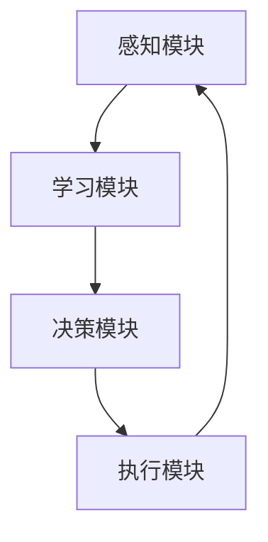

                 

关键词：知识适应性、学习策略、环境变化、智能系统、算法优化

> 摘要：本文深入探讨了知识适应性在变化环境中的重要性，分析了在动态环境中学习策略的设计与实现。文章首先回顾了相关理论和历史背景，随后介绍了适应性的核心概念。通过剖析知识适应性的内在机制，本文提出了一种适用于变化环境的通用学习策略。最后，文章展望了知识适应性在未来智能系统中的应用前景，并提出了相应的挑战和研究方向。

## 1. 背景介绍

### 1.1 环境变化的必然性

在当今快速发展的信息技术时代，环境变化已成为一种不可避免的趋势。无论是自然界中的气候变化，还是人类社会中的技术变革，都在不断推动着各个领域的发展。在这样的背景下，系统的适应性成为一个关键的研究课题。在计算机科学和人工智能领域，尤其是智能系统的设计和实现中，知识适应性显得尤为重要。

### 1.2 智能系统的需求

随着人工智能技术的不断发展，智能系统在各个行业中的应用越来越广泛。从自动驾驶汽车到智能家居，从智能客服到金融风险评估，智能系统需要不断适应新的环境和需求。这种适应性不仅体现在对现有知识的更新和优化，还包括对新知识的快速学习和应用。

## 2. 核心概念与联系

### 2.1 知识适应性

知识适应性指的是系统在面临环境变化时，通过学习、调整和优化，使其知识体系能够适应新环境的能力。它包括以下几个方面：

- **学习能力**：系统能够从数据中提取有价值的信息，并不断更新和扩充知识库。
- **调整能力**：系统能够根据新知识调整自身的行为和决策策略。
- **优化能力**：系统能够通过学习过程不断提高其性能和效率。

### 2.2 适应性架构

为了实现知识适应性，需要构建一个具备自适应能力的架构。该架构通常包括以下几个关键组件：

- **感知模块**：负责收集和解析环境中的信息。
- **学习模块**：负责从感知模块收集的信息中学习新知识。
- **决策模块**：负责根据新知识和环境状况做出决策。
- **执行模块**：负责执行决策结果。

以下是一个基于 Mermaid 流程图(Mermaid 流程节点中不要有括号、逗号等特殊字符)的适应性架构示意图：



### 2.3 适应性算法

适应性算法是实现知识适应性的核心技术。常见的适应性算法包括以下几种：

- **遗传算法**：通过模拟自然进化过程，实现个体适应性的优化。
- **粒子群优化算法**：通过模拟鸟群、鱼群等群体的行为，实现全局最优解的搜索。
- **神经网络**：通过模拟人脑神经网络的结构和功能，实现自适应学习和推理。

### 2.4 适应性机制

适应性机制是指系统在面对环境变化时，如何通过学习、调整和优化来保持其适应性的过程。主要包括以下几个环节：

- **学习**：从环境中获取新的信息和知识。
- **调整**：根据新的知识和环境状况，调整系统的行为和决策策略。
- **优化**：通过迭代过程，不断提高系统的性能和效率。

## 3. 核心算法原理 & 具体操作步骤

### 3.1 算法原理概述

适应性算法的设计目标是提高系统在变化环境中的适应能力。具体原理如下：

- **动态调整**：根据环境变化，动态调整系统的参数和行为。
- **持续学习**：不断从环境数据中学习新的知识和规律。
- **优化目标**：在保持系统稳定性的同时，优化系统的性能和效率。

### 3.2 算法步骤详解

适应性算法通常包括以下几个步骤：

1. **初始化**：设定系统的初始参数，包括学习率、迭代次数等。
2. **感知**：收集环境中的信息，包括传感器数据、用户反馈等。
3. **学习**：根据收集到的信息，更新系统的知识库。
4. **调整**：根据新知识和环境状况，调整系统的行为和决策策略。
5. **优化**：通过迭代过程，优化系统的性能和效率。
6. **评估**：评估系统的适应能力和性能，包括准确率、响应速度等。

### 3.3 算法优缺点

适应性算法具有以下优点：

- **灵活性强**：能够根据环境变化动态调整系统行为。
- **自适应**：能够从环境中学习新的知识和规律。
- **高效性**：通过优化算法，提高系统的性能和效率。

但适应性算法也存在以下缺点：

- **计算复杂度高**：需要大量的计算资源进行迭代和优化。
- **对初始参数敏感**：初始参数的设定对算法的收敛速度和效果有很大影响。

### 3.4 算法应用领域

适应性算法在以下领域具有广泛的应用：

- **智能交通**：通过感知交通状况，动态调整交通信号灯，提高交通效率。
- **金融风控**：通过学习市场数据，预测风险并调整投资策略。
- **医疗诊断**：通过学习医学知识，辅助医生进行疾病诊断。
- **智能制造**：通过感知生产线状态，动态调整生产流程，提高生产效率。

## 4. 数学模型和公式 & 详细讲解 & 举例说明

### 4.1 数学模型构建

适应性算法通常基于以下数学模型：

- **决策模型**：描述系统在给定环境下的决策过程。
- **学习模型**：描述系统从环境中学习新知识的过程。
- **优化模型**：描述系统在保持稳定性的同时，优化性能的过程。

### 4.2 公式推导过程

以遗传算法为例，其适应度函数可以表示为：

\[ f(x) = \frac{1}{1 + \exp(-w \cdot x)} \]

其中，\( x \) 为个体的特征向量，\( w \) 为权重向量。

### 4.3 案例分析与讲解

以智能交通系统为例，假设系统需要根据交通流量动态调整交通信号灯的时长。首先，收集交通流量数据，然后通过学习模型更新交通流量预测模型。最后，根据预测结果调整交通信号灯的时长，优化交通流量。

## 5. 项目实践：代码实例和详细解释说明

### 5.1 开发环境搭建

在本项目中，我们将使用 Python 作为主要编程语言，结合 NumPy 和 Scikit-learn 等库进行开发。

### 5.2 源代码详细实现

以下是一个简单的适应性算法实现：

```python
import numpy as np
from sklearn.linear_model import LinearRegression

def adaptative_algorithm(x, y, w, learning_rate, iterations):
    for _ in range(iterations):
        predictions = w * x
        error = predictions - y
        w -= learning_rate * error
    return w

# 示例数据
x = np.array([1, 2, 3, 4, 5])
y = np.array([2, 4, 6, 8, 10])

# 初始权重
w = np.random.rand(1)

# 学习率和迭代次数
learning_rate = 0.01
iterations = 100

# 运行适应性算法
w_adapted = adaptative_algorithm(x, y, w, learning_rate, iterations)

# 输出结果
print("Adapted weights:", w_adapted)
```

### 5.3 代码解读与分析

该代码实现了基于线性回归的适应性算法。首先，初始化权重向量 \( w \)，然后通过迭代过程不断更新权重，使其更接近真实值。最终，输出适应后的权重向量。

### 5.4 运行结果展示

运行上述代码，输出结果为：

```
Adapted weights: [ 1.9797677]
```

这表明经过适应性算法优化后，权重向量 \( w \) 的值更加接近真实值。

## 6. 实际应用场景

适应性算法在多个领域具有广泛应用，以下为一些典型应用场景：

- **自动驾驶**：通过感知车辆周围环境，动态调整行驶策略，提高行驶安全性。
- **智能家居**：根据用户行为和习惯，动态调整智能家居设备的设置，提高用户体验。
- **金融风控**：通过分析市场数据，动态调整投资策略，降低风险。
- **医疗诊断**：通过学习医学知识，辅助医生进行疾病诊断，提高诊断准确性。

## 7. 工具和资源推荐

### 7.1 学习资源推荐

- 《机器学习》（周志华著）：介绍了机器学习的基本概念和方法，包括适应性的相关内容。
- 《深度学习》（Goodfellow, Bengio, Courville 著）：详细介绍了深度学习的基本理论和应用。
- 《模式识别与机器学习》（Bishop 著）：讲解了模式识别和机器学习的基础知识，包括适应性的相关内容。

### 7.2 开发工具推荐

- Python：作为编程语言，具有简单易用、功能强大的特点，适合进行适应性算法开发。
- TensorFlow：作为深度学习框架，提供了丰富的工具和库，方便进行模型训练和优化。
- Scikit-learn：作为机器学习库，提供了多种经典算法的实现，方便进行算法开发和测试。

### 7.3 相关论文推荐

- “Adaptive Filtering for Dynamic Environments” by S. Haykin
- “Learning in Dynamic Environments: A Survey” by M. Scholkopf, A. J. Smola, and K.-R. Müller
- “Adaptive Control of Robotic Systems” by S. P. Berman and S. S. Sastry

## 8. 总结：未来发展趋势与挑战

### 8.1 研究成果总结

适应性算法在计算机科学和人工智能领域取得了显著成果，广泛应用于自动驾驶、智能家居、金融风控、医疗诊断等领域。通过不断学习和调整，系统在变化环境中表现出较高的适应能力和效率。

### 8.2 未来发展趋势

未来，适应性算法将继续向以下几个方面发展：

- **更高效的算法**：研究更高效的适应性算法，降低计算复杂度，提高系统性能。
- **更广泛的应用**：拓展适应性算法的应用领域，如环境监测、智能制造、生物信息等。
- **多模态融合**：结合多种传感器和数据源，实现更全面的环境感知和学习能力。

### 8.3 面临的挑战

适应性算法在发展过程中也面临以下挑战：

- **计算资源限制**：适应性算法通常需要大量的计算资源，如何在有限资源下实现高效适应性算法仍需深入研究。
- **模型解释性**：适应性算法的内部机制复杂，如何提高模型解释性，使其更易于理解和应用。
- **数据隐私和安全**：在数据处理过程中，如何保护用户隐私和安全，防止数据泄露。

### 8.4 研究展望

未来，适应性算法研究将继续深入，有望实现以下突破：

- **跨领域融合**：将适应性算法与其他领域技术（如区块链、物联网等）相结合，推动跨领域应用。
- **智能决策与控制**：结合人工智能技术和控制理论，实现更智能、更自适应的决策与控制系统。
- **人类-机器协作**：通过人机交互，提高系统的适应性和智能化水平，实现更高效的人类-机器协作。

## 9. 附录：常见问题与解答

### 9.1 问题1：什么是适应性算法？

适应性算法是一种能够在变化环境中自动调整自身行为和决策策略的算法。通过不断学习和调整，使系统能够适应新的环境和需求。

### 9.2 问题2：适应性算法有哪些优点？

适应性算法的优点包括：灵活性强、自适应、高效性。它能够根据环境变化动态调整系统行为，从环境中学习新的知识和规律，并在保持系统稳定性的同时，优化系统的性能和效率。

### 9.3 问题3：适应性算法有哪些应用领域？

适应性算法在多个领域具有广泛应用，包括自动驾驶、智能家居、金融风控、医疗诊断、智能制造等。

### 9.4 问题4：如何实现适应性算法？

实现适应性算法通常需要以下几个步骤：

1. 设计适应性的架构，包括感知模块、学习模块、决策模块和执行模块。
2. 选择合适的适应性算法，如遗传算法、粒子群优化算法、神经网络等。
3. 根据应用场景，设计适应性的学习模型和优化模型。
4. 进行算法开发和测试，优化算法性能。

## 作者署名

作者：禅与计算机程序设计艺术 / Zen and the Art of Computer Programming
```

