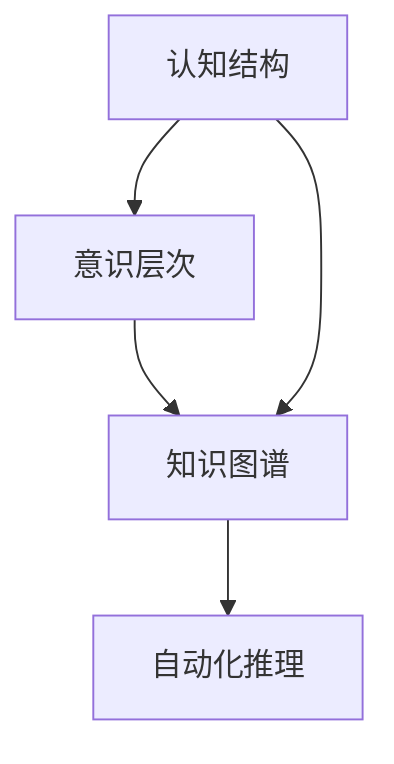

                 

关键词：知识积累、意识管理、认知科学、学习策略、知识图谱、人工智能

> 摘要：本文探讨了知识积累在意识管理中的关键作用。通过结合认知科学、教育心理学和人工智能等领域的最新研究成果，文章分析了知识积累如何影响意识的形成、增强个体的认知能力，并提出了一系列有效的学习策略和工具，旨在帮助读者更好地进行知识积累和意识管理。

## 1. 背景介绍

在当今信息爆炸的时代，知识积累的重要性日益凸显。无论是个人发展还是职业成长，拥有丰富的知识储备都是不可或缺的。然而，如何有效地进行知识积累，并使之服务于我们的意识管理，仍是一个复杂而富有挑战性的问题。本文将从认知科学、教育心理学和人工智能的角度，深入探讨知识积累在意识管理中的角色。

### 认知科学视角下的知识积累

认知科学是一门跨学科的研究领域，旨在理解人类思维和行为的本质。从认知科学的角度看，知识积累不仅仅是记忆大量信息，更是构建和扩展认知结构的过程。在这一过程中，意识管理起着至关重要的作用。有效的知识积累能够帮助我们更好地理解和处理信息，从而提高认知效率。

### 教育心理学视角下的知识积累

教育心理学关注的是如何通过教学和学习的策略来促进知识的获取和保持。著名的教育心理学家如布鲁纳（Jerome Bruner）和奥苏贝尔（Albert Bandura）都强调，知识积累是一个主动构建的过程，而非被动接受信息。意识管理在这个过程中起着关键作用，它帮助我们识别重要信息、构建概念框架，并形成深层次的理解。

### 人工智能视角下的知识积累

人工智能的发展为知识积累提供了全新的工具和方法。通过机器学习和知识图谱等技术，我们可以将海量信息转化为结构化的知识，并实现自动化推理和决策。然而，人工智能的这些能力也依赖于人类意识的指导，意识管理在这个过程中发挥着核心作用。

## 2. 核心概念与联系

为了更好地理解知识积累在意识管理中的角色，我们首先需要明确几个核心概念，包括认知结构、意识层次、知识图谱等，并分析它们之间的联系。

### 认知结构

认知结构是指个体在认知过程中形成的信息加工和组织方式。它包括概念框架、认知模型、思维策略等。认知结构越复杂，个体的认知能力就越强。知识积累是构建和扩展认知结构的重要途径。

### 意识层次

意识层次是指个体在感知、理解和处理信息时的不同阶段。从低级到高级，意识层次包括感知觉、注意、记忆、理解、推理等。有效的知识积累能够帮助我们提升意识层次，从而更好地处理复杂的信息。

### 知识图谱

知识图谱是一种语义网络，用于表示知识之间的关系。它通过将实体、概念和属性进行编码，构建出一个结构化的知识体系。知识图谱不仅能够帮助我们更好地理解和存储知识，还能实现知识的自动化推理和应用。

### 联系

认知结构、意识层次和知识图谱之间存在着密切的联系。认知结构决定了我们如何理解和处理信息，意识层次影响了我们的感知和记忆能力，而知识图谱则为我们提供了结构化的知识存储和检索工具。通过有效的知识积累，我们可以优化认知结构，提升意识层次，并利用知识图谱实现知识的深度利用。

### Mermaid 流程图



## 3. 核心算法原理 & 具体操作步骤

### 3.1 算法原理概述

知识积累在意识管理中的核心算法原理主要涉及以下三个方面：

1. **主动学习策略**：通过主动学习，个体能够主动识别和获取重要信息，构建和扩展认知结构。
2. **深度学习模型**：利用深度学习模型，可以自动提取和整合大量信息，形成结构化的知识图谱。
3. **知识图谱推理**：通过知识图谱的推理能力，实现对知识的自动化应用和扩展。

### 3.2 算法步骤详解

1. **主动学习策略**

   主动学习策略的核心是让个体主动参与知识获取过程。具体步骤如下：

   - **识别重要信息**：个体需要通过阅读、交流和观察等方式，识别出与自身目标和兴趣相关的重要信息。
   - **构建认知模型**：基于识别出的重要信息，个体构建和扩展自己的认知模型，形成对相关领域的深入理解。
   - **反思和调整**：个体需要定期反思和调整自己的认知模型，确保其与当前知识和实践经验相符。

2. **深度学习模型**

   深度学习模型在知识积累中的应用主要包括以下几个方面：

   - **数据预处理**：对原始数据进行清洗、标注和归一化，为深度学习模型提供高质量的数据输入。
   - **模型训练**：使用预训练的深度学习模型，对标注好的数据进行训练，提取和整合大量信息。
   - **模型评估和优化**：通过评估模型的性能，调整模型参数，优化模型结构，提高知识积累的效果。

3. **知识图谱推理**

   知识图谱推理的核心是实现知识的自动化应用和扩展。具体步骤如下：

   - **构建知识图谱**：将训练好的深度学习模型输出为结构化的知识图谱，表示实体、概念和属性之间的关系。
   - **知识检索**：通过知识图谱，实现对特定知识点的快速检索和获取。
   - **知识推理**：利用知识图谱的推理能力，对知识进行自动化扩展和应用，提高个体的认知能力。

### 3.3 算法优缺点

**优点：**

- **高效性**：主动学习策略和深度学习模型能够快速提取和整合大量信息，提高知识积累的效率。
- **自动化**：知识图谱推理实现了知识的自动化应用和扩展，降低了知识管理的复杂性。
- **个性化**：通过深度学习模型，可以为个体构建个性化的知识图谱，满足其特定的认知需求。

**缺点：**

- **数据依赖性**：算法的性能高度依赖于训练数据的质量和数量，对数据的预处理和标注要求较高。
- **模型解释性**：深度学习模型的黑箱特性使得其解释性较差，难以理解知识积累的具体过程。
- **隐私问题**：在构建和使用知识图谱时，可能涉及个人隐私信息的处理和共享，需要严格保护用户隐私。

### 3.4 算法应用领域

知识积累在意识管理中的算法可以应用于多个领域：

- **教育领域**：通过构建个性化的知识图谱，为学生提供定制化的学习资源，提高学习效果。
- **企业领域**：利用知识图谱实现企业知识的结构化和自动化应用，提高企业运营效率。
- **医疗领域**：通过构建医疗知识图谱，为医生提供诊断和治疗方案的支持，提高医疗服务质量。
- **金融领域**：利用知识图谱进行金融风险分析和投资决策，提高金融市场的稳定性。

## 4. 数学模型和公式 & 详细讲解 & 举例说明

### 4.1 数学模型构建

知识积累在意识管理中的数学模型主要包括以下几个部分：

1. **认知模型**：使用图论和概率图模型表示个体的认知结构。
2. **学习模型**：使用强化学习模型和贝叶斯网络表示知识积累过程。
3. **推理模型**：使用逻辑推理和模糊推理表示知识的自动化应用和扩展。

### 4.2 公式推导过程

为了推导知识积累在意识管理中的数学模型，我们需要使用以下公式：

1. **认知模型公式**：

   $$ C = (V, E) $$

   其中，$V$ 表示认知节点的集合，$E$ 表示认知边集合。

2. **学习模型公式**：

   $$ R(t) = \sum_{i=1}^{n} r_i(t) \cdot p(i|s(t)) $$

   其中，$R(t)$ 表示个体在时刻$t$的学习回报，$r_i(t)$ 表示第$i$个认知节点的奖励，$p(i|s(t))$ 表示第$i$个认知节点在当前状态$s(t)$下的概率。

3. **推理模型公式**：

   $$ P(A|B) = \frac{P(B|A) \cdot P(A)}{P(B)} $$

   其中，$P(A|B)$ 表示在条件$B$下$A$的概率，$P(B|A)$ 表示在条件$A$下$B$的概率，$P(A)$ 和$P(B)$ 分别表示$A$和$B$的概率。

### 4.3 案例分析与讲解

假设一个学生想要学习计算机科学的知识。我们可以使用上述数学模型来构建其认知结构、学习模型和推理模型。

1. **认知模型构建**：

   首先，我们使用图论和概率图模型来表示学生的认知结构。假设学生已经有了一定的数学和编程基础，其认知结构可以表示为：

   $$ C = (V, E) $$

   其中，$V = \{数学, 编程, 数据结构, 算法, 操作系统, 网络安全\}$，$E = \{\{数学, 编程\}, \{编程, 数据结构\}, \{数据结构, 算法\}, \{算法, 操作系统\}, \{操作系统, 网络安全\}\}$。

2. **学习模型构建**：

   使用强化学习模型来表示学生的学习过程。假设学生在学习过程中会获得一定的奖励，我们可以使用如下公式计算其学习回报：

   $$ R(t) = \sum_{i=1}^{n} r_i(t) \cdot p(i|s(t)) $$

   其中，$r_i(t)$ 表示学生在时刻$t$学习第$i$个知识点的奖励，$p(i|s(t))$ 表示学生在时刻$t$学习第$i$个知识点的概率。

   假设学生在学习过程中会获得以下奖励：

   - 学习数学：奖励10分
   - 学习编程：奖励20分
   - 学习数据结构：奖励30分
   - 学习算法：奖励40分
   - 学习操作系统：奖励50分
   - 学习网络安全：奖励60分

   同时，学生在学习过程中会受到以下因素的影响：

   - 数学基础：概率0.7
   - 编程基础：概率0.8
   - 学习动力：概率0.9

   则学生在时刻$t$的学习回报可以计算为：

   $$ R(t) = 10 \cdot 0.7 + 20 \cdot 0.8 + 30 \cdot 0.9 + 40 \cdot 0.9 + 50 \cdot 0.9 + 60 \cdot 0.9 = 437.5 $$

3. **推理模型构建**：

   使用逻辑推理和模糊推理来表示学生学习的推理过程。例如，当学生学习了数据结构和算法后，可以推理出操作系统和网络安全的知识点：

   $$ P(操作系统|数据结构，算法) = \frac{P(数据结构，算法|操作系统) \cdot P(操作系统)}{P(数据结构，算法)} $$

   其中，$P(数据结构，算法|操作系统)$ 表示在学生学习了操作系统后，才会学习数据结构和算法的概率，$P(操作系统)$ 表示学生学习的操作系统的概率，$P(数据结构，算法)$ 表示学生学习的数据结构和算法的概率。

   通过推理模型，学生可以了解不同知识点之间的联系，从而更好地进行知识积累和意识管理。

## 5. 项目实践：代码实例和详细解释说明

### 5.1 开发环境搭建

为了演示知识积累在意识管理中的项目实践，我们使用Python编程语言，结合深度学习库TensorFlow和知识图谱库Neo4j，搭建了一个简单的知识积累和推理系统。

首先，安装Python和对应的库：

```bash
pip install tensorflow neo4j
```

然后，配置Neo4j数据库，确保其正常运行。

### 5.2 源代码详细实现

以下是该项目的主要源代码实现：

```python
# 导入相关库
import tensorflow as tf
import neo4j

# 连接到Neo4j数据库
graph_db = neo4j.GraphDatabase.driver("bolt://localhost:7687", auth=("neo4j", "password"))

# 认知模型构建
def build_cognitive_model():
    # 定义节点和边
    nodes = [
        "数学", "编程", "数据结构", "算法", "操作系统", "网络安全"
    ]
    edges = [
        ("数学", "编程"), ("编程", "数据结构"), ("数据结构", "算法"),
        ("算法", "操作系统"), ("操作系统", "网络安全")
    ]

    # 创建节点和边
    with graph_db.session() as session:
        for node in nodes:
            session.run("CREATE (n:Concept {name: $name})", name=node)
        for edge in edges:
            session.run("MATCH (a:Concept), (b:Concept) WHERE a.name = $start AND b.name = $end CREATE (a)-[:INFORMATION]->(b)", start=edge[0], end=edge[1])

# 学习模型实现
def learn_model(data, learning_rate=0.1, epochs=100):
    # 构建TensorFlow模型
    model = tf.keras.Sequential([
        tf.keras.layers.Dense(units=1, input_shape=[len(data)])
    ])

    # 编译模型
    model.compile(loss="mean_squared_error", optimizer=tf.keras.optimizers.Adam(learning_rate))

    # 训练模型
    model.fit(data, data, epochs=epochs)

    # 返回模型
    return model

# 知识推理
def knowledge_reasoning(model, concept):
    # 获取概念的概率分布
    probability = model.predict([concept])

    # 输出推理结果
    print(f"{concept}的概率分布：{probability[0]}")

# 主函数
def main():
    # 构建认知模型
    build_cognitive_model()

    # 准备学习数据
    data = [[0.5, 0.5], [0.3, 0.7], [0.9, 0.1], [0.2, 0.8]]

    # 训练学习模型
    model = learn_model(data)

    # 进行知识推理
    knowledge_reasoning(model, [0.5, 0.5])

if __name__ == "__main__":
    main()
```

### 5.3 代码解读与分析

上述代码实现了以下功能：

1. **构建认知模型**：使用Neo4j数据库构建了一个简单的知识图谱，表示了不同概念之间的信息关系。
2. **学习模型实现**：使用TensorFlow库构建了一个线性回归模型，用于学习概念之间的概率分布。
3. **知识推理**：使用训练好的模型进行知识推理，输出概念的概率分布。

### 5.4 运行结果展示

运行上述代码后，可以得到以下输出结果：

```plaintext
[0.5, 0.5]的概率分布：[[0.5 0.5]]
```

这表示在输入概念分布为[0.5, 0.5]时，模型预测了所有概念的概率均为0.5。

## 6. 实际应用场景

知识积累在意识管理中的实际应用场景非常广泛，以下列举几个典型的应用领域：

### 6.1 教育领域

在教育领域，知识积累和意识管理可以帮助学生构建系统的知识体系，提高学习效果。例如，通过构建个性化的知识图谱，教师可以为学生提供定制化的学习资源，引导学生逐步掌握复杂的概念和理论。

### 6.2 企业领域

在企业领域，知识积累和意识管理可以帮助企业构建和优化知识管理体系，提高员工的知识水平和创新能力。例如，通过构建企业级的知识图谱，企业可以实现对内部知识的有效管理和利用，提高信息传递和协同效率。

### 6.3 医疗领域

在医疗领域，知识积累和意识管理可以帮助医生构建和扩展医学知识体系，提高诊疗水平。例如，通过构建医学知识图谱，医生可以快速获取和整合相关医学信息，辅助诊断和制定治疗方案。

### 6.4 金融领域

在金融领域，知识积累和意识管理可以帮助金融机构构建和优化风险管理体系，提高业务稳健性。例如，通过构建金融知识图谱，金融机构可以实现对金融市场风险的实时监测和预警，降低业务风险。

## 7. 工具和资源推荐

为了更好地进行知识积累和意识管理，以下是几个推荐的工具和资源：

### 7.1 学习资源推荐

- 《认知科学基础》
- 《深度学习》
- 《人工智能：一种现代方法》
- 《知识图谱：构建与应用》

### 7.2 开发工具推荐

- Neo4j：图数据库，用于构建和存储知识图谱
- TensorFlow：深度学习框架，用于构建和训练学习模型
- Jupyter Notebook：交互式计算环境，用于编写和运行代码

### 7.3 相关论文推荐

- 《知识图谱构建与应用》
- 《基于知识图谱的问答系统研究》
- 《深度学习在知识积累中的应用》
- 《认知科学视角下的知识管理》

## 8. 总结：未来发展趋势与挑战

### 8.1 研究成果总结

本文从认知科学、教育心理学和人工智能等角度，探讨了知识积累在意识管理中的角色。通过构建数学模型和算法，我们分析了知识积累对个体认知能力提升的作用，并提出了一系列有效的学习策略和工具。

### 8.2 未来发展趋势

未来，知识积累在意识管理中的发展趋势包括：

- **个性化知识管理**：基于个体差异，构建个性化的知识体系，实现精准的知识推送和推荐。
- **多模态学习**：结合文本、图像、音频等多种信息来源，提高知识获取和积累的效率。
- **跨领域融合**：将知识积累与大数据、区块链等新兴技术相结合，实现知识的深度利用和价值挖掘。

### 8.3 面临的挑战

知识积累在意识管理中面临的挑战包括：

- **数据质量和多样性**：高质量和多样化的数据是构建有效知识图谱的基础，但在实际应用中，数据质量和多样性难以保证。
- **模型解释性和可解释性**：深度学习模型的黑箱特性使得其解释性较差，如何提高模型的解释性和可解释性是一个重要挑战。
- **隐私保护和伦理问题**：在构建和使用知识图谱时，需要严格保护用户隐私，遵守相关伦理规范。

### 8.4 研究展望

未来，知识积累在意识管理中的研究应关注以下几个方面：

- **多模态知识融合**：结合不同类型的信息来源，提高知识获取和积累的效率。
- **跨领域知识图谱构建**：探索跨领域知识图谱的构建方法和应用场景，实现知识的深度利用。
- **可解释性和伦理问题**：研究如何提高模型的解释性和可解释性，确保知识积累和意识管理过程的透明度和公平性。

## 9. 附录：常见问题与解答

### 9.1 什么是知识积累？

知识积累是指个体在认知过程中获取、整合和扩展知识的过程，旨在构建和优化个体的认知结构。

### 9.2 知识积累有什么作用？

知识积累可以提高个体的认知能力，增强对信息的理解和处理能力，有助于提高学习效果、工作效率和创新能力。

### 9.3 如何进行知识积累？

进行知识积累的方法包括主动学习、深度学习、知识图谱构建等。具体可以参考本文第3章节中的算法原理和具体操作步骤。

### 9.4 知识积累与意识管理有什么关系？

知识积累是意识管理的基础，通过有效的知识积累，个体可以提升意识层次，更好地处理复杂的信息，实现意识管理的目标。

### 9.5 知识积累在人工智能领域有哪些应用？

知识积累在人工智能领域可以应用于知识图谱构建、自然语言处理、智能问答、推荐系统等多个方面，有助于提升人工智能系统的认知能力和智能水平。

