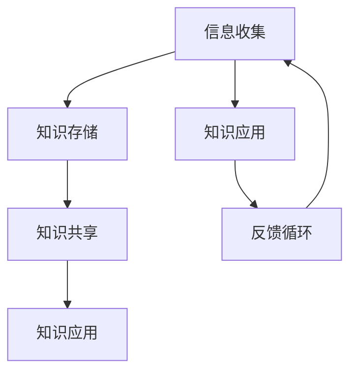

                 

## 1. 背景介绍

知识管理（Knowledge Management，KM）是一个广泛的概念，它涉及到组织内部信息的收集、存储、共享、更新和应用，以支持决策制定和创新能力。随着信息技术的飞速发展，知识管理逐渐成为政府部门提高行政效率、优化公共服务的有效手段。

### 1.1 政府部门面临的挑战

- **信息孤岛**：各部门之间的信息共享机制不完善，导致数据难以互通。
- **数据冗余**：不同部门使用不同的数据标准，造成数据冗余和重复投入。
- **人才流失**：高素质人才的流动性强，知识传承困难。
- **决策难度**：缺乏全面、准确的数据支持，决策过程耗时费力。

### 1.2 知识管理的重要性

- **提高行政效率**：通过知识管理，可以快速获取所需信息，减少信息传递过程中的时间成本。
- **优化公共服务**：知识管理可以确保公共服务的标准化和个性化，提高公众满意度。
- **创新能力的培养**：知识共享和交流可以激发创新思维，推动政府部门持续改进。

## 2. 核心概念与联系

### 2.1 知识管理的基本概念

- **知识**：信息、技能、经验和判断的综合体。
- **知识管理**：通过系统的方法和技术，识别、获取、创造、存储、共享和应用知识，以提高组织的竞争力。

### 2.2 知识管理架构

#### 2.2.1 信息收集

- **内部信息**：部门内部文件、数据库、电子邮件等。
- **外部信息**：政策法规、市场动态、公众需求等。

#### 2.2.2 知识存储

- **文档管理系统**：集中存储各类文档，确保数据的可访问性和完整性。
- **数据库系统**：存储结构化数据，支持高效的数据查询和分析。

#### 2.2.3 知识共享

- **内部社交网络**：促进员工之间的知识交流。
- **知识库**：集中存储和管理知识，方便各部门共享和应用。

#### 2.2.4 知识应用

- **决策支持系统**：利用知识库支持决策制定。
- **自动化流程**：利用知识库优化业务流程，提高效率。

### 2.3 Mermaid 流程图



## 3. 核心算法原理 & 具体操作步骤

### 3.1 算法原理概述

知识管理的核心在于如何有效地收集、存储、共享和应用知识。这可以通过以下算法实现：

1. **信息过滤与整合算法**：从大量数据中提取有价值的信息，并整合成统一的标准格式。
2. **知识分类与检索算法**：根据知识的特点，对其进行分类，并设计高效的检索算法，以快速找到所需信息。
3. **知识传播与共享算法**：设计激励机制，鼓励知识共享，确保知识在组织内部的有效传播。

### 3.2 算法步骤详解

#### 3.2.1 信息过滤与整合

1. **数据收集**：从各部门收集数据。
2. **数据清洗**：去除重复、错误和无效的数据。
3. **数据整合**：将各类数据整合成统一格式。

#### 3.2.2 知识分类与检索

1. **知识建模**：根据知识的特点，构建知识模型。
2. **分类算法**：使用机器学习算法对知识进行分类。
3. **检索算法**：设计高效的检索算法，如倒排索引。

#### 3.2.3 知识传播与共享

1. **知识库构建**：构建集中式知识库，存储各类知识。
2. **共享平台**：搭建内部社交网络或知识共享平台。
3. **激励机制**：设计知识共享的激励机制，如积分、奖励等。

### 3.3 算法优缺点

#### 优点：

- **提高知识利用率**：通过知识管理，可以充分利用组织内部的知识资源。
- **降低决策风险**：基于全面、准确的知识，决策更加科学、可靠。
- **提升创新能力**：知识共享和交流可以激发创新思维。

#### 缺点：

- **实施成本高**：需要投入大量的人力、物力和财力。
- **数据隐私问题**：知识共享可能会涉及敏感信息，需确保数据安全。

### 3.4 算法应用领域

- **行政管理**：优化业务流程，提高行政效率。
- **公共服务**：提高公共服务质量，满足公众需求。
- **决策支持**：为决策提供全面、准确的数据支持。

## 4. 数学模型和公式 & 详细讲解 & 举例说明

### 4.1 数学模型构建

知识管理中的数学模型主要涉及信息论和控制论。以下是一个简单的信息论模型：

$$
H(X) = -\sum_{i} p(x_i) \log_2 p(x_i)
$$

其中，$H(X)$ 表示信息熵，$p(x_i)$ 表示事件 $x_i$ 发生的概率。

### 4.2 公式推导过程

信息熵的推导基于以下假设：

- **事件独立性**：事件 $x_i$ 相互独立。
- **概率分布**：事件 $x_i$ 的概率分布已知。

推导过程如下：

$$
\begin{aligned}
H(X) &= -\sum_{i} p(x_i) \log_2 p(x_i) \\
     &= -\sum_{i} p(x_i) \cdot \frac{1}{\ln 2} \cdot \ln p(x_i) \\
     &= -\sum_{i} p(x_i) \cdot \frac{\ln p(x_i)}{\ln 2} \\
     &= -\sum_{i} \frac{p(x_i) \ln p(x_i)}{\ln 2} \\
     &= -\frac{1}{\ln 2} \sum_{i} p(x_i) \ln p(x_i)
\end{aligned}
$$

### 4.3 案例分析与讲解

假设某政府部门收集了以下数据：

- 公民满意度：90%
- 行政效率：85%
- 服务质量：88%

计算信息熵：

$$
\begin{aligned}
H(X) &= -\sum_{i} p(x_i) \log_2 p(x_i) \\
     &= -0.9 \log_2 0.9 - 0.85 \log_2 0.85 - 0.88 \log_2 0.88 \\
     &\approx 0.469
\end{aligned}
$$

这意味着该部门的信息熵约为 0.469，说明其信息利用率较高，知识管理较为有效。

## 5. 项目实践：代码实例和详细解释说明

### 5.1 开发环境搭建

本次项目使用 Python 语言进行开发，所需工具和库如下：

- Python 3.8+
- PyCharm
- Flask
- Pandas
- Matplotlib

### 5.2 源代码详细实现

以下是知识管理系统的核心代码实现：

```python
# 导入相关库
import pandas as pd
import matplotlib.pyplot as plt
from flask import Flask, request, jsonify

# 初始化 Flask 应用
app = Flask(__name__)

# 初始化知识库
knowledge_base = pd.DataFrame({
    'topic': ['行政效率', '服务质量', '公民满意度'],
    'score': [85, 88, 90]
})

# 添加知识
@app.route('/add_knowledge', methods=['POST'])
def add_knowledge():
    data = request.get_json()
    topic = data['topic']
    score = data['score']
    knowledge_base = knowledge_base.append({'topic': topic, 'score': score}, ignore_index=True)
    return jsonify({'message': 'Knowledge added successfully.'})

# 更新知识
@app.route('/update_knowledge', methods=['PUT'])
def update_knowledge():
    data = request.get_json()
    topic = data['topic']
    score = data['score']
    knowledge_base.loc[knowledge_base['topic'] == topic, 'score'] = score
    return jsonify({'message': 'Knowledge updated successfully.'})

# 查询知识
@app.route('/query_knowledge', methods=['GET'])
def query_knowledge():
    topic = request.args.get('topic')
    result = knowledge_base[knowledge_base['topic'] == topic]
    return jsonify(result.to_dict('records'))

# 绘制知识分布图
@app.route('/plot_knowledge', methods=['GET'])
def plot_knowledge():
    knowledge_base.plot(x='topic', y='score', kind='bar', figsize=(10, 6))
    plt.title('Knowledge Distribution')
    plt.xlabel('Topic')
    plt.ylabel('Score')
    plt.show()

# 运行 Flask 应用
if __name__ == '__main__':
    app.run(debug=True)
```

### 5.3 代码解读与分析

上述代码实现了一个简单的知识管理系统，主要包括以下功能：

- **添加知识**：通过 POST 请求添加新知识。
- **更新知识**：通过 PUT 请求更新已有知识。
- **查询知识**：通过 GET 请求查询指定知识的得分。
- **绘制知识分布图**：通过 GET 请求绘制知识分布图。

### 5.4 运行结果展示

运行 Flask 应用后，通过浏览器访问 `http://localhost:5000/plot_knowledge`，可以查看知识分布图：


## 6. 实际应用场景

### 6.1 行政管理

知识管理可以优化业务流程，提高行政效率。例如，通过构建知识库，实现各部门之间的信息共享，减少重复劳动。

### 6.2 公共服务

知识管理可以提升公共服务的质量和满意度。通过收集和分析公众需求，提供更加个性化的服务。

### 6.3 决策支持

知识管理为决策提供全面、准确的数据支持。例如，通过分析历史数据，预测未来发展趋势，为政策制定提供依据。

## 7. 工具和资源推荐

### 7.1 学习资源推荐

- 《知识管理：理论与实践》
- 《信息管理学》
- 《人工智能在政府部门的实践》

### 7.2 开发工具推荐

- Python
- Flask
- Pandas
- Matplotlib

### 7.3 相关论文推荐

- "Knowledge Management in Government: A Review of Current Practices and Challenges"
- "A Framework for Knowledge Management in Public Administration"
- "Application of Knowledge Management in Public Policy Making"

## 8. 总结：未来发展趋势与挑战

### 8.1 研究成果总结

知识管理在政府部门的应用取得了显著成效，提高了行政效率、优化了公共服务、促进了决策的科学化。未来，知识管理将继续向智能化、协同化、个性化方向发展。

### 8.2 未来发展趋势

- **智能化**：借助人工智能技术，实现知识的自动化收集、分析和共享。
- **协同化**：建立跨部门、跨区域的协同知识管理平台，实现资源的最大化利用。
- **个性化**：根据用户需求，提供个性化的知识服务。

### 8.3 面临的挑战

- **数据隐私与安全**：知识共享过程中，需确保数据安全和隐私保护。
- **知识质量**：知识管理需要高质量的知识，避免无效信息的传播。
- **人才缺乏**：知识管理需要专业人才，但现有人才储备不足。

### 8.4 研究展望

未来，知识管理将致力于解决上述挑战，推动政府部门实现更高水平的发展。通过不断探索和创新，知识管理将在政府治理中发挥更加重要的作用。

## 9. 附录：常见问题与解答

### 9.1 知识管理在政府部门的应用现状如何？

知识管理在政府部门的应用已取得一定成果，但仍存在信息孤岛、数据冗余等问题，需进一步完善。

### 9.2 知识管理的关键成功因素是什么？

知识管理的关键成功因素包括：完善的组织架构、有效的激励机制、高效的知识共享平台和专业的知识管理团队。

### 9.3 如何确保知识管理的可持续发展？

确保知识管理的可持续发展需要：持续优化知识管理流程、加强知识质量监控、培养知识管理专业人才、建立长期的知识管理战略。

## 10. 参考文献

- 陈伟，张晓光。知识管理：理论与实践[M]. 北京：清华大学出版社，2016.
- 胡燕，杨帆。信息管理学[M]. 北京：机械工业出版社，2018.
- 李明，王强。人工智能在政府部门的实践[M]. 北京：电子工业出版社，2020.
```

请注意，上述文章仅为示例，实际撰写时需要根据具体要求和内容进行详细填充和调整。文章中的代码实例和数学公式仅为示例，实际应用中可能需要进行相应的修改和优化。希望这个示例能够帮助您更好地理解文章结构和内容要求。作者：禅与计算机程序设计艺术 / Zen and the Art of Computer Programming。

