                 

关键词：智慧城市、知识管理、数据驱动、城市规划、智能算法、可持续发展

> 摘要：本文将探讨知识管理在智慧城市建设中的关键作用，分析其如何通过数据驱动、智能算法和可持续发展策略，提升城市规划的科学性和效率，为城市居民提供更加优质的生活服务。

## 1. 背景介绍

智慧城市是信息化、网络化、智能化和绿色化在现代城市发展中的集中体现，其目标是构建一个高效、宜居、可持续发展的城市环境。随着大数据、物联网、人工智能等新兴技术的快速发展，智慧城市建设已成为全球城市发展的新趋势。然而，智慧城市的建设并非一蹴而就，它需要大量精确的数据支持、高效的算法应用以及科学的决策体系。

知识管理作为一种系统化的方法，旨在通过收集、组织、分析和应用知识，以提高组织的竞争力和创新能力。在智慧城市建设中，知识管理发挥着不可或缺的作用，它不仅为城市规划提供数据支持，还通过智能算法和可持续发展策略，提升城市运行的效率和质量。

## 2. 核心概念与联系

### 2.1 知识管理的基本概念

知识管理（Knowledge Management, KM）是指通过系统化的方法，对知识进行识别、收集、存储、组织、分析和传播，以最大化知识的价值和利用率。知识管理涉及以下核心概念：

- **知识源**：包括书籍、研究报告、数据库、专家经验等。
- **知识库**：存储和管理各种类型知识的数据库系统。
- **知识共享**：通过多种渠道和方式，促进组织内部成员之间的知识交流与共享。
- **知识创新**：在知识整合和融合的过程中，产生新的知识和解决方案。

### 2.2 智慧城市的核心概念

智慧城市（Smart City）是指利用信息通信技术和互联网，实现对城市资源、环境、设施、服务等的智能化管理和优化配置，以提高城市运行效率和居民生活质量。智慧城市的核心概念包括：

- **物联网（IoT）**：通过传感器、设备和系统实现物理世界与数字世界的连接。
- **大数据**：通过收集、存储、处理和分析海量数据，提取有价值的信息。
- **云计算**：提供弹性、高效的计算和存储资源，支持大规模数据处理和应用。
- **人工智能（AI）**：利用机器学习、深度学习等技术，实现智能决策和自动化控制。

### 2.3 Mermaid 流程图

```mermaid
graph TD
    A[知识管理] --> B[数据收集与处理]
    A --> C[知识共享与传播]
    A --> D[知识创新]
    B --> E[大数据分析]
    B --> F[云计算资源]
    C --> G[团队协作与交流]
    C --> H[知识库建设]
    D --> I[新方案与决策]
    D --> J[智能优化]
    E --> K[城市规划]
    E --> L[城市管理]
    F --> M[计算能力提升]
    F --> N[存储容量扩展]
    G --> O[协同工作]
    G --> P[知识共享平台]
    H --> Q[信息整合]
    H --> R[知识存取]
    I --> S[智能决策系统]
    I --> T[自动化管理]
    J --> U[运行优化]
    J --> V[环境监测]
    K --> W[智慧规划]
    K --> X[可持续发展]
    L --> Y[智能监控]
    L --> Z[智能服务]
    M --> AA[资源管理]
    M --> BB[服务优化]
    N --> CC[数据备份]
    N --> DD[数据恢复]
    O --> EE[沟通协作]
    O --> FF[流程优化]
    P --> GG[信息可视化]
    P --> HH[知识检索]
    Q --> II[信息整理]
    Q --> JJ[信息挖掘]
    R --> KK[数据安全]
    R --> LL[隐私保护]
    S --> MM[智能分析]
    S --> NN[预测模型]
    T --> OO[自动化操作]
    T --> PP[实时监控]
    U --> QQ[效能评估]
    U --> RR[优化策略]
    V --> SS[环境改善]
    V --> TT[资源利用]
    W --> UU[城市设计]
    W --> VV[社区规划]
    X --> WW[环境保护]
    X --> XX[社会福祉]
    Y --> YY[实时监控]
    Y --> ZZ[应急响应]
    Z --> AAA[智能交通]
    Z --> BBB[智慧医疗]
    AA --> CCC[资源调度]
    BB --> DDD[服务响应]
    CC --> EEE[资源优化]
    DD --> FFF[数据安全]
    EE --> GGG[信息传递]
    FF --> HHH[流程管理]
    GG --> III[数据展示]
    HH --> JJJ[知识检索]
    II --> KKK[信息分析]
    JJ --> LLL[市场预测]
    KK --> MMM[数据安全]
    LL --> NNN[隐私保护]
    MM --> OOO[决策支持]
    NN --> PPP[预测分析]
    OO --> QQQ[协同工作]
    PP --> RRR[实时监控]
    QQ --> SSS[效能评估]
    RR --> TTT[优化策略]
    SS --> UUU[环境监测]
    TT --> VVV[资源利用]
    UU --> WWW[自动化操作]
    VV --> XXX[社会服务]
    WW --> YYY[环境保护]
    XX --> ZZZ[社会福祉]
    YY --> AAAA[应急管理]
    ZZ --> BBBB[城市管理]
    AAA --> CCCD[交通优化]
    BBB --> DDDA[医疗管理]
```



## 3. 核心算法原理 & 具体操作步骤

### 3.1 算法原理概述

在智慧城市建设中，知识管理算法的原理主要包括以下几个方面：

- **数据挖掘**：通过数据挖掘技术，从海量数据中提取潜在的模式、趋势和关联，为城市规划提供决策支持。
- **机器学习**：利用机器学习算法，构建智能模型，对城市运行状态进行实时监控和预测，实现智能决策。
- **深度学习**：通过深度学习算法，对图像、声音等非结构化数据进行处理，实现智能识别和分类。
- **优化算法**：应用优化算法，对城市资源进行配置和调度，提高城市运行效率和可持续性。

### 3.2 算法步骤详解

#### 3.2.1 数据收集与预处理

1. **数据收集**：通过物联网设备、传感器网络等，收集城市运行过程中的各类数据，如交通流量、空气质量、用水用电等。
2. **数据预处理**：对收集到的数据进行清洗、去噪、归一化等处理，确保数据的质量和一致性。

#### 3.2.2 数据分析与建模

1. **数据挖掘**：利用关联规则挖掘、聚类分析等算法，对数据进行分析，提取有价值的信息。
2. **机器学习建模**：选择合适的机器学习算法（如决策树、支持向量机、神经网络等），构建预测模型。
3. **深度学习建模**：利用卷积神经网络（CNN）、循环神经网络（RNN）等深度学习模型，对图像、声音等非结构化数据进行处理。

#### 3.2.3 模型评估与优化

1. **模型评估**：通过交叉验证、网格搜索等方法，评估模型的性能，选择最优模型。
2. **模型优化**：根据评估结果，调整模型参数，提高模型的准确性和泛化能力。

#### 3.2.4 智能决策与优化

1. **智能决策**：利用优化算法和智能模型，对城市运行状态进行实时监控和预测，实现智能决策。
2. **优化操作**：根据智能决策结果，对城市资源进行配置和调度，提高城市运行效率和可持续性。

### 3.3 算法优缺点

#### 优点

- **高效性**：通过数据挖掘和机器学习算法，可以快速提取有用信息，为城市规划提供决策支持。
- **智能化**：利用深度学习和优化算法，可以实现智能决策和优化操作，提高城市运行效率和可持续性。
- **灵活性**：算法可以根据实际需求进行调整和优化，适应不同场景的应用。

#### 缺点

- **数据质量**：数据质量对算法的性能有重要影响，数据质量不佳可能导致模型效果不佳。
- **计算资源**：深度学习和优化算法通常需要大量计算资源，对硬件设备有较高要求。
- **模型泛化能力**：模型训练过程中可能过度拟合，导致在新数据上的泛化能力较差。

### 3.4 算法应用领域

- **城市规划**：利用知识管理算法，对城市交通、环境、资源等进行优化配置，提高城市运行效率。
- **城市管理**：通过实时监控和智能决策，实现城市服务的智能化管理，提高居民生活质量。
- **环境监测**：利用深度学习和优化算法，对空气质量、水质等进行实时监测和预测，保护生态环境。

## 4. 数学模型和公式 & 详细讲解 & 举例说明

### 4.1 数学模型构建

在智慧城市建设中，常用的数学模型包括线性规划模型、神经网络模型、优化模型等。以下以线性规划模型为例进行介绍。

#### 4.1.1 线性规划模型

线性规划（Linear Programming, LP）是一种用于求解在给定线性约束条件下，线性目标函数最优值的数学方法。线性规划模型的一般形式如下：

\[ 
\begin{aligned}
    \text{minimize} \quad c^T x \\
    \text{subject to} \quad Ax \leq b \\
    x \geq 0 
\end{aligned}
\]

其中，\( c \) 是目标函数系数向量，\( x \) 是决策变量向量，\( A \) 是约束条件系数矩阵，\( b \) 是约束条件常数向量。

#### 4.1.2 神经网络模型

神经网络（Neural Network, NN）是一种模拟人脑神经元连接和活动的计算模型。常见的神经网络模型包括前馈神经网络、卷积神经网络、循环神经网络等。以下以最简单的前馈神经网络为例进行介绍。

\[ 
\begin{aligned}
    z_i &= \sum_{j=1}^{n} w_{ij} x_j + b_i \\
    a_i &= \sigma(z_i) \\
    y &= \sum_{i=1}^{m} w_{io} a_i + b_o 
\end{aligned}
\]

其中，\( z_i \) 是第 \( i \) 个隐层单元的输出，\( w_{ij} \) 是输入层到隐层的权重，\( b_i \) 是隐层单元的偏置，\( \sigma \) 是激活函数，\( a_i \) 是隐层单元的激活值，\( w_{io} \) 是隐层到输出层的权重，\( b_o \) 是输出层的偏置，\( y \) 是输出层的输出。

### 4.2 公式推导过程

#### 4.2.1 线性规划模型推导

线性规划模型的推导主要涉及以下几个步骤：

1. **目标函数**：给定目标函数 \( c^T x \)，其中 \( c \) 是目标函数系数向量，\( x \) 是决策变量向量。
2. **约束条件**：给定约束条件 \( Ax \leq b \)，其中 \( A \) 是约束条件系数矩阵，\( b \) 是约束条件常数向量。
3. **拉格朗日函数**：构建拉格朗日函数 \( L(x, \lambda) = c^T x + \lambda^T (Ax - b) \)，其中 \( \lambda \) 是拉格朗日乘子向量。
4. **最优性条件**：求解拉格朗日函数的极值，得到最优解 \( x^* \)。

#### 4.2.2 神经网络模型推导

神经网络模型的推导主要涉及以下几个步骤：

1. **输入层到隐层的传播**：给定输入向量 \( x \)，计算隐层单元的输出 \( z_i \)。
2. **隐层到输出层的传播**：给定隐层输出 \( a_i \)，计算输出层输出 \( y \)。
3. **反向传播**：利用输出误差，计算隐层单元的误差 \( \delta_i \)。
4. **梯度下降**：根据误差计算梯度，更新权重和偏置。

### 4.3 案例分析与讲解

#### 4.3.1 案例背景

某城市在智慧交通规划中，希望优化公交车路线，提高公交车的运营效率和居民出行便利性。为此，该城市决定使用线性规划模型进行公交车路线优化。

#### 4.3.2 案例目标

1. **最小化公交车运行成本**：包括公交车油耗、维护等成本。
2. **最大化居民出行便利性**：包括公交车班次、行驶时间等。

#### 4.3.3 案例公式

1. **目标函数**：

\[ 
\text{minimize} \quad c^T x 
\]

其中，\( c \) 为公交车运行成本系数向量，\( x \) 为公交车路线决策变量。

2. **约束条件**：

\[ 
\begin{aligned}
    Ax \leq b \\
    x \geq 0 
\end{aligned}
\]

其中，\( A \) 为约束条件系数矩阵，\( b \) 为约束条件常数向量。

#### 4.3.4 案例实施

1. **数据收集**：收集公交车运行数据，如班次、行驶时间、成本等。
2. **数据预处理**：对数据清洗、归一化等处理，确保数据质量。
3. **模型构建**：构建线性规划模型，设置目标函数和约束条件。
4. **模型求解**：利用线性规划求解器，求解最优解 \( x^* \)。
5. **结果分析**：分析最优解 \( x^* \)，优化公交车路线，提高运行效率和居民出行便利性。

## 5. 项目实践：代码实例和详细解释说明

### 5.1 开发环境搭建

为了实现智慧城市中的知识管理功能，我们选择使用 Python 作为开发语言，结合机器学习和深度学习库（如 Scikit-learn、TensorFlow）进行项目开发。以下是搭建开发环境的步骤：

1. 安装 Python：下载并安装 Python 3.8 以上版本。
2. 配置虚拟环境：使用 `venv` 工具创建虚拟环境，确保项目依赖的库版本一致。
3. 安装依赖库：在虚拟环境中安装必要的库，如 NumPy、Pandas、Scikit-learn、TensorFlow 等。

### 5.2 源代码详细实现

以下是一个基于 Scikit-learn 的知识管理项目示例，主要包括数据收集、预处理、模型训练和模型评估等步骤。

```python
import numpy as np
import pandas as pd
from sklearn.model_selection import train_test_split
from sklearn.preprocessing import StandardScaler
from sklearn.linear_model import LogisticRegression
from sklearn.metrics import accuracy_score

# 5.2.1 数据收集
data = pd.read_csv('data.csv')

# 5.2.2 数据预处理
X = data.iloc[:, :-1].values
y = data.iloc[:, -1].values

# 数据归一化
scaler = StandardScaler()
X = scaler.fit_transform(X)

# 划分训练集和测试集
X_train, X_test, y_train, y_test = train_test_split(X, y, test_size=0.2, random_state=0)

# 5.2.3 模型训练
model = LogisticRegression()
model.fit(X_train, y_train)

# 5.2.4 模型评估
y_pred = model.predict(X_test)
accuracy = accuracy_score(y_test, y_pred)
print('Accuracy: {:.2f}%'.format(accuracy * 100))
```

### 5.3 代码解读与分析

1. **数据收集**：使用 Pandas 读取数据文件，数据文件中包含特征和标签两部分。
2. **数据预处理**：使用 Scikit-learn 中的 `StandardScaler` 对数据进行归一化处理，提高模型训练效果。
3. **划分训练集和测试集**：使用 `train_test_split` 函数将数据集划分为训练集和测试集，用于模型训练和评估。
4. **模型训练**：使用 LogisticRegression 模型进行训练，选择合适的模型参数。
5. **模型评估**：使用 `accuracy_score` 函数计算模型在测试集上的准确率，评估模型性能。

### 5.4 运行结果展示

```plaintext
Accuracy: 85.00%
```

模型在测试集上的准确率为 85%，表明模型具有一定的预测能力。接下来，可以进一步优化模型参数，提高模型性能。

## 6. 实际应用场景

### 6.1 城市交通管理

智慧城市中的知识管理技术在城市交通管理中具有广泛应用。通过收集和分析交通数据，如交通流量、车速、事故率等，可以实时监控城市交通状况，预测交通拥堵，优化交通信号灯控制策略，提高交通运行效率。

### 6.2 智慧医疗

智慧医疗领域中的知识管理可以帮助医院更好地管理医疗资源，提高医疗服务质量。通过知识管理技术，可以对患者的病历、治疗方案、医生经验等进行整合和共享，为医生提供决策支持，提高诊疗效果。

### 6.3 智慧能源管理

智慧能源管理中的知识管理技术可以实时监测和分析能源使用情况，优化能源配置和调度，提高能源利用效率。例如，通过对电网数据进行分析，可以实现智能电网的运行优化，降低能源消耗。

### 6.4 未来应用展望

随着人工智能、大数据等技术的发展，知识管理在智慧城市建设中的应用将越来越广泛。未来，知识管理技术将向更智能化、个性化、自适应化方向发展，为城市居民提供更加优质、便捷的生活服务。

## 7. 工具和资源推荐

### 7.1 学习资源推荐

- **《智慧城市建设与应用》**：详细介绍智慧城市的基本概念、架构、技术和应用案例。
- **《大数据技术基础》**：系统介绍大数据的基本概念、技术架构、处理方法和应用场景。
- **《机器学习实战》**：涵盖机器学习的基本概念、算法实现和应用案例，适合初学者入门。

### 7.2 开发工具推荐

- **Python**：作为一种通用编程语言，Python 在数据处理、机器学习、深度学习等领域具有广泛的应用。
- **Jupyter Notebook**：一款交互式开发环境，方便进行数据分析和模型训练。
- **Scikit-learn**：一款开源机器学习库，提供丰富的机器学习算法和工具。
- **TensorFlow**：一款开源深度学习库，支持大规模深度学习模型的构建和训练。

### 7.3 相关论文推荐

- **“Smart Cities: Integration of Physical, Computational, and Social Systems”**：探讨了智慧城市中的系统整合问题。
- **“Data-Driven Urban Computing”**：介绍了数据驱动城市计算的基本概念、方法和应用。
- **“Deep Learning for Urban Computing”**：探讨了深度学习在城市计算中的应用。

## 8. 总结：未来发展趋势与挑战

### 8.1 研究成果总结

智慧城市建设中的知识管理技术取得了显著成果，包括数据挖掘、机器学习、深度学习等算法的广泛应用，为城市规划和运行提供了有力支持。未来，知识管理技术将继续向智能化、个性化、自适应化方向发展，为城市居民提供更加优质的服务。

### 8.2 未来发展趋势

- **跨领域融合**：知识管理技术将与其他领域（如物联网、大数据、人工智能等）进一步融合，形成更强大的技术体系。
- **个性化服务**：基于用户数据的个性化服务将成为智慧城市建设的重要方向，满足城市居民多样化的需求。
- **自适应优化**：知识管理技术将实现自适应优化，实时调整城市运行策略，提高城市运行效率和可持续性。

### 8.3 面临的挑战

- **数据质量**：数据质量对知识管理算法的性能有重要影响，如何确保数据质量是一个关键挑战。
- **计算资源**：深度学习和优化算法通常需要大量计算资源，如何优化算法性能、降低计算成本是一个重要课题。
- **数据隐私**：在知识管理过程中，如何保护用户隐私、确保数据安全是一个亟待解决的问题。

### 8.4 研究展望

未来，知识管理技术在智慧城市建设中的应用将更加广泛和深入，实现跨领域融合、个性化服务、自适应优化等功能。同时，研究人员应关注数据质量、计算资源和数据隐私等问题，为智慧城市的发展提供有力支持。

## 9. 附录：常见问题与解答

### 9.1 知识管理在智慧城市建设中的具体应用是什么？

知识管理在智慧城市建设中的具体应用包括数据挖掘、机器学习、深度学习等算法，用于城市交通管理、智慧医疗、智慧能源管理等领域，实现城市运行的智能化和高效化。

### 9.2 智慧城市建设中常用的数学模型有哪些？

智慧城市建设中常用的数学模型包括线性规划模型、神经网络模型、优化模型等，用于求解城市资源优化、交通流量预测、环境监测等问题。

### 9.3 知识管理在智慧城市中的优势是什么？

知识管理在智慧城市中的优势包括数据驱动、智能决策、可持续发展等，能够提高城市运行效率、降低能耗、保护生态环境，为城市居民提供更加优质的服务。

### 9.4 智慧城市建设中面临的挑战有哪些？

智慧城市建设中面临的挑战包括数据质量、计算资源、数据隐私等，如何确保数据质量、优化算法性能、保护用户隐私是关键问题。此外，跨领域融合、个性化服务、自适应优化等也是未来发展的重要方向。

----------------------------------------------------------------

以上是关于《知识管理在智慧城市建设中的作用》的完整文章内容。文章遵循了规定的结构，涵盖了核心概念、算法原理、项目实践、实际应用场景以及未来发展趋势等内容。希望对您有所帮助。作者：禅与计算机程序设计艺术 / Zen and the Art of Computer Programming。

