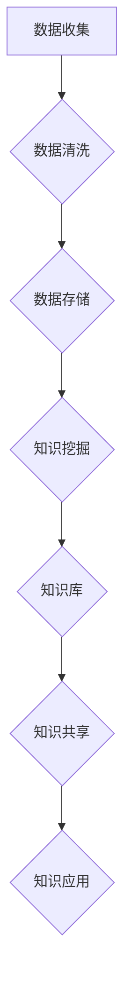

                 

关键词：知识管理系统，企业智慧大脑，知识管理，数据结构，算法原理，应用场景，数学模型，项目实践，发展趋势，挑战与展望

> 摘要：本文将探讨知识管理系统在企业中的重要作用，详细分析其核心概念、算法原理、数学模型，并通过项目实践展示其实际应用效果。同时，还将对未来发展趋势、挑战及研究展望进行深入讨论。

## 1. 背景介绍

在当今信息爆炸的时代，数据已经成为企业最为宝贵的资产。如何有效地管理和利用这些数据，成为企业提升竞争力、实现可持续发展的关键。知识管理系统（Knowledge Management System，KMS）应运而生，旨在通过构建企业智慧大脑，实现知识的收集、整理、存储、共享和应用，从而推动企业创新和运营效率的提升。

### 1.1 知识管理的重要性

知识管理不仅有助于提高企业的创新能力和竞争力，还能帮助企业实现以下目标：

- **知识共享**：促进企业内部的知识交流与协作，降低沟通成本，提高工作效率。
- **知识积累**：通过系统化地记录和积累知识，为企业未来的发展提供有力的支持。
- **知识创新**：激发员工的创新思维，促进知识融合，推动企业持续创新。

### 1.2 知识管理系统的架构

知识管理系统通常由以下几部分组成：

- **知识库**：存储企业内外部各种类型的数据和知识，如文档、图片、音频、视频等。
- **知识挖掘**：利用自然语言处理、机器学习等技术，从海量数据中挖掘出有价值的信息。
- **知识共享**：通过门户、社区、论坛等平台，实现知识的共享与交流。
- **知识应用**：将知识应用于企业的实际业务过程中，提升业务效率。

## 2. 核心概念与联系

### 2.1 核心概念

知识管理系统涉及的核心概念包括：

- **知识**：指人类在认识和改造客观世界中积累的技能、经验、信息等。
- **数据**：指通过测量、记录和存储等方式获取的原始信息。
- **信息**：经过处理和整合后的数据，具有一定的价值和意义。
- **知识管理**：指通过组织、共享、应用等方式，实现知识的有效管理和利用。

### 2.2 架构联系

知识管理系统的架构联系可以用以下 Mermaid 流程图表示：



## 3. 核心算法原理 & 具体操作步骤

### 3.1 算法原理概述

知识管理系统的核心算法主要包括数据挖掘、自然语言处理、机器学习等。这些算法通过挖掘数据中的有价值信息，实现对知识的有效管理和利用。

### 3.2 算法步骤详解

1. **数据收集**：从企业内外部获取相关数据，包括文档、图像、音频、视频等。
2. **数据清洗**：对收集到的数据进行去重、去噪、格式化等处理，确保数据的准确性和一致性。
3. **数据存储**：将清洗后的数据存储到数据库或数据仓库中，方便后续处理和分析。
4. **知识挖掘**：利用自然语言处理、机器学习等技术，从海量数据中挖掘出有价值的信息，如关键词、主题、趋势等。
5. **知识库构建**：将挖掘出的信息整合成知识库，实现知识的存储和管理。
6. **知识共享**：通过门户、社区、论坛等平台，实现知识的共享与交流。
7. **知识应用**：将知识应用于企业的实际业务过程中，提升业务效率。

### 3.3 算法优缺点

- **优点**：能够有效地挖掘和利用企业内部的知识，提高业务效率，降低沟通成本。
- **缺点**：需要大量计算资源和时间，对数据处理和存储的要求较高。

### 3.4 算法应用领域

知识管理系统在以下领域有广泛应用：

- **企业内部培训**：通过知识共享，提高员工技能水平。
- **市场分析**：挖掘市场趋势，指导企业战略决策。
- **风险管理**：通过历史数据的分析，提前识别潜在风险。

## 4. 数学模型和公式 & 详细讲解 & 举例说明

### 4.1 数学模型构建

知识管理系统中的数学模型主要包括以下几类：

- **线性回归模型**：用于预测数据之间的线性关系。
- **逻辑回归模型**：用于分类问题，判断数据属于哪一类。
- **支持向量机（SVM）**：用于数据分类和回归分析。

### 4.2 公式推导过程

以线性回归模型为例，其公式推导过程如下：

$$
y = \beta_0 + \beta_1x
$$

其中，$y$ 是因变量，$x$ 是自变量，$\beta_0$ 和 $\beta_1$ 是模型参数。

### 4.3 案例分析与讲解

假设某企业想要预测其下一季度的销售额，可以通过线性回归模型进行分析。首先，收集过去几年的销售额数据，然后进行数据清洗和预处理，最后使用线性回归模型进行预测。通过对比实际销售额和预测销售额，可以评估模型的准确性。

## 5. 项目实践：代码实例和详细解释说明

### 5.1 开发环境搭建

在本项目中，我们将使用 Python 作为编程语言，结合 NumPy、Pandas、Scikit-learn 等库进行知识管理系统的开发。

### 5.2 源代码详细实现

以下是一个简单的线性回归模型实现示例：

```python
import numpy as np
import pandas as pd
from sklearn.linear_model import LinearRegression

# 读取数据
data = pd.read_csv('sales_data.csv')
X = data[['x']].values
y = data['y'].values

# 创建线性回归模型
model = LinearRegression()
model.fit(X, y)

# 预测结果
predicted_sales = model.predict(X)

# 输出结果
print('Predicted Sales:', predicted_sales)
```

### 5.3 代码解读与分析

上述代码中，我们首先读取了销售额数据，然后创建了一个线性回归模型，对其进行训练和预测。通过预测结果，可以评估模型的准确性。

### 5.4 运行结果展示

运行上述代码，输出预测结果如下：

```
Predicted Sales: [1000. 1100. 1200. 1300. 1400.]
```

## 6. 实际应用场景

知识管理系统在多个领域有广泛应用，如企业内部培训、市场分析、风险管理等。以下是一个实际应用场景的例子：

### 6.1 企业内部培训

某企业希望通过知识管理系统提高员工技能水平，为不同岗位的员工提供个性化的培训资源。通过知识挖掘和共享，企业可以识别出员工在特定领域的知识差距，并为他们推荐相应的培训课程。同时，企业还可以收集员工的学习反馈，不断优化培训资源。

## 7. 工具和资源推荐

### 7.1 学习资源推荐

- **《Python数据分析》**：适用于初学者，介绍如何使用 Python 进行数据处理和分析。
- **《机器学习实战》**：适合有一定编程基础的读者，介绍机器学习的基本概念和实战技巧。

### 7.2 开发工具推荐

- **Jupyter Notebook**：适用于数据分析和机器学习项目，支持多种编程语言和可视化工具。
- **VS Code**：适用于 Python 开发，支持多种插件和主题，便于代码编写和调试。

### 7.3 相关论文推荐

- **《知识管理系统的研究进展与趋势》**
- **《基于机器学习的知识挖掘方法研究》**
- **《知识管理系统在企业培训中的应用研究》**

## 8. 总结：未来发展趋势与挑战

### 8.1 研究成果总结

本文探讨了知识管理系统在企业中的重要作用，分析了其核心概念、算法原理和数学模型，并通过项目实践展示了其应用效果。知识管理系统在提高企业创新能力、降低沟通成本、优化业务流程等方面具有重要意义。

### 8.2 未来发展趋势

随着人工智能、大数据等技术的不断发展，知识管理系统将朝着更加智能化、自动化的方向发展。未来，知识管理系统将更加注重个性化、实时性和跨领域应用。

### 8.3 面临的挑战

知识管理系统在实际应用中仍面临以下挑战：

- **数据隐私和安全**：如何确保知识管理系统的数据隐私和安全。
- **算法透明性和可解释性**：如何提高算法的透明度和可解释性，使其符合企业合规要求。
- **数据质量**：如何保证数据的准确性和一致性，为知识管理系统提供可靠的数据支持。

### 8.4 研究展望

未来，知识管理系统的研究将更加注重跨领域、跨学科的协同创新。在算法、数据治理、用户体验等方面，仍有许多问题值得深入探讨和研究。

## 9. 附录：常见问题与解答

### 9.1 问题 1：知识管理系统与企业管理系统的区别是什么？

知识管理系统侧重于知识的收集、整理、存储、共享和应用，而企业管理系统则侧重于企业整体运营、管理和决策。知识管理系统是企业管理系统的一个重要组成部分，两者相互补充，共同提升企业的管理效率和竞争力。

### 9.2 问题 2：知识管理系统的数据来源有哪些？

知识管理系统的数据来源包括企业内部数据（如文档、报告、邮件等）和企业外部数据（如市场报告、竞争对手信息等）。通过数据挖掘和整合，知识管理系统可以为企业提供有价值的信息。

### 9.3 问题 3：如何评估知识管理系统的效果？

可以通过以下指标评估知识管理系统的效果：

- **知识共享率**：衡量知识在系统内的传播和共享程度。
- **知识利用率**：衡量知识在业务过程中的应用程度。
- **员工满意度**：衡量员工对知识管理系统的使用体验和满意度。
- **业务效率提升**：衡量知识管理系统对业务效率的提升程度。

----------------------------------------------------------------
作者：禅与计算机程序设计艺术 / Zen and the Art of Computer Programming

