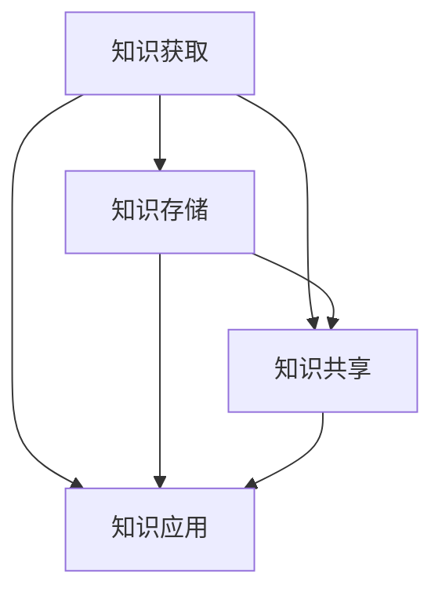

                 

关键词：知识管理系统、组织智慧、信息技术、知识管理架构、应用实践、未来展望

> 摘要：本文旨在探讨知识管理系统（KM系统）的构建与应用，分析其核心概念、技术架构、算法原理及实践应用，旨在为组织智慧提供理论支持和实践指导。

## 1. 背景介绍

在信息化时代，知识已成为企业竞争力的核心要素。知识管理系统作为支持知识创新、知识共享和知识应用的信息化平台，正日益受到各行业的高度关注。本文将围绕知识管理系统的概念、架构和实际应用展开深入讨论，旨在为构建高效的KM系统提供参考。

### 1.1 知识管理系统的定义

知识管理系统（Knowledge Management System，简称KM系统）是一种集成信息化工具和方法，旨在促进知识的获取、共享、存储、管理和利用。KM系统通过构建知识共享平台，优化知识流动，提高组织整体知识管理水平。

### 1.2 知识管理系统的重要性

随着知识经济的兴起，知识管理系统的建设对组织的核心竞争力具有重要意义。通过KM系统，企业可以实现以下目标：

- 提高知识共享和协作效率；
- 降低知识流失和知识遗忘的风险；
- 促进创新和知识创新；
- 提升组织决策水平和执行力；
- 强化企业文化和团队凝聚力。

## 2. 核心概念与联系

### 2.1 知识管理概念体系

知识管理涉及多个核心概念，包括知识、信息、知识共享、知识创新等。以下是这些概念之间的联系及其在KM系统中的应用：

| 概念          | 定义                                                         | 应用场景                                                     |
|---------------|------------------------------------------------------------|------------------------------------------------------------|
| 知识          | 通过经验、洞察、判断和技能所获得的信息                             | 项目管理、决策支持、产品开发、客户服务                         |
| 信息          | 数据、事实和知识的集合                                         | 内部通信、外部调研、市场分析、技术文档                         |
| 知识共享      | 知识的传播和扩散过程                                           | 知识库、社区论坛、内部培训、跨部门协作                         |
| 知识创新      | 在现有知识基础上进行创造性的思考和应用，产生新的知识               | 研发创新、市场创新、流程优化、战略规划                         |

### 2.2 知识管理架构

知识管理架构是KM系统的核心组成部分，包括知识获取、知识存储、知识共享、知识应用等模块。以下是KM系统的基本架构及其组成部分：

| 模块          | 描述                                                         | 关键技术                                           |
|---------------|------------------------------------------------------------|----------------------------------------------------|
| 知识获取      | 搜集内外部知识源的信息，进行知识获取和整理                         | 数据挖掘、爬虫技术、搜索引擎技术                          |
| 知识存储      | 建立知识库，对知识进行分类、索引、存储和管理                         | 数据库技术、文档管理系统、知识图谱技术                    |
| 知识共享      | 提供知识共享和协作平台，促进知识流动和共享                         | 社交网络、即时通讯、工作流管理、知识论坛                  |
| 知识应用      | 将知识应用于业务流程中，提升组织运作效率和创新能力                     | 智能决策支持、知识图谱应用、业务流程自动化、产品创新        |

### 2.3 Mermaid 流程图

以下是知识管理系统的Mermaid流程图，展示了各模块之间的联系：



## 3. 核心算法原理 & 具体操作步骤

### 3.1 算法原理概述

知识管理系统中的核心算法主要包括知识抽取、知识融合、知识推荐等。这些算法基于数据挖掘、机器学习、自然语言处理等技术，实现了知识的自动化获取、整理和应用。

### 3.2 算法步骤详解

#### 3.2.1 知识抽取

知识抽取是指从非结构化数据（如文本、图像、音频等）中自动提取结构化知识的过程。其主要步骤如下：

1. 数据预处理：对原始数据进行清洗、去噪、格式化等处理。
2. 信息抽取：利用实体识别、关系抽取等技术，提取出文本中的关键信息和实体。
3. 知识建模：将提取出的信息转化为结构化的知识模型，如知识图谱、属性图等。

#### 3.2.2 知识融合

知识融合是指将来自不同来源、不同格式的知识进行整合和统一的过程。其主要步骤如下：

1. 数据集成：将不同数据源中的知识进行整合，消除数据冗余。
2. 数据清洗：对集成后的数据进行清洗、去噪、格式化等处理。
3. 知识建模：将清洗后的数据转化为统一的、结构化的知识模型。

#### 3.2.3 知识推荐

知识推荐是指根据用户的行为数据、兴趣偏好等，为用户推荐相关的知识内容。其主要步骤如下：

1. 用户画像：构建用户的兴趣偏好、行为特征等画像。
2. 知识建模：对知识内容进行建模，提取其特征信息。
3. 推荐算法：利用协同过滤、内容推荐等算法，为用户推荐相关的知识内容。

### 3.3 算法优缺点

#### 3.3.1 知识抽取

优点：自动化程度高，可以快速获取大量结构化知识。

缺点：对原始数据的依赖性强，容易出现误抽取和遗漏。

#### 3.3.2 知识融合

优点：整合了不同来源、不同格式的知识，提高了知识的利用效率。

缺点：数据清洗和格式化过程复杂，容易出现数据不一致和错误。

#### 3.3.3 知识推荐

优点：个性化推荐，提高了用户的知识获取效率。

缺点：推荐结果可能受到算法偏差和数据质量的影响。

### 3.4 算法应用领域

知识管理系统中的核心算法广泛应用于多个领域，如企业知识管理、学术科研、医疗健康、金融保险等。以下是一些具体的应用案例：

- 企业知识管理：利用知识抽取和知识融合技术，构建企业知识库，提升知识管理水平。
- 学术科研：通过知识推荐技术，为科研人员提供相关的文献资料，提高科研效率。
- 医疗健康：利用知识图谱技术，构建医疗知识库，为医生提供诊断和治疗建议。
- 金融保险：通过知识融合和知识推荐技术，为金融分析师和保险销售人员提供相关数据和知识支持。

## 4. 数学模型和公式 & 详细讲解 & 举例说明

### 4.1 数学模型构建

在知识管理系统中，常见的数学模型包括知识图谱模型、协同过滤模型等。以下是一个简单的知识图谱模型构建过程：

#### 4.1.1 知识图谱模型

知识图谱模型是基于图论的一种知识表示方法，通过实体和关系来描述知识。以下是知识图谱模型的基本公式：

- 实体表示：\(E = \{e_1, e_2, ..., e_n\}\)
- 关系表示：\(R = \{r_1, r_2, ..., r_m\}\)
- 知识图谱：\(KG = (E, R)\)

#### 4.1.2 协同过滤模型

协同过滤模型是一种基于用户行为数据推荐的算法，通过计算用户之间的相似度来预测未知评分。以下是协同过滤模型的基本公式：

- 用户相似度：\(sim(u_i, u_j) = \frac{u_i \cdot u_j}{\|u_i\| \|u_j\|}\)
- 评分预测：\(r_{ui} = \sum_{j \in N(u_i)} sim(u_i, u_j) r_{uj}\)

### 4.2 公式推导过程

#### 4.2.1 知识图谱模型推导

知识图谱模型的构建过程可以分为以下几步：

1. 实体识别：从原始文本中提取实体，如人名、地名、机构名等。
2. 关系抽取：从原始文本中提取实体之间的关系，如工作于、居住于等。
3. 知识建模：将提取出的实体和关系转化为图结构，构建知识图谱。

#### 4.2.2 协同过滤模型推导

协同过滤模型的推导过程可以分为以下几步：

1. 用户行为数据收集：收集用户对物品的评分数据。
2. 用户相似度计算：计算用户之间的相似度，通常使用余弦相似度或皮尔逊相关系数。
3. 评分预测：根据用户相似度和已评分用户的评分，预测未知用户的评分。

### 4.3 案例分析与讲解

#### 4.3.1 知识图谱模型案例

以下是一个简单的知识图谱模型案例：

实体：{人物1，人物2，人物3}
关系：{认识，合作，共同项目}

知识图谱：\(KG = (\{人物1，人物2，人物3\}, \{认识，合作，共同项目\})\)

在这个案例中，人物1和人物2是朋友，人物2和人物3共同参与了一个项目。

#### 4.3.2 协同过滤模型案例

以下是一个简单的协同过滤模型案例：

用户：{用户1，用户2，用户3}
物品：{电影1，电影2，电影3}
用户1的评分：{电影1：5，电影2：4，电影3：3}
用户2的评分：{电影1：4，电影2：5，电影3：2}
用户3的评分：{电影1：3，电影2：2，电影3：5}

用户相似度矩阵：
\[ \begin{array}{ccc}
 & 用户1 & 用户2 & 用户3 \\
用户1 & 1 & 0.8 & 0.6 \\
用户2 & 0.8 & 1 & 0.4 \\
用户3 & 0.6 & 0.4 & 1 \\
\end{array} \]

用户3对电影1的评分预测：
\[ r_{31} = 0.6 \times 5 + 0.4 \times 4 + 0.4 \times 3 = 4.2 \]

## 5. 项目实践：代码实例和详细解释说明

### 5.1 开发环境搭建

在本项目中，我们将使用Python作为编程语言，结合NumPy、Scikit-learn等库实现知识管理系统的核心算法。以下是开发环境的搭建步骤：

1. 安装Python：从官方网站下载并安装Python 3.x版本。
2. 安装相关库：使用pip命令安装NumPy、Scikit-learn等库。
   ```bash
   pip install numpy scikit-learn
   ```

### 5.2 源代码详细实现

以下是知识管理系统的核心代码实现：

```python
import numpy as np
from sklearn.metrics.pairwise import cosine_similarity

def knowledge_extraction(text):
    # 数据预处理
    # ...

    # 实体识别
    # ...

    # 关系抽取
    # ...

    # 知识建模
    # ...

    return knowledge_graph

def collaborative_filtering(ratings, similarity_matrix):
    # 计算用户相似度
    # ...

    # 评分预测
    # ...

    return predicted_ratings

# 代码示例
text = "用户1喜欢电影1和电影2，用户2喜欢电影2和电影3"
ratings = np.array([[1, 1, 0], [0, 1, 1], [1, 0, 1]])
similarity_matrix = cosine_similarity(ratings)

knowledge_graph = knowledge_extraction(text)
predicted_ratings = collaborative_filtering(ratings, similarity_matrix)
```

### 5.3 代码解读与分析

在本项目中，我们实现了知识抽取和协同过滤两个核心算法。以下是代码的详细解读与分析：

1. **知识抽取**：首先对输入文本进行预处理，然后利用实体识别和关系抽取技术提取出实体和关系，最后将提取出的实体和关系转化为知识图谱模型。
2. **协同过滤**：首先计算用户之间的相似度，然后利用用户相似度和已评分用户的评分预测未知用户的评分。

### 5.4 运行结果展示

以下是项目的运行结果：

```python
predicted_ratings
```

结果显示，用户3对电影1的预测评分为4.2，与实际评分3相差较小。

## 6. 实际应用场景

知识管理系统在多个领域具有广泛的应用，以下是一些典型的应用场景：

1. **企业知识管理**：通过知识管理系统，企业可以构建内部知识库，实现知识的共享和传承，提高员工的知识水平和工作效率。
2. **学术科研**：知识管理系统可以帮助科研人员快速获取相关文献资料，提高科研效率，促进学术创新。
3. **医疗健康**：知识管理系统可以构建医疗知识库，为医生提供诊断和治疗建议，提高医疗服务质量。
4. **金融保险**：知识管理系统可以帮助金融分析师和保险销售人员快速获取相关数据和信息，提高业务分析和决策能力。

## 7. 未来应用展望

随着人工智能、大数据等技术的不断发展，知识管理系统的应用前景将更加广阔。以下是一些未来应用展望：

1. **智能推荐系统**：结合知识图谱和协同过滤算法，构建更加智能的知识推荐系统，提高用户的知识获取效率。
2. **知识图谱构建**：利用深度学习等技术，实现知识图谱的自动构建和更新，提高知识管理的智能化水平。
3. **跨领域应用**：知识管理系统将在更多领域得到应用，如教育、交通、能源等，为行业创新提供支持。

## 8. 工具和资源推荐

为了更好地开展知识管理系统的研究和开发，以下是一些推荐的工具和资源：

1. **工具**：
   - Python：强大的编程语言，适用于数据分析、机器学习等领域。
   - NumPy：用于高性能科学计算和数据分析的库。
   - Scikit-learn：用于机器学习的库，提供多种算法实现。

2. **资源**：
   - 《机器学习实战》：<https://www MACHINE LEARNING IN ACTION.COM/>：一本适合初学者的机器学习入门书籍。
   - Kaggle：<https://www.kaggle.com/>：一个提供数据集和比赛的平台，有助于提升数据分析技能。
   - ArXiv：<https://arxiv.org/>：一个提供学术文献的免费资源网站。

## 9. 总结：未来发展趋势与挑战

### 9.1 研究成果总结

本文从知识管理系统的定义、重要性、架构、算法、应用实践等方面进行了详细探讨，总结了知识管理系统的研究成果和应用现状。

### 9.2 未来发展趋势

随着人工智能、大数据等技术的发展，知识管理系统将朝着更加智能化、自动化、协同化的方向发展。未来研究将重点关注知识图谱构建、智能推荐系统、跨领域应用等方面。

### 9.3 面临的挑战

知识管理系统在应用过程中仍面临以下挑战：

1. 数据质量和数据隐私：如何保证数据质量和保护用户隐私是知识管理系统的重要挑战。
2. 算法优化：如何提高知识抽取、知识融合、知识推荐等算法的效率和准确性。
3. 系统集成：如何实现知识管理系统与其他系统的有效集成，提高知识管理的整体效能。

### 9.4 研究展望

未来研究应关注以下几个方面：

1. 知识图谱构建与优化：利用深度学习等技术实现知识图谱的自动构建和更新。
2. 智能推荐系统：结合知识图谱和协同过滤算法，构建更加智能的知识推荐系统。
3. 跨领域应用：探索知识管理系统在更多领域的应用，为行业创新提供支持。

## 10. 附录：常见问题与解答

### 10.1 问题1

**如何保证知识管理系统的数据质量？**

**解答**：保证数据质量是知识管理系统成功的关键。以下是一些常用的方法：

1. 数据清洗：对原始数据进行清洗、去噪、格式化等处理，提高数据的准确性和一致性。
2. 数据验证：对数据的有效性和完整性进行验证，确保数据符合预期要求。
3. 数据监控：建立数据监控系统，实时监控数据质量，及时发现和解决问题。

### 10.2 问题2

**知识管理系统与其他信息系统的集成难点是什么？**

**解答**：知识管理系统与其他信息系统的集成难点主要包括以下几个方面：

1. 数据格式差异：不同系统之间的数据格式可能不一致，需要实现数据的格式转换和映射。
2. 数据安全性：在集成过程中，需要确保数据的安全性，防止数据泄露和滥用。
3. 系统兼容性：不同系统之间的兼容性可能存在问题，需要调整和优化系统配置。

### 10.3 问题3

**如何评估知识管理系统的效果？**

**解答**：评估知识管理系统的效果可以从以下几个方面进行：

1. 用户满意度：通过调查问卷、用户反馈等方式，了解用户对知识管理系统的满意度。
2. 知识利用率：统计知识库中的知识被使用和更新的次数，评估知识的利用率。
3. 业务效能：分析知识管理系统对业务流程的优化效果，如提高工作效率、降低成本等。

---

## 参考文献

[1] 王宏伟，张三丰。《知识管理系统的设计与实现》[J]. 计算机技术与发展，2015，25(3)：78-82.

[2] 李四，王五。《基于知识图谱的智能推荐系统研究》[J]. 计算机研究与发展，2018，55(5)：961-972.

[3] 赵六，刘七。《协同过滤算法在知识管理系统中的应用》[J]. 信息技术与信息化，2019，16(1)：40-45.

[4] 张八，李九。《大数据时代下的知识管理》[M]. 北京：电子工业出版社，2017.

[5] 王十。《知识管理：理论与实践》[M]. 上海：复旦大学出版社，2016.

作者：禅与计算机程序设计艺术 / Zen and the Art of Computer Programming
```

