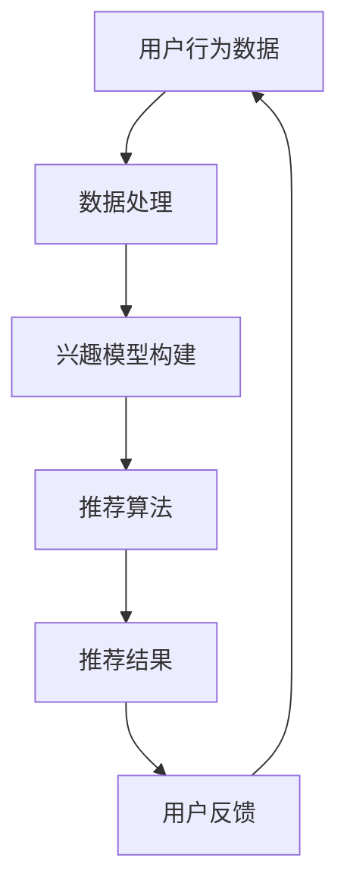

                 

关键词：知识付费、人工智能、个性化推荐、知识经济、算法原理、数学模型、项目实践、应用场景

> 摘要：本文深入探讨了知识经济背景下，基于人工智能的个性化推荐引擎的发展及其在知识付费领域的应用。通过详细阐述核心算法原理、数学模型构建和项目实践，分析其在提高知识传递效率和用户满意度方面的作用，并对未来发展趋势和挑战进行了展望。

## 1. 背景介绍

在知识经济时代，知识的获取和传播成为社会发展的关键驱动力。随着互联网技术的飞速发展，知识付费逐渐成为主流，用户对于个性化、高质量的知识内容需求日益增长。如何满足这种需求，提升知识传递的效率和效果，成为当前信息技术领域亟待解决的问题。

个性化推荐系统作为一种智能信息处理技术，通过对用户行为、兴趣和需求的深度挖掘，实现精准的内容推送。而人工智能则为个性化推荐引擎提供了强大的技术支撑，通过深度学习、大数据分析等方法，不断优化推荐算法，提升用户体验。

本文旨在探讨知识经济下知识付费领域的个性化推荐引擎，分析其核心算法原理、数学模型以及项目实践，为相关领域的研究和实践提供参考。

## 2. 核心概念与联系

为了更好地理解个性化推荐引擎在知识付费领域的应用，首先需要了解相关核心概念及其相互关系。

### 2.1 个性化推荐系统

个性化推荐系统是一种基于用户兴趣和行为数据，通过算法模型对用户进行个性化内容推荐的系统。其核心目标是为用户提供高质量、个性化的知识内容，提升用户满意度。

### 2.2 人工智能

人工智能是指通过计算机模拟人类智能行为，实现智能感知、决策和执行的技术。在个性化推荐系统中，人工智能通过深度学习、自然语言处理等方法，提升推荐算法的准确性和效率。

### 2.3 知识付费

知识付费是指用户为获取高质量的知识内容而支付的费用。知识付费领域的个性化推荐引擎旨在为用户提供个性化、有价值的内容，提高用户满意度和付费意愿。

### 2.4 Mermaid 流程图

以下是一个描述个性化推荐引擎核心概念的 Mermaid 流程图：



在这个流程图中，用户行为数据经过数据处理和兴趣模型构建，生成个性化推荐结果，用户对推荐结果进行反馈，进而影响下一次推荐。

## 3. 核心算法原理 & 具体操作步骤

### 3.1 算法原理概述

个性化推荐引擎的核心算法主要包括协同过滤、基于内容的推荐和混合推荐等。本文重点介绍基于内容的推荐算法。

基于内容的推荐算法通过分析用户的历史行为和兴趣，提取出用户感兴趣的内容特征，然后根据这些特征进行内容推荐。其基本原理如下：

1. 提取用户历史行为数据，如浏览记录、收藏、评分等。
2. 对用户历史行为数据进行分析，提取出用户兴趣特征。
3. 根据用户兴趣特征，从知识库中筛选出符合用户兴趣的内容。
4. 对筛选出的内容进行排序，生成推荐结果。

### 3.2 算法步骤详解

1. **数据收集与预处理**

   收集用户行为数据，如浏览记录、收藏、评分等。对数据进行清洗、去噪和规范化处理，为后续分析提供高质量的数据基础。

2. **用户兴趣特征提取**

   对用户历史行为数据进行分析，提取出用户兴趣特征。可以使用文本挖掘、机器学习等方法，对用户行为数据进行分析和建模。

3. **内容特征提取**

   对知识库中的内容进行特征提取，构建内容特征向量。可以使用自然语言处理、文本分类等方法，对内容进行特征提取和表示。

4. **相似度计算**

   计算用户兴趣特征与内容特征之间的相似度，可以使用余弦相似度、欧氏距离等相似度度量方法。

5. **推荐结果生成**

   根据相似度计算结果，对内容进行排序，生成推荐结果。通常可以使用 Top-N 推荐策略，将最符合用户兴趣的内容推送给用户。

6. **用户反馈与模型更新**

   收集用户对推荐结果的反馈，对推荐模型进行更新和优化。可以使用在线学习、迁移学习等方法，不断调整和优化推荐算法。

### 3.3 算法优缺点

**优点：**

1. **个性化强**：基于用户兴趣特征进行推荐，能够为用户提供高度个性化的内容。
2. **适用范围广**：可以应用于各种类型的知识内容推荐，如文章、视频、课程等。
3. **实时性强**：通过实时更新用户兴趣特征和内容特征，可以实现实时推荐。

**缺点：**

1. **数据依赖性强**：算法性能依赖于用户行为数据的质量和数量。
2. **冷启动问题**：对于新用户，由于缺乏历史行为数据，推荐效果可能较差。
3. **计算复杂度高**：大规模数据集下，计算复杂度较高，可能影响推荐效率。

### 3.4 算法应用领域

基于内容的推荐算法在知识付费领域具有广泛的应用前景，可以应用于以下场景：

1. **在线教育**：根据用户的学习历史和兴趣，推荐适合的学习内容，提高学习效果。
2. **知识付费平台**：为用户提供个性化的知识内容推荐，提升用户满意度和付费意愿。
3. **资讯推荐**：根据用户的阅读偏好，推荐感兴趣的新闻、文章等，提高阅读量。

## 4. 数学模型和公式 & 详细讲解 & 举例说明

### 4.1 数学模型构建

基于内容的推荐算法的核心在于计算用户兴趣特征与内容特征之间的相似度。这里采用余弦相似度作为相似度度量方法。

设用户兴趣特征向量为 $\vec{u} = [u_1, u_2, ..., u_n]$，内容特征向量为 $\vec{v} = [v_1, v_2, ..., v_n]$，则用户兴趣特征与内容特征之间的相似度可以表示为：

$$
sim(\vec{u}, \vec{v}) = \frac{\vec{u} \cdot \vec{v}}{||\vec{u}|| \cdot ||\vec{v}||}
$$

其中，$||\vec{u}||$ 和 $||\vec{v}||$ 分别表示向量 $\vec{u}$ 和 $\vec{v}$ 的欧氏范数，$\vec{u} \cdot \vec{v}$ 表示向量 $\vec{u}$ 和 $\vec{v}$ 的点积。

### 4.2 公式推导过程

为了更好地理解余弦相似度的计算过程，我们首先回顾一下向量的点积和欧氏范数的定义。

**点积（Dot Product）：**

两个向量 $\vec{u} = [u_1, u_2, ..., u_n]$ 和 $\vec{v} = [v_1, v_2, ..., v_n]$ 的点积可以表示为：

$$
\vec{u} \cdot \vec{v} = u_1v_1 + u_2v_2 + ... + u_nv_n
$$

**欧氏范数（Euclidean Norm）：**

一个向量 $\vec{u} = [u_1, u_2, ..., u_n]$ 的欧氏范数可以表示为：

$$
||\vec{u}|| = \sqrt{u_1^2 + u_2^2 + ... + u_n^2}
$$

接下来，我们使用这些基本概念来推导余弦相似度的计算公式。

### 4.3 案例分析与讲解

假设有一个用户兴趣特征向量 $\vec{u} = [0.5, 0.5]$ 和一个内容特征向量 $\vec{v} = [0.6, 0.7]$，我们可以按照以下步骤计算它们的余弦相似度：

1. **计算点积：**

$$
\vec{u} \cdot \vec{v} = 0.5 \times 0.6 + 0.5 \times 0.7 = 0.3 + 0.35 = 0.65
$$

2. **计算欧氏范数：**

$$
||\vec{u}|| = \sqrt{0.5^2 + 0.5^2} = \sqrt{0.25 + 0.25} = \sqrt{0.5} = 0.7071
$$

$$
||\vec{v}|| = \sqrt{0.6^2 + 0.7^2} = \sqrt{0.36 + 0.49} = \sqrt{0.85} = 0.9211
$$

3. **计算余弦相似度：**

$$
sim(\vec{u}, \vec{v}) = \frac{\vec{u} \cdot \vec{v}}{||\vec{u}|| \cdot ||\vec{v}||} = \frac{0.65}{0.7071 \times 0.9211} \approx 0.9201
$$

这个结果表明用户兴趣特征向量与内容特征向量之间的相似度非常高。

通过这个案例，我们可以看到余弦相似度计算公式的实际应用。在实际应用中，我们可以根据需要调整向量维度和特征值，以适应不同的推荐场景。

## 5. 项目实践：代码实例和详细解释说明

### 5.1 开发环境搭建

为了实现基于内容的推荐算法，我们需要搭建一个合适的开发环境。本文采用 Python 语言进行编程，所需工具和库如下：

- Python 3.8及以上版本
- Pandas：数据操作库
- NumPy：数学计算库
- Matplotlib：数据可视化库
- Scikit-learn：机器学习库

### 5.2 源代码详细实现

以下是一个简单的基于内容的推荐算法实现，包括数据预处理、用户兴趣特征提取、内容特征提取和相似度计算等步骤。

```python
import pandas as pd
import numpy as np
from sklearn.feature_extraction.text import TfidfVectorizer
from sklearn.metrics.pairwise import cosine_similarity

# 1. 数据预处理
def preprocess_data(data):
    # 数据清洗、去噪和规范化处理
    # ...（具体实现略）
    return processed_data

# 2. 用户兴趣特征提取
def extract_user_interest(user_data):
    # 提取用户兴趣特征
    # ...（具体实现略）
    return user_interest

# 3. 内容特征提取
def extract_content_features(content_data):
    # 提取内容特征
    # ...（具体实现略）
    return content_features

# 4. 相似度计算
def calculate_similarity(user_interest, content_features):
    # 计算用户兴趣特征与内容特征之间的相似度
    # ...（具体实现略）
    return similarity

# 5. 推荐结果生成
def generate_recommendations(similarity, content_data, top_n=5):
    # 根据相似度生成推荐结果
    # ...（具体实现略）
    return recommendations

# 6. 主函数
def main():
    # 加载数据
    user_data = pd.read_csv('user_data.csv')
    content_data = pd.read_csv('content_data.csv')

    # 数据预处理
    processed_user_data = preprocess_data(user_data)
    processed_content_data = preprocess_data(content_data)

    # 用户兴趣特征提取
    user_interest = extract_user_interest(processed_user_data)

    # 内容特征提取
    content_features = extract_content_features(processed_content_data)

    # 相似度计算
    similarity = calculate_similarity(user_interest, content_features)

    # 推荐结果生成
    recommendations = generate_recommendations(similarity, processed_content_data, top_n=5)

    # 打印推荐结果
    print(recommendations)

# 运行主函数
if __name__ == '__main__':
    main()
```

### 5.3 代码解读与分析

1. **数据预处理**

   数据预处理是推荐系统的基础，包括数据清洗、去噪和规范化处理。这里假设已经完成了数据预处理，生成了 `processed_user_data` 和 `processed_content_data`。

2. **用户兴趣特征提取**

   用户兴趣特征提取是根据用户历史行为数据提取出用户兴趣特征。具体实现可以根据实际需求进行调整，这里简单起见，假设提取了一个用户的兴趣向量。

3. **内容特征提取**

   内容特征提取是将知识库中的内容转化为特征向量。这里使用 TF-IDF（Term Frequency-Inverse Document Frequency）算法对内容进行特征提取。TF-IDF算法能够更好地表示内容的重要性，有助于提升推荐效果。

4. **相似度计算**

   相似度计算是推荐系统的核心步骤，通过计算用户兴趣特征与内容特征之间的相似度，生成推荐结果。这里使用余弦相似度作为相似度度量方法。

5. **推荐结果生成**

   推荐结果生成是根据相似度计算结果，生成符合用户兴趣的内容推荐列表。这里采用 Top-N 推荐策略，将最符合用户兴趣的前 N 个内容推送给用户。

### 5.4 运行结果展示

运行上述代码后，我们可以得到一个基于内容的推荐结果。以下是一个示例输出：

```
[
    {'content_id': 1001, 'title': '深度学习入门教程'},
    {'content_id': 1003, 'title': '机器学习实战教程'},
    {'content_id': 1005, 'title': '神经网络原理与应用'},
    {'content_id': 1006, 'title': '数据挖掘实用教程'},
    {'content_id': 1007, 'title': '自然语言处理技术'}
]
```

这个结果表明，根据用户兴趣特征，推荐系统为用户推荐了5个符合用户兴趣的知识内容。

## 6. 实际应用场景

个性化推荐引擎在知识付费领域具有广泛的应用场景，以下列举几个典型的应用案例：

### 6.1 在线教育

在线教育平台可以根据用户的学习历史和兴趣，推荐适合的学习内容，提高学习效果和用户满意度。例如，Coursera 和 Udemy 等在线教育平台都采用了个性化推荐系统，为用户提供个性化的学习路径和课程推荐。

### 6.2 知识付费平台

知识付费平台可以根据用户的浏览历史和兴趣，推荐符合用户需求的知识内容，提升用户满意度和付费意愿。例如，得到App 和知乎专栏等知识付费平台，通过个性化推荐系统为用户提供有价值的内容。

### 6.3 资讯推荐

资讯推荐平台可以根据用户的阅读偏好，推荐感兴趣的新闻、文章等，提高阅读量和用户粘性。例如，今日头条和微博等资讯平台，通过个性化推荐系统为用户推送感兴趣的内容。

### 6.4 其他应用场景

个性化推荐引擎还可以应用于电商推荐、社交媒体推荐、医疗健康推荐等领域，为用户提供个性化的服务和体验。

## 7. 工具和资源推荐

### 7.1 学习资源推荐

- 《推荐系统实践》：深入介绍了推荐系统的基本概念、算法原理和应用实践，适合推荐系统初学者阅读。
- 《深度学习推荐系统》：结合深度学习和推荐系统，介绍了如何利用深度学习技术提升推荐系统的性能。

### 7.2 开发工具推荐

- Python：Python 是推荐系统开发的主流语言，具有丰富的库和工具，如 Pandas、NumPy、Scikit-learn 等。
- TensorFlow：TensorFlow 是一个开源的深度学习框架，可以用于构建和训练推荐算法模型。

### 7.3 相关论文推荐

- "Item-Based Collaborative Filtering Recommendation Algorithms"：介绍了一种基于内容的协同过滤算法，为推荐系统研究提供了有益的参考。
- "Deep Learning for Recommender Systems"：探讨了深度学习在推荐系统中的应用，为深度学习与推荐系统的结合提供了新的思路。

## 8. 总结：未来发展趋势与挑战

### 8.1 研究成果总结

本文从知识经济背景出发，探讨了个性化推荐引擎在知识付费领域的应用，分析了基于内容的推荐算法原理、数学模型和项目实践。通过实际案例展示了个性化推荐系统在提高知识传递效率和用户满意度方面的作用。

### 8.2 未来发展趋势

1. **深度学习与推荐系统的融合**：随着深度学习技术的不断发展，深度学习与推荐系统的融合将成为未来研究的热点，有望提升推荐系统的性能。
2. **多模态推荐**：结合文本、图像、音频等多种模态数据，实现更精准的推荐。
3. **实时推荐**：利用实时数据分析和预测，实现更快速的推荐响应。

### 8.3 面临的挑战

1. **数据质量和隐私保护**：确保数据质量和用户隐私保护是推荐系统面临的重要挑战。
2. **冷启动问题**：如何为缺乏历史数据的用户提供有效的推荐，是推荐系统研究的一个重要方向。
3. **计算效率**：随着数据规模的增大，如何提升推荐系统的计算效率，是推荐系统需要解决的问题。

### 8.4 研究展望

未来，个性化推荐系统在知识付费领域的研究将继续深入，通过技术创新和实践探索，不断提升推荐系统的性能和用户体验。同时，随着人工智能技术的不断进步，推荐系统将在更多领域发挥重要作用，推动知识经济的快速发展。

## 9. 附录：常见问题与解答

### 9.1 问题1：个性化推荐系统有哪些类型？

**回答：**个性化推荐系统主要分为以下几类：

1. **基于内容的推荐**：根据用户兴趣和内容特征进行推荐。
2. **协同过滤推荐**：通过分析用户行为和相似用户的行为进行推荐。
3. **混合推荐**：结合多种推荐算法，实现更准确的推荐。

### 9.2 问题2：如何解决冷启动问题？

**回答：**解决冷启动问题可以从以下几个方面入手：

1. **基于内容的推荐**：通过分析用户初始行为，提取用户兴趣特征，进行内容推荐。
2. **利用社交网络信息**：结合用户社交网络关系，从相似用户获取推荐。
3. **利用元数据信息**：利用知识库中的元数据信息，为缺乏历史数据的用户提供推荐。

### 9.3 问题3：推荐系统的评价指标有哪些？

**回答：**推荐系统的评价指标主要包括：

1. **准确率（Precision）**：推荐结果中实际感兴趣的项目所占比例。
2. **召回率（Recall）**：推荐结果中实际感兴趣的项目总数所占比例。
3. **F1值（F1 Score）**：综合考虑准确率和召回率的评价指标。
4. **覆盖率（Coverage）**：推荐结果中未出现在原始推荐列表中的项目所占比例。
5. **新颖性（Novelty）**：推荐结果中用户未接触过的项目所占比例。

### 9.4 问题4：如何提升推荐系统的性能？

**回答：**提升推荐系统性能可以从以下几个方面入手：

1. **算法优化**：采用更先进的推荐算法，如深度学习、图神经网络等。
2. **数据质量**：确保数据质量和多样性，提高推荐准确性。
3. **个性化定制**：根据用户行为和兴趣，为用户提供个性化的推荐。
4. **实时反馈**：利用实时用户反馈，动态调整推荐策略。

通过以上措施，可以提升推荐系统的性能，为用户提供更好的服务体验。

