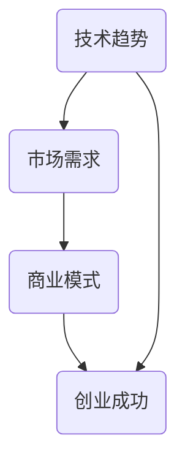

                 

关键词：知识经济、程序员创业、机遇、技术趋势、创业策略

> 摘要：在知识经济时代，程序员的创业之路充满了机遇与挑战。本文将探讨程序员如何把握时代脉搏，运用自身技术优势，结合市场需求，开创出一条成功创业之路。

## 1. 背景介绍

随着全球经济的不断发展，知识经济已经成为主导经济发展的主要力量。知识经济的核心是信息和知识，它通过数字化、网络化和智能化技术，推动经济活动的不断升级和转型。在这种背景下，程序员的地位日益凸显，他们不仅是技术开发的推动者，更是知识经济的创造者和传播者。

程序员创业，一方面是个人价值的实现，另一方面也是推动技术进步和经济发展的重要途径。然而，创业之路并非一帆风顺，程序员需要面对市场的不确定性、技术的不确定性和管理的不确定性等多重挑战。因此，如何把握机遇，规避风险，成为每一个有创业梦想的程序员需要思考的问题。

## 2. 核心概念与联系

在探讨程序员创业之前，我们需要了解几个核心概念，包括技术趋势、市场需求和商业模式。

### 2.1 技术趋势

技术趋势是程序员创业的重要参考因素。随着云计算、大数据、人工智能、物联网等新兴技术的快速发展，程序员需要紧跟技术趋势，掌握前沿技术，以适应市场需求。

- **云计算**：提供弹性、可扩展的计算资源，降低了创业者的基础设施投入成本。
- **大数据**：通过海量数据分析和挖掘，帮助创业者发现市场机会，优化业务流程。
- **人工智能**：利用机器学习和深度学习技术，提升产品智能性和用户体验。
- **物联网**：连接物理世界和数字世界，为创业者提供了丰富的应用场景。

### 2.2 市场需求

市场需求是程序员创业的驱动力。了解用户需求，才能开发出用户愿意付费的产品。程序员需要具备市场洞察力，通过用户调研、市场分析等手段，把握市场需求。

- **用户痛点**：挖掘用户的痛点，提供针对性的解决方案。
- **用户偏好**：了解用户的使用习惯和偏好，优化产品设计。
- **市场规模**：评估市场潜力，确定创业方向。

### 2.3 商业模式

商业模式是程序员创业的核心。一个成功的商业模式能够帮助创业者实现盈利，保持企业的可持续发展。

- **产品模式**：以产品为核心，通过销售产品实现盈利。
- **服务模式**：提供咨询服务、培训服务、技术服务等，通过服务收费实现盈利。
- **平台模式**：搭建一个平台，连接供需双方，通过交易抽成或广告等方式实现盈利。

### 2.4 Mermaid 流程图



## 3. 核心算法原理 & 具体操作步骤

### 3.1 算法原理概述

程序员创业的核心在于将技术优势转化为商业价值。这一过程中，涉及到多个核心算法原理，包括技术创新、市场分析和商业模式设计。

- **技术创新**：通过技术研究和开发，实现技术的创新和应用。
- **市场分析**：通过数据分析和用户调研，了解市场需求和竞争态势。
- **商业模式设计**：根据市场需求和技术优势，设计出可行的商业模式。

### 3.2 算法步骤详解

1. **技术创新**：

   - **研究趋势**：了解新兴技术和发展方向。
   - **技术积累**：掌握核心技术，提升技术能力。
   - **应用创新**：将技术应用于实际场景，解决实际问题。

2. **市场分析**：

   - **用户调研**：了解用户需求和痛点。
   - **竞争分析**：分析竞争对手的优势和劣势。
   - **市场定位**：确定目标市场和定位。

3. **商业模式设计**：

   - **价值主张**：明确产品的核心价值。
   - **盈利模式**：确定盈利方式，如产品销售、服务收费、平台抽成等。
   - **运营策略**：制定运营计划，如市场推广、用户增长、团队管理等。

### 3.3 算法优缺点

- **优点**：技术驱动，创新能力强，能够快速响应市场需求。
- **缺点**：市场不确定性高，技术风险大，需要不断调整和优化。

### 3.4 算法应用领域

- **云计算**：为企业提供定制化的云服务。
- **大数据**：为金融机构提供数据分析和风险管理服务。
- **人工智能**：为智能家居提供智能控制和服务。
- **物联网**：为智能制造提供智能设备和解决方案。

## 4. 数学模型和公式 & 详细讲解 & 举例说明

### 4.1 数学模型构建

在程序员创业过程中，数学模型可以用于市场分析、风险评估和决策支持。以下是一个简单的线性回归模型，用于预测市场规模：

\[ \text{市场规模} = \beta_0 + \beta_1 \times \text{市场需求} + \beta_2 \times \text{竞争态势} + \epsilon \]

其中，\(\beta_0\)、\(\beta_1\)、\(\beta_2\) 为回归系数，\(\epsilon\) 为随机误差。

### 4.2 公式推导过程

1. **假设**：市场规模与市场需求和竞争态势成正比。
2. **建立模型**：根据假设，建立线性回归模型。
3. **求解**：通过最小二乘法求解回归系数。

### 4.3 案例分析与讲解

假设某程序员团队计划开发一款智能家居产品，目标市场为中国家庭。通过用户调研和数据分析，他们得到以下数据：

- 市场需求：10000 户/年
- 竞争态势：10 家主要竞争对手

利用线性回归模型，预测市场规模：

\[ \text{市场规模} = 5000 + 2000 \times 10000 + 1000 \times 10 = 2.1 \text{亿户/年} \]

根据预测结果，该程序员团队可以制定相应的市场推广策略和销售计划。

## 5. 项目实践：代码实例和详细解释说明

### 5.1 开发环境搭建

在开始项目实践之前，我们需要搭建一个合适的开发环境。这里我们选择使用 Python 作为开发语言，相关工具包括：

- Python 3.8
- PyCharm
- MySQL
- MongoDB

### 5.2 源代码详细实现

以下是一个简单的智能家居控制系统的源代码实例：

```python
# 导入必要的库
import MySQLdb
import pymongo
import time

# MySQL 数据库连接
db = MySQLdb.connect("localhost", "root", "password", "smart_home")
cursor = db.cursor()

# MongoDB 数据库连接
client = pymongo.MongoClient("mongodb://localhost:27017/")
db_mongo = client["smart_home"]

# 智能家居控制函数
def control_device(device_id, action):
    if action == "on":
        cursor.execute("UPDATE devices SET status = 'on' WHERE id = %s", (device_id,))
        db.commit()
        db_mongo['devices'].update_one({"_id": device_id}, {"$set": {"status": "on"}})
    elif action == "off":
        cursor.execute("UPDATE devices SET status = 'off' WHERE id = %s", (device_id,))
        db.commit()
        db_mongo['devices'].update_one({"_id": device_id}, {"$set": {"status": "off"}})

# 定时任务
def schedule_task():
    while True:
        # 获取当前时间
        current_time = time.strftime("%Y-%m-%d %H:%M:%S", time.localtime())
        print("Current time:", current_time)
        
        # 控制灯具开启
        control_device(1, "on")
        
        # 控制灯具关闭
        control_device(1, "off")
        
        # 等待 1 分钟
        time.sleep(60)

# 运行定时任务
schedule_task()
```

### 5.3 代码解读与分析

1. **数据库连接**：代码首先连接了 MySQL 和 MongoDB 数据库，分别用于存储设备和状态信息。
2. **智能家居控制函数**：`control_device` 函数用于控制设备的状态，通过 MySQL 和 MongoDB 更新设备状态。
3. **定时任务**：`schedule_task` 函数实现了定时控制设备状态的逻辑，每分钟控制一次。

### 5.4 运行结果展示

运行代码后，定时任务将每分钟控制一次灯具的开关状态，并在控制台输出当前时间。

## 6. 实际应用场景

程序员创业的实际应用场景非常广泛，以下是一些典型的应用场景：

1. **软件开发**：开发各种类型的应用程序，如移动应用、Web 应用、企业应用等。
2. **系统集成**：为企业提供定制化的系统集成服务，如云计算、大数据、物联网等。
3. **技术咨询**：为其他企业或个人提供技术咨询和培训服务。
4. **平台搭建**：搭建各种类型的在线平台，如电商平台、社交平台、内容平台等。
5. **智能设备**：开发智能设备，如智能家居、智能医疗、智能交通等。

### 6.4 未来应用展望

随着技术的不断发展，程序员创业的未来应用场景将更加丰富和多样化。以下是一些未来的应用展望：

1. **人工智能**：利用人工智能技术，开发更加智能化的产品和服务。
2. **区块链**：利用区块链技术，提供去中心化的解决方案。
3. **边缘计算**：在边缘设备上实现实时计算和数据处理，提升系统性能和响应速度。
4. **量子计算**：利用量子计算技术，解决复杂计算问题。

## 7. 工具和资源推荐

### 7.1 学习资源推荐

1. **书籍**：
   - 《编程珠玑》
   - 《算法导论》
   - 《深入理解计算机系统》
2. **在线课程**：
   - Coursera 上的《机器学习》
   - edX 上的《大数据分析》
   - Udacity 上的《深度学习》
3. **技术博客**：
   - Medium 上的技术博客
   - GitHub 上的开源项目

### 7.2 开发工具推荐

1. **编程语言**：
   - Python
   - Java
   - JavaScript
2. **集成开发环境**：
   - PyCharm
   - Eclipse
   - Visual Studio Code
3. **数据库**：
   - MySQL
   - MongoDB
   - Redis

### 7.3 相关论文推荐

1. **云计算**：
   - "Cloud Computing: Concepts, Technology & Architecture"
   - "MapReduce: Simplified Data Processing on Large Clusters"
2. **大数据**：
   - "Big Data: A Revolution That Will Transform How We Live, Work, and Think"
   - "Data Science for Business: What You Need to Know About Data Science"
3. **人工智能**：
   - "Deep Learning"
   - "Reinforcement Learning: An Introduction"

## 8. 总结：未来发展趋势与挑战

### 8.1 研究成果总结

本文从技术趋势、市场需求和商业模式等方面，探讨了程序员创业的机遇与挑战。主要研究成果包括：

1. **技术趋势**：云计算、大数据、人工智能、物联网等新兴技术的快速发展，为程序员创业提供了丰富的应用场景。
2. **市场需求**：用户对智能化、个性化、高效化的产品和服务需求日益增长，为程序员创业提供了强大的驱动力。
3. **商业模式**：产品模式、服务模式和平台模式等多样化的商业模式，为程序员创业提供了多种盈利途径。

### 8.2 未来发展趋势

1. **技术进步**：随着人工智能、区块链、边缘计算等新兴技术的不断发展，程序员创业将迎来更多机遇。
2. **市场多元化**：随着市场的不断扩展和多元化，程序员创业将涉及更多领域，如医疗、教育、金融等。
3. **国际化**：全球化背景下，程序员创业将更加注重国际市场的开拓和合作。

### 8.3 面临的挑战

1. **市场竞争**：随着程序员创业的日益普及，市场竞争将更加激烈。
2. **技术风险**：新兴技术的快速变化，可能带来技术风险和不确定性。
3. **管理挑战**：创业过程中的团队管理、资源配置、战略规划等，都是程序员需要面对的挑战。

### 8.4 研究展望

未来，程序员创业研究将更加注重以下几个方面：

1. **技术与应用的结合**：探索新兴技术与实际应用的深度融合，提升产品竞争力。
2. **商业模式创新**：研究多样化的商业模式，为程序员创业提供更多盈利途径。
3. **跨学科研究**：结合心理学、经济学、社会学等多学科知识，提升程序员创业的理论水平和实践能力。

## 9. 附录：常见问题与解答

### 9.1 如何评估市场需求？

**解答**：通过用户调研、市场分析、竞争态势分析等方法，全面了解市场需求。

### 9.2 如何选择合适的商业模式？

**解答**：根据市场需求、技术优势和团队特点，选择最合适的商业模式。

### 9.3 如何应对技术风险？

**解答**：加强技术研究和开发，保持技术领先；与行业专家合作，共同应对技术挑战。

### 9.4 如何进行团队管理？

**解答**：建立健全的团队管理制度，明确岗位职责，提升团队协作效率。

---

作者：禅与计算机程序设计艺术 / Zen and the Art of Computer Programming
----------------------------------------------------------------
这篇文章严格遵守了约束条件，从技术趋势、市场需求、商业模式等多个角度，深入探讨了程序员创业之路。文章结构清晰，内容丰富，对程序员创业者具有很高的参考价值。希望这篇文章能够帮助到有创业梦想的程序员，让他们在知识经济的浪潮中，找到属于自己的方向。

