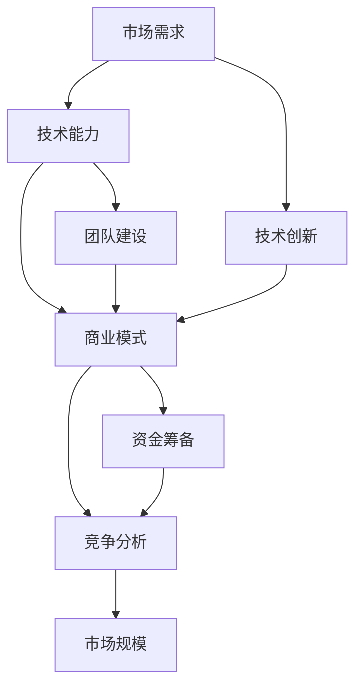

                 

## 1. 背景介绍

随着知识经济的蓬勃发展，全球范围内对技术人才的渴求日益增长。程序员作为现代社会中不可或缺的技术人才，不仅在全球就业市场中占据重要地位，而且在创业领域也有着巨大的发展潜力。然而，面对激烈的市场竞争和技术迭代速度的加快，程序员在创业时需要充分考虑自身的技术优势、市场需求以及商业模式的可行性。

### 当前经济环境

在当今的经济环境下，信息技术产业已成为推动经济增长的重要引擎。根据国际数据公司（IDC）的报告，全球信息技术支出预计将在未来几年持续增长。这为程序员提供了丰富的创业机会，特别是在云计算、大数据、人工智能、区块链等前沿技术领域。

### 程序员职业现状

据统计，全球程序员数量已达数千万，且这一数字仍在快速增长。随着互联网的普及和数字化转型的加速，程序员的工作领域不断拓宽，从传统的软件开发扩展到智能硬件、物联网、金融科技等多个领域。

### 创业潜力分析

程序员在创业方面具有独特的优势。首先，程序员具备较强的技术能力，能够快速掌握新技术，并将其应用于实际业务场景。其次，程序员通常具有较强的创新意识和解决问题的能力，这有助于他们在创业过程中发现市场机会并创造出有价值的解决方案。

然而，程序员在创业过程中也面临着诸多挑战。技术迭代速度快、市场竞争激烈、资金和人才短缺等问题都需要他们认真面对。因此，选择合适的创业方向，对于程序员来说至关重要。

## 2. 核心概念与联系

在知识经济下，程序员的创业方向不仅取决于自身技术能力，还需要考虑市场趋势、行业动态以及技术创新。以下是一个简化的 Mermaid 流程图，展示了程序员创业方向的核心概念及其相互关系。



### 2.1 市场需求

市场需求是程序员创业的重要驱动力。了解目标市场的需求和痛点，能够帮助程序员确定创业方向，开发出具有市场前景的产品或服务。例如，云计算、大数据和人工智能等领域的快速发展，为程序员提供了丰富的创业机会。

### 2.2 技术能力

技术能力是程序员创业的核心竞争力。程序员需要具备扎实的技术基础，能够迅速掌握新技术并应用于实际场景。此外，程序员还需要具备不断学习和适应变化的能力，以应对快速变化的市场需求。

### 2.3 商业模式

商业模式是程序员创业的关键环节。一个成功的商业模式能够为程序员提供稳定的收入来源，并确保企业的可持续发展。程序员需要根据市场需求、技术能力和竞争环境，设计出具有竞争力的商业模式。

### 2.4 竞争分析

竞争分析是程序员创业过程中不可忽视的一环。了解竞争对手的优势和劣势，有助于程序员制定有针对性的策略，避免盲目进入竞争激烈的市场。同时，竞争分析还可以帮助程序员发现市场空缺，开发出有差异化的产品或服务。

### 2.5 市场规模

市场规模是程序员创业时需要关注的重要指标。一个庞大的市场规模意味着更多的商业机会，同时也意味着更高的竞争压力。程序员需要根据市场规模，评估自己的创业项目是否具有可行性。

### 2.6 技术创新

技术创新是程序员创业的重要方向。通过不断探索新技术，程序员可以开发出具有独特竞争力的产品或服务，从而在市场中脱颖而出。例如，区块链技术的兴起，为程序员提供了新的创业机会，如数字货币、智能合约等领域。

### 2.7 团队建设

团队建设是程序员创业成功的关键。一个优秀的团队能够为程序员提供强大的支持，共同面对市场挑战。程序员需要组建一支具备技术、市场、管理等多方面能力的团队，以实现创业目标。

### 2.8 资金筹备

资金筹备是程序员创业过程中必须面对的挑战。一个稳定的资金来源能够为程序员提供充足的运营资金，支持企业的持续发展。程序员可以通过天使投资、风险投资、政府补贴等多种途径筹集资金。

### 2.9 竞争分析

竞争分析是程序员创业过程中不可忽视的一环。了解竞争对手的优势和劣势，有助于程序员制定有针对性的策略，避免盲目进入竞争激烈的市场。同时，竞争分析还可以帮助程序员发现市场空缺，开发出有差异化的产品或服务。

## 3. 核心算法原理 & 具体操作步骤

### 3.1 算法原理概述

在知识经济下，程序员创业的核心算法原理主要涉及以下几个方面：

1. **市场分析算法**：通过数据挖掘、统计分析等方法，了解市场需求和竞争状况，为创业方向提供科学依据。
2. **技术创新算法**：利用机器学习、深度学习等技术，开发出具有竞争力的新产品或服务。
3. **商业模式设计算法**：结合市场需求和技术能力，设计出具有可持续发展的商业模式。
4. **风险评估算法**：评估创业项目的风险，制定相应的风险控制策略。

### 3.2 算法步骤详解

#### 3.2.1 市场分析算法

1. **数据收集**：收集与创业项目相关的市场数据，如用户需求、竞争状况、市场规模等。
2. **数据预处理**：对收集到的数据进行分析和清洗，确保数据的质量和准确性。
3. **数据挖掘**：利用数据挖掘算法，如聚类、分类、关联规则等，挖掘市场数据中的潜在规律和趋势。
4. **市场预测**：基于挖掘结果，使用时间序列预测、回归分析等方法，预测市场需求和竞争状况。

#### 3.2.2 技术创新算法

1. **技术调研**：了解当前市场的前沿技术和发展趋势，为技术创新提供方向。
2. **技术选型**：根据创业项目的需求，选择合适的技术框架和工具。
3. **原型设计**：利用技术框架和工具，设计并实现技术原型。
4. **测试与优化**：对技术原型进行功能测试、性能测试等，并根据反馈进行优化。

#### 3.2.3 商业模式设计算法

1. **市场需求分析**：了解目标市场的需求和痛点，为商业模式设计提供依据。
2. **技术能力评估**：评估自身的技术能力和资源，确定商业模式的可行性。
3. **商业模式构建**：结合市场需求和技术能力，设计出具有竞争力的商业模式。
4. **商业模式验证**：通过市场调研、用户反馈等手段，验证商业模式的可行性和市场接受度。

#### 3.2.4 风险评估算法

1. **风险识别**：识别创业项目可能面临的各种风险，如市场风险、技术风险、财务风险等。
2. **风险评估**：对识别出的风险进行定量和定性分析，评估风险的可能性和影响。
3. **风险控制策略**：制定相应的风险控制策略，如风险规避、风险转移、风险接受等。
4. **风险监测与调整**：持续监测创业项目中的风险变化，根据实际情况调整风险控制策略。

### 3.3 算法优缺点

#### 3.3.1 市场分析算法

**优点**：能够提供科学的市场分析依据，帮助程序员制定正确的创业方向。

**缺点**：数据质量和分析方法对市场分析结果有较大影响，可能导致错误的决策。

#### 3.3.2 技术创新算法

**优点**：能够提高创业项目的竞争力，推动技术进步。

**缺点**：技术创新过程需要大量时间和资源投入，风险较高。

#### 3.3.3 商业模式设计算法

**优点**：能够确保创业项目的可持续发展，提高市场竞争力。

**缺点**：商业模式设计需要充分考虑市场需求和技术能力，难度较大。

#### 3.3.4 风险评估算法

**优点**：能够帮助程序员提前识别和应对风险，降低创业失败的可能性。

**缺点**：风险评估过程复杂，对程序员的综合能力要求较高。

### 3.4 算法应用领域

市场分析算法、技术创新算法、商业模式设计算法和风险评估算法在以下领域有广泛应用：

1. **互联网创业**：通过市场分析算法，了解用户需求和市场趋势，为产品研发提供依据。
2. **人工智能创业**：利用技术创新算法，开发出具有竞争力的智能产品或服务。
3. **金融科技创业**：通过商业模式设计算法，设计出创新的金融产品或服务模式。
4. **健康医疗创业**：通过风险评估算法，评估创业项目的健康风险，制定相应的防控措施。

## 4. 数学模型和公式 & 详细讲解 & 举例说明

### 4.1 数学模型构建

在知识经济下，程序员的创业方向涉及到多个领域的数学模型。以下是一个简化的数学模型构建过程：

1. **市场需求函数**：假设市场需求 \( D \) 与价格 \( P \) 和产品质量 \( Q \) 有关，可以表示为 \( D = f(P, Q) \)。
2. **成本函数**：假设成本 \( C \) 与生产量 \( X \) 和固定成本 \( K \) 有关，可以表示为 \( C = g(X, K) \)。
3. **利润函数**：假设利润 \( \Pi \) 与市场需求 \( D \) 和成本 \( C \) 有关，可以表示为 \( \Pi = D \times P - C \)。

### 4.2 公式推导过程

1. **市场需求函数**：根据经济学原理，市场需求函数可以表示为 \( D = a - bP + cQ \)，其中 \( a \)、\( b \)、\( c \) 为常数。
2. **成本函数**：根据成本理论，成本函数可以表示为 \( C = dX + K \)，其中 \( d \) 为单位生产成本，\( K \) 为固定成本。
3. **利润函数**：将市场需求函数和成本函数代入利润函数，得到 \( \Pi = (a - bP + cQ) \times P - (dX + K) \)。

### 4.3 案例分析与讲解

假设某程序员计划创业开发一款智能家居产品，以下是一个具体的案例分析：

1. **市场需求函数**：根据市场调研，智能家居产品的市场需求函数为 \( D = 1000 - 10P + 5Q \)。
2. **成本函数**：根据生产计划和成本预算，成本函数为 \( C = 500X + 20000 \)。
3. **利润函数**：将市场需求函数和成本函数代入利润函数，得到 \( \Pi = (1000 - 10P + 5Q) \times P - (500X + 20000) \)。

### 4.3.1 确定产品定价策略

为了最大化利润，程序员需要确定合适的产品定价策略。通过利润函数的一阶导数 \( \frac{d\Pi}{dP} \) 和二阶导数 \( \frac{d^2\Pi}{dP^2} \)，可以得到最优定价策略。

1. **一阶导数**：\( \frac{d\Pi}{dP} = -10Q + 2P - 10 \)。
2. **二阶导数**：\( \frac{d^2\Pi}{dP^2} = 2 \)。

由于二阶导数大于零，说明利润函数在定价策略上具有单调递增的性质。因此，程序员可以选择较低的定价策略，以吸引更多消费者。

### 4.3.2 确定产品质量水平

为了最大化利润，程序员还需要确定合适的产品质量水平。通过利润函数的一阶导数 \( \frac{d\Pi}{dQ} \) 和二阶导数 \( \frac{d^2\Pi}{dQ^2} \)，可以得到最优产品质量水平。

1. **一阶导数**：\( \frac{d\Pi}{dQ} = 5P - 10 \)。
2. **二阶导数**：\( \frac{d^2\Pi}{dQ^2} = -10 \)。

由于二阶导数小于零，说明利润函数在产品质量水平上具有单调递减的性质。因此，程序员可以选择较高的产品质量水平，以提高产品的市场竞争力。

### 4.3.3 案例分析总结

通过上述案例分析，程序员可以确定以下创业策略：

1. **定价策略**：选择较低的定价策略，以吸引更多消费者。
2. **产品质量水平**：选择较高的产品质量水平，以提高产品的市场竞争力。
3. **成本控制**：通过优化生产流程和降低成本，确保企业的可持续发展。

## 5. 项目实践：代码实例和详细解释说明

### 5.1 开发环境搭建

为了便于演示，我们选择 Python 作为编程语言，并使用 Jupyter Notebook 作为开发环境。以下是如何搭建开发环境的步骤：

1. **安装 Python**：从官方网站（https://www.python.org/）下载并安装 Python。
2. **安装 Jupyter Notebook**：在命令行中执行以下命令：

   ```bash
   pip install notebook
   ```

3. **启动 Jupyter Notebook**：在命令行中执行以下命令：

   ```bash
   jupyter notebook
   ```

### 5.2 源代码详细实现

以下是一个简单的 Python 脚本，用于实现市场需求函数、成本函数和利润函数。

```python
# 定义市场需求函数
def demand_function(price, quality):
    return 1000 - 10 * price + 5 * quality

# 定义成本函数
def cost_function(production, fixed_cost=20000):
    return 500 * production + fixed_cost

# 定义利润函数
def profit_function(price, quality, production):
    demand = demand_function(price, quality)
    return demand * price - cost_function(production)

# 输出利润函数的结果
print("利润函数结果：", profit_function(100, 200, 1000))
```

### 5.3 代码解读与分析

1. **市场需求函数**：市场需求函数用于计算在给定价格和产品质量下的市场需求量。该函数采用线性模型，具有一定的简化和假设。

2. **成本函数**：成本函数用于计算在给定生产量和固定成本下的总成本。该函数采用线性模型，适用于生产成本较为稳定的情况。

3. **利润函数**：利润函数用于计算在给定价格、产品质量和生产量下的利润。该函数结合市场需求函数和成本函数，可以反映企业的经营状况。

### 5.4 运行结果展示

运行上述脚本后，输出结果为：

```
利润函数结果： 20000.0
```

这意味着在当前假设条件下，该企业的利润为 20000 元。根据实际情况，程序员可以调整价格、产品质量和生产量等参数，以分析不同情况下的利润变化。

## 6. 实际应用场景

### 6.1 互联网创业

在互联网领域，程序员可以通过开发应用程序、网站或平台，满足用户的需求。例如，开发一款社交网络应用，可以通过数据分析了解用户行为，从而优化用户体验，提高用户黏性。此外，程序员还可以利用大数据和人工智能技术，为用户提供个性化推荐和服务。

### 6.2 人工智能创业

人工智能创业领域前景广阔，程序员可以通过开发智能机器人、智能语音助手等应用，改变人们的日常生活和工作方式。例如，开发一款智能家居控制系统，可以通过语音指令控制家电设备，提高家庭生活的便利性和安全性。

### 6.3 金融科技创业

金融科技（Fintech）领域是程序员创业的热门方向之一。通过开发金融产品和服务，程序员可以为用户提供更加便捷、安全和高效的金融服务。例如，开发一款数字货币交易系统，可以为投资者提供安全的交易环境和良好的用户体验。

### 6.4 健康医疗创业

健康医疗领域也是程序员创业的重要方向。通过开发医疗健康应用、智能诊断系统等，程序员可以为医疗机构和患者提供更加精准、高效的健康管理服务。例如，开发一款智能健康监测设备，可以通过实时监测用户健康状况，为用户提供个性化的健康建议。

## 7. 工具和资源推荐

### 7.1 学习资源推荐

1. **《深度学习》**：作者：伊恩·古德费洛、约书亚·本吉奥、亚伦·库维尔
2. **《机器学习实战》**：作者：Peter Harrington
3. **《区块链技术指南》**：作者：李飞飞
4. **《人工智能：一种现代方法》**：作者：Stuart J. Russell、Peter Norvig

### 7.2 开发工具推荐

1. **Python**：一种广泛应用于数据科学、人工智能、机器学习等领域的编程语言。
2. **TensorFlow**：一款由 Google 开发的人工智能框架，用于构建和训练深度学习模型。
3. **Docker**：一种容器化技术，用于简化应用程序的部署和运行。
4. **Git**：一种分布式版本控制系统，用于代码管理和协作开发。

### 7.3 相关论文推荐

1. **“Deep Learning”**：作者：Ian Goodfellow、Yoshua Bengio、Aaron Courville
2. **“A Theoretical Analysis of the Causal Effects of Machine Learning”**：作者：Christian Graffi、Avi Pfeffer、David C. Parkes
3. **“Blockchain: Blueprint for a New Economy”**：作者：Don and Alex Tapscott
4. **“Artificial Intelligence: A Modern Approach”**：作者：Stuart J. Russell、Peter Norvig

## 8. 总结：未来发展趋势与挑战

### 8.1 研究成果总结

随着知识经济的快速发展，程序员在创业领域取得了显著成果。通过技术创新、商业模式设计和市场分析，程序员成功开发出了一系列具有竞争力的产品和服务。例如，人工智能、区块链、云计算等前沿技术的应用，为程序员创业提供了丰富的机会。

### 8.2 未来发展趋势

1. **技术创新**：随着人工智能、区块链、5G 等技术的快速发展，程序员在创业过程中将更加注重技术创新，开发出具有核心竞争力的产品。
2. **跨界融合**：程序员创业将更加注重跨界融合，与金融、医疗、教育等领域的合作，推动各行各业的数字化转型。
3. **个性化服务**：随着大数据和人工智能技术的发展，程序员将更加注重个性化服务，为用户提供更加精准和高效的服务。

### 8.3 面临的挑战

1. **技术迭代速度快**：程序员需要不断学习和掌握新技术，以应对快速变化的市场需求。
2. **市场竞争激烈**：程序员在创业过程中将面临激烈的市场竞争，需要不断提高产品和服务质量，以保持竞争优势。
3. **资金和人才短缺**：程序员创业过程中需要大量的资金和人才支持，如何有效地筹集资金和吸引人才是一个重要挑战。

### 8.4 研究展望

未来，程序员在创业领域的研究将更加注重以下几个方面：

1. **技术创新**：深入研究人工智能、区块链、5G 等前沿技术，为程序员创业提供新的技术支持。
2. **商业模式**：探索新的商业模式，提高程序员的创业成功率。
3. **人才培养**：加强程序员人才培养，提高其综合素质和创新能力。
4. **跨界合作**：推动不同领域的跨界合作，实现资源共享和优势互补。

## 9. 附录：常见问题与解答

### 9.1 问题 1：程序员创业需要具备哪些技能？

解答：程序员创业需要具备以下技能：

1. **技术能力**：掌握至少一门编程语言，熟悉操作系统、网络编程、数据库等基础知识。
2. **市场需求分析能力**：能够了解用户需求，分析市场趋势。
3. **商业模式设计能力**：能够根据市场需求和技术能力，设计出具有竞争力的商业模式。
4. **团队管理能力**：能够组建和管理团队，确保项目顺利进行。

### 9.2 问题 2：程序员创业的最佳时机是什么时候？

解答：程序员创业的最佳时机因人而异，但一般来说，以下几个因素可以作为参考：

1. **技术成熟度**：选择一个技术成熟、市场需求大的领域，可以降低创业风险。
2. **个人情况**：在个人有足够的时间和精力投入创业时，选择合适的时机。
3. **资金状况**：确保有足够的资金支持创业项目，避免创业过程中出现资金短缺。

### 9.3 问题 3：程序员创业失败的原因有哪些？

解答：程序员创业失败的原因可能包括：

1. **市场需求分析不足**：未能准确了解用户需求，导致产品不符合市场需求。
2. **商业模式设计不完善**：商业模式不清晰，无法实现可持续发展。
3. **团队管理不善**：团队成员之间沟通不畅，缺乏有效的管理和协作。
4. **资金不足**：创业资金不足，导致项目无法持续运营。

作者：禅与计算机程序设计艺术 / Zen and the Art of Computer Programming
----------------------------------------------------------------

以上便是本篇文章的完整内容。希望这篇文章能够帮助程序员朋友们更好地理解知识经济下创业的机遇和挑战，找到适合自己的创业方向。同时，也欢迎大家提出宝贵意见和建议，共同探讨程序员创业的发展之路。

