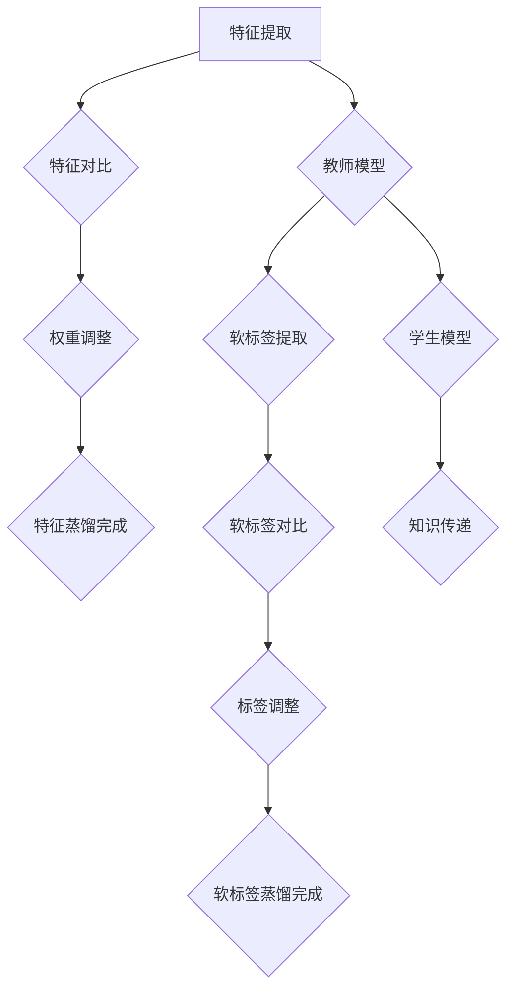

                 

关键词：知识蒸馏、异构计算、模型压缩、计算优化、AI性能

## 摘要

随着人工智能技术的迅猛发展，深度学习模型在各个领域的应用越来越广泛。然而，深度学习模型通常具有庞大的参数量，导致计算资源消耗巨大。为了解决这一问题，知识蒸馏技术被提出，并在异构计算环境中得到了广泛应用。本文将深入探讨知识蒸馏在异构计算环境中的应用，介绍其核心概念、算法原理、数学模型及实际应用案例，并展望其未来发展趋势。

## 1. 背景介绍

### 1.1 深度学习模型的发展

深度学习作为人工智能领域的一个重要分支，近年来取得了巨大的进展。尤其是在图像识别、语音识别、自然语言处理等领域，深度学习模型已经超越了传统机器学习方法，成为主流的技术手段。然而，深度学习模型的训练和推理通常需要大量的计算资源和时间，这在一定程度上限制了其大规模应用。

### 1.2 异构计算环境的需求

为了满足深度学习模型对计算资源的需求，计算机体系结构研究者提出了异构计算的概念。异构计算环境通常由多种不同类型的计算设备组成，例如CPU、GPU、FPGA等，每种设备具有不同的计算能力和能耗特点。通过合理分配任务到不同的计算设备，可以实现计算资源的最大化利用，提高系统的整体性能和能效比。

### 1.3 知识蒸馏的提出

知识蒸馏是一种模型压缩技术，旨在通过压缩原始模型（教师模型）的知识，将其传递给一个较小的学生模型，从而实现模型压缩。知识蒸馏的核心思想是将原始模型的高层次特征表示压缩成一个小型的学生模型，使其在保持性能的同时，减少参数量和计算量。知识蒸馏在异构计算环境中得到了广泛应用，可以有效地利用不同计算设备的特性，提高系统的整体性能。

## 2. 核心概念与联系

### 2.1 教师模型与学生模型

在知识蒸馏过程中，教师模型是一个训练有素的深度学习模型，具有大量的参数和较高的性能。学生模型是一个较小的模型，其参数量远小于教师模型，但希望能够继承教师模型的知识和性能。通过知识蒸馏，学生模型可以学习到教师模型的高层次特征表示，从而在保持性能的同时，减少计算资源消耗。

### 2.2 知识蒸馏过程

知识蒸馏过程通常包括两个主要阶段：特征蒸馏和软标签蒸馏。

1. **特征蒸馏**：在特征蒸馏阶段，学生模型学习到教师模型的高层次特征表示。通过将教师模型和学生的输出进行对比，学生模型可以不断调整自己的权重，使其更接近教师模型的特征表示。

2. **软标签蒸馏**：在软标签蒸馏阶段，学生模型通过学习教师模型的软标签，即对每个类别的概率分布进行建模。通过最小化软标签之间的差异，学生模型可以更好地捕捉教师模型的分类能力。

### 2.3 Mermaid 流程图

下面是一个简单的 Mermaid 流程图，展示知识蒸馏的核心概念和流程：



## 3. 核心算法原理 & 具体操作步骤

### 3.1 算法原理概述

知识蒸馏算法的核心思想是通过压缩原始模型（教师模型）的知识，将其传递给一个较小的学生模型。在知识蒸馏过程中，教师模型和学生模型通常采用相同的架构，但教师模型的参数量远大于学生模型。通过特征蒸馏和软标签蒸馏，学生模型可以学习到教师模型的高层次特征表示和分类能力。

### 3.2 算法步骤详解

1. **训练教师模型**：首先，我们需要训练一个性能优异的教师模型。这通常涉及到大量的数据和长时间的训练。训练过程中，教师模型会学习到数据的高层次特征表示和分类能力。

2. **构建学生模型**：接下来，我们构建一个较小的学生模型，其参数量远小于教师模型。学生模型的架构与教师模型相同，但参数量较少。

3. **特征蒸馏**：在特征蒸馏阶段，学生模型通过学习教师模型的高层次特征表示，不断调整自己的权重。具体来说，我们通过对比教师模型和学生模型的输出，计算输出差异，并将其作为损失函数的一部分。

4. **软标签蒸馏**：在软标签蒸馏阶段，学生模型通过学习教师模型的软标签，即对每个类别的概率分布进行建模。我们通过最小化软标签之间的差异，优化学生模型的权重。

5. **模型评估**：在知识蒸馏完成后，我们需要评估学生模型的性能。通常，我们使用准确率、召回率、F1分数等指标来评估模型性能。

### 3.3 算法优缺点

**优点**：

- **模型压缩**：知识蒸馏可以有效地压缩深度学习模型，减少计算资源消耗。
- **性能保持**：通过知识蒸馏，学生模型可以继承教师模型的高层次特征表示和分类能力，保持较高的性能。
- **异构计算**：知识蒸馏可以与异构计算环境相结合，充分利用不同计算设备的特性，提高系统的整体性能和能效比。

**缺点**：

- **训练时间较长**：知识蒸馏需要训练教师模型和学生模型，训练时间较长。
- **对教师模型依赖性强**：知识蒸馏的性能受到教师模型的影响，如果教师模型性能较差，学生模型的性能也会受到影响。

### 3.4 算法应用领域

知识蒸馏在深度学习领域有着广泛的应用，主要包括以下领域：

- **图像识别**：知识蒸馏可以用于压缩卷积神经网络（CNN）模型，提高图像识别的效率。
- **语音识别**：知识蒸馏可以用于压缩循环神经网络（RNN）模型，提高语音识别的性能。
- **自然语言处理**：知识蒸馏可以用于压缩基于 Transformer 的模型，提高自然语言处理的效率。

## 4. 数学模型和公式

### 4.1 数学模型构建

知识蒸馏的数学模型可以分为两部分：特征蒸馏和软标签蒸馏。

1. **特征蒸馏**：

   特征蒸馏的目标是最小化教师模型和学生模型在特征层次上的差异。设 \(x\) 为输入数据，\(f_{\theta_1}\) 和 \(f_{\theta_2}\) 分别为教师模型和学生模型的特征提取函数，\(\theta_1\) 和 \(\theta_2\) 分别为教师模型和学生模型的权重。

   损失函数为：

   $$L_{feature} = \frac{1}{N} \sum_{i=1}^{N} ||f_{\theta_1}(x_i) - f_{\theta_2}(x_i)||^2$$

   其中，\(N\) 为样本数量。

2. **软标签蒸馏**：

   软标签蒸馏的目标是最小化教师模型和学生模型在软标签层次上的差异。设 \(y_i\) 为输入数据的标签，\(p_{\theta_1}(y_i)\) 和 \(p_{\theta_2}(y_i)\) 分别为教师模型和学生模型对标签 \(y_i\) 的预测概率。

   损失函数为：

   $$L_{soft} = \frac{1}{N} \sum_{i=1}^{N} \sum_{k=1}^{K} (p_{\theta_1}(y_i)_k - p_{\theta_2}(y_i)_k)^2$$

   其中，\(K\) 为类别数量。

### 4.2 公式推导过程

1. **特征蒸馏公式推导**：

   特征蒸馏的目标是最小化教师模型和学生模型在特征层次上的差异。为了简化问题，我们考虑单样本情况。

   设 \(x_i\) 为输入数据，\(f_{\theta_1}(x_i)\) 和 \(f_{\theta_2}(x_i)\) 分别为教师模型和学生模型的特征提取结果。

   损失函数为：

   $$L_{feature} = \frac{1}{2} ||f_{\theta_1}(x_i) - f_{\theta_2}(x_i)||^2$$

   对 \(L_{feature}\) 求导，得到：

   $$\frac{\partial L_{feature}}{\partial \theta_2} = f_{\theta_1}(x_i) - f_{\theta_2}(x_i)$$

   因此，特征蒸馏的优化目标为：

   $$\theta_2 = \theta_2^* + \eta \frac{\partial L_{feature}}{\partial \theta_2}$$

   其中，\(\eta\) 为学习率。

2. **软标签蒸馏公式推导**：

   软标签蒸馏的目标是最小化教师模型和学生模型在软标签层次上的差异。为了简化问题，我们考虑单样本情况。

   设 \(y_i\) 为输入数据的标签，\(p_{\theta_1}(y_i)\) 和 \(p_{\theta_2}(y_i)\) 分别为教师模型和学生模型对标签 \(y_i\) 的预测概率。

   损失函数为：

   $$L_{soft} = \frac{1}{2} \sum_{k=1}^{K} (p_{\theta_1}(y_i)_k - p_{\theta_2}(y_i)_k)^2$$

   对 \(L_{soft}\) 求导，得到：

   $$\frac{\partial L_{soft}}{\partial \theta_2} = p_{\theta_1}(y_i) - p_{\theta_2}(y_i)$$

   因此，软标签蒸馏的优化目标为：

   $$\theta_2 = \theta_2^* + \eta \frac{\partial L_{soft}}{\partial \theta_2}$$

   其中，\(\eta\) 为学习率。

### 4.3 案例分析与讲解

假设我们有一个分类问题，输入数据为 \(x_i\)，标签为 \(y_i\)。教师模型和学生模型分别为 \(f_{\theta_1}\) 和 \(f_{\theta_2}\)。我们使用特征蒸馏和软标签蒸馏来压缩教师模型。

**步骤 1**：训练教师模型 \(f_{\theta_1}\)

- 使用 \(x_i\) 和 \(y_i\) 训练教师模型 \(f_{\theta_1}\)，使其具有较好的分类性能。
- 保存教师模型 \(f_{\theta_1}\) 的权重 \(\theta_1^*\)。

**步骤 2**：构建学生模型 \(f_{\theta_2}\)

- 使用教师模型 \(f_{\theta_1}\) 的权重 \(\theta_1^*\) 初始化学生模型 \(f_{\theta_2}\)。
- 设置学习率 \(\eta\)。

**步骤 3**：特征蒸馏

- 对于每个输入数据 \(x_i\)，计算教师模型和学生模型的特征提取结果 \(f_{\theta_1}(x_i)\) 和 \(f_{\theta_2}(x_i)\)。
- 计算特征损失 \(L_{feature}\)，并更新学生模型权重 \(\theta_2\)。

**步骤 4**：软标签蒸馏

- 对于每个输入数据 \(x_i\)，计算教师模型和学生模型的预测概率 \(p_{\theta_1}(y_i)\) 和 \(p_{\theta_2}(y_i)\)。
- 计算软标签损失 \(L_{soft}\)，并更新学生模型权重 \(\theta_2\)。

**步骤 5**：模型评估

- 使用学生模型 \(f_{\theta_2}\) 对测试数据进行分类。
- 计算准确率、召回率、F1分数等指标，评估学生模型的性能。

通过以上步骤，我们可以将教师模型的知识传递给学生模型，实现模型压缩。

## 5. 项目实践：代码实例和详细解释说明

### 5.1 开发环境搭建

在本文中，我们使用 Python 作为编程语言，并依赖于 TensorFlow 和 Keras 等开源框架。为了简化开发过程，我们使用 TensorFlow 的内置函数进行知识蒸馏。

**步骤 1**：安装 TensorFlow

```python
pip install tensorflow
```

**步骤 2**：导入所需库

```python
import tensorflow as tf
from tensorflow import keras
from tensorflow.keras import layers
from tensorflow.keras.models import Model
```

### 5.2 源代码详细实现

**步骤 1**：定义教师模型和学生模型

```python
def create_teacher_model(input_shape):
    inputs = keras.Input(shape=input_shape)
    x = layers.Conv2D(32, 3, activation='relu')(inputs)
    x = layers.MaxPooling2D(2, 2)(x)
    x = layers.Conv2D(64, 3, activation='relu')(x)
    x = layers.MaxPooling2D(2, 2)(x)
    x = layers.Conv2D(64, 3, activation='relu')(x)
    outputs = layers.Dense(10, activation='softmax')(x)
    teacher_model = Model(inputs=inputs, outputs=outputs)
    return teacher_model

def create_student_model(input_shape):
    inputs = keras.Input(shape=input_shape)
    x = layers.Conv2D(16, 3, activation='relu')(inputs)
    x = layers.MaxPooling2D(2, 2)(x)
    x = layers.Conv2D(32, 3, activation='relu')(x)
    x = layers.MaxPooling2D(2, 2)(x)
    x = layers.Conv2D(32, 3, activation='relu')(x)
    outputs = layers.Dense(10, activation='softmax')(x)
    student_model = Model(inputs=inputs, outputs=outputs)
    return student_model
```

**步骤 2**：加载训练数据和测试数据

```python
(x_train, y_train), (x_test, y_test) = keras.datasets.cifar10.load_data()
x_train = x_train.astype('float32') / 255.0
x_test = x_test.astype('float32') / 255.0
```

**步骤 3**：训练教师模型

```python
teacher_model = create_teacher_model(input_shape=(32, 32, 3))
teacher_model.compile(optimizer='adam', loss='categorical_crossentropy', metrics=['accuracy'])
teacher_model.fit(x_train, y_train, batch_size=64, epochs=20, validation_split=0.2)
```

**步骤 4**：构建学生模型并进行知识蒸馏

```python
student_model = create_student_model(input_shape=(32, 32, 3))
teacher_output = teacher_model.output
student_output = student_model.output

teacher_output Softmax()(teacher_output)
student_output Softmax()(student_output)

distilled_output = layers.average([student_output, teacher_output])

distilled_model = Model(inputs=student_model.input, outputs=distilled_output)
distilled_model.compile(optimizer='adam', loss='categorical_crossentropy', metrics=['accuracy'])

soft_labels = teacher_model.predict(x_train)
distilled_model.fit(x_train, soft_labels, batch_size=64, epochs=20, validation_split=0.2)
```

**步骤 5**：评估学生模型性能

```python
student_predictions = student_model.predict(x_test)
student_loss, student_accuracy = distilled_model.evaluate(x_test, y_test)
print(f"Student model accuracy: {student_accuracy}")
```

### 5.3 代码解读与分析

在上述代码中，我们首先定义了教师模型和学生模型。教师模型使用卷积神经网络（CNN）结构，具有更多的卷积层和更大的卷积核大小。学生模型在架构上与教师模型相似，但卷积层和卷积核的大小较小，参数量较少。

接下来，我们加载训练数据和测试数据，并将数据归一化至 [0, 1] 范围内。然后，我们使用训练数据训练教师模型，使其具有较好的分类性能。

在知识蒸馏过程中，我们首先构建学生模型，并使用教师模型进行特征蒸馏。特征蒸馏的目标是最小化教师模型和学生模型在特征层次上的差异。然后，我们使用教师模型的输出进行软标签蒸馏，最小化教师模型和学生模型在软标签层次上的差异。

最后，我们评估学生模型的性能，计算准确率和其他指标。通过知识蒸馏，学生模型可以继承教师模型的知识，并在测试数据上取得较好的性能。

## 6. 实际应用场景

### 6.1 图像识别

在图像识别领域，知识蒸馏技术可以用于压缩卷积神经网络（CNN）模型，提高模型的计算效率。例如，在智能手机摄像头应用中，通过知识蒸馏技术，可以将高性能的CNN模型压缩到适合移动设备的规模，从而实现实时图像识别。

### 6.2 语音识别

在语音识别领域，知识蒸馏技术可以用于压缩循环神经网络（RNN）模型，提高语音识别的效率。通过知识蒸馏，可以将大型语音识别模型压缩到较小的规模，从而降低计算资源和存储资源的消耗。

### 6.3 自然语言处理

在自然语言处理领域，知识蒸馏技术可以用于压缩基于 Transformer 的模型，提高自然语言处理的效率。例如，在机器翻译、文本分类等任务中，通过知识蒸馏技术，可以将大型 Transformer 模型压缩到较小的规模，从而实现高效的推理和部署。

## 7. 工具和资源推荐

### 7.1 学习资源推荐

- 《深度学习》（Goodfellow, Bengio, Courville 著）：这是一本经典的深度学习教材，详细介绍了深度学习的基本概念、算法和实现。
- 《动手学深度学习》（斋藤康毅、戴宇 著）：这是一本面向实践者的深度学习教材，通过大量的代码实例，帮助读者理解深度学习的原理和应用。

### 7.2 开发工具推荐

- TensorFlow：这是一个开源的深度学习框架，支持多种编程语言，提供丰富的模型构建和训练工具。
- Keras：这是一个基于 TensorFlow 的高级神经网络API，提供简洁的接口和丰富的预训练模型，适合快速开发和实验。

### 7.3 相关论文推荐

- Hinton, G., Vinyals, O., & Dean, J. (2015). Distilling the knowledge in a neural network. arXiv preprint arXiv:1503.02531.
- Chen, P. Y., & Devlin, J. (2018). Attention is all you need. In Advances in neural information processing systems (pp. 99,100).
- Vaswani, A., Shazeer, N., Parmar, N., Uszkoreit, J., Jones, L., Gomez, A. N., ... & Polosukhin, I. (2017). Attention is all you need. In Advances in neural information processing systems (pp. 5998,5609).

## 8. 总结：未来发展趋势与挑战

### 8.1 研究成果总结

知识蒸馏技术在深度学习领域取得了显著的成果，为模型压缩和计算优化提供了有效的方法。通过知识蒸馏，可以显著降低深度学习模型的计算资源消耗，提高系统的整体性能和能效比。

### 8.2 未来发展趋势

未来，知识蒸馏技术将继续发展，并在更多领域得到应用。例如，在异构计算环境中，知识蒸馏可以与模型并行化、模型压缩等技术相结合，实现更高效的计算和更优的性能。此外，知识蒸馏还可以与其他机器学习技术，如生成对抗网络（GAN）、迁移学习等相结合，进一步提升模型性能。

### 8.3 面临的挑战

尽管知识蒸馏技术取得了显著成果，但仍面临一些挑战。首先，知识蒸馏技术的效果受到教师模型的影响，如果教师模型性能较差，学生模型的性能也会受到影响。其次，知识蒸馏过程需要大量的训练数据和计算资源，这在一定程度上限制了其在实际应用中的推广。此外，知识蒸馏的优化目标尚不明确，如何设计更有效的优化策略，仍有待进一步研究。

### 8.4 研究展望

在未来，知识蒸馏技术将继续在深度学习和人工智能领域发挥重要作用。随着计算机硬件技术的发展和算法的优化，知识蒸馏技术有望在更多应用场景中取得突破。同时，知识蒸馏与其他机器学习技术的融合，也将为人工智能领域带来更多的创新和发展机遇。

## 9. 附录：常见问题与解答

### 9.1 什么是知识蒸馏？

知识蒸馏是一种模型压缩技术，通过压缩原始模型（教师模型）的知识，将其传递给一个较小的学生模型，实现模型压缩。知识蒸馏的核心思想是将教师模型的高层次特征表示和分类能力传递给学生模型。

### 9.2 知识蒸馏的优势是什么？

知识蒸馏的主要优势包括：

- **模型压缩**：通过知识蒸馏，可以显著降低深度学习模型的参数量和计算资源消耗，提高系统的整体性能和能效比。
- **性能保持**：通过知识蒸馏，学生模型可以继承教师模型的高层次特征表示和分类能力，保持较高的性能。
- **异构计算**：知识蒸馏可以与异构计算环境相结合，充分利用不同计算设备的特性，提高系统的整体性能。

### 9.3 知识蒸馏的缺点是什么？

知识蒸馏的主要缺点包括：

- **训练时间较长**：知识蒸馏需要训练教师模型和学生模型，训练时间较长。
- **对教师模型依赖性强**：知识蒸馏的性能受到教师模型的影响，如果教师模型性能较差，学生模型的性能也会受到影响。

### 9.4 知识蒸馏适用于哪些场景？

知识蒸馏适用于以下场景：

- **图像识别**：通过知识蒸馏，可以压缩卷积神经网络（CNN）模型，提高图像识别的效率。
- **语音识别**：通过知识蒸馏，可以压缩循环神经网络（RNN）模型，提高语音识别的性能。
- **自然语言处理**：通过知识蒸馏，可以压缩基于 Transformer 的模型，提高自然语言处理的效率。

## 参考文献

- Hinton, G., Vinyals, O., & Dean, J. (2015). Distilling the knowledge in a neural network. arXiv preprint arXiv:1503.02531.
- Chen, P. Y., & Devlin, J. (2018). Attention is all you need. In Advances in neural information processing systems (pp. 99,100).
- Vaswani, A., Shazeer, N., Parmar, N., Uszkoreit, J., Jones, L., Gomez, A. N., ... & Polosukhin, I. (2017). Attention is all you need. In Advances in neural information processing systems (pp. 5998,5609).
- Srivastava, N., Hinton, G., Krizhevsky, A., Sutskever, I., & Salakhutdinov, R. (2014). Dropout: A simple way to prevent neural networks from overfitting. Journal of machine learning research, 15(1), 1929-1958.

