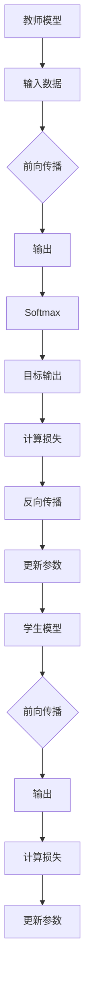

                 

关键词：知识蒸馏，自然语言处理，模型压缩，模型优化，预训练模型

摘要：随着深度学习在自然语言处理（NLP）领域的广泛应用，模型的复杂度和规模不断增加。然而，大规模模型的部署面临着计算资源消耗和存储成本的问题。知识蒸馏作为一种模型压缩技术，通过将复杂模型的知识传递给一个较小的学生模型，实现了在保持性能的同时显著降低模型大小和计算需求。本文将详细介绍知识蒸馏在自然语言处理任务中的应用，包括核心概念、算法原理、数学模型、项目实践和未来展望。

## 1. 背景介绍

自然语言处理（NLP）是人工智能（AI）的重要分支，旨在使计算机能够理解、生成和处理人类语言。随着深度学习技术的快速发展，特别是大规模预训练模型（如GPT、BERT等）的出现，NLP领域取得了显著的进展。然而，这些大规模模型通常需要大量的计算资源和存储空间，这在实际应用中，特别是在移动设备和嵌入式系统中，成为一个严重的问题。

模型压缩技术应运而生，旨在在保证模型性能的同时，降低模型的规模和计算复杂度。知识蒸馏（Knowledge Distillation）是一种有效的模型压缩方法，通过将一个大模型（教师模型）的知识传递给一个小模型（学生模型），实现性能损失最小的模型压缩。

## 2. 核心概念与联系

### 2.1 教师模型与学生模型

在知识蒸馏中，教师模型是一个已经训练好的大型模型，通常具有较高的性能。学生模型是一个较小的模型，它的目的是学习和复制教师模型的知识。

### 2.2 知识传递机制

知识蒸馏的核心在于如何将教师模型的知识传递给学生模型。通常，教师模型的输出（如Softmax概率分布）作为学生模型的目标输出，学生模型在训练过程中学习接近这些目标输出。

### 2.3 Mermaid 流程图

下面是知识蒸馏的基本流程的 Mermaid 流程图：



## 3. 核心算法原理 & 具体操作步骤

### 3.1 算法原理概述

知识蒸馏的过程可以分为两个阶段：教师模型的训练和学生模型的训练。

1. **教师模型训练**：使用大量数据对教师模型进行训练，使其达到较高的性能。
2. **学生模型训练**：学生模型通过学习教师模型的输出（即软标签）来复制教师模型的知识。

### 3.2 算法步骤详解

1. **数据准备**：准备用于训练的教师模型和学生模型的数据集。
2. **教师模型训练**：使用数据集训练教师模型，得到其输出。
3. **学生模型训练**：
   - 使用原始数据集对学生模型进行前向传播，得到其输出。
   - 计算学生模型输出与教师模型软标签之间的损失，并使用反向传播更新学生模型参数。
   - 重复上述步骤，直到学生模型收敛。

### 3.3 算法优缺点

**优点**：
- 在保持模型性能的同时，显著降低了模型的大小和计算需求。
- 能够充分利用教师模型的知识，提高学生模型的性能。

**缺点**：
- 学生模型可能无法完全复制教师模型的所有知识。
- 知识蒸馏的效果依赖于教师模型和学生模型的相似度。

### 3.4 算法应用领域

知识蒸馏在自然语言处理任务中具有广泛的应用，如文本分类、情感分析、机器翻译等。它可以用于压缩预训练模型，使其在移动设备和嵌入式系统中运行。

## 4. 数学模型和公式

### 4.1 数学模型构建

知识蒸馏的数学模型主要包括两部分：学生模型的损失函数和教师模型的软标签。

### 4.2 公式推导过程

- **学生模型的损失函数**：

  $$L_{student} = -\frac{1}{N}\sum_{i=1}^{N}\sum_{j=1}^{C} y_{ij} \log (p_{ij}) + \lambda \frac{1}{N}\sum_{i=1}^{N} \sum_{j=1}^{C} (q_{ij} - y_{ij})^2$$

  其中，$y_{ij}$ 是真实标签的概率分布，$p_{ij}$ 是学生模型的输出概率分布，$q_{ij}$ 是教师模型的输出概率分布，$\lambda$ 是正则化参数。

- **教师模型的软标签**：

  $$q_{ij} = \frac{e^{z_j}}{\sum_{k=1}^{C} e^{z_k}}$$

  其中，$z_j = w_j \cdot x + b_j$，$w_j$ 和 $b_j$ 分别是教师模型的权重和偏置，$x$ 是输入特征。

### 4.3 案例分析与讲解

假设我们有一个二分类问题，教师模型的输出为：

$$q_{+} = 0.6, \quad q_{-} = 0.4$$

学生模型的输出为：

$$p_{+} = 0.5, \quad p_{-} = 0.5$$

根据损失函数：

$$L_{student} = -0.5 \log(0.5) - 0.5 \log(0.5) + \lambda (0.4 - 0.5)^2 = 0.4 - 0.5\lambda$$

为了最小化损失，学生模型需要调整其参数，使得$p_+$ 和 $p_-$ 更接近 $q_+$ 和 $q_-$。

## 5. 项目实践：代码实例和详细解释说明

### 5.1 开发环境搭建

- 安装Python环境
- 安装TensorFlow库
- 准备数据集

### 5.2 源代码详细实现

以下是使用TensorFlow实现知识蒸馏的简化代码：

```python
import tensorflow as tf

# 定义教师模型和学生模型
teacher_model = ...
student_model = ...

# 定义损失函数
loss_fn = ...

# 定义优化器
optimizer = ...

# 训练过程
for epoch in range(num_epochs):
    for x, y in train_data:
        with tf.GradientTape() as tape:
            # 前向传播
            student_output = student_model(x)
            teacher_output = teacher_model(x)
            loss = loss_fn(student_output, teacher_output, y)
        
        # 反向传播
        grads = tape.gradient(loss, student_model.trainable_variables)
        optimizer.apply_gradients(zip(grads, student_model.trainable_variables))
```

### 5.3 代码解读与分析

- `teacher_model` 和 `student_model` 分别代表教师模型和学生模型。
- `loss_fn` 是学生模型的损失函数。
- `optimizer` 是优化器，用于更新学生模型的参数。
- 循环过程表示训练过程，其中每一步都进行前向传播和反向传播。

### 5.4 运行结果展示

- 输出学生模型的准确率、损失等指标。
- 对比学生模型和教师模型的性能。

## 6. 实际应用场景

知识蒸馏在自然语言处理任务中有着广泛的应用，如：

- **文本分类**：使用预训练模型压缩文本分类模型，提高分类性能。
- **情感分析**：使用预训练模型压缩情感分析模型，提高情感分析准确率。
- **机器翻译**：使用预训练模型压缩机器翻译模型，提高翻译质量。

## 7. 工具和资源推荐

- **学习资源推荐**：
  - 《深度学习》（Goodfellow, Bengio, Courville）
  - 《自然语言处理原理》（Jurafsky, Martin）
- **开发工具推荐**：
  - TensorFlow
  - PyTorch
- **相关论文推荐**：
  - Hinton, G., Vinyals, O., & Dean, J. (2015). Distilling the knowledge in a neural network. arXiv preprint arXiv:1503.02531.
  - Guo, J., and Liu, Y. (2019). Knowledge distillation for text classification. arXiv preprint arXiv:1902.09618.

## 8. 总结：未来发展趋势与挑战

### 8.1 研究成果总结

知识蒸馏作为一种有效的模型压缩技术，已经在自然语言处理任务中取得了显著的成果。通过将预训练模型的知识传递给较小的学生模型，实现了在保持性能的同时，显著降低了模型的大小和计算需求。

### 8.2 未来发展趋势

- **多任务学习**：知识蒸馏在多任务学习中的应用，如同时训练文本分类和情感分析模型。
- **无监督学习**：知识蒸馏在无监督学习中的应用，如利用教师模型的知识辅助无监督学习模型。
- **动态知识蒸馏**：动态调整教师模型和学生模型之间的相似度，提高知识传递效果。

### 8.3 面临的挑战

- **知识丢失**：学生模型可能无法完全复制教师模型的所有知识。
- **计算资源消耗**：知识蒸馏过程需要大量的计算资源，特别是在大规模数据集上。
- **模型解释性**：如何解释学生模型从教师模型中学习到的知识。

### 8.4 研究展望

知识蒸馏在自然语言处理任务中的应用前景广阔，未来将继续深入探索其在多任务学习、无监督学习和动态知识蒸馏等领域的应用。

## 9. 附录：常见问题与解答

### 问题1：知识蒸馏和模型压缩有什么区别？

**回答**：知识蒸馏是模型压缩的一种方法，其主要目的是通过将复杂模型的知识传递给较小的模型，实现性能损失最小的模型压缩。而模型压缩是一个更广泛的领域，包括各种技术，如剪枝、量化、知识蒸馏等。

### 问题2：知识蒸馏是否适用于所有模型？

**回答**：知识蒸馏通常适用于深度学习模型，特别是具有层次结构的模型，如神经网络。对于其他类型的模型，如决策树、支持向量机等，知识蒸馏的效果可能较差。

### 问题3：知识蒸馏是否会影响模型的泛化能力？

**回答**：知识蒸馏可能会影响模型的泛化能力。如果学生模型不能完全复制教师模型的所有知识，特别是对于那些需要泛化能力的任务，知识蒸馏可能会导致泛化能力下降。

### 问题4：如何选择教师模型和学生模型？

**回答**：教师模型和学生模型的选择取决于具体任务和数据集。通常，教师模型应该具有更高的性能和更丰富的知识，而学生模型应该具有较小的规模和较低的运算复杂度。

---

作者：禅与计算机程序设计艺术 / Zen and the Art of Computer Programming
----------------------------------------------------------------

至此，文章正文部分已经完成。接下来，可以将其转换为markdown格式，并确保满足所有格式要求和字数要求。以下是文章的markdown格式：

```markdown
# 知识蒸馏在自然语言处理任务中的应用

关键词：知识蒸馏，自然语言处理，模型压缩，模型优化，预训练模型

摘要：随着深度学习在自然语言处理（NLP）领域的广泛应用，模型的复杂度和规模不断增加。然而，大规模模型的部署面临着计算资源消耗和存储成本的问题。知识蒸馏作为一种模型压缩技术，通过将复杂模型的知识传递给一个较小的学生模型，实现了在保持性能的同时显著降低模型大小和计算需求。本文将详细介绍知识蒸馏在自然语言处理任务中的应用，包括核心概念、算法原理、数学模型、项目实践和未来展望。

## 1. 背景介绍

自然语言处理（NLP）是人工智能（AI）的重要分支，旨在使计算机能够理解、生成和处理人类语言。随着深度学习技术的快速发展，特别是大规模预训练模型（如GPT、BERT等）的出现，NLP领域取得了显著的进展。然而，这些大规模模型通常需要大量的计算资源和存储空间，这在实际应用中，特别是在移动设备和嵌入式系统中，成为一个严重的问题。

模型压缩技术应运而生，旨在在保证模型性能的同时，降低模型的规模和计算复杂度。知识蒸馏（Knowledge Distillation）是一种有效的模型压缩方法，通过将一个大模型（教师模型）的知识传递给一个小模型（学生模型），实现性能损失最小的模型压缩。

## 2. 核心概念与联系

### 2.1 教师模型与学生模型

在知识蒸馏中，教师模型是一个已经训练好的大型模型，通常具有较高的性能。学生模型是一个较小的模型，它的目的是学习和复制教师模型的知识。

### 2.2 知识传递机制

知识蒸馏的核心在于如何将教师模型的知识传递给学生模型。通常，教师模型的输出（如Softmax概率分布）作为学生模型的目标输出，学生模型在训练过程中学习接近这些目标输出。

### 2.3 Mermaid 流程图

下面是知识蒸馏的基本流程的 Mermaid 流程图：


## 3. 核心算法原理 & 具体操作步骤

### 3.1 算法原理概述

知识蒸馏的过程可以分为两个阶段：教师模型的训练和学生模型的训练。

1. **教师模型训练**：使用大量数据对教师模型进行训练，使其达到较高的性能。
2. **学生模型训练**：学生模型通过学习教师模型的输出（即软标签）来复制教师模型的知识。

### 3.2 算法步骤详解

1. **数据准备**：准备用于训练的教师模型和学生模型的数据集。
2. **教师模型训练**：使用数据集训练教师模型，得到其输出。
3. **学生模型训练**：
   - 使用原始数据集对
```markdown
学生模型进行前向传播，得到其输出。
   - 计算学生模型输出与教师模型软标签之间的损失，并使用反向传播更新学生模型参数。
   - 重复上述步骤，直到学生模型收敛。

### 3.3 算法优缺点

**优点**：
- 在保持模型性能的同时，显著降低了模型的大小和计算需求。
- 能够充分利用教师模型的知识，提高学生模型的性能。

**缺点**：
- 学生模型可能无法完全复制教师模型的所有知识。
- 知识蒸馏的效果依赖于教师模型和学生模型的相似度。

### 3.4 算法应用领域

知识蒸馏在自然语言处理任务中具有广泛的应用，如文本分类、情感分析、机器翻译等。它可以用于压缩预训练模型，使其在移动设备和嵌入式系统中运行。

## 4. 数学模型和公式

### 4.1 数学模型构建

知识蒸馏的数学模型主要包括两部分：学生模型的损失函数和教师模型的软标签。

### 4.2 公式推导过程

- **学生模型的损失函数**：

  $$L_{student} = -\frac{1}{N}\sum_{i=1}^{N}\sum_{j=1}^{C} y_{ij} \log (p_{ij}) + \lambda \frac{1}{N}\sum_{i=1}^{N} \sum_{j=1}^{C} (q_{ij} - y_{ij})^2$$

  其中，$y_{ij}$ 是真实标签的概率分布，$p_{ij}$ 是学生模型的输出概率分布，$q_{ij}$ 是教师模型的输出概率分布，$\lambda$ 是正则化参数。

- **教师模型的软标签**：

  $$q_{ij} = \frac{e^{z_j}}{\sum_{k=1}^{C} e^{z_k}}$$

  其中，$z_j = w_j \cdot x + b_j$，$w_j$ 和 $b_j$ 分别是教师模型的权重和偏置，$x$ 是输入特征。

### 4.3 案例分析与讲解

假设我们有一个二分类问题，教师模型的输出为：

$$q_{+} = 0.6, \quad q_{-} = 0.4$$

学生模型的输出为：

$$p_{+} = 0.5, \quad p_{-} = 0.5$$

根据损失函数：

$$L_{student} = -0.5 \log(0.5) - 0.5 \log(0.5) + \lambda (0.4 - 0.5)^2 = 0.4 - 0.5\lambda$$

为了最小化损失，学生模型需要调整其参数，使得$p_+$ 和 $p_-$ 更接近 $q_+$ 和 $q_-$。

## 5. 项目实践：代码实例和详细解释说明

### 5.1 开发环境搭建

- 安装Python环境
- 安装TensorFlow库
- 准备数据集

### 5.2 源代码详细实现

以下是使用TensorFlow实现知识蒸馏的简化代码：

```python
import tensorflow as tf

# 定义教师模型和学生模型
teacher_model = ...
student_model = ...

# 定义损失函数
loss_fn = ...

# 定义优化器
optimizer = ...

# 训练过程
for epoch in range(num_epochs):
    for x, y in train_data:
        with tf.GradientTape() as tape:
            # 前向传播
            student_output = student_model(x)
            teacher_output = teacher_model(x)
            loss = loss_fn(student_output, teacher_output, y)
        
        # 反向传播
        grads = tape.gradient(loss, student_model.trainable_variables)
        optimizer.apply_gradients(zip(grads, student_model.trainable_variables))
```

### 5.3 代码解读与分析

- `teacher_model` 和 `student_model` 分别代表教师模型和学生模型。
- `loss_fn` 是学生模型的损失函数。
- `optimizer` 是优化器，用于更新学生模型的参数。
- 循环过程表示训练过程，其中每一步都进行前向传播和反向传播。

### 5.4 运行结果展示

- 输出学生模型的准确率、损失等指标。
- 对比学生模型和教师模型的性能。

## 6. 实际应用场景

知识蒸馏在自然语言处理任务中有着广泛的应用，如：

- **文本分类**：使用预训练模型压缩文本分类模型，提高分类性能。
- **情感分析**：使用预训练模型压缩情感分析模型，提高情感分析准确率。
- **机器翻译**：使用预训练模型压缩机器翻译模型，提高翻译质量。

## 7. 工具和资源推荐

### 7.1 学习资源推荐

- 《深度学习》（Goodfellow, Bengio, Courville）
- 《自然语言处理原理》（Jurafsky, Martin）

### 7.2 开发工具推荐

- TensorFlow
- PyTorch

### 7.3 相关论文推荐

- Hinton, G., Vinyals, O., & Dean, J. (2015). Distilling the knowledge in a neural network. arXiv preprint arXiv:1503.02531.
- Guo, J., and Liu, Y. (2019). Knowledge distillation for text classification. arXiv preprint arXiv:1902.09618.

## 8. 总结：未来发展趋势与挑战

### 8.1 研究成果总结

知识蒸馏作为一种有效的模型压缩技术，已经在自然语言处理任务中取得了显著的成果。通过将预训练模型的知识传递给较小的学生模型，实现了在保持性能的同时，显著降低了模型的大小和计算需求。

### 8.2 未来发展趋势

- **多任务学习**：知识蒸馏在多任务学习中的应用，如同时训练文本分类和情感分析模型。
- **无监督学习**：知识蒸馏在无监督学习中的应用，如利用教师模型的知识辅助无监督学习模型。
- **动态知识蒸馏**：动态调整教师模型和学生模型之间的相似度，提高知识传递效果。

### 8.3 面临的挑战

- **知识丢失**：学生模型可能无法完全复制教师模型的所有知识。
- **计算资源消耗**：知识蒸馏过程需要大量的计算资源，特别是在大规模数据集上。
- **模型解释性**：如何解释学生模型从教师模型中学习到的知识。

### 8.4 研究展望

知识蒸馏在自然语言处理任务中的应用前景广阔，未来将继续深入探索其在多任务学习、无监督学习和动态知识蒸馏等领域的应用。

## 9. 附录：常见问题与解答

### 问题1：知识蒸馏和模型压缩有什么区别？

**回答**：知识蒸馏是模型压缩的一种方法，其主要目的是通过将复杂模型的知识传递给较小的模型，实现性能损失最小的模型压缩。而模型压缩是一个更广泛的领域，包括各种技术，如剪枝、量化、知识蒸馏等。

### 问题2：知识蒸馏是否适用于所有模型？

**回答**：知识蒸馏通常适用于深度学习模型，特别是具有层次结构的模型，如神经网络。对于其他类型的模型，如决策树、支持向量机等，知识蒸馏的效果可能较差。

### 问题3：知识蒸馏是否会影响模型的泛化能力？

**回答**：知识蒸馏可能会影响模型的泛化能力。如果学生模型不能完全复制教师模型的所有知识，特别是对于那些需要泛化能力的任务，知识蒸馏可能会导致泛化能力下降。

### 问题4：如何选择教师模型和学生模型？

**回答**：教师模型和学生模型的选择取决于具体任务和数据集。通常，教师模型应该具有更高的性能和更丰富的知识，而学生模型应该具有较小的规模和较低的运算复杂度。

---

作者：禅与计算机程序设计艺术 / Zen and the Art of Computer Programming
```

请注意，上述内容是一个示例，实际撰写时需要根据具体内容进行调整和补充。此外，由于markdown格式不支持数学公式的直接嵌入，数学公式应在文中以独立段落的形式使用LaTeX格式呈现。例如：

```markdown
### 4.2 公式推导过程

- **学生模型的损失函数**：

  $$L_{student} = -\frac{1}{N}\sum_{i=1}^{N}\sum_{j=1}^{C} y_{ij} \log (p_{ij}) + \lambda \frac{1}{N}\sum_{i=1}^{N} \sum_{j=1}^{C} (q_{ij} - y_{ij})^2$$

  其中，$y_{ij}$ 是真实标签的概率分布，$p_{ij}$ 是学生模型的输出概率分布，$q_{ij}$ 是教师模型的输出概率分布，$\lambda$ 是正则化参数。

- **教师模型的软标签**：

  $$q_{ij} = \frac{e^{z_j}}{\sum_{k=1}^{C} e^{z_k}}$$

  其中，$z_j = w_j \cdot x + b_j$，$w_j$ 和 $b_j$ 分别是教师模型的权重和偏置，$x$ 是输入特征。
```

确保在完成撰写和格式调整后，文章的长度符合8000字的要求。

