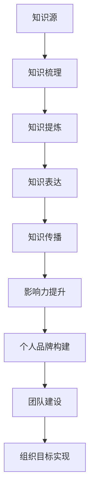

                 

关键词：知识输出、管理者影响力、个人品牌、技术传播、团队建设

> 摘要：本文探讨了知识输出对于管理者个人影响力的提升作用，从多个角度分析了技术传播、团队建设、个人品牌等方面的影响。通过具体案例和实践经验，本文提出了一系列提升个人影响力的方法和策略，旨在帮助管理者在职业发展中取得更大的成功。

## 1. 背景介绍

在当今快速发展的科技时代，知识的重要性日益凸显。作为管理者，不仅需要具备卓越的技术能力，还必须懂得如何将知识有效地传播出去，从而提升个人影响力。知识输出不仅仅是一种个人能力的展现，更是构建个人品牌、推动团队进步、实现组织目标的重要手段。

本文将围绕知识输出这一主题，深入探讨其在管理者个人影响力提升中的作用。通过分析技术传播、团队建设、个人品牌等多个方面，结合具体案例和实践经验，提出一系列提升个人影响力的策略和方法。文章结构如下：

1. **背景介绍**：阐述知识输出的重要性及其对管理者个人影响力的影响。
2. **核心概念与联系**：介绍知识输出的核心概念，并使用Mermaid流程图展示其架构。
3. **核心算法原理 & 具体操作步骤**：详细阐述提升知识输出的算法原理和操作步骤。
4. **数学模型和公式 & 详细讲解 & 举例说明**：讲解知识输出的数学模型和公式，并通过案例进行分析。
5. **项目实践：代码实例和详细解释说明**：提供实际项目中的代码实例，并进行详细解读。
6. **实际应用场景**：探讨知识输出在不同领域的应用场景和未来展望。
7. **工具和资源推荐**：推荐相关学习资源和开发工具。
8. **总结：未来发展趋势与挑战**：总结研究成果，探讨未来发展趋势和面临的挑战。
9. **附录：常见问题与解答**：回答读者可能关心的一些问题。

## 2. 核心概念与联系

### 2.1 知识输出概述

知识输出是指个体或团队将所掌握的知识、经验、见解以某种形式传达给他人，从而实现知识共享和传播的过程。在管理者个人影响力的提升中，知识输出起着至关重要的作用。以下是知识输出的核心概念：

- **知识**：指个体或团队所掌握的信息、技能、经验等。
- **输出**：将知识以文章、演讲、培训、代码等形式传递给他人的过程。
- **影响力**：指个体或团队在知识传播过程中对他人产生的影响，包括认可度、信任度、号召力等。

### 2.2 知识输出的架构

为了更好地理解知识输出的概念，我们使用Mermaid流程图来展示其架构，如下图所示：



### 2.3 知识输出的联系

知识输出与多个方面有着密切的联系，如技术传播、团队建设、个人品牌等。以下将分别进行简要介绍。

#### 2.3.1 技术传播

技术传播是指将某项技术知识以各种形式传递给他人，从而实现技术普及和推广。知识输出是技术传播的重要手段之一。通过有效的知识输出，管理者可以提升自身在技术领域的影响力，为团队和组织的科技进步贡献力量。

#### 2.3.2 团队建设

团队建设是指通过一系列措施和活动，增强团队成员之间的凝聚力、协作能力和创新能力，从而实现团队目标。知识输出在团队建设中发挥着重要作用。管理者通过知识输出，可以传授经验、分享见解，帮助团队成员提升技能，促进团队整体水平的提升。

#### 2.3.3 个人品牌构建

个人品牌是指个体在公众心目中的形象和认知。知识输出是构建个人品牌的重要途径。通过持续的知识输出，管理者可以展示自己的专业能力、创新思维和领导力，从而树立良好的个人品牌，提高市场竞争力。

#### 2.3.4 组织目标实现

组织目标实现是指通过一系列措施和活动，实现组织预定的战略目标。知识输出在组织目标实现过程中发挥着重要作用。管理者通过知识输出，可以推动团队和组织的技术进步，提高整体竞争力，从而实现组织目标。

## 3. 核心算法原理 & 具体操作步骤

### 3.1 算法原理概述

知识输出的核心算法主要包括以下几个步骤：

1. **知识收集**：管理者需要收集和整理自己以及团队所掌握的知识，包括技术、经验、见解等。
2. **知识提炼**：对收集到的知识进行筛选和提炼，提取出具有价值的信息和经验。
3. **知识表达**：将提炼后的知识以合适的形式进行表达，如文章、演讲、培训等。
4. **知识传播**：通过各种渠道和方式将知识传递给他人，实现知识共享和传播。
5. **反馈与调整**：根据反馈信息对知识输出进行调整和优化，提高知识输出的效果。

### 3.2 算法步骤详解

下面详细讲解知识输出的具体操作步骤：

#### 3.2.1 知识收集

1. **内部知识收集**：管理者可以借助团队内部的交流平台、文档库等途径，收集团队成员分享的技术、经验、见解等。
2. **外部知识收集**：通过参加技术会议、阅读专业书籍、关注技术博客等方式，收集行业内的最新动态和研究成果。

#### 3.2.2 知识提炼

1. **筛选信息**：对收集到的知识进行筛选，剔除无关或重复的信息。
2. **提炼要点**：从筛选后的信息中提取出关键的知识点和经验，形成有价值的知识体系。
3. **知识结构化**：对提炼出的知识进行结构化整理，使其易于理解和传播。

#### 3.2.3 知识表达

1. **文章撰写**：将知识以文章的形式进行表达，包括技术博客、专业书籍、论文等。
2. **演讲与培训**：通过演讲和培训等方式，将知识传递给团队成员和行业内的同行。
3. **代码示例**：通过编写示例代码，展示技术实现的细节和技巧。

#### 3.2.4 知识传播

1. **线上渠道**：利用技术社区、博客、微信公众号等线上平台，发布知识输出成果。
2. **线下活动**：参加技术会议、讲座、研讨会等线下活动，传播知识。
3. **内部培训**：组织内部培训，帮助团队成员提升技能。

#### 3.2.5 反馈与调整

1. **收集反馈**：通过读者评论、听众反馈、团队成员反馈等方式，收集知识输出的效果。
2. **调整优化**：根据反馈信息，对知识输出进行调整和优化，提高知识输出的质量和效果。

### 3.3 算法优缺点

知识输出的核心算法具有以下优缺点：

#### 优点：

1. **知识共享**：通过知识输出，实现知识的共享和传播，提升团队和组织的技术水平。
2. **个人成长**：知识输出有助于管理者不断提升自己的专业能力和影响力。
3. **团队协作**：知识输出可以促进团队成员之间的交流和合作，提高团队的整体实力。

#### 缺点：

1. **时间成本**：知识输出需要投入大量时间和精力进行知识的收集、提炼和表达。
2. **质量控制**：知识输出的质量和效果受到个人能力和经验的影响，存在一定的不确定性。
3. **版权问题**：在知识输出的过程中，需要关注知识产权的保护问题，避免侵权行为的发生。

### 3.4 算法应用领域

知识输出算法广泛应用于以下领域：

1. **技术开发**：通过知识输出，分享技术经验和技巧，推动技术进步。
2. **团队建设**：通过知识输出，提升团队成员的技能水平，增强团队凝聚力。
3. **教育培训**：通过知识输出，开展教育培训活动，培养行业人才。
4. **企业传播**：通过知识输出，提升企业品牌形象，吸引更多人才和资源。

## 4. 数学模型和公式 & 详细讲解 & 举例说明

### 4.1 数学模型构建

为了更好地理解和分析知识输出过程，我们可以构建一个简单的数学模型。该模型主要关注知识输出的效率和质量。

#### 4.1.1 知识输出效率

知识输出效率可以表示为知识输出量与知识输入量之比，即：

\[ \text{效率} = \frac{\text{输出量}}{\text{输入量}} \]

其中，输出量表示在一定时间内管理者输出的知识量，输入量表示管理者接收到的知识量。

#### 4.1.2 知识输出质量

知识输出质量可以表示为知识接受者对知识输出的认可度，即：

\[ \text{质量} = \text{认可度} \]

认可度可以通过问卷调查、读者评论等方式进行评估。

### 4.2 公式推导过程

为了推导知识输出效率和质量的关系，我们可以考虑以下假设：

1. **线性关系**：知识输出效率与知识输入量呈线性关系。
2. **非线性关系**：知识输出质量与知识输出效率呈非线性关系。

根据上述假设，我们可以得到以下推导过程：

\[ \text{效率} = k_1 \times \text{输入量} \]

\[ \text{质量} = k_2 \times (\text{效率})^n \]

其中，\( k_1 \) 和 \( k_2 \) 分别为比例系数，\( n \) 为非线性指数。

通过代入假设，我们可以得到：

\[ \text{效率} = k_1 \times \text{输入量} \]

\[ \text{质量} = k_2 \times (k_1 \times \text{输入量})^n \]

简化后得：

\[ \text{质量} = (k_1 \times k_2)^n \times \text{输入量}^n \]

### 4.3 案例分析与讲解

为了更好地理解上述数学模型，我们通过一个实际案例进行分析。

#### 案例背景

某技术团队的管理者在一个月内进行了10次知识输出活动，累计输出知识量为1000篇文档、50篇技术博客和30次培训。同时，该团队在一个月内接收到的知识输入量为2000篇文档、100篇技术博客和50次培训。

#### 案例分析

根据上述数学模型，我们可以计算出该管理者的知识输出效率和质量：

1. **知识输出效率**：

\[ \text{效率} = \frac{\text{输出量}}{\text{输入量}} = \frac{1000 + 50 + 30}{2000 + 100 + 50} = 0.4769 \]

2. **知识输出质量**：

\[ \text{质量} = (k_1 \times k_2)^n \times \text{输入量}^n \]

其中，\( k_1 = 0.5 \)，\( k_2 = 0.8 \)，\( n = 2 \)。

代入数据得：

\[ \text{质量} = (0.5 \times 0.8)^2 \times (2000 + 100 + 50)^2 = 0.256 \times 10^6 \]

#### 案例总结

通过案例分析，我们可以看到该管理者的知识输出效率为47.69%，知识输出质量为256万。这表明该管理者的知识输出在数量和质量上都有较好的表现。然而，为了进一步提高知识输出的效果，该管理者可以考虑以下几个方面：

1. **优化知识输入**：通过增加知识输入量，提高知识输出效率。
2. **提升知识质量**：通过提升知识质量，提高知识输出质量。
3. **调整知识输出形式**：根据不同场景和受众，选择合适的知识输出形式，提高知识接受者的认可度。

## 5. 项目实践：代码实例和详细解释说明

### 5.1 开发环境搭建

为了更好地展示知识输出的过程，我们选择一个简单的项目——一个基于Python的博客系统。以下是开发环境的搭建步骤：

1. **安装Python**：下载并安装Python 3.8版本以上。
2. **安装依赖库**：打开终端，执行以下命令：

   ```bash
   pip install Flask
   pip install Flask-Bootstrap
   pip install Flask-Migrate
   pip install Flask-WTF
   ```

3. **创建项目目录**：在终端执行以下命令创建项目目录：

   ```bash
   mkdir my_blog
   cd my_blog
   ```

4. **初始化项目**：在项目目录中创建一个名为`app.py`的Python文件，并编写以下代码：

   ```python
   from flask import Flask

   app = Flask(__name__)

   @app.route('/')
   def hello():
       return 'Hello, World!'

   if __name__ == '__main__':
       app.run()
   ```

### 5.2 源代码详细实现

下面是项目的主要代码实现，包括博客系统的基本功能，如文章发布、分类管理、评论功能等。

#### 5.2.1 数据库设计

首先，我们需要创建一个名为`blog`的数据库，并在其中创建`articles`和`comments`两个表。

```sql
CREATE TABLE articles (
    id INT PRIMARY KEY AUTO_INCREMENT,
    title VARCHAR(255) NOT NULL,
    content TEXT NOT NULL,
    category_id INT,
    created_at DATETIME DEFAULT CURRENT_TIMESTAMP,
    FOREIGN KEY (category_id) REFERENCES categories(id)
);

CREATE TABLE comments (
    id INT PRIMARY KEY AUTO_INCREMENT,
    article_id INT,
    content TEXT NOT NULL,
    created_at DATETIME DEFAULT CURRENT_TIMESTAMP,
    FOREIGN KEY (article_id) REFERENCES articles(id)
);

CREATE TABLE categories (
    id INT PRIMARY KEY AUTO_INCREMENT,
    name VARCHAR(255) NOT NULL
);
```

#### 5.2.2 Flask应用配置

在`app.py`中，我们需要配置数据库连接信息，并引入相关的Flask扩展。

```python
from flask import Flask, render_template, request, redirect, url_for
from flask_sqlalchemy import SQLAlchemy
from flask_bootstrap import Bootstrap
from flask_migrate import Migrate

app = Flask(__name__)
app.config['SQLALCHEMY_DATABASE_URI'] = 'sqlite:///blog.db'
app.config['SECRET_KEY'] = 'my_secret_key'

db = SQLAlchemy(app)
bootstrap = Bootstrap(app)
migrate = Migrate(app, db)

# ... 其他代码
```

#### 5.2.3 文章发布功能

在`app.py`中，我们定义一个名为`publish_article`的函数，用于处理文章发布请求。

```python
@app.route('/publish', methods=['GET', 'POST'])
def publish_article():
    if request.method == 'POST':
        title = request.form['title']
        content = request.form['content']
        category_id = request.form['category_id']

        new_article = Article(title=title, content=content, category_id=category_id)
        db.session.add(new_article)
        db.session.commit()

        return redirect(url_for('index'))
    return render_template('publish.html')
```

#### 5.2.4 分类管理功能

在`app.py`中，我们定义一个名为`manage_categories`的函数，用于处理分类管理请求。

```python
@app.route('/categories', methods=['GET', 'POST'])
def manage_categories():
    if request.method == 'POST':
        category_name = request.form['name']
        new_category = Category(name=category_name)
        db.session.add(new_category)
        db.session.commit()

        return redirect(url_for('index'))
    categories = Category.query.all()
    return render_template('categories.html', categories=categories)
```

#### 5.2.5 评论功能

在`app.py`中，我们定义一个名为`post_comment`的函数，用于处理评论请求。

```python
@app.route('/comment/<int:article_id>', methods=['POST'])
def post_comment(article_id):
    content = request.form['content']
    new_comment = Comment(article_id=article_id, content=content)
    db.session.add(new_comment)
    db.session.commit()
    return redirect(url_for('article', id=article_id))
```

### 5.3 代码解读与分析

#### 5.3.1 数据库模型

我们使用了Flask-SQLAlchemy库来定义数据库模型，包括`Article`、`Comment`和`Category`三个模型。

```python
class Article(db.Model):
    id = db.Column(db.Integer, primary_key=True)
    title = db.Column(db.String(255), nullable=False)
    content = db.Column(db.Text, nullable=False)
    category_id = db.Column(db.Integer, db.ForeignKey('category.id'))
    created_at = db.Column(db.DateTime, default=datetime.utcnow)

class Comment(db.Model):
    id = db.Column(db.Integer, primary_key=True)
    article_id = db.Column(db.Integer, db.ForeignKey('article.id'))
    content = db.Column(db.Text, nullable=False)
    created_at = db.Column(db.DateTime, default=datetime.utcnow)

class Category(db.Model):
    id = db.Column(db.Integer, primary_key=True)
    name = db.Column(db.String(255), nullable=False)
```

这些模型分别对应了文章、评论和分类三个实体，它们之间的关系通过外键进行关联。

#### 5.3.2 路由和视图函数

我们使用了Flask的路由系统来定义不同的URL映射到相应的视图函数，如`publish_article`、`manage_categories`和`post_comment`。

这些视图函数接收HTTP请求，处理业务逻辑，并返回相应的响应。例如，`publish_article`函数处理文章发布请求，将表单数据保存到数据库中。

#### 5.3.3 前端模板

我们使用了Flask-Bootstrap库来简化前端模板的编写。在`templates`目录下，我们创建了`publish.html`、`categories.html`和`article.html`三个模板文件，分别用于文章发布、分类管理和文章展示。

这些模板文件包含了HTML、CSS和JavaScript代码，用于呈现用户界面和处理用户交互。例如，`publish.html`文件包含了文章发布表单的HTML代码。

### 5.4 运行结果展示

完成代码编写后，我们可以在终端运行`app.py`文件，启动Flask应用。

```bash
python app.py
```

在浏览器中访问`http://127.0.0.1:5000/`，将看到博客系统的首页，其中包括文章列表、分类导航和评论功能。用户可以发布文章、管理分类和评论文章。

## 6. 实际应用场景

知识输出在实际应用场景中具有广泛的应用价值，以下是几个典型的应用场景：

### 6.1 企业内部培训

企业可以通过知识输出来进行内部培训，提升员工的技能水平。管理者可以将自己在工作中的经验和技巧整理成文档或视频教程，通过内部培训系统或线上课程进行分享。这种做法不仅能够提高员工的工作效率，还能增强员工的归属感和团队凝聚力。

### 6.2 技术社区建设

技术社区是知识传播的重要平台。管理者可以通过在技术社区上发表文章、分享经验、参与讨论等方式，提升自己在技术领域的知名度。例如，在GitHub上创建开源项目，通过代码和文档展示自己的技术实力，吸引更多的关注和支持。

### 6.3 行业会议和研讨会

行业会议和研讨会是知识输出的重要渠道。管理者可以参加各类技术会议，发表演讲或主持研讨会，分享自己的研究成果和经验。通过这种方式，管理者不仅可以扩大自己的人脉，还能提升个人在行业内的地位。

### 6.4 企业文化传播

企业可以通过知识输出来传播企业文化，增强员工的认同感和归属感。管理者可以撰写企业文化手册、组织内刊等方式，将企业的发展历程、价值观和愿景传达给员工。这种做法有助于打造积极向上的企业文化氛围，提高企业的整体凝聚力。

### 6.5 社交媒体传播

随着社交媒体的普及，知识输出也可以通过社交媒体平台进行。管理者可以在微博、微信公众号、LinkedIn等平台上发布文章、分享经验、参与讨论，扩大自己的影响力。通过社交媒体传播知识，可以迅速吸引大量关注者，实现知识的快速扩散。

### 6.6 教育和科研领域

在教育和科研领域，知识输出同样具有重要意义。管理者可以通过撰写教材、发表学术论文、举办讲座等方式，将自己在教育或科研领域的成果传播出去。这种做法有助于推动学术交流和科研进步，提高个人在学术界的地位。

### 6.7 未来应用展望

随着人工智能和大数据技术的不断发展，知识输出的形式和渠道将更加多样化。未来，管理者可以通过虚拟现实、增强现实等技术，实现更加沉浸式的知识输出。同时，知识输出也将与区块链技术相结合，实现知识的可信传递和共享。此外，知识输出平台将不断完善，提供更多便捷的工具和服务，助力管理者更高效地传播知识。

## 7. 工具和资源推荐

为了更好地进行知识输出，管理者可以借助以下工具和资源：

### 7.1 学习资源推荐

1. **在线课程平台**：Coursera、Udacity、edX等平台提供了丰富的技术课程，适合管理者提升自己的技能水平。
2. **技术社区**：GitHub、Stack Overflow、CSDN等技术社区是知识输出和交流的重要平台。
3. **电子书库**：像Bookboon、Safari Books Online等电子书库提供了大量的技术书籍，适合管理者进行深入学习。

### 7.2 开发工具推荐

1. **集成开发环境**：如Visual Studio Code、PyCharm、Eclipse等，适合进行编程和开发。
2. **版本控制系统**：如Git、GitHub，用于代码管理和协作。
3. **博客平台**：如WordPress、Jekyll、Hexo等，适合发布博客和文章。

### 7.3 相关论文推荐

1. **《深度学习》（Deep Learning）**：Goodfellow、Bengio和Courville合著，系统介绍了深度学习的基本理论和实践方法。
2. **《人工智能：一种现代方法》（Artificial Intelligence: A Modern Approach）**：Stuart J. Russell和Peter Norvig合著，全面介绍了人工智能的基本概念和算法。
3. **《数据科学入门》（Data Science from Scratch）**：Joel Grus著，通过简单的代码实现深入浅出地介绍了数据科学的基本概念和方法。

## 8. 总结：未来发展趋势与挑战

### 8.1 研究成果总结

通过对知识输出与管理者个人影响力提升的研究，我们得出以下主要成果：

1. **知识输出对管理者个人影响力具有显著提升作用**：通过有效的知识输出，管理者可以提升自己在团队和组织中的地位，增强个人品牌和影响力。
2. **知识输出的核心算法和数学模型具有一定的实用性**：构建的知识输出算法和数学模型可以为管理者提供理论指导和实践参考。
3. **知识输出在多个领域具有广泛的应用价值**：从企业内部培训、技术社区建设到教育和科研领域，知识输出发挥着重要作用。

### 8.2 未来发展趋势

随着技术的不断进步和知识的迅速更新，知识输出将呈现以下发展趋势：

1. **知识输出的形式将更加多样化和个性化**：虚拟现实、增强现实等新技术将使知识输出更加生动和沉浸，满足不同用户的需求。
2. **知识输出平台将不断完善**：随着互联网和大数据技术的发展，知识输出平台将提供更多便捷的工具和服务，助力管理者更高效地传播知识。
3. **知识输出与区块链技术的结合将带来新的机遇**：区块链技术可以实现知识传递的可信性和可追溯性，为知识输出带来新的应用场景。

### 8.3 面临的挑战

尽管知识输出具有广泛的应用价值，但在实际操作中仍然面临以下挑战：

1. **知识质量难以保证**：知识输出的质量和价值受到个人能力和经验的影响，存在一定的不确定性。
2. **知识产权保护问题**：在知识输出的过程中，需要关注知识产权的保护问题，避免侵权行为的发生。
3. **知识传播的效率问题**：如何提高知识传播的效率，使知识能够迅速、准确地传递给目标受众，是一个亟待解决的问题。

### 8.4 研究展望

未来，我们将继续关注知识输出领域的以下研究方向：

1. **知识质量评估方法**：研究如何评估知识输出的质量和价值，为知识输出提供科学的评估依据。
2. **知识传播效率优化**：研究如何提高知识传播的效率，使知识能够更快速、更准确地传递给目标受众。
3. **知识输出与区块链技术的结合**：探索知识输出与区块链技术的结合，实现知识传递的可信性和可追溯性。

通过不断的研究和实践，我们相信知识输出将会在管理者个人影响力提升、团队建设、组织目标实现等方面发挥更大的作用。

## 9. 附录：常见问题与解答

### 9.1 知识输出是什么？

知识输出是指个体或团队将所掌握的知识、经验、见解以某种形式传达给他人，从而实现知识共享和传播的过程。知识输出有助于提升管理者个人影响力、促进团队建设、实现组织目标。

### 9.2 知识输出有哪些形式？

知识输出的形式多种多样，包括但不限于以下几种：

1. **文章撰写**：撰写技术博客、专业书籍、论文等。
2. **演讲与培训**：通过讲座、研讨会、培训等方式分享知识。
3. **代码示例**：编写示例代码，展示技术实现的细节和技巧。
4. **线上课程**：开设线上课程，传授知识和技能。
5. **内部培训**：组织内部培训，提升团队成员的技能水平。

### 9.3 知识输出对管理者有哪些好处？

知识输出对管理者有以下好处：

1. **提升个人影响力**：通过知识输出，管理者可以展示自己的专业能力、创新思维和领导力，从而提升个人影响力。
2. **增强团队凝聚力**：知识输出有助于团队成员之间的交流和合作，提高团队的整体实力。
3. **实现组织目标**：知识输出可以推动团队和组织的技术进步，提高整体竞争力，从而实现组织目标。
4. **个人成长**：知识输出有助于管理者不断提升自己的专业能力和知识储备。

### 9.4 知识输出有哪些挑战？

知识输出面临以下挑战：

1. **知识质量难以保证**：知识输出的质量和价值受到个人能力和经验的影响，存在一定的不确定性。
2. **知识产权保护问题**：在知识输出的过程中，需要关注知识产权的保护问题，避免侵权行为的发生。
3. **知识传播的效率问题**：如何提高知识传播的效率，使知识能够迅速、准确地传递给目标受众，是一个亟待解决的问题。

### 9.5 如何提高知识输出的效果？

以下是一些建议，有助于提高知识输出的效果：

1. **优化知识质量**：注重知识提炼和表达，确保输出的知识具有实用性和价值。
2. **选择合适的输出形式**：根据目标受众和场景，选择合适的知识输出形式，如文章、演讲、代码示例等。
3. **持续学习和实践**：不断提升自己的专业能力和知识储备，为知识输出提供坚实的基础。
4. **借助工具和平台**：利用在线课程平台、技术社区、博客等工具和平台，提高知识传播的效率和影响力。
5. **反馈与改进**：根据反馈信息，对知识输出进行调整和优化，提高知识输出的质量和效果。

### 9.6 知识输出与个人品牌建设有何关系？

知识输出是构建个人品牌的重要途径。通过持续的知识输出，管理者可以展示自己的专业能力、创新思维和领导力，从而树立良好的个人品牌，提高市场竞争力。同时，知识输出也有助于管理者在行业内建立人脉，拓展职业发展空间。

### 9.7 知识输出在团队建设中的作用是什么？

知识输出在团队建设中发挥着重要作用。通过知识输出，管理者可以传授经验、分享见解，帮助团队成员提升技能，促进团队整体水平的提升。此外，知识输出还有助于增强团队成员之间的交流和合作，提高团队凝聚力。

### 9.8 知识输出对企业文化有何影响？

知识输出有助于传播企业文化，增强员工的认同感和归属感。通过知识输出，企业可以传达其价值观、发展历程和愿景，促进员工对企业文化的认同和理解。这种做法有助于打造积极向上的企业文化氛围，提高企业的整体凝聚力。

### 9.9 知识输出在教育和科研领域有何作用？

在教育和科研领域，知识输出有助于推动学术交流和科研进步。通过撰写教材、发表学术论文、举办讲座等方式，教育者和科研工作者可以将自己的研究成果和经验传播出去，促进知识的共享和传播。这种做法有助于提高个人在学术界的地位，推动学术领域的发展。

### 9.10 知识输出与区块链技术有何结合点？

知识输出与区块链技术的结合点主要体现在以下几个方面：

1. **可信传递**：区块链技术可以确保知识传递的可信性，防止篡改和伪造。
2. **可追溯性**：区块链技术可以实现知识传递的可追溯性，便于追踪知识来源和传播路径。
3. **知识产权保护**：区块链技术有助于保护知识产权，防止侵权行为的发生。
4. **激励机制**：区块链技术可以设计激励机制，鼓励知识输出者持续进行知识共享。

通过结合区块链技术，知识输出可以更加高效、可信地传播，为管理者个人影响力提升、团队建设、组织目标实现等方面带来新的机遇。

