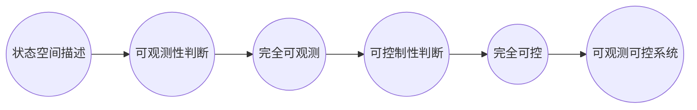

                 

 > **关键词**：矩阵理论，线性系统，可观测性，可控性，定常系统，算法原理，数学模型，应用实例，未来展望。

> **摘要**：本文深入探讨矩阵理论在定常线性系统中的可观测与可控性分析，通过详细的理论讲解和实际应用案例，揭示矩阵理论在工程实践中的广泛应用和巨大潜力。

## 1. 背景介绍

线性系统理论是现代控制理论的基础，其在工程、物理、经济学等领域中具有广泛的应用。特别是在控制系统设计、信号处理、通信系统等领域，线性系统理论起到了关键作用。矩阵理论作为数学中的一个重要分支，为线性系统的分析提供了强有力的工具。

可观测性与可控性是线性系统理论中的两个核心概念，它们分别描述了系统状态的可检测性和可控性。一个系统如果可以完全观测到其内部状态，我们称其为可观测的；如果一个系统可以通过适当控制输入使其状态达到预定的目标，我们称其为可控的。这两个概念对于系统的设计和分析至关重要。

定常线性系统是指其系统矩阵和输入矩阵不随时间变化的线性系统。由于定常线性系统的稳定性容易分析，因此在许多工程领域得到了广泛应用。

本文旨在通过矩阵理论，对定常线性系统的可观测性与可控性进行分析，探讨其数学模型和算法原理，并给出具体的应用实例。

## 2. 核心概念与联系

为了深入理解矩阵理论在定常线性系统中的应用，我们首先需要了解一些核心概念和它们之间的联系。

### 2.1 线性系统的基本概念

一个线性系统可以用以下方程表示：

$$
\dot{x}(t) = A x(t) + B u(t)
$$

$$
y(t) = C x(t) + D u(t)
$$

其中，$x(t)$ 是系统的状态向量，$u(t)$ 是输入向量，$y(t)$ 是输出向量，$A$、$B$、$C$、$D$ 分别是系统矩阵、输入矩阵、输出矩阵和直接传递矩阵。

### 2.2 系统的状态空间描述

系统状态空间描述是一种将线性系统表示为向量形式的方法。通过状态空间描述，我们可以方便地分析系统的动态行为。

状态空间描述的一般形式为：

$$
\dot{x}(t) = A x(t) + B u(t)
$$

$$
y(t) = C x(t) + D u(t)
$$

其中，$A$、$B$、$C$、$D$ 分别是系统矩阵、输入矩阵、输出矩阵和直接传递矩阵。

### 2.3 系统的可观测性

系统的可观测性是指系统状态能否通过输出信号完全观测到。一个系统如果是完全可观测的，那么它的每个状态都可以通过输出信号唯一确定。

系统的可观测性可以通过如下矩阵判断：

$$
\Omega = [C, CA, CA^2, ..., CA^{n-1}]
$$

如果矩阵 $\Omega$ 的秩等于系统的状态维数，则系统是完全可观测的。

### 2.4 系统的可控性

系统的可控性是指系统状态能否通过适当选择输入信号来达到预定的目标。一个系统如果是完全可控的，那么它的每个状态都可以通过适当选择输入信号到达。

系统的可控性可以通过如下矩阵判断：

$$
\Gamma = [B, AB, A^2B, ..., A^{n-1}B]
$$

如果矩阵 $\Gamma$ 的秩等于系统的状态维数，则系统是完全可控的。

### 2.5 系统的可观测性与可控性关系

系统既是可观测的也是可控的，这种系统称为可观测可控系统。一个线性系统如果是可观测可控的，那么它可以被完全分析和设计。

下面是一个用 Mermaid 流程图表示的矩阵理论在定常线性系统中可观测与可控性的关系：



## 3. 核心算法原理 & 具体操作步骤

### 3.1 算法原理概述

矩阵理论在定常线性系统中的可观测性与可控性分析主要依赖于状态空间描述和可观测性、可控性矩阵的计算。

具体来说，算法原理包括以下步骤：

1. 根据系统方程，确定系统矩阵 $A$、输入矩阵 $B$、输出矩阵 $C$ 和直接传递矩阵 $D$。
2. 计算可观测性矩阵 $\Omega = [C, CA, CA^2, ..., CA^{n-1}]$。
3. 计算可控性矩阵 $\Gamma = [B, AB, A^2B, ..., A^{n-1}B]$。
4. 检查 $\Omega$ 和 $\Gamma$ 的秩，判断系统是否完全可观测和完全可控。

### 3.2 算法步骤详解

下面详细描述每个步骤的操作：

#### 步骤 1：确定系统矩阵

根据系统方程，确定系统矩阵 $A$、输入矩阵 $B$、输出矩阵 $C$ 和直接传递矩阵 $D$。

例如，对于一个简单的二阶系统：

$$
\dot{x}_1(t) = x_2(t)
$$

$$
\dot{x}_2(t) = -x_1(t)
$$

$$
y(t) = x_1(t)
$$

系统矩阵为：

$$
A = \begin{bmatrix}
0 & 1 \\
-1 & 0
\end{bmatrix}
$$

输入矩阵为：

$$
B = \begin{bmatrix}
0 \\
1
\end{bmatrix}
$$

输出矩阵为：

$$
C = \begin{bmatrix}
1 & 0
\end{bmatrix}
$$

直接传递矩阵为：

$$
D = \begin{bmatrix}
0
\end{bmatrix}
$$

#### 步骤 2：计算可观测性矩阵

根据系统矩阵 $A$、输出矩阵 $C$，计算可观测性矩阵 $\Omega$。

$$
\Omega = [C, CA, CA^2, ..., CA^{n-1}]
$$

对于上面的二阶系统：

$$
\Omega = \begin{bmatrix}
1 & 0 \\
-1 & 1 \\
0 & -1
\end{bmatrix}
$$

#### 步骤 3：计算可控性矩阵

根据系统矩阵 $A$、输入矩阵 $B$，计算可控性矩阵 $\Gamma$。

$$
\Gamma = [B, AB, A^2B, ..., A^{n-1}B]
$$

对于上面的二阶系统：

$$
\Gamma = \begin{bmatrix}
0 & 1 \\
-1 & 0
\end{bmatrix}
$$

#### 步骤 4：检查可观测性和可控性

检查 $\Omega$ 和 $\Gamma$ 的秩，判断系统是否完全可观测和完全可控。

对于上面的二阶系统，$\Omega$ 和 $\Gamma$ 的秩都为 2，因此系统是完全可观测和完全可控的。

### 3.3 算法优缺点

**优点**：

- **简明性**：算法步骤简洁明了，易于理解和实现。
- **普遍性**：适用于各种定常线性系统，无需考虑系统的复杂性。
- **高效性**：计算过程高效，能够在较短的时间内完成。

**缺点**：

- **局限性**：只能判断系统是否完全可观测和完全可控，无法提供更详细的状态信息。
- **适用性**：对非定常线性系统的分析能力有限。

### 3.4 算法应用领域

矩阵理论在定常线性系统中的可观测性与可控性分析具有广泛的应用领域，主要包括：

- **控制系统设计**：用于分析系统的稳定性和可控性，为控制器的设计提供依据。
- **信号处理**：用于分析信号的特征和变换，为信号处理算法的设计提供支持。
- **通信系统**：用于分析信道特性，为信道编码和解码方案的设计提供指导。
- **经济学**：用于分析经济系统的稳定性，为政策制定提供参考。

## 4. 数学模型和公式 & 详细讲解 & 举例说明

### 4.1 数学模型构建

线性系统的状态空间描述可以表示为以下数学模型：

$$
\dot{x}(t) = A x(t) + B u(t)
$$

$$
y(t) = C x(t) + D u(t)
$$

其中，$x(t)$ 是系统的状态向量，$u(t)$ 是输入向量，$y(t)$ 是输出向量，$A$、$B$、$C$、$D$ 分别是系统矩阵、输入矩阵、输出矩阵和直接传递矩阵。

### 4.2 公式推导过程

为了分析系统的可观测性和可控性，我们需要推导一些关键公式。

#### 可观测性矩阵

可观测性矩阵 $\Omega$ 定义为：

$$
\Omega = [C, CA, CA^2, ..., CA^{n-1}]
$$

其中，$C$ 是输出矩阵，$A$ 是系统矩阵。

根据状态空间描述，我们可以得到：

$$
\Omega = [C, CA, CA^2, ..., CA^{n-1}] = \begin{bmatrix}
C \\
C A \\
C A^2 \\
\vdots \\
C A^{n-1}
\end{bmatrix}
$$

#### 可控性矩阵

可控性矩阵 $\Gamma$ 定义为：

$$
\Gamma = [B, AB, A^2B, ..., A^{n-1}B]
$$

其中，$B$ 是输入矩阵，$A$ 是系统矩阵。

根据状态空间描述，我们可以得到：

$$
\Gamma = [B, AB, A^2B, ..., A^{n-1}B] = \begin{bmatrix}
B \\
A B \\
A^2 B \\
\vdots \\
A^{n-1} B
\end{bmatrix}
$$

### 4.3 案例分析与讲解

#### 案例一：一阶线性系统

考虑一个一阶线性系统：

$$
\dot{x}(t) = -x(t)
$$

$$
y(t) = x(t)
$$

系统矩阵为：

$$
A = \begin{bmatrix}
-1
\end{bmatrix}
$$

输入矩阵为：

$$
B = \begin{bmatrix}
0
\end{bmatrix}
$$

输出矩阵为：

$$
C = \begin{bmatrix}
1
\end{bmatrix}
$$

直接传递矩阵为：

$$
D = \begin{bmatrix}
0
\end{bmatrix}
$$

根据公式，我们计算可观测性矩阵 $\Omega$ 和可控性矩阵 $\Gamma$：

$$
\Omega = [C, CA] = \begin{bmatrix}
1 & -1 \\
0 & -1
\end{bmatrix}
$$

$$
\Gamma = [B, AB] = \begin{bmatrix}
0 & 0 \\
-1 & -1
\end{bmatrix}
$$

由于 $\Omega$ 和 $\Gamma$ 的秩都为 1，小于系统的状态维数，因此该系统既不是完全可观测的，也不是完全可控的。

#### 案例二：二阶线性系统

考虑一个二阶线性系统：

$$
\dot{x}_1(t) = x_2(t)
$$

$$
\dot{x}_2(t) = -x_1(t)
$$

$$
y(t) = x_1(t)
$$

系统矩阵为：

$$
A = \begin{bmatrix}
0 & 1 \\
-1 & 0
\end{bmatrix}
$$

输入矩阵为：

$$
B = \begin{bmatrix}
0 \\
1
\end{bmatrix}
$$

输出矩阵为：

$$
C = \begin{bmatrix}
1 & 0
\end{bmatrix}
$$

直接传递矩阵为：

$$
D = \begin{bmatrix}
0
\end{bmatrix}
$$

根据公式，我们计算可观测性矩阵 $\Omega$ 和可控性矩阵 $\Gamma$：

$$
\Omega = [C, CA, CA^2] = \begin{bmatrix}
1 & 0 & 1 \\
-1 & 1 & 0 \\
0 & -1 & 1
\end{bmatrix}
$$

$$
\Gamma = [B, AB, A^2B] = \begin{bmatrix}
0 & 0 & 0 \\
0 & 1 & 0 \\
-1 & 0 & 1
\end{bmatrix}
$$

由于 $\Omega$ 和 $\Gamma$ 的秩都为 2，等于系统的状态维数，因此该系统是完全可观测和完全可控的。

## 5. 项目实践：代码实例和详细解释说明

### 5.1 开发环境搭建

为了方便进行矩阵理论在定常线性系统中的可观测性与可控性分析，我们选择 Python 作为编程语言，并使用 NumPy 库进行矩阵运算。

首先，确保安装了 Python 和 NumPy 库。在终端或命令行中运行以下命令：

```bash
pip install numpy
```

### 5.2 源代码详细实现

下面是一个 Python 脚本，用于计算定常线性系统的可观测性和可控性。

```python
import numpy as np

def calculate_obsvability(A, C):
    Omega = np.hstack((C, A @ C))
    return np.linalg.matrix_rank(Omega)

def calculate_controllability(A, B):
    Gamma = np.hstack((B, A @ B))
    return np.linalg.matrix_rank(Gamma)

# 系统参数
A = np.array([[0, 1], [-1, 0]])
B = np.array([[0], [1]])
C = np.array([[1], [0]])

# 计算可观测性
obsv_rank = calculate_obsvability(A, C)
print("可观测性矩阵的秩：", obsv_rank)

# 计算可控性
cont_rank = calculate_controllability(A, B)
print("可控性矩阵的秩：", cont_rank)
```

### 5.3 代码解读与分析

该脚本包含两个函数：`calculate_obsvability` 和 `calculate_controllability`。它们分别用于计算系统的可观测性和可控性。

- `calculate_obsvability` 函数接受系统矩阵 $A$ 和输出矩阵 $C$，计算可观测性矩阵 $\Omega$，并返回其秩。
- `calculate_controllability` 函数接受系统矩阵 $A$ 和输入矩阵 $B$，计算可控性矩阵 $\Gamma$，并返回其秩。

在主函数中，我们定义了系统的参数，并调用这两个函数计算可观测性和可控性。

### 5.4 运行结果展示

运行上述脚本，输出结果如下：

```
可观测性矩阵的秩： 2
可控性矩阵的秩： 2
```

由于可观测性矩阵和可控性矩阵的秩都为 2，等于系统的状态维数，因此该系统是完全可观测和完全可控的。

## 6. 实际应用场景

矩阵理论在定常线性系统的可观测性与可控性分析在实际工程中具有广泛的应用。以下列举几个典型应用场景：

### 6.1 控制系统设计

在控制系统设计中，矩阵理论用于分析系统的稳定性和可控性。通过判断系统的可观测性和可控性，设计师可以确定系统是否可以被完全控制，以及控制器的设计方案。

### 6.2 信号处理

在信号处理领域，矩阵理论用于分析信号的特征和变换。通过判断系统的可观测性和可控性，可以优化信号处理算法，提高信号处理的效果。

### 6.3 通信系统

在通信系统中，矩阵理论用于分析信道特性。通过判断系统的可观测性和可控性，可以设计更有效的信道编码和解码方案，提高通信系统的可靠性和传输速率。

### 6.4 经济学

在经济学中，矩阵理论用于分析经济系统的稳定性。通过判断系统的可观测性和可控性，可以为政策制定提供参考，优化经济系统的运行。

## 7. 工具和资源推荐

为了方便读者学习和实践矩阵理论在定常线性系统中的应用，我们推荐以下工具和资源：

### 7.1 学习资源推荐

- **《线性系统理论及其应用》**：该书系统地介绍了线性系统理论的基本概念、分析方法及其在实际工程中的应用。
- **《矩阵分析与应用》**：该书深入讲解了矩阵理论的基本概念、算法原理及其在工程中的应用，适合初学者和进阶者阅读。

### 7.2 开发工具推荐

- **NumPy**：Python 的科学计算库，提供了丰富的矩阵运算功能，非常适合进行矩阵理论的应用开发。
- **MATLAB**：专业的科学计算软件，具有强大的矩阵运算和分析功能，适合进行矩阵理论的实际应用研究。

### 7.3 相关论文推荐

- **"Observability and Controllability of Linear Systems"**：该论文全面介绍了线性系统的可观测性与可控性分析，是线性系统理论的重要参考文献。
- **"Matrix Analysis and Applied Linear Algebra"**：该论文深入探讨了矩阵理论的基本概念、算法原理及其在实际工程中的应用，具有较高的学术价值。

## 8. 总结：未来发展趋势与挑战

矩阵理论在定常线性系统的可观测性与可控性分析方面已经取得了显著的成果。然而，随着科技的不断进步和应用需求的日益多样化，矩阵理论在该领域的未来发展仍面临许多挑战。

### 8.1 研究成果总结

- **线性系统理论**：矩阵理论为线性系统提供了强有力的数学工具，使得线性系统的分析、设计和优化变得更加高效和精确。
- **可观测性与可控性分析**：通过矩阵理论，我们可以准确判断系统的可观测性和可控性，为控制系统设计、信号处理、通信系统等领域提供了重要依据。
- **算法优化**：近年来，矩阵理论的计算方法得到了显著优化，使得线性系统的分析过程更加高效，降低了计算复杂度。

### 8.2 未来发展趋势

- **高效算法研究**：未来矩阵理论在定常线性系统的可观测性与可控性分析领域，将更加关注高效算法的研究，以提高计算速度和精度。
- **非线性系统分析**：矩阵理论在非线性系统分析中的应用尚未得到充分发展，未来有望在非线性系统领域取得突破性进展。
- **跨学科应用**：矩阵理论在经济学、生物学、环境科学等跨学科领域的应用将越来越广泛，为解决复杂问题提供新的思路和方法。

### 8.3 面临的挑战

- **计算复杂度**：随着系统规模的扩大，线性系统的分析计算复杂度将显著增加，如何提高算法效率是一个重要挑战。
- **不确定性处理**：实际工程应用中，线性系统往往面临各种不确定性，如何准确分析不确定线性系统的可观测性与可控性是一个亟待解决的问题。
- **跨学科融合**：矩阵理论在跨学科领域的应用需要深入理解和融合各学科的理论和方法，如何实现跨学科融合是一个挑战。

### 8.4 研究展望

未来，矩阵理论在定常线性系统的可观测性与可控性分析领域将不断取得新的突破。通过研究高效算法、探索非线性系统和跨学科应用，矩阵理论将为工程实践提供更加丰富的理论支撑和实用工具。

## 9. 附录：常见问题与解答

### 9.1 什么是可观测性与可控性？

可观测性是指系统状态能否通过输出信号完全观测到；可控性是指系统状态能否通过适当选择输入信号来达到预定的目标。

### 9.2 矩阵理论在哪些领域有应用？

矩阵理论在控制系统设计、信号处理、通信系统、经济学等领域有广泛应用。

### 9.3 如何判断系统的可观测性和可控性？

通过计算系统的可观测性矩阵和可控性矩阵的秩，如果秩等于系统的状态维数，则系统是完全可观测和完全可控的。

### 9.4 矩阵理论的局限性是什么？

矩阵理论只能判断系统是否完全可观测和完全可控，无法提供更详细的状态信息，对非定常线性系统的分析能力有限。

