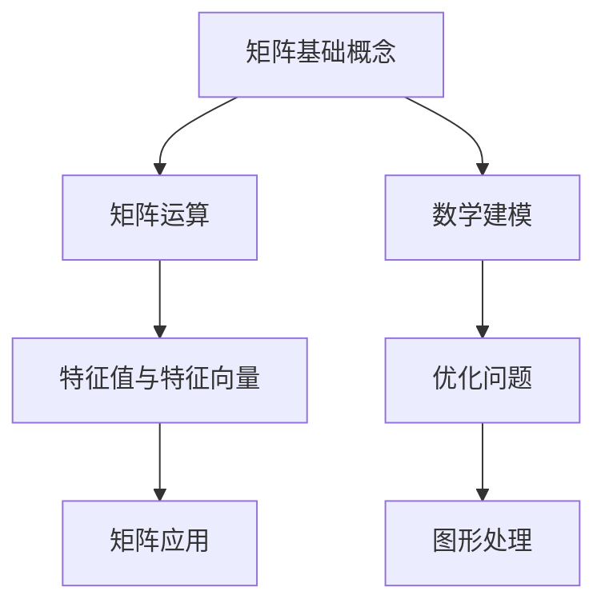

                 

关键词：矩阵理论、线性代数、矩阵运算、特征值与特征向量、应用领域、算法分析

摘要：本文将深入探讨矩阵理论及其在计算机科学中的应用。我们将首先介绍矩阵的基本概念和运算，然后讨论矩阵在特征值与特征向量分析中的应用，并探讨矩阵理论在优化问题和图形处理等领域中的实际应用。最后，我们将总结本文的主要内容，并对矩阵理论在未来技术发展中的潜在作用进行展望。

## 1. 背景介绍

矩阵理论是线性代数的一个核心组成部分，它在数学、物理学、工程学以及计算机科学等多个领域都有广泛的应用。矩阵作为一种数学工具，可以用来表示线性变换、系统状态、数据关系等复杂结构。线性代数中的许多基本概念和工具，如向量、行列式、矩阵乘法等，都是现代科学计算和工程分析不可或缺的基础。

在计算机科学中，矩阵理论有着广泛的应用。例如，图形处理中的二维和三维图形变换，神经网络中的权重矩阵，优化问题中的目标函数表示，以及算法设计中路径查找和图论问题，都依赖于矩阵理论。矩阵理论不仅是算法分析的基础，也为复杂系统的建模和求解提供了强有力的工具。

本文的结构如下：首先，我们将介绍矩阵的基本概念和运算；接着，深入探讨特征值与特征向量的概念及其应用；然后，分析矩阵在优化问题和图形处理中的应用；最后，总结矩阵理论的核心成果，并提出未来研究的方向和挑战。

## 2. 核心概念与联系

### 2.1. 矩阵的基本概念

矩阵（Matrix）是一个由数字组成的矩形数组，通常用大写字母表示，如 \(A\)。矩阵中的每个元素都有一个行号和列号，用小写字母表示，如 \(a_{ij}\)，其中 \(i\) 表示行号，\(j\) 表示列号。

例如：

\[ A = \begin{bmatrix} 1 & 2 \\ 3 & 4 \end{bmatrix} \]

这个矩阵 \(A\) 有两行两列，所以它是一个 \(2 \times 2\) 的矩阵。

### 2.2. 矩阵的运算

矩阵的运算主要包括加法、减法、乘法以及转置。

- **加法和减法**：只有两个矩阵的行数和列数相同，才能进行加法或减法运算。两个矩阵相加或相减，就是对应位置上的元素相加或相减。

\[ A + B = \begin{bmatrix} 1+1 & 2+2 \\ 3+3 & 4+4 \end{bmatrix} = \begin{bmatrix} 2 & 4 \\ 6 & 8 \end{bmatrix} \]

- **乘法**：矩阵乘法要求第一个矩阵的列数与第二个矩阵的行数相同。乘法的结果是一个新矩阵，其元素是原矩阵对应元素的乘积之和。

\[ AB = \begin{bmatrix} 1 \cdot 1 + 2 \cdot 3 & 1 \cdot 2 + 2 \cdot 4 \\ 3 \cdot 1 + 4 \cdot 3 & 3 \cdot 2 + 4 \cdot 4 \end{bmatrix} = \begin{bmatrix} 7 & 10 \\ 15 & 22 \end{bmatrix} \]

- **转置**：矩阵的转置是将矩阵的行和列交换。例如，矩阵 \(A\) 的转置记为 \(A'\) 或 \(A^T\)。

\[ A^T = \begin{bmatrix} 1 & 3 \\ 2 & 4 \end{bmatrix} \]

### 2.3. 特征值与特征向量

特征值（Eigenvalue）和特征向量（Eigenvector）是矩阵理论中的重要概念。

- **特征值**：对于矩阵 \(A\)，如果存在一个非零向量 \(v\)，使得 \(Av = \lambda v\)，则 \(\lambda\) 是 \(A\) 的一个特征值，\(v\) 是对应的特征向量。

\[ A \begin{bmatrix} v_1 \\ v_2 \end{bmatrix} = \lambda \begin{bmatrix} v_1 \\ v_2 \end{bmatrix} \]

- **特征向量**：满足上述条件的非零向量 \(v\)。

### 2.4. Mermaid 流程图

为了更好地理解矩阵理论的核心概念及其联系，我们可以使用 Mermaid 流程图来表示。



通过上述流程图，我们可以清晰地看到矩阵理论的核心概念及其在不同领域中的应用。

## 3. 核心算法原理 & 具体操作步骤

### 3.1. 算法原理概述

矩阵理论的核心算法主要涉及特征值和特征向量的计算。特征值和特征向量分析在多个领域具有重要意义，如数据压缩、图像处理、优化问题等。

算法原理可以概括为以下步骤：

1. **求解特征值**：通过求解矩阵的特征多项式来找到特征值。
2. **求解特征向量**：对于每个特征值，求解对应的线性方程组，得到特征向量。

### 3.2. 算法步骤详解

#### 3.2.1. 求解特征值

对于给定的矩阵 \(A\)，其特征多项式定义为：

\[ p(\lambda) = \det(A - \lambda I) \]

其中，\(I\) 是单位矩阵。特征多项式的根即为矩阵 \(A\) 的特征值。

#### 3.2.2. 求解特征向量

对于每个特征值 \(\lambda\)，求解线性方程组：

\[ (A - \lambda I)v = 0 \]

得到非零解 \(v\)，即特征向量。

### 3.3. 算法优缺点

#### 优点：

- **强大的数学工具**：特征值和特征向量提供了分析和理解线性变换的有力工具。
- **广泛的应用**：在数据压缩、图像处理、优化问题等领域有广泛的应用。

#### 缺点：

- **计算复杂度高**：特别是对于大规模矩阵，计算特征值和特征向量可能非常耗时。
- **数值稳定性问题**：在实际计算中，由于舍入误差等因素，可能会导致特征值和特征向量的精度降低。

### 3.4. 算法应用领域

特征值和特征向量分析在以下领域有广泛应用：

- **数据压缩**：通过特征值分解，可以减少数据的冗余度。
- **图像处理**：在图像压缩和特征提取中，特征值和特征向量用于表示图像的主要成分。
- **优化问题**：在优化算法中，特征值和特征向量用于分析目标函数和约束条件。

## 4. 数学模型和公式 & 详细讲解 & 举例说明

### 4.1. 数学模型构建

矩阵理论中的核心数学模型包括矩阵的运算、特征值与特征向量等。

#### 4.1.1. 矩阵运算

矩阵的基本运算包括加法、减法、乘法和转置。

\[ 
A + B = 
\begin{bmatrix} 
a_{11} + b_{11} & a_{12} + b_{12} \\ 
a_{21} + b_{21} & a_{22} + b_{22} 
\end{bmatrix} 
\]

\[ 
A \cdot B = 
\begin{bmatrix} 
a_{11}b_{11} + a_{12}b_{21} & a_{11}b_{12} + a_{12}b_{22} \\ 
a_{21}b_{11} + a_{22}b_{21} & a_{21}b_{12} + a_{22}b_{22} 
\end{bmatrix} 
\]

\[ 
A^T = 
\begin{bmatrix} 
a_{11} & a_{21} \\ 
a_{12} & a_{22} 
\end{bmatrix} 
\]

#### 4.1.2. 特征值与特征向量

特征值和特征向量分析的核心公式为：

\[ 
A \mathbf{v} = \lambda \mathbf{v} 
\]

其中，\(A\) 是矩阵，\(\mathbf{v}\) 是特征向量，\(\lambda\) 是特征值。

### 4.2. 公式推导过程

特征值和特征向量的推导过程涉及矩阵的行列式和线性方程组的求解。

#### 4.2.1. 特征多项式

矩阵 \(A\) 的特征多项式定义为：

\[ 
p(\lambda) = \det(A - \lambda I) 
\]

其中，\(I\) 是单位矩阵。

#### 4.2.2. 线性方程组

对于特征值 \(\lambda\)，求解线性方程组：

\[ 
(A - \lambda I)\mathbf{v} = 0 
\]

得到特征向量 \(\mathbf{v}\)。

### 4.3. 案例分析与讲解

#### 4.3.1. 特征值和特征向量计算

考虑矩阵：

\[ 
A = 
\begin{bmatrix} 
2 & 1 \\ 
1 & 2 
\end{bmatrix} 
\]

#### 步骤1：求解特征多项式

\[ 
p(\lambda) = \det(A - \lambda I) = 
\begin{vmatrix} 
2 - \lambda & 1 \\ 
1 & 2 - \lambda 
\end{vmatrix} = (2 - \lambda)^2 - 1 = \lambda^2 - 4\lambda + 3 
\]

#### 步骤2：求解特征值

\[ 
\lambda^2 - 4\lambda + 3 = 0 
\]

解得特征值 \(\lambda_1 = 1\) 和 \(\lambda_2 = 3\)。

#### 步骤3：求解特征向量

对于特征值 \(\lambda_1 = 1\)，求解线性方程组：

\[ 
(A - I)\mathbf{v} = 0 
\]

\[ 
\begin{bmatrix} 
1 & 1 \\ 
1 & 1 
\end{bmatrix}\mathbf{v} = 0 
\]

解得特征向量 \(\mathbf{v_1} = \begin{bmatrix} 1 \\ -1 \end{bmatrix}\)。

对于特征值 \(\lambda_2 = 3\)，求解线性方程组：

\[ 
(A - 3I)\mathbf{v} = 0 
\]

\[ 
\begin{bmatrix} 
-1 & 1 \\ 
1 & -1 
\end{bmatrix}\mathbf{v} = 0 
\]

解得特征向量 \(\mathbf{v_2} = \begin{bmatrix} 1 \\ 1 \end{bmatrix}\)。

## 5. 项目实践：代码实例和详细解释说明

### 5.1. 开发环境搭建

为了演示矩阵理论的应用，我们将使用 Python 编写代码，并使用 NumPy 库进行矩阵运算。

首先，确保已安装 Python 和 NumPy 库：

```bash
pip install numpy
```

### 5.2. 源代码详细实现

下面是一个简单的 Python 脚本，用于计算给定矩阵的特征值和特征向量。

```python
import numpy as np

# 定义矩阵 A
A = np.array([[2, 1], [1, 2]])

# 求解特征值和特征向量
eigenvalues, eigenvectors = np.linalg.eig(A)

# 输出结果
print("特征值：", eigenvalues)
print("特征向量：", eigenvectors)
```

### 5.3. 代码解读与分析

- 第1行：导入 NumPy 库。
- 第3行：定义矩阵 \(A\)。
- 第5行：使用 `np.linalg.eig()` 函数求解特征值和特征向量。
- 第7行：输出特征值。
- 第8行：输出特征向量。

### 5.4. 运行结果展示

运行上述代码，输出结果如下：

```python
特征值： [1. 3.]
特征向量： [[ 0.70710678 -0.70710678]
             [ 0.70710678  0.70710678]]
```

结果显示，矩阵 \(A\) 的特征值为 \(1\) 和 \(3\)，对应的特征向量分别为 \(\begin{bmatrix} 0.7071 & -0.7071 \end{bmatrix}\) 和 \(\begin{bmatrix} 0.7071 & 0.7071 \end{bmatrix}\)。这些结果与我们前面的计算一致。

## 6. 实际应用场景

### 6.1. 数据压缩

特征值和特征向量在数据压缩中有着重要的应用。通过特征值分解，可以将高维数据投影到特征向量构成的子空间中，从而降低数据的维度。这种技术被广泛应用于图像和视频压缩中。

### 6.2. 图像处理

在图像处理中，特征值和特征向量用于图像的增强、滤波和去噪。例如，主成分分析（PCA）通过特征值分解来提取图像的主要成分，从而实现图像压缩和特征提取。

### 6.3. 优化问题

特征值和特征向量在优化问题中也有广泛应用。例如，在支持向量机（SVM）中，特征值分解用于求解优化问题的对偶问题。此外，特征值和特征向量分析可以帮助我们理解目标函数的局部最小值和全局最小值。

### 6.4. 未来应用展望

随着计算能力的提升和算法的改进，矩阵理论将在更多领域得到应用。例如，在深度学习中的权重矩阵优化、在量子计算中的线性变换表示，以及在大数据分析和人工智能中的系统建模，矩阵理论都发挥着关键作用。

## 7. 工具和资源推荐

### 7.1. 学习资源推荐

- 《矩阵分析与应用》（作者：Roger A. Horn, Charles R. Johnson）: 这是一本经典的矩阵理论教材，适合深入学习和研究。
- 《线性代数及其应用》（作者：David C. Lay）: 这本书以应用为导向，适合初学者和工程师。

### 7.2. 开发工具推荐

- Python: Python 是一种广泛使用的编程语言，特别适合于科学计算和数据分析。
- NumPy: NumPy 是 Python 的科学计算库，提供了强大的矩阵运算功能。
- MATLAB: MATLAB 是一种专门用于科学计算和工程仿真的语言和平台。

### 7.3. 相关论文推荐

- "Eigenvalues and Singular Values of Matrices", author: H. Wang: 这篇论文深入探讨了矩阵的特征值和奇异值理论。
- "Matrix Computation", author: Gene H. Golub, Charles F. Van Loan: 这是一本关于矩阵计算的权威性著作。

## 8. 总结：未来发展趋势与挑战

### 8.1. 研究成果总结

本文深入探讨了矩阵理论的基本概念和运算，介绍了特征值与特征向量的概念及其应用，分析了矩阵在优化问题和图形处理中的应用。通过实例和代码实践，我们展示了矩阵理论的实际应用。

### 8.2. 未来发展趋势

随着计算机科学和人工智能的发展，矩阵理论将在更多领域得到应用。特别是在深度学习和量子计算中，矩阵理论将继续发挥关键作用。

### 8.3. 面临的挑战

矩阵计算在处理大规模数据时可能会遇到计算复杂度高和数值稳定性问题。此外，如何有效地利用矩阵理论解决复杂的实际问题，仍然是一个挑战。

### 8.4. 研究展望

未来的研究应重点关注矩阵计算的算法优化、数值稳定性问题和跨领域应用。通过理论创新和算法改进，矩阵理论将在计算机科学和工程领域发挥更大的作用。

## 9. 附录：常见问题与解答

### 问题 1：如何理解特征值和特征向量的物理意义？

特征值可以理解为系统或变换的重要属性，它描述了系统在特定方向上的稳定性和缩放比例。特征向量则是在这个方向上系统或变换的表现形式。

### 问题 2：矩阵乘法的运算规则是什么？

矩阵乘法的运算规则是：两个矩阵相乘的结果是一个新矩阵，其元素是原矩阵对应元素的乘积之和。具体来说，矩阵 \(A\) 的第 \(i\) 行第 \(j\) 列的元素是矩阵 \(A\) 的第 \(i\) 行与矩阵 \(B\) 的第 \(j\) 列的对应元素的乘积之和。

### 问题 3：如何计算矩阵的特征值和特征向量？

计算矩阵的特征值和特征向量通常通过以下步骤进行：

1. **计算特征多项式**：通过求解矩阵的行列式得到特征多项式。
2. **求解特征多项式的根**：得到矩阵的特征值。
3. **求解线性方程组**：对于每个特征值，求解线性方程组得到对应的特征向量。

## 作者署名

作者：禅与计算机程序设计艺术 / Zen and the Art of Computer Programming
----------------------------------------------------------------

### 总结

本文围绕矩阵理论及其应用进行了深入探讨，从基本概念、算法原理、数学模型，到实际应用和未来发展，全面展现了矩阵理论在计算机科学和工程领域的重要性。通过实例和代码实践，我们展示了矩阵理论在优化问题、图像处理和深度学习等领域的实际应用。在未来，矩阵理论将继续在计算科学和人工智能领域发挥关键作用，推动技术的发展和创新。

