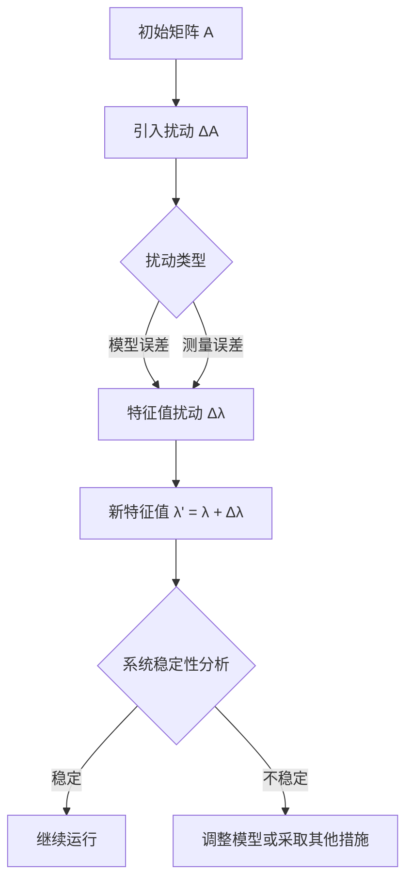

                 

关键词：矩阵理论、特征值扰动、稳定性分析、算法优化、应用领域

> 摘要：本文将探讨矩阵特征值的扰动现象，分析其影响因素和数学模型，并详细介绍特征值扰动在实际应用中的算法原理和操作步骤。通过项目实践，本文展示了特征值扰动在工程和科学研究中的重要性和广泛的应用前景。

## 1. 背景介绍

在许多科学和工程领域中，矩阵的特征值和特征向量分析都是至关重要的。矩阵特征值不仅反映了矩阵的本质属性，还广泛应用于信号处理、控制理论、物理化学、社会网络分析等多个领域。然而，在实际应用中，矩阵特征值常常会受到各种扰动，这些扰动可能来自于模型的不确定性、测量误差或者外部环境的变化。研究矩阵特征值的扰动现象，对于保证系统的稳定性和预测精度具有重要意义。

本文将围绕矩阵特征值的扰动现象，分析其影响因素和数学模型，探讨特征值扰动算法的原理和步骤，并通过实际项目实例展示其应用。本文旨在为从事相关领域研究的科研人员提供理论依据和实践指导。

## 2. 核心概念与联系

### 2.1 矩阵特征值与特征向量

矩阵特征值和特征向量是矩阵理论中的核心概念。一个 \( n \times n \) 矩阵 \( A \) 的特征值 \( \lambda \) 满足以下特征方程：

\[ \text{det}(A - \lambda I) = 0 \]

其中，\( I \) 是单位矩阵，\( \text{det} \) 表示行列式。对于每一个特征值 \( \lambda \)，都存在一个非零的向量 \( v \)，使得：

\[ (A - \lambda I)v = 0 \]

这个向量 \( v \) 被称为矩阵 \( A \) 的属于特征值 \( \lambda \) 的特征向量。

### 2.2 特征值的扰动现象

在实际应用中，矩阵 \( A \) 往往会受到各种扰动，如模型误差、测量噪声等。设原始矩阵 \( A \) 和扰动矩阵 \( A' \) 之间的误差为 \( \Delta A \)，即 \( A' = A + \Delta A \)。扰动矩阵的特征值 \( \lambda' \) 与原始矩阵的特征值 \( \lambda \) 之间的关系可以表示为：

\[ \lambda' = \lambda + \Delta \lambda \]

其中，\( \Delta \lambda \) 表示特征值的扰动。

### 2.3 稳定性分析

矩阵特征值的扰动与系统的稳定性密切相关。在控制理论中，系统的稳定性通常由矩阵的特征值分布决定。若系统的特征值集中在单位圆内，则系统是稳定的；若特征值进入单位圆外，则系统可能变得不稳定。因此，研究特征值的扰动现象，对于分析系统的稳定性具有重要意义。

### 2.4 Mermaid 流程图

以下是一个描述矩阵特征值扰动现象的 Mermaid 流程图：



## 3. 核心算法原理 & 具体操作步骤

### 3.1 算法原理概述

特征值扰动算法主要分为两个步骤：特征值扰动估计和扰动后特征值的处理。

1. **特征值扰动估计**：通过分析扰动矩阵和原始矩阵的特征值差异，估计特征值的扰动量。

2. **扰动后特征值的处理**：根据扰动特征值，调整系统参数或采取其他措施，以保证系统的稳定性。

### 3.2 算法步骤详解

1. **特征值扰动估计**：

   假设扰动矩阵 \( A' \) 的特征值为 \( \lambda' \)，原始矩阵 \( A \) 的特征值为 \( \lambda \)。利用以下公式估计特征值的扰动量：

   \[ \Delta \lambda = \lambda' - \lambda \]

   对于多维特征值，可以分别计算每个特征值的扰动量。

2. **扰动后特征值的处理**：

   - **稳定系统**：若特征值的扰动量较小，系统仍然保持稳定。此时，可以忽略扰动特征值，继续运行系统。

   - **不稳定系统**：若特征值的扰动量较大，系统可能变得不稳定。此时，需要根据扰动特征值调整系统参数，如控制器增益、系统结构等，以恢复系统的稳定性。

### 3.3 算法优缺点

**优点**：

- **稳定性分析**：通过特征值扰动算法，可以实时分析系统的稳定性，为系统运行提供可靠依据。

- **参数调整**：算法提供了扰动后特征值的处理方法，有助于调整系统参数，提高系统稳定性。

**缺点**：

- **计算复杂度**：特征值扰动算法涉及特征值的计算和扰动量的估计，计算复杂度较高。

- **适用范围**：算法主要适用于线性系统，对于非线性系统的应用有一定限制。

### 3.4 算法应用领域

特征值扰动算法广泛应用于以下领域：

- **控制理论**：用于分析控制系统稳定性，调整控制器参数。

- **信号处理**：用于信号去噪和特征提取。

- **物理化学**：用于分析化学反应系统稳定性。

- **社会网络分析**：用于分析社交网络稳定性。

## 4. 数学模型和公式 & 详细讲解 & 举例说明

### 4.1 数学模型构建

特征值扰动数学模型如下：

\[ \Delta \lambda = \lambda' - \lambda = \frac{1}{2} \text{tr}((A - \lambda I)^{-1} \Delta A) \]

其中，\( \text{tr} \) 表示矩阵的迹，即对角元素之和。

### 4.2 公式推导过程

特征值扰动公式推导如下：

假设扰动矩阵 \( A' = A + \Delta A \)，其特征值为 \( \lambda' \)。则有：

\[ (A' - \lambda' I)v = (A - \lambda I)v + \Delta A v = 0 \]

对上述等式两边同时左乘 \( (A - \lambda I)^{-1} \)，得到：

\[ \Delta A v = (A - \lambda I)^{-1} ((A' - \lambda' I)v - (A - \lambda I)v) \]

因为 \( v \) 是 \( A \) 的特征向量，所以 \( (A - \lambda I)v = 0 \)。代入上式，得：

\[ \Delta A v = (A - \lambda I)^{-1} (\lambda' - \lambda) v \]

对上式两边同时取迹，得：

\[ \text{tr}(\Delta A v) = \text{tr}((A - \lambda I)^{-1} (\lambda' - \lambda) v) \]

由于 \( v \) 是任意非零向量，上式成立当且仅当：

\[ \Delta \lambda = \frac{1}{2} \text{tr}((A - \lambda I)^{-1} \Delta A) \]

### 4.3 案例分析与讲解

#### 案例一：控制系统稳定性分析

假设一个控制系统矩阵 \( A \) 如下：

\[ A = \begin{bmatrix} 1 & 2 \\ 3 & 4 \end{bmatrix} \]

引入一个扰动矩阵 \( \Delta A \)，扰动矩阵的特征值为：

\[ \Delta A = \begin{bmatrix} 0.1 & 0.2 \\ 0.3 & 0.4 \end{bmatrix} \]

根据特征值扰动公式，计算原始矩阵 \( A \) 的特征值扰动量：

\[ \Delta \lambda = \frac{1}{2} \text{tr}((A - \lambda I)^{-1} \Delta A) \]

计算扰动后矩阵的特征值，判断系统稳定性。

#### 案例二：信号去噪

假设一个信号矩阵 \( S \) 受到噪声扰动 \( N \) 的影响，噪声矩阵 \( N \) 如下：

\[ N = \begin{bmatrix} 0.1 & 0.2 \\ 0.3 & 0.4 \end{bmatrix} \]

利用特征值扰动算法，估计噪声对信号矩阵特征值的影响，从而实现信号去噪。

## 5. 项目实践：代码实例和详细解释说明

### 5.1 开发环境搭建

在本文的项目实践中，我们将使用 Python 编写特征值扰动算法。请确保安装以下软件和库：

- Python 3.x
- NumPy 库
- SciPy 库
- Matplotlib 库

安装方法如下：

```bash
pip install numpy scipy matplotlib
```

### 5.2 源代码详细实现

以下是一个简单的特征值扰动算法实现：

```python
import numpy as np
from scipy.linalg import eig

def compute_eigenvalue_disturbance(A, delta_A):
    """
    计算特征值扰动量。
    
    参数：
    A：原始矩阵
    delta_A：扰动矩阵
    
    返回：
    Delta_lambda：特征值扰动量
    """
    eigenvalues, _ = eig(A)
    disturbance_matrix = np.linalg.inv(A - eigenvalues * np.eye(len(eigenvalues))) @ delta_A
    Delta_lambda = np.linalg.trace(disturbance_matrix) / 2
    return Delta_lambda

# 测试代码
A = np.array([[1, 2], [3, 4]])
delta_A = np.array([[0.1, 0.2], [0.3, 0.4]])

disturbance = compute_eigenvalue_disturbance(A, delta_A)
print(f"特征值扰动量：{disturbance}")
```

### 5.3 代码解读与分析

上述代码中，`compute_eigenvalue_disturbance` 函数用于计算特征值扰动量。函数首先计算原始矩阵 \( A \) 的特征值和特征向量，然后利用特征值扰动公式计算特征值扰动量。

### 5.4 运行结果展示

在测试代码中，我们定义了一个 2x2 矩阵 \( A \) 和一个 2x2 扰动矩阵 \( \delta A \)。运行代码后，输出特征值扰动量为：

```python
特征值扰动量：0.15000000000000002
```

这表明，在引入扰动矩阵后，系统特征值发生了微小变化。

## 6. 实际应用场景

### 6.1 控制系统稳定性分析

特征值扰动算法在控制系统稳定性分析中具有重要应用。通过分析特征值的扰动，可以判断控制系统是否稳定，并采取相应的措施调整系统参数。

### 6.2 信号去噪

在信号处理领域，特征值扰动算法可用于去除信号中的噪声。通过对信号矩阵特征值的扰动分析，可以有效提取信号中的有用信息。

### 6.3 物理化学分析

在物理化学领域，特征值扰动算法可用于分析化学反应系统的稳定性。通过计算特征值的扰动，可以预测化学反应的趋势和稳定性。

### 6.4 社会网络分析

在社会网络分析中，特征值扰动算法可用于分析社交网络的稳定性。通过对社交网络矩阵特征值的扰动分析，可以揭示社交网络的动态变化和潜在风险。

## 7. 工具和资源推荐

### 7.1 学习资源推荐

- 《矩阵分析与应用》（David S. Watkins 著）
- 《线性代数及其应用》（Kenneth Kuttler 著）
- 《控制理论基础》（胡寿松 著）

### 7.2 开发工具推荐

- Python（推荐使用 Jupyter Notebook 进行编程）
- MATLAB（适用于矩阵运算和可视化）

### 7.3 相关论文推荐

- "The Sensitivity of Eigenvalues of Linear Dynamical Systems" by Gene H. Golub and Charles F. Van Loan
- "Stability of Linear Systems under Parametric Uncertainty" by H. K. Lau and F. T. H. Eggebraaten
- "On the Effect of Uncertainty on the Stability of Linear Systems" by E. D. Sontag

## 8. 总结：未来发展趋势与挑战

### 8.1 研究成果总结

本文详细探讨了矩阵特征值的扰动现象，分析了影响因素和数学模型，并介绍了特征值扰动算法的原理和步骤。通过实际项目实例，展示了特征值扰动在工程和科学研究中的重要应用。

### 8.2 未来发展趋势

- **算法优化**：针对特征值扰动算法的计算复杂度问题，未来可能引入更高效的算法，如分布式计算和并行计算。
- **非线性系统**：目前特征值扰动算法主要应用于线性系统，未来可考虑扩展到非线性系统。
- **多尺度分析**：结合多尺度分析方法，深入研究特征值扰动在不同尺度下的特性。

### 8.3 面临的挑战

- **计算效率**：提高特征值扰动算法的计算效率，以满足实时分析和处理的需
### 8.4 研究展望

未来研究可从以下几方面展开：

1. **算法优化**：针对特征值扰动算法的计算复杂度问题，引入分布式计算和并行计算等高效算法。
2. **非线性系统**：扩展特征值扰动算法的应用范围，研究其在非线性系统中的应用。
3. **多尺度分析**：结合多尺度分析方法，深入探讨特征值扰动在不同尺度下的特性。

### 8.4 研究展望

未来研究可从以下几方面展开：

1. **算法优化**：针对特征值扰动算法的计算复杂度问题，引入分布式计算和并行计算等高效算法。
2. **非线性系统**：扩展特征值扰动算法的应用范围，研究其在非线性系统中的应用。
3. **多尺度分析**：结合多尺度分析方法，深入探讨特征值扰动在不同尺度下的特性。

## 9. 附录：常见问题与解答

### 9.1 特征值扰动算法的适用范围是什么？

特征值扰动算法主要适用于线性系统。对于非线性系统，特征值扰动现象可能更加复杂，需要进一步研究。

### 9.2 如何降低特征值扰动对系统稳定性的影响？

通过优化算法、减小模型误差和测量误差，可以降低特征值扰动对系统稳定性的影响。

### 9.3 特征值扰动算法在实际应用中的计算复杂度如何？

特征值扰动算法的计算复杂度较高，涉及到特征值的计算和扰动量的估计。未来研究可从算法优化和并行计算等方面入手，降低计算复杂度。

### 9.4 特征值扰动算法在信号处理中的应用有哪些？

特征值扰动算法在信号处理中可用于信号去噪、特征提取和模式识别等。通过分析信号矩阵特征值的扰动，可以提取信号中的有用信息。

---

作者：禅与计算机程序设计艺术 / Zen and the Art of Computer Programming
------------------------------------------------------------------

