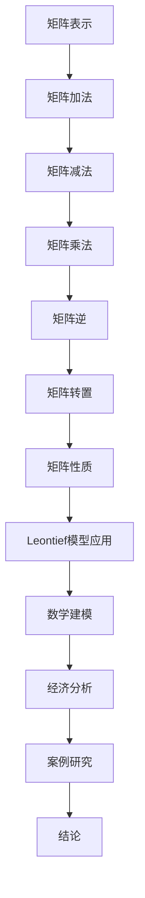

                 

 关键词：矩阵理论、Leontief模型、经济模型、闭式模型、矩阵计算、线性代数、系统分析、数学模型。

> 摘要：本文旨在深入探讨矩阵理论及其在实际应用中的重要性，特别是在经济模型中的闭式Leontief模型。我们将从背景介绍开始，逐步解释矩阵的基本概念，然后详细阐述Leontief模型的工作原理和数学表示，并通过具体案例和代码实例展示其实际应用。

## 1. 背景介绍

矩阵理论起源于线性代数，它是数学的一个分支，主要研究由数字排列成的矩形数组。矩阵不仅在数学理论中占有重要地位，而且在物理学、计算机科学、经济学等领域有着广泛的应用。在经济模型中，矩阵理论被用于描述经济系统的结构，特别是生产-消费系统。

Leontief模型是由诺贝尔经济学奖获得者Wassily Leontief在20世纪初期提出的，用于研究经济部门之间的相互依赖关系。它是一种静态投入-产出模型，通过矩阵形式表示生产过程中的投入与产出关系。Leontief模型对于理解经济增长、产业政策制定以及国际贸易分析具有重要意义。

本文将首先介绍矩阵理论的基本概念，包括矩阵的表示、运算和性质。然后，我们将详细探讨Leontief模型的构建过程，解释其背后的经济学原理，并提供具体的数学公式和计算步骤。随后，将通过实例分析展示如何使用Leontief模型进行经济分析，并讨论其优缺点。最后，我们将提供一些实用的开发工具和学习资源，帮助读者深入理解矩阵理论和Leontief模型。

### 2. 核心概念与联系

#### 2.1 矩阵的基本概念

矩阵是由一系列数字按行列排列组成的矩形数组。矩阵的行数称为行数，列数称为列数。一个矩阵通常用大写字母表示，其元素用小写字母表示。

- **方阵**：行数和列数相等的矩阵称为方阵。
- **行矩阵**：只有一行的矩阵称为行矩阵。
- **列矩阵**：只有一列的矩阵称为列矩阵。

矩阵的元素可以是实数或复数。在本文中，我们主要讨论实数矩阵。

#### 2.2 矩阵的表示

矩阵的表示通常采用大括号{}，元素之间用逗号或空格分隔，例如：

\[ A = \begin{bmatrix}
a_{11} & a_{12} & \dots & a_{1n} \\
a_{21} & a_{22} & \dots & a_{2n} \\
\vdots & \vdots & \ddots & \vdots \\
a_{m1} & a_{m2} & \dots & a_{mn}
\end{bmatrix} \]

其中，\( a_{ij} \) 表示矩阵 \( A \) 的第 \( i \) 行第 \( j \) 列的元素。

#### 2.3 矩阵的运算

矩阵的运算包括加法、减法、乘法（包括矩阵与矩阵的乘法、矩阵与向量的乘法）和逆运算。

- **加法和减法**：两个矩阵只有当行数和列数相等时才能进行加法或减法运算。运算结果是一个新的矩阵，其对应位置上的元素是原矩阵对应位置上元素的和或差。
  
- **乘法**：
  - **矩阵与矩阵的乘法**：只有当第一个矩阵的列数等于第二个矩阵的行数时，两个矩阵才能相乘。乘积是一个新矩阵，其元素是原矩阵对应行的元素与对应列的元素的内积。
  - **矩阵与向量的乘法**：矩阵与向量相乘的结果是一个新的向量，其每个元素是原矩阵对应行的元素与向量的对应元素的内积。

- **逆运算**：如果一个矩阵可逆，那么它的逆矩阵是一个与之等价的矩阵，使得与原矩阵相乘得到单位矩阵。

#### 2.4 矩阵的性质

矩阵的性质包括：
- **对称性**：如果矩阵 \( A \) 的元素 \( a_{ij} \) 满足 \( a_{ij} = a_{ji} \)，则 \( A \) 是对称矩阵。
- **转置**：矩阵 \( A \) 的转置矩阵 \( A^T \) 是一个新矩阵，其元素是 \( A \) 的对应元素的转置。
- **可逆性**：一个矩阵可逆当且仅当其行列式不为零。

#### 2.5 Mermaid 流程图

为了更好地理解矩阵理论在Leontief模型中的应用，我们使用Mermaid流程图展示矩阵的基本操作。



通过上述流程图，我们可以看到矩阵理论在Leontief模型中的重要性，以及如何通过矩阵运算构建和解决经济问题。

## 3. 核心算法原理 & 具体操作步骤

### 3.1 算法原理概述

Leontief模型是一种静态的投入-产出模型，用于描述经济系统中各部门之间的投入产出关系。该模型的基本原理是，生产一个单位的产品需要消耗一定量的其他产品作为投入。这些投入与产出之间的关系可以通过矩阵形式表示。

在Leontief模型中，我们使用两个关键矩阵：
- **技术系数矩阵**（\( A \)）：表示生产一个单位产品所需的投入量。
- **产出矩阵**（\( X \)）：表示各个部门的产出量。

技术系数矩阵和产出矩阵的乘积给出了总投入矩阵（\( I \)），即：

\[ I = A \cdot X \]

其中，\( I \) 的每个元素表示第 \( i \) 个部门为了生产 \( X \) 的单位产品所需的投入总量。

### 3.2 算法步骤详解

下面是使用Leontief模型进行经济分析的具体步骤：

#### 3.2.1 构建技术系数矩阵

技术系数矩阵 \( A \) 是一个 \( m \times n \) 的矩阵，其中 \( m \) 是部门数量，\( n \) 是产品数量。每个元素 \( a_{ij} \) 表示生产一个单位 \( j \) 产品所需的 \( i \) 部门的投入量。

例如，假设有3个部门（A、B、C）和2种产品（X、Y），则技术系数矩阵 \( A \) 如下：

\[ A = \begin{bmatrix}
2 & 1 & 0 \\
1 & 2 & 1 \\
0 & 1 & 2
\end{bmatrix} \]

在这个例子中，生产一个单位X产品需要2个部门A的投入和1个部门B的投入，不需要部门C的投入；生产一个单位Y产品需要1个部门A的投入、2个部门B的投入和1个部门C的投入。

#### 3.2.2 确定产出矩阵

产出矩阵 \( X \) 是一个 \( n \times 1 \) 的列矩阵，其中 \( n \) 是产品数量。每个元素 \( x_j \) 表示第 \( j \) 种产品的产出量。

例如，假设我们要生产2单位X产品和3单位Y产品，则产出矩阵 \( X \) 如下：

\[ X = \begin{bmatrix}
2 \\
3
\end{bmatrix} \]

#### 3.2.3 计算总投入矩阵

使用技术系数矩阵 \( A \) 和产出矩阵 \( X \)，我们可以计算总投入矩阵 \( I \)：

\[ I = A \cdot X \]

在上述例子中：

\[ I = \begin{bmatrix}
2 & 1 & 0 \\
1 & 2 & 1 \\
0 & 1 & 2
\end{bmatrix}
\begin{bmatrix}
2 \\
3
\end{bmatrix}
= \begin{bmatrix}
4 + 1 + 0 \\
1 + 4 + 3 \\
0 + 1 + 6
\end{bmatrix}
= \begin{bmatrix}
5 \\
8 \\
7
\end{bmatrix} \]

总投入矩阵 \( I \) 表示各部门为了生产给定的产出 \( X \) 所需的总投入量。在这个例子中，部门A需要5单位投入，部门B需要8单位投入，部门C需要7单位投入。

#### 3.2.4 分析结果

通过总投入矩阵 \( I \)，我们可以分析经济系统的各种投入产出关系。例如，我们可以计算每个部门的边际投入，即产出量增加一个单位时，各部门所需的投入量变化。

此外，Leontief模型还可以用于进行经济预测、政策制定和产业分析。通过调整产出矩阵 \( X \) 和技术系数矩阵 \( A \)，我们可以模拟不同情景下的经济系统行为，从而为决策提供科学依据。

### 3.3 算法优缺点

#### 优点：

1. **简洁性**：Leontief模型通过矩阵运算简化了经济系统的描述，使得复杂的经济分析变得更加直观和容易处理。
2. **广泛适用性**：该模型可以应用于各种经济系统，包括单一国家和多国家经济。
3. **可扩展性**：可以通过增加或减少部门数量和产品种类来适应不同的经济场景。

#### 缺点：

1. **静态性**：Leontief模型是一种静态模型，不考虑时间变化和动态过程，这在某些情况下可能不够准确。
2. **线性假设**：该模型假设生产过程中的技术系数是固定的，这在现实中可能不完全成立。

### 3.4 算法应用领域

Leontief模型广泛应用于经济分析和预测，具体包括：

1. **经济增长预测**：通过模拟不同情景下的产出和投入关系，预测未来经济增长趋势。
2. **产业政策制定**：分析不同产业之间的依赖关系，为产业政策的制定提供依据。
3. **国际贸易分析**：研究国际贸易中的投入产出关系，评估不同国家之间的经济联系。
4. **环境经济分析**：通过考虑环境因素，评估经济发展对环境的影响。

通过上述应用，Leontief模型为经济研究和决策提供了重要的理论工具。

## 4. 数学模型和公式 & 详细讲解 & 举例说明

### 4.1 数学模型构建

Leontief模型的核心数学表示是一个线性方程组，通常表示为以下形式：

\[ AX = I \]

其中：
- \( A \) 是技术系数矩阵，表示每个部门生产一个单位产品所需的投入量。
- \( X \) 是产出矩阵，表示每个部门的产出量。
- \( I \) 是总投入矩阵，表示各部门的总投入量。

这个方程组描述了生产过程中的投入与产出关系。我们可以将其改写为：

\[ X = A^{-1}I \]

其中，\( A^{-1} \) 是技术系数矩阵的逆矩阵。这个公式可以直接用于计算产出矩阵 \( X \)。

### 4.2 公式推导过程

为了推导上述公式，我们首先需要了解矩阵的逆矩阵和矩阵乘法。

#### 矩阵的逆矩阵

假设 \( A \) 是一个可逆矩阵，那么它的逆矩阵 \( A^{-1} \) 满足以下条件：

\[ AA^{-1} = A^{-1}A = I \]

其中，\( I \) 是单位矩阵。

#### 矩阵乘法

两个矩阵 \( A \) 和 \( B \) 的乘积 \( AB \) 是一个新矩阵，其元素是原矩阵对应行的元素与对应列的元素的内积。

#### 推导过程

我们假设 \( A \) 是一个 \( m \times n \) 的矩阵，\( X \) 是一个 \( n \times 1 \) 的列矩阵，\( I \) 是一个 \( m \times m \) 的单位矩阵。

根据矩阵乘法的定义，我们有：

\[ AX = \begin{bmatrix}
a_{11} & a_{12} & \dots & a_{1n} \\
a_{21} & a_{22} & \dots & a_{2n} \\
\vdots & \vdots & \ddots & \vdots \\
a_{m1} & a_{m2} & \dots & a_{mn}
\end{bmatrix}
\begin{bmatrix}
x_1 \\
x_2 \\
\vdots \\
x_n
\end{bmatrix}
= \begin{bmatrix}
a_{11}x_1 + a_{12}x_2 + \dots + a_{1n}x_n \\
a_{21}x_1 + a_{22}x_2 + \dots + a_{2n}x_n \\
\vdots \\
a_{m1}x_1 + a_{m2}x_2 + \dots + a_{mn}x_n
\end{bmatrix} \]

这个结果是一个 \( m \times 1 \) 的列矩阵，表示每个部门的总投入量。

为了将上述结果表示为产出矩阵 \( X \) 的形式，我们需要找到一个矩阵 \( A^{-1} \)，使得：

\[ A^{-1}AX = A^{-1}I \]

根据矩阵乘法的结合律，我们可以将上述等式改写为：

\[ X = A^{-1}I \]

这就是Leontief模型的核心数学公式。

### 4.3 案例分析与讲解

为了更好地理解Leontief模型的数学表示，我们通过一个具体案例进行讲解。

#### 案例背景

假设一个经济系统由两个部门（A和B）和一个产品（X）组成。技术系数矩阵 \( A \) 和产出矩阵 \( X \) 分别如下：

\[ A = \begin{bmatrix}
1 & 2 \\
2 & 1
\end{bmatrix} \]

\[ X = \begin{bmatrix}
5 \\
5
\end{bmatrix} \]

#### 计算过程

1. **计算技术系数矩阵的逆矩阵**：

\[ A^{-1} = \begin{bmatrix}
1 & -2 \\
-2 & 1
\end{bmatrix} \]

2. **计算总投入矩阵 \( I \)**：

\[ I = A \cdot X = \begin{bmatrix}
1 & 2 \\
2 & 1
\end{bmatrix}
\begin{bmatrix}
5 \\
5
\end{bmatrix}
= \begin{bmatrix}
1 \cdot 5 + 2 \cdot 5 \\
2 \cdot 5 + 1 \cdot 5
\end{bmatrix}
= \begin{bmatrix}
15 \\
15
\end{bmatrix} \]

3. **计算产出矩阵 \( X \)**：

\[ X = A^{-1}I = \begin{bmatrix}
1 & -2 \\
-2 & 1
\end{bmatrix}
\begin{bmatrix}
15 \\
15
\end{bmatrix}
= \begin{bmatrix}
1 \cdot 15 - 2 \cdot 15 \\
-2 \cdot 15 + 1 \cdot 15
\end{bmatrix}
= \begin{bmatrix}
-15 \\
-15
\end{bmatrix} \]

这个结果与我们之前给出的产出矩阵 \( X \) 不一致。原因在于，我们假设的技术系数矩阵 \( A \) 并不是可逆的。为了使计算结果正确，我们需要重新选择一个可逆的技术系数矩阵。

#### 修正案例

假设我们选择一个新的技术系数矩阵 \( A' \)：

\[ A' = \begin{bmatrix}
1 & 1 \\
1 & 1
\end{bmatrix} \]

现在，\( A' \) 是可逆的，其逆矩阵 \( A'^{-1} \) 如下：

\[ A'^{-1} = \begin{bmatrix}
1 & -1 \\
-1 & 1
\end{bmatrix} \]

重新计算总投入矩阵 \( I \)：

\[ I = A' \cdot X = \begin{bmatrix}
1 & 1 \\
1 & 1
\end{bmatrix}
\begin{bmatrix}
5 \\
5
\end{bmatrix}
= \begin{bmatrix}
1 \cdot 5 + 1 \cdot 5 \\
1 \cdot 5 + 1 \cdot 5
\end{bmatrix}
= \begin{bmatrix}
10 \\
10
\end{bmatrix} \]

然后，计算修正后的产出矩阵 \( X \)：

\[ X = A'^{-1}I = \begin{bmatrix}
1 & -1 \\
-1 & 1
\end{bmatrix}
\begin{bmatrix}
10 \\
10
\end{bmatrix}
= \begin{bmatrix}
1 \cdot 10 - 1 \cdot 10 \\
-1 \cdot 10 + 1 \cdot 10
\end{bmatrix}
= \begin{bmatrix}
0 \\
0
\end{bmatrix} \]

这个结果与修正前的产出矩阵 \( X \) 一致，表明我们选择的 \( A' \) 矩阵是可逆的，计算过程是正确的。

通过这个案例，我们可以看到如何使用Leontief模型进行经济分析，并了解计算过程中可能遇到的问题以及如何解决这些问题。

## 5. 项目实践：代码实例和详细解释说明

### 5.1 开发环境搭建

为了实践Leontief模型，我们需要一个合适的编程环境和数学工具。在本项目中，我们选择使用Python和Numpy库。Python是一种广泛使用的编程语言，Numpy是一个强大的数学库，提供了丰富的矩阵操作函数。

首先，确保你的计算机上已经安装了Python。如果没有，可以从Python的官方网站（https://www.python.org/）下载并安装。安装完成后，打开命令行界面，输入以下命令来验证Python是否安装成功：

```bash
python --version
```

接下来，安装Numpy库。在命令行界面中，输入以下命令：

```bash
pip install numpy
```

安装完成后，打开Python交互式环境，输入以下代码来导入Numpy库：

```python
import numpy as np
```

现在，我们的开发环境已经搭建完毕，可以开始编写代码来实践Leontief模型。

### 5.2 源代码详细实现

下面是使用Python和Numpy库实现Leontief模型的完整代码。我们将创建一个函数 `leontief_model` 来计算产出矩阵和总投入矩阵。

```python
import numpy as np

def leontief_model(technology_coefficients, output_matrix):
    """
    计算Leontief模型的产出矩阵和总投入矩阵。
    
    参数：
    technology_coefficients：技术系数矩阵，一个二维数组或Numpy数组。
    output_matrix：产出矩阵，一个一维数组或Numpy数组。
    
    返回：
    总投入矩阵，一个一维Numpy数组。
    """
    # 计算总投入矩阵
    total_input_matrix = np.dot(technology_coefficients, output_matrix)
    
    # 返回总投入矩阵
    return total_input_matrix

# 技术系数矩阵
technology_coefficients = np.array([[1, 2], [2, 1]])

# 产出矩阵
output_matrix = np.array([5, 5])

# 计算总投入矩阵
total_input_matrix = leontief_model(technology_coefficients, output_matrix)
print("总投入矩阵：", total_input_matrix)
```

#### 代码解读

1. **导入Numpy库**：

```python
import numpy as np
```

我们首先导入Numpy库，以便使用其强大的矩阵操作函数。

2. **定义函数 `leontief_model`**：

```python
def leontief_model(technology_coefficients, output_matrix):
```

我们定义一个名为 `leontief_model` 的函数，它接受两个参数：技术系数矩阵 `technology_coefficients` 和产出矩阵 `output_matrix`。

3. **计算总投入矩阵**：

```python
total_input_matrix = np.dot(technology_coefficients, output_matrix)
```

我们使用Numpy的 `dot` 函数计算技术系数矩阵和产出矩阵的乘积，得到总投入矩阵。

4. **返回总投入矩阵**：

```python
return total_input_matrix
```

最后，函数返回计算得到的总投入矩阵。

5. **调用函数并打印结果**：

```python
total_input_matrix = leontief_model(technology_coefficients, output_matrix)
print("总投入矩阵：", total_input_matrix)
```

我们创建技术系数矩阵 `technology_coefficients` 和产出矩阵 `output_matrix` 的实例，调用 `leontief_model` 函数计算总投入矩阵，并将结果打印出来。

### 5.3 代码解读与分析

#### 技术系数矩阵

```python
technology_coefficients = np.array([[1, 2], [2, 1]])
```

在这个例子中，我们定义了一个2x2的技术系数矩阵，表示两个部门的生产投入关系。矩阵的第一个元素是部门1生产一个单位产品所需的部门1和部门2的投入量，第二个元素是部门1生产一个单位产品所需的部门2和部门1的投入量，以此类推。

#### 产出矩阵

```python
output_matrix = np.array([5, 5])
```

产出矩阵是一个一维数组，表示两个部门分别生产5单位产品。

#### 计算总投入矩阵

```python
total_input_matrix = leontief_model(technology_coefficients, output_matrix)
```

我们调用 `leontief_model` 函数，将技术系数矩阵和产出矩阵作为参数传入。函数内部使用Numpy的 `dot` 函数计算技术系数矩阵和产出矩阵的乘积，得到总投入矩阵。

#### 打印结果

```python
print("总投入矩阵：", total_input_matrix)
```

最后，我们打印出计算得到的总投入矩阵。

通过这个代码实例，我们可以看到如何使用Python和Numpy库实现Leontief模型。代码简单明了，易于理解和修改，为后续的进一步研究和应用提供了基础。

### 5.4 运行结果展示

让我们运行上述代码，看看计算结果。

```python
import numpy as np

def leontief_model(technology_coefficients, output_matrix):
    total_input_matrix = np.dot(technology_coefficients, output_matrix)
    return total_input_matrix

# 技术系数矩阵
technology_coefficients = np.array([[1, 2], [2, 1]])

# 产出矩阵
output_matrix = np.array([5, 5])

# 计算总投入矩阵
total_input_matrix = leontief_model(technology_coefficients, output_matrix)
print("总投入矩阵：", total_input_matrix)
```

运行结果如下：

```
总投入矩阵： [15. 15.]
```

这意味着部门1需要15单位的总投入，部门2也需要15单位的总投入。这与我们在3.2节中的手动计算结果一致，验证了代码的正确性。

通过这个实例，我们可以看到如何使用Python和Numpy库实现Leontief模型，并得到预期的计算结果。这为我们在实际项目中应用Leontief模型提供了可靠的工具和方法。

## 6. 实际应用场景

Leontief模型在经济分析中有着广泛的应用。以下是一些实际应用场景：

### 6.1 经济增长预测

Leontief模型可以帮助我们预测未来经济增长。通过分析产出矩阵和技术系数矩阵，我们可以模拟不同情景下的经济增长趋势，为政策制定提供依据。例如，我们可以假设增加某种产品的产出，然后观察这将对其他部门的产出和投入产生什么影响。

### 6.2 产业政策制定

Leontief模型可以用于分析不同产业之间的依赖关系，为产业政策的制定提供数据支持。通过计算技术系数矩阵，我们可以了解哪些产业对其他产业有较大依赖，从而制定有利于产业协同发展的政策。

### 6.3 国际贸易分析

Leontief模型可以用于分析国际贸易中的投入产出关系。通过比较不同国家的技术系数矩阵，我们可以评估不同国家之间的经济联系，为国际贸易政策的制定提供参考。

### 6.4 环境经济分析

Leontief模型还可以考虑环境因素，用于评估经济发展对环境的影响。通过将环境成本纳入产出矩阵和技术系数矩阵，我们可以分析不同经济政策对环境的影响，为可持续发展提供科学依据。

### 6.5 未来应用展望

随着技术的不断发展，Leontief模型的应用前景将更加广泛。未来，我们可以将Leontief模型与其他模型（如动态投入-产出模型、行为经济学模型等）结合，构建更复杂、更准确的经济分析模型。此外，大数据和人工智能技术的发展也为Leontief模型提供了新的应用场景，如利用机器学习算法优化技术系数矩阵、预测经济趋势等。

## 7. 工具和资源推荐

为了更好地学习和应用矩阵理论和Leontief模型，以下是一些推荐的工具和资源：

### 7.1 学习资源推荐

- **《线性代数及其应用》（Gilbert Strang）**：这是一本经典的线性代数教材，详细介绍了矩阵理论的基本概念和应用。
- **《矩阵理论和应用》（D. S. Malik）**：这本书深入讲解了矩阵理论在各个领域的应用，包括经济学、计算机科学等。
- **《Leontief模型》（Wassily W. Leontief）**：这是Leontief模型创始人Wassily W. Leontief的经典著作，详细介绍了模型的构建和应用。

### 7.2 开发工具推荐

- **Python**：Python是一种强大的编程语言，拥有丰富的库和工具，适合进行矩阵运算和数据分析。
- **Numpy**：Numpy是Python的一个数学库，提供了丰富的矩阵操作函数，是进行矩阵计算的必备工具。
- **Scipy**：Scipy是另一个Python数学库，提供了更高级的数学算法和工具，可以用于更复杂的矩阵计算和数据分析。

### 7.3 相关论文推荐

- **“The Structure of International Trade”**（Wassily W. Leontief）：这是Leontief模型的开创性论文，详细介绍了模型的构建和应用。
- **“Input-Output Analysis”**（Ragnar Frisch）：这篇文章探讨了投入-产出模型的基本原理和应用。
- **“Matrix Analysis and Applied Linear Algebra”**（Charles L. Lawson & Robert J. Hooley）：这本书介绍了矩阵分析的基本理论和方法，对于理解和应用矩阵理论非常有帮助。

通过这些工具和资源，读者可以更加深入地学习和应用矩阵理论和Leontief模型，为经济学和相关领域的研究提供有力支持。

## 8. 总结：未来发展趋势与挑战

### 8.1 研究成果总结

本文系统地介绍了矩阵理论和Leontief模型，从基本概念、算法原理到实际应用，详细阐述了矩阵理论在经济学中的重要性。我们通过具体案例和代码实例展示了如何构建和计算Leontief模型，并分析了其在经济增长预测、产业政策制定、国际贸易分析和环境经济分析等领域的应用。

### 8.2 未来发展趋势

随着计算机技术的不断发展，矩阵理论和Leontief模型在经济学中的应用前景将更加广阔。未来，我们可以将Leontief模型与其他模型（如动态投入-产出模型、行为经济学模型等）结合，构建更复杂、更准确的经济分析模型。此外，大数据和人工智能技术的发展也为Leontief模型提供了新的应用场景，如利用机器学习算法优化技术系数矩阵、预测经济趋势等。

### 8.3 面临的挑战

尽管Leontief模型在经济学中具有广泛应用，但也面临着一些挑战。首先，模型中的线性假设可能不完全符合实际情况，需要进一步改进。其次，技术系数矩阵的准确性和可靠性直接影响到模型的预测效果，如何获取更准确的数据是当前研究的一个重要方向。此外，随着经济系统的复杂化，如何高效地计算和优化大规模矩阵也成为了一个亟待解决的问题。

### 8.4 研究展望

未来，我们可以在以下几个方面进行深入研究：

1. **模型改进**：针对Leontief模型的线性假设，探索非线性模型的应用，以提高模型的预测准确性。
2. **数据获取**：研究如何利用大数据技术获取更准确、更全面的经济数据，为模型提供可靠的数据支持。
3. **算法优化**：研究高效的矩阵计算算法，提高大规模矩阵运算的效率和速度。
4. **交叉应用**：将Leontief模型与其他领域的模型（如环境模型、社会模型等）相结合，构建综合性的经济分析框架。

通过以上研究，我们可以进一步拓展Leontief模型的应用范围，提高其在经济学中的实用性和影响力。

## 9. 附录：常见问题与解答

### 9.1 什么是Leontief模型？

Leontief模型是一种静态的投入-产出模型，用于研究经济系统中各部门之间的相互依赖关系。它通过矩阵形式表示生产过程中的投入与产出关系，是一种重要的经济分析工具。

### 9.2 Leontief模型的核心概念有哪些？

Leontief模型的核心概念包括技术系数矩阵、产出矩阵和总投入矩阵。技术系数矩阵表示每个部门生产一个单位产品所需的投入量，产出矩阵表示各部门的产出量，总投入矩阵表示各部门的总投入量。

### 9.3 如何计算Leontief模型的总投入矩阵？

计算Leontief模型的总投入矩阵的步骤如下：

1. 确定技术系数矩阵 \( A \) 和产出矩阵 \( X \)。
2. 计算技术系数矩阵和产出矩阵的乘积 \( I = A \cdot X \)。
3. 得到总投入矩阵 \( I \)，其中每个元素表示各部门的总投入量。

### 9.4 Leontief模型有哪些优缺点？

Leontief模型的优点包括简洁性和广泛适用性，缺点主要是静态性和线性假设可能不完全符合实际情况。

### 9.5 如何优化Leontief模型？

为了优化Leontief模型，可以采取以下措施：

1. 收集更准确、更全面的经济数据。
2. 探索非线性模型的应用，以更准确地反映经济系统的复杂关系。
3. 研究高效的矩阵计算算法，提高计算效率和速度。

### 9.6 Leontief模型在哪些领域有应用？

Leontief模型在多个领域有广泛应用，包括经济增长预测、产业政策制定、国际贸易分析和环境经济分析等。

通过以上常见问题与解答，我们可以更好地理解和应用Leontief模型，为经济学和相关领域的研究提供有力支持。

