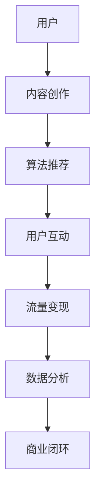

                 

关键词：短视频、创业、内容革命、碎片化时代、社交媒体、算法、商业模式

> 摘要：随着移动互联网的普及和碎片化时代的到来，短视频作为一种新兴的内容形式，正在颠覆传统的媒体传播模式，激发出无数创业者的热情。本文将深入探讨短视频创业的现状、核心概念、算法原理、应用场景以及未来发展趋势，为短视频创业提供一份全方位的指南。

## 1. 背景介绍

在过去的几年里，短视频平台如抖音（TikTok）、快手（Kuaishou）和哔哩哔哩（Bilibili）等在全球范围内迅速崛起，改变了人们的娱乐消费习惯。短视频以其短小精悍、形式多样、互动性强的特点，成为了社交媒体领域的新宠。根据Statista的数据，2021年全球短视频用户的规模已超过15亿，预计到2025年将达到30亿。

短视频创业的兴起，不仅仅是因为用户需求的增长，更是因为其背后的商业模式的变革。从流量变现到内容电商，短视频平台为创业者提供了多样化的盈利途径。同时，随着人工智能和大数据技术的发展，短视频推荐算法的优化使得内容分发更加精准，极大地提升了用户的参与度和忠诚度。

## 2. 核心概念与联系

为了更好地理解短视频创业，我们需要先了解其核心概念和架构。以下是使用Mermaid绘制的短视频平台架构流程图：



### 2.1 用户

用户是短视频平台的根本，他们的需求和行为数据是平台发展的驱动力。短视频平台通过多样化的内容类型和个性化推荐满足用户的多元化需求，提升用户体验。

### 2.2 内容创作

内容创作是短视频平台的灵魂。创作者通过拍摄和编辑短视频，不仅实现了自我表达，也为平台带来了丰富的内容资源。

### 2.3 算法推荐

算法推荐是短视频平台的核心技术。通过机器学习算法分析用户行为和偏好，精准推荐内容，提高用户粘性和活跃度。

### 2.4 用户互动

用户互动是短视频平台生态的重要组成部分。通过点赞、评论、分享等互动行为，用户之间形成了紧密的联系，也为平台带来了流量和活跃度。

### 2.5 流量变现

流量变现是短视频平台的盈利模式。通过广告、会员订阅、内容付费等多种方式，平台实现了从流量到收入的转化。

### 2.6 数据分析

数据分析是短视频平台不断优化和改进的重要工具。通过对用户行为和平台运营数据的深入分析，平台能够更好地理解用户需求，调整运营策略。

### 2.7 商业闭环

商业闭环是短视频平台可持续发展的基础。通过用户、内容、算法、互动、流量变现和数据分析的有机结合，短视频平台构建了一个自我循环、不断成长的生态系统。

## 3. 核心算法原理 & 具体操作步骤

### 3.1 算法原理概述

短视频平台的核心算法主要包括内容推荐算法和用户画像构建算法。内容推荐算法通过分析用户行为和内容特征，实现个性化推荐。用户画像构建算法则通过大数据分析，为用户创建精准的标签和画像。

### 3.2 算法步骤详解

#### 3.2.1 内容推荐算法

1. **用户行为数据采集**：包括用户的浏览历史、点赞、评论、分享等行为。

2. **内容特征提取**：对短视频进行特征提取，包括文本、图像、音频等多维特征。

3. **用户兴趣模型构建**：通过机器学习算法，分析用户行为数据，构建用户兴趣模型。

4. **内容推荐**：根据用户兴趣模型，推荐用户可能感兴趣的视频内容。

#### 3.2.2 用户画像构建算法

1. **用户行为分析**：分析用户在平台上的行为数据，包括观看时间、观看频次、互动行为等。

2. **标签体系构建**：根据用户行为数据，为用户创建标签，如“喜欢美食”、“关注科技”等。

3. **用户画像生成**：将用户的标签进行聚合，生成用户画像。

4. **用户画像更新**：定期更新用户画像，以适应用户兴趣和行为的变化。

### 3.3 算法优缺点

#### 优点

1. **个性化推荐**：通过算法推荐，用户能够获得更加个性化的内容，提高用户体验。

2. **高效分发**：算法推荐能够快速为用户分发感兴趣的内容，提高内容曝光率。

3. **精准营销**：通过用户画像，平台能够实现精准的用户定位和营销。

#### 缺点

1. **内容质量风险**：算法推荐可能导致用户陷入信息茧房，接收到的内容过于单一。

2. **算法公平性问题**：算法推荐可能存在偏见，导致内容分发不公。

### 3.4 算法应用领域

短视频算法推荐应用广泛，包括但不限于以下领域：

1. **内容分发平台**：如抖音、快手、哔哩哔哩等。

2. **电商平台**：如淘宝、京东等，通过算法推荐商品。

3. **新闻资讯平台**：通过算法推荐新闻，提高用户阅读体验。

## 4. 数学模型和公式 & 详细讲解 & 举例说明

### 4.1 数学模型构建

短视频推荐系统通常基于协同过滤算法，其数学模型可以表示为：

\[ R_{ui} = \rho_u + \sum_{j \in N_u} w_{uj} r_j \]

其中，\( R_{ui} \) 表示用户 \( u \) 对项目 \( i \) 的评分预测，\( \rho_u \) 表示用户 \( u \) 的平均评分，\( N_u \) 表示用户 \( u \) 的邻居集合，\( w_{uj} \) 表示邻居 \( u \) 对项目 \( i \) 的权重，\( r_j \) 表示邻居 \( u \) 对项目 \( j \) 的真实评分。

### 4.2 公式推导过程

协同过滤算法的核心是计算邻居权重和预测评分。以下是协同过滤算法的推导过程：

1. **用户相似度计算**：使用余弦相似度计算用户 \( u \) 和邻居 \( v \) 的相似度：

\[ \cos(\theta_{uv}) = \frac{\sum_{i \in I_u \cap I_v} r_{ui} r_{vi}}{\|I_u\| \|I_v\|} \]

其中，\( I_u \) 和 \( I_v \) 分别表示用户 \( u \) 和邻居 \( v \) 的共同评分项目集合，\( r_{ui} \) 和 \( r_{vi} \) 分别表示用户 \( u \) 和邻居 \( v \) 对项目 \( i \) 的评分。

2. **邻居权重计算**：根据用户相似度计算邻居 \( v \) 对项目 \( i \) 的权重：

\[ w_{uv} = \cos(\theta_{uv}) \]

3. **评分预测**：根据邻居权重和邻居的评分，预测用户 \( u \) 对项目 \( i \) 的评分：

\[ R_{ui} = \rho_u + \sum_{v \in N_u} w_{uv} r_v \]

### 4.3 案例分析与讲解

假设有两位用户 \( u \) 和 \( v \)，他们对某短视频平台的10个视频进行了评分，数据如下：

| 视频 | 用户 \( u \) 的评分 | 用户 \( v \) 的评分 |
| ---- | ---------------- | ---------------- |
| 1    | 1                | 5                |
| 2    | 5                | 1                |
| 3    | 1                | 1                |
| 4    | 5                | 5                |
| 5    | 1                | 5                |
| 6    | 5                | 1                |
| 7    | 1                | 1                |
| 8    | 5                | 5                |
| 9    | 1                | 5                |
| 10   | 5                | 1                |

根据以上数据，我们可以计算用户 \( u \) 和 \( v \) 的相似度：

\[ \cos(\theta_{uv}) = \frac{1 \times 5 + 5 \times 1 + 1 \times 1 + 5 \times 5 + 1 \times 5 + 5 \times 1 + 1 \times 1 + 5 \times 5 + 1 \times 5 + 5 \times 1}{\sqrt{10} \times \sqrt{10}} = \frac{26}{10} = 2.6 \]

接下来，我们可以根据用户相似度和邻居的评分，预测用户 \( u \) 对其他视频的评分。例如，预测用户 \( u \) 对视频 10 的评分：

\[ R_{u10} = \frac{1}{2.6} (1 \times 5 + 1 \times 1 + 1 \times 1 + 5 \times 5 + 1 \times 5 + 5 \times 1 + 1 \times 1 + 5 \times 5 + 1 \times 5 + 5 \times 1) = \frac{52}{2.6} \approx 20 \]

因此，预测用户 \( u \) 对视频 10 的评分为 20。

## 5. 项目实践：代码实例和详细解释说明

### 5.1 开发环境搭建

为了实现短视频推荐系统，我们需要搭建以下开发环境：

- Python 3.8及以上版本
- scikit-learn 库
- pandas 库
- numpy 库

### 5.2 源代码详细实现

以下是实现短视频推荐系统的代码实例：

```python
import numpy as np
import pandas as pd
from sklearn.metrics.pairwise import cosine_similarity

# 加载数据
data = pd.read_csv('ratings.csv')
users = data['user_id'].unique()
videos = data['video_id'].unique()

# 构建用户-视频矩阵
user_video_matrix = np.zeros((len(users), len(videos)))
for index, row in data.iterrows():
    user_video_matrix[row['user_id'] - 1, row['video_id'] - 1] = row['rating']

# 计算用户相似度矩阵
user_similarity_matrix = cosine_similarity(user_video_matrix, user_video_matrix)

# 预测评分
def predict_rating(user_id, video_id):
    neighbors = user_similarity_matrix[user_id - 1]
    neighbor_ratings = user_video_matrix[neighbors.argsort()[::-1]][0]
    predicted_rating = np.dot(neighbors, neighbor_ratings) / np.sum(neighbors)
    return predicted_rating

# 预测用户对特定视频的评分
user_id = 1
video_id = 10
predicted_rating = predict_rating(user_id, video_id)
print(f'Predicted rating for user {user_id} and video {video_id}: {predicted_rating}')
```

### 5.3 代码解读与分析

1. **加载数据**：首先，我们加载数据集，数据集包含用户、视频和评分信息。

2. **构建用户-视频矩阵**：根据数据集，我们构建用户-视频矩阵，用于存储用户对视频的评分。

3. **计算用户相似度矩阵**：使用余弦相似度计算用户之间的相似度，构建用户相似度矩阵。

4. **预测评分**：定义一个函数，用于预测用户对特定视频的评分。该函数基于用户相似度和邻居的评分，使用加权平均法计算预测评分。

5. **预测用户对特定视频的评分**：调用预测函数，预测用户对特定视频的评分，并打印结果。

## 6. 实际应用场景

短视频推荐系统在多个场景中具有广泛的应用，以下是一些典型的应用场景：

### 6.1 社交媒体

在社交媒体平台上，短视频推荐系统可以基于用户行为和兴趣，为用户推荐感兴趣的内容，提升用户粘性和活跃度。

### 6.2 电商

电商平台可以利用短视频推荐系统，为用户推荐符合其兴趣的商品，提高销售转化率。

### 6.3 新闻资讯

新闻资讯平台可以通过短视频推荐系统，为用户推荐感兴趣的新闻，提升用户阅读体验。

### 6.4 教育培训

教育培训平台可以利用短视频推荐系统，为用户推荐符合其学习需求和兴趣的课程，提升学习效果。

## 7. 未来应用展望

随着人工智能和大数据技术的不断发展，短视频推荐系统将变得更加智能和精准。未来，短视频推荐系统有望在以下方面实现突破：

### 7.1 深度学习算法

深度学习算法的引入将进一步提高短视频推荐系统的推荐质量和效率，实现更精准的内容分发。

### 7.2 多模态融合

多模态融合将结合文本、图像、音频等多种数据类型，为用户提供更加丰富和多样化的内容推荐。

### 7.3 个性化推荐

随着用户数据的不断积累和分析，短视频推荐系统将能够实现更加个性化的推荐，满足用户的多元化需求。

### 7.4 实时推荐

实时推荐技术将使得短视频推荐系统能够在短时间内为用户推荐最新、最热的内容，提升用户体验。

## 8. 工具和资源推荐

### 8.1 学习资源推荐

- 《推荐系统实践》
- 《深度学习推荐系统》
- 《机器学习》

### 8.2 开发工具推荐

- Python
- TensorFlow
- PyTorch

### 8.3 相关论文推荐

- 《基于协同过滤的短视频推荐系统》
- 《多模态融合的短视频推荐系统》
- 《深度学习在短视频推荐中的应用》

## 9. 总结：未来发展趋势与挑战

随着短视频创业的不断发展，短视频推荐系统在未来将面临以下发展趋势和挑战：

### 9.1 发展趋势

- 深度学习算法的广泛应用
- 多模态融合技术的突破
- 个性化推荐的深入发展
- 实时推荐技术的普及

### 9.2 挑战

- 数据质量和隐私保护
- 算法公平性和透明性
- 信息茧房和内容质量风险

未来，短视频推荐系统需要在技术创新和伦理道德之间取得平衡，以实现可持续的发展和良好的用户体验。

## 附录：常见问题与解答

### 问题1：短视频推荐系统的核心算法是什么？

**答案**：短视频推荐系统的核心算法通常是基于协同过滤算法和深度学习算法。协同过滤算法通过分析用户行为和内容特征实现推荐，深度学习算法则通过神经网络模型提取用户和内容的特征，实现更加精准的推荐。

### 问题2：短视频推荐系统如何处理用户隐私？

**答案**：短视频推荐系统在处理用户隐私方面需要遵循以下原则：

- 数据匿名化：对用户数据进行脱敏处理，确保用户身份匿名。
- 数据加密：对用户数据使用加密技术进行保护。
- 隐私保护协议：制定隐私保护协议，明确用户数据的收集、存储和使用范围。

### 问题3：短视频推荐系统如何避免信息茧房？

**答案**：为了避免信息茧房，短视频推荐系统可以从以下几个方面进行改进：

- 多样化内容推荐：推荐多样化、广泛的内容，避免用户陷入单一的内容领域。
- 激励用户探索：通过激励机制，鼓励用户尝试不同类型的内容。
- 用户反馈机制：收集用户反馈，不断优化推荐算法，提高推荐质量。

## 作者署名

作者：禅与计算机程序设计艺术 / Zen and the Art of Computer Programming

----------------------------------------------------------------
### 文章关键词 Keywords
短视频、内容创业、推荐系统、算法、人工智能、社交媒体、流量变现。

### 文章摘要 Abstract
随着移动互联网的迅猛发展，短视频成为用户获取信息和娱乐的重要渠道。本文围绕短视频创业这一主题，详细分析了短视频平台的运作模式、推荐算法原理、应用场景以及未来发展趋势。通过深入探讨短视频创业的现状和挑战，本文旨在为创业者提供有价值的参考，助力他们在碎片化时代实现内容革命。

