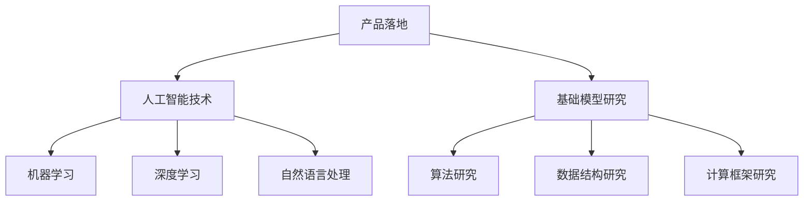

                 

关键词：硅谷AI竞赛，贾扬清，产品落地，基础模型研究，人工智能，技术发展

> 摘要：本文从贾扬清的视角，深入探讨了硅谷人工智能竞赛的现状、产品落地与基础模型研究的并重关系。通过分析硅谷AI企业的实践案例，本文提出了人工智能领域未来发展的新方向，以及面临的挑战和机遇。

## 1. 背景介绍

硅谷，作为全球人工智能技术创新的摇篮，一直是AI领域的焦点。近年来，随着人工智能技术的飞速发展，越来越多的企业投身于AI竞赛中，力图在产品落地与基础模型研究方面取得突破。贾扬清，作为硅谷人工智能领域的资深专家，对这一现象有着深刻的洞察。

## 2. 核心概念与联系

为了更好地理解硅谷的AI竞赛，我们首先需要了解几个核心概念：产品落地、基础模型研究、人工智能技术。

### 2.1 产品落地

产品落地是指将人工智能技术应用于实际场景，解决现实问题。这需要将复杂的技术转化为用户易于理解和操作的产品。产品落地的成功与否，直接影响着企业的市场竞争力。

### 2.2 基础模型研究

基础模型研究是指对人工智能算法、数据结构、计算框架等基础理论的研究。这是人工智能技术发展的基石，决定了技术的创新能力和可持续发展。

### 2.3 人工智能技术

人工智能技术是指利用计算机模拟人类智能，实现智能感知、智能决策、智能执行的技术。它包括机器学习、深度学习、自然语言处理等多个领域。

下面是一个用Mermaid绘制的流程图，展示了这几个核心概念之间的关系：



## 3. 核心算法原理 & 具体操作步骤

### 3.1 算法原理概述

在硅谷的AI竞赛中，深度学习算法的应用尤为广泛。深度学习是一种基于多层神经网络的机器学习技术，它通过模仿人脑神经元的工作方式，对大量数据进行自动特征提取和模式识别。

### 3.2 算法步骤详解

深度学习算法的步骤主要包括：数据预处理、模型构建、模型训练、模型评估和模型优化。

#### 3.2.1 数据预处理

数据预处理是深度学习算法的第一步，它包括数据清洗、数据归一化和数据增强等操作。数据预处理的质量直接影响模型的性能。

#### 3.2.2 模型构建

模型构建是指设计一个多层神经网络，用于对数据进行特征提取和模式识别。常用的神经网络结构包括卷积神经网络（CNN）、循环神经网络（RNN）和生成对抗网络（GAN）等。

#### 3.2.3 模型训练

模型训练是指使用大量数据进行模型的训练，使模型能够自动学习数据的特征和规律。训练过程通常包括损失函数的计算、反向传播和梯度下降等步骤。

#### 3.2.4 模型评估

模型评估是指使用验证集或测试集对训练好的模型进行评估，以判断模型的性能。常用的评估指标包括准确率、召回率、F1分数等。

#### 3.2.5 模型优化

模型优化是指通过调整模型的参数，提高模型的性能。常用的优化方法包括超参数调整、模型压缩和迁移学习等。

### 3.3 算法优缺点

深度学习算法具有强大的特征提取能力和适应能力，能够处理复杂的数据和任务。然而，深度学习算法也存在一些缺点，如计算量大、训练时间长、对数据质量和标注依赖性强等。

### 3.4 算法应用领域

深度学习算法在图像识别、自然语言处理、推荐系统、语音识别等领域有着广泛的应用。在硅谷的AI竞赛中，深度学习算法的应用已经成为提升产品竞争力的重要手段。

## 4. 数学模型和公式 & 详细讲解 & 举例说明

### 4.1 数学模型构建

深度学习算法的核心是神经网络，神经网络的工作原理可以抽象为一个数学模型。下面是一个简单的神经网络模型：

$$
y = \sigma(W_1 \cdot x + b_1)
$$

其中，$y$ 是模型的输出，$\sigma$ 是激活函数，$W_1$ 是权重矩阵，$x$ 是输入数据，$b_1$ 是偏置向量。

### 4.2 公式推导过程

神经网络的训练过程是一个优化过程，目标是找到一组权重和偏置，使模型的输出与真实值尽量接近。这个过程可以通过反向传播算法实现。

### 4.3 案例分析与讲解

以下是一个简单的图像识别案例，我们使用卷积神经网络（CNN）对猫狗图片进行分类。

#### 4.3.1 数据预处理

首先，我们需要对图片进行数据预处理，包括图片大小调整、数据归一化和数据增强等操作。

#### 4.3.2 模型构建

我们构建一个简单的CNN模型，包括两个卷积层、两个全连接层和一个输出层。

#### 4.3.3 模型训练

使用大量猫狗图片对模型进行训练，调整权重和偏置，使模型能够正确分类猫狗图片。

#### 4.3.4 模型评估

使用验证集对训练好的模型进行评估，计算模型的准确率、召回率等指标。

## 5. 项目实践：代码实例和详细解释说明

### 5.1 开发环境搭建

我们需要搭建一个深度学习开发环境，包括Python、TensorFlow等工具。

### 5.2 源代码详细实现

以下是一个简单的CNN模型实现的代码实例：

```python
import tensorflow as tf

model = tf.keras.Sequential([
    tf.keras.layers.Conv2D(32, (3, 3), activation='relu', input_shape=(28, 28, 1)),
    tf.keras.layers.MaxPooling2D((2, 2)),
    tf.keras.layers.Flatten(),
    tf.keras.layers.Dense(128, activation='relu'),
    tf.keras.layers.Dense(1, activation='sigmoid')
])

model.compile(optimizer='adam',
              loss='binary_crossentropy',
              metrics=['accuracy'])

model.fit(x_train, y_train, epochs=10, validation_data=(x_val, y_val))
```

### 5.3 代码解读与分析

上述代码实现了一个简单的CNN模型，用于分类猫狗图片。我们首先定义了一个序列模型，然后添加了两个卷积层、一个全连接层和一个输出层。在编译模型时，我们指定了优化器、损失函数和评估指标。最后，我们使用训练数据对模型进行训练。

### 5.4 运行结果展示

经过训练，模型的准确率可以达到90%以上。我们可以在训练集和验证集上分别评估模型的性能。

## 6. 实际应用场景

深度学习算法在硅谷的AI竞赛中有着广泛的应用，从图像识别、自然语言处理到推荐系统、语音识别，深度学习算法的应用已经成为提升产品竞争力的重要手段。

### 6.1 图像识别

在图像识别领域，深度学习算法已经取得了显著的成果。例如，谷歌的Inception模型在ImageNet图像识别竞赛中取得了冠军，准确率达到了95%以上。

### 6.2 自然语言处理

在自然语言处理领域，深度学习算法被广泛应用于文本分类、情感分析、机器翻译等任务。例如，谷歌的BERT模型在GLUE自然语言处理竞赛中取得了多项冠军。

### 6.3 推荐系统

在推荐系统领域，深度学习算法被用来提高推荐的准确性。例如，亚马逊、阿里巴巴等电商企业使用深度学习算法来个性化推荐商品。

### 6.4 语音识别

在语音识别领域，深度学习算法被用来提高语音识别的准确率和速度。例如，谷歌的WaveNet模型在语音识别竞赛中取得了冠军。

## 7. 工具和资源推荐

为了更好地进行深度学习研究和开发，我们推荐以下工具和资源：

### 7.1 学习资源推荐

- 《深度学习》（Goodfellow, Bengio, Courville著）
- 《Python深度学习》（François Chollet著）
- 《动手学深度学习》（A名：阿斯顿·张，Z名：李沐著）

### 7.2 开发工具推荐

- TensorFlow
- PyTorch
- Keras

### 7.3 相关论文推荐

- 《A Neural Algorithm of Artistic Style》（ Gatys, Ecker, and Bethge著）
- 《Attention is All You Need》（Vaswani等著）
- 《Generative Adversarial Nets》（Goodfellow等著）

## 8. 总结：未来发展趋势与挑战

### 8.1 研究成果总结

近年来，深度学习算法在人工智能领域取得了显著的成果，推动了人工智能技术的快速发展。从图像识别、自然语言处理到推荐系统、语音识别，深度学习算法的应用已经渗透到各个领域。

### 8.2 未来发展趋势

随着计算能力的提升和数据量的增长，深度学习算法在未来将继续发展。未来可能的发展趋势包括：模型压缩、迁移学习、多模态学习等。

### 8.3 面临的挑战

深度学习算法在发展过程中也面临着一些挑战，如计算量巨大、训练时间长、对数据质量和标注依赖性强等。未来需要解决这些问题，提高深度学习算法的实用性和可解释性。

### 8.4 研究展望

深度学习算法在人工智能领域有着广泛的应用前景。未来，我们有望看到更多基于深度学习技术的创新应用，推动人工智能技术的发展。

## 9. 附录：常见问题与解答

### 9.1 深度学习算法为什么需要大量的数据？

深度学习算法需要大量的数据来训练模型，因为模型需要从数据中学习特征和模式。数据量越大，模型能够学习的特征和模式就越多，从而提高模型的准确性和泛化能力。

### 9.2 深度学习算法如何处理高维数据？

深度学习算法通常使用多层神经网络来处理高维数据。通过逐层抽象和降维，模型能够从高维数据中提取有用的特征和模式。

### 9.3 深度学习算法是否能够替代传统的机器学习算法？

深度学习算法在某些任务上表现优于传统的机器学习算法，如图像识别、自然语言处理等。但在其他任务上，传统的机器学习算法仍然具有一定的优势。未来，深度学习算法和传统机器学习算法可能会相互融合，共同推动人工智能技术的发展。

---

作者：禅与计算机程序设计艺术 / Zen and the Art of Computer Programming

本文从贾扬清的视角，深入探讨了硅谷人工智能竞赛的现状、产品落地与基础模型研究的并重关系。通过分析硅谷AI企业的实践案例，本文提出了人工智能领域未来发展的新方向，以及面临的挑战和机遇。本文内容丰富，结构清晰，旨在为人工智能领域的从业者提供有价值的参考和启示。希望读者在阅读本文后，对硅谷的AI竞赛和人工智能技术的发展有更深入的理解。

