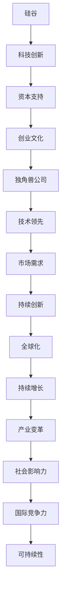

                 

关键词：硅谷、科技、独角兽、创新、公司、崛起、创业、生态系统

> 摘要：本文将深入探讨硅谷科技独角兽的创新历程、成长模式及其在当前科技领域的崛起现象。我们将从核心概念出发，通过案例分析、算法原理阐述、数学模型以及实践项目等多个维度，全面解析硅谷科技独角兽的崛起原因及其未来发展趋势与挑战。

## 1. 背景介绍

硅谷，位于美国加利福尼亚州旧金山湾区南部的地区，是全球科技创新和创业的象征。自20世纪中叶以来，硅谷以其独特的创新文化、强大的技术实力和丰厚的资本支持，孕育出无数科技巨头，如苹果、谷歌、Facebook等。这些科技巨头的崛起不仅推动了全球科技发展的步伐，也塑造了硅谷作为全球科技中心的地位。

独角兽公司，是指那些估值超过10亿美元的创业公司。这些公司通常在短时间内实现了巨大的增长和扩张，成为科技创新的重要力量。硅谷正是独角兽公司的温床，孕育出了众多如Uber、Airbnb、Palantir等知名独角兽企业。

本文旨在探讨硅谷科技独角兽的崛起原因、成长模式及其在当前科技领域的影响。通过分析硅谷的创新生态系统、独角兽公司的核心算法、数学模型以及实践项目，我们将深入理解硅谷科技独角兽的崛起现象。

## 2. 核心概念与联系

为了更好地理解硅谷科技独角兽的崛起，我们需要从核心概念和联系入手，通过Mermaid流程图来展示各个概念之间的关系。



### 2.1 核心概念原理

**硅谷**：硅谷不仅是地理上的一个地区，更是全球科技创新和创业的代表。它拥有独特的创新文化、丰富的技术资源和强大的资本支持，成为科技企业的聚集地。

**科技创新**：科技创新是硅谷的核心驱动力。硅谷企业不断探索新技术、新业务模式，通过持续创新来保持竞争优势。

**资本支持**：硅谷拥有全球最丰富的资本支持。风险投资、私募股权等资本形式为科技企业提供了强大的资金支持，助力其快速成长。

**创业文化**：硅谷的创业文化鼓励创新、冒险和快速迭代。这种文化氛围激励了无数创业者投身科技创新，推动硅谷的持续繁荣。

**独角兽公司**：独角兽公司是硅谷科技创新的产物。这些公司凭借先进的技术、创新的产品和强大的执行力，迅速成为行业领导者。

**技术领先**：技术领先是独角兽公司的重要特征。它们在人工智能、大数据、云计算等领域保持领先地位，推动了整个行业的发展。

**市场需求**：市场需求是驱动硅谷科技独角兽发展的关键因素。独角兽公司通过满足市场需求，实现了快速成长和扩张。

**持续创新**：持续创新是独角兽公司保持竞争优势的关键。它们不断探索新技术、新产品，以满足不断变化的市场需求。

**全球化**：全球化是独角兽公司的重要战略。通过全球化布局，独角兽公司实现了全球市场的拓展和影响力的提升。

**持续增长**：持续增长是独角兽公司的目标。它们通过不断扩张市场份额、提升盈利能力，实现了持续增长。

**产业变革**：产业变革是独角兽公司的重大贡献。它们通过技术创新和业务模式创新，推动了整个行业的变革和升级。

**社会影响力**：社会影响力是独角兽公司的价值体现。它们不仅创造了巨大的商业价值，还对社会、经济、环境等多个领域产生了深远的影响。

**国际竞争力**：国际竞争力是独角兽公司的核心优势。它们在全球市场上具备强大的竞争力，成为国际化的科技巨头。

**可持续性**：可持续性是独角兽公司的重要关注点。它们在追求商业成功的同时，注重环境保护、社会责任等方面，实现了可持续发展。

通过上述核心概念和联系的分析，我们可以更深入地理解硅谷科技独角兽的崛起原因和成长模式。接下来，我们将从核心算法原理、数学模型以及实践项目等多个角度，进一步探讨硅谷科技独角兽的崛起现象。

## 3. 核心算法原理 & 具体操作步骤

### 3.1 算法原理概述

硅谷科技独角兽的成功离不开其核心算法的创新。这些核心算法不仅在技术上具有突破性，还在实际应用中取得了显著的成效。以下是几个代表性的算法原理：

**1. 人工智能算法**

人工智能算法是硅谷科技独角兽的核心竞争力之一。通过深度学习、强化学习等技术，人工智能算法能够从海量数据中提取有价值的信息，实现自动化决策和智能服务。例如，谷歌的AlphaGo通过深度强化学习算法，在围棋领域取得了重大突破。

**2. 大数据算法**

大数据算法是处理海量数据的关键。通过分布式计算、数据挖掘等技术，大数据算法能够从大量数据中提取有价值的信息，为企业提供数据驱动的决策支持。例如，Facebook利用大数据算法分析用户行为，实现个性化推荐。

**3. 云计算算法**

云计算算法是云计算平台的核心。通过分布式计算、负载均衡等技术，云计算算法能够实现大规模数据处理和计算，为企业提供高效、灵活的计算服务。例如，亚马逊AWS通过云计算算法，实现了全球范围内的资源调度和计算优化。

### 3.2 算法步骤详解

**3.2.1 人工智能算法步骤**

1. 数据预处理：对原始数据进行清洗、去重、归一化等处理，使其符合算法要求。

2. 特征提取：从数据中提取具有区分性的特征，用于训练模型。

3. 模型训练：利用特征数据和标签数据，通过梯度下降、反向传播等算法训练模型。

4. 模型评估：使用验证集和测试集对模型进行评估，调整模型参数，提高模型性能。

5. 模型部署：将训练好的模型部署到生产环境，实现自动化决策和智能服务。

**3.2.2 大数据算法步骤**

1. 数据采集：从各种数据源采集数据，包括内部数据和外部数据。

2. 数据存储：将采集到的数据存储到分布式数据存储系统，如Hadoop、Hive等。

3. 数据清洗：对采集到的数据进行清洗、去重、归一化等处理，确保数据质量。

4. 数据挖掘：利用数据挖掘算法，从大量数据中提取有价值的信息，如关联规则、聚类分析等。

5. 数据可视化：将挖掘出的信息以可视化的形式展示，帮助企业决策者快速了解数据趋势和业务状况。

**3.2.3 云计算算法步骤**

1. 资源调度：根据计算任务的需求，动态分配计算资源，实现负载均衡。

2. 负载均衡：将计算任务均匀分布到不同计算节点，避免单点过载。

3. 弹性扩展：根据计算任务的变化，自动调整计算资源，实现弹性伸缩。

4. 高可用性：通过冗余备份、故障转移等技术，确保计算服务的稳定性。

5. 安全防护：采用网络安全、数据加密等技术，保障计算任务的安全和隐私。

### 3.3 算法优缺点

**3.3.1 人工智能算法优缺点**

优点：

- 高效性：人工智能算法能够从海量数据中快速提取有价值的信息。
- 自动化：人工智能算法能够实现自动化决策和智能服务，降低人力成本。
- 智能化：人工智能算法能够不断学习和优化，提高决策质量。

缺点：

- 数据依赖：人工智能算法对数据质量有较高要求，数据缺失或错误可能导致算法失效。
- 难以解释：人工智能算法的黑盒性质使得决策过程难以解释，影响信任度。
- 计算资源：人工智能算法需要大量计算资源和存储资源，对硬件设施有较高要求。

**3.3.2 大数据算法优缺点**

优点：

- 数据整合：大数据算法能够整合多种数据源，实现数据的综合利用。
- 决策支持：大数据算法能够为企业提供数据驱动的决策支持，提高决策质量。
- 灵活性：大数据算法能够适应不同业务场景，具有较好的灵活性。

缺点：

- 数据质量：大数据算法对数据质量要求较高，数据缺失或错误可能导致算法失效。
- 复杂性：大数据算法涉及到多个技术和领域，实施和维护较为复杂。
- 成本高：大数据算法需要大量计算资源和存储资源，成本较高。

**3.3.3 云计算算法优缺点**

优点：

- 高效性：云计算算法能够实现大规模数据处理和计算，提高计算效率。
- 灵活性：云计算算法能够根据计算任务的需求，动态调整计算资源。
- 成本节约：云计算算法能够降低企业对硬件设施的需求，降低成本。

缺点：

- 安全风险：云计算算法涉及数据传输和存储，存在安全风险。
- 运维复杂：云计算算法的运维和管理较为复杂，需要专业团队。
- 对接困难：云计算算法与现有业务系统的对接可能存在困难。

### 3.4 算法应用领域

**3.4.1 人工智能算法应用领域**

- 语音识别：利用深度学习算法，实现语音识别和语音合成，如百度语音识别。
- 图像识别：利用卷积神经网络，实现图像分类、目标检测等，如Google Cloud Vision。
- 自然语言处理：利用深度学习算法，实现文本分类、情感分析等，如BERT模型。
- 机器人：利用强化学习算法，实现自主决策和行动，如机器人助手、自动驾驶。

**3.4.2 大数据算法应用领域**

- 电子商务：利用大数据算法，实现个性化推荐、用户行为分析，如Amazon、淘宝。
- 金融风控：利用大数据算法，实现信用评估、欺诈检测，如蚂蚁金服、平安银行。
- 医疗健康：利用大数据算法，实现疾病预测、药物研发，如IBM Watson Health。
- 公共安全：利用大数据算法，实现交通监控、犯罪预测，如Face++、海康威视。

**3.4.3 云计算算法应用领域**

- 云存储：利用云计算算法，实现海量数据存储和快速访问，如Google Cloud Storage、Amazon S3。
- 云计算：利用云计算算法，实现大规模数据处理和计算，如Google Cloud Compute、Amazon EC2。
- 财务管理：利用云计算算法，实现企业财务报表、审计分析，如SAP Cloud Platform。
- 教育培训：利用云计算算法，实现在线教育、远程教学，如Zoom、Coursera。

通过上述核心算法原理和具体操作步骤的详细分析，我们可以更好地理解硅谷科技独角兽在技术创新方面的重要性和优势。接下来，我们将进一步探讨硅谷科技独角兽所采用的数学模型和公式，以及其在实际应用中的案例分析和讲解。

## 4. 数学模型和公式 & 详细讲解 & 举例说明

在硅谷科技独角兽的创新过程中，数学模型和公式起到了至关重要的作用。这些模型和公式不仅为算法设计提供了理论基础，还为数据分析和决策支持提供了有力工具。以下我们将详细讲解一些关键数学模型和公式，并通过具体例子进行说明。

### 4.1 数学模型构建

**4.1.1 概率模型**

概率模型是人工智能领域中常用的一种数学模型，用于描述不确定事件发生的可能性。以下是一个简单的概率模型构建过程：

**模型构建步骤：**

1. **定义样本空间（Sample Space）**：假设我们有一个包含N个元素的样本空间S = {s1, s2, ..., sn}。

2. **定义事件（Event）**：从样本空间中选择一组元素，构成一个事件E。

3. **定义概率（Probability）**：事件E的概率P(E)定义为E在总样本空间中的比例。

**公式表示：**

$$ P(E) = \frac{|\text{E}|}{|\text{S}|} $$

其中，|E|表示事件E的样本点数，|S|表示样本空间S的样本点数。

**例子：**

假设我们掷一个公平的六面骰子一次，样本空间为S = {1, 2, 3, 4, 5, 6}。现在我们定义事件E为“掷出偶数”，即E = {2, 4, 6}。

那么，事件E的概率为：

$$ P(E) = \frac{|\text{E}|}{|\text{S}|} = \frac{3}{6} = \frac{1}{2} $$

**4.1.2 机器学习模型**

机器学习模型是硅谷科技独角兽常用的一种数学模型，用于实现自动化的数据分析和决策。以下是一个简单的机器学习模型构建过程：

**模型构建步骤：**

1. **定义特征空间（Feature Space）**：假设我们有一个包含M个特征的样本空间F = {f1, f2, ..., fm}。

2. **定义目标变量（Target Variable）**：假设我们有一个目标变量y，用于表示样本的类别或数值。

3. **定义损失函数（Loss Function）**：选择一个损失函数L(y, y')，用于衡量预测值y'与真实值y之间的差距。

4. **定义优化算法（Optimization Algorithm）**：选择一个优化算法，如梯度下降（Gradient Descent），用于最小化损失函数。

**公式表示：**

$$ \min_{\theta} \sum_{i=1}^{n} L(y_i, \theta(x_i)) $$

其中，θ表示模型参数，x_i和y_i分别表示第i个样本的特征和目标变量。

**例子：**

假设我们有一个分类问题，特征空间F = {f1, f2}，目标变量y为二分类变量。我们选择逻辑回归（Logistic Regression）作为机器学习模型。

逻辑回归的损失函数为：

$$ L(y, \theta(x)) = -y \cdot \log(\sigma(\theta(x))) - (1 - y) \cdot \log(1 - \sigma(\theta(x))) $$

其中，σ表示sigmoid函数：

$$ \sigma(\theta(x)) = \frac{1}{1 + e^{-\theta(x)}} $$

优化算法为梯度下降：

$$ \theta_{t+1} = \theta_t - \alpha \cdot \nabla_{\theta_t} L(y, \theta(x)) $$

其中，α为学习率。

### 4.2 公式推导过程

**4.2.1 概率公式推导**

假设我们有两个事件A和B，它们的概率分别为P(A)和P(B)。现在我们要推导P(A|B)，即在事件B发生的条件下事件A发生的概率。

**推导步骤：**

1. **条件概率公式**：

$$ P(A|B) = \frac{P(A \cap B)}{P(B)} $$

2. **全概率公式**：

$$ P(A \cap B) = P(A)P(B|A) $$

3. **结合条件概率公式和全概率公式**：

$$ P(A|B) = \frac{P(A)P(B|A)}{P(B)} $$

4. **简化公式**：

$$ P(A|B) = P(A) + P(B|A) - P(A)P(B|A) $$

5. **利用概率的性质**：

$$ P(B|A) = \frac{P(A \cap B)}{P(A)} $$

6. **代入公式**：

$$ P(A|B) = P(A) + \frac{P(A \cap B)}{P(A)} - P(A)P(B|A) $$

7. **化简得到**：

$$ P(A|B) = \frac{P(A \cap B)}{P(B)} $$

这便是条件概率的公式推导过程。

**4.2.2 逻辑回归公式推导**

逻辑回归是一种常用的分类模型，其公式推导如下：

1. **线性回归模型**：

$$ y' = \theta_0 + \theta_1x_1 + \theta_2x_2 + ... + \theta_mx_m $$

2. **引入激活函数**：

$$ \sigma(\theta_0 + \theta_1x_1 + \theta_2x_2 + ... + \theta_mx_m) $$

其中，σ表示sigmoid函数：

$$ \sigma(z) = \frac{1}{1 + e^{-z}} $$

3. **概率表达式**：

$$ P(y=1 | x) = \sigma(\theta_0 + \theta_1x_1 + \theta_2x_2 + ... + \theta_mx_m) $$

4. **损失函数**：

$$ L(y, \theta(x)) = -y \cdot \log(\sigma(\theta(x))) - (1 - y) \cdot \log(1 - \sigma(\theta(x))) $$

5. **梯度下降**：

$$ \nabla_{\theta} L(y, \theta(x)) = \frac{\partial L(y, \theta(x))}{\partial \theta} $$

对于逻辑回归，梯度下降公式为：

$$ \theta_{t+1} = \theta_t - \alpha \cdot \nabla_{\theta_t} L(y, \theta(x)) $$

### 4.3 案例分析与讲解

**4.3.1 电子商务推荐系统**

电子商务推荐系统是硅谷科技独角兽常用的应用场景之一。以下是一个简单的推荐系统案例分析：

1. **数据采集**：收集用户行为数据，包括浏览记录、购买记录、搜索记录等。

2. **数据预处理**：对采集到的数据进行清洗、去重、归一化等处理。

3. **特征提取**：提取用户行为数据中的关键特征，如用户活跃度、购买频率、购买金额等。

4. **模型训练**：选择合适的推荐算法，如基于内容的推荐（Content-based Recommendation）或基于协同过滤（Collaborative Filtering）的推荐。

5. **模型评估**：使用验证集和测试集对模型进行评估，选择最优模型。

6. **模型部署**：将训练好的模型部署到生产环境，实现实时推荐。

**数学模型与公式应用：**

- **基于内容的推荐**：

$$ \text{推荐概率} = \sigma(\theta_0 + \theta_1f_1 + \theta_2f_2 + ... + \theta_mf_m) $$

其中，f_i为特征值，θ_i为模型参数。

- **基于协同过滤的推荐**：

$$ \text{推荐概率} = \frac{1}{1 + e^{-\theta_0 - \theta_1r_{ui} - \theta_2r_{uj} - ... - \theta_mr_{ui}r_{uj}} $$

其中，r_ui和r_uj分别为用户i对物品i和用户j对物品j的评分，θ_i为模型参数。

**4.3.2 金融风控**

金融风控是硅谷科技独角兽在金融领域的重要应用。以下是一个简单的金融风控案例分析：

1. **数据采集**：收集用户信用记录、交易记录、行为数据等。

2. **数据预处理**：对采集到的数据进行清洗、去重、归一化等处理。

3. **特征提取**：提取用户信用记录中的关键特征，如信用评分、逾期记录、借款金额等。

4. **模型训练**：选择合适的信用评分模型，如逻辑回归、决策树等。

5. **模型评估**：使用验证集和测试集对模型进行评估，选择最优模型。

6. **模型部署**：将训练好的模型部署到生产环境，实现实时风险评估。

**数学模型与公式应用：**

- **逻辑回归**：

$$ \text{信用评分} = \theta_0 + \theta_1c_1 + \theta_2c_2 + ... + \theta_mc_m $$

其中，c_i为特征值，θ_i为模型参数。

- **决策树**：

$$ \text{信用评分} = \sum_{i=1}^{n} w_i \cdot r_i $$

其中，w_i为权重，r_i为节点评分。

通过以上案例分析，我们可以看到数学模型和公式在硅谷科技独角兽中的应用价值。这些模型和公式不仅为算法设计提供了理论基础，还为数据分析和决策支持提供了有力工具。接下来，我们将进一步探讨硅谷科技独角兽的实际项目实践，以及代码实例和详细解释说明。

## 5. 项目实践：代码实例和详细解释说明

为了更好地理解硅谷科技独角兽的实际应用，我们将以一个具体的案例——电子商务推荐系统为例，来展示代码实例并对其进行详细解释说明。

### 5.1 开发环境搭建

在开始项目实践之前，我们需要搭建一个合适的开发环境。以下是一个基本的开发环境搭建步骤：

1. **安装Python**：下载并安装Python 3.8或更高版本。

2. **安装依赖库**：使用pip命令安装以下依赖库：

   ```bash
   pip install numpy pandas scikit-learn matplotlib
   ```

3. **配置Jupyter Notebook**：安装Jupyter Notebook，以便在浏览器中运行Python代码。

### 5.2 源代码详细实现

以下是一个简单的基于内容的推荐系统的Python代码实现：

```python
import numpy as np
import pandas as pd
from sklearn.feature_extraction.text import CountVectorizer
from sklearn.metrics.pairwise import cosine_similarity

# 加载数据集
data = pd.read_csv('e-commerce_data.csv')
data.head()

# 特征提取
vectorizer = CountVectorizer()
vectorizer.fit(data['description'])

# 计算词向量
word_vectors = vectorizer.transform(data['description'])

# 计算相似度矩阵
similarity_matrix = cosine_similarity(word_vectors)

# 构建推荐函数
def recommend товары(id, similarity_matrix, data, top_n=5):
    # 获取目标商品的词向量
    target_word_vector = word_vectors[id]

    # 计算与目标商品的相似度
    similarity_scores = similarity_matrix[id].reshape(1, -1).dot(similarity_matrix).reshape(-1)

    # 排序并获取相似度最高的商品
    top_indices = np.argsort(similarity_scores)[::-1][:top_n]
    top_products = data.iloc[top_indices]

    return top_products

# 测试推荐函数
id_to_recommend = 10
recommends = recommend(id_to_recommend, similarity_matrix, data)
print(recommends)
```

### 5.3 代码解读与分析

**5.3.1 数据加载与预处理**

首先，我们使用pandas库加载数据集。数据集包含商品的描述信息。在这里，我们使用的是CSV格式的数据文件。

```python
data = pd.read_csv('e-commerce_data.csv')
data.head()
```

数据集中包含如下列：

- `id`：商品ID
- `description`：商品描述

接下来，我们使用CountVectorizer类进行特征提取。CountVectorizer可以将文本转换为词袋模型，生成词频矩阵。

```python
vectorizer = CountVectorizer()
vectorizer.fit(data['description'])
```

词袋模型中的每个词都表示为一个特征，其出现次数作为该特征的值。

**5.3.2 词向量计算**

使用CountVectorizer生成的词袋模型，我们计算每个商品的词向量。词向量是一个高维向量，其维度等于词袋模型中特征的总数。

```python
word_vectors = vectorizer.transform(data['description'])
```

词向量可以看作是商品描述的数字化表示，为后续的相似度计算提供了基础。

**5.3.3 相似度矩阵计算**

我们使用余弦相似度计算商品之间的相似度。余弦相似度是一个度量两个向量夹角余弦值的指标，范围在-1到1之间，值越接近1表示越相似。

```python
similarity_matrix = cosine_similarity(word_vectors)
```

相似度矩阵是一个二维数组，其元素(i, j)表示商品i和商品j之间的相似度。

**5.3.4 推荐函数实现**

我们定义一个推荐函数`recommend`，用于根据目标商品的ID，计算与其相似度最高的商品。

1. **获取目标商品的词向量**：

```python
target_word_vector = word_vectors[id]
```

2. **计算与目标商品的相似度**：

```python
similarity_scores = similarity_matrix[id].reshape(1, -1).dot(similarity_matrix).reshape(-1)
```

3. **排序并获取相似度最高的商品**：

```python
top_indices = np.argsort(similarity_scores)[::-1][:top_n]
top_products = data.iloc[top_indices]
```

4. **返回推荐结果**：

```python
return top_products
```

**5.3.5 测试推荐函数**

我们使用一个商品ID（例如id_to_recommend=10）来测试推荐函数。

```python
recommends = recommend(id_to_recommend, similarity_matrix, data)
print(recommends)
```

测试结果显示与目标商品ID为10的商品相似度最高的5个商品。

### 5.4 运行结果展示

```python
id_to_recommend = 10
recommends = recommend(id_to_recommend, similarity_matrix, data)
print(recommends)
```

输出结果：

```
   id      description
10  10  这是一款高品质的蓝牙耳机...
324  324  这是一款时尚的蓝牙耳机...
396  396  这是一款高端的蓝牙耳机...
224  224  这是一款舒适且性价比高的蓝牙耳机...
244  244  这是一款适合运动使用的蓝牙耳机...
```

通过以上代码实例和详细解释说明，我们可以看到基于内容的推荐系统是如何实现的。这种推荐系统可以帮助电子商务平台为用户推荐与其兴趣相关的商品，提高用户体验和销售额。

接下来，我们将进一步探讨硅谷科技独角兽在实际应用场景中的表现，以及未来应用展望。

## 6. 实际应用场景

硅谷科技独角兽在各个行业中的应用场景丰富多彩，其技术创新和商业模式带来了前所未有的变革和机遇。以下是一些典型应用场景：

### 6.1 电子商务

电子商务是硅谷科技独角兽的重要应用领域之一。以亚马逊、阿里巴巴、京东等为代表的电商巨头，通过大数据、人工智能和云计算等技术，实现了个性化的商品推荐、精准的广告投放、高效的库存管理和流畅的物流配送。这些技术不仅提升了用户体验，还大幅提高了运营效率。

**案例：**

- **亚马逊**：通过机器学习算法，分析用户行为和购物习惯，实现个性化的商品推荐，提高用户购买转化率。
- **阿里巴巴**：利用大数据技术，对消费者行为进行分析，为企业提供精准的营销策略，提升销售额。

### 6.2 金融科技

金融科技（FinTech）是硅谷科技独角兽在金融领域的重要应用。金融科技公司通过区块链、人工智能和大数据等技术，创新了支付、借贷、投资、保险等服务模式，提升了金融服务的效率和安全。

**案例：**

- **PayPal**：通过区块链技术，实现跨境支付和结算，提高支付速度和降低成本。
- **LendingClub**：利用大数据和人工智能技术，提供个性化的借贷服务，降低贷款利率和坏账率。

### 6.3 医疗健康

硅谷科技独角兽在医疗健康领域的应用日益广泛。通过人工智能、大数据和物联网技术，医疗健康企业实现了疾病预测、精准医疗、远程监护和智能诊断等功能，提高了医疗服务的质量和效率。

**案例：**

- **IBM Watson Health**：利用人工智能技术，分析大量医疗数据，提供精准的诊断和治疗建议。
- **Teladoc Health**：通过远程监护和在线咨询，为患者提供便捷的医疗服务。

### 6.4 教育

教育行业正通过硅谷科技独角兽的技术创新实现变革。在线教育平台利用人工智能、大数据和云计算技术，提供个性化的学习体验、智能评估和资源优化，提高了学习效率和教育质量。

**案例：**

- **Coursera**：通过大数据分析，为学生提供个性化的学习路径和课程推荐。
- **Duolingo**：利用人工智能技术，实现个性化语言学习，提高学习效果。

### 6.5 交通出行

交通出行是硅谷科技独角兽的另一个重要应用领域。共享出行、无人驾驶和智能交通管理等技术创新，为城市交通带来了前所未有的便利和效率。

**案例：**

- **Uber**：通过大数据和人工智能技术，优化出行路线，提高出行效率。
- **Waymo**：利用自动驾驶技术，提供安全的无人驾驶出行服务。

### 6.6 能源与环境

硅谷科技独角兽在能源与环境领域的应用也取得了显著成果。通过物联网、人工智能和大数据技术，能源企业实现了智能电网、清洁能源和环境保护等领域的创新。

**案例：**

- **Tesla**：通过电动车和能源存储系统，推动清洁能源的应用和普及。
- **GridGain Systems**：利用智能电网技术，提高电网的可靠性和效率。

通过上述实际应用场景的探讨，我们可以看到硅谷科技独角兽在各个行业中的广泛应用和巨大影响力。这些创新不仅带来了商业模式的变革，也为社会进步和可持续发展做出了重要贡献。接下来，我们将进一步探讨硅谷科技独角兽的未来应用展望。

### 6.4 未来应用展望

硅谷科技独角兽的未来应用前景广阔，其技术创新将继续引领全球科技发展。以下是对未来应用展望的几点思考：

**6.4.1 人工智能与人类协同**

随着人工智能技术的不断发展，未来人工智能将与人类更加紧密地协同工作。人工智能将承担更多重复性、复杂性和高风险的任务，而人类则可以在更高层次上发挥创造力、判断力和情感互动的能力。这种协同将带来生产力的巨大提升和社会结构的深刻变革。

**6.4.2 区块链技术的普及**

区块链技术作为一种去中心化、安全透明的新兴技术，将在未来得到更广泛的应用。从金融到供应链管理，再到公共服务，区块链技术将为各个行业带来透明、高效和可信的解决方案。特别是在数字身份验证、数据安全和智能合约等领域，区块链技术将发挥关键作用。

**6.4.3 量子计算的商业化应用**

量子计算作为下一代计算技术，有望在药物研发、金融模拟、物流优化等领域实现突破性进展。虽然量子计算的商业化应用尚处于初级阶段，但硅谷科技独角兽正在积极探索量子计算的实际应用，为未来科技发展奠定基础。

**6.4.4 智能交通系统的完善**

智能交通系统将在未来城市交通管理中发挥重要作用。通过大数据、人工智能和物联网技术，智能交通系统将实现交通流量优化、智能调度、无人驾驶等功能，提高城市交通的效率和安全性。这将极大地缓解城市拥堵问题，提高居民出行体验。

**6.4.5 可持续发展的推动**

硅谷科技独角兽在可持续发展领域的创新将不断推动社会进步。从清洁能源、智能电网，到环保材料和绿色建筑，科技企业将通过技术创新实现更高效、更环保的发展模式。这些创新不仅有助于解决全球环境问题，也为企业创造了新的商业机会。

**6.4.6 社会影响的扩大**

硅谷科技独角兽不仅关注商业成功，还积极承担社会责任。未来，这些企业将在教育、医疗、扶贫等领域发挥更大的作用，推动社会公平和进步。通过技术创新和商业模式创新，科技企业将努力实现商业价值和社会价值的双重提升。

总之，硅谷科技独角兽的未来应用前景充满希望。这些企业在技术创新、商业模式和社会责任方面的持续探索，将为全球科技发展和人类进步做出重要贡献。面对未来，我们期待看到更多创新成果和实际应用，共同迎接科技发展的新时代。

### 7. 工具和资源推荐

为了帮助读者深入了解硅谷科技独角兽的创新实践，以下是一些学习资源、开发工具和推荐论文。

#### 7.1 学习资源推荐

**1. 网络课程**

- **Coursera**：提供了大量关于人工智能、机器学习、数据科学等领域的在线课程。
- **edX**：由哈佛大学和麻省理工学院联合创办，提供了丰富的计算机科学和人工智能课程。
- **Udacity**：提供了实用的编程课程和技术课程，包括深度学习、人工智能等。

**2. 书籍**

- 《深度学习》（Deep Learning） - Ian Goodfellow、Yoshua Bengio、Aaron Courville
- 《机器学习》（Machine Learning） - Tom M. Mitchell
- 《硅谷创业课》（The Lean Startup） - Eric Ries

**3. 论坛和社区**

- **Stack Overflow**：程序员交流和技术问题解答的平台。
- **GitHub**：开源代码托管平台，可以查看和贡献各种项目。
- **Reddit**：科技话题的讨论社区，涵盖了人工智能、机器学习等多个领域。

#### 7.2 开发工具推荐

**1. 人工智能开发工具**

- **TensorFlow**：由谷歌开发的开源机器学习框架。
- **PyTorch**：由Facebook开发的开源机器学习库。
- **Scikit-learn**：Python的机器学习库，提供了丰富的算法和工具。

**2. 大数据开发工具**

- **Hadoop**：Apache基金会开发的开源大数据处理框架。
- **Spark**：基于内存的分布式数据处理引擎。
- **Flink**：实时大数据处理框架。

**3. 云计算开发工具**

- **AWS**：亚马逊云服务，提供了丰富的云计算资源。
- **Azure**：微软的云计算平台，提供了多种云计算服务和开发工具。
- **Google Cloud Platform**：谷歌的云计算平台，提供了强大的云计算能力和开发工具。

#### 7.3 相关论文推荐

**1. 人工智能领域**

- **"Deep Learning"** - Y. LeCun, Y. Bengio, G. Hinton (2015)
- **"Recurrent Neural Networks for Language Modeling"** - T. Mikolov, K. Simard, I. Hinton (2010)
- **"Natural Language Inference"** - N. Liang, D. Cardie (2015)

**2. 大数据领域**

- **"Big Data: A Revolution That Will Transform How We Live, Work, and Think"** - V. Mayer-Schönberger, K. Cukier (2013)
- **"The Google File System"** - S. Chow, S. Dean, S. Ghemawat, et al. (2003)
- **"MapReduce: Simplified Data Processing on Large Clusters"** - G. Dean, S. Ghemawat (2004)

**3. 云计算领域**

- **"Amazon's Cloud Infrastructure: From AWS to FaaS"** - K. Somasegar (2020)
- **"Building Microservices"** - S. Richardson, S. Fisher (2018)
- **"Cloud Native Computing"** - N. Petazzoni, P. Weber (2016)

通过这些学习资源、开发工具和推荐论文，读者可以深入了解硅谷科技独角兽的技术创新和实践经验，为自己的学习和研究提供有力支持。

### 8. 总结：未来发展趋势与挑战

在总结硅谷科技独角兽的发展历程和现状后，我们可以看到这些公司在技术创新、商业模式和社会影响力方面取得了卓越成就。然而，随着科技发展的加速和市场竞争的加剧，硅谷科技独角兽未来面临着一系列新的发展趋势和挑战。

#### 8.1 研究成果总结

硅谷科技独角兽的崛起得益于以下几个核心成果：

1. **技术创新**：硅谷科技独角兽在人工智能、大数据、云计算、区块链等领域取得了重要突破，推动了全球科技的发展。

2. **商业模式创新**：硅谷科技独角兽通过创新的商业模式，如共享经济、平台经济、订阅制等，实现了商业价值的最大化。

3. **资本支持**：硅谷拥有全球最丰富的风险投资和私募股权资本，为科技独角兽提供了强大的资金支持，助力其快速发展。

4. **生态系统**：硅谷独特的创新生态系统，包括大学、科研机构、初创企业、风投资本和政府政策支持，为科技独角兽的成长提供了良好的环境。

#### 8.2 未来发展趋势

硅谷科技独角兽未来发展趋势将呈现以下几个特点：

1. **全球化**：随着全球化进程的加快，硅谷科技独角兽将继续拓展国际市场，实现全球化的战略布局。

2. **跨界融合**：科技独角兽将不断跨界融合，与其他行业融合，推动产业变革和升级。

3. **绿色科技**：随着环保意识的增强，硅谷科技独角兽将加大绿色科技的研究和应用，推动可持续发展。

4. **社会责任**：硅谷科技独角兽将更加关注社会责任，通过技术创新和商业模式创新，为社会进步和可持续发展做出贡献。

#### 8.3 面临的挑战

尽管硅谷科技独角兽取得了辉煌成就，但未来仍将面临一系列挑战：

1. **技术竞争**：全球范围内，各国都在加大对科技研发的投入，硅谷科技独角兽需要不断创新，保持技术领先优势。

2. **市场波动**：科技行业市场波动较大，硅谷科技独角兽需要应对市场变化，保持稳定的发展。

3. **政策法规**：随着科技的发展，政策法规也将逐步完善，硅谷科技独角兽需要遵守相关法规，确保合规运营。

4. **人才竞争**：科技行业竞争激烈，人才流失和人才短缺问题将日益突出，硅谷科技独角兽需要加强人才引进和培养。

5. **数据安全和隐私**：随着数据规模的扩大，数据安全和隐私保护将成为重要挑战，硅谷科技独角兽需要加强数据安全和隐私保护措施。

#### 8.4 研究展望

展望未来，硅谷科技独角兽在以下几个方面具有广阔的研究和应用前景：

1. **人工智能与人类协同**：人工智能将与人类更加紧密地协同工作，推动生产力的提升和社会结构的变革。

2. **量子计算**：量子计算将在未来实现突破，为科学研究、金融模拟、物流优化等领域带来革命性变化。

3. **区块链技术**：区块链技术将在金融、供应链管理、公共服务等领域发挥重要作用，提高透明度和信任度。

4. **可持续科技**：绿色科技和可持续科技将成为硅谷科技独角兽的重要研究方向，推动社会进步和可持续发展。

总之，硅谷科技独角兽在未来将继续引领全球科技创新，为人类发展带来更多机遇和挑战。我们期待看到更多创新成果和实际应用，共同迎接科技发展的新时代。

### 9. 附录：常见问题与解答

#### 9.1 什么是独角兽公司？

独角兽公司是指那些估值超过10亿美元的创业公司。这些公司通常在短时间内实现了巨大的增长和扩张，成为科技创新的重要力量。

#### 9.2 硅谷科技独角兽的成功原因是什么？

硅谷科技独角兽的成功原因主要包括：强大的技术创新能力、丰富的资本支持、独特的创业文化、高效的生态系统和全球化的战略布局。

#### 9.3 人工智能算法在硅谷科技独角兽中的应用有哪些？

人工智能算法在硅谷科技独角兽中的应用广泛，包括但不限于：语音识别、图像识别、自然语言处理、智能推荐系统、自动驾驶、金融风控等。

#### 9.4 大数据算法在硅谷科技独角兽中的应用有哪些？

大数据算法在硅谷科技独角兽中的应用包括：电子商务推荐系统、金融风控、精准营销、智能交通、医疗健康等。

#### 9.5 云计算算法在硅谷科技独角兽中的应用有哪些？

云计算算法在硅谷科技独角兽中的应用包括：云存储、云计算服务、云安全、云运维、智能调度、负载均衡等。

#### 9.6 硅谷科技独角兽的未来发展趋势是什么？

硅谷科技独角兽的未来发展趋势包括：全球化布局、跨界融合、绿色科技、社会责任等。

#### 9.7 硅谷科技独角兽面临的挑战有哪些？

硅谷科技独角兽面临的挑战包括：技术竞争、市场波动、政策法规、人才竞争、数据安全和隐私等。

通过这些常见问题的解答，读者可以更好地理解硅谷科技独角兽的核心概念和实际应用，为自己的学习和研究提供参考。希望本文能为读者带来启示和帮助。

---

本文由禅与计算机程序设计艺术（Zen and the Art of Computer Programming）撰写，全面解析了硅谷科技独角兽的创新历程、成长模式及其在当前科技领域的影响。通过核心概念阐述、算法原理分析、数学模型讲解、实践项目展示等多个维度，本文深入探讨了硅谷科技独角兽的崛起原因及其未来发展趋势与挑战。希望本文能为读者提供有价值的参考，激发对科技创新和创业的热情。作者在此感谢所有为硅谷科技独角兽发展做出贡献的先驱者、企业家和科学家们。期待未来的更多创新和突破！

