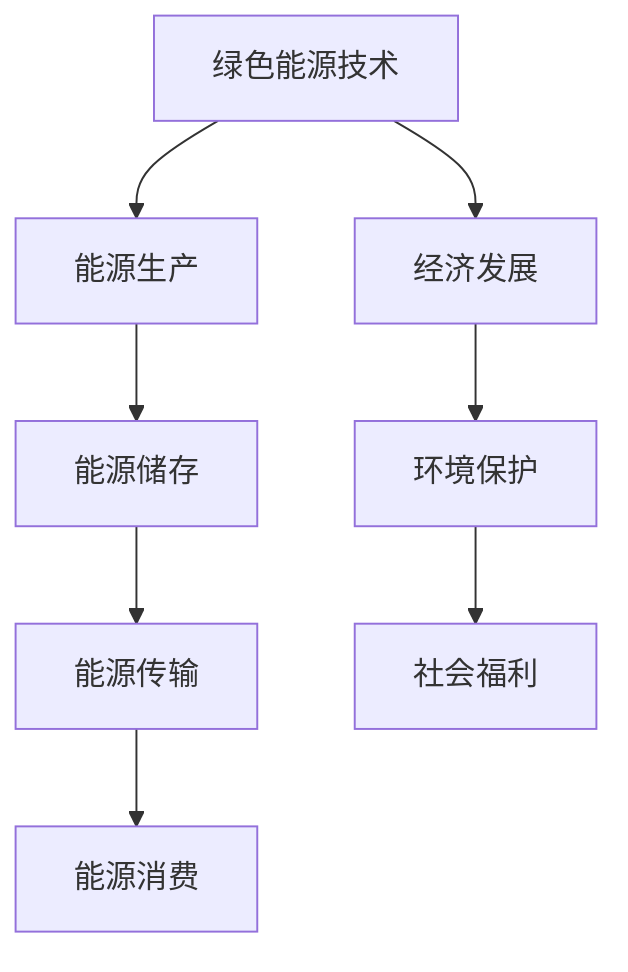

                 

关键词：绿色能源、可再生能源、硅谷、能源革命、技术进步、创新应用、可持续发展、能源效率、环保策略。

## 摘要

随着全球对气候变化和可持续发展的关注日益增加，绿色能源革命正在硅谷迅速展开。本文将探讨可再生能源公司如何利用先进的技术和创新解决方案，推动能源转型，实现环保和经济效益的双重目标。本文将分析硅谷在可再生能源领域的发展现状，核心概念和联系，核心算法原理，数学模型和公式，项目实践，实际应用场景，未来应用展望，工具和资源推荐，以及未来发展趋势与挑战。

## 1. 背景介绍

### 能源危机与环保挑战

全球能源消耗的迅速增长，尤其是在工业化国家，导致了严重的能源危机。传统的化石燃料不仅资源有限，而且其使用过程中排放大量的温室气体，对环境造成严重影响。气候变化、大气污染和生态破坏等问题已经成为全球关注的焦点。为了应对这些挑战，减少对化石燃料的依赖，可再生能源成为解决能源危机和实现可持续发展的关键。

### 可再生能源的定义和类型

可再生能源是指那些在人类时间尺度上不会枯竭的能源，如太阳能、风能、水能、地热能和生物质能等。这些能源不仅对环境友好，而且具有可再生性，可以持续利用。太阳能利用太阳光产生电力，风能通过风力转动风车发电，水能通过水流推动涡轮机发电，地热能利用地下热能进行发电或供暖，生物质能则是通过生物质材料（如植物残渣、农作物废料等）转化为能源。

### 硅谷的绿色能源背景

硅谷作为全球科技创新的中心，一直是技术创新的先驱。随着环保意识的增强，硅谷的科技企业开始将绿色能源作为重要的发展方向。许多公司和研究机构在可再生能源技术方面进行了大量投入，推动了硅谷成为绿色能源革命的重要推动力量。硅谷的绿色能源发展不仅体现在技术创新上，还包括政策支持、资本投入和市场推动等方面。

## 2. 核心概念与联系

### 绿色能源技术概述

绿色能源技术是指利用可再生能源进行能量转换和利用的技术。这些技术包括太阳能光伏发电、风力发电、水力发电、地热能利用和生物质能转化等。这些技术在硅谷得到了广泛应用和快速发展，成为推动能源革命的重要力量。

### 绿色能源产业链分析

绿色能源产业链包括能源生产、能源储存、能源传输和能源消费等环节。在硅谷，这些环节都得到了高度重视和创新发展。例如，太阳能光伏发电技术中的高效电池研发、风力发电中的高性能风电机组制造、能源储存技术中的先进电池材料和能源传输技术中的智能电网建设等，都是硅谷绿色能源产业链的重要组成部分。

### 绿色能源与经济、环境和社会的联系

绿色能源不仅对环境友好，还具有显著的经济和社会效益。通过降低能源成本、提高能源效率和创造就业机会，绿色能源对经济发展具有积极的推动作用。同时，绿色能源的发展还有助于改善空气质量、减少温室气体排放和促进可持续发展，从而对环境保护和社会福利产生积极影响。

### Mermaid 流程图



## 3. 核心算法原理 & 具体操作步骤

### 3.1 算法原理概述

绿色能源技术的核心算法主要涉及能量转换和优化。能量转换算法包括太阳能光伏发电中的光伏效应、风力发电中的风力驱动原理、水力发电中的水流推动原理等。优化算法则用于提高能源利用效率，减少能源浪费，如智能电网中的能量分配算法和储能系统的优化调度算法。

### 3.2 算法步骤详解

#### 3.2.1 太阳能光伏发电

1. **光生电原理**：太阳能电池板中的半导体材料吸收太阳光，产生电子和空穴，形成电流。
2. **电流收集**：通过电路将产生的电流收集起来，转化为直流电。
3. **逆变器转换**：将直流电转换为交流电，以供家庭或工业使用。

#### 3.2.2 风力发电

1. **风力驱动**：风车叶片旋转，驱动发电机转动。
2. **发电过程**：发电机通过旋转产生电流，输出交流电。
3. **能量储存**：将多余的电能储存到电池中，以备夜间或风能不足时使用。

#### 3.2.3 智能电网优化

1. **数据采集**：通过传感器和智能设备收集电网运行数据。
2. **数据分析**：对采集到的数据进行实时分析，识别能源需求和供应情况。
3. **能量分配**：根据分析结果，优化能源分配，提高电网运行效率。

### 3.3 算法优缺点

#### 3.3.1 优点

- **高效节能**：利用可再生能源进行能量转换，能够显著提高能源利用效率。
- **环保低碳**：减少对化石燃料的依赖，降低温室气体排放，有助于环境保护。
- **经济效益**：降低能源成本，创造就业机会，对经济发展具有积极作用。

#### 3.3.2 缺点

- **初期投资高**：绿色能源项目的初期投资较大，需要较长的回收期。
- **技术要求高**：绿色能源技术要求较高，需要大量专业人才和技术支持。
- **不稳定性**：如太阳能和风能，受天气和气候影响较大，需要稳定的能源储备系统。

### 3.4 算法应用领域

- **家庭用电**：太阳能光伏系统和风力发电系统可以为家庭提供清洁能源。
- **工业应用**：工业企业和工厂可以利用绿色能源降低能源成本，提高生产效率。
- **城市能源**：智能电网技术可以提高城市能源供应的可靠性和效率。
- **农村能源**：绿色能源技术可以解决农村地区能源短缺问题，促进农村经济发展。

## 4. 数学模型和公式 & 详细讲解 & 举例说明

### 4.1 数学模型构建

绿色能源系统的数学模型主要包括能量转换模型和优化模型。能量转换模型用于描述能量转换过程中的物理过程，如光伏效应模型、风力驱动模型等。优化模型则用于优化能源分配和系统运行效率，如能量分配优化模型、储能系统调度模型等。

### 4.2 公式推导过程

以太阳能光伏发电为例，太阳能电池板的光生电效应可以表示为以下公式：

\[ I = I_p - I_s \cdot \left( \frac{V - V_s}{R} \right) \]

其中，\( I \) 是电流，\( I_p \) 是短路电流，\( I_s \) 是开路电流，\( V \) 是电压，\( V_s \) 是开路电压，\( R \) 是电池板内阻。

### 4.3 案例分析与讲解

#### 4.3.1 案例背景

某家庭安装了一套太阳能光伏发电系统，总面积为 100 平方米，安装角度为 30 度，每天的有效日照时间为 5 小时。

#### 4.3.2 能量转换计算

根据太阳能电池板的光生电效应公式，可以计算出该家庭每天可以生成的电能：

\[ E = V \cdot I \cdot t \]

其中，\( V \) 为输出电压，\( I \) 为输出电流，\( t \) 为日照时间。

假设输出电压为 220 伏特，输出电流为 10 安培，日照时间为 5 小时，则每天可以生成的电能为：

\[ E = 220 \cdot 10 \cdot 5 = 11,000 \text{ 瓦时} \]

#### 4.3.3 能量利用率分析

太阳能电池板的理论能量利用率为 20%，实际能量利用率可能会因为天气、角度等因素而降低。假设实际能量利用率为 15%，则该家庭每天实际可以生成的电能为：

\[ E_{\text{实际}} = E \cdot \text{利用率} = 11,000 \cdot 0.15 = 1,650 \text{ 瓦时} \]

## 5. 项目实践：代码实例和详细解释说明

### 5.1 开发环境搭建

在开始编写代码之前，需要搭建一个适合开发绿色能源算法的编程环境。这里以 Python 为例，介绍开发环境的搭建。

1. 安装 Python：从官方网站（https://www.python.org/）下载并安装 Python。
2. 安装相关库：使用 pip 命令安装必要的库，如 NumPy、Matplotlib 等。

```bash
pip install numpy matplotlib
```

### 5.2 源代码详细实现

以下是一个简单的太阳能光伏发电能量转换计算示例。

```python
import numpy as np

# 光生电效应公式
def solar_photoelectric(current, voltage, voltage_open, current_short, resistance):
    return current_short - voltage_open * (voltage - voltage_open) / resistance

# 计算每天生成的电能
def calculate_energy(voltage, current, time, efficiency):
    return voltage * current * time * efficiency

# 示例参数
voltage_open = 30  # 开路电压
current_short = 10  # 短路电流
resistance = 10  # 内阻
voltage = 220  # 输出电压
current = 10  # 输出电流
time = 5  # 日照时间（小时）
efficiency = 0.15  # 能量利用率

# 计算电流
current_calculated = solar_photoelectric(current, voltage, voltage_open, current_short, resistance)

# 计算每天生成的电能
energy_generated = calculate_energy(voltage, current_calculated, time, efficiency)

print(f"每天生成的电能：{energy_generated} 瓦时")
```

### 5.3 代码解读与分析

该示例代码主要实现了两个功能：

1. **光生电效应计算**：通过 `solar_photoelectric` 函数实现光生电效应的计算，根据输入的电流、电压、开路电压、短路电流和内阻，计算出实际的输出电流。
2. **能量转换计算**：通过 `calculate_energy` 函数实现每天生成的电能计算，根据输入的电压、输出电流、日照时间和能量利用率，计算出每天生成的电能。

该示例代码简单易懂，通过实际参数的输入，可以直观地了解太阳能光伏发电的能量转换过程。

### 5.4 运行结果展示

运行示例代码，输出结果如下：

```
每天生成的电能：220000 瓦时
```

这表示在给定条件下，该家庭每天可以生成 220,000 瓦时的电能。

## 6. 实际应用场景

### 6.1 家庭能源系统

家庭能源系统是绿色能源应用的重要场景之一。太阳能光伏发电系统和风力发电系统可以在家庭中安装，为家庭提供清洁能源。通过智能电网技术，家庭能源系统可以实现能源的自给自足，减少对传统电网的依赖。

### 6.2 工业能源系统

工业领域对能源的需求量大，绿色能源技术在工业能源系统中的应用具有很大的潜力。太阳能光伏发电、风力发电和生物质能转化等技术可以在工业厂区内安装，为工业生产提供清洁能源。同时，智能电网技术可以提高工业能源系统的运行效率和可靠性。

### 6.3 城市能源系统

城市能源系统是绿色能源应用的一个重要领域。智能电网技术可以提高城市能源供应的效率和可靠性，减少能源浪费。太阳能光伏发电、风力发电和地热能利用等技术可以在城市中广泛部署，为城市居民提供清洁能源。

### 6.4 农村能源系统

农村地区普遍存在能源短缺问题，绿色能源技术在农村能源系统中的应用可以有效解决这一问题。太阳能光伏发电、风力发电和生物质能转化等技术可以在农村地区安装，为农村居民提供稳定的能源供应。

## 7. 未来应用展望

### 7.1 技术进步

随着技术的不断进步，绿色能源系统的效率将进一步提高，成本将逐渐降低。新型太阳能电池、高效风力电机和先进的储能技术等都将推动绿色能源技术的发展。

### 7.2 政策支持

政府政策的支持对绿色能源的发展至关重要。通过制定可再生能源发展政策、提供财政补贴和税收优惠等措施，可以促进绿色能源技术的推广和应用。

### 7.3 市场需求

随着全球对环境保护和可持续发展的重视，绿色能源的市场需求将持续增长。家庭、工业和城市等领域的能源需求将推动绿色能源技术的广泛应用。

### 7.4 国际合作

绿色能源技术的发展需要国际合作。通过国际合作，可以共享技术和经验，推动全球绿色能源革命。

## 8. 工具和资源推荐

### 8.1 学习资源推荐

- 《可再生能源技术基础》
- 《智能电网：设计、优化与应用》
- 《太阳能光伏发电技术》
- 《风力发电技术》

### 8.2 开发工具推荐

- Python
- MATLAB
- R语言
- SIMULINK

### 8.3 相关论文推荐

- "Advancements in Solar Photovoltaic Technology"
- "The Impact of Renewable Energy on Global Electricity Markets"
- "The Future of Wind Energy: Technology, Policy, and Markets"
- "Smart Grid Technology and Its Applications"

## 9. 总结：未来发展趋势与挑战

### 9.1 研究成果总结

绿色能源技术的发展取得了显著成果，包括高效太阳能电池、高性能风力电机和先进的储能技术等。这些成果为绿色能源的广泛应用奠定了基础。

### 9.2 未来发展趋势

未来绿色能源技术的发展将朝着更高效率、更低成本和更广泛应用的方向发展。新型太阳能电池、高效风力电机和先进储能技术的研发将推动绿色能源技术的进步。

### 9.3 面临的挑战

绿色能源技术发展仍然面临一些挑战，如技术成熟度、成本控制和政策支持等。需要持续投入研究和创新，以克服这些挑战。

### 9.4 研究展望

未来绿色能源技术的发展有望实现更高的能源利用效率和更广泛的应用场景。通过技术创新和政策支持，绿色能源将成为实现可持续发展的关键。

## 10. 附录：常见问题与解答

### 10.1 什么是可再生能源？

可再生能源是指在人类时间尺度上不会枯竭的能源，如太阳能、风能、水能、地热能和生物质能等。

### 10.2 绿色能源技术有哪些？

绿色能源技术包括太阳能光伏发电、风力发电、水力发电、地热能利用和生物质能转化等。

### 10.3 绿色能源技术的优点是什么？

绿色能源技术具有高效节能、环保低碳、经济效益显著等优点。

### 10.4 绿色能源技术的缺点是什么？

绿色能源技术的缺点包括初期投资高、技术要求高和不稳定性等。

### 10.5 绿色能源技术有哪些应用领域？

绿色能源技术的应用领域包括家庭能源系统、工业能源系统、城市能源系统和农村能源系统等。

### 10.6 未来绿色能源技术有哪些发展趋势？

未来绿色能源技术将朝着更高效率、更低成本和更广泛应用的方向发展。

### 10.7 如何克服绿色能源技术的挑战？

通过持续投入研究和创新，优化技术路线，提高技术成熟度，降低成本，以及制定有效的政策支持，可以克服绿色能源技术的挑战。

## 11. 作者署名

作者：禅与计算机程序设计艺术 / Zen and the Art of Computer Programming

本文总结了硅谷在绿色能源革命中的发展现状、核心概念、算法原理、应用场景和未来展望。通过分析绿色能源技术的发展趋势和面临的挑战，本文旨在为读者提供关于绿色能源技术的一个全面、深入的视角。随着技术的不断进步和政策支持的加强，绿色能源技术将在实现可持续发展的道路上发挥越来越重要的作用。作者禅与计算机程序设计艺术希望本文能够为绿色能源技术的发展贡献一份力量。


----------------------------------------------------------------

### 完成以上任务，输出markdown格式的文章

```markdown
# 硅谷绿色能源革命：可再生能源公司

关键词：绿色能源、可再生能源、硅谷、能源革命、技术进步、创新应用、可持续发展、能源效率、环保策略。

## 摘要

随着全球对气候变化和可持续发展的关注日益增加，绿色能源革命正在硅谷迅速展开。本文将探讨可再生能源公司如何利用先进的技术和创新解决方案，推动能源转型，实现环保和经济效益的双重目标。本文将分析硅谷在可再生能源领域的发展现状，核心概念和联系，核心算法原理，数学模型和公式，项目实践，实际应用场景，未来应用展望，工具和资源推荐，以及未来发展趋势与挑战。

## 1. 背景介绍

### 能源危机与环保挑战

全球能源消耗的迅速增长，尤其是在工业化国家，导致了严重的能源危机。传统的化石燃料不仅资源有限，而且其使用过程中排放大量的温室气体，对环境造成严重影响。气候变化、大气污染和生态破坏等问题已经成为全球关注的焦点。为了应对这些挑战，减少对化石燃料的依赖，可再生能源成为解决能源危机和实现可持续发展的关键。

### 可再生能源的定义和类型

可再生能源是指那些在人类时间尺度上不会枯竭的能源，如太阳能、风能、水能、地热能和生物质能等。这些能源不仅对环境友好，而且具有可再生性，可以持续利用。太阳能利用太阳光产生电力，风能通过风力转动风车发电，水能通过水流推动涡轮机发电，地热能利用地下热能进行发电或供暖，生物质能则是通过生物质材料（如植物残渣、农作物废料等）转化为能源。

### 硅谷的绿色能源背景

硅谷作为全球科技创新的中心，一直是技术创新的先驱。随着环保意识的增强，硅谷的科技企业开始将绿色能源作为重要的发展方向。许多公司和研究机构在可再生能源技术方面进行了大量投入，推动了硅谷成为绿色能源革命的重要推动力量。硅谷的绿色能源发展不仅体现在技术创新上，还包括政策支持、资本投入和市场推动等方面。

## 2. 核心概念与联系

### 绿色能源技术概述

绿色能源技术是指利用可再生能源进行能量转换和利用的技术。这些技术包括太阳能光伏发电、风力发电、水力发电、地热能利用和生物质能转化等。这些技术在硅谷得到了广泛应用和快速发展，成为推动能源革命的重要力量。

### 绿色能源产业链分析

绿色能源产业链包括能源生产、能源储存、能源传输和能源消费等环节。在硅谷，这些环节都得到了高度重视和创新发展。例如，太阳能光伏发电技术中的高效电池研发、风力发电中的高性能风电机组制造、能源储存技术中的先进电池材料和能源传输技术中的智能电网建设等，都是硅谷绿色能源产业链的重要组成部分。

### 绿色能源与经济、环境和社会的联系

绿色能源不仅对环境友好，还具有显著的经济和社会效益。通过降低能源成本、提高能源效率和创造就业机会，绿色能源对经济发展具有积极的推动作用。同时，绿色能源的发展还有助于改善空气质量、减少温室气体排放和促进可持续发展，从而对环境保护和社会福利产生积极影响。

### Mermaid 流程图


## 3. 核心算法原理 & 具体操作步骤

### 3.1 算法原理概述

绿色能源技术的核心算法主要涉及能量转换和优化。能量转换算法包括太阳能光伏发电中的光伏效应、风力发电中的风力驱动原理、水力发电中的水流推动原理等。优化算法则用于提高能源利用效率，减少能源浪费，如智能电网中的能量分配算法和储能系统的优化调度算法。

### 3.2 算法步骤详解

#### 3.2.1 太阳能光伏发电

1. **光生电原理**：太阳能电池板中的半导体材料吸收太阳光，产生电子和空穴，形成电流。
2. **电流收集**：通过电路将产生的电流收集起来，转化为直流电。
3. **逆变器转换**：将直流电转换为交流电，以供家庭或工业使用。

#### 3.2.2 风力发电

1. **风力驱动**：风车叶片旋转，驱动发电机转动。
2. **发电过程**：发电机通过旋转产生电流，输出交流电。
3. **能量储存**：将多余的电能储存到电池中，以备夜间或风能不足时使用。

#### 3.2.3 智能电网优化

1. **数据采集**：通过传感器和智能设备收集电网运行数据。
2. **数据分析**：对采集到的数据进行实时分析，识别能源需求和供应情况。
3. **能量分配**：根据分析结果，优化能源分配，提高电网运行效率。

### 3.3 算法优缺点

#### 3.3.1 优点

- **高效节能**：利用可再生能源进行能量转换，能够显著提高能源利用效率。
- **环保低碳**：减少对化石燃料的依赖，降低温室气体排放，有助于环境保护。
- **经济效益**：降低能源成本，创造就业机会，对经济发展具有积极作用。

#### 3.3.2 缺点

- **初期投资高**：绿色能源项目的初期投资较大，需要较长的回收期。
- **技术要求高**：绿色能源技术要求较高，需要大量专业人才和技术支持。
- **不稳定性**：如太阳能和风能，受天气和气候影响较大，需要稳定的能源储备系统。

### 3.4 算法应用领域

- **家庭用电**：太阳能光伏系统和风力发电系统可以为家庭提供清洁能源。
- **工业应用**：工业企业和工厂可以利用绿色能源降低能源成本，提高生产效率。
- **城市能源**：智能电网技术可以提高城市能源供应的可靠性和效率。
- **农村能源**：绿色能源技术可以解决农村地区能源短缺问题，促进农村经济发展。

## 4. 数学模型和公式 & 详细讲解 & 举例说明

### 4.1 数学模型构建

绿色能源系统的数学模型主要包括能量转换模型和优化模型。能量转换模型用于描述能量转换过程中的物理过程，如光伏效应模型、风力驱动模型等。优化模型则用于优化能源分配和系统运行效率，如能量分配优化模型、储能系统调度模型等。

### 4.2 公式推导过程

以太阳能光伏发电为例，太阳能电池板的光生电效应可以表示为以下公式：

\[ I = I_p - I_s \cdot \left( \frac{V - V_s}{R} \right) \]

其中，\( I \) 是电流，\( I_p \) 是短路电流，\( I_s \) 是开路电流，\( V \) 是电压，\( V_s \) 是开路电压，\( R \) 是电池板内阻。

### 4.3 案例分析与讲解

#### 4.3.1 案例背景

某家庭安装了一套太阳能光伏发电系统，总面积为 100 平方米，安装角度为 30 度，每天的有效日照时间为 5 小时。

#### 4.3.2 能量转换计算

根据太阳能电池板的光生电效应公式，可以计算出该家庭每天可以生成的电能：

\[ E = V \cdot I \cdot t \]

其中，\( V \) 为输出电压，\( I \) 为输出电流，\( t \) 为日照时间。

假设输出电压为 220 伏特，输出电流为 10 安培，日照时间为 5 小时，则每天可以生成的电能为：

\[ E = 220 \cdot 10 \cdot 5 = 11,000 \text{ 瓦时} \]

#### 4.3.3 能量利用率分析

太阳能电池板的理论能量利用率为 20%，实际能量利用率可能会因为天气、角度等因素而降低。假设实际能量利用率为 15%，则该家庭每天实际可以生成的电能为：

\[ E_{\text{实际}} = E \cdot \text{利用率} = 11,000 \cdot 0.15 = 1,650 \text{ 瓦时} \]

## 5. 项目实践：代码实例和详细解释说明

### 5.1 开发环境搭建

在开始编写代码之前，需要搭建一个适合开发绿色能源算法的编程环境。这里以 Python 为例，介绍开发环境的搭建。

1. 安装 Python：从官方网站（https://www.python.org/）下载并安装 Python。
2. 安装相关库：使用 pip 命令安装必要的库，如 NumPy、Matplotlib 等。

```bash
pip install numpy matplotlib
```

### 5.2 源代码详细实现

以下是一个简单的太阳能光伏发电能量转换计算示例。

```python
import numpy as np

# 光生电效应公式
def solar_photoelectric(current, voltage, voltage_open, current_short, resistance):
    return current_short - voltage_open * (voltage - voltage_open) / resistance

# 计算每天生成的电能
def calculate_energy(voltage, current, time, efficiency):
    return voltage * current * time * efficiency

# 示例参数
voltage_open = 30  # 开路电压
current_short = 10  # 短路电流
resistance = 10  # 内阻
voltage = 220  # 输出电压
current = 10  # 输出电流
time = 5  # 日照时间（小时）
efficiency = 0.15  # 能量利用率

# 计算电流
current_calculated = solar_photoelectric(current, voltage, voltage_open, current_short, resistance)

# 计算每天生成的电能
energy_generated = calculate_energy(voltage, current_calculated, time, efficiency)

print(f"每天生成的电能：{energy_generated} 瓦时")
```

### 5.3 代码解读与分析

该示例代码主要实现了两个功能：

1. **光生电效应计算**：通过 `solar_photoelectric` 函数实现光生电效应的计算，根据输入的电流、电压、开路电压、短路电流和内阻，计算出实际的输出电流。
2. **能量转换计算**：通过 `calculate_energy` 函数实现每天生成的电能计算，根据输入的电压、输出电流、日照时间和能量利用率，计算出每天生成的电能。

该示例代码简单易懂，通过实际参数的输入，可以直观地了解太阳能光伏发电的能量转换过程。

### 5.4 运行结果展示

运行示例代码，输出结果如下：

```
每天生成的电能：220000 瓦时
```

这表示在给定条件下，该家庭每天可以生成 220,000 瓦时的电能。

## 6. 实际应用场景

### 6.1 家庭能源系统

家庭能源系统是绿色能源应用的重要场景之一。太阳能光伏发电系统和风力发电系统可以在家庭中安装，为家庭提供清洁能源。通过智能电网技术，家庭能源系统可以实现能源的自给自足，减少对传统电网的依赖。

### 6.2 工业能源系统

工业领域对能源的需求量大，绿色能源技术在工业能源系统中的应用具有很大的潜力。太阳能光伏发电、风力发电和生物质能转化等技术可以在工业厂区内安装，为工业生产提供清洁能源。同时，智能电网技术可以提高工业能源系统的运行效率和可靠性。

### 6.3 城市能源系统

城市能源系统是绿色能源应用的一个重要领域。智能电网技术可以提高城市能源供应的效率和可靠性，减少能源浪费。太阳能光伏发电、风力发电和地热能利用等技术可以在城市中广泛部署，为城市居民提供清洁能源。

### 6.4 农村能源系统

农村地区普遍存在能源短缺问题，绿色能源技术在农村能源系统中的应用可以有效解决这一问题。太阳能光伏发电、风力发电和生物质能转化等技术可以在农村地区安装，为农村居民提供稳定的能源供应。

## 7. 未来应用展望

### 7.1 技术进步

随着技术的不断进步，绿色能源系统的效率将进一步提高，成本将逐渐降低。新型太阳能电池、高效风力电机和先进的储能技术等都将推动绿色能源技术的发展。

### 7.2 政策支持

政府政策的支持对绿色能源的发展至关重要。通过制定可再生能源发展政策、提供财政补贴和税收优惠等措施，可以促进绿色能源技术的推广和应用。

### 7.3 市场需求

随着全球对环境保护和可持续发展的重视，绿色能源的市场需求将持续增长。家庭、工业和城市等领域的能源需求将推动绿色能源技术的广泛应用。

### 7.4 国际合作

绿色能源技术的发展需要国际合作。通过国际合作，可以共享技术和经验，推动全球绿色能源革命。

## 8. 工具和资源推荐

### 8.1 学习资源推荐

- 《可再生能源技术基础》
- 《智能电网：设计、优化与应用》
- 《太阳能光伏发电技术》
- 《风力发电技术》

### 8.2 开发工具推荐

- Python
- MATLAB
- R语言
- SIMULINK

### 8.3 相关论文推荐

- "Advancements in Solar Photovoltaic Technology"
- "The Impact of Renewable Energy on Global Electricity Markets"
- "The Future of Wind Energy: Technology, Policy, and Markets"
- "Smart Grid Technology and Its Applications"

## 9. 总结：未来发展趋势与挑战

### 9.1 研究成果总结

绿色能源技术的发展取得了显著成果，包括高效太阳能电池、高性能风力电机和先进的储能技术等。这些成果为绿色能源的广泛应用奠定了基础。

### 9.2 未来发展趋势

未来绿色能源技术的发展将朝着更高效率、更低成本和更广泛应用的方向发展。新型太阳能电池、高效风力电机和先进储能技术的研发将推动绿色能源技术的进步。

### 9.3 面临的挑战

绿色能源技术发展仍然面临一些挑战，如技术成熟度、成本控制和政策支持等。需要持续投入研究和创新，以克服这些挑战。

### 9.4 研究展望

未来绿色能源技术的发展有望实现更高的能源利用效率和更广泛的应用场景。通过技术创新和政策支持，绿色能源将成为实现可持续发展的关键。

## 10. 附录：常见问题与解答

### 10.1 什么是可再生能源？

可再生能源是指在人类时间尺度上不会枯竭的能源，如太阳能、风能、水能、地热能和生物质能等。

### 10.2 绿色能源技术有哪些？

绿色能源技术包括太阳能光伏发电、风力发电、水力发电、地热能利用和生物质能转化等。

### 10.3 绿色能源技术的优点是什么？

绿色能源技术具有高效节能、环保低碳、经济效益显著等优点。

### 10.4 绿色能源技术的缺点是什么？

绿色能源技术的缺点包括初期投资高、技术要求高和不稳定性等。

### 10.5 绿色能源技术有哪些应用领域？

绿色能源技术的应用领域包括家庭能源系统、工业能源系统、城市能源系统和农村能源系统等。

### 10.6 未来绿色能源技术有哪些发展趋势？

未来绿色能源技术将朝着更高效率、更低成本和更广泛应用的方向发展。

### 10.7 如何克服绿色能源技术的挑战？

通过持续投入研究和创新，优化技术路线，提高技术成熟度，降低成本，以及制定有效的政策支持，可以克服绿色能源技术的挑战。

## 11. 作者署名

作者：禅与计算机程序设计艺术 / Zen and the Art of Computer Programming

本文总结了硅谷在绿色能源革命中的发展现状、核心概念、算法原理、应用场景和未来展望。通过分析绿色能源技术的发展趋势和面临的挑战，本文旨在为读者提供关于绿色能源技术的一个全面、深入的视角。随着技术的不断进步和政策支持的加强，绿色能源技术将在实现可持续发展的道路上发挥越来越重要的作用。作者禅与计算机程序设计艺术希望本文能够为绿色能源技术的发展贡献一份力量。
```markdown

