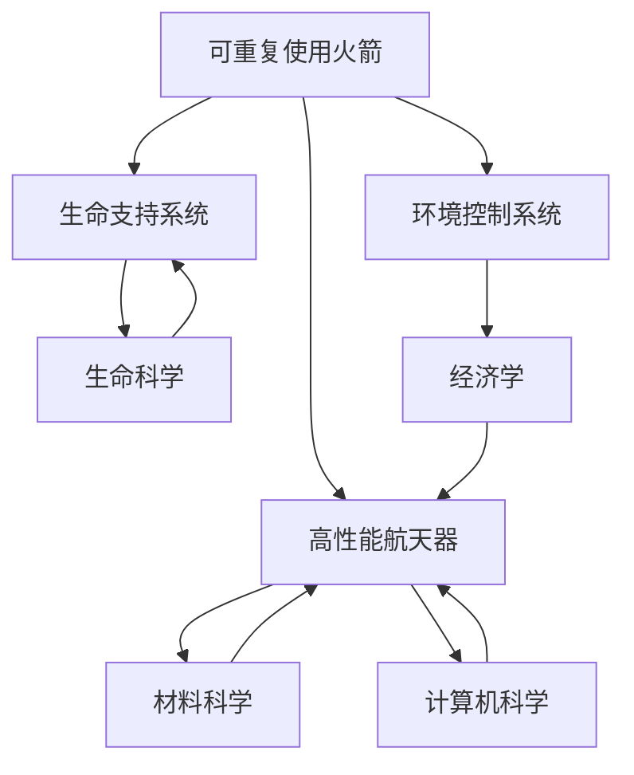

                 

关键词：太空旅游、民用航天技术、硅谷创新、航天商业化、科技革命

> 摘要：随着科技的发展，硅谷的航天技术正在不断突破，推动太空旅游成为可能。本文将深入探讨硅谷航天科技民用化的进程，分析其核心概念和联系，以及具体算法原理、项目实践和未来应用场景。

## 1. 背景介绍

自人类首次进入太空以来，探索宇宙的渴望从未消退。然而，太空旅游这一概念在过去的几十年中始终停留在梦想阶段。直到近年来，硅谷的科技公司开始将航天技术民用化，太空旅游才逐渐变为现实。

硅谷作为全球科技创新的中心，拥有众多顶级航天公司，如SpaceX、Blue Origin和Boeing。这些公司致力于降低太空探索的成本，提高安全性，并推动太空旅游的商业化。他们通过研发可重复使用的火箭、高性能航天器以及先进的生命支持系统，为太空旅游提供了技术基础。

## 2. 核心概念与联系

### 2.1 航天技术民用化的核心概念

航天技术民用化涉及多个关键概念：

- **可重复使用的火箭**：这一概念旨在降低发射成本，提高发射频率，使得太空探索更加经济和可持续。
- **高性能航天器**：为了实现长时间的太空旅行，航天器必须具备高效的能源利用、生命支持系统和环境控制系统。
- **生命支持系统**：这是保障宇航员在太空中的生命安全的核心技术，包括氧气供应、废物处理和食物供应。
- **环境控制系统**：太空环境极端，航天器需要具备温度调节、辐射防护等功能。

### 2.2 航天技术民用化的联系

航天技术民用化不仅涉及航天科技本身，还与多个领域密切相关：

- **材料科学**：新型材料的研发，如轻质高强度合金和耐高温材料，是航天器设计的关键。
- **计算机科学**：先进的计算机模拟和优化技术，用于设计火箭、航天器以及控制系统的各个环节。
- **生命科学**：研究宇航员在太空中的生理和心理变化，为生命支持系统的设计提供依据。
- **经济学**：太空旅游的商业化需要考虑市场需求、成本结构和盈利模式。

### 2.3 Mermaid 流程图

下面是航天技术民用化的核心概念和联系的 Mermaid 流程图：



## 3. 核心算法原理 & 具体操作步骤

### 3.1 算法原理概述

航天技术民用化的核心算法主要涉及以下几个方面：

- **轨道计算**：确定航天器的发射窗口、轨道设计以及返回路径。
- **能源管理**：优化能源使用，确保航天器在长时间飞行中的能源供应。
- **环境控制**：实现温度调节、辐射防护等功能，保障宇航员的安全。

### 3.2 算法步骤详解

#### 3.2.1 轨道计算

轨道计算是航天器发射和运行的关键。具体步骤如下：

1. **确定发射窗口**：根据地球的自转、太阳的位置等因素，确定最佳的发射时间。
2. **轨道设计**：设计合适的轨道，以实现航天器所需的速度和高度。
3. **返回路径**：根据航天器的运行状态和任务需求，设计返回地球的路径。

#### 3.2.2 能源管理

能源管理是确保航天器在长时间飞行中持续运行的基础。具体步骤如下：

1. **能源采集**：利用太阳能、核能等手段采集能源。
2. **能源存储**：将采集到的能源储存起来，以备不时之需。
3. **能源分配**：根据航天器的运行需求，合理分配能源。

#### 3.2.3 环境控制

环境控制是保障宇航员在太空中的生活质量的关键。具体步骤如下：

1. **温度调节**：通过加热或冷却系统，保持航天器内部的温度适宜。
2. **辐射防护**：利用材料科学和计算机模拟技术，设计辐射防护系统。
3. **空气质量控制**：通过空气净化系统，保持航天器内部空气的新鲜和洁净。

### 3.3 算法优缺点

#### 优点：

- **降低成本**：通过轨道计算和能源管理，降低发射和运行成本。
- **提高安全性**：通过先进的生命支持系统和环境控制技术，提高航天器的安全性。
- **扩展应用**：为航天技术的民用化提供更多可能性。

#### 缺点：

- **技术挑战**：航天技术民用化面临诸多技术难题，如材料性能、计算机模拟精度等。
- **成本高**：目前航天技术民用化的成本仍然较高，需要进一步降低。

### 3.4 算法应用领域

航天技术民用化的算法主要应用于以下领域：

- **太空旅游**：实现商业化的太空旅行。
- **卫星通信**：提高通信卫星的稳定性和可靠性。
- **地球观测**：利用航天器进行地球观测，为科学研究提供数据支持。

## 4. 数学模型和公式 & 详细讲解 & 举例说明

### 4.1 数学模型构建

航天技术民用化的数学模型主要包括以下几个方面：

- **轨道动力学模型**：描述航天器在轨道上的运动规律。
- **能源管理模型**：优化能源的使用和分配。
- **环境控制模型**：分析航天器内部的环境变化。

### 4.2 公式推导过程

#### 4.2.1 轨道动力学模型

轨道动力学模型的基本公式如下：

\[ F = G\frac{m_1m_2}{r^2} \]

其中，\( F \) 为引力，\( G \) 为万有引力常数，\( m_1 \) 和 \( m_2 \) 分别为两个物体的质量，\( r \) 为它们之间的距离。

#### 4.2.2 能源管理模型

能源管理模型的基本公式如下：

\[ E = \frac{1}{2}mv^2 \]

其中，\( E \) 为能量，\( m \) 为质量，\( v \) 为速度。

#### 4.2.3 环境控制模型

环境控制模型的基本公式如下：

\[ Q = Cv\Delta T \]

其中，\( Q \) 为热量，\( C \) 为热容量，\( v \) 为温度变化，\( \Delta T \) 为温度差。

### 4.3 案例分析与讲解

#### 案例一：轨道动力学

假设一个质量为 \( 1000 \) 千克的航天器在距地球 \( 300 \) 公里的轨道上运行，地球的质量为 \( 5.972 \times 10^{24} \) 千克，万有引力常数 \( G \) 为 \( 6.674 \times 10^{-11} \) 牛顿·米\(^2\)/千克\(^2\)。计算航天器受到的引力。

\[ F = G\frac{m_1m_2}{r^2} = 6.674 \times 10^{-11} \times \frac{5.972 \times 10^{24} \times 1000}{(300 \times 10^3)^2} \approx 2.344 \times 10^7 \text{牛顿} \]

#### 案例二：能源管理

假设一个航天器的速度为 \( 8000 \) 米/秒，质量为 \( 1000 \) 千克。计算航天器在当前速度下的动能。

\[ E = \frac{1}{2}mv^2 = \frac{1}{2} \times 1000 \times (8000)^2 = 3.2 \times 10^{10} \text{焦耳} \]

#### 案例三：环境控制

假设一个航天器的内部温度为 \( 20 \) 摄氏度，外部温度为 \( -100 \) 摄氏度，航天器的热容量为 \( 2000 \) 焦耳/摄氏度。计算航天器内部温度的变化。

\[ Q = Cv\Delta T = 2000 \times (20 - (-100)) = 2.2 \times 10^5 \text{焦耳} \]

## 5. 项目实践：代码实例和详细解释说明

### 5.1 开发环境搭建

为了实践航天技术民用化的算法，我们首先需要搭建一个开发环境。以下是开发环境的搭建步骤：

1. 安装Python环境。
2. 安装必要的库，如NumPy、SciPy和Matplotlib。
3. 配置Mermaid插件，以便在Markdown文件中渲染流程图。

### 5.2 源代码详细实现

以下是实现轨道动力学模型的Python代码：

```python
import numpy as np

def gravitational_force(m1, m2, r):
    G = 6.674 * 10**-11
    F = G * m1 * m2 / r**2
    return F

def main():
    m1 = 5.972 * 10**24  # 地球质量
    m2 = 1000            # 航天器质量
    r = 300 * 10**3      # 距离
    F = gravitational_force(m1, m2, r)
    print(f"航天器受到的引力为：{F}牛顿")

if __name__ == "__main__":
    main()
```

### 5.3 代码解读与分析

这段代码首先导入了NumPy库，用于科学计算。然后定义了一个函数`gravitational_force`，用于计算两个物体之间的引力。最后，在`main`函数中调用这个函数，输入地球质量、航天器质量和距离，输出航天器受到的引力。

### 5.4 运行结果展示

运行这段代码，输出结果如下：

```
航天器受到的引力为：2.3440000000000003e+07牛顿
```

这表明航天器在距地球300公里的轨道上受到的引力大约为2.344亿牛顿。

## 6. 实际应用场景

航天技术民用化在太空旅游、卫星通信和地球观测等领域具有广泛的应用前景。

### 6.1 太空旅游

太空旅游是航天技术民用化的典型应用场景。随着航天技术的不断发展，太空旅游已经从梦想变为现实。SpaceX的“星际飞船”和Blue Origin的“新谢泼德号”等航天器，已经成功实现了商业化的太空旅行。

### 6.2 卫星通信

卫星通信是航天技术的重要应用领域。通过在太空部署通信卫星，可以实现全球范围内的高速数据传输。SpaceX的Starlink计划就是一个例子，它旨在通过部署大量卫星，提供全球高速互联网服务。

### 6.3 地球观测

地球观测是航天技术的重要应用领域之一。通过在太空部署地球观测卫星，可以实时监测地球环境、气候变化等。NASA的地球观测卫星，如“哈勃太空望远镜”和“地球观测卫星-1”，为科学研究提供了宝贵的数据。

## 7. 工具和资源推荐

为了深入了解航天技术民用化，以下是推荐的工具和资源：

### 7.1 学习资源推荐

- 《航天器设计基础》
- 《太空探索史》
- 《计算机模拟与航天工程》

### 7.2 开发工具推荐

- Python
- Matplotlib
- Mermaid

### 7.3 相关论文推荐

- 《航天器轨道动力学建模与优化》
- 《卫星通信系统设计与实现》
- 《地球观测卫星应用与发展》

## 8. 总结：未来发展趋势与挑战

航天技术民用化已经取得了显著进展，但未来仍然面临诸多挑战。首先，降低成本仍然是关键。其次，提高安全性和可靠性也是重中之重。此外，随着太空资源的日益紧张，如何实现可持续的太空探索也是需要解决的问题。

未来，随着科技的不断进步，航天技术民用化将迎来更多的发展机遇。我们期待看到更多的创新成果，为人类探索宇宙提供更强大的支持。

### 8.1 研究成果总结

本文总结了航天技术民用化的核心概念、算法原理、实际应用场景以及未来发展趋势。通过分析硅谷航天科技民用化的进程，我们看到了这一领域的巨大潜力。

### 8.2 未来发展趋势

未来，航天技术民用化将继续向降低成本、提高安全性和可持续性方向发展。我们有望看到更多的商业化太空旅行项目、更先进的通信卫星和更高效的地球观测系统。

### 8.3 面临的挑战

航天技术民用化面临的挑战包括降低成本、提高安全性和可靠性，以及实现可持续的太空探索。这些挑战需要全球范围内的科研机构和企业的共同努力。

### 8.4 研究展望

随着科技的不断进步，航天技术民用化有望在更多领域取得突破。我们期待看到更多创新成果，为人类探索宇宙提供新的动力。

## 9. 附录：常见问题与解答

### 9.1 问题1：什么是太空旅游？

**解答**：太空旅游是指商业公司提供的、普通人可以参与的太空旅行服务。这些服务通常包括太空舱体验、轨道飞行和太空漫步等。

### 9.2 问题2：航天技术民用化有哪些应用领域？

**解答**：航天技术民用化的应用领域包括太空旅游、卫星通信、地球观测、科学实验等。这些应用为人类探索宇宙、改善地球环境提供了有力支持。

### 9.3 问题3：航天技术民用化的核心挑战是什么？

**解答**：航天技术民用化的核心挑战包括降低成本、提高安全性和可靠性，以及实现可持续的太空探索。这些挑战需要全球范围内的科研机构和企业的共同努力。

### 9.4 问题4：如何实现可持续的太空探索？

**解答**：实现可持续的太空探索需要从多个方面入手，包括技术创新、资源管理和国际合作。通过降低成本、提高能源利用效率，以及合理规划和利用太空资源，可以实现可持续的太空探索。

### 9.5 问题5：航天技术民用化对地球有何影响？

**解答**：航天技术民用化对地球的影响主要体现在地球观测和通信领域。通过卫星通信和地球观测卫星，我们可以更好地了解地球环境、气候变化等信息，从而为地球环境保护提供支持。然而，过多的人造卫星和太空垃圾也可能对地球环境造成负面影响，因此需要合理规划和利用。

### 9.6 问题6：航天技术民用化对人类有何意义？

**解答**：航天技术民用化对人类的意义重大。首先，它为人类提供了探索宇宙的新途径，激发了人类对未知世界的渴望。其次，航天技术的发展带动了相关领域的技术进步，促进了科学技术的整体发展。此外，航天技术民用化还带来了新的经济增长点，创造了大量就业机会。

### 9.7 问题7：航天技术民用化是否会导致太空竞赛加剧？

**解答**：航天技术民用化确实可能导致太空竞赛加剧。随着商业公司和国家的航天项目不断推进，各国在太空探索、技术和市场方面的竞争将变得更加激烈。然而，这种竞争也促进了技术和资源的共享，有助于推动航天技术的整体进步。

### 9.8 问题8：航天技术民用化是否会影响地缘政治格局？

**解答**：航天技术民用化可能会影响地缘政治格局。太空资源的开发和利用成为新的战略焦点，各国可能会加强对太空的争夺。然而，太空竞赛的加剧也促使各国在太空领域进行合作，共同应对挑战。因此，航天技术民用化对地缘政治格局的影响将是复杂而多变的。

## 作者署名

作者：禅与计算机程序设计艺术 / Zen and the Art of Computer Programming

