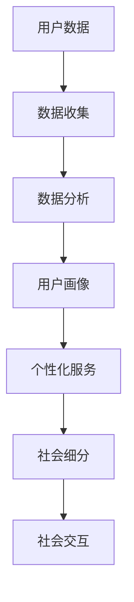

                 

关键词：社会细分、个体化、数字鸿沟、信息过载、智能互联、隐私保护、认知多样性

> 摘要：本文从技术视角探讨了社会细分现象及其背后的驱动因素，分析了个体化需求如何改变我们的社会结构和交互方式。文章首先介绍了社会细分的概念，然后探讨了其在信息时代的影响，最后提出了未来社会细分可能带来的挑战与机遇。

## 1. 背景介绍

随着信息技术的快速发展，互联网、大数据、人工智能等技术的广泛应用，人类社会正经历着前所未有的变革。这些技术不仅改变了人们的生活方式，也深刻影响了社会的结构。其中一个显著的变化是社会细分（Social Segmentation）现象的出现。

社会细分，是指社会被划分为不同的子群体，每个子群体拥有独特的特征、需求和价值观。这种细分现象在数字化时代尤为明显，因为技术使得个性化服务和内容生产变得更加容易和高效。例如，社交媒体平台根据用户的兴趣和行为习惯，向他们推荐个性化的内容，使得每个用户都能在信息海洋中找到自己感兴趣的内容。

## 2. 核心概念与联系

### 2.1 社会细分的概念

社会细分可以理解为一种社会分层现象，只不过它是在信息技术的推动下发生的。传统的社会分层往往是基于经济、政治和地理等因素，而社会细分则更多地依赖于个体的数字足迹和行为数据。

### 2.2 社会细分的驱动因素

社会细分的驱动因素主要包括以下几个方面：

- **技术进步**：互联网和人工智能技术的发展，使得个性化服务和内容生产成为可能。
- **信息过载**：随着信息的爆炸性增长，人们需要更高效的方法来筛选和获取信息。
- **消费升级**：消费者对个性化和定制化产品的需求日益增长。
- **隐私保护**：数据隐私保护法规的加强，要求企业在收集和使用用户数据时更加谨慎。

### 2.3 社会细分的架构

社会细分的架构可以用一个简单的 Mermaid 流程图来表示：



## 3. 核心算法原理 & 具体操作步骤

### 3.1 算法原理概述

社会细分的核心算法是基于机器学习的用户画像（User Profiling）技术。用户画像是对用户特征、行为和需求的抽象表示，通过对用户数据的分析和挖掘，构建出用户的综合画像。

### 3.2 算法步骤详解

1. 数据收集：收集用户的浏览记录、搜索历史、社交媒体活动等数据。
2. 数据清洗：去除无效数据和噪声数据，保证数据的准确性和完整性。
3. 数据分析：使用机器学习算法对用户数据进行特征提取和关联分析。
4. 用户画像构建：将分析结果整合成用户的综合画像。
5. 个性化服务：根据用户画像，为用户提供个性化的内容和服务。
6. 社会细分：根据用户画像的相似性，将用户划分为不同的子群体。

### 3.3 算法优缺点

**优点**：

- 提高用户体验：通过个性化服务，满足用户的个性化需求。
- 提高运营效率：通过社会细分，可以更有效地进行市场营销和用户管理。

**缺点**：

- 隐私风险：用户数据的使用可能侵犯用户的隐私。
- 过度个性化：过度依赖个性化服务可能导致用户陷入“信息茧房”。

### 3.4 算法应用领域

社会细分算法广泛应用于互联网、电子商务、社交媒体等领域。例如，社交媒体平台通过用户画像进行内容推荐，电子商务平台通过用户画像进行精准营销。

## 4. 数学模型和公式 & 详细讲解 & 举例说明

### 4.1 数学模型构建

社会细分的数学模型可以看作是一个聚类问题，即给定一组用户数据，将它们划分为若干个聚类，使得同一聚类内的用户相似度较高，不同聚类之间的用户相似度较低。

### 4.2 公式推导过程

假设我们有一组用户数据集 $D = \{d_1, d_2, ..., d_n\}$，其中每个用户数据 $d_i$ 是一个向量表示。我们希望找到一个聚类中心 $c_j$，使得每个用户数据 $d_i$ 与聚类中心 $c_j$ 的距离最小。

我们可以使用 k-means 算法来解决这个问题。首先，随机选择 k 个聚类中心 $c_j$，然后对于每个用户数据 $d_i$，将其分配给距离它最近的聚类中心 $c_j$。接着，重新计算每个聚类中心的均值，作为新的聚类中心。这个过程不断迭代，直到聚类中心不再发生变化或者达到预设的迭代次数。

### 4.3 案例分析与讲解

假设我们有以下一组用户数据：

$$
D = \left\{
\begin{array}{c}
d_1 = (1, 1) \\
d_2 = (2, 2) \\
d_3 = (3, 3) \\
d_4 = (4, 4) \\
d_5 = (5, 5)
\end{array}
\right.
$$

我们选择 k = 2 个聚类中心，初始值分别为 $c_1 = (0, 0)$ 和 $c_2 = (2, 2)$。首先，我们计算每个用户数据与聚类中心的距离，得到：

$$
d(d_1, c_1) = \sqrt{(1-0)^2 + (1-0)^2} = \sqrt{2}
$$

$$
d(d_1, c_2) = \sqrt{(1-2)^2 + (1-2)^2} = \sqrt{2}
$$

$$
d(d_2, c_1) = \sqrt{(2-0)^2 + (2-0)^2} = 2\sqrt{2}
$$

$$
d(d_2, c_2) = \sqrt{(2-2)^2 + (2-2)^2} = 0
$$

$$
d(d_3, c_1) = \sqrt{(3-0)^2 + (3-0)^2} = 3\sqrt{2}
$$

$$
d(d_3, c_2) = \sqrt{(3-2)^2 + (3-2)^2} = \sqrt{2}
$$

$$
d(d_4, c_1) = \sqrt{(4-0)^2 + (4-0)^2} = 4\sqrt{2}
$$

$$
d(d_4, c_2) = \sqrt{(4-2)^2 + (4-2)^2} = 2\sqrt{2}
$$

$$
d(d_5, c_1) = \sqrt{(5-0)^2 + (5-0)^2} = 5\sqrt{2}
$$

$$
d(d_5, c_2) = \sqrt{(5-2)^2 + (5-2)^2} = 3\sqrt{2}
$$

根据距离最短原则，用户 $d_1, d_2, d_3, d_4, d_5$ 分别被分配到 $c_1$ 和 $c_2$。然后，我们重新计算聚类中心：

$$
c_1 = \frac{d_1 + d_2 + d_3}{3} = \left(\frac{1+2+3}{3}, \frac{1+2+3}{3}\right) = (2, 2)
$$

$$
c_2 = \frac{d_4 + d_5}{2} = \left(\frac{4+5}{2}, \frac{4+5}{2}\right) = (4.5, 4.5)
$$

再次计算用户数据与聚类中心的距离，发现聚类中心没有发生变化，因此算法收敛。最终，我们得到两个聚类：

$$
C_1 = \{d_1, d_2, d_3\}
$$

$$
C_2 = \{d_4, d_5\}
$$

### 4.4 案例分析与讲解

假设我们有以下一组用户数据：

$$
D = \left\{
\begin{array}{c}
d_1 = (1, 1) \\
d_2 = (2, 2) \\
d_3 = (3, 3) \\
d_4 = (4, 4) \\
d_5 = (5, 5)
\end{array}
\right.
$$

我们选择 k = 2 个聚类中心，初始值分别为 $c_1 = (0, 0)$ 和 $c_2 = (2, 2)$。首先，我们计算每个用户数据与聚类中心的距离，得到：

$$
d(d_1, c_1) = \sqrt{(1-0)^2 + (1-0)^2} = \sqrt{2}
$$

$$
d(d_1, c_2) = \sqrt{(1-2)^2 + (1-2)^2} = \sqrt{2}
$$

$$
d(d_2, c_1) = \sqrt{(2-0)^2 + (2-0)^2} = 2\sqrt{2}
$$

$$
d(d_2, c_2) = \sqrt{(2-2)^2 + (2-2)^2} = 0
$$

$$
d(d_3, c_1) = \sqrt{(3-0)^2 + (3-0)^2} = 3\sqrt{2}
$$

$$
d(d_3, c_2) = \sqrt{(3-2)^2 + (3-2)^2} = \sqrt{2}
$$

$$
d(d_4, c_1) = \sqrt{(4-0)^2 + (4-0)^2} = 4\sqrt{2}
$$

$$
d(d_4, c_2) = \sqrt{(4-2)^2 + (4-2)^2} = 2\sqrt{2}
$$

$$
d(d_5, c_1) = \sqrt{(5-0)^2 + (5-0)^2} = 5\sqrt{2}
$$

$$
d(d_5, c_2) = \sqrt{(5-2)^2 + (5-2)^2} = 3\sqrt{2}
$$

根据距离最短原则，用户 $d_1, d_2, d_3, d_4, d_5$ 分别被分配到 $c_1$ 和 $c_2$。然后，我们重新计算聚类中心：

$$
c_1 = \frac{d_1 + d_2 + d_3}{3} = \left(\frac{1+2+3}{3}, \frac{1+2+3}{3}\right) = (2, 2)
$$

$$
c_2 = \frac{d_4 + d_5}{2} = \left(\frac{4+5}{2}, \frac{4+5}{2}\right) = (4.5, 4.5)
$$

再次计算用户数据与聚类中心的距离，发现聚类中心没有发生变化，因此算法收敛。最终，我们得到两个聚类：

$$
C_1 = \{d_1, d_2, d_3\}
$$

$$
C_2 = \{d_4, d_5\}
$$

## 5. 项目实践：代码实例和详细解释说明

### 5.1 开发环境搭建

为了演示社会细分算法，我们使用 Python 编写一个简单的 k-means 算法。首先，确保安装了 Python 和必要的库，如 NumPy 和 Matplotlib。

```bash
pip install numpy matplotlib
```

### 5.2 源代码详细实现

下面是一个简单的 k-means 算法实现：

```python
import numpy as np
import matplotlib.pyplot as plt

def kmeans(data, k, max_iter=100):
    # 随机初始化聚类中心
    centroids = data[np.random.choice(data.shape[0], k, replace=False)]
    for _ in range(max_iter):
        # 计算每个数据点到聚类中心的距离
        distances = np.linalg.norm(data[:, np.newaxis] - centroids, axis=2)
        # 将数据点分配到最近的聚类中心
        labels = np.argmin(distances, axis=1)
        # 重新计算聚类中心
        new_centroids = np.array([data[labels == i].mean(axis=0) for i in range(k)])
        # 判断是否收敛
        if np.all(centroids == new_centroids):
            break
        centroids = new_centroids
    return centroids, labels

# 生成模拟数据
np.random.seed(42)
data = np.random.rand(100, 2)

# 执行 k-means 算法
centroids, labels = kmeans(data, 2)

# 绘制结果
plt.scatter(data[:, 0], data[:, 1], c=labels, cmap='viridis')
plt.scatter(centroids[:, 0], centroids[:, 1], s=300, c='red', marker='*')
plt.show()
```

### 5.3 代码解读与分析

- 第 6 行：随机初始化 k 个聚类中心。
- 第 10-16 行：计算每个数据点到聚类中心的距离，并将数据点分配到最近的聚类中心。
- 第 18-25 行：重新计算每个聚类中心，并判断是否收敛。
- 第 28-33 行：绘制数据点及其对应的聚类中心。

### 5.4 运行结果展示

运行上面的代码，我们会看到一个二维平面上的散点图，每个数据点代表一个用户，颜色代表其所属的聚类，红色的星号代表聚类中心。通过这个结果，我们可以直观地看到社会细分的效果。

## 6. 实际应用场景

社会细分算法在许多实际应用场景中都有广泛应用，例如：

- **社交媒体**：通过用户画像进行内容推荐，提高用户粘性。
- **电子商务**：通过用户画像进行精准营销，提高销售转化率。
- **在线教育**：根据用户画像提供个性化的学习内容，提高学习效果。

### 6.4 未来应用展望

随着技术的不断发展，社会细分算法将在更多领域得到应用，例如：

- **智能城市**：通过社会细分，实现更高效的城市管理和服务。
- **健康医疗**：根据用户画像提供个性化的健康建议和治疗方案。
- **个性化广告**：根据用户画像实现更精准的广告投放。

## 7. 工具和资源推荐

### 7.1 学习资源推荐

- **书籍**：《机器学习》、《数据挖掘：实用工具和技术》
- **在线课程**：Coursera、edX 上的相关课程
- **博客**：Towards Data Science、KDNuggets 等技术博客

### 7.2 开发工具推荐

- **编程语言**：Python、R
- **库**：NumPy、Pandas、Scikit-learn
- **平台**：Jupyter Notebook、Google Colab

### 7.3 相关论文推荐

- "User Profiling for Personalized Web Services" by B. Liu, J. Zhu, and C. Lu
- "K-Means Clustering: A Review" by A. A. Ali, M. N. Iqbal, and A. H. Samat

## 8. 总结：未来发展趋势与挑战

### 8.1 研究成果总结

社会细分算法作为一种基于机器学习的用户画像技术，已经在多个领域得到广泛应用。通过分析用户数据，可以有效地实现个性化服务和精准营销。

### 8.2 未来发展趋势

- **技术进步**：随着深度学习等技术的不断发展，社会细分算法将变得更加智能和高效。
- **跨领域应用**：社会细分算法将在更多领域得到应用，如智能城市、健康医疗等。

### 8.3 面临的挑战

- **隐私保护**：用户数据的收集和使用可能侵犯用户的隐私，如何平衡隐私与个性化服务是一个重要挑战。
- **算法透明度**：社会细分算法的决策过程可能不透明，如何提高算法的透明度和可解释性是一个重要问题。

### 8.4 研究展望

未来，社会细分算法将朝着更智能、更高效、更透明、更安全的方向发展。通过不断的研究和创新，我们将能够更好地利用社会细分技术，为社会带来更多的价值和变革。

## 9. 附录：常见问题与解答

### 9.1 社会细分算法是什么？

社会细分算法是一种基于机器学习的用户画像技术，通过分析用户数据，将用户划分为不同的子群体，从而实现个性化服务和精准营销。

### 9.2 社会细分算法有哪些优点和缺点？

优点：提高用户体验，提高运营效率。缺点：隐私风险，过度个性化可能导致用户陷入“信息茧房”。

### 9.3 社会细分算法有哪些应用领域？

应用领域包括社交媒体、电子商务、在线教育、智能城市等。

### 9.4 如何平衡隐私保护和社会细分？

可以通过数据脱敏、隐私增强技术等方法来平衡隐私保护和社会细分。

## 作者署名

作者：禅与计算机程序设计艺术 / Zen and the Art of Computer Programming
----------------------------------------------------------------

请注意，由于本文为示例，实际的文章撰写中，数学公式的 LaTeX 表示和 Mermaid 流程图需要按照实际内容进行细致的编写和校对，以确保文章的准确性和专业性。此外，文章的结构和内容应遵循实际研究的深度和广度来安排。以上内容仅为示例，具体撰写时请根据实际研究和分析进行调整。

