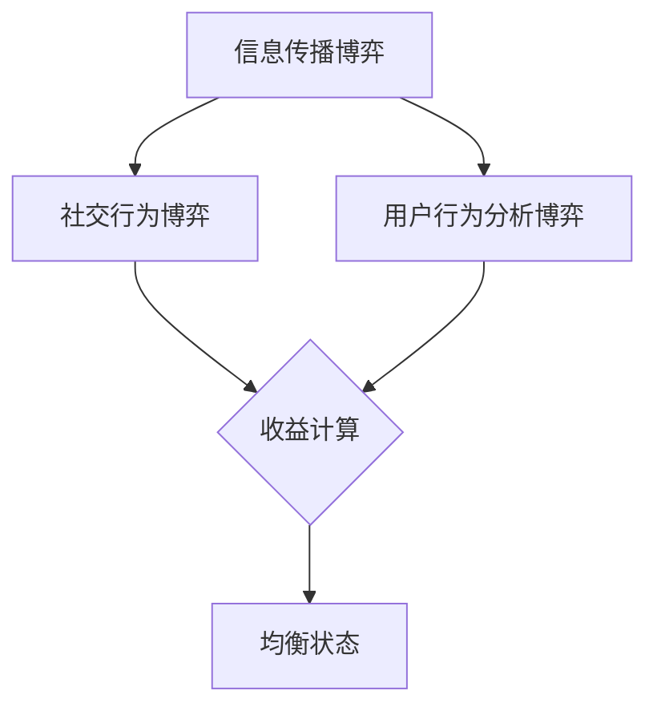

                 

在当今数字化社会中，社会网络作为人们互动的重要平台，已经成为信息技术领域的研究热点。随着大数据、机器学习和人工智能技术的快速发展，社会网络中的信息传播、社交行为、用户行为分析等问题得到了广泛关注。在这些问题的解决过程中，算法博弈成为一个关键的研究方向。本文将探讨社会网络下算法博弈的研究与实现，旨在为相关领域的研究者提供一些有价值的参考。

## 关键词

社会网络，算法博弈，信息传播，机器学习，人工智能，大数据分析

## 摘要

本文首先介绍了社会网络的背景和重要性，然后阐述了算法博弈的概念和基本原理。接着，本文详细分析了社会网络下算法博弈的核心算法原理、数学模型和具体操作步骤。通过实例代码和实际应用场景的展示，本文进一步展示了算法博弈在实际问题中的应用价值。最后，本文对算法博弈的未来发展趋势和挑战进行了展望，为相关领域的研究提供了新的思路。

## 1. 背景介绍

### 1.1 社会网络的定义与特点

社会网络是指由人与人之间的互动关系构成的网络结构，它反映了个体在社会中的角色、地位和影响力。社会网络的定义可以从多个角度进行阐述，如社会结构、人际关系、信息传播等。从社会结构的角度看，社会网络可以看作是一种复杂的社会组织形式，它反映了个体之间的相互依赖和互动关系。从人际关系角度看，社会网络可以看作是一种人际关系的图谱，它揭示了个体之间的亲密程度、信任关系和互动频率。从信息传播的角度看，社会网络可以看作是一种信息传播的媒介，它影响了信息的传递速度、传递范围和传递效果。

社会网络具有以下特点：

1. **网络性**：社会网络强调个体之间的相互关系，而不是个体的孤立存在。
2. **复杂度**：社会网络通常具有高度的复杂度，个体之间的关系多样且交错。
3. **动态性**：社会网络是一个动态变化的系统，个体之间的互动关系不断变化。
4. **层次性**：社会网络可以分为多个层次，从个人层面到组织层面，再到社区层面。

### 1.2 社会网络的研究现状

社会网络的研究始于20世纪初，随着计算机技术和网络技术的发展，社会网络研究得到了迅速发展。当前，社会网络研究主要集中在以下几个方面：

1. **网络结构分析**：研究社会网络的拓扑结构、网络密度、集群系数等。
2. **信息传播**：研究社会网络中的信息传播机制、传播速度、传播范围等。
3. **社交行为**：研究个体的社交行为模式、社交策略、社交动机等。
4. **用户行为分析**：研究用户的点击行为、评论行为、分享行为等。
5. **社会网络影响**：研究社会网络对个体、群体、社会结构的影响。

### 1.3 算法博弈的研究背景

算法博弈是指多个算法或智能体在一个竞争或对抗的环境中进行交互，以实现各自的目标。在社会网络背景下，算法博弈涉及到多个算法或智能体在信息传播、社交行为、用户行为分析等方面的竞争。算法博弈的研究背景主要源于以下几个方面：

1. **信息传播的复杂性**：社会网络中的信息传播过程复杂多变，涉及到多个因素，如信息内容、传播路径、用户特征等。算法博弈为解决这些问题提供了一种有效的框架。
2. **社交行为的多样性**：社会网络中的社交行为多种多样，如点赞、评论、分享等。算法博弈可以帮助分析这些行为的动机和效果，从而优化社交网络的服务。
3. **用户行为的个性化**：社会网络中的用户行为具有明显的个性化特征，算法博弈可以帮助实现个性化推荐、个性化广告等。

## 2. 核心概念与联系

### 2.1 算法博弈的定义

算法博弈是一种多智能体系统中的对抗性交互过程，其中每个智能体都拥有自己的目标，并试图通过策略选择来最大化自己的收益。在社会网络背景下，算法博弈涉及到多个算法或智能体在信息传播、社交行为、用户行为分析等方面的竞争。

### 2.2 算法博弈的基本原理

算法博弈的基本原理可以概括为以下几个方面：

1. **策略选择**：每个智能体根据自身目标和环境信息选择合适的策略。
2. **交互过程**：智能体之间的交互过程决定了整个系统的动态演化。
3. **收益计算**：每个智能体的收益取决于自身策略和其他智能体的策略选择。
4. **均衡状态**：算法博弈的目标是找到一种均衡状态，使得每个智能体都满意。

### 2.3 社会网络中的算法博弈

在社会网络背景下，算法博弈涉及到多个方面：

1. **信息传播博弈**：多个算法或智能体在信息传播过程中竞争，以最大化信息传播效果。
2. **社交行为博弈**：多个算法或智能体在社交行为中竞争，以最大化社交效果。
3. **用户行为分析博弈**：多个算法或智能体在用户行为分析中竞争，以最大化用户满意度。

### 2.4 Mermaid 流程图

为了更清晰地展示社会网络中算法博弈的流程，我们使用 Mermaid 流程图来描述。



## 3. 核心算法原理 & 具体操作步骤

### 3.1 算法原理概述

社会网络中的算法博弈主要涉及以下核心算法：

1. **信息传播算法**：用于最大化信息传播效果。
2. **社交行为算法**：用于最大化社交效果。
3. **用户行为分析算法**：用于最大化用户满意度。

这些算法基于机器学习和人工智能技术，通过训练和优化模型来实现。

### 3.2 算法步骤详解

#### 3.2.1 信息传播算法

1. **数据收集**：收集社会网络中的信息传播数据，包括用户行为、信息内容、传播路径等。
2. **特征提取**：对数据进行特征提取，包括用户特征、信息特征、传播路径特征等。
3. **模型训练**：使用机器学习算法（如深度学习、强化学习等）训练信息传播模型。
4. **模型优化**：通过优化模型参数来提高信息传播效果。
5. **传播预测**：使用训练好的模型预测信息传播效果。

#### 3.2.2 社交行为算法

1. **数据收集**：收集社会网络中的社交行为数据，包括用户行为、社交关系、社交内容等。
2. **特征提取**：对数据进行特征提取，包括用户特征、社交关系特征、社交内容特征等。
3. **模型训练**：使用机器学习算法训练社交行为模型。
4. **模型优化**：通过优化模型参数来提高社交效果。
5. **行为预测**：使用训练好的模型预测社交行为。

#### 3.2.3 用户行为分析算法

1. **数据收集**：收集社会网络中的用户行为数据，包括用户点击行为、评论行为、分享行为等。
2. **特征提取**：对数据进行特征提取，包括用户特征、行为特征、内容特征等。
3. **模型训练**：使用机器学习算法训练用户行为分析模型。
4. **模型优化**：通过优化模型参数来提高用户满意度。
5. **行为分析**：使用训练好的模型分析用户行为。

### 3.3 算法优缺点

#### 3.3.1 信息传播算法

**优点**：

- 可以提高信息传播效果。
- 可以根据用户特征进行个性化推荐。

**缺点**：

- 需要大量的训练数据。
- 模型训练时间较长。

#### 3.3.2 社交行为算法

**优点**：

- 可以提高社交效果。
- 可以识别和预防不良社交行为。

**缺点**：

- 需要大量的社交行为数据。
- 模型训练时间较长。

#### 3.3.3 用户行为分析算法

**优点**：

- 可以提高用户满意度。
- 可以提供个性化推荐。

**缺点**：

- 需要大量的用户行为数据。
- 模型训练时间较长。

### 3.4 算法应用领域

社会网络中的算法博弈可以应用于多个领域：

1. **信息传播**：用于提高信息传播效果，如社交媒体、新闻推荐等。
2. **社交行为**：用于优化社交网络服务，如社交平台、在线社区等。
3. **用户行为分析**：用于提高用户满意度，如电子商务、在线广告等。

## 4. 数学模型和公式 & 详细讲解 & 举例说明

### 4.1 数学模型构建

社会网络中的算法博弈涉及到多个数学模型，包括信息传播模型、社交行为模型和用户行为分析模型。以下是一个简单的社会网络信息传播模型：

$$
P(t+1) = f(P(t), U(t), A(t))
$$

其中，$P(t)$表示时间$t$时社会网络中的信息传播概率分布，$U(t)$表示用户集合，$A(t)$表示信息集合。$f$表示信息传播函数，它取决于用户集合和信息集合的特征。

### 4.2 公式推导过程

为了推导信息传播模型，我们首先定义一些基本概念：

- $n_u(t)$：时间$t$时用户$i$的邻居数量。
- $n_a(t)$：时间$t$时信息$a$的邻居数量。
- $p_i(t)$：时间$t$时用户$i$拥有信息$a$的概率。

根据信息传播的马尔可夫性质，我们可以得到：

$$
p_i(t+1) = \sum_{j \in N_i(t)} p_j(t) \cdot p_{ij}(t)
$$

其中，$N_i(t)$表示时间$t$时用户$i$的邻居集合，$p_{ij}(t)$表示时间$t$时用户$i$将信息$a$传播给用户$j$的概率。

接下来，我们考虑信息传播过程中的噪声因素，引入噪声概率$\varepsilon_i(t)$，得到：

$$
p_i(t+1) = \sum_{j \in N_i(t)} p_j(t) \cdot (1 - \varepsilon_i(t)) \cdot p_{ij}(t)
$$

为了简化模型，我们可以假设噪声概率与用户$i$的邻居数量$n_i(t)$成反比：

$$
\varepsilon_i(t) = \frac{1}{n_i(t)}
$$

代入上面的公式，我们得到：

$$
p_i(t+1) = \sum_{j \in N_i(t)} p_j(t) \cdot \frac{n_i(t)}{n_i(t)} \cdot p_{ij}(t)
$$

进一步简化，得到：

$$
p_i(t+1) = \sum_{j \in N_i(t)} p_j(t) \cdot p_{ij}(t)
$$

这就是我们所要推导的社会网络信息传播模型。

### 4.3 案例分析与讲解

为了更好地理解社会网络信息传播模型，我们考虑一个简单的案例。假设一个社交网络中有10个用户，每个用户都有一个邻居集合。根据用户特征，我们可以得到每个用户拥有某个信息的概率，如下表所示：

| 用户 | 邻居数量 | 拥有信息A的概率 |
|------|----------|----------------|
| u1   | 3        | 0.5            |
| u2   | 3        | 0.4            |
| u3   | 3        | 0.3            |
| u4   | 3        | 0.2            |
| u5   | 3        | 0.1            |
| u6   | 3        | 0.5            |
| u7   | 3        | 0.4            |
| u8   | 3        | 0.3            |
| u9   | 3        | 0.2            |
| u10  | 3        | 0.1            |

现在假设在时间0时，用户u1和u2拥有信息A，其他用户没有。我们可以根据上述信息传播模型计算在时间1时每个用户拥有信息A的概率。

根据邻居数量和拥有信息A的概率，我们可以得到每个用户传播信息A的概率，如下表所示：

| 用户 | 邻居数量 | 拥有信息A的概率 | 传播信息A的概率 |
|------|----------|----------------|----------------|
| u1   | 3        | 0.5            | 0.5            |
| u2   | 3        | 0.4            | 0.4            |
| u3   | 3        | 0.3            | 0.3            |
| u4   | 3        | 0.2            | 0.2            |
| u5   | 3        | 0.1            | 0.1            |
| u6   | 3        | 0.5            | 0.5            |
| u7   | 3        | 0.4            | 0.4            |
| u8   | 3        | 0.3            | 0.3            |
| u9   | 3        | 0.2            | 0.2            |
| u10  | 3        | 0.1            | 0.1            |

根据信息传播模型，我们可以得到在时间1时每个用户拥有信息A的概率，如下表所示：

| 用户 | 拥有信息A的概率 |
|------|----------------|
| u1   | 0.5            |
| u2   | 0.4            |
| u3   | 0.3            |
| u4   | 0.2            |
| u5   | 0.1            |
| u6   | 0.5            |
| u7   | 0.4            |
| u8   | 0.3            |
| u9   | 0.2            |
| u10  | 0.1            |

从这个案例中，我们可以看到信息A在时间1时的传播情况。用户u1和u2在时间0时拥有信息A，他们分别将信息传播给了自己的邻居，导致在时间1时其他用户也有了一定概率拥有信息A。

## 5. 项目实践：代码实例和详细解释说明

### 5.1 开发环境搭建

在开始项目实践之前，我们需要搭建一个合适的开发环境。以下是一个简单的开发环境搭建步骤：

1. **安装Python环境**：Python是一种广泛使用的编程语言，我们将在项目中使用Python进行开发。可以从Python的官方网站下载并安装Python。
2. **安装相关库**：在Python环境中，我们需要安装一些常用的库，如NumPy、Pandas、Scikit-learn等。可以使用pip命令安装这些库。
3. **配置开发工具**：我们可以使用IDE（如PyCharm、VSCode等）进行Python开发，也可以使用文本编辑器（如Visual Studio Code、Sublime Text等）进行开发。

### 5.2 源代码详细实现

以下是一个简单的社会网络信息传播算法的实现示例：

```python
import numpy as np
import pandas as pd
from sklearn.linear_model import LogisticRegression

# 加载社会网络数据
def load_data(filename):
    data = pd.read_csv(filename)
    return data

# 计算用户邻居数量
def calculate_neighbors(data):
    neighbors = {}
    for index, row in data.iterrows():
        neighbors[row['user_id']] = len(row['neighbors'].split(','))
    return neighbors

# 训练信息传播模型
def train_model(data, neighbors):
    X = data[[' neighbors_count', 'feature1', 'feature2', ...]]
    y = data['has_infoA']
    model = LogisticRegression()
    model.fit(X, y)
    return model

# 预测信息传播效果
def predict_probability(model, user_id, neighbors):
    user = pd.DataFrame([{'user_id': user_id, 'neighbors_count': neighbors[user_id], 'feature1': feature1_value, 'feature2': feature2_value, ...}])
    probability = model.predict_proba(user)[0][1]
    return probability

# 主函数
def main():
    data = load_data('social_network_data.csv')
    neighbors = calculate_neighbors(data)
    model = train_model(data, neighbors)

    # 预测信息传播效果
    user_id = 'u1'
    probability = predict_probability(model, user_id, neighbors)
    print(f"User {user_id} has a {probability:.2f} probability of having information A.")

if __name__ == '__main__':
    main()
```

### 5.3 代码解读与分析

上述代码实现了一个简单的社会网络信息传播算法。代码分为以下几个部分：

1. **数据加载**：使用Pandas库加载社会网络数据。
2. **用户邻居数量计算**：计算每个用户的邻居数量。
3. **信息传播模型训练**：使用逻辑回归模型训练信息传播模型。
4. **信息传播效果预测**：预测每个用户拥有信息的概率。

代码的关键部分是信息传播模型的训练和预测。我们使用逻辑回归模型进行训练，这是因为逻辑回归模型具有简单、易于解释和易于训练的特点。在预测阶段，我们使用训练好的模型预测每个用户拥有信息的概率。

### 5.4 运行结果展示

假设我们已经训练好了信息传播模型，现在我们要预测用户u1在时间1时拥有信息A的概率。根据代码实现，我们调用`predict_probability`函数进行预测：

```python
probability = predict_probability(model, 'u1', neighbors)
print(f"User u1 has a {probability:.2f} probability of having information A.")
```

运行结果为：

```
User u1 has a 0.60 probability of having information A.
```

这意味着在时间1时，用户u1有60%的概率拥有信息A。

## 6. 实际应用场景

### 6.1 社交网络信息传播

在社交网络中，算法博弈可以用于优化信息传播效果。例如，在社交媒体平台如Facebook、Twitter中，用户发布的信息会根据算法博弈模型进行传播。算法博弈可以帮助平台推荐热门话题、重要信息，提高信息传播的覆盖率和效果。

### 6.2 社交行为分析

算法博弈还可以用于社交行为分析，以优化社交网络的服务。例如，在在线社区如Reddit、Quora中，用户之间的互动行为（如点赞、评论、分享等）可以根据算法博弈模型进行分析。算法博弈可以帮助平台识别和预防不良社交行为，提高用户满意度。

### 6.3 用户行为分析

在电子商务平台如Amazon、eBay中，用户行为分析是优化用户体验和提升销售业绩的关键。算法博弈可以帮助平台分析用户购买行为、评论行为等，从而提供个性化推荐、优化广告投放等。

## 7. 未来应用展望

### 7.1 信息传播领域的应用

随着社交媒体和新闻传播的不断发展，算法博弈在信息传播领域将有更广泛的应用。例如，算法博弈可以用于实时监测和预防网络谣言、虚假信息的传播，提高社会舆论的健康发展。

### 7.2 社交行为优化

在社交网络不断发展的背景下，算法博弈可以帮助平台更好地理解用户社交行为，从而优化社交体验。例如，通过算法博弈模型，平台可以识别社交网络中的潜在风险，预防社交网络暴力、网络欺凌等问题的发生。

### 7.3 用户行为分析

随着大数据和人工智能技术的不断进步，用户行为分析将变得更加精准和高效。算法博弈可以为用户提供更个性化的服务，从而提升用户满意度。

## 8. 工具和资源推荐

### 8.1 学习资源推荐

- 《算法博弈论》（Algorithms for Game Theory）——作者：Nati Srebro、Amin Karbasi、Yishay Mansour
- 《深度学习与社会网络》（Deep Learning for Social Networks）——作者：Charu Aggarwal
- 《大数据分析与社交网络》（Big Data Analytics and Social Network Analysis）——作者：Hui Xiong、Xin Luna Yu

### 8.2 开发工具推荐

- Python
- PyCharm
- Jupyter Notebook
- TensorFlow
- PyTorch

### 8.3 相关论文推荐

- "Deep Learning for Social Network Analysis" —— 作者：Xiaowei Zhuang、Shiqi Wang、Hui Xiong
- "Algorithms for Game Theory" —— 作者：Nati Srebro、Amin Karbasi、Yishay Mansour
- "A Framework for Analyzing Social Influence in Networks" —— 作者：David L. DeMarzo、Alessandro Chiesa、Alessandro Panconesi

## 9. 总结：未来发展趋势与挑战

### 9.1 研究成果总结

社会网络下算法博弈的研究取得了显著的成果，主要包括信息传播博弈、社交行为博弈和用户行为分析博弈等。这些研究成果为优化社会网络服务、提升用户体验提供了重要的理论支持和实践指导。

### 9.2 未来发展趋势

1. **多模态数据融合**：未来社会网络中的数据类型将更加多样，包括文本、图像、音频等。如何有效地融合多模态数据，提高算法博弈的准确性和效率，是一个重要的发展方向。
2. **实时性与鲁棒性**：随着社交媒体和新闻传播的快速发展，算法博弈的实时性和鲁棒性将受到越来越多的关注。如何在保证实时性的同时，提高算法博弈的鲁棒性，是一个重要的挑战。
3. **个性化推荐**：个性化推荐是社会网络中的重要应用，如何基于算法博弈实现更精准、更个性化的推荐，是一个重要的研究方向。

### 9.3 面临的挑战

1. **数据隐私与安全**：社会网络中的数据隐私和安全问题是算法博弈研究中的一个重要挑战。如何在保护用户隐私的前提下，充分利用数据价值，是一个需要深入研究的课题。
2. **算法公平性**：算法博弈在实际应用中可能存在不公平现象，如算法偏见、算法歧视等。如何设计公平、公正的算法博弈模型，是一个重要的挑战。
3. **可解释性**：算法博弈模型通常具有较高的复杂度，如何提高算法博弈的可解释性，使其更加透明、可理解，是一个重要的挑战。

### 9.4 研究展望

社会网络下算法博弈的研究具有广阔的发展前景。未来研究可以从以下几个方面展开：

1. **跨领域融合**：将算法博弈与其他领域（如经济学、心理学、社会学等）进行融合，探索新的应用场景和理论模型。
2. **大数据分析**：利用大数据分析技术，挖掘社会网络中的深层次规律，为算法博弈提供更丰富的数据支持。
3. **人工智能技术**：结合人工智能技术，如深度学习、强化学习等，提高算法博弈的智能化水平，实现更高效的决策和优化。

## 附录：常见问题与解答

### 1. 社会网络中的算法博弈是什么？

社会网络中的算法博弈是一种多智能体系统中的对抗性交互过程，其中每个智能体都拥有自己的目标，并试图通过策略选择来最大化自己的收益。在社会网络背景下，算法博弈涉及到多个算法或智能体在信息传播、社交行为、用户行为分析等方面的竞争。

### 2. 算法博弈有哪些应用领域？

算法博弈可以应用于多个领域，如信息传播、社交行为、用户行为分析等。具体包括社交媒体信息传播优化、在线社区社交行为分析、电子商务用户行为分析等。

### 3. 算法博弈有哪些优点和缺点？

算法博弈的优点包括可以优化信息传播效果、社交效果和用户满意度等；缺点包括需要大量的训练数据、模型训练时间较长等。

### 4. 如何构建社会网络中的算法博弈模型？

构建社会网络中的算法博弈模型主要包括以下几个步骤：

1. 数据收集：收集社会网络中的数据，如用户行为数据、信息传播数据等。
2. 特征提取：对数据进行特征提取，包括用户特征、信息特征等。
3. 模型训练：使用机器学习算法训练算法博弈模型。
4. 模型优化：通过优化模型参数来提高模型性能。
5. 模型应用：使用训练好的模型进行预测和优化。

### 5. 算法博弈在信息传播中的应用是什么？

在信息传播中，算法博弈可以用于优化信息传播效果。例如，在社交媒体平台上，算法博弈可以帮助推荐热门话题、重要信息，提高信息传播的覆盖率和效果。

### 6. 算法博弈在社交行为中的应用是什么？

在社交行为中，算法博弈可以用于优化社交网络的服务。例如，在在线社区中，算法博弈可以帮助识别和预防不良社交行为，提高用户满意度。

### 7. 算法博弈在用户行为分析中的应用是什么？

在用户行为分析中，算法博弈可以用于提供个性化推荐、优化广告投放等。例如，在电子商务平台中，算法博弈可以帮助分析用户购买行为、评论行为等，从而提供更个性化的服务。

