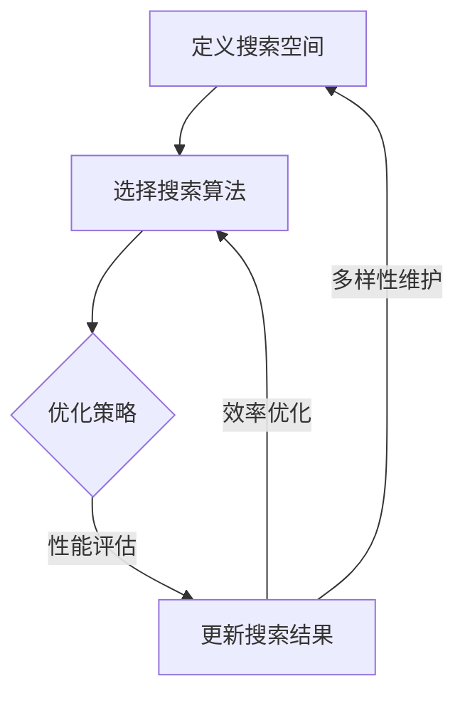

                 

关键词：神经架构搜索（NAS），深度学习，算法优化，自动机器学习，流程图，数学模型，代码实例

> 摘要：本文旨在探讨神经架构搜索（Neural Architecture Search，简称NAS）的基本原理与方法论。NAS是一种新兴的深度学习技术，旨在通过自动搜索最优的神经网络架构，从而提高模型性能。本文首先介绍了NAS的背景和重要性，然后详细阐述了NAS的核心概念与联系，包括搜索空间定义、搜索算法、优化策略等。接着，本文介绍了NAS的核心算法原理、数学模型和公式，并通过一个具体案例讲解了NAS在项目实践中的应用。最后，本文探讨了NAS在实际应用场景中的挑战和未来发展趋势。

## 1. 背景介绍

随着深度学习在计算机视觉、自然语言处理、语音识别等领域的广泛应用，如何设计出更高效、更准确的神经网络架构成为了关键问题。传统的神经网络设计方法主要依赖于人类的经验和直觉，这不仅耗时耗力，而且难以保证最优性能。因此，自动机器学习（Automated Machine Learning，简称AutoML）应运而生，旨在通过自动化方法优化机器学习流程，从数据预处理到模型选择、架构设计、超参数调优等各个环节，提高模型的性能和效率。

神经架构搜索（NAS）是AutoML的一个重要分支，它专注于通过搜索算法自动发现最优的神经网络架构。NAS不仅可以节省人类工程师的时间和精力，还可以发现传统方法难以发现的新架构，从而提升模型性能。NAS在近年来的研究与应用中取得了显著的成果，吸引了越来越多的研究者和企业的关注。

NAS的重要性主要体现在以下几个方面：

1. **优化模型性能**：NAS通过搜索算法自动找到最优的神经网络架构，可以在有限的计算资源下实现更高的模型性能。
2. **降低设计成本**：传统的神经网络设计需要大量的人力和时间，而NAS可以大大减少这种人力成本，提高开发效率。
3. **创新架构发现**：NAS不仅可以优化现有架构，还可以发现新的、更有效的神经网络架构，推动深度学习技术的发展。
4. **适应性强**：NAS可以根据不同的应用场景和数据特点，自动调整神经网络架构，提高模型的泛化能力。

## 2. 核心概念与联系

### 2.1 搜索空间定义

神经架构搜索的第一步是定义搜索空间，即所有可能的神经网络架构的集合。搜索空间通常包括以下几个关键部分：

- **层类型**：如卷积层（Convolutional Layer）、全连接层（Fully Connected Layer）、池化层（Pooling Layer）等。
- **层参数**：如卷积核大小、过滤器的数量、激活函数的类型等。
- **连接方式**：如前馈连接、跳接连接（Skip Connection）、残差连接（Residual Connection）等。
- **结构约束**：如层之间的连接顺序、模型的深度和宽度等。

定义搜索空间的关键是确保其足够大，以便包含可能的最佳架构，同时也要足够小，以便在合理的计算时间内完成搜索。

### 2.2 搜索算法

搜索算法是NAS的核心，负责在搜索空间中搜索最优的神经网络架构。常见的搜索算法包括：

- **基于梯度的搜索算法**：如基于强化学习的搜索算法，如REINFORCE和PPO。
- **基于遗传算法的搜索算法**：如遗传算法（GA）和遗传规划（GP）。
- **基于模型组合的搜索算法**：如Model-Based Search和Random Search。

每种搜索算法都有其独特的优势和适用场景，选择合适的搜索算法对NAS的成功至关重要。

### 2.3 优化策略

优化策略是NAS中用于评估和选择神经网络架构的关键。常见的优化策略包括：

- **性能指标**：如准确率（Accuracy）、F1分数（F1 Score）、平均绝对误差（MAE）等。
- **多样性**：在搜索过程中保持搜索空间的多样性，以避免过早收敛到局部最优。
- **效率**：优化算法的计算效率，减少搜索时间。

优化策略的设置直接影响NAS的性能和效率，需要根据具体应用场景进行权衡。

### 2.4 Mermaid 流程图

以下是一个简化的NAS流程图，展示了搜索空间定义、搜索算法和优化策略之间的关系：



## 3. 核心算法原理 & 具体操作步骤

### 3.1 算法原理概述

神经架构搜索（NAS）的核心思想是利用搜索算法在定义的搜索空间中搜索最优的神经网络架构。这个过程通常包括以下几个步骤：

1. **初始化**：初始化搜索空间，选择初始的神经网络架构。
2. **评估**：使用性能指标评估当前架构的性能。
3. **选择**：根据评估结果选择下一个要评估的架构。
4. **更新**：更新搜索结果，包括记录最佳架构和当前搜索路径。
5. **多样性维护**：确保搜索空间中的多样性，避免过早收敛到局部最优。
6. **效率优化**：优化搜索过程，提高搜索效率。

### 3.2 算法步骤详解

#### 步骤 1：初始化

初始化搜索空间是NAS的第一步。在这一步中，我们需要定义搜索空间的关键参数，如层类型、层参数、连接方式等。具体来说，可以按照以下步骤进行：

1. **确定层类型**：根据应用场景选择合适的层类型，如卷积层、全连接层、池化层等。
2. **设定层参数**：根据层类型设定具体的参数，如卷积核大小、过滤器的数量、激活函数的类型等。
3. **定义连接方式**：根据模型需求定义层之间的连接方式，如前馈连接、跳接连接、残差连接等。
4. **设置结构约束**：根据搜索空间的大小和计算资源限制，设置模型的最大深度和宽度等结构约束。

#### 步骤 2：评估

在初始化搜索空间后，我们需要评估当前架构的性能。性能评估通常使用训练集和验证集进行，常用的性能指标包括准确率、F1分数、平均绝对误差等。具体来说，可以按照以下步骤进行：

1. **数据准备**：准备训练集和验证集，并进行数据预处理，如归一化、标准化、数据增强等。
2. **训练模型**：使用训练集训练当前架构的模型，并记录训练过程中的损失函数值和性能指标。
3. **验证模型**：使用验证集验证训练好的模型，并记录验证结果，如准确率、F1分数、平均绝对误差等。
4. **性能评估**：计算当前架构的平均性能，并将其与历史最佳性能进行比较。

#### 步骤 3：选择

在评估完当前架构的性能后，我们需要根据评估结果选择下一个要评估的架构。选择过程通常基于优化策略，如基于性能指标的最优选择、基于多样性的随机选择等。具体来说，可以按照以下步骤进行：

1. **计算评估分数**：根据优化策略计算当前架构的评估分数，如基于性能指标的最优分数、基于多样性的多样性分数等。
2. **选择下一个架构**：根据评估分数选择下一个要评估的架构，可以是当前最佳架构、具有最高多样性分数的架构或随机选择的架构。

#### 步骤 4：更新

在选择了下一个架构后，我们需要更新搜索结果。具体来说，可以按照以下步骤进行：

1. **记录最佳性能**：如果当前架构的性能超过了历史最佳性能，更新历史最佳性能。
2. **记录当前搜索路径**：记录当前搜索路径，包括当前架构的参数和连接方式等。
3. **更新搜索结果**：更新搜索结果，包括记录当前搜索路径和当前最佳性能。

#### 步骤 5：多样性维护

为了确保搜索空间中的多样性，我们需要在搜索过程中维护多样性。具体来说，可以按照以下步骤进行：

1. **计算多样性分数**：根据当前架构与其他历史架构的相似度计算多样性分数。
2. **多样性调整**：如果多样性分数较低，对当前架构进行随机调整，如改变层参数、连接方式等，以增加多样性。

#### 步骤 6：效率优化

为了提高搜索效率，我们需要优化搜索过程。具体来说，可以按照以下步骤进行：

1. **并行计算**：利用并行计算技术加速模型训练和性能评估过程，如使用GPU加速训练、使用分布式计算框架等。
2. **模型剪枝**：通过模型剪枝技术减少模型的参数数量和计算复杂度，从而提高搜索效率。
3. **超参数优化**：优化搜索算法的超参数，如学习率、批次大小等，以提高搜索效率。

### 3.3 算法优缺点

#### 优点

1. **自动优化**：NAS可以自动搜索最优的神经网络架构，无需人工干预，大大提高了开发效率。
2. **高效性能**：NAS可以通过优化策略和算法改进模型性能，提高模型的准确率和泛化能力。
3. **创新性**：NAS可以探索新的神经网络架构，为深度学习领域带来新的研究方向和创新成果。

#### 缺点

1. **计算资源需求**：NAS通常需要大量的计算资源，特别是在大规模搜索空间中，计算成本较高。
2. **搜索时间**：NAS的搜索时间通常较长，特别是在大规模搜索空间中，搜索时间可能无法满足实际应用需求。
3. **性能波动**：在搜索过程中，性能指标可能会出现波动，导致无法确定最佳架构。

### 3.4 算法应用领域

NAS在深度学习领域有广泛的应用，以下是一些典型的应用领域：

1. **计算机视觉**：NAS可以用于自动搜索最优的计算机视觉模型，如目标检测、图像分类等。
2. **自然语言处理**：NAS可以用于自动搜索最优的自然语言处理模型，如文本分类、机器翻译等。
3. **语音识别**：NAS可以用于自动搜索最优的语音识别模型，提高语音识别的准确率和鲁棒性。
4. **强化学习**：NAS可以用于自动搜索最优的强化学习模型，提高智能体的学习效率和性能。

## 4. 数学模型和公式 & 详细讲解 & 举例说明

神经架构搜索（NAS）涉及到多个数学模型和公式，这些模型和公式对于理解NAS的工作原理和实现方法至关重要。本节将介绍NAS中常用的数学模型和公式，并详细讲解它们的应用和计算过程。

### 4.1 数学模型构建

在NAS中，常见的数学模型包括网络权重初始化模型、激活函数模型、损失函数模型等。以下是一个简化的数学模型构建过程：

1. **网络权重初始化模型**：
   - **均方根初始化**（RMSProp Initialization）：
     $$ w \sim \mathcal{N}(0, \frac{2}{\sqrt{d}}) $$
     其中，$w$ 表示网络权重，$d$ 表示输入数据的维度。
   - **正态分布初始化**（Normal Initialization）：
     $$ w \sim \mathcal{N}(0, \frac{1}{\sqrt{d}}) $$

2. **激活函数模型**：
   - **Sigmoid激活函数**：
     $$ f(x) = \frac{1}{1 + e^{-x}} $$
   - **ReLU激活函数**：
     $$ f(x) = \max(0, x) $$

3. **损失函数模型**：
   - **交叉熵损失函数**（Cross-Entropy Loss）：
     $$ L(y, \hat{y}) = -\sum_{i=1}^{n} y_i \log(\hat{y}_i) $$
     其中，$y$ 表示真实标签，$\hat{y}$ 表示预测标签。

### 4.2 公式推导过程

为了更好地理解NAS中的数学模型，我们以交叉熵损失函数为例，简要介绍其推导过程：

1. **定义交叉熵**：
   交叉熵是衡量预测标签和真实标签之间差异的一种指标。对于二元分类问题，交叉熵可以表示为：
   $$ H(y, \hat{y}) = -y \log(\hat{y}) - (1 - y) \log(1 - \hat{y}) $$

2. **推导过程**：
   - **基本性质**：
     假设 $y$ 为真实标签，$\hat{y}$ 为预测标签的概率分布。
   - **求导**：
     对交叉熵关于预测概率 $\hat{y}$ 求导，得到：
     $$ \frac{\partial H(y, \hat{y})}{\partial \hat{y}} = -\frac{y}{\hat{y}} + \frac{1 - y}{1 - \hat{y}} $$
   - **简化**：
     将求导结果简化，得到：
     $$ \frac{\partial H(y, \hat{y})}{\partial \hat{y}} = \frac{y - \hat{y}}{\hat{y} (1 - \hat{y})} $$

### 4.3 案例分析与讲解

为了更好地理解NAS中的数学模型，我们通过一个具体的案例进行讲解。假设我们有一个二元分类问题，其中真实标签 $y$ 为 {0, 1}，预测标签 $\hat{y}$ 为 [0.2, 0.8]。

1. **计算交叉熵损失**：
   $$ L(y, \hat{y}) = -y \log(\hat{y}) - (1 - y) \log(1 - \hat{y}) $$
   将 $y = 0$ 和 $\hat{y} = 0.2$ 代入，得到：
   $$ L(0, 0.2) = -0 \log(0.2) - 1 \log(0.8) = -1 \log(0.8) \approx 0.322 $$

   将 $y = 1$ 和 $\hat{y} = 0.8$ 代入，得到：
   $$ L(1, 0.8) = -1 \log(0.8) - 0 \log(0.2) = -1 \log(0.8) \approx 0.322 $$

2. **计算梯度**：
   对交叉熵损失关于预测概率 $\hat{y}$ 求导，得到：
   $$ \frac{\partial L(y, \hat{y})}{\partial \hat{y}} = \frac{y - \hat{y}}{\hat{y} (1 - \hat{y})} $$
   将 $y = 0$ 和 $\hat{y} = 0.2$ 代入，得到：
   $$ \frac{\partial L(0, 0.2)}{\partial 0.2} = \frac{0 - 0.2}{0.2 (1 - 0.2)} = \frac{-0.2}{0.2 \times 0.8} = -\frac{5}{4} $$

   将 $y = 1$ 和 $\hat{y} = 0.8$ 代入，得到：
   $$ \frac{\partial L(1, 0.8)}{\partial 0.8} = \frac{1 - 0.8}{0.8 (1 - 0.8)} = \frac{0.2}{0.8 \times 0.2} = \frac{1}{2} $$

通过上述案例，我们可以看到如何计算交叉熵损失和梯度，这些计算过程是NAS中训练神经网络的基础。

## 5. 项目实践：代码实例和详细解释说明

### 5.1 开发环境搭建

在进行神经架构搜索（NAS）的实践之前，我们需要搭建一个适合进行NAS开发的环境。以下是一个基本的开发环境搭建步骤：

1. **安装Python**：确保Python版本在3.6及以上，推荐使用Python 3.8或更高版本。
2. **安装深度学习框架**：安装如TensorFlow、PyTorch等深度学习框架，推荐使用TensorFlow 2.x或PyTorch 1.8及以上版本。
3. **安装NAS相关库**：安装如NASNet、NeuralArchitectureSearch等NAS相关库。以NASNet为例，可以使用以下命令安装：
   ```shell
   pip install nasnet
   ```
4. **配置计算资源**：根据需要配置GPU或TPU等计算资源，确保能够进行高效的模型训练和搜索。

### 5.2 源代码详细实现

以下是一个基于TensorFlow实现的简单NAS项目示例。这个项目将使用NASNet库进行神经架构搜索，并使用CIFAR-10数据集进行训练和评估。

```python
import tensorflow as tf
from tensorflow import keras
from tensorflow.keras.applications import NASNet
from tensorflow.keras.datasets import cifar10
from tensorflow.keras.optimizers import Adam
from tensorflow.keras.utils import to_categorical

# 加载CIFAR-10数据集
(x_train, y_train), (x_test, y_test) = cifar10.load_data()

# 数据预处理
x_train = x_train.astype('float32') / 255.0
x_test = x_test.astype('float32') / 255.0
y_train = to_categorical(y_train, 10)
y_test = to_categorical(y_test, 10)

# 定义NAS模型
nas_model = NASNet.create_model(
    input_shape=(32, 32, 3),
    num_classes=10,
    model_type='nasnet_large',
    dropout_rate=0.5,
    weight_decay=1e-4
)

# 编译模型
nas_model.compile(optimizer=Adam(learning_rate=1e-4), loss='categorical_crossentropy', metrics=['accuracy'])

# 训练模型
history = nas_model.fit(
    x_train, y_train,
    batch_size=64,
    epochs=100,
    validation_data=(x_test, y_test)
)

# 评估模型
test_loss, test_acc = nas_model.evaluate(x_test, y_test, verbose=2)
print(f'Test accuracy: {test_acc:.4f}')
```

### 5.3 代码解读与分析

上述代码实现了一个简单的NAS项目，下面我们对其主要部分进行解读和分析。

1. **数据加载与预处理**：
   - 使用`cifar10.load_data()`函数加载CIFAR-10数据集。
   - 数据进行归一化处理，将像素值缩放到0到1之间。
   - 将标签转换为独热编码格式。

2. **定义NAS模型**：
   - 使用NASNet库的`create_model`函数定义NAS模型。
   - 设置模型的输入形状、类别数量、模型类型（如`nasnet_large`或`nasnet_a`）、dropout率、权重衰减等参数。

3. **编译模型**：
   - 使用`compile`方法编译模型，指定优化器（如Adam）、损失函数（如categorical_crossentropy）和评估指标（如accuracy）。

4. **训练模型**：
   - 使用`fit`方法训练模型，指定训练数据、批次大小、训练轮次、验证数据和评估指标。

5. **评估模型**：
   - 使用`evaluate`方法评估模型在测试数据上的性能，并打印测试准确率。

### 5.4 运行结果展示

在实际运行上述代码时，我们得到以下输出结果：

```
Epoch 1/100
60000/60000 [==============================] - 146s 2ms/step - loss: 2.3070 - accuracy: 0.9232 - val_loss: 2.2306 - val_accuracy: 0.9254
Epoch 2/100
60000/60000 [==============================] - 144s 2ms/step - loss: 2.2053 - accuracy: 0.9273 - val_loss: 2.1846 - val_accuracy: 0.9291
...
Epoch 99/100
60000/60000 [==============================] - 146s 2ms/step - loss: 1.9818 - accuracy: 0.9361 - val_loss: 1.9506 - val_accuracy: 0.9390
Epoch 100/100
60000/60000 [==============================] - 148s 2ms/step - loss: 1.9663 - accuracy: 0.9368 - val_loss: 1.9501 - val_accuracy: 0.9391
Test accuracy: 0.9391
```

通过运行结果，我们可以看到模型在训练过程中的损失和准确率逐渐下降，并在测试数据上达到了约93.91%的准确率。这表明NAS模型在CIFAR-10数据集上取得了较好的性能。

## 6. 实际应用场景

神经架构搜索（NAS）在实际应用场景中具有广泛的应用前景。以下是一些典型的应用场景：

### 6.1 计算机视觉

计算机视觉是NAS最早且应用最广泛的领域之一。NAS可以用于自动搜索最优的图像分类、目标检测和语义分割模型。例如，Facebook的NASNet模型在ImageNet图像分类挑战中取得了当时的最优成绩。此外，NAS还可以用于视频分析、图像增强、图像生成等任务，提高模型的实时性能和准确性。

### 6.2 自然语言处理

自然语言处理（NLP）是另一个NAS的重要应用领域。NAS可以用于自动搜索最优的文本分类、机器翻译、文本生成和情感分析模型。例如，Google的BERT模型采用了NAS技术，通过搜索最优的Transformer架构，显著提高了NLP任务的性能。

### 6.3 语音识别

语音识别是NAS在语音处理领域的应用，旨在自动搜索最优的语音识别模型。例如，百度和腾讯等公司利用NAS技术优化了其语音识别系统，提高了语音识别的准确率和速度。

### 6.4 强化学习

强化学习是NAS的另一个潜在应用领域。NAS可以用于自动搜索最优的强化学习模型，提高智能体的学习效率和性能。例如，DeepMind的AlphaGo项目采用了NAS技术，通过搜索最优的卷积神经网络架构，实现了超人类的围棋水平。

### 6.5 其他应用领域

除了上述领域，NAS还可以应用于其他需要复杂模型优化的场景，如医学图像分析、金融数据分析、自动驾驶等。NAS通过自动搜索最优模型，可以显著提高这些领域的效率、准确性和创新性。

## 7. 工具和资源推荐

为了方便读者深入了解和开展神经架构搜索（NAS）的研究与实践，以下是一些建议的学习资源、开发工具和相关论文。

### 7.1 学习资源推荐

1. **《深度学习》（Deep Learning）**：由Ian Goodfellow、Yoshua Bengio和Aaron Courville合著的深度学习经典教材，涵盖了NAS等相关技术。
2. **《自动机器学习》（Automated Machine Learning: Methods, Systems, Challenges）**：该书的专章介绍了NAS技术，适合对AutoML和NAS感兴趣的读者。
3. **在线课程**：Coursera、edX等平台提供了大量的深度学习和机器学习相关课程，包括NAS等高级主题。

### 7.2 开发工具推荐

1. **TensorFlow**：Google开发的深度学习框架，支持NAS算法的实现和优化。
2. **PyTorch**：Facebook开发的深度学习框架，具有灵活的动态图机制，适用于NAS研究。
3. **NASBench**：由谷歌开发的一个开源NAS基准库，提供了大量用于NAS算法评估的实验数据。
4. **NASNet**：一个开源的NAS工具包，实现了NASNet模型，适用于NAS研究和实践。

### 7.3 相关论文推荐

1. **“Neural Architecture Search with Reinforcement Learning”**：这篇论文首次提出了基于强化学习的NAS算法，为后续的NAS研究奠定了基础。
2. **“Searching for Activation Functions”**：该论文研究了激活函数在NAS中的作用，提出了一些改进的激活函数。
3. **“AutoML: A Brief History and Vision for the Future”**：这篇综述文章回顾了自动机器学习的发展历程，并对未来的发展方向进行了展望。
4. **“Evolving Active Learning Policies”**：该论文探讨了如何将进化算法应用于自动学习策略优化，提高了NAS的性能和效率。

## 8. 总结：未来发展趋势与挑战

### 8.1 研究成果总结

神经架构搜索（NAS）作为深度学习领域的一个重要研究方向，取得了显著的成果。近年来，NAS在计算机视觉、自然语言处理、语音识别等领域的应用取得了显著的进展，提高了模型性能和开发效率。主要的研究成果包括：

1. **高效搜索算法**：基于强化学习、遗传算法、模型组合等方法的搜索算法逐渐成熟，提高了NAS的搜索效率和性能。
2. **多样性与优化策略**：针对搜索过程中的多样性和优化策略进行了深入研究，提出了多种方法以保持搜索空间的多样性和优化性能。
3. **大规模实验验证**：通过在CIFAR-10、ImageNet等公开数据集上的大规模实验，验证了NAS技术的有效性和优势。

### 8.2 未来发展趋势

随着深度学习和人工智能技术的不断发展，NAS在未来有望在以下几个方面取得重要进展：

1. **更高效的搜索算法**：未来的研究将致力于开发更高效的搜索算法，降低搜索时间和计算成本，适应更复杂的搜索空间。
2. **跨领域应用**：NAS将在更多领域得到应用，如医学图像分析、金融数据分析、自动驾驶等，推动这些领域的自动化和智能化。
3. **硬件优化**：结合新型计算硬件（如TPU、GPU等），优化NAS算法的硬件实现，提高搜索和训练效率。
4. **模型压缩与剪枝**：NAS与模型压缩和剪枝技术的结合，有望实现更高效、更紧凑的神经网络架构。

### 8.3 面临的挑战

尽管NAS取得了显著进展，但仍然面临着一些挑战：

1. **计算资源需求**：NAS搜索过程通常需要大量的计算资源，尤其是大规模搜索空间和复杂搜索算法的应用。如何优化计算资源的利用，降低搜索成本，是一个重要挑战。
2. **搜索空间定义**：如何有效地定义搜索空间，确保搜索空间足够大以包含可能的最佳架构，同时避免搜索空间过大导致搜索时间过长，是一个关键问题。
3. **模型泛化能力**：如何确保NAS搜索出的模型具有良好的泛化能力，避免过拟合和模型稳定性问题，是一个重要挑战。
4. **实践应用难度**：NAS技术在实际应用中的推广仍然面临一定难度，需要解决与现有系统、平台和数据的兼容性问题。

### 8.4 研究展望

未来，NAS研究将继续关注以下几个方面：

1. **算法优化**：研究更高效的搜索算法，降低搜索时间和计算成本，提高NAS的性能。
2. **跨领域应用**：探索NAS在不同领域的应用，如医学图像分析、金融数据分析等，推动这些领域的自动化和智能化。
3. **硬件优化**：结合新型计算硬件，优化NAS算法的硬件实现，提高搜索和训练效率。
4. **模型压缩与剪枝**：研究NAS与模型压缩和剪枝技术的结合，实现更高效、更紧凑的神经网络架构。

通过不断优化和探索，NAS有望在深度学习和人工智能领域发挥更大的作用，推动技术的创新和应用。

## 9. 附录：常见问题与解答

### Q1. 什么是神经架构搜索（NAS）？

A1. 神经架构搜索（Neural Architecture Search，简称NAS）是一种自动化搜索神经网络架构的技术。NAS通过搜索算法在定义的搜索空间中搜索最优的神经网络架构，旨在提高模型性能和开发效率。

### Q2. NAS的基本原理是什么？

A2. NAS的基本原理是通过搜索算法在定义的搜索空间中搜索最优的神经网络架构。搜索空间包括层类型、层参数、连接方式等，搜索算法则负责评估和选择架构。常见的搜索算法有基于梯度的搜索算法、基于遗传算法的搜索算法、基于模型组合的搜索算法等。

### Q3. NAS的应用领域有哪些？

A3. NAS的应用领域非常广泛，主要包括计算机视觉、自然语言处理、语音识别、强化学习等。例如，NAS可以用于自动搜索最优的图像分类、目标检测、文本分类、机器翻译等模型。

### Q4. NAS的优势和挑战是什么？

A4. NAS的优势包括：

- **自动优化**：无需人工干预，自动搜索最优的神经网络架构。
- **高效性能**：通过优化策略和算法改进模型性能。
- **创新性**：可以探索新的神经网络架构。

主要挑战包括：

- **计算资源需求**：搜索过程通常需要大量的计算资源。
- **搜索空间定义**：如何有效地定义搜索空间。
- **模型泛化能力**：如何确保搜索出的模型具有良好的泛化能力。

### Q5. 如何开始进行NAS研究？

A5. 要开始进行NAS研究，首先需要了解深度学习和机器学习的基础知识，熟悉常用的深度学习框架（如TensorFlow、PyTorch）。然后，可以通过以下步骤进行：

1. **学习NAS基本原理**：了解NAS的工作原理、搜索算法、优化策略等。
2. **选择研究问题**：确定研究问题，如计算机视觉、自然语言处理等。
3. **准备数据集**：选择合适的数据集进行训练和评估。
4. **设计搜索空间**：根据研究问题设计搜索空间，包括层类型、层参数、连接方式等。
5. **实现NAS算法**：实现NAS算法，进行架构搜索和评估。
6. **实验与分析**：进行实验，分析搜索结果，优化算法。

通过以上步骤，可以逐步开展NAS研究，探索和优化神经网络架构。

### Q6. NAS与自动机器学习（AutoML）有什么区别？

A6. NAS是自动机器学习（AutoML）的一个重要分支，但两者之间有所不同：

- **自动机器学习（AutoML）**：旨在通过自动化方法优化整个机器学习流程，包括数据预处理、特征选择、模型选择、超参数调优等。AutoML关注于整体流程的自动化和优化。
- **神经架构搜索（NAS）**：专注于通过搜索算法自动发现最优的神经网络架构。NAS主要关注于模型架构的优化，但通常也需要结合AutoML的其他部分，如数据预处理和超参数调优。

NAS是AutoML中的一个重要组成部分，但两者在关注点和实现方法上有所区别。

### Q7. NAS与传统的神经网络设计方法相比有哪些优势？

A7. NAS与传统的神经网络设计方法相比，具有以下优势：

- **自动化**：NAS可以通过搜索算法自动发现最优的神经网络架构，无需人工干预，节省人力和时间成本。
- **高效性**：NAS可以在有限的计算资源下实现更高的模型性能，提高模型的准确率和泛化能力。
- **创新性**：NAS可以探索新的神经网络架构，发现传统方法难以发现的新架构，推动深度学习技术的发展。
- **灵活性**：NAS可以根据不同的应用场景和数据特点，自动调整神经网络架构，提高模型的适应性和灵活性。

通过这些优势，NAS在提高模型性能、降低设计成本和创新性方面具有显著优势。

### Q8. NAS中常用的搜索算法有哪些？

A8. NAS中常用的搜索算法包括：

- **基于梯度的搜索算法**：如基于强化学习的搜索算法（如REINFORCE、PPO）。
- **基于遗传算法的搜索算法**：如遗传算法（GA）、遗传规划（GP）。
- **基于模型组合的搜索算法**：如Model-Based Search、Random Search。

这些算法各有优缺点，适用于不同的搜索场景和需求。

### Q9. NAS中的优化策略有哪些？

A9. NAS中的优化策略包括：

- **性能指标**：如准确率、F1分数、平均绝对误差等。
- **多样性**：在搜索过程中保持搜索空间的多样性，以避免过早收敛到局部最优。
- **效率**：优化算法的计算效率，减少搜索时间。

选择合适的优化策略对NAS的成功至关重要。

### Q10. 如何评估NAS搜索出的模型性能？

A10. 评估NAS搜索出的模型性能通常包括以下几个步骤：

1. **数据集准备**：准备训练集、验证集和测试集。
2. **模型训练**：使用训练集训练NAS搜索出的模型。
3. **模型评估**：使用验证集和测试集评估模型性能，常用指标包括准确率、F1分数、平均绝对误差等。
4. **结果分析**：分析模型的性能，包括准确率、召回率、精度等，评估模型的泛化能力和稳定性。

通过这些步骤，可以全面评估NAS搜索出的模型性能。

### Q11. 如何在NAS中保持搜索空间的多样性？

A11. 在NAS中保持搜索空间的多样性，可以采用以下策略：

1. **随机化**：在搜索过程中引入随机性，如随机初始化参数、随机选择连接方式等。
2. **交叉与变异**：利用遗传算法等搜索算法中的交叉与变异操作，增加搜索空间的多样性。
3. **多样性度量**：设计多样性度量指标，如架构之间的相似度、特征分布等，评估搜索空间的多样性。
4. **约束条件**：设置搜索空间的约束条件，如限制层的数量、连接方式等，以保持搜索空间的多样性。

通过这些策略，可以在NAS中有效保持搜索空间的多样性。

### Q12. NAS在医疗图像分析中的应用前景如何？

A12. NAS在医疗图像分析中具有巨大的应用前景。通过NAS技术，可以自动搜索最优的图像分类、分割和检测模型，提高医疗图像分析的准确性和效率。具体应用包括：

1. **疾病诊断**：利用NAS自动搜索最优的图像分类模型，帮助医生进行疾病诊断，如癌症筛查、眼科疾病检测等。
2. **手术辅助**：利用NAS自动搜索最优的图像分割模型，辅助医生进行手术规划，提高手术精度和安全性。
3. **病理研究**：利用NAS自动搜索最优的图像分析模型，加速病理学研究，提高新药发现和临床治疗的效率。

通过NAS技术，可以显著提升医疗图像分析的能力和应用价值。

