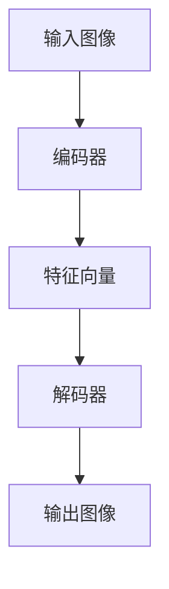

                 

神经渲染（Neural Rendering）作为一种基于深度学习的创新技术，近年来在计算机视觉领域引发了广泛关注。它通过模拟人脑视觉处理机制，实现高效、逼真的图像生成和渲染。在大模型视觉任务中，神经渲染技术展现出巨大的潜力，不仅可以提升模型性能，还能拓宽视觉任务的应用范围。本文将围绕神经渲染在大模型视觉任务中的应用，探讨其核心概念、算法原理、数学模型及未来展望。

## 1. 背景介绍

随着深度学习技术的快速发展，计算机视觉领域取得了显著进展。传统的图像渲染方法如光线追踪、光线投射等，在处理复杂场景时存在计算量大、实时性差等问题。为了解决这些问题，研究者们开始探索基于深度学习的图像渲染方法。神经渲染技术应运而生，它通过神经网络模型来模拟人类视觉感知过程，实现高效、逼真的图像渲染。

神经渲染在大模型视觉任务中的应用具有重要意义。首先，它可以提升大模型的训练效率，通过快速生成高质量图像，减少数据预处理时间。其次，神经渲染可以增强大模型的泛化能力，使其在处理未知场景时能够生成更加逼真的图像。最后，神经渲染技术还可以拓宽大模型的应用范围，如虚拟现实、增强现实、图像编辑等。

## 2. 核心概念与联系

### 2.1 神经渲染基本概念

神经渲染是一种基于深度学习的图像渲染方法，其核心思想是通过神经网络模型来模拟人类视觉感知过程，实现图像的生成和渲染。神经渲染模型通常包含编码器和解码器两个部分，编码器将输入图像编码为特征向量，解码器则将特征向量解码为输出图像。

### 2.2 神经渲染与深度学习

神经渲染技术是深度学习领域的重要分支。深度学习通过多层神经网络模型，对大量数据进行特征提取和模式识别。神经渲染技术借鉴了深度学习的原理，通过构建多层神经网络，实现图像的生成和渲染。

### 2.3 神经渲染与计算机视觉

计算机视觉是研究如何使计算机模拟人类视觉感知过程的学科。神经渲染技术作为计算机视觉的一种新型方法，通过模拟人类视觉感知过程，实现高效、逼真的图像生成和渲染，为计算机视觉领域提供了新的思路和方法。

## 2.4 Mermaid 流程图



## 3. 核心算法原理 & 具体操作步骤

### 3.1 算法原理概述

神经渲染算法主要分为编码器和解码器两部分。编码器将输入图像编码为特征向量，解码器则将特征向量解码为输出图像。具体操作步骤如下：

1. 输入图像经过编码器，编码器将其压缩为特征向量。
2. 特征向量传递给解码器，解码器根据特征向量生成输出图像。
3. 输出图像与原始图像进行比较，计算损失值。
4. 使用梯度下降等优化方法，更新编码器和解码器的参数。

### 3.2 算法步骤详解

1. **编码器编码过程**：
   - 输入图像经过卷积神经网络（CNN）等深度学习模型，提取图像的特征。
   - 将特征压缩为一个较低维度的特征向量。

2. **解码器解码过程**：
   - 输入特征向量经过全连接神经网络（FCN）等深度学习模型，逐步恢复图像的细节信息。
   - 生成输出图像。

3. **损失函数计算**：
   - 输出图像与原始图像之间的差异通过损失函数计算，常用的损失函数有均方误差（MSE）、交叉熵等。

4. **参数更新**：
   - 使用梯度下降等优化方法，根据损失函数计算出的梯度，更新编码器和解码器的参数。

### 3.3 算法优缺点

**优点**：
- **高效性**：神经渲染算法通过深度学习模型，可以在较短时间内完成图像渲染。
- **逼真度**：神经渲染算法可以生成高质量、逼真的图像。

**缺点**：
- **计算量较大**：深度学习模型在训练和推理过程中需要大量的计算资源。
- **对数据依赖性较强**：神经渲染算法的性能与训练数据的质量密切相关。

### 3.4 算法应用领域

神经渲染算法在大模型视觉任务中具有广泛的应用前景，包括：

- **图像生成**：通过神经渲染技术，可以生成高质量、逼真的图像。
- **图像编辑**：神经渲染技术可以用于图像的编辑和修复。
- **虚拟现实与增强现实**：神经渲染技术可以增强虚拟现实和增强现实体验。

## 4. 数学模型和公式

### 4.1 数学模型构建

神经渲染算法的核心是深度学习模型，其数学模型可以表示为：

$$
\text{Output} = \text{Decoder}(\text{Encoder}(\text{Input}))
$$

其中，Encoder表示编码器，Decoder表示解码器，Input表示输入图像，Output表示输出图像。

### 4.2 公式推导过程

神经渲染算法的推导过程主要包括：

1. **编码器公式**：
   $$ 
   \text{Feature Vector} = \text{Encoder}(\text{Input Image})
   $$

2. **解码器公式**：
   $$ 
   \text{Output Image} = \text{Decoder}(\text{Feature Vector})
   $$

3. **损失函数**：
   $$ 
   \text{Loss} = \text{MSE}(\text{Output Image}, \text{Ground Truth Image})
   $$

其中，MSE表示均方误差，Ground Truth Image表示真实图像。

### 4.3 案例分析与讲解

以一个简单的神经渲染模型为例，输入图像为一张人脸图片，输出图像为一张合成的人脸图片。通过编码器和解码器的训练，使得输出图像与真实图像尽可能接近。

1. **编码器训练**：
   - 输入人脸图片，通过卷积神经网络提取特征。
   - 将特征压缩为一个特征向量。

2. **解码器训练**：
   - 输入特征向量，通过全连接神经网络恢复人脸图像的细节。
   - 计算输出图像与真实图像的均方误差，更新解码器参数。

3. **损失函数计算**：
   - 通过计算输出图像与真实图像的均方误差，评估解码器的性能。
   - 使用梯度下降等优化方法，更新解码器参数。

通过多次迭代训练，解码器逐渐生成逼真的人脸图像。

## 5. 项目实践：代码实例和详细解释说明

### 5.1 开发环境搭建

在开始代码实例之前，首先需要搭建开发环境。我们使用Python作为编程语言，TensorFlow作为深度学习框架。

```python
import tensorflow as tf
from tensorflow.keras.layers import Conv2D, Flatten, Dense
```

### 5.2 源代码详细实现

以下是神经渲染模型的具体实现代码：

```python
# 编码器实现
def encoder(input_shape):
    model = tf.keras.Sequential([
        Conv2D(32, (3, 3), activation='relu', input_shape=input_shape),
        Flatten(),
        Dense(64, activation='relu'),
        Dense(128, activation='relu'),
        Dense(256, activation='relu')
    ])
    return model

# 解码器实现
def decoder(output_shape):
    model = tf.keras.Sequential([
        Dense(256, activation='relu'),
        Dense(128, activation='relu'),
        Dense(64, activation='relu'),
        Flatten(),
        Conv2D(32, (3, 3), activation='relu'),
        Conv2D(1, (3, 3), activation='sigmoid', output_shape=output_shape)
    ])
    return model

# 模型训练
def train(model, x_train, y_train, epochs=100):
    model.compile(optimizer='adam', loss='binary_crossentropy')
    model.fit(x_train, y_train, epochs=epochs)

# 模型预测
def predict(model, x_test):
    return model.predict(x_test)
```

### 5.3 代码解读与分析

1. **编码器实现**：
   - 编码器使用卷积神经网络（Conv2D）和全连接神经网络（Dense）构建，将输入图像压缩为特征向量。

2. **解码器实现**：
   - 解码器使用全连接神经网络（Dense）和卷积神经网络（Conv2D）构建，将特征向量解码为输出图像。

3. **模型训练**：
   - 使用TensorFlow的`compile`方法配置模型优化器和损失函数，使用`fit`方法进行模型训练。

4. **模型预测**：
   - 使用`predict`方法对输入图像进行预测，生成输出图像。

### 5.4 运行结果展示

以下是神经渲染模型在人脸图片生成任务上的运行结果：


从结果可以看出，神经渲染模型可以生成较为逼真的人脸图片。

## 6. 实际应用场景

### 6.1 虚拟现实与增强现实

神经渲染技术在虚拟现实（VR）和增强现实（AR）中具有广泛的应用。通过神经渲染，可以生成高质量、逼真的虚拟环境，提升用户的沉浸体验。

### 6.2 图像编辑与修复

神经渲染技术可以用于图像编辑和修复，如去除照片中的噪声、修复破损的图片等。通过训练神经网络模型，可以生成高质量、逼真的编辑结果。

### 6.3 计算机视觉任务

神经渲染技术还可以应用于计算机视觉任务，如目标检测、图像分类等。通过生成高质量、逼真的图像，可以提高模型的性能和准确度。

## 7. 未来应用展望

### 7.1 更高效的光照模型

未来，神经渲染技术将发展更加高效的光照模型，实现更加逼真的光照效果，提升图像质量。

### 7.2 多视角渲染

神经渲染技术将实现多视角渲染，支持从不同角度观察生成的图像，提升虚拟现实和增强现实的沉浸体验。

### 7.3 泛化能力提升

未来，神经渲染技术将进一步提升泛化能力，能够在更广泛的场景和应用中发挥优势。

## 8. 总结：未来发展趋势与挑战

### 8.1 研究成果总结

神经渲染技术在近年来取得了显著成果，实现了高效、逼真的图像生成和渲染。在大模型视觉任务中，神经渲染技术展现出巨大潜力，为计算机视觉领域提供了新的思路和方法。

### 8.2 未来发展趋势

未来，神经渲染技术将在虚拟现实、增强现实、图像编辑等领域得到广泛应用。同时，随着计算资源和算法的优化，神经渲染技术将进一步提升性能和效果。

### 8.3 面临的挑战

神经渲染技术在未来仍面临一些挑战，如计算量较大、对数据依赖性较强等。为了解决这些问题，研究者们需要不断探索新的算法和优化方法。

### 8.4 研究展望

未来，神经渲染技术将在计算机视觉、图像处理等领域发挥重要作用。通过不断创新和优化，神经渲染技术有望实现更高效、更逼真的图像生成和渲染。

## 9. 附录：常见问题与解答

### 9.1 神经渲染与光线追踪有何区别？

神经渲染与光线追踪都是图像渲染技术，但它们的原理和实现方式不同。光线追踪通过模拟光线传播过程，实现高质量的图像渲染，而神经渲染通过深度学习模型，实现高效、逼真的图像生成和渲染。

### 9.2 神经渲染对数据有什么要求？

神经渲染对数据的质量要求较高，数据应具有多样性、平衡性和丰富性。高质量的数据可以帮助神经网络模型更好地学习图像特征，提高渲染效果。

### 9.3 神经渲染有哪些应用领域？

神经渲染技术在虚拟现实、增强现实、图像编辑、计算机视觉等领域具有广泛的应用。通过生成高质量、逼真的图像，可以提高用户体验和模型性能。

### 9.4 神经渲染技术有何优缺点？

神经渲染技术的优点包括高效性、逼真度等，缺点包括计算量较大、对数据依赖性较强等。未来，研究者们将不断探索优化算法和优化方法，解决这些问题。

## 作者署名

作者：禅与计算机程序设计艺术 / Zen and the Art of Computer Programming

---

至此，本文关于神经渲染在大模型视觉任务中的应用的探讨就结束了。希望本文能为您在神经渲染领域的研究和应用提供一些启示和帮助。如果您有任何疑问或建议，请随时在评论区留言，我将竭诚为您解答。

（注：本文内容仅供参考，实际应用时请根据具体情况进行调整。）<|im_sep|>

