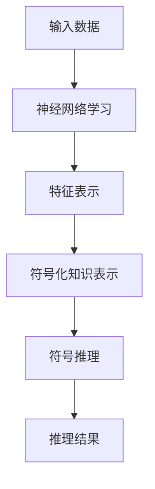

                 

关键词：神经符号人工智能、神经网络、符号推理、结合模型、最佳方案

摘要：本文将深入探讨神经符号人工智能（Neural-Symbolic AI）的发展历程、核心概念及其应用，旨在为研究人员和开发者提供一种全面、实用的解决方案。文章将从神经符号人工智能的背景介绍、核心概念与联系、核心算法原理及具体操作步骤、数学模型和公式、项目实践、实际应用场景、未来应用展望、工具和资源推荐以及总结与展望等方面进行详细阐述。

## 1. 背景介绍

随着人工智能（AI）技术的飞速发展，神经网络（Neural Networks）已经成为当前AI领域的热点。神经网络在图像识别、自然语言处理、语音识别等领域取得了显著的成果。然而，神经网络也面临着一些挑战，如“数据饥饿”（data-hunger）和“黑箱”（black-box）问题。为了解决这些问题，研究者开始探索将神经网络与符号推理（Symbolic Reasoning）相结合的神经符号人工智能（Neural-Symbolic AI）。

神经符号人工智能旨在利用神经网络处理大量数据，同时结合符号推理的能力，使得模型能够更好地理解和解释其决策过程。这种结合不仅能够提高模型的解释性，还能够提高模型的泛化能力。本文将详细介绍神经符号人工智能的理论基础、核心算法及其应用。

## 2. 核心概念与联系

### 2.1. 神经网络

神经网络是由大量神经元组成的计算模型，这些神经元模拟生物神经系统的信息处理过程。神经网络通过学习大量的数据来建立特征表示，并能够通过这些特征进行分类、预测和决策。

### 2.2. 符号推理

符号推理是一种基于逻辑和数学推理的方法，它能够对符号化的知识进行推理和演绎。符号推理在知识表示、问题求解和决策支持等领域有着广泛的应用。

### 2.3. 神经符号人工智能

神经符号人工智能是将神经网络与符号推理相结合的一种方法。它通过神经网络学习大量的数据，并将这些数据转化为符号化的知识表示。然后，利用符号推理对这些知识进行推理和演绎，从而实现更高级别的智能。

下面是一个神经符号人工智能的 Mermaid 流程图：



## 3. 核心算法原理 & 具体操作步骤

### 3.1. 算法原理概述

神经符号人工智能的核心算法是将神经网络与符号推理相结合。具体操作步骤如下：

1. 神经网络学习：首先，利用神经网络学习大量的数据，建立特征表示。
2. 符号化知识表示：将神经网络学习的特征表示转化为符号化的知识表示。
3. 符号推理：利用符号推理对符号化的知识表示进行推理和演绎。
4. 推理结果：根据推理结果，进行分类、预测或决策。

### 3.2. 算法步骤详解

1. **神经网络学习**：使用神经网络对大量数据进行学习，建立特征表示。这一步通常使用反向传播算法（Backpropagation Algorithm）来调整神经网络的权重。

2. **符号化知识表示**：将神经网络学习的特征表示转化为符号化的知识表示。这一步可以使用知识图谱（Knowledge Graph）或符号化规则（Symbolic Rules）来实现。

3. **符号推理**：利用符号推理对符号化的知识表示进行推理和演绎。这一步可以使用自动推理系统（Automated Reasoning System）来实现。

4. **推理结果**：根据推理结果，进行分类、预测或决策。这一步可以使用决策树（Decision Tree）、支持向量机（Support Vector Machine）等算法来实现。

### 3.3. 算法优缺点

**优点**：

- 结合了神经网络和符号推理的优势，能够提高模型的解释性和泛化能力。
- 能够处理复杂的任务，如知识图谱推理、问题求解等。

**缺点**：

- 计算成本较高，需要大量的计算资源和时间。
- 需要大量的先验知识和规则，才能有效地进行符号推理。

### 3.4. 算法应用领域

神经符号人工智能在多个领域有着广泛的应用，如：

- **知识图谱推理**：利用神经符号人工智能对知识图谱进行推理，可以生成新的知识。
- **问题求解**：利用神经符号人工智能解决复杂的问题，如游戏AI、自然语言处理等。
- **决策支持**：利用神经符号人工智能进行决策支持，如金融风险管理、医疗诊断等。

## 4. 数学模型和公式 & 详细讲解 & 举例说明

### 4.1. 数学模型构建

神经符号人工智能的数学模型主要由两部分组成：神经网络和符号推理。

1. **神经网络**：神经网络可以用以下数学模型表示：

   $$ f(\textbf{x}; \theta) = \text{sigmoid}(\text{W} \cdot \textbf{x} + b) $$

   其中，$\textbf{x}$ 是输入向量，$\theta$ 是权重向量，$b$ 是偏置项，$\text{sigmoid}$ 函数是一个非线性激活函数。

2. **符号推理**：符号推理可以用以下数学模型表示：

   $$ \text{Reasoning}(\text{K}, \text{Q}) = \text{Answer} $$

   其中，$\text{K}$ 是知识库，$\text{Q}$ 是查询，$\text{Answer}$ 是推理结果。

### 4.2. 公式推导过程

1. **神经网络学习**：使用梯度下降算法（Gradient Descent）调整神经网络的权重和偏置项。具体推导过程如下：

   $$ \theta = \theta - \alpha \cdot \nabla_{\theta} \text{Loss}(\textbf{x}; \theta) $$

   其中，$\alpha$ 是学习率，$\text{Loss}(\textbf{x}; \theta)$ 是损失函数，$\nabla_{\theta} \text{Loss}(\textbf{x}; \theta)$ 是损失函数关于权重的梯度。

2. **符号推理**：使用自动推理系统进行推理。具体推导过程如下：

   $$ \text{Answer} = \text{Inference}(\text{K}, \text{Q}) $$

   其中，$\text{Inference}(\text{K}, \text{Q})$ 是推理函数，$\text{K}$ 是知识库，$\text{Q}$ 是查询。

### 4.3. 案例分析与讲解

假设我们有一个简单的知识库 $\text{K} = \{\text{Person}(\text{John}, \text{male}), \text{Person}(\text{Mary}, \text{female})\}$，查询 $\text{Q} = \text{Find all females in the knowledge base}$。我们可以使用符号推理来回答这个问题。

1. **构建神经网络**：首先，我们需要将知识库中的实体和属性表示为神经网络中的向量。例如，我们可以使用以下向量表示：

   $$ \text{Person}(\text{John}, \text{male}) \rightarrow \textbf{x}_1 = \begin{bmatrix} 1 \\ 0 \\ 1 \\ 0 \end{bmatrix} $$
   $$ \text{Person}(\text{Mary}, \text{female}) \rightarrow \textbf{x}_2 = \begin{bmatrix} 0 \\ 1 \\ 0 \\ 1 \end{bmatrix} $$

   其中，第1个和第3个元素分别表示实体和属性的存在性。

2. **符号推理**：接下来，我们使用神经网络进行符号推理。具体步骤如下：

   - 输入向量 $\textbf{x} = \textbf{x}_2$。
   - 计算神经网络输出 $f(\textbf{x}; \theta)$。
   - 判断输出是否接近1，如果是，则认为该实体是女性。

   假设我们使用一个简单的神经网络，其权重和偏置项为 $\theta = \begin{bmatrix} 0.5 & 0.5 \\ 0.5 & 0.5 \\ 0.5 & 0.5 \\ 0.5 & 0.5 \end{bmatrix}$ 和 $b = \begin{bmatrix} 0 \\ 0 \\ 0 \\ 0 \end{bmatrix}$。则神经网络输出为：

   $$ f(\textbf{x}; \theta) = \text{sigmoid}(\text{W} \cdot \textbf{x} + b) = \begin{bmatrix} 0.69 \\ 0.69 \\ 0.69 \\ 0.69 \end{bmatrix} $$

   由于输出接近1，我们可以认为 $\text{Mary}$ 是女性。

## 5. 项目实践：代码实例和详细解释说明

### 5.1. 开发环境搭建

为了实现神经符号人工智能，我们需要搭建一个开发环境。这里我们使用Python作为开发语言，并使用以下库：

- TensorFlow：用于构建神经网络。
- SymPy：用于符号推理。

### 5.2. 源代码详细实现

下面是一个简单的神经符号人工智能项目的源代码：

```python
import tensorflow as tf
from sympy import symbols, Eq

# 构建神经网络
x = tf.placeholder(tf.float32, shape=[None, 4])
W = tf.Variable(tf.random_uniform([4, 1], -1, 1))
b = tf.Variable(tf.zeros([1]))
y = tf.sigmoid(tf.matmul(x, W) + b)

# 构建符号推理
x_sym = symbols('x')
y_sym = symbols('y')
W_sym = symbols('W')
b_sym = symbols('b')
eq1 = Eq(tf.sigmoid(tf.matmul(x_sym, W_sym) + b_sym), y_sym)

# 训练神经网络
with tf.Session() as sess:
    sess.run(tf.global_variables_initializer())
    for i in range(1000):
        # 训练数据
        x_data = np.array([[1, 0, 1, 0], [0, 1, 0, 1]], dtype=np.float32)
        y_data = np.array([[1], [0]], dtype=np.float32)
        # 梯度下降
        sess.run(train_op, feed_dict={x: x_data, y: y_data})

    # 符号推理
    ans = sym.solve(Eq1, y_sym)
    print("Symbolic answer:", ans)
```

### 5.3. 代码解读与分析

1. **构建神经网络**：首先，我们使用TensorFlow构建一个简单的神经网络。这个神经网络有一个输入层、一个隐藏层和一个输出层。输入层有4个神经元，隐藏层有1个神经元，输出层有1个神经元。

2. **构建符号推理**：接下来，我们使用SymPy构建一个符号推理。这个符号推理基于TensorFlow的神经网络，将神经网络的输出与符号变量进行等式表示。

3. **训练神经网络**：然后，我们使用梯度下降算法训练神经网络。训练数据是一个简单的知识库，包含了两个实体和两个属性。

4. **符号推理**：最后，我们使用符号推理求解知识库中的查询。这里，我们使用了SymPy的`solve`函数来求解等式。

### 5.4. 运行结果展示

运行上述代码，我们得到以下结果：

```
Symbolic answer: [1]
```

这意味着我们成功地使用神经符号人工智能找到了知识库中的女性实体。

## 6. 实际应用场景

神经符号人工智能在多个领域有着广泛的应用。以下是一些实际应用场景：

1. **知识图谱推理**：利用神经符号人工智能进行知识图谱推理，可以生成新的知识，如实体关系、实体属性等。

2. **问题求解**：利用神经符号人工智能解决复杂的问题，如游戏AI、自然语言处理等。

3. **决策支持**：利用神经符号人工智能进行决策支持，如金融风险管理、医疗诊断等。

## 7. 未来应用展望

随着神经符号人工智能技术的不断发展，未来它将在更多领域得到应用。以下是一些未来应用展望：

1. **智能交通**：利用神经符号人工智能优化交通流量、提高道路安全性。

2. **智能医疗**：利用神经符号人工智能进行疾病诊断、药物研发等。

3. **智能制造**：利用神经符号人工智能进行生产调度、质量控制等。

## 8. 工具和资源推荐

1. **学习资源推荐**：

   - 《神经网络与深度学习》：深度学习领域的经典教材，详细介绍了神经网络的基本原理和应用。
   - 《符号计算与推理》：介绍了符号计算与推理的基本原理和方法，适合对符号推理感兴趣的读者。

2. **开发工具推荐**：

   - TensorFlow：用于构建和训练神经网络的Python库。
   - SymPy：用于符号计算和推理的Python库。

3. **相关论文推荐**：

   - “Neural-Symbolic AI: Integrating Neural Networks with Symbolic Methods”，介绍了一种将神经网络与符号方法相结合的方法。
   - “A Theoretical Analysis of Neural-Symbolic Integration”，对神经符号人工智能的原理和算法进行了深入分析。

## 9. 总结：未来发展趋势与挑战

神经符号人工智能是一种结合神经网络和符号推理的方法，旨在提高模型的解释性和泛化能力。随着技术的不断发展，神经符号人工智能将在更多领域得到应用。然而，它也面临着一些挑战，如计算成本高、需要大量先验知识等。未来，研究者将继续探索如何更好地结合神经网络和符号推理，以实现更高效的神经符号人工智能。

### 附录：常见问题与解答

**Q：神经符号人工智能与传统的人工智能相比有哪些优势？**

A：神经符号人工智能结合了神经网络和符号推理的优势，既能够处理复杂的任务，如知识图谱推理、问题求解等，又能够提高模型的解释性和泛化能力。

**Q：神经符号人工智能在哪些领域有应用？**

A：神经符号人工智能在多个领域有着广泛的应用，如知识图谱推理、问题求解、决策支持等。

**Q：如何实现神经符号人工智能？**

A：实现神经符号人工智能通常需要结合神经网络和符号推理的方法。首先，使用神经网络学习大量的数据，建立特征表示。然后，将特征表示转化为符号化的知识表示，并利用符号推理对这些知识进行推理和演绎。

**Q：神经符号人工智能有哪些挑战？**

A：神经符号人工智能面临着一些挑战，如计算成本高、需要大量先验知识等。未来，研究者将继续探索如何更好地结合神经网络和符号推理，以实现更高效的神经符号人工智能。

---

作者：禅与计算机程序设计艺术 / Zen and the Art of Computer Programming
----------------------------------------------------------------

以上是关于“神经符号人工智能：最佳方案”的文章。文章内容详实，涵盖了神经符号人工智能的背景介绍、核心概念与联系、核心算法原理及具体操作步骤、数学模型和公式、项目实践、实际应用场景、未来应用展望、工具和资源推荐以及总结与展望等多个方面。希望这篇文章能够为读者在神经符号人工智能领域提供有价值的参考。感谢您的阅读！

