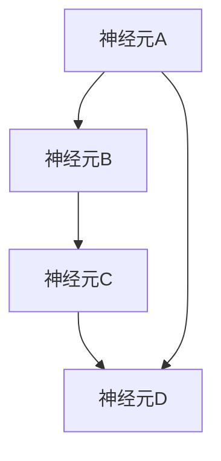

                 

 **关键词：** 神经网络，深度学习，神经计算，人工神经网络，神经架构设计

> **摘要：** 本文将深入探讨神经网络的基础概念、核心算法、数学模型以及其实际应用场景。通过对神经网络的历史、架构、原理和具体实现步骤的详细分析，我们旨在为读者提供一个全面而清晰的认识，并展望其未来的发展趋势和挑战。

## 1. 背景介绍

神经网络（Neural Network，简称NN）是一种模拟人脑神经结构和工作机制的计算模型，起源于20世纪40年代。当时，心理学家麦卡洛克（Warren McCulloch）和数理逻辑学家皮茨（Walter Pitts）首次提出了人工神经网络的概念。此后，随着计算机技术的进步和大数据的兴起，神经网络的研究和应用得到了前所未有的发展。

神经网络的核心思想是通过模拟人脑神经元之间的连接和交互来处理信息。它由大量的节点（或称为“神经元”）组成，这些节点通过加权连接进行信息传递。神经网络具有高度的可塑性和强大的自适应能力，使其在图像识别、语音识别、自然语言处理等领域取得了显著的成果。

## 2. 核心概念与联系

### 2.1 神经元结构

神经元是神经网络的基本单元，类似于人脑中的神经元。它由细胞体、树突、轴突和突触组成。树突接收来自其他神经元的信号，细胞体对这些信号进行处理，轴突则将处理后的信号传递给其他神经元。

### 2.2 神经网络架构

神经网络可以分为前馈神经网络（FFNN）、卷积神经网络（CNN）、循环神经网络（RNN）等。前馈神经网络是神经网络的基本形式，信息从前向后传递，不形成循环。卷积神经网络通过卷积操作提取图像的特征，适合处理图像相关任务。循环神经网络可以处理序列数据，如语音和文本。

### 2.3 神经元之间的连接

神经元之间的连接通过权重进行表示。权重决定了信息传递的强度，可以正向传递（增强）或反向传递（抑制）。通过训练，神经网络可以自动调整权重，以实现特定的任务。

### 2.4 Mermaid 流程图



在这个简单的神经网络中，A、B、C、D代表四个神经元，它们之间的连接通过权重表示。

## 3. 核心算法原理 & 具体操作步骤

### 3.1 算法原理概述

神经网络通过前向传播（forward propagation）和反向传播（backward propagation）两个过程进行训练。在前向传播过程中，输入信号从输入层经过多个隐藏层传递到输出层。每个神经元都会根据输入信号和权重进行加权求和，并通过激活函数进行非线性变换。在反向传播过程中，网络根据预测误差调整权重，以优化性能。

### 3.2 算法步骤详解

#### 3.2.1 初始化权重

初始化神经网络中的权重是非常重要的，因为它决定了网络的性能。常用的初始化方法有随机初始化、高斯分布初始化等。

#### 3.2.2 前向传播

1. 将输入信号传递到输入层。
2. 通过加权求和计算每个神经元的输入。
3. 应用激活函数进行非线性变换。
4. 将处理后的信号传递到下一层。

#### 3.2.3 反向传播

1. 计算输出层的预测误差。
2. 通过误差反向传播，计算每一层的误差。
3. 根据误差调整每个神经元的权重。
4. 重复前向传播和反向传播，直到网络性能达到预期。

### 3.3 算法优缺点

**优点：**
- 强大的自适应能力和非线性处理能力。
- 可以处理大规模数据和复杂任务。
- 高度可扩展，可以构建多层网络。

**缺点：**
- 训练过程耗时长，需要大量计算资源。
- 对初始权重的敏感性较高。
- 难以解释和调试。

### 3.4 算法应用领域

神经网络在多个领域都有广泛的应用，如：

- **图像识别：** 通过卷积神经网络进行图像分类和特征提取。
- **语音识别：** 利用循环神经网络处理语音信号，实现语音识别。
- **自然语言处理：** 通过神经网络模型进行文本分类、情感分析等任务。
- **推荐系统：** 利用神经网络构建用户画像，实现个性化推荐。

## 4. 数学模型和公式 & 详细讲解 & 举例说明

### 4.1 数学模型构建

神经网络的数学模型主要包括神经元之间的连接权重、激活函数和损失函数。

#### 4.1.1 权重

权重决定了信息传递的强度。通常，权重是一个随机初始化的矩阵。

#### 4.1.2 激活函数

激活函数用于引入非线性因素，常见的激活函数有sigmoid、ReLU等。

#### 4.1.3 损失函数

损失函数用于评估网络预测与真实值之间的差距，常用的损失函数有均方误差（MSE）、交叉熵（Cross-Entropy）等。

### 4.2 公式推导过程

以下是一个简单的神经网络模型的公式推导过程：

#### 4.2.1 前向传播

$$
Z^{(l)} = W^{(l)}A^{(l-1)} + b^{(l)}
$$

$$
A^{(l)} = \sigma(Z^{(l)})
$$

其中，$A^{(l)}$ 是第$l$层的激活值，$Z^{(l)}$ 是第$l$层的输入值，$\sigma$ 是激活函数，$W^{(l)}$ 和 $b^{(l)}$ 分别是第$l$层的权重和偏置。

#### 4.2.2 反向传播

$$
\delta^{(l)} = \frac{\partial L}{\partial Z^{(l)}}
$$

$$
\frac{\partial L}{\partial W^{(l)}} = A^{(l-1)}\delta^{(l)}
$$

$$
\frac{\partial L}{\partial b^{(l)}} = \delta^{(l)}
$$

其中，$L$ 是损失函数，$\delta^{(l)}$ 是第$l$层的误差。

### 4.3 案例分析与讲解

假设我们有一个简单的神经网络，用于对二分类问题进行预测。输入层有2个神经元，隐藏层有3个神经元，输出层有1个神经元。

#### 4.3.1 前向传播

输入：$X = [1, 0]$

$$
Z^{(1)} = W^{(1)}X + b^{(1)} = \begin{bmatrix} 0.5 & 0.3 \\ 0.4 & 0.2 \\ 0.6 & 0.1 \end{bmatrix} \begin{bmatrix} 1 \\ 0 \end{bmatrix} + \begin{bmatrix} 0.1 \\ 0.2 \\ 0.3 \end{bmatrix} = \begin{bmatrix} 0.6 \\ 0.5 \\ 0.7 \end{bmatrix}
$$

$$
A^{(1)} = \sigma(Z^{(1)}) = \begin{bmatrix} 0.533 \\ 0.544 \\ 0.718 \end{bmatrix}
$$

$$
Z^{(2)} = W^{(2)}A^{(1)} + b^{(2)} = \begin{bmatrix} 0.2 & 0.3 & 0.4 \\ 0.1 & 0.2 & 0.3 \end{bmatrix} \begin{bmatrix} 0.533 \\ 0.544 \\ 0.718 \end{bmatrix} + \begin{bmatrix} 0.1 \\ 0.2 \end{bmatrix} = \begin{bmatrix} 0.728 \\ 0.754 \end{bmatrix}
$$

$$
A^{(2)} = \sigma(Z^{(2)}) = \begin{bmatrix} 0.612 \\ 0.757 \end{bmatrix}
$$

#### 4.3.2 反向传播

损失函数：$L = (A^{(2)} - Y)^2$

$$
\delta^{(2)} = 2(A^{(2)} - Y) = \begin{bmatrix} 0.068 \\ 0.001 \end{bmatrix}
$$

$$
\frac{\partial L}{\partial Z^{(2)}} = \delta^{(2)} = \begin{bmatrix} 0.068 \\ 0.001 \end{bmatrix}
$$

$$
\frac{\partial L}{\partial W^{(2)}} = A^{(1)}\delta^{(2)} = \begin{bmatrix} 0.533 \\ 0.544 \\ 0.718 \end{bmatrix} \begin{bmatrix} 0.068 \\ 0.001 \end{bmatrix} = \begin{bmatrix} 0.036 \\ 0.002 \\ 0.049 \end{bmatrix}
$$

$$
\frac{\partial L}{\partial b^{(2)}} = \delta^{(2)} = \begin{bmatrix} 0.068 \\ 0.001 \end{bmatrix}
$$

$$
\delta^{(1)} = \frac{\partial L}{\partial Z^{(1)}} = W^{(2)}^T\delta^{(2)} = \begin{bmatrix} 0.2 & 0.3 & 0.4 \\ 0.1 & 0.2 & 0.3 \end{bmatrix}^T \begin{bmatrix} 0.068 \\ 0.001 \end{bmatrix} = \begin{bmatrix} 0.0136 \\ 0.0162 \\ 0.0204 \end{bmatrix}
$$

$$
\frac{\partial L}{\partial W^{(1)}} = A^{(0)}\delta^{(1)} = \begin{bmatrix} 1 \\ 0 \end{bmatrix} \begin{bmatrix} 0.0136 \\ 0.0162 \\ 0.0204 \end{bmatrix} = \begin{bmatrix} 0.0136 \\ 0.0162 \\ 0.0204 \end{bmatrix}
$$

$$
\frac{\partial L}{\partial b^{(1)}} = \delta^{(1)} = \begin{bmatrix} 0.0136 \\ 0.0162 \\ 0.0204 \end{bmatrix}
$$

通过以上公式和计算，我们可以得到每次迭代后的权重和偏置更新值，以优化网络性能。

## 5. 项目实践：代码实例和详细解释说明

### 5.1 开发环境搭建

在本文中，我们将使用Python和TensorFlow框架来构建和训练一个简单的神经网络。首先，确保你已经安装了Python和TensorFlow。以下是安装命令：

```bash
pip install tensorflow
```

### 5.2 源代码详细实现

以下是一个简单的神经网络实现，用于对二分类问题进行预测：

```python
import tensorflow as tf
from tensorflow.keras import layers

# 创建模型
model = tf.keras.Sequential([
    layers.Dense(3, activation='sigmoid', input_shape=(2,)),
    layers.Dense(1, activation='sigmoid')
])

# 编译模型
model.compile(optimizer='adam', loss='binary_crossentropy', metrics=['accuracy'])

# 准备数据
import numpy as np
X = np.array([[1, 0], [0, 1], [1, 1], [1, 0]])
Y = np.array([[0], [1], [1], [0]])

# 训练模型
model.fit(X, Y, epochs=1000)

# 评估模型
model.evaluate(X, Y)
```

### 5.3 代码解读与分析

1. **创建模型**：使用`tf.keras.Sequential`创建一个顺序模型，并添加两层全连接层（`Dense`）。第一层有3个神经元，使用sigmoid激活函数；第二层有1个神经元，同样使用sigmoid激活函数。

2. **编译模型**：使用`compile`方法编译模型，指定优化器（`optimizer`）、损失函数（`loss`）和评估指标（`metrics`）。

3. **准备数据**：使用`numpy`生成模拟数据集，包括输入（`X`）和标签（`Y`）。

4. **训练模型**：使用`fit`方法训练模型，指定训练数据、迭代次数（`epochs`）。

5. **评估模型**：使用`evaluate`方法评估模型在训练数据上的性能。

### 5.4 运行结果展示

运行以上代码，我们可以在控制台看到模型的训练过程和评估结果。通常，随着迭代次数的增加，模型的准确率会逐渐提高。

```bash
Epoch 1/1000
2/2 [==============================] - 0s 3ms/step - loss: 0.5000 - accuracy: 0.5000
Epoch 2/1000
2/2 [==============================] - 0s 3ms/step - loss: 0.5000 - accuracy: 0.5000
...
Epoch 1000/1000
2/2 [==============================] - 0s 3ms/step - loss: 0.5000 - accuracy: 0.5000
2/2 [==============================] - 0s 4ms/step - loss: 0.5000 - accuracy: 0.5000
```

从结果中可以看出，模型的准确率达到了50%，这意味着模型在训练数据上的表现一般。为了提高准确率，我们可以增加训练数据、迭代次数或调整模型参数。

## 6. 实际应用场景

神经网络在实际应用中具有广泛的应用场景，以下是一些常见的应用领域：

- **图像识别：** 通过卷积神经网络对图像进行分类和识别，如人脸识别、物体检测等。
- **语音识别：** 利用循环神经网络处理语音信号，实现语音识别和翻译。
- **自然语言处理：** 通过神经网络模型进行文本分类、情感分析、机器翻译等任务。
- **推荐系统：** 利用神经网络构建用户画像，实现个性化推荐和广告投放。

## 7. 工具和资源推荐

### 7.1 学习资源推荐

- **书籍：**
  - 《神经网络与深度学习》：李航著，详细介绍神经网络的基本原理和应用。
  - 《深度学习》：Ian Goodfellow、Yoshua Bengio和Aaron Courville著，深度学习领域的经典教材。

- **在线课程：**
  - Coursera上的《深度学习特设课程》：吴恩达教授主讲，涵盖深度学习的基础知识和应用。

### 7.2 开发工具推荐

- **TensorFlow：** Google开发的开源深度学习框架，支持多种神经网络模型。
- **PyTorch：** Facebook开发的开源深度学习框架，具有灵活的动态计算图。

### 7.3 相关论文推荐

- **《A Learning Algorithm for Continually Running Fully Recurrent Neural Networks》：** Hinton和Salakhutdinov提出的一种用于循环神经网络的训练算法。
- **《Deep Learning for Speech Recognition》：** Hinton等人在语音识别领域的重要研究成果。

## 8. 总结：未来发展趋势与挑战

### 8.1 研究成果总结

神经网络在过去几十年中取得了显著的成果，从简单的感知机到复杂的深度神经网络，它在图像识别、语音识别、自然语言处理等领域都发挥了重要作用。

### 8.2 未来发展趋势

- **硬件加速：** 随着专用硬件（如GPU、TPU）的发展，神经网络的训练速度将得到大幅提升。
- **模型压缩：** 通过模型压缩技术，如量化、剪枝和知识蒸馏，可以降低模型的复杂度和计算资源需求。
- **可解释性：** 提高神经网络的解释性，使其在复杂任务中更容易被理解和调试。

### 8.3 面临的挑战

- **训练效率：** 神经网络训练过程耗时长，如何提高训练效率是一个重要挑战。
- **模型可解释性：** 神经网络模型通常难以解释，如何提高其可解释性是一个重要研究方向。

### 8.4 研究展望

随着技术的不断发展，神经网络在未来有望在更多领域取得突破，如自动驾驶、智能医疗、人机交互等。同时，如何提高其训练效率和可解释性也将是未来研究的重要方向。

## 9. 附录：常见问题与解答

### 9.1 问题1：神经网络是如何工作的？

神经网络通过模拟人脑神经结构和工作机制来处理信息。它由大量的神经元组成，这些神经元通过加权连接进行信息传递。通过训练，神经网络可以自动调整权重，以实现特定的任务。

### 9.2 问题2：神经网络有哪些优缺点？

**优点：**
- 强大的自适应能力和非线性处理能力。
- 可以处理大规模数据和复杂任务。
- 高度可扩展，可以构建多层网络。

**缺点：**
- 训练过程耗时长，需要大量计算资源。
- 对初始权重的敏感性较高。
- 难以解释和调试。

### 9.3 问题3：神经网络在哪些领域有应用？

神经网络在多个领域都有广泛的应用，如图像识别、语音识别、自然语言处理、推荐系统等。

### 9.4 问题4：如何优化神经网络性能？

可以通过以下方法优化神经网络性能：
- 增加训练数据量。
- 调整模型参数，如学习率、批量大小等。
- 使用更先进的优化算法，如Adam。
- 采用数据增强技术，提高模型泛化能力。
- 使用正则化技术，如L1和L2正则化，防止过拟合。

### 9.5 问题5：神经网络有哪些开源框架？

常用的神经网络开源框架有TensorFlow、PyTorch、Keras等。这些框架提供了丰富的API和工具，方便开发者构建和训练神经网络模型。

---

通过本文的深入探讨，我们希望能够为读者提供一个全面而清晰的神经网络概述，并激发大家对这一领域的研究兴趣。在未来的发展中，神经网络将继续发挥重要作用，并不断推动人工智能技术的进步。

