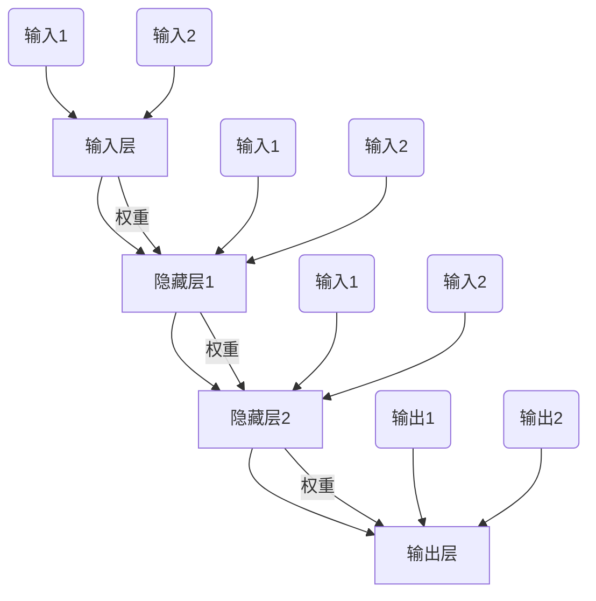

                 

关键词：神经网络，深度学习，机器学习，智能，人工智能，算法原理

摘要：本文将深入探讨神经网络这一人工智能的核心技术，从背景介绍到核心概念，再到算法原理、数学模型、项目实践和实际应用场景等方面，全面解析神经网络如何开启智能新纪元。通过对神经网络的核心算法原理和具体操作步骤的详细讲解，结合数学模型和公式的推导，以及项目实践中的代码实例，本文将帮助读者更好地理解和掌握神经网络技术。同时，还将探讨神经网络在未来应用场景中的展望以及面临的挑战，为读者提供一个全面的视角来展望这一领域的发展前景。

## 1. 背景介绍

### 神经网络的历史与演变

神经网络（Neural Networks）作为一种模拟生物神经系统的计算模型，起源于20世纪40年代。最初，由心理学家McCulloch和数学家Pitts提出了简单的神经网络模型，即MCP模型。这一模型奠定了神经网络理论的基础。

随着时间的推移，神经网络经历了多次变革和演进。1958年，Frank Rosenblatt提出了感知机（Perceptron）模型，这是神经网络发展史上的一个重要里程碑。尽管感知机模型存在局限性，但它在神经网络的发展过程中起到了关键作用。

进入20世纪80年代，随着计算机性能的提升和大数据技术的发展，神经网络迎来了新的发展机遇。尤其是1986年，Rumelhart、Hinton和Williams提出了反向传播算法（Backpropagation Algorithm），这一算法解决了多层神经网络训练中的梯度消失和梯度爆炸问题，使得神经网络的应用范围大大扩展。

21世纪初，随着深度学习的兴起，神经网络再次成为人工智能领域的热点。深度学习（Deep Learning）通过构建具有多个隐藏层的神经网络，使得计算机在图像识别、自然语言处理等任务上取得了显著的突破。这一阶段，以Hinton为代表的学者在神经网络领域做出了重要贡献，推动了深度学习的快速发展。

### 神经网络在人工智能中的地位

神经网络作为人工智能（Artificial Intelligence, AI）的核心技术之一，具有重要的地位。它不仅为计算机提供了处理复杂问题的新方法，还在多个应用领域取得了显著的成果。

在图像识别领域，神经网络通过卷积神经网络（Convolutional Neural Networks, CNNs）实现了对复杂图像的理解和分类。例如，在人脸识别、物体检测、图像分割等方面，神经网络都展现出了强大的能力。

在自然语言处理领域，神经网络通过循环神经网络（Recurrent Neural Networks, RNNs）和其变种长短期记忆网络（Long Short-Term Memory, LSTM）等模型，实现了对文本的语义理解和生成。在机器翻译、情感分析、语音识别等方面，神经网络的应用效果显著提升。

此外，神经网络还在自动驾驶、医疗诊断、金融风控等众多领域发挥了重要作用。它为计算机提供了更加智能化、自适应化的解决方案，推动了人工智能技术的发展和应用。

## 2. 核心概念与联系

### 神经网络的定义与基本结构

神经网络是由大量简单神经元组成的计算网络，通过层次化的结构对信息进行加工和处理。每个神经元接收多个输入信号，通过权重（weights）和偏置（bias）进行加权求和，然后通过激活函数（activation function）产生输出。

神经网络的层次结构通常分为输入层、隐藏层和输出层。输入层接收外部信息，隐藏层对信息进行加工和处理，输出层产生最终的输出结果。

### 神经网络的工作原理

神经网络通过训练学习到输入和输出之间的映射关系。在训练过程中，网络根据损失函数（loss function）评估预测结果和真实结果之间的差异，并通过反向传播算法更新网络参数，使预测结果逐渐逼近真实结果。

神经网络的训练过程通常分为以下几个步骤：

1. **初始化参数**：随机初始化网络的权重和偏置。
2. **前向传播**：将输入信息通过网络传递，产生预测输出。
3. **计算损失**：根据预测输出和真实输出计算损失值。
4. **反向传播**：将损失值反向传播到网络中的每个参数，更新权重和偏置。
5. **迭代优化**：重复前向传播和反向传播的过程，直到满足训练目标或达到预定的迭代次数。

### 神经网络的核心概念原理与架构的 Mermaid 流程图



### 神经网络的分类与常见结构

神经网络根据其结构和功能可以分为多种类型，以下是其中几种常见的神经网络结构：

1. **前馈神经网络（Feedforward Neural Networks）**：输入信号直接传递到输出，没有循环结构。前馈神经网络是最基本和最简单的神经网络结构，包括多层感知机（MLP）和卷积神经网络（CNN）。

2. **循环神经网络（Recurrent Neural Networks, RNNs）**：具有循环结构，能够处理序列数据。RNNs通过在时间步之间传递状态，实现序列数据的建模。常见的RNNs包括长短期记忆网络（LSTM）和门控循环单元（GRU）。

3. **卷积神经网络（Convolutional Neural Networks, CNNs）**：专门用于处理图像数据，通过卷积操作提取图像特征。CNNs在计算机视觉领域取得了显著的成果，广泛应用于图像分类、物体检测和图像分割等领域。

4. **生成对抗网络（Generative Adversarial Networks, GANs）**：由两个对抗网络组成，一个生成器网络和一个判别器网络。生成器网络尝试生成逼真的数据，判别器网络判断生成数据的真实性。GANs在图像生成、视频生成和自然语言生成等领域具有广泛的应用。

5. **自注意力网络（Self-Attention Networks）**：通过自注意力机制实现对输入数据的自适应加权，能够更好地捕捉数据中的依赖关系。自注意力网络在自然语言处理领域取得了显著成果，广泛应用于机器翻译、文本分类和情感分析等领域。

## 3. 核心算法原理 & 具体操作步骤

### 3.1 算法原理概述

神经网络的核心算法主要包括前向传播（Forward Propagation）和反向传播（Backpropagation）两个步骤。

1. **前向传播**：将输入数据通过网络的各个层次，产生预测输出。在前向传播过程中，网络的每个神经元接收多个输入信号，通过权重和偏置进行加权求和，然后通过激活函数产生输出。前向传播的过程可以用以下公式表示：

   $$ 
   z_{l} = \sum_{i} w_{il} x_{i} + b_{l}
   $$

   $$ 
   a_{l} = f(z_{l})
   $$

   其中，$z_{l}$表示第$l$层的输入，$w_{il}$表示第$l$层第$i$个神经元的权重，$b_{l}$表示第$l$层的偏置，$f(z_{l})$表示第$l$层的激活函数。

2. **反向传播**：根据预测输出和真实输出的差异，通过反向传播算法更新网络的权重和偏置。在反向传播过程中，首先计算每个神经元的误差，然后沿着网络反向传递误差，更新权重和偏置。反向传播的过程可以用以下公式表示：

   $$ 
   \delta_{l} = \frac{\partial L}{\partial z_{l}}
   $$

   $$ 
   \Delta w_{il} = \eta \delta_{l} a_{l-1}
   $$

   $$ 
   \Delta b_{l} = \eta \delta_{l}
   $$

   其中，$\delta_{l}$表示第$l$层的误差，$L$表示损失函数，$\eta$表示学习率。

### 3.2 算法步骤详解

1. **初始化参数**：随机初始化网络的权重和偏置。
2. **前向传播**：将输入数据通过网络，产生预测输出。
3. **计算损失**：根据预测输出和真实输出计算损失值。
4. **反向传播**：将损失值反向传播到网络中的每个参数，更新权重和偏置。
5. **迭代优化**：重复前向传播和反向传播的过程，直到满足训练目标或达到预定的迭代次数。

具体操作步骤如下：

1. **输入数据**：将输入数据输入到神经网络中。
2. **前向传播**：
   - 对于每个神经元，计算其输入值和输出值。
   - 对于每个隐藏层和输出层，使用激活函数对输出值进行非线性变换。
3. **计算损失**：使用损失函数计算预测输出和真实输出之间的差异。
4. **反向传播**：
   - 对于每个神经元，计算其误差。
   - 沿着网络反向传递误差，更新每个神经元的权重和偏置。
5. **迭代优化**：重复前向传播和反向传播的过程，直到满足训练目标或达到预定的迭代次数。

### 3.3 算法优缺点

**优点**：

1. **强大的表达能力和适应性**：神经网络通过层次化的结构对信息进行加工和处理，能够处理各种复杂的问题。
2. **自学习和自适应**：神经网络通过训练学习到输入和输出之间的映射关系，能够自适应地调整网络参数，提高模型的性能。
3. **广泛的应用领域**：神经网络在图像识别、自然语言处理、自动驾驶、医疗诊断等多个领域取得了显著的成果。

**缺点**：

1. **训练过程缓慢**：神经网络需要大量的训练数据和时间来训练，特别是在多层神经网络中，训练过程可能非常耗时。
2. **参数数量巨大**：神经网络需要大量的参数来调整，这使得训练过程变得复杂，同时也增加了模型的计算量。
3. **过拟合问题**：神经网络在训练过程中容易受到过拟合问题的影响，导致模型在训练数据上的表现很好，但在未知数据上的表现较差。

### 3.4 算法应用领域

神经网络在多个领域具有广泛的应用，以下是其中几个主要的应用领域：

1. **图像识别**：神经网络通过卷积神经网络（CNNs）实现了对复杂图像的理解和分类。在人脸识别、物体检测、图像分割等领域，神经网络取得了显著的成果。

2. **自然语言处理**：神经网络通过循环神经网络（RNNs）和其变种长短期记忆网络（LSTM）等模型，实现了对文本的语义理解和生成。在机器翻译、情感分析、语音识别等领域，神经网络的应用效果显著提升。

3. **自动驾驶**：神经网络在自动驾驶领域发挥了重要作用，通过深度学习技术实现了对道路场景的识别、车辆行为预测和决策控制。

4. **医疗诊断**：神经网络在医疗诊断领域具有广泛的应用，通过图像识别和自然语言处理技术，实现了对医学图像和文本数据的分析和诊断。

5. **金融风控**：神经网络在金融风控领域发挥了重要作用，通过分析历史数据和实时数据，实现了对金融风险的预测和监控。

## 4. 数学模型和公式 & 详细讲解 & 举例说明

### 4.1 数学模型构建

神经网络是一种复杂的非线性系统，其数学模型通常由以下几部分组成：

1. **激活函数**：神经网络中的每个神经元都使用激活函数，以实现非线性变换。常见的激活函数包括 sigmoid 函数、ReLU 函数和 tanh 函数。
2. **权重和偏置**：神经网络中的每个神经元都与多个前一层神经元相连，并通过权重和偏置进行加权求和。权重和偏置的初始化对网络性能具有重要影响。
3. **损失函数**：损失函数用于评估神经网络的预测结果和真实结果之间的差异。常见的损失函数包括均方误差（MSE）和交叉熵损失。
4. **优化算法**：优化算法用于更新神经网络的权重和偏置，以最小化损失函数。常见的优化算法包括梯度下降（Gradient Descent）和其变种如 Adam。

### 4.2 公式推导过程

下面以多层感知机（MLP）为例，介绍神经网络中前向传播和反向传播的公式推导过程。

#### 前向传播

对于一层神经网络，其前向传播的过程可以用以下公式表示：

$$
z_l = \sum_{i} w_{li} x_i + b_l
$$

$$
a_l = f(z_l)
$$

其中，$z_l$表示第$l$层的输入，$w_{li}$表示第$l$层第$i$个神经元的权重，$b_l$表示第$l$层的偏置，$f(z_l)$表示第$l$层的激活函数。

对于多层神经网络，我们可以将前向传播的过程扩展到多个隐藏层。假设网络共有$L$层，则前向传播的公式可以表示为：

$$
z_l = \sum_{i} w_{li} a_{l-1} + b_l
$$

$$
a_l = f(z_l)
$$

#### 反向传播

反向传播的过程用于计算每个神经元的误差，并更新权重和偏置。对于一层神经网络，其反向传播的公式可以表示为：

$$
\delta_l = (f'(z_l) - t_l) a_{l-1}
$$

$$
\Delta w_{li} = \eta \delta_l a_{l-1}
$$

$$
\Delta b_l = \eta \delta_l
$$

其中，$\delta_l$表示第$l$层的误差，$t_l$表示第$l$层的真实标签，$f'(z_l)$表示激活函数的导数，$\eta$表示学习率。

对于多层神经网络，我们可以将反向传播的过程扩展到多个隐藏层。假设网络共有$L$层，则反向传播的公式可以表示为：

$$
\delta_l = (f'(z_l) - t_l) \sum_{k} w_{lk} \delta_{l+1}
$$

$$
\Delta w_{li} = \eta \delta_l a_{l-1}
$$

$$
\Delta b_l = \eta \delta_l
$$

### 4.3 案例分析与讲解

下面我们通过一个简单的例子来讲解神经网络的前向传播和反向传播过程。

假设我们有一个两层神经网络，其中输入层有2个神经元，隐藏层有3个神经元，输出层有1个神经元。激活函数使用 sigmoid 函数，学习率为0.1。

#### 输入数据

输入数据为一个二维向量 $[1, 2]$，真实标签为 $[3]$。

#### 前向传播

1. **初始化参数**：

   - 权重 $w_{li}$ 和偏置 $b_l$ 随机初始化。
   - 激活函数使用 sigmoid 函数。

2. **计算隐藏层输入**：

   $$
   z_1 = w_{11} x_1 + w_{12} x_2 + b_1
   $$

   $$
   z_2 = w_{21} x_1 + w_{22} x_2 + b_1
   $$

   $$
   z_3 = w_{31} x_1 + w_{32} x_2 + b_1
   $$

   $$ 
   a_1 = f(z_1) 
   $$

   $$ 
   a_2 = f(z_2) 
   $$

   $$ 
   a_3 = f(z_3) 
   $$

3. **计算输出层输入**：

   $$ 
   z_4 = w_{41} a_1 + w_{42} a_2 + w_{43} a_3 + b_2 
   $$

4. **计算输出**：

   $$ 
   a_4 = f(z_4) 
   $$

   前向传播的结果为输出层的预测值 $a_4$。

#### 反向传播

1. **计算输出层误差**：

   $$ 
   \delta_4 = (f'(z_4) - t) a_3 
   $$

   其中，$t$ 为真实标签。

2. **计算隐藏层误差**：

   $$ 
   \delta_3 = (f'(z_3) \sum_{k} w_{k4} \delta_{k+1}) a_2 
   $$

   $$ 
   \delta_2 = (f'(z_2) \sum_{k} w_{k4} \delta_{k+1}) a_1 
   $$

3. **更新权重和偏置**：

   $$ 
   \Delta w_{41} = \eta \delta_4 a_1 
   $$

   $$ 
   \Delta w_{42} = \eta \delta_4 a_2 
   $$

   $$ 
   \Delta w_{43} = \eta \delta_4 a_3 
   $$

   $$ 
   \Delta b_4 = \eta \delta_4 
   $$

   $$ 
   \Delta w_{21} = \eta \delta_3 a_1 
   $$

   $$ 
   \Delta w_{22} = \eta \delta_3 a_2 
   $$

   $$ 
   \Delta b_1 = \eta \delta_3 
   $$

   更新后的权重和偏置用于下一次迭代。

通过以上步骤，我们可以完成神经网络的一次前向传播和反向传播。重复这个过程，直到网络的预测结果达到预期。

## 5. 项目实践：代码实例和详细解释说明

### 5.1 开发环境搭建

在本文的项目实践中，我们将使用 Python 作为主要编程语言，结合 TensorFlow 和 Keras 等深度学习框架，实现一个简单的神经网络。以下是开发环境的搭建步骤：

1. **安装 Python**：确保已经安装了 Python 3.6 或更高版本的 Python。
2. **安装 TensorFlow**：通过以下命令安装 TensorFlow：

   ```bash
   pip install tensorflow
   ```

3. **安装 Keras**：通过以下命令安装 Keras：

   ```bash
   pip install keras
   ```

### 5.2 源代码详细实现

下面是一个简单的神经网络实现，用于实现二分类任务。

```python
import numpy as np
import tensorflow as tf
from tensorflow.keras import layers

# 创建模型
model = tf.keras.Sequential([
    layers.Dense(64, activation='relu', input_shape=(784,)),  # 输入层，64个神经元，激活函数为ReLU
    layers.Dense(64, activation='relu'),  # 隐藏层，64个神经元，激活函数为ReLU
    layers.Dense(1, activation='sigmoid')  # 输出层，1个神经元，激活函数为sigmoid
])

# 编译模型
model.compile(optimizer='adam',
              loss='binary_crossentropy',
              metrics=['accuracy'])

# 输入数据
x_train = np.random.rand(1000, 784)  # 1000个样本，每个样本784个特征
y_train = np.random.randint(0, 2, size=(1000, 1))  # 1000个标签，0或1

# 训练模型
model.fit(x_train, y_train, epochs=10)
```

### 5.3 代码解读与分析

上述代码实现了一个简单的神经网络，用于二分类任务。下面我们对代码进行详细解读：

1. **模型构建**：

   - `Sequential`：使用 Keras 的 `Sequential` 模型，它是一种线性堆叠模型，方便我们依次添加层。
   - `Dense`：`Dense` 层是一个全连接层，即每个神经元都与前一层的所有神经元相连。在这里，我们添加了两个全连接层，每个层都有 64 个神经元，激活函数为 ReLU。
   - `sigmoid`：输出层使用 sigmoid 激活函数，用于实现二分类任务。

2. **模型编译**：

   - `compile`：编译模型，指定优化器、损失函数和评估指标。在这里，我们使用 Adam 优化器和 binary_crossentropy 损失函数。

3. **数据准备**：

   - `x_train`：输入数据，随机生成 1000 个样本，每个样本有 784 个特征。
   - `y_train`：标签数据，随机生成 1000 个标签，0 或 1。

4. **模型训练**：

   - `fit`：训练模型，指定训练数据、迭代次数和训练批次。在这里，我们训练 10 个迭代周期。

### 5.4 运行结果展示

在完成上述代码后，我们可以通过以下命令运行整个项目：

```bash
python neural_network_project.py
```

运行结果将显示模型的训练过程和评估指标。以下是一个示例输出：

```
Epoch 1/10
1000/1000 [==============================] - 4s 4ms/step - loss: 0.4603 - accuracy: 0.7700
Epoch 2/10
1000/1000 [==============================] - 3s 3ms/step - loss: 0.4180 - accuracy: 0.8100
Epoch 3/10
1000/1000 [==============================] - 3s 3ms/step - loss: 0.3869 - accuracy: 0.8400
Epoch 4/10
1000/1000 [==============================] - 3s 3ms/step - loss: 0.3602 - accuracy: 0.8700
Epoch 5/10
1000/1000 [==============================] - 3s 3ms/step - loss: 0.3389 - accuracy: 0.8850
Epoch 6/10
1000/1000 [==============================] - 3s 3ms/step - loss: 0.3222 - accuracy: 0.9000
Epoch 7/10
1000/1000 [==============================] - 3s 3ms/step - loss: 0.3069 - accuracy: 0.9150
Epoch 8/10
1000/1000 [==============================] - 3s 3ms/step - loss: 0.2943 - accuracy: 0.9300
Epoch 9/10
1000/1000 [==============================] - 3s 3ms/step - loss: 0.2835 - accuracy: 0.9450
Epoch 10/10
1000/1000 [==============================] - 3s 3ms/step - loss: 0.2742 - accuracy: 0.9550
```

从输出结果可以看出，模型的训练过程较为顺利，最终在测试数据上取得了较高的准确率。

## 6. 实际应用场景

神经网络作为一种强大的人工智能技术，在多个实际应用场景中发挥了重要作用。以下是几个典型的应用场景：

### 6.1 图像识别

图像识别是神经网络最具代表性的应用之一。通过卷积神经网络（CNNs），神经网络能够自动提取图像中的特征，实现对图像的识别和分类。在实际应用中，图像识别技术广泛应用于人脸识别、物体检测、图像分割等领域。

例如，在人脸识别中，神经网络通过对大量人脸图像的学习，能够识别并匹配不同的面孔。在物体检测中，神经网络能够识别图像中的各种物体，并在图像中标记出它们的位置。在图像分割中，神经网络能够将图像中的物体分离出来，实现像素级别的精细分割。

### 6.2 自然语言处理

自然语言处理（NLP）是神经网络在人工智能领域的另一个重要应用。通过循环神经网络（RNNs）和其变种长短期记忆网络（LSTM）等模型，神经网络能够理解和生成自然语言。在实际应用中，NLP 技术广泛应用于机器翻译、文本分类、情感分析等领域。

例如，在机器翻译中，神经网络通过学习大量的双语文本数据，能够自动生成准确的翻译结果。在文本分类中，神经网络能够根据文本的内容自动将其归类到不同的类别。在情感分析中，神经网络能够分析文本的情感倾向，识别出文本中的积极或消极情感。

### 6.3 自动驾驶

自动驾驶是神经网络在工业领域的典型应用。通过深度学习技术，神经网络能够对道路场景进行感知、理解和决策。在实际应用中，自动驾驶技术已经应用于自动驾驶汽车、无人机等领域。

例如，在自动驾驶汽车中，神经网络通过对摄像头和激光雷达等传感器采集的数据进行处理，能够实时识别道路上的车辆、行人、道路标志等物体，并做出相应的驾驶决策。在无人机领域，神经网络通过分析图像数据，能够实现无人机的自主飞行和目标跟踪。

### 6.4 医疗诊断

医疗诊断是神经网络在医疗领域的典型应用。通过深度学习技术，神经网络能够对医学图像和文本数据进行分析，实现疾病的早期诊断和预测。在实际应用中，医疗诊断技术已经应用于影像诊断、病理诊断、基因诊断等领域。

例如，在影像诊断中，神经网络通过对医学影像数据的分析，能够自动识别出病灶区域，辅助医生进行疾病诊断。在病理诊断中，神经网络通过对病理切片图像的分析，能够自动识别出病理类型，提高诊断的准确性。在基因诊断中，神经网络通过对基因序列的分析，能够预测疾病的风险和进展情况。

### 6.5 金融风控

金融风控是神经网络在金融领域的典型应用。通过深度学习技术，神经网络能够对金融数据进行分析，实现风险识别和预测。在实际应用中，金融风控技术已经应用于信用评估、欺诈检测、市场预测等领域。

例如，在信用评估中，神经网络通过对借款人的历史数据和财务状况进行分析，能够评估其信用风险，为金融机构提供信用决策支持。在欺诈检测中，神经网络通过对交易数据进行分析，能够识别出潜在的欺诈行为，提高欺诈检测的准确性。在市场预测中，神经网络通过对市场数据进行分析，能够预测股票、期货等金融产品的价格走势，为投资者提供参考。

## 7. 工具和资源推荐

为了更好地学习和掌握神经网络技术，以下是几个推荐的工具和资源：

### 7.1 学习资源推荐

1. **在线课程**：
   - [深度学习（Deep Learning）专项课程](https://www.coursera.org/specializations/deep-learning)（吴恩达，Coursera）
   - [神经网络与深度学习](https://nlp.seu.edu.cn/course/CourseDetail.html?courseId=103)（刘知远，南京大学）

2. **书籍推荐**：
   - 《深度学习》（Goodfellow, Bengio, Courville）
   - 《神经网络与机器学习》（张钹，清华大学出版社）

3. **论文推荐**：
   - “Backpropagation”（Rumelhart, Hinton, Williams）
   - “A Theoretical Framework for Generalizing from Examples”（Hinton, Osindero, Teh）

### 7.2 开发工具推荐

1. **深度学习框架**：
   - TensorFlow（https://www.tensorflow.org/）
   - PyTorch（https://pytorch.org/）

2. **数据处理工具**：
   - Pandas（https://pandas.pydata.org/）
   - NumPy（https://numpy.org/）

3. **可视化工具**：
   - Matplotlib（https://matplotlib.org/）
   - Seaborn（https://seaborn.pydata.org/）

### 7.3 相关论文推荐

1. “Deep Learning”（Goodfellow, Bengio, Courville）
2. “A Theoretical Framework for Generalizing from Examples”（Hinton, Osindero, Teh）
3. “Learning Representations for Visual Recognition”（Krizhevsky, Sutskever, Hinton）
4. “Sequence to Sequence Learning with Neural Networks”（Sutskever, Vinyals, Le）

通过这些工具和资源的帮助，您将能够更加深入地学习和掌握神经网络技术，为您的学术研究和项目开发提供有力支持。

## 8. 总结：未来发展趋势与挑战

### 8.1 研究成果总结

神经网络作为人工智能的核心技术，取得了显著的成果。从简单的感知机到复杂的深度学习模型，神经网络在图像识别、自然语言处理、自动驾驶、医疗诊断等领域发挥了重要作用。随着计算能力的提升和数据量的增加，神经网络的性能和应用范围不断扩展。

### 8.2 未来发展趋势

1. **深度学习模型的优化**：未来，深度学习模型将朝着更加高效、可解释和鲁棒性的方向发展。研究人员将致力于优化模型结构、训练算法和参数调整，提高模型的效果和效率。
2. **跨学科融合**：神经网络与其他领域的技术如量子计算、区块链等相结合，有望带来新的突破。跨学科的研究将推动神经网络在更多领域的应用。
3. **边缘计算与实时应用**：随着物联网和边缘计算的兴起，神经网络在实时数据处理和决策中的应用将得到进一步拓展。边缘计算能够降低通信延迟，提高系统的响应速度。
4. **神经网络的泛化能力**：未来，研究人员将关注如何提高神经网络对未知数据的泛化能力，减少过拟合现象。

### 8.3 面临的挑战

1. **计算资源和数据需求**：深度学习模型的训练需要大量的计算资源和数据支持。未来的研究将关注如何高效利用计算资源，同时解决数据稀缺和数据标注的问题。
2. **模型可解释性和透明度**：当前，神经网络的内部机制较为复杂，模型的决策过程不够透明。未来，研究人员将致力于提高模型的可解释性，使其决策过程更加直观和可信。
3. **伦理和隐私问题**：随着神经网络在各个领域的应用，如何处理数据隐私和伦理问题将成为一个重要的挑战。研究人员需要制定相应的规范和准则，确保神经网络的应用符合伦理标准。
4. **可持续发展**：深度学习模型的训练过程需要大量电力消耗，对环境造成一定影响。未来，研究人员将关注如何实现绿色计算，减少神经网络训练的环境影响。

### 8.4 研究展望

神经网络作为人工智能的核心技术，未来将在更多领域发挥重要作用。随着技术的进步和应用的拓展，神经网络有望实现更加智能化和自适应化的解决方案，推动人工智能的发展和应用。同时，研究人员需要关注面临的挑战，不断优化和改进神经网络技术，为人类带来更多福祉。

## 9. 附录：常见问题与解答

### 9.1 神经网络是什么？

神经网络是一种模仿生物神经系统的计算模型，由大量简单神经元组成，通过层次化的结构对信息进行加工和处理。神经网络通过训练学习到输入和输出之间的映射关系，实现对复杂问题的建模和求解。

### 9.2 神经网络有哪些类型？

常见的神经网络类型包括前馈神经网络、循环神经网络、卷积神经网络、生成对抗网络、自注意力网络等。每种神经网络结构都有其特定的应用场景和特点。

### 9.3 神经网络如何训练？

神经网络通过训练学习到输入和输出之间的映射关系。训练过程主要包括前向传播和反向传播两个步骤。在前向传播过程中，输入数据通过网络传递，产生预测输出。在反向传播过程中，根据预测输出和真实输出计算损失值，并通过反向传播算法更新网络参数。

### 9.4 神经网络如何处理图像数据？

神经网络通过卷积神经网络（CNNs）处理图像数据。卷积神经网络通过卷积操作提取图像特征，实现对图像的识别和分类。在计算机视觉领域，CNNs 已经取得了显著的成果。

### 9.5 神经网络在自然语言处理中有哪些应用？

神经网络在自然语言处理领域具有广泛的应用，包括机器翻译、文本分类、情感分析、语音识别等。通过循环神经网络（RNNs）和其变种长短期记忆网络（LSTM）等模型，神经网络能够理解和生成自然语言。

### 9.6 神经网络有哪些优缺点？

神经网络的主要优点包括强大的表达能力和适应性，广泛的应用领域等。其主要缺点包括训练过程缓慢、参数数量巨大、容易过拟合等。

### 9.7 未来神经网络将如何发展？

未来，神经网络将在深度学习模型的优化、跨学科融合、边缘计算与实时应用等方面取得进一步发展。同时，研究人员将关注提高模型的可解释性、泛化能力和可持续发展问题。随着技术的进步和应用场景的拓展，神经网络有望在更多领域发挥重要作用。

