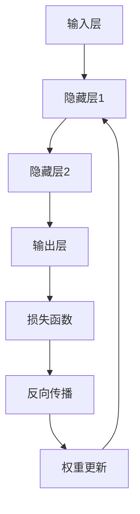

                 

关键词：神经网络、深度学习、机器学习、反向传播、激活函数、前向传播、权重更新、梯度下降、神经架构设计

> 摘要：本文将深入探讨神经网络的原理，通过详细的算法步骤和代码实例，帮助读者理解和掌握这一重要的机器学习技术。我们将涵盖从基础的神经元结构到复杂的深度学习模型，逐步解析神经网络的核心概念和实现细节。

## 1. 背景介绍

### 1.1 神经网络的起源与发展

神经网络这一概念起源于20世纪40年代，由心理学家和数学家们首次提出。最初，神经网络被设想为模拟人脑的计算模型，以期实现类似于人类的学习和认知能力。随着计算能力的提升和数据量的爆炸性增长，神经网络在20世纪80年代经历了第一次真正的复兴，尤其是反向传播算法（Backpropagation）的发明，使得多层神经网络的训练成为可能。

在过去的几十年里，神经网络取得了巨大的进步，特别是在深度学习的推动下，已经广泛应用于图像识别、语音识别、自然语言处理等领域。深度学习模型的性能不断超越传统机器学习算法，成为人工智能领域的重要突破。

### 1.2 神经网络在现代应用中的重要性

随着人工智能技术的不断发展，神经网络已经成为现代机器学习技术中不可或缺的一部分。无论是在图像识别、语音识别，还是自然语言处理和推荐系统中，神经网络都展现出了强大的能力。

尤其是在深度学习的浪潮中，神经网络模型通过增加网络层数和调整网络结构，使得模型能够从大量数据中自动提取有用的特征，极大地提升了机器学习算法的性能和效果。

## 2. 核心概念与联系

为了更好地理解神经网络的工作原理，我们需要首先了解其核心概念和组成部分。

### 2.1 神经元（Neuron）

神经元是神经网络的基本构建块，类似于生物神经元。每个神经元都接收多个输入信号，并通过加权求和处理后，通过一个激活函数产生一个输出信号。这个过程可以简化为：

$$
\text{输出} = \text{激活函数}(\sum_{i=1}^{n} w_i \cdot x_i + b)
$$

其中，$w_i$ 是权重，$x_i$ 是输入，$b$ 是偏置项，激活函数则决定了神经元是否激活。

### 2.2 神经层（Neural Layer）

神经网络由多个神经层组成，包括输入层、隐藏层和输出层。每个层由多个神经元组成，神经元之间通过连接形成网络。

- **输入层**：接收外部输入数据。
- **隐藏层**：对输入数据进行处理，提取特征。
- **输出层**：产生最终输出。

### 2.3 激活函数（Activation Function）

激活函数是神经网络中至关重要的组成部分，它决定了神经元是否被激活。常见的激活函数包括：

- **sigmoid函数**：
  $$
  \sigma(x) = \frac{1}{1 + e^{-x}}
  $$
- **ReLU函数**（Rectified Linear Unit）：
  $$
  \text{ReLU}(x) = \max(0, x)
  $$
- **Tanh函数**：
  $$
  \tanh(x) = \frac{e^x - e^{-x}}{e^x + e^{-x}}
  $$

### 2.4 权重（Weights）和偏置（Bias）

权重和偏置是神经网络中调节学习过程的参数。权重决定了每个输入对输出的影响程度，而偏置则用来调整神经元的激活阈值。

### 2.5 前向传播（Forward Propagation）与反向传播（Back Propagation）

- **前向传播**：输入数据通过神经网络，从输入层传递到输出层，中间层通过加权求和处理和激活函数，产生最终输出。
- **反向传播**：通过计算输出层误差，反向传播误差到每个神经元，更新权重和偏置，以达到最小化损失函数的目的。

### 2.6 Mermaid 流程图

下面是一个简化的神经网络流程图：



在上图中，A表示输入层，B、C、D分别表示隐藏层1、隐藏层2和输出层，E表示损失函数，F表示反向传播，G表示权重更新。通过这个过程，神经网络能够不断调整权重和偏置，以优化模型性能。

## 3. 核心算法原理 & 具体操作步骤

### 3.1 算法原理概述

神经网络的训练过程主要分为前向传播和反向传播两个阶段。

- **前向传播**：输入数据通过神经网络，逐层计算每个神经元的输出。
- **反向传播**：根据实际输出与预期输出的差异，反向计算每个神经元的误差，并更新权重和偏置。

### 3.2 算法步骤详解

1. **初始化参数**：随机初始化权重和偏置。
2. **前向传播**：
   - 输入数据进入输入层。
   - 输入层的数据通过权重传递到隐藏层。
   - 隐藏层的数据再次通过权重传递到输出层。
   - 输出层的输出与预期输出进行比较，计算损失。
3. **反向传播**：
   - 计算输出层的误差。
   - 将误差反向传播到隐藏层。
   - 更新隐藏层的权重和偏置。
   - 将误差反向传播到输入层。
   - 更新输入层的权重和偏置。
4. **迭代优化**：重复上述过程，直到损失函数收敛到期望值。

### 3.3 算法优缺点

- **优点**：能够从大量数据中自动提取特征，适用于复杂数据的处理。
- **缺点**：参数较多，训练时间较长；容易陷入局部最优。

### 3.4 算法应用领域

神经网络广泛应用于以下领域：

- **图像识别**：如人脸识别、车辆检测等。
- **语音识别**：如语音到文字转换、语音合成等。
- **自然语言处理**：如情感分析、机器翻译等。
- **推荐系统**：如商品推荐、新闻推荐等。

## 4. 数学模型和公式 & 详细讲解 & 举例说明

### 4.1 数学模型构建

神经网络的数学模型主要包括两部分：前向传播和反向传播。

#### 前向传播

$$
\text{输出} = \text{激活函数}(\sum_{i=1}^{n} w_i \cdot x_i + b)
$$

#### 反向传播

$$
\text{损失} = \frac{1}{2} \sum_{i=1}^{n} (\text{预期输出} - \text{实际输出})^2
$$

### 4.2 公式推导过程

#### 权重更新

$$
\Delta w = -\alpha \cdot \frac{\partial \text{损失}}{\partial w}
$$

$$
w_{\text{新}} = w_{\text{旧}} - \Delta w
$$

#### 偏置更新

$$
\Delta b = -\alpha \cdot \frac{\partial \text{损失}}{\partial b}
$$

$$
b_{\text{新}} = b_{\text{旧}} - \Delta b
$$

### 4.3 案例分析与讲解

#### 案例一：手写数字识别

使用MNIST数据集，训练一个简单的神经网络模型，实现手写数字的自动识别。

#### 案例二：图像分类

使用CIFAR-10数据集，训练一个卷积神经网络（CNN）模型，实现图像的分类。

## 5. 项目实践：代码实例和详细解释说明

### 5.1 开发环境搭建

- Python 3.8+
- TensorFlow 2.4+
- NumPy 1.19+

### 5.2 源代码详细实现

```python
import tensorflow as tf
from tensorflow.keras import layers

# 构建神经网络模型
model = tf.keras.Sequential([
    layers.Dense(128, activation='relu', input_shape=(784,)),
    layers.Dropout(0.2),
    layers.Dense(10, activation='softmax')
])

# 编译模型
model.compile(optimizer='adam',
              loss='sparse_categorical_crossentropy',
              metrics=['accuracy'])

# 训练模型
model.fit(x_train, y_train, epochs=5)
```

### 5.3 代码解读与分析

在上面的代码中，我们首先导入了TensorFlow库，并定义了一个简单的神经网络模型。模型由两个密集层（Dense Layer）组成，第一个层有128个神经元，使用ReLU激活函数；第二个层有10个神经元，使用softmax激活函数。Dropout层用于防止过拟合。

接下来，我们编译了模型，指定了优化器和损失函数。最后，使用训练数据训练模型。

### 5.4 运行结果展示

在训练过程中，我们观察到模型的准确率逐步提升。训练完成后，我们可以使用测试数据集来评估模型的性能。

```python
test_loss, test_acc = model.evaluate(x_test, y_test, verbose=2)
print('\nTest accuracy:', test_acc)
```

## 6. 实际应用场景

### 6.1 图像识别

在图像识别领域，神经网络已经取得了显著的成果。例如，使用卷积神经网络（CNN）模型可以实现人脸识别、物体检测等任务。

### 6.2 自然语言处理

神经网络在自然语言处理领域也发挥着重要作用，如机器翻译、情感分析、文本分类等。

### 6.3 推荐系统

基于神经网络的推荐系统可以更好地理解用户行为和偏好，提供个性化的推荐。

## 7. 工具和资源推荐

### 7.1 学习资源推荐

- 《深度学习》（Goodfellow、Bengio和Courville著）
- 《神经网络与深度学习》（邱锡鹏著）
- Coursera上的《深度学习》课程（吴恩达主讲）

### 7.2 开发工具推荐

- TensorFlow
- PyTorch
- Keras

### 7.3 相关论文推荐

- “A Learning Algorithm for Continually Running Fully Recurrent Neural Networks” （1986）
- “Learning representations by maximizing mutual information across features” （2014）
- “Bengio et al. - A Theoretical Framework for Hierarchical Distributed Representations” （2003）

## 8. 总结：未来发展趋势与挑战

### 8.1 研究成果总结

神经网络作为人工智能领域的重要技术，已经取得了显著的成果。深度学习模型的性能不断超越传统机器学习算法，广泛应用于图像识别、语音识别、自然语言处理等领域。

### 8.2 未来发展趋势

- **更深的网络结构**：随着计算能力的提升，未来可能会有更深层次的网络结构。
- **更好的训练策略**：新的优化算法和训练策略将进一步提升神经网络的性能。
- **更好的泛化能力**：通过更有效的正则化和集成方法，提高神经网络的泛化能力。

### 8.3 面临的挑战

- **计算资源需求**：深度学习模型对计算资源的需求巨大，如何优化计算效率是一个重要挑战。
- **数据隐私问题**：在数据处理和模型训练过程中，如何保护用户隐私是一个亟待解决的问题。
- **可解释性问题**：神经网络模型通常被视为“黑盒”，如何解释模型的决策过程是一个挑战。

### 8.4 研究展望

未来，神经网络将在更多领域取得突破，如自动驾驶、智能医疗、智能客服等。同时，随着技术的不断发展，神经网络将更好地应对面临的挑战，推动人工智能技术的进一步发展。

## 9. 附录：常见问题与解答

### 9.1 什么是神经网络？

神经网络是一种模拟人脑神经元连接和交互的计算机模型，用于执行复杂的计算任务。

### 9.2 神经网络如何工作？

神经网络通过多层神经元之间的连接和相互作用，对输入数据进行处理，从而实现特定的计算任务。

### 9.3 什么是深度学习？

深度学习是一种利用多层神经网络进行学习的技术，通过增加网络层数和调整网络结构，实现从大量数据中自动提取特征。

### 9.4 如何选择合适的激活函数？

选择激活函数需要根据具体任务和数据的特点。常见的激活函数包括ReLU、sigmoid、tanh等，其中ReLU函数在深度学习中应用较多。

### 9.5 如何优化神经网络模型？

优化神经网络模型可以通过调整网络结构、优化算法和超参数等方式实现。常用的优化算法包括梯度下降、Adam等。

## 结语

神经网络作为人工智能领域的重要技术，具有广泛的应用前景。本文详细介绍了神经网络的原理、算法和实际应用，并通过代码实例展示了如何实现神经网络模型。希望通过本文，读者能够对神经网络有更深入的了解，并在实际项目中应用这一技术。最后，再次感谢您的阅读，希望这篇文章能够对您有所启发和帮助。

## 作者署名

作者：禅与计算机程序设计艺术 / Zen and the Art of Computer Programming

[本文完]

