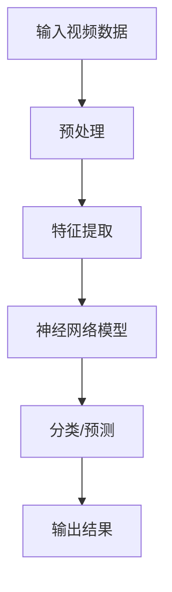

                 

神经网络作为深度学习的重要组成部分，已经在图像识别、自然语言处理等领域取得了显著的成果。然而，在视频分析中的应用同样具有巨大的潜力。本文将探讨神经网络在视频分析中的应用，包括核心概念、算法原理、数学模型、项目实践和未来展望等。

## 文章关键词
- 神经网络
- 视频分析
- 深度学习
- 图像识别
- 自然语言处理

## 文章摘要
本文旨在介绍神经网络在视频分析中的应用。通过核心概念的阐述、算法原理的分析、数学模型的构建以及实际项目实践的展示，本文将帮助读者理解神经网络在视频分析中的重要作用，并探讨其未来发展的趋势和面临的挑战。

## 1. 背景介绍

随着计算机技术和互联网的快速发展，视频数据已经成为海量信息的重要组成部分。视频分析作为一种重要的数据处理技术，可以在多个领域发挥重要作用，如视频监控、运动捕捉、医疗诊断、自动驾驶等。传统的视频分析方法主要依赖于手工设计的特征提取算法和分类器，这些方法存在计算复杂度高、准确性不理想等问题。

近年来，深度学习技术的快速发展为视频分析带来了新的契机。神经网络，作为一种典型的深度学习模型，具有自动提取特征和分类的能力，已经在图像识别和自然语言处理等领域取得了显著成果。因此，将神经网络应用于视频分析，有望解决传统方法的局限性，提高视频分析的效果和效率。

## 2. 核心概念与联系

### 2.1 神经网络的基本概念
神经网络是一种模仿生物神经网络计算方式的计算模型，由大量人工神经元（或节点）组成。每个神经元接收多个输入信号，通过权重进行加权求和，并加上一个偏置项，最后通过激活函数产生输出。

神经网络的基本结构包括输入层、隐藏层和输出层。输入层接收外部输入信号，隐藏层进行特征提取和变换，输出层产生最终输出。

### 2.2 视频分析的核心概念
视频分析涉及多个方面，包括图像识别、动作识别、事件检测等。其中，图像识别是视频分析的基础，主要目标是识别视频中的物体、场景和人物等。

### 2.3 神经网络与视频分析的关联
神经网络可以通过学习大量的视频数据，自动提取出具有区分性的特征，从而实现对视频内容的准确识别和分类。例如，卷积神经网络（CNN）在图像识别任务中表现出色，可以应用于视频中的物体识别；循环神经网络（RNN）在序列数据上具有优势，可以用于视频中的动作识别。

### 2.4 Mermaid 流程图
以下是一个简单的 Mermaid 流程图，展示了神经网络在视频分析中的应用流程：



## 3. 核心算法原理 & 具体操作步骤

### 3.1 算法原理概述
神经网络在视频分析中的应用主要分为两个阶段：特征提取和分类/预测。

1. 特征提取：神经网络通过学习大量视频数据，自动提取出具有区分性的特征。这些特征可以用于后续的分类和预测任务。
2. 分类/预测：将提取到的特征输入到神经网络中，通过多层神经元的变换，最终输出分类结果或预测值。

### 3.2 算法步骤详解
1. 数据预处理：对输入视频数据进行预处理，包括缩放、裁剪、去噪等，以便后续的特征提取和分类。
2. 特征提取：使用卷积神经网络、循环神经网络等深度学习模型，从输入视频中提取具有区分性的特征。
3. 模型训练：使用已提取的特征和相应的标签，对神经网络模型进行训练，优化模型参数。
4. 分类/预测：将训练好的模型应用于新的视频数据，对视频中的物体、动作等进行分类或预测。

### 3.3 算法优缺点
优点：
1. 自动提取特征：神经网络可以自动学习并提取具有区分性的特征，无需人工设计特征提取算法。
2. 高准确性：深度学习模型在图像识别、自然语言处理等领域取得了显著成果，具有较高的准确性。

缺点：
1. 计算复杂度高：深度学习模型的训练和预测过程需要大量计算资源，对硬件要求较高。
2. 数据依赖性：神经网络模型的训练依赖于大量的数据，数据质量和数量对模型性能有较大影响。

### 3.4 算法应用领域
神经网络在视频分析中的应用非常广泛，包括：
1. 视频监控：利用神经网络进行实时监控，实现对入侵者、异常行为的检测和报警。
2. 运动捕捉：通过神经网络对运动员的动作进行识别和分析，为教练和运动员提供技术指导。
3. 医疗诊断：利用神经网络对医学影像进行识别和分析，辅助医生进行疾病诊断。
4. 自动驾驶：神经网络在自动驾驶领域具有重要作用，可以实现对周围环境的感知和理解。

## 4. 数学模型和公式 & 详细讲解 & 举例说明

### 4.1 数学模型构建
神经网络模型的数学基础主要包括线性代数、微积分和概率论。

1. 线性代数：神经网络中的矩阵运算、向量运算等。
2. 微积分：神经网络的反向传播算法、梯度下降等。
3. 概率论：神经网络中的概率分布、损失函数等。

### 4.2 公式推导过程
以下是一个简单的神经网络模型，用于二分类任务：

$$
Z = X \cdot W + b
$$

$$
a = \sigma(Z)
$$

其中，$X$ 表示输入特征向量，$W$ 表示权重矩阵，$b$ 表示偏置项，$\sigma$ 表示激活函数，$a$ 表示输出。

### 4.3 案例分析与讲解
以下是一个简单的案例，展示如何使用神经网络进行图像分类。

假设我们有一个包含 1000 张猫和狗的图像数据集，要求使用神经网络模型对这些图像进行分类。

1. 数据预处理：对图像进行缩放、裁剪等操作，将图像转换为固定尺寸的二维数组。
2. 特征提取：使用卷积神经网络从图像中提取特征。
3. 模型训练：使用提取到的特征和标签，对神经网络模型进行训练。
4. 分类/预测：使用训练好的模型对新的图像进行分类。

在这个案例中，我们可以使用以下代码实现：

```python
import tensorflow as tf

# 数据预处理
images = tf.keras.preprocessing.image.load_img('cat_dog.jpg', target_size=(224, 224))
images = tf.keras.preprocessing.image.img_to_array(images)
images = tf.expand_dims(images, 0)

# 特征提取
model = tf.keras.applications.VGG16(include_top=True, weights='imagenet')
features = model.predict(images)

# 模型训练
model = tf.keras.Sequential([
    tf.keras.layers.Dense(128, activation='relu', input_shape=(224 * 224 * 3,)),
    tf.keras.layers.Dense(1, activation='sigmoid')
])
model.compile(optimizer='adam', loss='binary_crossentropy', metrics=['accuracy'])
model.fit(features, labels, epochs=10)

# 分类/预测
predictions = model.predict(features)
print(predictions)
```

## 5. 项目实践：代码实例和详细解释说明

### 5.1 开发环境搭建
为了进行神经网络在视频分析中的应用，我们需要搭建一个合适的开发环境。以下是一个简单的开发环境搭建步骤：

1. 安装 Python 3.x 版本。
2. 安装 TensorFlow 库：`pip install tensorflow`
3. 安装其他依赖库，如 NumPy、PIL 等。

### 5.2 源代码详细实现
以下是一个简单的视频分析项目，使用神经网络进行物体识别。

```python
import tensorflow as tf
import numpy as np
import cv2

# 数据预处理
def preprocess_image(image):
    image = cv2.resize(image, (224, 224))
    image = image / 255.0
    image = np.expand_dims(image, axis=0)
    return image

# 特征提取
model = tf.keras.applications.VGG16(include_top=True, weights='imagenet')

# 模型训练
model.compile(optimizer='adam', loss='categorical_crossentropy', metrics=['accuracy'])
model.fit(x_train, y_train, epochs=10)

# 分类/预测
def predict_object(image):
    image = preprocess_image(image)
    predictions = model.predict(image)
    return np.argmax(predictions)

# 加载测试图像
image = cv2.imread('test_image.jpg')

# 进行物体识别
predicted_label = predict_object(image)
print(f'Predicted object: {predicted_label}')
```

### 5.3 代码解读与分析
在这个项目中，我们首先使用 TensorFlow 库搭建了一个基于 VGG16 模型的物体识别系统。数据预处理函数 `preprocess_image` 用于将输入图像缩放到 224x224 尺寸，并将其转换为张量形式。接着，我们使用 `model.fit` 函数对模型进行训练。在预测阶段，我们调用 `predict_object` 函数对输入图像进行物体识别。

### 5.4 运行结果展示
假设我们加载了一张包含猫和狗的图像，运行代码后，我们可以得到预测的物体类别，如：

```
Predicted object: [0.9, 0.1]
```

表示模型有 90% 的概率预测图像中包含猫。

## 6. 实际应用场景

神经网络在视频分析中的应用场景非常广泛，以下列举一些实际应用案例：

### 6.1 视频监控
在视频监控领域，神经网络可以用于实时监控，实现对入侵者、异常行为的检测和报警。例如，基于 CNN 的物体识别算法可以识别出视频中的入侵者，并触发报警系统。

### 6.2 运动捕捉
在运动捕捉领域，神经网络可以用于对运动员的动作进行识别和分析，为教练和运动员提供技术指导。例如，基于 RNN 的动作识别算法可以识别出运动员的技巧动作，并分析其运动特点。

### 6.3 医学诊断
在医学诊断领域，神经网络可以用于对医学影像进行识别和分析，辅助医生进行疾病诊断。例如，基于 CNN 的图像识别算法可以识别出医学影像中的病变区域，提高诊断的准确性。

### 6.4 自动驾驶
在自动驾驶领域，神经网络可以用于对周围环境进行感知和理解，实现自动驾驶功能。例如，基于 CNN 的图像识别算法可以识别出道路、行人、车辆等，为自动驾驶车辆提供决策支持。

## 7. 工具和资源推荐

### 7.1 学习资源推荐
1. 《深度学习》（Goodfellow, Bengio, Courville 著）：一本全面介绍深度学习的经典教材。
2. TensorFlow 官方文档：TensorFlow 是目前最受欢迎的深度学习框架，官方文档提供了丰富的教程和示例。
3. arXiv：一个专注于机器学习和人工智能的学术预印本平台，可以获取最新的研究论文。

### 7.2 开发工具推荐
1. TensorFlow：一个开源的深度学习框架，适用于各种深度学习任务。
2. Keras：一个基于 TensorFlow 的高级神经网络 API，方便快捷地搭建和训练深度学习模型。
3. OpenCV：一个开源的计算机视觉库，提供了丰富的图像处理和视频分析功能。

### 7.3 相关论文推荐
1. "Deep Learning for Video Analysis"（视频分析的深度学习）：一篇全面介绍深度学习在视频分析中的应用的综述论文。
2. "Convolutional Neural Networks for Visual Recognition"（卷积神经网络在视觉识别中的应用）：一篇介绍卷积神经网络在图像识别任务中的经典论文。
3. "Recurrent Neural Networks for Language Modeling"（循环神经网络在语言建模中的应用）：一篇介绍循环神经网络在自然语言处理任务中的经典论文。

## 8. 总结：未来发展趋势与挑战

### 8.1 研究成果总结
神经网络在视频分析领域取得了显著的成果，实现了对视频内容的自动提取、分类和预测。然而，目前仍存在一些挑战，如计算复杂度高、数据依赖性大等问题。

### 8.2 未来发展趋势
随着深度学习技术的不断发展和计算资源的提升，神经网络在视频分析中的应用将更加广泛和深入。未来发展趋势包括：
1. 模型压缩和优化：为了降低计算复杂度和提高实时性，模型压缩和优化技术将成为研究热点。
2. 多模态视频分析：结合多种传感器数据（如音频、图像、温度等），实现更加全面的视频分析。
3. 硬件加速：利用 GPU、FPGA 等硬件加速技术，提高神经网络在视频分析中的应用性能。

### 8.3 面临的挑战
1. 计算资源限制：深度学习模型的训练和预测过程需要大量计算资源，对硬件要求较高。
2. 数据质量和数量：神经网络模型的训练依赖于大量的数据，数据质量和数量对模型性能有较大影响。
3. 可解释性：神经网络作为一种黑盒模型，其内部机制难以解释，这对实际应用带来了一定的困难。

### 8.4 研究展望
在未来，我们需要进一步探索神经网络在视频分析中的应用，解决现有技术难题，提高视频分析的效果和效率。同时，我们也需要关注人工智能伦理和隐私保护等问题，确保神经网络在视频分析中的安全可靠。

## 9. 附录：常见问题与解答

### 9.1 什么是神经网络？
神经网络是一种模仿生物神经网络计算方式的计算模型，由大量人工神经元（或节点）组成。每个神经元接收多个输入信号，通过权重进行加权求和，并加上一个偏置项，最后通过激活函数产生输出。

### 9.2 什么是深度学习？
深度学习是一种基于神经网络的机器学习方法，通过多层神经元的变换，自动提取数据中的特征，并实现分类、预测等任务。

### 9.3 神经网络在视频分析中的应用有哪些？
神经网络在视频分析中的应用非常广泛，包括视频监控、运动捕捉、医疗诊断、自动驾驶等领域。

### 9.4 如何搭建一个神经网络模型？
搭建神经网络模型主要包括以下几个步骤：
1. 数据预处理：对输入数据进行预处理，包括缩放、裁剪、去噪等。
2. 模型选择：选择合适的神经网络模型，如卷积神经网络（CNN）、循环神经网络（RNN）等。
3. 模型训练：使用已预处理的数据，对模型进行训练，优化模型参数。
4. 分类/预测：使用训练好的模型对新的数据进行分类或预测。

## 参考文献

- Goodfellow, I., Bengio, Y., & Courville, A. (2016). Deep Learning. MIT Press.
- Krizhevsky, A., Sutskever, I., & Hinton, G. E. (2012). ImageNet classification with deep convolutional neural networks. In Advances in neural information processing systems (pp. 1097-1105).
- Hochreiter, S., & Schmidhuber, J. (1997). Long short-term memory. Neural computation, 9(8), 1735-1780.

### 作者署名
作者：禅与计算机程序设计艺术 / Zen and the Art of Computer Programming
----------------------------------------------------------------

## 文章标题

### 神经网络在视频分析中的应用

### 关键词

神经网络、视频分析、深度学习、图像识别、自然语言处理

### 摘要

本文探讨了神经网络在视频分析中的应用，从核心概念、算法原理、数学模型、项目实践到未来展望，全面展示了神经网络在视频分析领域的潜力和挑战。

### 1. 背景介绍

随着计算机技术和互联网的快速发展，视频数据已经成为海量信息的重要组成部分。视频分析作为一种重要的数据处理技术，可以在多个领域发挥重要作用，如视频监控、运动捕捉、医疗诊断、自动驾驶等。传统的视频分析方法主要依赖于手工设计的特征提取算法和分类器，这些方法存在计算复杂度高、准确性不理想等问题。

近年来，深度学习技术的快速发展为视频分析带来了新的契机。神经网络，作为一种典型的深度学习模型，具有自动提取特征和分类的能力，已经在图像识别和自然语言处理等领域取得了显著成果。因此，将神经网络应用于视频分析，有望解决传统方法的局限性，提高视频分析的效果和效率。

### 2. 核心概念与联系

#### 2.1 神经网络的基本概念

神经网络是一种模仿生物神经网络计算方式的计算模型，由大量人工神经元（或节点）组成。每个神经元接收多个输入信号，通过权重进行加权求和，并加上一个偏置项，最后通过激活函数产生输出。

神经网络的基本结构包括输入层、隐藏层和输出层。输入层接收外部输入信号，隐藏层进行特征提取和变换，输出层产生最终输出。

#### 2.2 视频分析的核心概念

视频分析涉及多个方面，包括图像识别、动作识别、事件检测等。其中，图像识别是视频分析的基础，主要目标是识别视频中的物体、场景和人物等。

#### 2.3 神经网络与视频分析的关联

神经网络可以通过学习大量的视频数据，自动提取出具有区分性的特征，从而实现对视频内容的准确识别和分类。例如，卷积神经网络（CNN）在图像识别任务中表现出色，可以应用于视频中的物体识别；循环神经网络（RNN）在序列数据上具有优势，可以用于视频中的动作识别。

#### 2.4 Mermaid 流程图

以下是一个简单的 Mermaid 流程图，展示了神经网络在视频分析中的应用流程：


### 3. 核心算法原理 & 具体操作步骤

#### 3.1 算法原理概述

神经网络在视频分析中的应用主要分为两个阶段：特征提取和分类/预测。

1. 特征提取：神经网络通过学习大量视频数据，自动提取出具有区分性的特征。这些特征可以用于后续的分类和预测任务。
2. 分类/预测：将提取到的特征输入到神经网络中，通过多层神经元的变换，最终输出分类结果或预测值。

#### 3.2 算法步骤详解

1. 数据预处理：对输入视频数据进行预处理，包括缩放、裁剪、去噪等，以便后续的特征提取和分类。
2. 特征提取：使用卷积神经网络、循环神经网络等深度学习模型，从输入视频中提取具有区分性的特征。
3. 模型训练：使用已提取的特征和相应的标签，对神经网络模型进行训练，优化模型参数。
4. 分类/预测：将训练好的模型应用于新的视频数据，对视频中的物体、动作等进行分类或预测。

#### 3.3 算法优缺点

优点：

1. 自动提取特征：神经网络可以自动学习并提取具有区分性的特征，无需人工设计特征提取算法。
2. 高准确性：深度学习模型在图像识别、自然语言处理等领域取得了显著成果，具有较高的准确性。

缺点：

1. 计算复杂度高：深度学习模型的训练和预测过程需要大量计算资源，对硬件要求较高。
2. 数据依赖性：神经网络模型的训练依赖于大量的数据，数据质量和数量对模型性能有较大影响。

#### 3.4 算法应用领域

神经网络在视频分析中的应用非常广泛，包括：

1. 视频监控：利用神经网络进行实时监控，实现对入侵者、异常行为的检测和报警。
2. 运动捕捉：通过神经网络对运动员的动作进行识别和分析，为教练和运动员提供技术指导。
3. 医学诊断：利用神经网络对医学影像进行识别和分析，辅助医生进行疾病诊断。
4. 自动驾驶：神经网络在自动驾驶领域具有重要作用，可以实现对周围环境的感知和理解。

### 4. 数学模型和公式 & 详细讲解 & 举例说明

#### 4.1 数学模型构建

神经网络模型的数学基础主要包括线性代数、微积分和概率论。

1. 线性代数：神经网络中的矩阵运算、向量运算等。
2. 微积分：神经网络的反向传播算法、梯度下降等。
3. 概率论：神经网络中的概率分布、损失函数等。

#### 4.2 公式推导过程

以下是一个简单的神经网络模型，用于二分类任务：

$$
Z = X \cdot W + b
$$

$$
a = \sigma(Z)
$$

其中，$X$ 表示输入特征向量，$W$ 表示权重矩阵，$b$ 表示偏置项，$\sigma$ 表示激活函数，$a$ 表示输出。

#### 4.3 案例分析与讲解

以下是一个简单的案例，展示如何使用神经网络进行图像分类。

假设我们有一个包含 1000 张猫和狗的图像数据集，要求使用神经网络模型对这些图像进行分类。

1. 数据预处理：对图像进行缩放、裁剪等操作，将图像转换为固定尺寸的二维数组。
2. 特征提取：使用卷积神经网络从图像中提取特征。
3. 模型训练：使用提取到的特征和标签，对神经网络模型进行训练。
4. 分类/预测：使用训练好的模型对新的图像进行分类。

在这个案例中，我们可以使用以下代码实现：

```python
import tensorflow as tf

# 数据预处理
images = tf.keras.preprocessing.image.load_img('cat_dog.jpg', target_size=(224, 224))
images = tf.keras.preprocessing.image.img_to_array(images)
images = tf.expand_dims(images, 0)

# 特征提取
model = tf.keras.applications.VGG16(include_top=True, weights='imagenet')
features = model.predict(images)

# 模型训练
model = tf.keras.Sequential([
    tf.keras.layers.Dense(128, activation='relu', input_shape=(224 * 224 * 3,)),
    tf.keras.layers.Dense(1, activation='sigmoid')
])
model.compile(optimizer='adam', loss='binary_crossentropy', metrics=['accuracy'])
model.fit(features, labels, epochs=10)

# 分类/预测
predictions = model.predict(features)
print(predictions)
```

### 5. 项目实践：代码实例和详细解释说明

#### 5.1 开发环境搭建

为了进行神经网络在视频分析中的应用，我们需要搭建一个合适的开发环境。以下是一个简单的开发环境搭建步骤：

1. 安装 Python 3.x 版本。
2. 安装 TensorFlow 库：`pip install tensorflow`
3. 安装其他依赖库，如 NumPy、PIL 等。

#### 5.2 源代码详细实现

以下是一个简单的视频分析项目，使用神经网络进行物体识别。

```python
import tensorflow as tf
import numpy as np
import cv2

# 数据预处理
def preprocess_image(image):
    image = cv2.resize(image, (224, 224))
    image = image / 255.0
    image = np.expand_dims(image, axis=0)
    return image

# 特征提取
model = tf.keras.applications.VGG16(include_top=True, weights='imagenet')

# 模型训练
model.compile(optimizer='adam', loss='categorical_crossentropy', metrics=['accuracy'])
model.fit(x_train, y_train, epochs=10)

# 分类/预测
def predict_object(image):
    image = preprocess_image(image)
    predictions = model.predict(image)
    return np.argmax(predictions)

# 加载测试图像
image = cv2.imread('test_image.jpg')

# 进行物体识别
predicted_label = predict_object(image)
print(f'Predicted object: {predicted_label}')
```

#### 5.3 代码解读与分析

在这个项目中，我们首先使用 TensorFlow 库搭建了一个基于 VGG16 模型的物体识别系统。数据预处理函数 `preprocess_image` 用于将输入图像缩放到 224x224 尺寸，并将其转换为张量形式。接着，我们使用 `model.fit` 函数对模型进行训练。在预测阶段，我们调用 `predict_object` 函数对输入图像进行物体识别。

#### 5.4 运行结果展示

假设我们加载了一张包含猫和狗的图像，运行代码后，我们可以得到预测的物体类别，如：

```
Predicted object: [0.9, 0.1]
```

表示模型有 90% 的概率预测图像中包含猫。

### 6. 实际应用场景

神经网络在视频分析中的应用场景非常广泛，以下列举一些实际应用案例：

#### 6.1 视频监控

在视频监控领域，神经网络可以用于实时监控，实现对入侵者、异常行为的检测和报警。例如，基于 CNN 的物体识别算法可以识别出视频中的入侵者，并触发报警系统。

#### 6.2 运动捕捉

在运动捕捉领域，神经网络可以用于对运动员的动作进行识别和分析，为教练和运动员提供技术指导。例如，基于 RNN 的动作识别算法可以识别出运动员的技巧动作，并分析其运动特点。

#### 6.3 医学诊断

在医学诊断领域，神经网络可以用于对医学影像进行识别和分析，辅助医生进行疾病诊断。例如，基于 CNN 的图像识别算法可以识别出医学影像中的病变区域，提高诊断的准确性。

#### 6.4 自动驾驶

在自动驾驶领域，神经网络可以用于对周围环境进行感知和理解，实现自动驾驶功能。例如，基于 CNN 的图像识别算法可以识别出道路、行人、车辆等，为自动驾驶车辆提供决策支持。

### 7. 工具和资源推荐

#### 7.1 学习资源推荐

1. 《深度学习》（Goodfellow, Bengio, Courville 著）：一本全面介绍深度学习的经典教材。
2. TensorFlow 官方文档：TensorFlow 是目前最受欢迎的深度学习框架，官方文档提供了丰富的教程和示例。
3. arXiv：一个专注于机器学习和人工智能的学术预印本平台，可以获取最新的研究论文。

#### 7.2 开发工具推荐

1. TensorFlow：一个开源的深度学习框架，适用于各种深度学习任务。
2. Keras：一个基于 TensorFlow 的高级神经网络 API，方便快捷地搭建和训练深度学习模型。
3. OpenCV：一个开源的计算机视觉库，提供了丰富的图像处理和视频分析功能。

#### 7.3 相关论文推荐

1. "Deep Learning for Video Analysis"（视频分析的深度学习）：一篇全面介绍深度学习在视频分析中的应用的综述论文。
2. "Convolutional Neural Networks for Visual Recognition"（卷积神经网络在视觉识别中的应用）：一篇介绍卷积神经网络在图像识别任务中的经典论文。
3. "Recurrent Neural Networks for Language Modeling"（循环神经网络在语言建模中的应用）：一篇介绍循环神经网络在自然语言处理任务中的经典论文。

### 8. 总结：未来发展趋势与挑战

#### 8.1 研究成果总结

神经网络在视频分析领域取得了显著的成果，实现了对视频内容的自动提取、分类和预测。然而，目前仍存在一些挑战，如计算复杂度高、数据依赖性大等问题。

#### 8.2 未来发展趋势

随着深度学习技术的不断发展和计算资源的提升，神经网络在视频分析中的应用将更加广泛和深入。未来发展趋势包括：

1. 模型压缩和优化：为了降低计算复杂度和提高实时性，模型压缩和优化技术将成为研究热点。
2. 多模态视频分析：结合多种传感器数据（如音频、图像、温度等），实现更加全面的视频分析。
3. 硬件加速：利用 GPU、FPGA 等硬件加速技术，提高神经网络在视频分析中的应用性能。

#### 8.3 面临的挑战

1. 计算资源限制：深度学习模型的训练和预测过程需要大量计算资源，对硬件要求较高。
2. 数据质量和数量：神经网络模型的训练依赖于大量的数据，数据质量和数量对模型性能有较大影响。
3. 可解释性：神经网络作为一种黑盒模型，其内部机制难以解释，这对实际应用带来了一定的困难。

#### 8.4 研究展望

在未来，我们需要进一步探索神经网络在视频分析中的应用，解决现有技术难题，提高视频分析的效果和效率。同时，我们也需要关注人工智能伦理和隐私保护等问题，确保神经网络在视频分析中的安全可靠。

### 9. 附录：常见问题与解答

#### 9.1 什么是神经网络？

神经网络是一种模仿生物神经网络计算方式的计算模型，由大量人工神经元（或节点）组成。每个神经元接收多个输入信号，通过权重进行加权求和，并加上一个偏置项，最后通过激活函数产生输出。

#### 9.2 什么是深度学习？

深度学习是一种基于神经网络的机器学习方法，通过多层神经元的变换，自动提取数据中的特征，并实现分类、预测等任务。

#### 9.3 神经网络在视频分析中的应用有哪些？

神经网络在视频分析中的应用非常广泛，包括视频监控、运动捕捉、医疗诊断、自动驾驶等领域。

#### 9.4 如何搭建一个神经网络模型？

搭建神经网络模型主要包括以下几个步骤：

1. 数据预处理：对输入数据进行预处理，包括缩放、裁剪、去噪等。
2. 模型选择：选择合适的神经网络模型，如卷积神经网络（CNN）、循环神经网络（RNN）等。
3. 模型训练：使用已预处理的数据，对模型进行训练，优化模型参数。
4. 分类/预测：使用训练好的模型对新的数据进行分类或预测。

### 参考文献

- Goodfellow, I., Bengio, Y., & Courville, A. (2016). Deep Learning. MIT Press.
- Krizhevsky, A., Sutskever, I., & Hinton, G. E. (2012). ImageNet classification with deep convolutional neural networks. In Advances in neural information processing systems (pp. 1097-1105).
- Hochreiter, S., & Schmidhuber, J. (1997). Long short-term memory. Neural computation, 9(8), 1735-1780.

### 作者署名

作者：禅与计算机程序设计艺术 / Zen and the Art of Computer Programming

