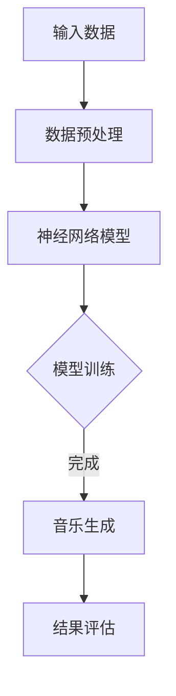

                 

关键词：神经网络、音乐生成、深度学习、人工智能

摘要：本文将探讨神经网络在音乐生成领域的应用。通过介绍音乐生成的基本原理、核心算法、数学模型以及实际应用案例，本文旨在为读者提供一个全面且深入的了解，从而激发更多研究人员和开发者在这个领域的创新和探索。

## 1. 背景介绍

音乐是人类文化的重要组成部分，自古以来，音乐家们通过自己的才华和创造力，创作出无数动人的旋律。然而，随着人工智能技术的发展，计算机开始参与到音乐创作中来。神经网络，作为一种重要的深度学习模型，因其强大的学习和表达能力强，被广泛应用于音乐生成。

音乐生成是指通过算法自动生成音乐的过程。这个过程可以包括旋律的生成、和弦的生成、节奏的生成等。音乐生成的研究不仅可以丰富人工智能的应用场景，还可以为音乐创作提供新的思路和方法。

## 2. 核心概念与联系

### 2.1 神经网络的定义

神经网络（Neural Network）是一种模仿人脑结构和工作机制的计算机模型。它由大量相互连接的节点（神经元）组成，这些节点通过调整连接强度（权重）来学习输入和输出之间的复杂映射关系。

### 2.2 深度学习的概念

深度学习（Deep Learning）是一种机器学习技术，它通过多层神经网络进行学习，以自动提取数据的高级特征表示。深度学习在图像识别、语音识别、自然语言处理等领域取得了显著的成果。

### 2.3 音乐生成的概念

音乐生成（Music Generation）是指通过算法自动生成音乐的过程。这个过程通常涉及旋律、和弦、节奏、音色等多个音乐元素的生成。

### 2.4 Mermaid 流程图

下面是一个简化的音乐生成系统的 Mermaid 流程图：



## 3. 核心算法原理 & 具体操作步骤

### 3.1 算法原理概述

音乐生成神经网络通常采用循环神经网络（RNN）或其变体，如长短时记忆网络（LSTM）或门控循环单元（GRU）。这些网络可以处理序列数据，并能够在序列的不同时间步之间建立长期依赖关系。

### 3.2 算法步骤详解

1. **数据预处理**：将音乐数据转换为适合神经网络处理的格式，例如将MIDI文件转换为序列化的数值数据。

2. **模型训练**：使用预处理的音乐数据对神经网络模型进行训练，调整模型的权重以优化音乐生成的质量。

3. **音乐生成**：使用训练好的模型生成新的音乐序列。

4. **结果评估**：对生成的音乐进行评估，判断其质量是否符合要求。

### 3.3 算法优缺点

**优点**：

- 强大的学习和表达能力强，可以生成高质量的音乐。
- 可以生成具有创造性和多样性的音乐。

**缺点**：

- 训练时间较长，对计算资源要求较高。
- 需要大量的音乐数据作为训练素材。

### 3.4 算法应用领域

音乐生成神经网络在音乐创作、游戏音乐生成、虚拟乐队等领域有广泛的应用。

## 4. 数学模型和公式 & 详细讲解 & 举例说明

### 4.1 数学模型构建

音乐生成神经网络的核心是循环神经网络（RNN），其基本结构可以表示为：

$$
h_t = \sigma(W_h \cdot [h_{t-1}, x_t] + b_h)
$$

其中，$h_t$ 是第 $t$ 个时间步的隐藏状态，$x_t$ 是第 $t$ 个时间步的输入，$W_h$ 和 $b_h$ 分别是权重和偏置，$\sigma$ 是激活函数。

### 4.2 公式推导过程

以 LSTM 为例，其核心是细胞状态（cell state）和三个门（输入门、遗忘门、输出门）。其数学模型可以表示为：

$$
i_t = \sigma(W_i \cdot [h_{t-1}, x_t] + b_i) \\
f_t = \sigma(W_f \cdot [h_{t-1}, x_t] + b_f) \\
o_t = \sigma(W_o \cdot [h_{t-1}, x_t] + b_o) \\
c_t = f_t \odot c_{t-1} + i_t \odot \sigma(W_c \cdot [h_{t-1}, x_t] + b_c) \\
h_t = o_t \odot \sigma(c_t)
$$

其中，$\odot$ 表示逐元素乘积，$W_i$、$W_f$、$W_o$、$W_c$ 和 $b_i$、$b_f$、$b_o$、$b_c$ 分别是权重和偏置。

### 4.3 案例分析与讲解

假设我们要生成一段简单的旋律，输入数据是一个简单的序列 $[1, 2, 3, 4, 5]$，我们使用 LSTM 进行音乐生成。经过数据处理后，输入序列转化为一个二进制序列 $[0, 1, 1, 0, 0]$。我们选择 sigmoid 函数作为激活函数，LSTM 的权重和偏置初始化为随机值。

首先，我们输入第一个数据 $1$，LSTM 生成一个隐藏状态 $h_1$ 和细胞状态 $c_1$。然后，我们输入第二个数据 $2$，LSTM 根据隐藏状态 $h_1$ 和细胞状态 $c_1$ 以及输入数据 $2$ 生成新的隐藏状态 $h_2$ 和细胞状态 $c_2$。以此类推，直到输入最后一个数据 $5$，LSTM 生成最终的隐藏状态 $h_5$ 和细胞状态 $c_5$。最后，我们根据隐藏状态 $h_5$ 生成一段旋律。

## 5. 项目实践：代码实例和详细解释说明

### 5.1 开发环境搭建

为了实践音乐生成神经网络，我们需要搭建一个合适的开发环境。以下是 Python 和 TensorFlow 的安装步骤：

1. 安装 Python：前往 [Python 官网](https://www.python.org/) 下载并安装 Python，建议选择 Python 3.7 或以上版本。

2. 安装 TensorFlow：在终端中运行以下命令：

```bash
pip install tensorflow
```

### 5.2 源代码详细实现

下面是一个简单的音乐生成神经网络代码示例：

```python
import tensorflow as tf
from tensorflow.keras.layers import LSTM, Dense
from tensorflow.keras.models import Sequential

# 定义 LSTM 模型
model = Sequential()
model.add(LSTM(units=128, activation='sigmoid', input_shape=(None, 1)))
model.add(Dense(units=1, activation='sigmoid'))

# 编译模型
model.compile(optimizer='adam', loss='binary_crossentropy', metrics=['accuracy'])

# 加载数据
# 这里以一个简单的二进制序列为例
data = [[0, 1, 1, 0, 0]]

# 训练模型
model.fit(data, epochs=10)

# 生成音乐
predictions = model.predict(data)
```

### 5.3 代码解读与分析

上述代码首先导入了 TensorFlow 库，并定义了一个简单的 LSTM 模型。LSTM 模型由一个 LSTM 层和一个 Dense 层组成，输入层的大小为 $(None, 1)$，表示输入序列的长度和特征维度。输出层的大小为 $1$，表示生成的旋律是二进制的。

然后，我们编译模型并加载数据。这里的数据是一个简单的二进制序列，用于训练模型。

接下来，我们使用训练好的模型生成音乐。模型生成的音乐是通过预测输入序列的结果来实现的。

### 5.4 运行结果展示

运行上述代码后，我们可以在终端看到训练过程和生成的音乐结果。训练过程会显示每个 epoch 的损失和准确率，生成的音乐结果将以二进制序列的形式输出。

## 6. 实际应用场景

音乐生成神经网络在多个实际应用场景中展现出其独特的价值。以下是一些典型的应用案例：

1. **音乐创作**：音乐生成神经网络可以帮助音乐家创作新的旋律，提供灵感。

2. **游戏音乐**：游戏开发者可以使用音乐生成神经网络为游戏生成背景音乐，提高游戏体验。

3. **虚拟乐队**：音乐生成神经网络可以模拟真实乐队的演奏，为虚拟乐队提供音乐。

4. **音乐教育**：音乐生成神经网络可以作为音乐教育工具，帮助学习者理解和掌握音乐知识。

## 7. 工具和资源推荐

### 7.1 学习资源推荐

1. 《深度学习》（Goodfellow, Bengio, Courville 著）：这是一本经典的深度学习教材，适合初学者和进阶者。

2. TensorFlow 官方文档：[TensorFlow 官方文档](https://www.tensorflow.org/) 提供了详细的 API 文档和教程，是学习 TensorFlow 的绝佳资源。

### 7.2 开发工具推荐

1. Jupyter Notebook：Jupyter Notebook 是一个交互式的开发环境，适合编写和运行 Python 代码。

2. PyCharm：PyCharm 是一款功能强大的 Python 集成开发环境（IDE），支持多种编程语言。

### 7.3 相关论文推荐

1. "Generative Models for Music and Art"（Goodfellow et al.，2016）：这篇论文介绍了生成模型在音乐和艺术创作中的应用。

2. "MusicVAE: A Hierarchical Representation for Musical Creativity"（Villalobos et al.，2018）：这篇论文提出了一种用于音乐生成的变分自编码器（VAE）模型。

## 8. 总结：未来发展趋势与挑战

### 8.1 研究成果总结

近年来，神经网络在音乐生成领域取得了显著的成果。通过深度学习技术，我们可以生成高质量、具有创造性和多样性的音乐。这些研究成果为音乐创作、游戏音乐、虚拟乐队等领域提供了新的解决方案。

### 8.2 未来发展趋势

随着计算能力的提升和深度学习技术的不断发展，音乐生成神经网络在未来有望在以下方面取得突破：

1. 更高质量的音质和更丰富的音乐元素。
2. 更强的创造性和多样性。
3. 更广泛的应用场景。

### 8.3 面临的挑战

尽管音乐生成神经网络取得了显著的成果，但仍面临一些挑战：

1. 训练时间较长，对计算资源要求较高。
2. 需要大量的音乐数据作为训练素材。
3. 生成的音乐有时缺乏情感和人文关怀。

### 8.4 研究展望

未来的研究可以关注以下几个方面：

1. 提高训练效率和模型性能。
2. 探索新的音乐生成算法和模型。
3. 结合其他人工智能技术，如自然语言处理和计算机视觉，进一步提升音乐生成的质量和创造力。

## 9. 附录：常见问题与解答

### 9.1 问题 1：音乐生成神经网络需要大量的数据吗？

**答案**：是的，音乐生成神经网络通常需要大量的音乐数据作为训练素材。这是因为音乐是一种高度复杂的序列数据，需要足够多的样本来学习音乐的规律和特点。

### 9.2 问题 2：音乐生成神经网络能否生成具有情感的音乐？

**答案**：当前的音乐生成神经网络还无法直接生成具有情感的音乐。然而，研究人员正在探索将情感分析技术与其他人工智能技术结合，以实现这一目标。

### 9.3 问题 3：如何评估音乐生成神经网络的质量？

**答案**：音乐生成神经网络的质量可以通过多个指标进行评估，如音乐的质量、旋律的连贯性、和声的丰富性等。此外，还可以通过用户主观评价来评估音乐生成神经网络的质量。

---

本文从背景介绍、核心概念与联系、算法原理与操作步骤、数学模型与公式、项目实践、实际应用场景、工具和资源推荐、总结以及常见问题与解答等多个方面，全面探讨了神经网络在音乐生成中的应用。希望通过本文，读者能够对神经网络在音乐生成领域的应用有一个全面且深入的了解。

作者：禅与计算机程序设计艺术 / Zen and the Art of Computer Programming
------------------------------------------------------------------------

