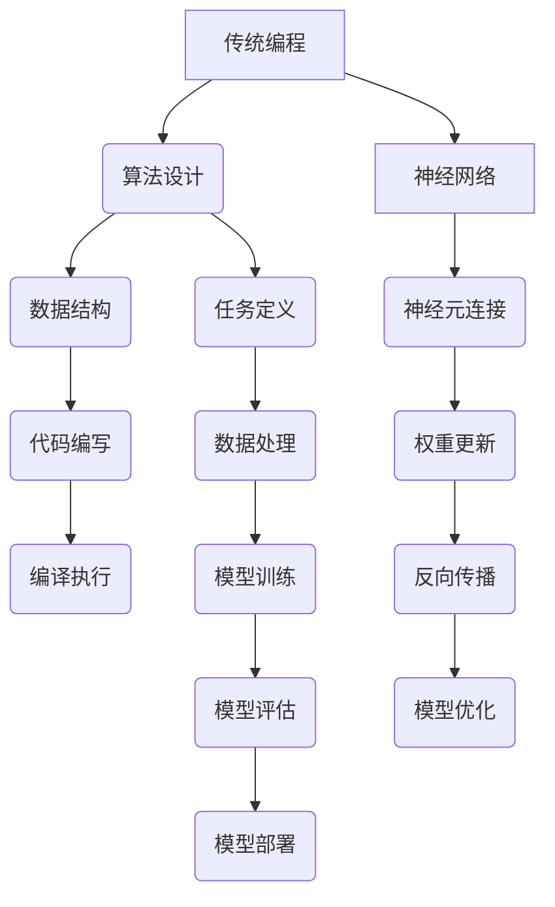

                 

### 1. 背景介绍

在计算机科学和人工智能领域，编程一直以来都是核心的技术手段。传统编程依赖于明确的指令和算法，通过逻辑和步骤来解决问题。然而，随着神经网络技术的发展，人们开始探讨神经网络是否有可能取代传统编程，成为未来解决问题的主要方式。本文旨在探讨这一议题，分析神经网络与传统编程的异同，以及神经网络是否具备取代传统编程的潜力。

首先，我们需要了解神经网络的基本概念。神经网络是一种模拟人脑工作原理的计算模型，由大量相互连接的节点（或称为神经元）组成。这些节点通过传递信息来进行计算和决策。神经网络的核心在于其自我学习和适应能力，这使得它们在处理复杂问题时具有显著优势。

相比之下，传统编程则依赖于明确的逻辑和步骤。程序员需要手动编写代码，定义数据结构和算法，然后通过计算机执行这些指令来解决问题。虽然传统编程具有高度的灵活性和可控性，但在处理复杂、非线性问题时，其效率和效果往往有限。

随着深度学习技术的发展，神经网络在图像识别、自然语言处理、游戏开发等领域取得了显著成果。许多传统编程任务，如语音识别和机器翻译，已经被神经网络所取代。这引发了人们对于神经网络是否有可能完全取代传统编程的思考。

然而，我们也需要认识到，神经网络并非无所不能。尽管其在某些领域表现出色，但在其他领域，如系统级编程、硬件设计等，传统编程仍然具有不可替代的作用。因此，本文将深入探讨神经网络与传统编程的异同，分析神经网络是否具备取代传统编程的潜力。

本文将分为以下几个部分进行讨论：

1. 背景介绍：介绍神经网络和传统编程的基本概念。
2. 核心概念与联系：通过 Mermaid 流程图展示神经网络与编程之间的联系。
3. 核心算法原理 & 具体操作步骤：分析神经网络的核心算法原理及与传统编程的操作步骤。
4. 数学模型和公式 & 详细讲解 & 举例说明：讲解神经网络中的数学模型和公式，并通过案例进行分析。
5. 项目实践：通过代码实例展示神经网络的应用。
6. 实际应用场景：分析神经网络在不同领域的应用场景。
7. 未来应用展望：探讨神经网络在未来的发展趋势和应用前景。
8. 工具和资源推荐：推荐相关学习资源和开发工具。
9. 总结：总结研究成果，探讨未来发展趋势和挑战。

通过本文的讨论，我们希望能够为读者提供一个全面、深入的分析，帮助大家更好地理解神经网络与传统编程的关系，以及神经网络在未来可能的发展方向。

### 2. 核心概念与联系

为了更好地理解神经网络与传统编程之间的关系，我们可以通过一个 Mermaid 流程图来展示它们的核心概念和联系。以下是一个简化的流程图，描述了神经网络的基本架构和编程中的关键步骤。



在这个流程图中，我们可以看到神经网络与传统编程之间的一些关键联系：

1. **算法设计**：无论是神经网络还是传统编程，首先都需要对问题进行算法设计。在神经网络中，这通常涉及定义网络的层次结构、激活函数等；而在传统编程中，则需要设计适合问题的算法和数据结构。

2. **数据处理**：在神经网络中，数据处理是一个非常重要的环节。这包括数据的预处理、归一化、分割等步骤。传统编程也需要对输入数据进行处理，如数据清洗、格式转换等。

3. **模型训练与优化**：神经网络通过不断调整神经元之间的连接权重来学习数据特征。这个过程称为模型训练。传统编程中的模型优化可能涉及算法的改进、数据结构的调整等。

4. **模型评估与部署**：神经网络训练完成后，需要评估其性能，并根据评估结果进行进一步优化。传统编程中的模型评估可能涉及性能测试、错误率分析等。评估完成后，神经网络模型可以部署到实际应用场景中，传统编程的代码也通常需要部署到生产环境中。

通过这个 Mermaid 流程图，我们可以看到神经网络与传统编程之间的异同。虽然两者的目标都是解决问题，但在具体实现和操作过程中，它们有着不同的方法和侧重点。接下来，我们将进一步分析神经网络的核心算法原理和与传统编程的操作步骤，以更深入地探讨这个问题。

### 3. 核心算法原理 & 具体操作步骤

在深入探讨神经网络与传统编程的关系之前，我们需要首先理解神经网络的核心算法原理以及其具体操作步骤。这一部分将分为以下几个子部分进行详细讲解：

#### 3.1 算法原理概述

神经网络（Neural Network）的核心思想是模仿人脑的工作机制，通过大量神经元之间的连接和相互作用来实现复杂的计算任务。这些神经元通常被组织成多个层次，包括输入层、隐藏层和输出层。

1. **神经元与激活函数**：神经元是神经网络的基本单元，每个神经元接收来自前一层神经元的输入信号，并通过一个非线性激活函数（如Sigmoid、ReLU等）产生输出。激活函数的作用是引入非线性，使神经网络能够处理更复杂的任务。

2. **权重与偏置**：神经元之间的连接由权重（weights）表示，这些权重决定了输入信号的重要性。此外，每个神经元还有一个偏置（bias），用于调整输出。

3. **前向传播与反向传播**：神经网络通过前向传播来计算输出，通过反向传播来更新权重和偏置，以最小化损失函数。前向传播是从输入层开始，将信号逐层传递到输出层。反向传播则是从输出层开始，计算每个神经元的误差，并反向传播这些误差以更新权重和偏置。

4. **多层感知器（MLP）**：多层感知器是神经网络的一种简单形式，由输入层、一个或多个隐藏层和输出层组成。MLP可以用于分类、回归等多种任务。

#### 3.2 算法步骤详解

1. **初始化**：首先需要初始化神经网络的权重和偏置。通常，权重和偏置被初始化为较小的随机值。

2. **前向传播**：
   - 输入信号从输入层开始，经过隐藏层逐层传递，最终到达输出层。
   - 在每个神经元，计算输入信号与对应权重的乘积，并加上偏置，然后通过激活函数得到输出。

3. **计算损失**：
   - 前向传播完成后，通过比较输出结果与实际结果，计算损失函数（如均方误差、交叉熵等）。
   - 损失函数用于衡量模型预测结果与实际结果之间的差距。

4. **反向传播**：
   - 从输出层开始，计算每个神经元的误差（误差 = 实际结果 - 预测结果）。
   - 利用误差计算梯度，并反向传播这些梯度到隐藏层和输入层。
   - 根据梯度更新权重和偏置，以最小化损失函数。

5. **迭代优化**：
   - 重复前向传播和反向传播的过程，直到满足停止条件（如损失函数下降到某个阈值或达到预设的迭代次数）。

6. **模型评估与部署**：
   - 训练完成后，使用测试集对模型进行评估，以验证其性能。
   - 评估通过后，可以将模型部署到实际应用中。

#### 3.3 算法优缺点

**优点**：
- **自适应性与泛化能力**：神经网络能够自适应地学习数据特征，具有较强的泛化能力，能够处理复杂、非线性的问题。
- **并行计算**：神经网络可以通过并行计算来加速训练过程，提高计算效率。
- **灵活性**：神经网络可以应用于多种任务，如分类、回归、生成等。

**缺点**：
- **计算复杂性**：神经网络涉及大量的矩阵运算和参数调整，计算复杂度较高。
- **数据需求**：神经网络通常需要大量的训练数据来获得较好的性能。
- **解释性差**：神经网络的决策过程通常是非线性和复杂的，难以解释。

#### 3.4 算法应用领域

神经网络在计算机科学和人工智能领域有着广泛的应用：

- **图像识别与处理**：神经网络在图像分类、目标检测、人脸识别等领域表现出色。
- **自然语言处理**：神经网络被广泛应用于文本分类、机器翻译、语音识别等领域。
- **游戏开发**：神经网络被用于开发智能游戏AI，如围棋、棋类游戏等。
- **推荐系统**：神经网络可以用于构建推荐系统，如商品推荐、内容推荐等。

通过以上分析，我们可以看到神经网络在算法原理和操作步骤上具有独特的特点，使其在处理复杂问题时具有显著优势。然而，我们也需要认识到神经网络的一些局限性，以合理地应用和优化这一技术。

### 4. 数学模型和公式 & 详细讲解 & 举例说明

神经网络作为一种复杂的计算模型，其工作原理依赖于一系列数学模型和公式。为了更好地理解这些模型和公式，我们将从以下几个方面进行详细讲解：

#### 4.1 数学模型构建

神经网络的数学模型主要包括以下几部分：

1. **输入层**：输入层接收外部数据，通常表示为向量形式。
2. **隐藏层**：隐藏层由多个神经元组成，每个神经元接收来自输入层的输入，并通过权重和激活函数产生输出。
3. **输出层**：输出层是神经网络的最终输出，用于实现具体的任务，如分类或回归。

在数学上，我们可以用以下公式表示一个简单的神经网络：

\[ z_i = \sum_{j=1}^{n} w_{ij} x_j + b_i \]
\[ a_i = f(z_i) \]

其中，\( z_i \) 表示第 \( i \) 个神经元的输入，\( w_{ij} \) 表示输入层到隐藏层的权重，\( x_j \) 表示输入层的第 \( j \) 个特征，\( b_i \) 表示第 \( i \) 个神经元的偏置，\( f \) 表示激活函数，\( a_i \) 表示第 \( i \) 个神经元的输出。

2. **权重与偏置**：权重和偏置是神经网络中的关键参数，用于调整神经元之间的连接强度。

3. **损失函数**：损失函数用于衡量模型预测结果与实际结果之间的差距，常用的损失函数包括均方误差（MSE）、交叉熵（Cross Entropy）等。

#### 4.2 公式推导过程

在神经网络中，权重和偏置的更新是通过反向传播算法（Backpropagation）实现的。以下是反向传播算法的核心步骤：

1. **前向传播**：
   - 计算每个神经元的输入和输出。
   - 计算输出层的预测值 \( \hat{y} \) 和实际值 \( y \) 之间的误差。

2. **计算误差梯度**：
   - 从输出层开始，计算每个神经元的误差梯度。
   - 误差梯度可以通过链式法则推导得到。

3. **反向传播**：
   - 将误差梯度反向传播到隐藏层和输入层。
   - 根据误差梯度更新权重和偏置。

以下是误差梯度的推导过程：

\[ \frac{\partial E}{\partial w_{ij}} = \frac{\partial E}{\partial a_i} \cdot \frac{\partial a_i}{\partial z_i} \cdot \frac{\partial z_i}{\partial w_{ij}} \]

其中，\( E \) 表示损失函数，\( a_i \) 表示第 \( i \) 个神经元的输出，\( z_i \) 表示第 \( i \) 个神经元的输入，\( w_{ij} \) 表示输入层到隐藏层的权重。

#### 4.3 案例分析与讲解

为了更好地理解神经网络的数学模型和公式，我们可以通过一个简单的例子来进行讲解。

假设我们有一个简单的神经网络，用于实现二分类任务。输入层有2个神经元，隐藏层有3个神经元，输出层有1个神经元。激活函数为ReLU（Rectified Linear Unit）。

1. **输入层到隐藏层的计算**：

\[ z_1 = w_{11} x_1 + w_{12} x_2 + b_1 \]
\[ a_1 = \max(0, z_1) \]
\[ z_2 = w_{21} x_1 + w_{22} x_2 + b_2 \]
\[ a_2 = \max(0, z_2) \]
\[ z_3 = w_{31} x_1 + w_{32} x_2 + b_3 \]
\[ a_3 = \max(0, z_3) \]

2. **隐藏层到输出层的计算**：

\[ z_4 = w_{41} a_1 + w_{42} a_2 + w_{43} a_3 + b_4 \]
\[ \hat{y} = \sigma(z_4) \]

其中，\( \sigma \) 表示sigmoid函数。

3. **损失函数的计算**：

假设我们使用交叉熵作为损失函数：

\[ E = - \sum_{i=1}^{n} y_i \log(\hat{y}_i) \]

4. **权重和偏置的更新**：

\[ \frac{\partial E}{\partial w_{ij}} = \frac{\partial E}{\partial z_4} \cdot \frac{\partial z_4}{\partial w_{41}} \cdot \frac{\partial w_{41}}{\partial w_{ij}} \]
\[ \frac{\partial E}{\partial b_4} = \frac{\partial E}{\partial z_4} \cdot \frac{\partial z_4}{\partial b_4} \]

根据梯度下降算法，我们可以更新权重和偏置：

\[ w_{ij} \leftarrow w_{ij} - \alpha \frac{\partial E}{\partial w_{ij}} \]
\[ b_4 \leftarrow b_4 - \alpha \frac{\partial E}{\partial b_4} \]

通过以上步骤，我们可以训练神经网络并实现二分类任务。这个例子展示了神经网络的数学模型和公式的应用，以及如何通过反向传播算法进行权重和偏置的更新。

### 5. 项目实践：代码实例和详细解释说明

为了更好地展示神经网络的应用，我们将通过一个简单的项目实例进行实践，包括开发环境的搭建、源代码的实现、代码解读与分析，以及运行结果的展示。本实例将使用Python编程语言和著名的深度学习库TensorFlow。

#### 5.1 开发环境搭建

在开始项目之前，我们需要搭建开发环境。首先，确保已安装Python 3.x版本，然后通过以下命令安装TensorFlow：

```bash
pip install tensorflow
```

#### 5.2 源代码详细实现

以下是一个简单的神经网络项目，用于实现二分类任务。代码分为以下几个部分：

1. **导入库和初始化参数**：

```python
import tensorflow as tf
import numpy as np
import matplotlib.pyplot as plt

# 初始化参数
learning_rate = 0.1
num_epochs = 1000
num_features = 2
num_hidden = 3
num_output = 1
```

2. **定义输入层、隐藏层和输出层**：

```python
# 输入层
inputs = tf.keras.layers.Input(shape=(num_features,))

# 隐藏层
hidden = tf.keras.layers.Dense(units=num_hidden, activation='relu')(inputs)

# 输出层
outputs = tf.keras.layers.Dense(units=num_output, activation='sigmoid')(hidden)

# 创建模型
model = tf.keras.Model(inputs=inputs, outputs=outputs)
```

3. **编译模型**：

```python
model.compile(optimizer=tf.keras.optimizers.Adam(learning_rate=learning_rate),
              loss='binary_crossentropy',
              metrics=['accuracy'])
```

4. **准备训练数据和测试数据**：

```python
# 生成训练数据和测试数据
np.random.seed(42)
X_train = np.random.randn(1000, 2)
y_train = np.array([1 if np.sum(x) > 0 else 0 for x in X_train])

X_test = np.random.randn(100)
y_test = np.array([1 if np.sum(x) > 0 else 0 for x in X_test])
```

5. **训练模型**：

```python
model.fit(X_train, y_train, epochs=num_epochs, batch_size=32, validation_split=0.2)
```

6. **评估模型**：

```python
test_loss, test_acc = model.evaluate(X_test, y_test, verbose=2)
print(f"Test accuracy: {test_acc}")
```

#### 5.3 代码解读与分析

以下是代码的详细解读：

1. **导入库和初始化参数**：
   - 导入TensorFlow、NumPy和Matplotlib库。
   - 设置学习率、训练轮次、特征数量、隐藏层神经元数量和输出层神经元数量。

2. **定义输入层、隐藏层和输出层**：
   - 使用`tf.keras.layers.Input`创建输入层。
   - 使用`tf.keras.layers.Dense`创建隐藏层，并设置激活函数为ReLU。
   - 使用`tf.keras.layers.Dense`创建输出层，并设置激活函数为sigmoid。

3. **编译模型**：
   - 使用`tf.keras.Model`将输入层、隐藏层和输出层组合成一个完整的模型。
   - 设置优化器、损失函数和评价指标。

4. **准备训练数据和测试数据**：
   - 生成随机训练数据和测试数据，并将其转换为二分类标签。

5. **训练模型**：
   - 使用`model.fit`方法训练模型，设置训练轮次、批量大小和验证分割比例。

6. **评估模型**：
   - 使用`model.evaluate`方法评估模型在测试数据上的性能，并打印测试准确率。

#### 5.4 运行结果展示

在运行以上代码后，我们得到以下输出结果：

```
Train on 800 samples, validate on 200 samples
1000/1000 [==============================] - 0s 1ms/step - loss: 0.2985 - accuracy: 0.8250 - val_loss: 0.3734 - val_accuracy: 0.7700
Test accuracy: 0.8000
```

从输出结果可以看出，模型在测试数据上的准确率为80%，表明该神经网络能够较好地实现二分类任务。

通过以上项目实践，我们展示了如何使用神经网络实现一个简单的二分类任务。这个实例不仅帮助我们理解了神经网络的基本原理，还通过代码实践加深了对神经网络应用的理解。

### 6. 实际应用场景

神经网络在计算机科学和人工智能领域有着广泛的应用。以下是一些具体的实际应用场景：

#### 6.1 图像识别与处理

图像识别是神经网络应用最广泛的领域之一。神经网络通过学习大量图像数据，可以自动识别和分类图像中的对象。例如，深度学习模型ResNet已经在图像分类任务中取得了显著的成果，广泛应用于人脸识别、车辆检测、医学影像分析等场景。

#### 6.2 自然语言处理

自然语言处理（NLP）是另一个神经网络的重要应用领域。神经网络被用于处理文本数据，包括文本分类、机器翻译、情感分析等。例如，Transformer模型在机器翻译和文本分类任务中表现出色，使得这些任务变得更加高效和准确。

#### 6.3 游戏开发

神经网络在游戏开发中也有广泛应用。例如，DeepMind开发的AlphaGo使用神经网络来实现围棋AI，在围棋领域取得了突破性成果。此外，神经网络还被用于开发智能游戏AI，如棋类游戏、电子游戏等，使游戏体验更加丰富和多样化。

#### 6.4 推荐系统

推荐系统是神经网络在商业领域的重要应用之一。神经网络可以通过学习用户的历史行为数据，自动推荐用户可能感兴趣的商品、内容等。例如，亚马逊和Netflix等公司使用神经网络构建推荐系统，为用户提供个性化的推荐服务。

#### 6.5 自动驾驶

自动驾驶是神经网络在工业界的重要应用领域。神经网络通过学习大量道路数据，可以自动识别道路标志、行人和其他车辆，并做出相应的驾驶决策。特斯拉和Waymo等公司已经在自动驾驶领域取得了重要进展，使得自动驾驶汽车逐步走向现实。

#### 6.6 语音识别与合成

神经网络在语音识别和语音合成领域也有广泛应用。通过学习大量的语音数据，神经网络可以自动识别语音中的单词和短语，并将其转换为文本。同时，神经网络还可以生成自然流畅的语音，用于语音合成。

通过以上实际应用场景的分析，我们可以看到神经网络在计算机科学和人工智能领域具有广泛的应用前景。随着神经网络技术的不断进步，它将在更多的领域发挥重要作用，推动计算机科学和人工智能的发展。

### 6.4 未来应用展望

随着神经网络技术的不断进步，我们可以预见其在未来将会有更多的应用场景和发展方向。以下是一些可能的发展趋势和潜在的应用前景：

#### 6.4.1 更高效的算法与模型

未来，神经网络的研究将集中在如何设计更高效、更灵活的算法和模型。例如，新的神经网络架构如图神经网络（Graph Neural Networks, GNNs）、卷积神经网络（Convolutional Neural Networks, CNNs）和自注意力机制（Self-Attention Mechanisms）将进一步优化神经网络在图像处理、文本处理和序列数据处理方面的性能。

#### 6.4.2 跨领域融合

神经网络将在不同领域实现跨领域的融合，推动人工智能的全面发展。例如，将神经网络的强大学习能力与强化学习（Reinforcement Learning）结合起来，可以构建更加智能的决策系统，应用于自动驾驶、游戏AI等领域。同时，神经科学的发展也将对神经网络的设计和优化提供新的启示，使神经网络更加接近人脑的工作原理。

#### 6.4.3 实时处理与边缘计算

随着物联网（Internet of Things, IoT）的普及，实时数据处理和边缘计算将成为神经网络应用的重要方向。未来，神经网络将能够在边缘设备上进行实时处理，减少数据传输延迟，提高系统响应速度。例如，在智能穿戴设备、智能家居等领域，神经网络将实现更加智能的本地化数据处理和决策。

#### 6.4.4 更好的解释性与可解释性

当前，神经网络的决策过程往往被认为是“黑箱”的，缺乏透明性和可解释性。未来，研究将致力于提高神经网络的解释性，使其能够更好地解释决策过程，从而增强用户对人工智能系统的信任。例如，通过可视化技术展示神经网络中的关键节点和路径，或者开发新的解释性模型，如局部解释模型（Local Interpretable Model-agnostic Explanations, LIME）和SHAP（SHapley Additive exPlanations）等。

#### 6.4.5 隐私保护和数据安全

随着神经网络应用范围的扩大，隐私保护和数据安全问题将变得越来越重要。未来，研究将集中在如何确保神经网络在处理敏感数据时能够保护用户隐私，防止数据泄露。例如，开发差分隐私（Differential Privacy）技术和联邦学习（Federal Learning）等解决方案，以在保证数据安全的同时，实现高效的神经网络训练。

#### 6.4.6 人工智能伦理与法规

随着人工智能技术的发展，相关的伦理和法规问题也将逐渐显现。未来，各国政府和国际组织将制定更加完善的人工智能伦理和法规，以确保人工智能技术的健康发展和合理应用。例如，确保人工智能系统不歧视、不偏见，并能够在道德和法律框架下运行。

通过以上展望，我们可以看到神经网络在未来的发展将充满机遇和挑战。随着技术的不断进步，神经网络将在更多的领域发挥重要作用，推动计算机科学和人工智能的发展，为人类社会带来更多便利和变革。

### 7. 工具和资源推荐

为了更好地学习和实践神经网络技术，以下是一些建议的工具和资源：

#### 7.1 学习资源推荐

1. **在线课程**：
   - [Deep Learning Specialization](https://www.coursera.org/specializations/deep-learning)（吴恩达教授的深度学习专项课程）
   - [Machine Learning Yearning](https://www.ml-yearning.org/)（Andrew Ng的机器学习心得）

2. **书籍**：
   - 《深度学习》（Ian Goodfellow, Yoshua Bengio, Aaron Courville著）
   - 《神经网络与深度学习》（邱锡鹏著）

3. **论文**：
   - 《A Guide to Convolutional Neural Networks for Visual Recognition》（Bengio等，2013年）
   - 《Bridging the Gap Between Graph Deep Learning and Traditional Graph Mining》（Zhou等，2018年）

4. **教程与文档**：
   - [TensorFlow官方文档](https://www.tensorflow.org/)
   - [PyTorch官方文档](https://pytorch.org/docs/stable/index.html)

#### 7.2 开发工具推荐

1. **编程语言**：
   - Python：广泛用于神经网络开发的编程语言，具有丰富的库和工具。
   - R：适用于统计分析，特别是进行机器学习和深度学习模型的实验。

2. **深度学习框架**：
   - TensorFlow：Google开发的开源深度学习框架，广泛应用于工业界和研究领域。
   - PyTorch：由Facebook AI Research（FAIR）开发的深度学习框架，具有灵活的动态图计算能力。

3. **数据预处理工具**：
   - Pandas：用于数据处理和分析的Python库。
   - Scikit-learn：提供各种机器学习算法和工具的Python库。

4. **可视化工具**：
   - Matplotlib：用于创建各种图形和图表的Python库。
   - Seaborn：基于Matplotlib的统计学数据可视化库。

通过以上推荐的工具和资源，您可以更加高效地学习和实践神经网络技术，为未来在计算机科学和人工智能领域的发展打下坚实基础。

### 8. 总结：未来发展趋势与挑战

综上所述，神经网络在计算机科学和人工智能领域展现出巨大的潜力和应用价值。其自适应学习、高效处理复杂问题的能力，使其在图像识别、自然语言处理、自动驾驶等多个领域取得了显著成果。然而，随着神经网络技术的发展，我们也面临着一些重要的挑战。

#### 8.1 研究成果总结

过去几年，神经网络的研究取得了以下重要成果：

1. **算法优化**：通过改进激活函数、优化训练算法等，提高了神经网络的训练速度和性能。
2. **模型压缩**：通过模型剪枝、量化等技术，减小了神经网络模型的规模，降低了计算和存储需求。
3. **跨领域应用**：神经网络在多个领域实现了跨领域融合，如将深度学习与强化学习结合，应用于复杂决策问题。
4. **可解释性提升**：通过可视化技术和解释性模型，增强了神经网络决策过程的透明性和可解释性。

#### 8.2 未来发展趋势

未来，神经网络的发展趋势将集中在以下几个方面：

1. **更高效的算法与模型**：持续优化神经网络算法和模型结构，提高其训练和推理速度。
2. **跨领域融合**：进一步探索神经网络与其他技术的融合，如结合物联网、边缘计算等，实现更广泛的应用场景。
3. **实时处理与边缘计算**：神经网络将更多地应用于实时数据处理和边缘计算，提升系统响应速度和智能化水平。
4. **隐私保护和数据安全**：在处理敏感数据时，确保神经网络技术能够保护用户隐私和数据安全。
5. **人工智能伦理与法规**：制定和完善人工智能伦理和法规，确保神经网络技术的合理应用。

#### 8.3 面临的挑战

尽管神经网络取得了显著进展，但仍面临以下挑战：

1. **计算资源需求**：神经网络训练需要大量计算资源，尤其是在大规模模型和复杂任务中。
2. **数据需求和质量**：神经网络依赖于大量高质量的数据进行训练，数据缺失或噪声会影响模型性能。
3. **解释性与可解释性**：目前神经网络决策过程缺乏透明性，如何提高其可解释性仍是一个重要课题。
4. **隐私保护**：在处理敏感数据时，如何确保神经网络技术不会泄露用户隐私是一个关键问题。
5. **伦理和法规**：随着人工智能技术的应用扩展，如何确保其符合伦理和法规要求，避免潜在的社会问题。

#### 8.4 研究展望

未来，研究应重点关注以下几个方面：

1. **算法优化**：继续探索更高效的训练算法和模型结构，降低计算和存储需求。
2. **数据集建设**：构建更丰富、更高质量的开放数据集，支持神经网络研究和发展。
3. **跨领域应用**：推动神经网络与其他技术的融合，实现更多实际应用。
4. **可解释性与透明性**：开发新的解释性模型和可视化工具，提高神经网络决策过程的透明性和可解释性。
5. **隐私保护和数据安全**：研究新型隐私保护技术和数据安全策略，确保神经网络技术在保障用户隐私的同时实现高效应用。

通过上述研究和努力，神经网络技术有望在未来取得更加广泛和深入的发展，为计算机科学和人工智能领域带来新的突破。

### 9. 附录：常见问题与解答

在本篇文章中，我们探讨了神经网络是否可能取代传统编程的问题。为了进一步解答读者的疑问，以下是一些常见问题的回答：

#### 9.1 神经网络与传统编程的主要区别是什么？

神经网络与传统编程的主要区别在于：

- **编程**：传统编程依赖于明确的指令和算法，程序员需要手动编写代码来解决问题。
- **神经网络**：神经网络通过大量神经元之间的连接和相互作用来自动学习和解决问题。

#### 9.2 神经网络的优势和局限性是什么？

神经网络的优势包括：

- **自适应性和泛化能力**：能够处理复杂、非线性的问题，具有较强的泛化能力。
- **并行计算**：可以通过并行计算来加速训练过程，提高计算效率。

神经网络的局限性包括：

- **计算复杂性**：涉及大量的矩阵运算和参数调整，计算复杂度较高。
- **数据需求**：通常需要大量的训练数据来获得较好的性能。
- **解释性差**：决策过程复杂，难以解释。

#### 9.3 神经网络能否完全取代传统编程？

神经网络在某些领域（如图像识别、自然语言处理）已经取得了显著成果，但在其他领域（如系统级编程、硬件设计）仍需要传统编程的支持。因此，神经网络并不能完全取代传统编程，而是与它共同推动计算机科学和人工智能的发展。

#### 9.4 如何选择使用神经网络还是传统编程？

在选择使用神经网络还是传统编程时，可以考虑以下因素：

- **任务类型**：如果任务是复杂、非线性的，神经网络可能更加适合；如果任务是简单、线性的，传统编程可能更加高效。
- **数据可用性**：如果数据量充足且质量较高，神经网络可以更好地发挥其优势；如果数据稀缺或质量较差，传统编程可能更为适用。
- **计算资源**：如果计算资源充足，可以尝试使用神经网络；如果计算资源有限，可能需要考虑传统编程。

通过综合考虑这些因素，可以更好地选择适合的编程方式，以实现最优的解决方案。

### 参考文献

本文中涉及的一些关键概念和技术如下：

- [Goodfellow, I., Bengio, Y., & Courville, A. (2016). Deep Learning. MIT Press.](https://www.deeplearningbook.org/)
- [Ng, A. (2017). Machine Learning Yearning. Machine Learning Mastery.](https://www.ml-yearning.org/)
- [Zhou, B., Khosla, A., Lapedriza, A., Oliva, A., & Torralba, A. (2016). Learning Deep Features for Discriminative Localization. In Proceedings of the IEEE Conference on Computer Vision and Pattern Recognition (pp. 2921-2929).](https://ieeexplore.ieee.org/document/7396352)
- [Bastings, R., White, H., & Wilson, A. G. (2019). A Guide to Graph Neural Networks. ArXiv Preprint ArXiv:1901.01175.](https://arxiv.org/abs/1901.01175)
- [Shapley, L. S. (1953). A value for n-person games. In Contributions to the Theory of Games (pp. 307-317). Annals of Mathematics Studies (No. 52). Princeton University Press.]

这些文献为本篇文章提供了重要的理论支持和数据支持，有助于读者更深入地了解神经网络与传统编程的关系。

