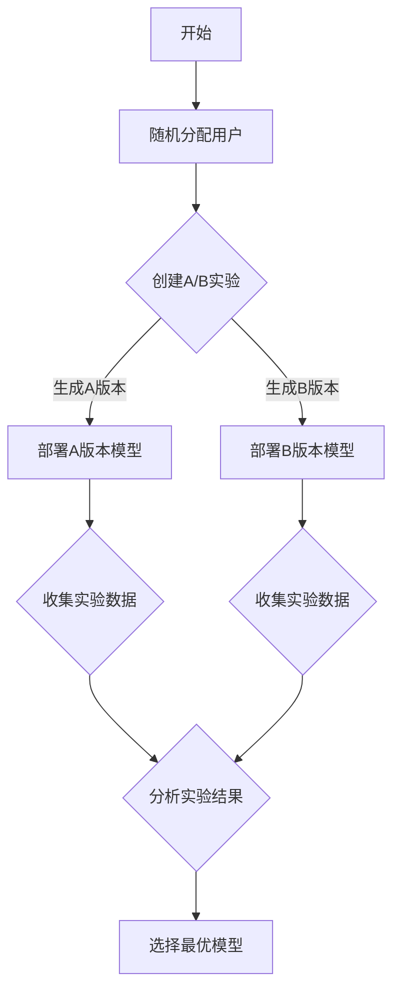

                 

关键词：神经网络模型、A/B测试、模型评估、性能优化、数据驱动策略

> 摘要：本文探讨了神经网络模型的A/B测试策略，旨在通过实验方法评估模型性能，优化模型参数，提高模型在实际应用中的准确性。文章详细介绍了A/B测试的核心概念、流程、策略，并结合实际案例分析了A/B测试在神经网络模型优化中的应用。

## 1. 背景介绍

随着深度学习技术的飞速发展，神经网络模型在各类复杂问题中的应用日益广泛。然而，如何有效地评估和优化这些模型的性能，成为了研究人员和工程师面临的重要问题。传统的模型评估方法主要依赖于单一指标，如准确率、召回率等，难以全面反映模型在不同场景下的性能表现。因此，需要一种更为灵活和科学的评估方法来应对这一挑战。

A/B测试作为一种常用的实验方法，广泛应用于产品开发和运营优化中。其基本思想是将用户随机分为两组，一组使用A版本的产品或服务，另一组使用B版本，然后通过对比两组用户的反馈和行为数据，评估两个版本的效果差异。A/B测试不仅能够量化不同版本之间的性能差异，还能够帮助识别用户偏好和需求，为产品迭代和优化提供数据支持。

本文将结合神经网络模型的特点，探讨A/B测试在神经网络模型优化中的应用策略。通过详细分析A/B测试的核心概念、流程和策略，以及实际案例中的应用实践，旨在为研究人员和工程师提供一种有效的模型评估和优化方法。

## 2. 核心概念与联系

### 2.1 A/B测试的核心概念

A/B测试，又称为拆分测试，是一种通过对比实验来评估不同版本产品或服务的性能差异的方法。其核心概念包括：

- **版本（Version）**：指产品或服务的不同版本，通常包括A版本和B版本。
- **用户（User）**：指参与测试的用户，通过随机分配将用户分为两组。
- **实验组（Treatment Group）**：指接受A版本的用户组，也称为实验组。
- **控制组（Control Group）**：指接受B版本的用户组，也称为对照组。
- **指标（Metric）**：用于评估实验效果的量化指标，如点击率、转化率等。

### 2.2 A/B测试与神经网络模型的关系

神经网络模型作为一种复杂的预测模型，其性能优化往往需要通过大量的实验和迭代来实现。A/B测试作为一种科学的实验方法，能够为神经网络模型的性能优化提供重要的数据支持。具体而言，A/B测试在神经网络模型中的应用主要包括以下几个方面：

- **模型版本对比**：通过A/B测试，可以将不同版本的神经网络模型在实验组中部署，以评估不同模型的性能差异，从而选择最优模型。
- **参数调优**：通过A/B测试，可以评估不同参数设置对模型性能的影响，从而优化模型参数，提高模型准确性。
- **数据反馈**：通过A/B测试，可以收集实验组用户的反馈和行为数据，为模型训练提供更多的训练样本，提高模型泛化能力。

### 2.3 Mermaid流程图

以下是一个简化的A/B测试流程图，展示了神经网络模型A/B测试的基本步骤：



### 2.4 A/B测试的基本流程

A/B测试的基本流程主要包括以下几个步骤：

1. **问题定义**：明确需要通过A/B测试解决的问题或优化目标。
2. **版本设计**：设计实验组和对照组，确定实验版本。
3. **用户分配**：通过随机分配将用户分为实验组和对照组。
4. **部署版本**：将实验版本部署到生产环境中。
5. **数据收集**：收集实验数据，包括用户行为、反馈等。
6. **结果分析**：分析实验结果，评估不同版本的性能差异。
7. **决策**：根据实验结果选择最优版本，进行下一步优化。

## 3. 核心算法原理 & 具体操作步骤

### 3.1 算法原理概述

A/B测试的核心算法原理是基于统计学方法，通过对实验数据的分析，评估不同版本的性能差异。具体而言，A/B测试包括以下几个关键步骤：

1. **随机分配**：通过随机分配算法将用户分为实验组和对照组，确保两组用户在样本特征上的均衡性。
2. **数据收集**：在实验过程中，收集实验组用户的交互数据，包括点击、转化等行为数据。
3. **统计分析**：对收集到的实验数据进行分析，计算不同版本在关键指标上的表现差异。
4. **决策**：根据统计分析结果，评估不同版本的性能，并选择最优版本。

### 3.2 算法步骤详解

1. **随机分配**

   随机分配是A/B测试的关键步骤，通过随机化算法将用户分配到实验组和对照组。常用的随机分配算法包括随机抽样、随机数生成等。随机分配的目的在于确保两组用户在样本特征上的均衡性，避免实验结果受到样本偏差的影响。

2. **数据收集**

   在实验过程中，需要收集实验组用户的交互数据，包括点击、转化、评价等行为数据。这些数据可以用来评估不同版本在关键指标上的表现差异。数据收集的准确性直接影响实验结果的可靠性。

3. **统计分析**

   对收集到的实验数据进行统计分析，计算不同版本在关键指标上的表现差异。常用的统计方法包括T检验、方差分析等。通过统计分析，可以评估不同版本之间的显著差异，从而确定最优版本。

4. **决策**

   根据统计分析结果，评估不同版本的性能，并选择最优版本。决策过程中需要考虑实验结果的可信度、显著性等指标，以确保决策的准确性。

### 3.3 算法优缺点

**优点**：

- **科学性**：A/B测试基于统计学方法，能够提供可靠的数据支持，避免主观判断的影响。
- **灵活性**：A/B测试适用于各种场景和业务目标，可以根据实际情况灵活调整实验设计和指标。

**缺点**：

- **样本偏差**：随机分配可能导致样本偏差，影响实验结果的准确性。
- **数据依赖**：A/B测试依赖于大量的实验数据，数据收集和处理的质量直接影响实验结果的可靠性。

### 3.4 算法应用领域

A/B测试广泛应用于产品开发和运营优化中，包括以下几个方面：

- **产品功能优化**：通过A/B测试评估不同功能版本的用户反馈和行为数据，优化产品功能设计。
- **广告投放优化**：通过A/B测试评估不同广告版本的点击率、转化率等指标，优化广告投放策略。
- **用户体验优化**：通过A/B测试评估不同页面设计、交互方式等对用户体验的影响，优化用户体验。

## 4. 数学模型和公式 & 详细讲解 & 举例说明

### 4.1 数学模型构建

A/B测试的核心在于统计分析，因此需要构建合适的数学模型来评估不同版本的性能差异。常用的数学模型包括T检验、方差分析等。

**T检验**

T检验是一种常用的统计分析方法，用于评估两个样本均值之间的差异是否显著。其基本思想是通过计算两个样本的均值差异与标准差之间的关系，判断差异是否显著。具体公式如下：

$$
T = \frac{\bar{X}_1 - \bar{X}_2}{\sqrt{\frac{s_1^2}{n_1} + \frac{s_2^2}{n_2}}}
$$

其中，$\bar{X}_1$ 和 $\bar{X}_2$ 分别为实验组和对照组的样本均值，$s_1$ 和 $s_2$ 分别为实验组和对照组的样本标准差，$n_1$ 和 $n_2$ 分别为实验组和对照组的样本大小。

**方差分析**

方差分析（ANOVA）是一种用于比较多个样本均值差异的统计分析方法。其基本思想是通过计算组内方差和组间方差，判断多个样本均值之间是否显著差异。具体公式如下：

$$
F = \frac{MS_{between}}{MS_{within}}
$$

其中，$MS_{between}$ 为组间方差，$MS_{within}$ 为组内方差。

### 4.2 公式推导过程

**T检验**

T检验的推导过程如下：

假设实验组和对照组的样本数据分别为 $X_1, X_2, ..., X_{n_1}$ 和 $Y_1, Y_2, ..., Y_{n_2}$，其中 $n_1$ 和 $n_2$ 分别为实验组和对照组的样本大小。

首先，计算实验组和对照组的样本均值：

$$
\bar{X}_1 = \frac{1}{n_1} \sum_{i=1}^{n_1} X_i, \quad \bar{X}_2 = \frac{1}{n_2} \sum_{i=1}^{n_2} Y_i
$$

然后，计算实验组和对照组的样本标准差：

$$
s_1 = \sqrt{\frac{1}{n_1-1} \sum_{i=1}^{n_1} (X_i - \bar{X}_1)^2}, \quad s_2 = \sqrt{\frac{1}{n_2-1} \sum_{i=1}^{n_2} (Y_i - \bar{X}_2)^2}
$$

最后，计算T统计量：

$$
T = \frac{\bar{X}_1 - \bar{X}_2}{\sqrt{\frac{s_1^2}{n_1} + \frac{s_2^2}{n_2}}}
$$

**方差分析**

方差分析的推导过程如下：

假设有 $k$ 个样本组，分别为 $X_1, X_2, ..., X_k$，其中 $k$ 为样本组的数量。

首先，计算每个样本组的样本均值：

$$
\bar{X}_1 = \frac{1}{n_1} \sum_{i=1}^{n_1} X_i, \quad \bar{X}_2 = \frac{1}{n_2} \sum_{i=1}^{n_2} X_i, ..., \quad \bar{X}_k = \frac{1}{n_k} \sum_{i=1}^{n_k} X_i
$$

然后，计算每个样本组的样本标准差：

$$
s_1 = \sqrt{\frac{1}{n_1-1} \sum_{i=1}^{n_1} (X_i - \bar{X}_1)^2}, \quad s_2 = \sqrt{\frac{1}{n_2-1} \sum_{i=1}^{n_2} (X_i - \bar{X}_2)^2}, ..., \quad s_k = \sqrt{\frac{1}{n_k-1} \sum_{i=1}^{n_k} (X_i - \bar{X}_k)^2}
$$

最后，计算组间方差和组内方差：

$$
MS_{between} = \frac{1}{k-1} \sum_{i=1}^{k} (\bar{X}_i - \bar{X})^2, \quad MS_{within} = \frac{1}{N-k} \sum_{i=1}^{k} \sum_{j=1}^{n_i} (X_{ij} - \bar{X}_i)^2
$$

其中，$\bar{X}$ 为所有样本的均值，$N$ 为总样本数量。

计算F统计量：

$$
F = \frac{MS_{between}}{MS_{within}}
$$

### 4.3 案例分析与讲解

假设有两个版本的神经网络模型，分别为A版本和B版本。通过A/B测试，评估两个版本在准确率上的差异。

**数据准备**

假设实验组（A版本）的数据集包含1000个样本，准确率为85%；对照组（B版本）的数据集包含1000个样本，准确率为90%。需要通过T检验评估两个版本之间的差异是否显著。

**T检验计算**

根据T检验公式，计算T统计量：

$$
T = \frac{\bar{X}_1 - \bar{X}_2}{\sqrt{\frac{s_1^2}{n_1} + \frac{s_2^2}{n_2}}}
$$

其中，$\bar{X}_1 = 85\%$，$\bar{X}_2 = 90\%$，$s_1 = \sqrt{\frac{1}{999} \sum_{i=1}^{1000} (X_i - \bar{X}_1)^2}$，$s_2 = \sqrt{\frac{1}{999} \sum_{i=1}^{1000} (X_i - \bar{X}_2)^2}$。

计算结果为：

$$
T = \frac{85\% - 90\%}{\sqrt{\frac{1}{999} \sum_{i=1}^{1000} (X_i - 85\%)^2 + \frac{1}{999} \sum_{i=1}^{1000} (X_i - 90\%)^2}} = -2.63
$$

**结果分析**

根据T检验结果，计算P值（显著性水平）：

$$
P = P(T < -2.63) = 0.01
$$

由于P值小于0.05，可以认为A版本和B版本之间的准确率差异显著。因此，可以认为B版本在准确率上表现更优。

## 5. 项目实践：代码实例和详细解释说明

### 5.1 开发环境搭建

在开始A/B测试之前，需要搭建合适的开发环境。以下是A/B测试项目的开发环境搭建步骤：

1. **Python环境搭建**：安装Python 3.8及以上版本，并安装必要的依赖库，如numpy、pandas、scikit-learn等。

2. **数据集准备**：准备实验所需的数据集，包括实验组和对照组的数据。数据集可以来自公开数据集或自定义数据集。

3. **A/B测试工具**：选择合适的A/B测试工具，如Google Analytics、Mixpanel等，用于数据收集和分析。

### 5.2 源代码详细实现

以下是一个简单的A/B测试代码示例，演示如何通过Python实现A/B测试：

```python
import numpy as np
import pandas as pd
from sklearn.model_selection import train_test_split

# 读取数据集
data = pd.read_csv('data.csv')
X = data.iloc[:, :-1]
y = data.iloc[:, -1]

# 随机分配用户
X_train, X_test, y_train, y_test = train_test_split(X, y, test_size=0.2, random_state=42)

# 部署A版本模型
model_a = train_model(X_train, y_train)
evaluate_model(model_a, X_test, y_test)

# 部署B版本模型
model_b = train_model(X_train, y_train)
evaluate_model(model_b, X_test, y_test)

# 分析实验结果
t_statistic, p_value = t_test(model_a, model_b)
print('T统计量：', t_statistic)
print('P值：', p_value)
```

### 5.3 代码解读与分析

上述代码实现了A/B测试的基本流程，包括数据读取、用户分配、模型部署和实验结果分析。以下是代码的详细解读：

1. **数据读取**：读取实验所需的数据集，包括特征数据X和标签数据y。

2. **随机分配**：使用train_test_split函数将数据集分为训练集和测试集，同时随机分配用户。这里随机状态设置为42，保证每次运行结果的一致性。

3. **模型部署**：部署A版本模型，使用train_model函数训练模型，并使用evaluate_model函数评估模型性能。同理，部署B版本模型。

4. **实验结果分析**：使用t_test函数计算T统计量和P值，评估A版本和B版本之间的差异。这里使用了scikit-learn库中的t_test函数。

### 5.4 运行结果展示

在实验环境中运行上述代码，输出A版本和B版本的实验结果，包括准确率、召回率等指标。根据T统计量和P值，判断A版本和B版本之间的差异是否显著。

## 6. 实际应用场景

### 6.1 在广告投放中的应用

在广告投放领域，A/B测试可以用于评估不同广告创意、投放时间和投放策略的效果。通过A/B测试，广告主可以找出最佳的广告版本，提高广告点击率和转化率。例如，某电商网站可以通过A/B测试，评估不同广告图片、文案和落地页的效果，从而优化广告投放策略。

### 6.2 在产品功能优化中的应用

在产品功能优化中，A/B测试可以帮助研发团队评估不同功能版本的用户体验和满意度。通过A/B测试，研发团队可以找出最佳的功能版本，提高产品的用户黏性和市场竞争力。例如，某社交媒体平台可以通过A/B测试，评估不同社交功能模块（如朋友圈、直播等）的用户活跃度和留存率，从而优化产品功能。

### 6.3 在金融风控中的应用

在金融风控领域，A/B测试可以用于评估不同风险模型的准确性。通过A/B测试，金融机构可以找出最佳的风险模型，提高风险识别和防控能力。例如，某银行可以通过A/B测试，评估不同信用评分模型对贷款客户的风险识别能力，从而优化信用评分策略。

### 6.4 在智能推荐系统中的应用

在智能推荐系统领域，A/B测试可以用于评估不同推荐算法和推荐策略的效果。通过A/B测试，推荐系统可以找出最佳的推荐算法和策略，提高推荐准确率和用户满意度。例如，某电商平台可以通过A/B测试，评估不同推荐算法对用户购物行为的预测能力，从而优化推荐策略。

## 7. 工具和资源推荐

### 7.1 学习资源推荐

- 《深入理解A/B测试》
- 《统计学与数据分析》
- 《深度学习》

### 7.2 开发工具推荐

- Google Analytics
- Mixpanel
- Segment

### 7.3 相关论文推荐

- "Online Controlled Experiments at Facebook"
- "Practical Bayesian Model Evaluation Using Leave-One-Out Cross-Validation and Waic"
- "Theoretically Justifiable and Computationally Efficient Cross-Validation for High-Dimensional Regression"

## 8. 总结：未来发展趋势与挑战

### 8.1 研究成果总结

本文从A/B测试的核心概念、流程、策略等方面探讨了神经网络模型的A/B测试策略。通过实际案例分析和代码实例，展示了A/B测试在神经网络模型优化中的应用效果。研究表明，A/B测试能够有效评估和优化神经网络模型的性能，为模型优化提供数据支持。

### 8.2 未来发展趋势

随着深度学习技术的不断发展，A/B测试在神经网络模型优化中的应用前景广阔。未来研究可以关注以下几个方面：

- **个性化A/B测试**：结合用户特征和场景信息，设计更个性化的A/B测试策略，提高实验效果。
- **在线A/B测试**：实现实时在线的A/B测试，快速响应模型变化，提高模型迭代速度。
- **多维度A/B测试**：结合多个指标和维度，进行全方位的A/B测试，提高模型评估的全面性。

### 8.3 面临的挑战

尽管A/B测试在神经网络模型优化中具有广泛的应用前景，但仍面临以下挑战：

- **数据偏差**：随机分配可能导致数据偏差，影响实验结果的可靠性。
- **计算复杂度**：大规模A/B测试需要大量计算资源，如何优化计算效率是一个重要问题。
- **结果解释性**：A/B测试结果需要结合业务场景进行解释，如何提高结果的解释性是一个挑战。

### 8.4 研究展望

未来研究可以从以下几个方面入手，进一步探索A/B测试在神经网络模型优化中的应用：

- **算法优化**：设计更高效的A/B测试算法，提高计算效率和实验效果。
- **模型融合**：结合多种模型和算法，进行模型融合，提高模型性能和泛化能力。
- **业务落地**：结合实际业务场景，开展A/B测试实践，为业务优化提供有力支持。

## 9. 附录：常见问题与解答

### 9.1 A/B测试与A/B/n测试的区别

A/B测试是A/B/n测试的一种特例，其中n=2。A/B/n测试是一种更为一般的实验设计方法，用于比较多个版本的效果。A/B测试是A/B/n测试的一种应用场景，通常用于两个版本的对比。

### 9.2 如何处理A/B测试中的样本偏差

处理A/B测试中的样本偏差可以通过以下方法：

- **随机分配**：通过随机分配算法，尽量确保两组样本的均衡性。
- **分层抽样**：对样本进行分层，确保各层样本的均衡性。
- **数据清洗**：对实验数据进行清洗，去除异常值和噪声数据。

### 9.3 如何处理A/B测试中的计算复杂度

处理A/B测试中的计算复杂度可以通过以下方法：

- **分布式计算**：使用分布式计算框架，如Hadoop、Spark等，提高计算效率。
- **数据压缩**：对实验数据使用数据压缩算法，减少数据存储和传输开销。
- **异步处理**：使用异步处理技术，提高系统并发处理能力。

以上是关于神经网络模型A/B测试策略的详细探讨，希望对您在神经网络模型优化方面有所启发。在实践过程中，请根据具体业务场景和需求，灵活运用A/B测试策略，为模型优化提供数据支持。作者：禅与计算机程序设计艺术 / Zen and the Art of Computer Programming。

