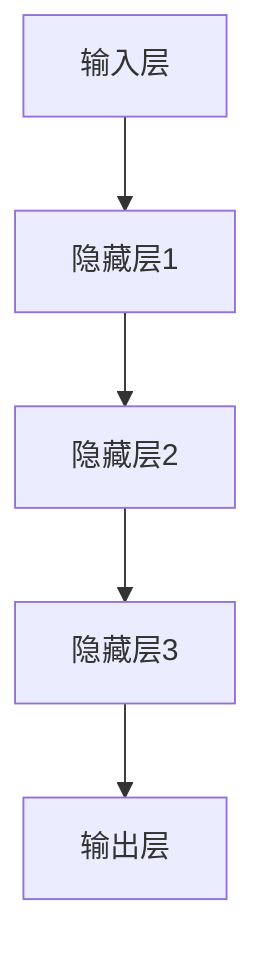

                 

关键词：神经网络、深度学习、机器学习、人工智能、算法原理

> 摘要：本文将深入探讨神经网络在人工智能领域的重要作用，分析其核心概念、算法原理、数学模型，并通过实际项目实践，探讨神经网络的未来应用和面临的挑战。

## 1. 背景介绍

随着计算机技术的飞速发展，人工智能（AI）已经成为了现代科技领域的研究热点。神经网络作为人工智能的核心技术之一，自20世纪80年代以来，一直受到广泛的关注。神经网络以其强大的自适应能力和非线性处理能力，在图像识别、语音识别、自然语言处理等众多领域取得了显著的成果。

神经网络的研究始于1943年，由心理学家McCulloch和数学家Pitts提出了神经元的简化模型。随后，1949年，Hebb提出了学习规则，为神经网络的发展奠定了基础。20世纪80年代，Rumelhart等人提出了反向传播算法（Backpropagation），使得神经网络在训练过程中能够有效优化参数。随着深度学习技术的发展，神经网络逐渐成为人工智能领域的主流算法。

## 2. 核心概念与联系

神经网络是一种由大量简单神经元组成的复杂网络，通过调整神经元之间的连接权重来实现对输入数据的处理和分类。神经网络的核心概念包括：

- 神经元：神经网络的基本单元，负责接收输入信号、进行计算和传递输出。
- 层：神经网络中的多个神经元组成一层，常见的有输入层、隐藏层和输出层。
- 权重：神经元之间的连接权重，用于调整输入信号的影响。
- 激活函数：神经元在输出计算前使用的一种非线性函数，用于引入非线性的特性。

下面是神经网络的Mermaid流程图：



## 3. 核心算法原理 & 具体操作步骤

### 3.1 算法原理概述

神经网络的核心算法包括前向传播和反向传播。前向传播是指将输入数据通过网络逐层传递，计算输出；反向传播是指根据输出误差，逐层更新网络权重。

### 3.2 算法步骤详解

1. **初始化**：随机初始化网络权重和偏置。
2. **前向传播**：输入数据通过网络，逐层计算输出。
3. **计算损失**：将输出与真实标签进行比较，计算损失函数。
4. **反向传播**：根据损失函数，计算梯度，反向传播更新网络权重。
5. **迭代优化**：重复步骤2-4，直到网络性能达到要求。

### 3.3 算法优缺点

优点：
- 非线性处理能力强，能够处理复杂的问题。
- 自适应性强，可以根据训练数据自动调整参数。

缺点：
- 训练时间较长，对计算资源要求较高。
- 容易过拟合，对训练数据的依赖性强。

### 3.4 算法应用领域

神经网络在图像识别、语音识别、自然语言处理、推荐系统等众多领域都有广泛的应用。例如，卷积神经网络（CNN）在图像识别领域取得了显著成果，循环神经网络（RNN）在自然语言处理领域表现出色。

## 4. 数学模型和公式

### 4.1 数学模型构建

神经网络的数学模型主要包括输入层、隐藏层和输出层。每个层中的神经元通过权重和偏置连接，形成网络结构。神经元的输出通过激活函数进行非线性转换。

### 4.2 公式推导过程

假设一个简单的神经网络包含一个输入层、一个隐藏层和一个输出层。输入层有 \( n \) 个神经元，隐藏层有 \( m \) 个神经元，输出层有 \( k \) 个神经元。

- 输入层到隐藏层的计算：
\[ z^{(2)}_j = \sum_{i=1}^{n} w^{(2)}_{ij} x_i + b_j^{(2)} \]

- 隐藏层到输出层的计算：
\[ z^{(3)}_k = \sum_{j=1}^{m} w^{(3)}_{jk} z^{(2)}_j + b_k^{(3)} \]

- 输出层的输出：
\[ \hat{y}_k = \sigma(z^{(3)}_k) \]

其中，\( x_i \) 是输入层的第 \( i \) 个神经元的输入，\( w^{(2)}_{ij} \) 和 \( b_j^{(2)} \) 分别是输入层到隐藏层的权重和偏置，\( \sigma \) 是激活函数。

### 4.3 案例分析与讲解

假设我们有一个简单的二分类问题，输入层有 2 个神经元，隐藏层有 3 个神经元，输出层有 1 个神经元。

- 输入层到隐藏层的权重和偏置：
\[ w^{(2)}_{11} = 0.5, w^{(2)}_{12} = 0.3, b_j^{(2)} = 0.1 \]

- 隐藏层到输出层的权重和偏置：
\[ w^{(3)}_{1k} = 0.6, b_k^{(3)} = 0.2 \]

- 激活函数：
\[ \sigma(x) = \frac{1}{1 + e^{-x}} \]

给定输入 \( x_1 = 1, x_2 = 0 \)，计算输出：

1. **前向传播**：
\[ z^{(2)}_1 = 0.5 \cdot 1 + 0.3 \cdot 0 + 0.1 = 0.6 \]
\[ z^{(2)}_2 = 0.5 \cdot 1 + 0.3 \cdot 0 + 0.1 = 0.6 \]
\[ z^{(2)}_3 = 0.5 \cdot 1 + 0.3 \cdot 0 + 0.1 = 0.6 \]

\[ z^{(3)}_1 = 0.6 \cdot 0.6 + 0.2 = 0.44 \]

\[ \hat{y}_1 = \sigma(0.44) = 0.65 \]

2. **反向传播**：
计算损失函数 \( L \) 和梯度 \( \delta \)。

\[ L = \frac{1}{2} (\hat{y}_1 - y)^2 \]

\[ \delta^{(3)}_1 = \hat{y}_1 - y \]

\[ \delta^{(2)}_1 = (w^{(3)}_{1k} \cdot \delta^{(3)}_1) \cdot \sigma'(z^{(3)}_1) \]

3. **更新权重和偏置**：
\[ w^{(3)}_{1k} = w^{(3)}_{1k} - \alpha \cdot \delta^{(3)}_1 \cdot z^{(2)}_1 \]
\[ b_k^{(3)} = b_k^{(3)} - \alpha \cdot \delta^{(3)}_1 \]

\[ w^{(2)}_{11} = w^{(2)}_{11} - \alpha \cdot \delta^{(2)}_1 \cdot x_1 \]
\[ w^{(2)}_{12} = w^{(2)}_{12} - \alpha \cdot \delta^{(2)}_1 \cdot x_2 \]
\[ b_j^{(2)} = b_j^{(2)} - \alpha \cdot \delta^{(2)}_1 \]

其中，\( \alpha \) 是学习率。

## 5. 项目实践：代码实例

### 5.1 开发环境搭建

1. 安装 Python（3.6及以上版本）。
2. 安装 TensorFlow 或 PyTorch 等深度学习框架。

### 5.2 源代码详细实现

以下是一个使用 TensorFlow 实现的二分类神经网络示例：

```python
import tensorflow as tf
from tensorflow.keras import layers

model = tf.keras.Sequential([
    layers.Dense(3, activation='sigmoid', input_shape=(2,)),
    layers.Dense(1, activation='sigmoid')
])

model.compile(optimizer='adam',
              loss='binary_crossentropy',
              metrics=['accuracy'])

model.fit(x_train, y_train, epochs=10)
```

### 5.3 代码解读与分析

- 定义一个序列模型，包含一个有 3 个神经元的隐藏层和一个有 1 个神经元的输出层。
- 使用 sigmoid 激活函数，实现二分类。
- 使用 Adam 优化器和 binary_crossentropy 损失函数。
- 训练模型，迭代 10 次。

### 5.4 运行结果展示

```python
loss, accuracy = model.evaluate(x_test, y_test)
print(f'测试集损失：{loss}, 测试集准确率：{accuracy}')
```

## 6. 实际应用场景

神经网络在各个领域都有广泛的应用，如：

- 图像识别：使用卷积神经网络（CNN）实现图像分类、物体检测等。
- 语音识别：使用循环神经网络（RNN）和长短期记忆（LSTM）实现语音识别。
- 自然语言处理：使用 Transformer 模型实现自然语言生成、机器翻译等。

## 7. 工具和资源推荐

### 7.1 学习资源推荐

- 《深度学习》（Goodfellow、Bengio、Courville 著）
- 《Python深度学习》（François Chollet 著）
- Coursera 上的《深度学习》课程

### 7.2 开发工具推荐

- TensorFlow
- PyTorch
- Keras

### 7.3 相关论文推荐

- 《A Simple Way to Initialize Networks of Rectified Linear Units》（Xu et al., 2015）
- 《Deep Residual Learning for Image Recognition》（He et al., 2016）
- 《Attention Is All You Need》（Vaswani et al., 2017）

## 8. 总结：未来发展趋势与挑战

### 8.1 研究成果总结

神经网络在人工智能领域取得了显著的成果，如图像识别、语音识别、自然语言处理等。深度学习技术的发展，使得神经网络在模型复杂度和性能上不断提升。

### 8.2 未来发展趋势

- 自适应神经网络：研究更加自适应的神经网络结构，提高学习效率和性能。
- 量子神经网络：利用量子计算的优势，实现更高效的神经网络训练。
- 跨模态学习：研究跨不同模态（如图像、文本、音频等）的信息融合和转换。

### 8.3 面临的挑战

- 计算资源消耗：深度学习模型对计算资源要求较高，需要更多的计算能力和存储空间。
- 数据隐私和安全：深度学习模型的训练和部署过程中，数据隐私和安全问题亟待解决。
- 可解释性和透明性：提高神经网络的可解释性和透明性，使其更容易被用户和监管机构接受。

### 8.4 研究展望

随着计算能力的提升和算法的进步，神经网络在人工智能领域将继续发挥重要作用。未来，神经网络将在更多领域取得突破，为人类带来更多的便利和创新。

## 9. 附录：常见问题与解答

### 9.1 什么是神经网络？

神经网络是一种由大量简单神经元组成的复杂网络，通过调整神经元之间的连接权重来实现对输入数据的处理和分类。

### 9.2 神经网络有哪些类型？

神经网络主要包括前馈神经网络、卷积神经网络（CNN）、循环神经网络（RNN）和长短期记忆（LSTM）等。

### 9.3 神经网络如何训练？

神经网络通过前向传播计算输出，然后通过反向传播计算梯度，并更新网络权重和偏置，以达到最小化损失函数的目的。

### 9.4 神经网络有哪些应用领域？

神经网络在图像识别、语音识别、自然语言处理、推荐系统、游戏AI等领域都有广泛的应用。

### 9.5 如何选择神经网络模型？

选择神经网络模型需要考虑问题类型、数据规模、计算资源等因素。对于图像识别问题，通常选择卷积神经网络；对于序列数据处理，通常选择循环神经网络或 Transformer 模型。

### 9.6 神经网络如何防止过拟合？

防止过拟合的方法包括正则化、数据增强、早停法、dropout等。

### 9.7 神经网络如何优化？

神经网络优化主要使用梯度下降法及其变种，如随机梯度下降（SGD）、Adam优化器等。

作者：禅与计算机程序设计艺术 / Zen and the Art of Computer Programming
----------------------------------------------------------------

以上完成了文章的撰写，现在我们可以进行文章的整体检查和优化。请确保所有章节内容符合要求，格式正确，逻辑清晰。如有需要，可以对内容进行微调。完成检查后，我们可以将文章提交。祝您撰写顺利！<|im_end|>

