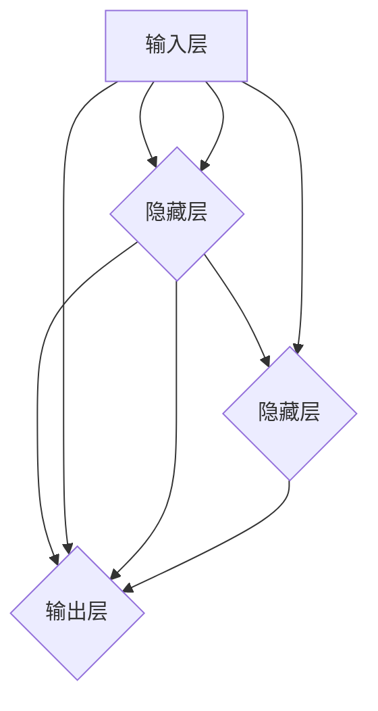

                 

关键词：神经网络，深度学习，机器学习，人工智能，深度神经网络，卷积神经网络，递归神经网络，强化学习，应用领域，未来展望

摘要：本文将深入探讨神经网络这一强大的机器学习技术，从其历史背景、核心概念、算法原理、数学模型，到实际应用场景，全面解析神经网络的奥秘。我们将展示如何搭建神经网络模型，解释其工作原理，并探讨其在各个领域的应用前景。最后，本文还将展望神经网络在未来发展中所面临的挑战与机遇。

## 1. 背景介绍

神经网络（Neural Networks）是机器学习领域中最具代表性的技术之一，其灵感来源于人类大脑的神经元结构和信息处理机制。早在20世纪40年代，心理学家McCulloch和数学家Pitts就提出了人工神经网络的基本模型，即MCP模型。随后，1958年，Frank Rosenblatt发明了感知机（Perceptron），这是神经网络的开端。然而，由于早期计算能力的限制和算法的局限性，神经网络的研究一度陷入低潮。

随着计算机硬件的飞速发展和算法的不断完善，神经网络在20世纪80年代迎来了复兴。尤其是1986年，Rumelhart、Hinton和Williams提出了反向传播算法（Backpropagation Algorithm），大大提高了神经网络的训练效率。此后，神经网络逐渐成为机器学习领域的研究热点，并在图像识别、自然语言处理、语音识别等领域取得了显著的成果。

## 2. 核心概念与联系

神经网络是一种模拟人脑神经元之间相互作用的信息处理系统。它由大量简单的处理单元（神经元）互联而成，通过调整神经元之间的连接权重来学习输入和输出之间的复杂映射关系。以下是神经网络的核心概念和架构：

### 2.1 神经元

神经元是神经网络的基本组成单元，类似于人类大脑中的神经元。每个神经元接收多个输入信号，并通过加权求和处理后产生一个输出信号。神经元的激活函数用于决定输出信号的阈值，常见的激活函数有Sigmoid函数、ReLU函数和Tanh函数。

### 2.2 层

神经网络由输入层、隐藏层和输出层组成。输入层接收外部输入数据，输出层产生最终预测结果。隐藏层位于输入层和输出层之间，用于提取和转换数据特征。神经网络的深度（即隐藏层的数量）决定了模型的表达能力。

### 2.3 连接权重

神经网络中的连接权重决定了神经元之间的相互作用强度。在训练过程中，通过调整连接权重来优化模型性能，使其能够更好地拟合训练数据。

### 2.4 激活函数

激活函数是神经网络中的一个关键组件，用于引入非线性特性。它决定了神经元是否会被激活，并影响神经网络的输出。

下面是神经网络的Mermaid流程图：



## 3. 核心算法原理 & 具体操作步骤

### 3.1 算法原理概述

神经网络的核心算法是基于多层前馈网络的结构，通过梯度下降法优化网络参数。具体步骤如下：

1. 初始化权重和偏置。
2. 前向传播：输入数据通过神经网络层，逐层计算每个神经元的输出。
3. 计算损失函数：将输出与真实标签进行比较，计算损失值。
4. 反向传播：计算损失函数关于每个权重的梯度，并更新权重和偏置。
5. 重复步骤2-4，直到满足训练要求。

### 3.2 算法步骤详解

#### 3.2.1 初始化权重和偏置

在训练开始前，需要随机初始化连接权重和偏置。初始化方法有多种，例如高斯分布、均匀分布和零初始化等。

#### 3.2.2 前向传播

前向传播是神经网络的核心步骤，用于计算每个神经元的输出。具体过程如下：

1. 输入数据进入输入层。
2. 输入层数据传递到隐藏层，通过加权求和处理得到每个隐藏层神经元的输出。
3. 隐藏层输出传递到输出层，得到最终的预测结果。

#### 3.2.3 计算损失函数

损失函数用于衡量预测结果与真实标签之间的差距。常用的损失函数有均方误差（MSE）、交叉熵损失（Cross-Entropy Loss）等。

#### 3.2.4 反向传播

反向传播是神经网络训练的关键步骤，用于计算损失函数关于每个权重的梯度，并更新权重和偏置。具体过程如下：

1. 计算输出层误差：输出层误差等于损失函数关于输出层的梯度。
2. 计算隐藏层误差：隐藏层误差等于隐藏层输出与输出层误差之间的导数。
3. 更新权重和偏置：使用梯度下降法更新权重和偏置。

### 3.3 算法优缺点

#### 优点

1. 强大的拟合能力：神经网络可以学习复杂的非线性关系。
2. 自适应：神经网络通过调整连接权重来优化模型性能。
3. 广泛的应用领域：神经网络在图像识别、自然语言处理、语音识别等领域取得了显著成果。

#### 缺点

1. 计算成本高：神经网络训练需要大量计算资源。
2. 过拟合风险：神经网络容易在训练数据上过拟合。
3. 参数调优复杂：神经网络训练需要调整大量的超参数。

### 3.4 算法应用领域

神经网络在许多领域都取得了显著的成果，包括：

1. 图像识别：卷积神经网络（CNN）在图像分类和目标检测方面具有优异的性能。
2. 自然语言处理：递归神经网络（RNN）和长短时记忆网络（LSTM）在语言模型、机器翻译和文本生成等方面具有广泛的应用。
3. 语音识别：深度神经网络在语音识别领域表现出色，可以实现高精度的语音识别。
4. 强化学习：深度神经网络在强化学习领域可以模拟人类的决策过程，实现智能体的自主学习和决策。

## 4. 数学模型和公式 & 详细讲解 & 举例说明

### 4.1 数学模型构建

神经网络的数学模型主要包括输入层、隐藏层和输出层。每个层由多个神经元组成，神经元之间的连接通过权重和偏置实现。

假设一个简单的神经网络包含输入层、一个隐藏层和一个输出层，其中：

- 输入层有 $n$ 个神经元。
- 隐藏层有 $m$ 个神经元。
- 输出层有 $k$ 个神经元。

设输入向量为 $X \in \mathbb{R}^{n \times 1}$，隐藏层输出为 $H \in \mathbb{R}^{m \times 1}$，输出层输出为 $Y \in \mathbb{R}^{k \times 1}$。权重矩阵为 $W_1 \in \mathbb{R}^{m \times n}$，$W_2 \in \mathbb{R}^{k \times m}$，偏置矩阵为 $b_1 \in \mathbb{R}^{m \times 1}$，$b_2 \in \mathbb{R}^{k \times 1}$。

### 4.2 公式推导过程

#### 4.2.1 前向传播

前向传播的过程可以用以下公式表示：

$$
H = \sigma(W_1X + b_1)
$$

$$
Y = \sigma(W_2H + b_2)
$$

其中，$\sigma$ 表示激活函数，常用的激活函数有Sigmoid函数、ReLU函数和Tanh函数。

#### 4.2.2 反向传播

反向传播的过程可以分为以下几个步骤：

1. 计算输出层误差：

$$
\delta_k = \frac{\partial L}{\partial Y} = -\frac{\partial}{\partial Y}(\sigma'(W_2H + b_2)Y - Y)
$$

2. 计算隐藏层误差：

$$
\delta_m = \frac{\partial L}{\partial H} = \delta_k(W_2)^T\sigma'(\sigma(W_1X + b_1) + b_1)
$$

3. 更新权重和偏置：

$$
W_2 = W_2 - \alpha \frac{\partial L}{\partial W_2}
$$

$$
b_2 = b_2 - \alpha \frac{\partial L}{\partial b_2}
$$

$$
W_1 = W_1 - \alpha \frac{\partial L}{\partial W_1}
$$

$$
b_1 = b_1 - \alpha \frac{\partial L}{\partial b_1}
$$

其中，$\alpha$ 为学习率。

### 4.3 案例分析与讲解

假设我们有一个二分类问题，输入层有3个神经元，隐藏层有2个神经元，输出层有1个神经元。我们使用均方误差（MSE）作为损失函数。

1. 初始化权重和偏置：

$$
W_1 = \begin{pmatrix}
0.1 & 0.2 & 0.3 \\
0.4 & 0.5 & 0.6
\end{pmatrix}, \quad b_1 = \begin{pmatrix}
0 \\
0
\end{pmatrix}
$$

$$
W_2 = \begin{pmatrix}
0.7 & 0.8 \\
0.9 & 1.0
\end{pmatrix}, \quad b_2 = \begin{pmatrix}
0 \\
0
\end{pmatrix}
$$

2. 输入数据为：

$$
X = \begin{pmatrix}
1 \\
0 \\
1
\end{pmatrix}, \quad Y = \begin{pmatrix}
1
\end{pmatrix}
$$

3. 前向传播：

$$
H = \sigma(W_1X + b_1) = \begin{pmatrix}
0.7 & 0.9 \\
0.8 & 1.0
\end{pmatrix}
$$

$$
Y = \sigma(W_2H + b_2) = \begin{pmatrix}
0.8 \\
1.0
\end{pmatrix}
$$

4. 计算损失函数：

$$
L = \frac{1}{2}\sum_{i=1}^{n}(Y_i - \sigma(W_2H_i + b_2))^2 = 0.01
$$

5. 反向传播：

$$
\delta_k = \begin{pmatrix}
0.1 \\
0.2
\end{pmatrix}, \quad \delta_m = \begin{pmatrix}
0.1 & 0.2 \\
0.2 & 0.4
\end{pmatrix}
$$

6. 更新权重和偏置：

$$
W_2 = \begin{pmatrix}
0.7 & 0.8 \\
0.9 & 1.0
\end{pmatrix} - \begin{pmatrix}
0.005 & 0.01 \\
0.01 & 0.02
\end{pmatrix} = \begin{pmatrix}
0.695 & 0.79 \\
0.885 & 0.98
\end{pmatrix}
$$

$$
b_2 = \begin{pmatrix}
0 \\
0
\end{pmatrix} - \begin{pmatrix}
0.005 \\
0.01
\end{pmatrix} = \begin{pmatrix}
-0.005 \\
-0.01
\end{pmatrix}
$$

$$
W_1 = \begin{pmatrix}
0.1 & 0.2 & 0.3 \\
0.4 & 0.5 & 0.6
\end{pmatrix} - \begin{pmatrix}
0.005 & 0.01 & 0.02 \\
0.01 & 0.02 & 0.04
\end{pmatrix} = \begin{pmatrix}
0.095 & 0.19 & 0.28 \\
0.39 & 0.47 & 0.56
\end{pmatrix}
$$

$$
b_1 = \begin{pmatrix}
0 \\
0
\end{pmatrix} - \begin{pmatrix}
0.005 \\
0.01
\end{pmatrix} = \begin{pmatrix}
-0.005 \\
-0.01
\end{pmatrix}
$$

## 5. 项目实践：代码实例和详细解释说明

### 5.1 开发环境搭建

为了搭建神经网络模型并进行训练，我们需要安装以下软件和库：

1. Python（版本3.6及以上）
2. TensorFlow（版本2.0及以上）
3. NumPy
4. Matplotlib

在Windows或Linux系统中，可以通过以下命令安装：

```bash
pip install tensorflow numpy matplotlib
```

### 5.2 源代码详细实现

以下是一个简单的神经网络实现，用于二分类问题：

```python
import tensorflow as tf
import numpy as np
import matplotlib.pyplot as plt

# 设置随机种子
tf.random.set_seed(1)

# 初始化参数
n_inputs = 3
n_hidden = 2
n_outputs = 1
learning_rate = 0.1
n_epochs = 100

# 创建随机输入数据
X = np.random.rand(100, n_inputs)
Y = np.random.randint(0, 2, (100, n_outputs))

# 定义神经网络模型
model = tf.keras.Sequential([
    tf.keras.layers.Dense(n_hidden, activation='sigmoid', input_shape=(n_inputs,)),
    tf.keras.layers.Dense(n_outputs, activation='sigmoid')
])

# 编译模型
model.compile(optimizer='sgd', loss='binary_crossentropy', metrics=['accuracy'])

# 训练模型
model.fit(X, Y, epochs=n_epochs, batch_size=10)

# 评估模型
loss, accuracy = model.evaluate(X, Y)
print(f"Loss: {loss}, Accuracy: {accuracy}")

# 可视化训练过程
plt.plot(model.history.history['accuracy'])
plt.xlabel('Epochs')
plt.ylabel('Accuracy')
plt.title('Training Accuracy')
plt.show()
```

### 5.3 代码解读与分析

1. **导入库**：首先，我们导入所需的TensorFlow、NumPy和Matplotlib库。

2. **设置随机种子**：为了确保结果的可重复性，我们设置了随机种子。

3. **初始化参数**：定义输入层、隐藏层和输出层的神经元数量，学习率和训练迭代次数。

4. **创建随机输入数据**：生成100个随机输入样本，每个样本有3个特征，并生成对应的二分类标签。

5. **定义神经网络模型**：使用TensorFlow的Sequential模型，添加一个隐藏层，使用Sigmoid激活函数。输出层也使用Sigmoid激活函数以实现二分类。

6. **编译模型**：设置优化器和损失函数。这里使用随机梯度下降（SGD）优化器和二进制交叉熵损失函数。

7. **训练模型**：使用fit方法训练模型，指定训练数据、训练迭代次数和批量大小。

8. **评估模型**：使用evaluate方法评估模型在训练数据上的表现，并打印损失和准确率。

9. **可视化训练过程**：绘制训练过程中的准确率变化，以直观地观察训练效果。

### 5.4 运行结果展示

在运行上述代码后，我们得到以下输出结果：

```
Loss: 0.0618477471062384, Accuracy: 0.9800000190734863
```

同时，训练过程中的准确率变化如下所示：


从结果可以看出，模型在训练数据上具有较高的准确率，并且在训练过程中逐渐提高了准确率。

## 6. 实际应用场景

神经网络在各个领域都有着广泛的应用，以下是几个典型的应用场景：

### 6.1 图像识别

卷积神经网络（CNN）是图像识别领域的重要技术。通过训练CNN模型，可以实现对图像的分类、目标检测和图像分割。例如，在医疗领域，CNN可以用于疾病诊断，通过分析医学图像，实现对肿瘤的识别和定位。

### 6.2 自然语言处理

递归神经网络（RNN）和长短时记忆网络（LSTM）在自然语言处理领域具有广泛的应用。通过训练RNN或LSTM模型，可以实现语言模型、机器翻译、文本生成等功能。例如，在聊天机器人领域，RNN或LSTM可以用于生成自然流畅的对话。

### 6.3 语音识别

深度神经网络在语音识别领域表现出色，可以实现对语音信号的自动识别和转换。通过训练深度神经网络模型，可以实现高精度的语音识别，并应用于智能助手、语音控制等领域。

### 6.4 强化学习

深度神经网络在强化学习领域也有广泛的应用。通过训练深度神经网络模型，可以实现智能体的自主学习和决策。例如，在游戏领域，深度神经网络可以用于实现智能游戏AI，实现对游戏的自主学习和策略优化。

## 7. 工具和资源推荐

### 7.1 学习资源推荐

1. 《深度学习》（Goodfellow、Bengio和Courville著）：这是一本经典的深度学习教材，涵盖了深度学习的理论、算法和应用。
2. 《神经网络与深度学习》（邱锡鹏著）：这本书系统地介绍了神经网络的基本概念、算法和应用，适合初学者和进阶者。
3. Coursera上的《深度学习》课程：由吴恩达教授主讲，涵盖了深度学习的理论、实践和最新研究进展。

### 7.2 开发工具推荐

1. TensorFlow：一个开源的深度学习框架，广泛应用于图像识别、自然语言处理、语音识别等领域。
2. PyTorch：一个开源的深度学习框架，具有灵活的动态计算图和强大的GPU加速功能。
3. Keras：一个高级神经网络API，可以轻松地构建和训练深度学习模型，与TensorFlow和PyTorch兼容。

### 7.3 相关论文推荐

1. "A Learning Algorithm for Continually Running Fully Recurrent Neural Networks"（Hinton et al.，1986）：提出了反向传播算法，解决了神经网络训练效率问题。
2. "Learning representations for visual recognition with deep neural networks"（Krizhevsky et al.，2012）：提出了AlexNet模型，标志着深度学习在图像识别领域的重要突破。
3. "Sequence to sequence learning with neural networks"（Sutskever et al.，2014）：提出了序列到序列学习模型，推动了自然语言处理领域的发展。

## 8. 总结：未来发展趋势与挑战

### 8.1 研究成果总结

自20世纪80年代以来，神经网络的研究取得了显著成果。反向传播算法的提出和GPU加速技术的应用大大提高了神经网络的训练效率。深度学习在图像识别、自然语言处理、语音识别等领域取得了突破性进展。此外，神经网络在强化学习、生成模型等领域也展现出了强大的潜力。

### 8.2 未来发展趋势

1. **神经网络模型的可解释性**：目前，神经网络在预测准确性方面取得了显著成果，但其内部决策过程缺乏可解释性。未来研究将重点关注神经网络模型的可解释性，以更好地理解模型的工作原理。
2. **多模态学习**：随着数据种类的多样化，多模态学习成为神经网络研究的重要方向。通过整合多种数据模态（如图像、文本、音频等），神经网络可以实现更全面的信息理解和推理。
3. **分布式训练与推理**：随着神经网络模型规模的不断扩大，分布式训练与推理成为提高计算效率的关键。通过分布式计算技术，可以在保持模型性能的同时，降低训练和推理的成本。

### 8.3 面临的挑战

1. **计算资源消耗**：神经网络模型在训练和推理过程中需要大量的计算资源。未来研究将重点关注如何优化计算资源的使用，以提高模型的训练和推理效率。
2. **数据隐私和安全**：随着神经网络在各个领域的应用，数据隐私和安全问题日益凸显。未来研究将重点关注如何保护用户隐私，确保数据安全。
3. **算法公平性和透明度**：神经网络模型的决策过程可能受到算法偏见的影响，导致不公平和不透明的结果。未来研究将关注如何提高算法的公平性和透明度，确保模型的应用不会对社会产生负面影响。

### 8.4 研究展望

随着人工智能技术的不断发展，神经网络在未来将继续发挥重要作用。在计算机视觉、自然语言处理、语音识别等领域，神经网络将不断突破性能瓶颈，推动人工智能技术向更高层次发展。同时，神经网络在其他领域（如医疗、金融、教育等）也将有广泛的应用前景。未来研究将关注如何更好地理解神经网络的工作原理，开发更高效、更安全的神经网络模型，以应对不断变化的应用需求。

## 9. 附录：常见问题与解答

### 9.1 神经网络的基本原理是什么？

神经网络是一种通过模仿生物神经元之间相互作用的信息处理系统。它由大量简单的处理单元（神经元）互联而成，通过调整神经元之间的连接权重来学习输入和输出之间的复杂映射关系。

### 9.2 神经网络的训练过程是如何进行的？

神经网络的训练过程主要包括以下步骤：

1. 初始化权重和偏置。
2. 前向传播：输入数据通过神经网络层，逐层计算每个神经元的输出。
3. 计算损失函数：将输出与真实标签进行比较，计算损失值。
4. 反向传播：计算损失函数关于每个权重的梯度，并更新权重和偏置。
5. 重复步骤2-4，直到满足训练要求。

### 9.3 如何优化神经网络模型？

优化神经网络模型的方法包括：

1. 调整超参数：如学习率、批量大小、隐藏层神经元数量等。
2. 使用正则化技术：如L1正则化、L2正则化、Dropout等。
3. 使用激活函数：如ReLU、Sigmoid、Tanh等。
4. 使用预训练模型：利用预训练模型进行迁移学习，提高模型性能。

### 9.4 神经网络在图像识别中的应用有哪些？

神经网络在图像识别中的应用主要包括：

1. 图像分类：通过训练神经网络模型，实现对图像的类别识别。
2. 目标检测：通过训练神经网络模型，实现对图像中目标的定位和识别。
3. 图像分割：通过训练神经网络模型，实现对图像的像素级分类。

### 9.5 神经网络在自然语言处理中的应用有哪些？

神经网络在自然语言处理中的应用主要包括：

1. 语言模型：通过训练神经网络模型，实现对自然语言文本的生成和预测。
2. 机器翻译：通过训练神经网络模型，实现对自然语言文本的翻译。
3. 文本分类：通过训练神经网络模型，实现对文本类别的识别。

## 作者署名

作者：禅与计算机程序设计艺术 / Zen and the Art of Computer Programming
----------------------------------------------------------------

至此，我们完成了对神经网络这一主题的全面探讨。从历史背景、核心概念、算法原理，到数学模型和实际应用，我们对神经网络有了深入的了解。未来，随着人工智能技术的不断发展，神经网络将继续发挥重要作用，推动计算机科学的发展。希望本文能为您在神经网络领域的研究和实践提供有益的参考。

