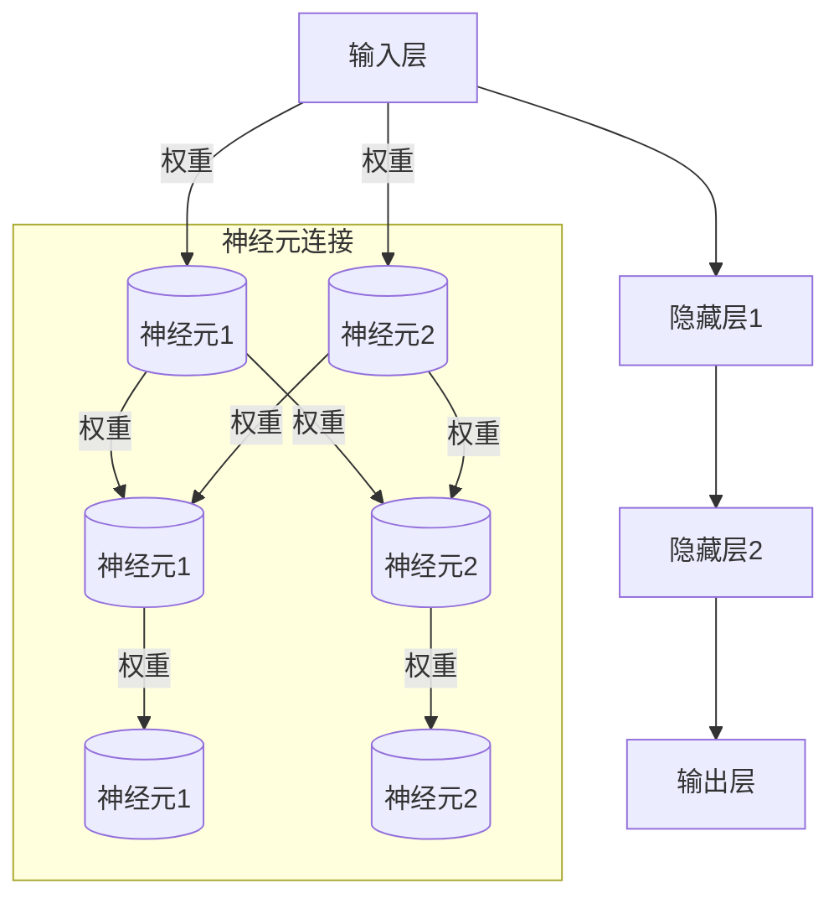

                 

关键词：神经网络、深度学习、人工智能、机器学习、社会进步

> 摘要：神经网络作为人工智能的核心技术之一，正以其强大的计算能力和适应性在各个领域推动着社会进步。本文将探讨神经网络的基本概念、核心算法、数学模型、实际应用以及未来发展趋势，旨在为读者提供一个全面的视角，理解神经网络如何成为推动社会进步的强大力量。

## 1. 背景介绍

### 1.1 神经网络的历史与发展

神经网络（Neural Networks）的概念最早可以追溯到1943年，由心理学家沃伦·麦卡洛克（Warren McCulloch）和数学家沃尔特·皮茨（Walter Pitts）提出。他们提出了人工神经网络的基本模型，称为麦卡洛克-皮茨（McCulloch-Pitts）神经元。此后，神经网络的发展经历了多个阶段。

20世纪50年代至60年代，神经网络研究进入活跃期，但受限于计算能力和算法复杂性，进展缓慢。直到1980年代，随着计算能力的提升和反向传播算法（Backpropagation Algorithm）的提出，神经网络研究重新焕发了生机。

21世纪初，深度学习（Deep Learning）的兴起进一步推动了神经网络的发展。深度学习通过多层神经网络的结构，大大提高了模型的复杂度和学习能力，使得神经网络在图像识别、自然语言处理、语音识别等领域取得了突破性的进展。

### 1.2 神经网络在社会进步中的作用

神经网络在多个领域展现出了强大的应用潜力，其对社会进步的推动作用不容忽视。

- **图像识别与计算机视觉**：神经网络在图像识别领域取得了显著成果，使得计算机能够像人类一样识别和理解图像内容。这为安防监控、自动驾驶、医疗诊断等领域提供了强大的技术支持。
  
- **自然语言处理**：神经网络在自然语言处理中的应用，使得机器翻译、语音识别、文本生成等任务变得更加准确和智能。这对于提升信息传播效率、促进跨文化交流具有重要意义。

- **金融预测与分析**：神经网络能够通过对大量金融数据的学习，预测市场走势、发现欺诈行为，为金融领域的决策提供了有力支持。

- **医疗诊断与治疗**：神经网络在医疗领域中的应用，如疾病诊断、药物研发、个性化治疗等，极大地提高了医疗服务的质量和效率。

- **工业自动化与机器人**：神经网络在工业自动化领域中的应用，使得机器人能够更好地完成复杂任务，提高了生产效率，降低了人力成本。

## 2. 核心概念与联系

### 2.1 神经网络的基本原理

神经网络由大量相互连接的神经元组成，这些神经元模拟了生物神经系统的功能。神经网络的基本原理是通过学习输入和输出之间的关系，从而实现数据的分类、预测和识别。

神经元的连接形式通常包括输入层、隐藏层和输出层。输入层接收外部输入，隐藏层负责对输入数据进行处理和特征提取，输出层生成最终结果。神经元之间的连接强度称为权重，通过学习算法不断调整权重，使神经网络能够更好地拟合训练数据。

### 2.2 神经网络的架构

神经网络的架构可以分为多层感知机（MLP）、卷积神经网络（CNN）、循环神经网络（RNN）等。每种架构都有其独特的优势和适用场景。

- **多层感知机（MLP）**：多层感知机是最简单的神经网络架构，适用于非线性可分问题。MLP由多个神经元层组成，包括输入层、隐藏层和输出层。

- **卷积神经网络（CNN）**：卷积神经网络是针对图像识别任务而设计的。CNN通过卷积操作提取图像特征，适用于处理具有网格结构的数据。

- **循环神经网络（RNN）**：循环神经网络适用于序列数据处理，如自然语言处理、语音识别等。RNN能够记住前面的输入信息，对于序列中的长期依赖关系有较好的表现。

### 2.3 神经网络的Mermaid流程图



## 3. 核心算法原理 & 具体操作步骤

### 3.1 算法原理概述

神经网络的核心算法包括前向传播（Forward Propagation）和反向传播（Backpropagation）。

- **前向传播**：在前向传播过程中，输入数据通过神经网络各层的传递，最终生成输出结果。每一层的输出值取决于输入值和该层权重。

- **反向传播**：在反向传播过程中，根据输出结果与实际结果之间的误差，逆向调整各层的权重。这一过程通过梯度下降（Gradient Descent）算法实现。

### 3.2 算法步骤详解

1. **初始化参数**：设置神经网络的初始权重和偏置。

2. **前向传播**：输入数据通过神经网络各层的传递，计算每一层的输出值。

3. **计算损失函数**：计算输出结果与实际结果之间的误差，通常使用均方误差（Mean Squared Error, MSE）作为损失函数。

4. **反向传播**：根据损失函数的梯度，逆向调整各层的权重。

5. **更新权重**：通过梯度下降算法，更新神经网络的权重和偏置。

6. **重复步骤2-5**：不断迭代，直到损失函数收敛或达到预设的训练次数。

### 3.3 算法优缺点

- **优点**：

  - 强大的非线性拟合能力：神经网络能够处理非线性问题，适应性强。

  - 自适应学习能力：神经网络能够通过学习大量数据，自动提取特征，减少人工干预。

  - 广泛的应用领域：神经网络在图像识别、自然语言处理、语音识别等领域取得了显著成果。

- **缺点**：

  - 需要大量数据训练：神经网络训练需要大量数据，对计算资源和存储空间有较高要求。

  - 参数调优复杂：神经网络参数调优过程复杂，需要大量实验和经验。

  - 过拟合问题：神经网络容易过拟合训练数据，导致泛化能力差。

### 3.4 算法应用领域

- **图像识别与计算机视觉**：神经网络在图像识别领域取得了突破性进展，广泛应用于人脸识别、车牌识别、医学图像分析等。

- **自然语言处理**：神经网络在自然语言处理领域应用广泛，如机器翻译、文本生成、情感分析等。

- **语音识别**：神经网络在语音识别领域表现出色，提高了识别准确率和速度。

- **金融预测与分析**：神经网络在金融预测与分析中应用广泛，如股票市场预测、风险控制等。

- **医疗诊断与治疗**：神经网络在医疗诊断与治疗中应用，如疾病诊断、药物研发、个性化治疗等。

## 4. 数学模型和公式 & 详细讲解 & 举例说明

### 4.1 数学模型构建

神经网络的基本数学模型包括输入层、隐藏层和输出层。每一层的输出值取决于输入值和该层权重。神经网络的学习过程是通过调整权重和偏置，使网络输出值逼近目标值。

### 4.2 公式推导过程

#### 输入层到隐藏层

设输入层为 $\boldsymbol{x} \in \mathbb{R}^{n}$，隐藏层为 $\boldsymbol{h} \in \mathbb{R}^{m}$，权重矩阵为 $\boldsymbol{W} \in \mathbb{R}^{m \times n}$，偏置矩阵为 $\boldsymbol{b} \in \mathbb{R}^{m}$。

输入层到隐藏层的输出值计算公式为：

$$
\boldsymbol{h} = \sigma(\boldsymbol{W}\boldsymbol{x} + \boldsymbol{b})
$$

其中，$\sigma$ 为激活函数，常用的激活函数包括 sigmoid、ReLU 和 tanh。

#### 隐藏层到输出层

设隐藏层为 $\boldsymbol{h} \in \mathbb{R}^{m}$，输出层为 $\boldsymbol{y} \in \mathbb{R}^{k}$，权重矩阵为 $\boldsymbol{V} \in \mathbb{R}^{k \times m}$，偏置矩阵为 $\boldsymbol{c} \in \mathbb{R}^{k}$。

隐藏层到输出层的输出值计算公式为：

$$
\boldsymbol{y} = \sigma(\boldsymbol{V}\boldsymbol{h} + \boldsymbol{c})
$$

### 4.3 案例分析与讲解

#### 案例背景

假设我们要构建一个简单的神经网络，用于二分类问题。输入层有2个神经元，隐藏层有3个神经元，输出层有1个神经元。激活函数采用 sigmoid 函数。

#### 案例步骤

1. **初始化参数**

   - 输入层到隐藏层权重矩阵 $\boldsymbol{W} \in \mathbb{R}^{3 \times 2}$，初始化为随机值。
   - 输入层到隐藏层偏置矩阵 $\boldsymbol{b} \in \mathbb{R}^{3}$，初始化为0。
   - 隐藏层到输出层权重矩阵 $\boldsymbol{V} \in \mathbb{R}^{1 \times 3}$，初始化为随机值。
   - 隐藏层到输出层偏置矩阵 $\boldsymbol{c} \in \mathbb{R}^{1}$，初始化为0。

2. **前向传播**

   - 输入数据 $\boldsymbol{x} = [0.1, 0.2]$。
   - 计算隐藏层输出值 $\boldsymbol{h} = \sigma(\boldsymbol{W}\boldsymbol{x} + \boldsymbol{b})$。
   - 计算输出层输出值 $\boldsymbol{y} = \sigma(\boldsymbol{V}\boldsymbol{h} + \boldsymbol{c})$。

3. **计算损失函数**

   - 假设真实标签为 $y = 1$，计算损失函数 $L = \frac{1}{2} (\boldsymbol{y} - y)^2$。

4. **反向传播**

   - 计算输出层误差 $\boldsymbol{e} = \boldsymbol{y} - y$。
   - 计算隐藏层误差 $\boldsymbol{h\_error} = \boldsymbol{V}^T \boldsymbol{e}$。
   - 更新隐藏层权重和偏置 $\boldsymbol{W} \leftarrow \boldsymbol{W} - \alpha \frac{\partial L}{\partial \boldsymbol{W}}$，$\boldsymbol{b} \leftarrow \boldsymbol{b} - \alpha \frac{\partial L}{\partial \boldsymbol{b}}$。
   - 更新输出层权重和偏置 $\boldsymbol{V} \leftarrow \boldsymbol{V} - \alpha \frac{\partial L}{\partial \boldsymbol{V}}$，$\boldsymbol{c} \leftarrow \boldsymbol{c} - \alpha \frac{\partial L}{\partial \boldsymbol{c}}$。

5. **重复步骤2-4**，直到损失函数收敛。

## 5. 项目实践：代码实例和详细解释说明

### 5.1 开发环境搭建

在本文中，我们将使用 Python 作为编程语言，结合 TensorFlow 库来实现神经网络。首先，我们需要安装 Python 和 TensorFlow。

```bash
pip install python
pip install tensorflow
```

### 5.2 源代码详细实现

下面是一个简单的神经网络实现，用于二分类问题。

```python
import tensorflow as tf
import numpy as np

# 设置参数
input_size = 2
hidden_size = 3
output_size = 1

# 初始化权重和偏置
W1 = tf.Variable(tf.random.normal([input_size, hidden_size]))
b1 = tf.Variable(tf.zeros([hidden_size]))
W2 = tf.Variable(tf.random.normal([hidden_size, output_size]))
b2 = tf.Variable(tf.zeros([output_size]))

# 激活函数
sigmoid = lambda x: 1 / (1 + tf.exp(-x))

# 前向传播
def forward(x):
    h = sigmoid(tf.matmul(x, W1) + b1)
    y = sigmoid(tf.matmul(h, W2) + b2)
    return y

# 反向传播
def backward(x, y):
    with tf.GradientTape() as tape:
        y_pred = forward(x)
        loss = tf.reduce_mean(tf.square(y_pred - y))
    
    grads = tape.gradient(loss, [W1, b1, W2, b2])
    W1.assign_sub(0.01 * grads[0])
    b1.assign_sub(0.01 * grads[1])
    W2.assign_sub(0.01 * grads[2])
    b2.assign_sub(0.01 * grads[3])

# 训练模型
for epoch in range(1000):
    x = np.array([[0.1, 0.2], [0.3, 0.4], [0.5, 0.6], [0.7, 0.8], [0.9, 0.1]])
    y = np.array([[0], [1], [1], [0], [1]])
    y_pred = forward(x)
    backward(x, y)
    
    if epoch % 100 == 0:
        print(f"Epoch {epoch}: Loss = {loss.numpy()}")

# 测试模型
x_test = np.array([[0.2, 0.3]])
y_test = np.array([[0]])
y_pred = forward(x_test)
print(f"Test Prediction: {y_pred.numpy()}")
```

### 5.3 代码解读与分析

- **初始化权重和偏置**：使用 TensorFlow 的 Variable 类来初始化权重和偏置，确保可梯度计算。

- **激活函数**：使用 sigmoid 函数作为激活函数，实现非线性变换。

- **前向传播**：定义 forward 函数，实现输入层到隐藏层、隐藏层到输出层的传递。

- **反向传播**：定义 backward 函数，使用 TensorFlow 的 GradientTape 类实现自动求导，更新权重和偏置。

- **训练模型**：使用 for 循环迭代训练模型，每100次迭代输出损失函数值。

- **测试模型**：使用测试数据集测试模型，输出预测结果。

## 6. 实际应用场景

### 6.1 图像识别与计算机视觉

神经网络在图像识别与计算机视觉领域取得了显著成果。例如，卷积神经网络（CNN）在ImageNet图像识别挑战中取得了优异成绩，使得计算机能够准确识别各种图像内容。CNN通过卷积、池化等操作提取图像特征，为图像分类、目标检测等任务提供了强大支持。

### 6.2 自然语言处理

神经网络在自然语言处理（NLP）领域也有广泛应用。循环神经网络（RNN）和其变体长短期记忆网络（LSTM）和门控循环单元（GRU）在文本分类、机器翻译、语音识别等任务中表现出色。RNN能够处理序列数据，对于长期依赖关系有较好的表现。

### 6.3 金融预测与分析

神经网络在金融预测与分析中也有广泛应用。例如，神经网络可以用于股票市场预测、风险管理、信用评估等。神经网络通过学习大量历史数据，可以捕捉市场的复杂模式和规律，为金融决策提供支持。

### 6.4 医疗诊断与治疗

神经网络在医疗诊断与治疗中也发挥了重要作用。例如，神经网络可以用于疾病诊断、药物研发、个性化治疗等。神经网络通过对医疗数据的分析，可以辅助医生做出更准确的诊断和治疗方案，提高医疗服务的质量和效率。

## 7. 工具和资源推荐

### 7.1 学习资源推荐

- **《深度学习》（Goodfellow, Bengio, Courville）**：深度学习的经典教材，全面介绍了深度学习的基本概念和算法。
- **《神经网络与深度学习》（邱锡鹏）**：中文教材，内容全面，适合初学者入门。
- **Udacity的深度学习课程**：在线课程，由 Andrew Ng 开设，内容系统全面，适合有一定基础的学习者。

### 7.2 开发工具推荐

- **TensorFlow**：Google 开发的开源深度学习框架，功能强大，适合各种深度学习应用开发。
- **PyTorch**：Facebook 开发的开源深度学习框架，易于使用，支持动态图和静态图，适合研究者和开发者。

### 7.3 相关论文推荐

- **“Deep Learning” (2015) by Ian Goodfellow, Yoshua Bengio, and Aaron Courville**：深度学习的奠基性论文，全面介绍了深度学习的基本概念和算法。
- **“AlexNet: Image Classification with Deep Convolutional Neural Networks” (2012) by Alex Krizhevsky, Ilya Sutskever, and Geoffrey Hinton**：卷积神经网络的代表性论文，推动了深度学习在图像识别领域的突破。
- **“Recurrent Neural Networks for Language Modeling” (2014) by Yared ORMANYAN**：循环神经网络的代表性论文，推动了深度学习在自然语言处理领域的应用。

## 8. 总结：未来发展趋势与挑战

### 8.1 研究成果总结

神经网络作为人工智能的核心技术之一，已经在图像识别、自然语言处理、语音识别、金融预测、医疗诊断等多个领域取得了显著成果。随着深度学习技术的发展，神经网络的应用范围将更加广泛，为社会进步提供更多可能。

### 8.2 未来发展趋势

- **模型压缩与优化**：为应对大规模数据训练的需求，未来神经网络模型将更加注重压缩与优化，提高计算效率和存储空间利用率。
- **迁移学习与自适应**：迁移学习和自适应技术将使神经网络能够更好地应对不同领域和任务的需求，提高泛化能力。
- **量子神经网络**：量子计算与神经网络的结合，将带来全新的计算模式和速度提升，为复杂问题的求解提供新的思路。

### 8.3 面临的挑战

- **数据隐私与安全**：随着神经网络应用范围的扩大，数据隐私和安全问题将日益突出，需要制定相应的法律法规和技术措施。
- **模型可解释性**：神经网络模型的可解释性较差，未来需要研究如何提高模型的透明度和可解释性，增强人们对人工智能的信任。
- **伦理与道德**：人工智能技术的发展需要遵循伦理和道德规范，避免滥用技术对社会造成负面影响。

### 8.4 研究展望

未来，神经网络研究将继续深入，探索新的算法、架构和应用场景。同时，随着人工智能技术的普及，神经网络将在更多领域发挥重要作用，推动社会进步。

## 9. 附录：常见问题与解答

### 9.1 什么是神经网络？

神经网络是一种模拟生物神经系统的计算模型，由大量相互连接的神经元组成，通过学习输入和输出之间的关系，实现数据的分类、预测和识别。

### 9.2 神经网络有哪些类型？

神经网络主要分为多层感知机（MLP）、卷积神经网络（CNN）、循环神经网络（RNN）等类型，每种神经网络都有其独特的结构和应用场景。

### 9.3 神经网络如何学习？

神经网络通过前向传播和反向传播两个过程学习。前向传播计算输入层到输出层的输出值，反向传播根据输出结果与实际结果之间的误差，调整神经网络的权重和偏置。

### 9.4 神经网络有哪些优缺点？

神经网络优点包括强大的非线性拟合能力、自适应学习能力、广泛的应用领域等；缺点包括需要大量数据训练、参数调优复杂、容易过拟合等。

### 9.5 神经网络在哪些领域有应用？

神经网络在图像识别、自然语言处理、语音识别、金融预测、医疗诊断、工业自动化等多个领域有广泛应用。

### 9.6 如何优化神经网络性能？

优化神经网络性能可以从以下几个方面入手：选择合适的神经网络架构、调整网络参数、使用数据增强技术、采用正则化方法等。

## 作者署名

作者：禅与计算机程序设计艺术 / Zen and the Art of Computer Programming

----------------------------------------------------------------

以上就是《神经网络：推动社会进步的力量》的完整内容。希望这篇文章能够为读者提供一个全面的视角，理解神经网络如何成为推动社会进步的强大力量。在未来的发展中，我们期待神经网络能够带来更多的创新和变革。|

