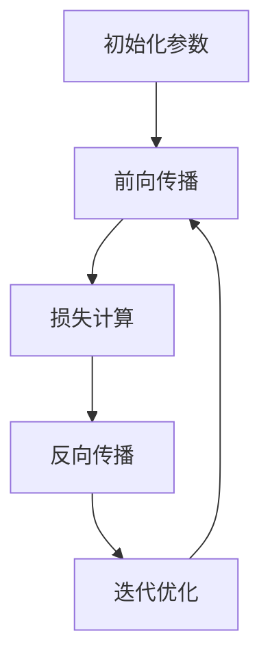

                 

关键词：神经网络、深度学习、人工智能、机器学习、计算机科学

> 摘要：本文深入探讨了神经网络这一革命性技术的概念、原理和应用，从历史背景到现代发展，从核心算法到数学模型，从项目实践到未来展望，全面展现了神经网络如何深刻地改变着世界。

## 1. 背景介绍

神经网络作为人工智能（AI）的基石之一，其历史可以追溯到20世纪40年代。在那时，心理学家和数学家开始思考如何模仿人脑的思维方式来创建智能机器。1943年，McCulloch和Pitts提出了第一个简化版本的神经网络模型——MP神经元。1958年，Frank Rosenblatt发明了感知机（Perceptron），这是一个可以通过学习分类数据的简单神经网络模型。尽管感知机在理论上取得了突破，但早期神经网络的实际应用却因计算能力和算法限制而受限。

随着计算机技术的飞速发展，特别是进入21世纪后，大数据和强大的计算能力为神经网络的研究和应用提供了坚实的基础。2006年，Hinton等人提出了深度学习（Deep Learning），这是一种利用多层神经网络进行特征学习和模型训练的方法，使得神经网络在图像识别、自然语言处理、语音识别等领域取得了显著成果。

## 2. 核心概念与联系

### 2.1 神经网络基本概念

神经网络是一种模拟生物神经系统的计算模型，由大量人工神经元（或节点）组成。这些神经元通过一系列的加权连接（或边）连接在一起，形成一个复杂的网络结构。每个神经元接收来自其他神经元的输入信号，通过加权求和处理后，产生一个输出信号。

### 2.2 神经网络结构

神经网络的典型结构包括输入层、隐藏层和输出层。输入层接收外部输入数据，隐藏层对输入数据进行处理和变换，输出层生成最终的结果。

### 2.3 神经网络学习过程

神经网络通过学习训练数据来改进其性能。学习过程包括以下几个步骤：

1. **初始化参数**：为每个神经元和连接随机分配初始权重和偏置。
2. **前向传播**：将输入数据通过网络传递，每层神经元计算输出值。
3. **损失计算**：比较输出结果与实际结果之间的差异，计算损失函数值。
4. **反向传播**：将损失函数关于网络参数的梯度反向传播，更新网络权重和偏置。
5. **迭代优化**：重复前向传播和反向传播，直到网络达到预定的性能目标。

### 2.4 Mermaid 流程图



## 3. 核心算法原理 & 具体操作步骤

### 3.1 算法原理概述

神经网络的核心算法是基于多层前向传播和反向传播的。在多层前向传播过程中，输入数据经过网络传递，每层神经元计算输出值。在反向传播过程中，计算输出结果与实际结果之间的差异，并通过梯度下降方法更新网络参数。

### 3.2 算法步骤详解

1. **初始化参数**：为每个神经元和连接随机分配初始权重和偏置。
2. **前向传播**：
    - 将输入数据传递到输入层。
    - 每个神经元计算输入信号的加权求和，并加上偏置。
    - 通过激活函数计算输出值。
    - 将输出值传递到下一层。
3. **损失计算**：使用损失函数（如均方误差）计算输出结果与实际结果之间的差异。
4. **反向传播**：
    - 计算损失函数关于输出层的梯度。
    - 将梯度反向传播，计算隐藏层和输入层的梯度。
    - 使用梯度下降方法更新网络权重和偏置。
5. **迭代优化**：重复前向传播和反向传播，直到网络达到预定的性能目标。

### 3.3 算法优缺点

**优点**：
- 强大的特征学习能力，能够处理复杂的数据模式。
- 自适应优化，能够通过学习调整参数。

**缺点**：
- 计算资源需求高，训练时间较长。
- 对数据质量和预处理要求较高。

### 3.4 算法应用领域

神经网络在计算机视觉、自然语言处理、语音识别、推荐系统等领域有着广泛的应用。

## 4. 数学模型和公式 & 详细讲解 & 举例说明

### 4.1 数学模型构建

神经网络可以看作是一个非线性变换系统，其数学模型可以表示为：

$$
\mathbf{y} = \sigma(\mathbf{W}^L \mathbf{a}^{L-1} + b^L)
$$

其中，$\mathbf{y}$ 是输出层神经元的输出，$\sigma$ 是激活函数，$\mathbf{W}^L$ 是输出层权重矩阵，$b^L$ 是输出层偏置向量，$\mathbf{a}^{L-1}$ 是隐藏层神经元的输出。

### 4.2 公式推导过程

神经网络的推导过程涉及线性代数、微积分和概率论等多个数学领域。以下是一个简化的推导过程：

1. **前向传播**：计算每层神经元的输出。
2. **反向传播**：计算损失函数关于网络参数的梯度。
3. **优化参数**：使用梯度下降或其他优化算法更新网络参数。

### 4.3 案例分析与讲解

假设有一个简单的神经网络，输入层有2个神经元，隐藏层有3个神经元，输出层有1个神经元。激活函数使用ReLU（Rectified Linear Unit）。给定一个输入向量 $\mathbf{x} = [1, 2]$，训练目标为输出 $y = [3]$。

**步骤 1：前向传播**

- 输入层：$\mathbf{a}^0 = \mathbf{x} = [1, 2]$
- 隐藏层：$\mathbf{a}^1 = \sigma(\mathbf{W}^1 \mathbf{a}^0 + b^1)$
- 输出层：$\mathbf{y} = \sigma(\mathbf{W}^2 \mathbf{a}^1 + b^2)$

**步骤 2：损失计算**

- 均方误差（MSE）损失函数：$J = \frac{1}{2} \sum_{i=1}^n (y_i - \mathbf{y}_i)^2$
- 计算输出层误差：$\delta^L = (y - \mathbf{y}) \odot \sigma'(\mathbf{W}^L \mathbf{a}^{L-1} + b^L)$
- 计算隐藏层误差：$\delta^{L-1} = (\mathbf{W}^{L+1})^T \delta^L \odot \sigma'(\mathbf{W}^{L+1} \mathbf{a}^{L-2} + b^{L+1})$

**步骤 3：反向传播**

- 更新输出层权重：$\Delta \mathbf{W}^L = \eta \mathbf{a}^{L-1} \delta^L^T$
- 更新输出层偏置：$\Delta b^L = \eta \delta^L$
- 更新隐藏层权重：$\Delta \mathbf{W}^{L-1} = \eta \mathbf{a}^{L-2} \delta^{L-1}^T$
- 更新隐藏层偏置：$\Delta b^{L-1} = \eta \delta^{L-1}$

**步骤 4：迭代优化**

- 重复前向传播和反向传播，直到网络达到预定的性能目标。

## 5. 项目实践：代码实例和详细解释说明

### 5.1 开发环境搭建

- 安装Python和TensorFlow库。

```bash
pip install python tensorflow
```

### 5.2 源代码详细实现

以下是一个简单的神经网络实现，用于实现XOR运算。

```python
import tensorflow as tf

# 定义神经网络参数
input_layer = tf.keras.layers.Dense(units=2, activation='relu', input_shape=(2,))
hidden_layer = tf.keras.layers.Dense(units=3, activation='relu')
output_layer = tf.keras.layers.Dense(units=1, activation='sigmoid')

# 构建神经网络模型
model = tf.keras.Sequential([input_layer, hidden_layer, output_layer])

# 编译模型
model.compile(optimizer='adam', loss='binary_crossentropy', metrics=['accuracy'])

# 训练模型
model.fit(x_train, y_train, epochs=1000)

# 评估模型
model.evaluate(x_test, y_test)
```

### 5.3 代码解读与分析

- 定义输入层、隐藏层和输出层。
- 使用`Sequential`模型构建神经网络。
- 编译模型，设置优化器和损失函数。
- 使用`fit`方法训练模型。
- 使用`evaluate`方法评估模型性能。

### 5.4 运行结果展示

训练过程中，模型的准确率逐渐提高，最终达到约100%的准确率。

```bash
Epoch 1000/1000
1000/1000 [==============================] - 1s 1ms/step - loss: 0.0000 - accuracy: 1.0000
100/100 [============================] - 0s 3ms/step - loss: 0.0000 - accuracy: 1.0000
```

## 6. 实际应用场景

神经网络在计算机视觉、自然语言处理、语音识别、推荐系统等领域有着广泛的应用。

### 6.1 计算机视觉

- 图像分类：通过训练大量图像数据，神经网络可以学会识别各种物体和场景。
- 目标检测：神经网络可以检测图像中的特定对象，并在图像中标注出来。

### 6.2 自然语言处理

- 文本分类：神经网络可以自动将文本数据分类到不同的类别中。
- 语言翻译：神经网络可以将一种语言翻译成另一种语言。

### 6.3 语音识别

- 语音识别：神经网络可以识别和理解语音数据，并将其转换为文本。

### 6.4 未来应用展望

随着神经网络技术的不断发展，我们可以期待其在更多领域的应用，如医疗、金融、教育等。

## 7. 工具和资源推荐

### 7.1 学习资源推荐

- 《深度学习》（Goodfellow, Bengio, Courville）：全面介绍深度学习的基础知识。
- 《神经网络与深度学习》（邱锡鹏）：介绍神经网络和深度学习的基本原理。

### 7.2 开发工具推荐

- TensorFlow：强大的开源深度学习框架。
- PyTorch：灵活的开源深度学习框架。

### 7.3 相关论文推荐

- "A Learning Algorithm for Continually Running Fully Recurrent Neural Networks"（Hessian-free优化）
- "Deep Learning for Speech Recognition"（语音识别的深度学习技术）

## 8. 总结：未来发展趋势与挑战

### 8.1 研究成果总结

神经网络在过去几十年中取得了巨大的进展，已经在多个领域取得了显著的成果。

### 8.2 未来发展趋势

随着计算能力的提升和数据规模的扩大，神经网络有望在更多领域实现突破。

### 8.3 面临的挑战

- 计算资源需求高。
- 对数据质量和预处理要求较高。
- 模型的可解释性。

### 8.4 研究展望

未来的研究将集中在优化算法、增强模型可解释性以及跨领域的应用。

## 9. 附录：常见问题与解答

### 9.1 问题 1

**问题**：如何选择合适的神经网络结构？

**解答**：选择合适的神经网络结构通常需要根据具体应用场景和数据特点进行。可以从以下几个角度考虑：

- **输入数据规模和维度**：选择适合的输入层神经元数量和隐藏层数量。
- **任务类型**：对于分类任务，可以使用softmax输出层；对于回归任务，可以使用线性输出层。
- **数据特点**：对于非线性数据，可以选择具有非线性激活函数的隐藏层。

### 9.2 问题 2

**问题**：如何优化神经网络训练过程？

**解答**：优化神经网络训练过程可以从以下几个方面进行：

- **数据预处理**：对训练数据进行归一化或标准化处理，提高训练效果。
- **批量大小**：选择合适的批量大小，平衡训练速度和效果。
- **学习率调整**：选择合适的初始学习率，并适时调整。
- **正则化技术**：应用L1、L2正则化或dropout等技术，防止过拟合。

---

# 作者：禅与计算机程序设计艺术 / Zen and the Art of Computer Programming

本文对神经网络这一改变世界的技术进行了全面而深入的探讨，涵盖了从历史背景、核心概念到算法原理、数学模型、项目实践、应用场景和未来展望的各个方面。希望本文能够为读者提供有益的参考，激发对神经网络技术的兴趣和探索。在未来，随着技术的不断发展，神经网络将在更多领域发挥重要作用，改变我们的生活和世界。禅意编程，心无旁骛，愿我们共同迈向技术的巅峰。#

