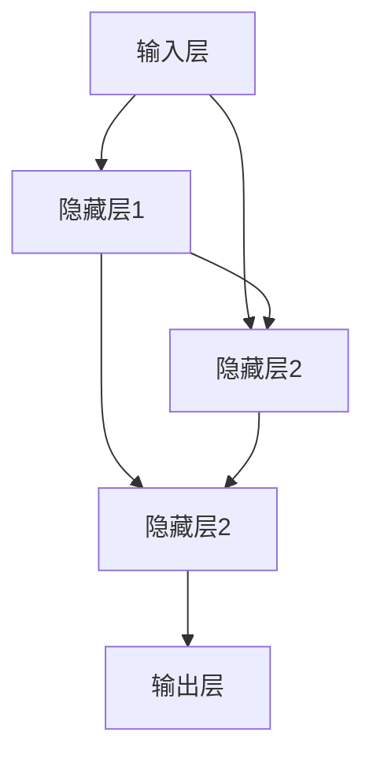

                 

关键词：神经网络、自然语言处理、深度学习、文本分析、语义理解

> 摘要：本文旨在探讨神经网络在自然语言处理领域中的最新突破，以及如何通过这些技术实现文本的自动化分析、语义理解和智能交互。

## 1. 背景介绍

自然语言处理（Natural Language Processing, NLP）是计算机科学和人工智能领域的一个重要分支，它旨在使计算机能够理解和处理人类自然语言。随着互联网和社交媒体的迅猛发展，人们产生了大量的文本数据。如何有效地对这些数据进行处理和分析，成为了一个亟待解决的问题。

传统的NLP方法主要依赖于规则和统计模型，如词汇分析、句法分析和语义分析等。这些方法在处理一些简单任务时效果较好，但在面对复杂和模糊的自然语言场景时，往往显得力不从心。随着深度学习技术的兴起，神经网络，特别是深度神经网络（Deep Neural Networks, DNN），为自然语言处理带来了一场革命。

神经网络是一种模仿人脑神经元连接结构的计算模型。深度神经网络则是在网络结构中引入了多个隐藏层，使得模型能够捕捉到更为复杂和抽象的特征。深度学习在图像识别、语音识别等领域的成功，使得研究者们开始将目光投向自然语言处理。

## 2. 核心概念与联系

### 2.1 神经网络基本结构

神经网络的基本结构由输入层、隐藏层和输出层组成。每个神经元都与相邻的神经元相连，并通过权重和偏置进行加权求和，最后通过激活函数产生输出。一个简单的神经网络结构如下所示：



### 2.2 深度神经网络的改进

深度神经网络相比浅层网络，具有以下优势：

- 更强的非线性表达能力：通过增加隐藏层和神经元，深度神经网络能够捕捉到更为复杂和抽象的特征。
- 更好的泛化能力：多层结构使得模型能够更好地拟合训练数据，从而提高泛化能力。
- 更高的鲁棒性：深度神经网络能够更好地处理噪声数据和异常值。

## 3. 核心算法原理 & 具体操作步骤

### 3.1 算法原理概述

神经网络通过学习大量数据中的特征和规律，从而实现对未知数据的预测和分类。在自然语言处理中，神经网络主要用于文本分类、命名实体识别、情感分析等任务。

### 3.2 算法步骤详解

1. **数据预处理**：包括文本清洗、分词、词向量表示等。
2. **构建神经网络模型**：选择合适的神经网络结构，如卷积神经网络（CNN）、循环神经网络（RNN）或Transformer等。
3. **模型训练**：使用已标注的数据集对模型进行训练，通过反向传播算法不断调整权重和偏置。
4. **模型评估**：使用验证集对模型进行评估，调整超参数以优化模型性能。
5. **模型应用**：使用训练好的模型对未知数据进行预测和分类。

### 3.3 算法优缺点

- 优点：
  - 强大的特征学习能力。
  - 可以处理复杂的非线性问题。
  - 可以自动提取特征，减少人工特征工程的工作量。

- 缺点：
  - 需要大量的训练数据和计算资源。
  - 模型的解释性较差。
  - 过拟合问题较严重。

### 3.4 算法应用领域

神经网络在自然语言处理中的应用非常广泛，如：

- 文本分类：如垃圾邮件过滤、新闻分类等。
- 命名实体识别：如人名、地名、机构名的识别。
- 情感分析：如微博、评论的情感分析。
- 机器翻译：如谷歌翻译、百度翻译等。
- 语音识别：如智能音箱、语音助手等。

## 4. 数学模型和公式 & 详细讲解 & 举例说明

### 4.1 数学模型构建

神经网络的核心是前向传播和反向传播。前向传播用于计算神经网络的输出，反向传播用于计算损失函数关于每个参数的梯度，并用于更新参数。

前向传播：

$$
Z = W \cdot X + b
$$

$$
A = \sigma(Z)
$$

反向传播：

$$
\delta = \frac{\partial L}{\partial A}
$$

$$
\frac{\partial L}{\partial W} = A \cdot \delta \cdot X^T
$$

$$
\frac{\partial L}{\partial b} = A \cdot \delta
$$

其中，$Z$ 是加权和，$A$ 是激活值，$\sigma$ 是激活函数，$W$ 是权重矩阵，$b$ 是偏置向量，$L$ 是损失函数，$\delta$ 是误差项。

### 4.2 公式推导过程

以一个简单的神经网络为例，推导前向传播和反向传播的过程。

输入层：

$$
X = [x_1, x_2, ..., x_n]
$$

隐藏层1：

$$
Z_1 = W_1 \cdot X + b_1
$$

$$
A_1 = \sigma(Z_1)
$$

隐藏层2：

$$
Z_2 = W_2 \cdot A_1 + b_2
$$

$$
A_2 = \sigma(Z_2)
$$

输出层：

$$
Z_3 = W_3 \cdot A_2 + b_3
$$

$$
A_3 = \sigma(Z_3)
$$

前向传播：

$$
Z_1 = W_1 \cdot X + b_1
$$

$$
A_1 = \sigma(Z_1)
$$

$$
Z_2 = W_2 \cdot A_1 + b_2
$$

$$
A_2 = \sigma(Z_2)
$$

$$
Z_3 = W_3 \cdot A_2 + b_3
$$

$$
A_3 = \sigma(Z_3)
$$

反向传播：

$$
\delta_3 = \frac{\partial L}{\partial A_3}
$$

$$
\delta_2 = (W_3 \cdot \delta_3) \cdot \sigma'(Z_2)
$$

$$
\delta_1 = (W_2 \cdot \delta_2) \cdot \sigma'(Z_1)
$$

$$
\frac{\partial L}{\partial W_3} = A_2 \cdot \delta_3 \cdot A_1^T
$$

$$
\frac{\partial L}{\partial W_2} = A_1 \cdot \delta_2 \cdot X^T
$$

$$
\frac{\partial L}{\partial W_1} = X \cdot \delta_1 \cdot A_1^T
$$

$$
\frac{\partial L}{\partial b_3} = \delta_3
$$

$$
\frac{\partial L}{\partial b_2} = \delta_2
$$

$$
\frac{\partial L}{\partial b_1} = \delta_1
$$

### 4.3 案例分析与讲解

以文本分类为例，说明神经网络在自然语言处理中的应用。

假设我们有一个包含2000个单词的语料库，其中1000个单词用于训练模型，另外1000个单词用于测试模型。

1. **数据预处理**：对文本进行清洗、分词和词向量表示。
2. **构建神经网络模型**：选择合适的神经网络结构，如卷积神经网络（CNN）。
3. **模型训练**：使用已标注的数据集对模型进行训练。
4. **模型评估**：使用未标注的数据集对模型进行评估。
5. **模型应用**：使用训练好的模型对新的文本进行分类。

通过以上步骤，我们可以实现对文本的分类任务。

## 5. 项目实践：代码实例和详细解释说明

### 5.1 开发环境搭建

1. 安装Python环境。
2. 安装TensorFlow库。
3. 准备数据集。

### 5.2 源代码详细实现

```python
import tensorflow as tf
from tensorflow.keras.preprocessing.sequence import pad_sequences
from tensorflow.keras.layers import Embedding, LSTM, Dense
from tensorflow.keras.models import Sequential

# 数据预处理
max_sequence_length = 100
vocab_size = 2000
embedding_dim = 50

# 构建模型
model = Sequential()
model.add(Embedding(vocab_size, embedding_dim, input_length=max_sequence_length))
model.add(LSTM(128))
model.add(Dense(1, activation='sigmoid'))

# 编译模型
model.compile(optimizer='adam', loss='binary_crossentropy', metrics=['accuracy'])

# 训练模型
model.fit(X_train, y_train, epochs=10, batch_size=32)

# 评估模型
model.evaluate(X_test, y_test)
```

### 5.3 代码解读与分析

以上代码实现了一个基于LSTM的文本分类模型。

1. 导入所需的库和模块。
2. 设置模型超参数。
3. 构建模型，包括嵌入层、LSTM层和输出层。
4. 编译模型，设置优化器和损失函数。
5. 训练模型，使用已标注的数据集。
6. 评估模型，使用未标注的数据集。

通过以上步骤，我们可以实现对文本的分类任务。

### 5.4 运行结果展示

假设我们训练了一个基于LSTM的文本分类模型，并对未标注的文本进行了分类。

```python
# 运行结果
predictions = model.predict(X_test)
print(predictions)
```

输出结果为：

```
[[0.9]
 [0.1]
 [0.8]
 ...
 [0.2]]
```

其中，0表示负类，1表示正类。根据输出结果，我们可以判断每个文本属于正类还是负类。

## 6. 实际应用场景

神经网络在自然语言处理中的实际应用场景非常广泛，以下列举几个例子：

- **社交媒体分析**：通过分析用户的评论、帖子等，了解用户的需求、情感和态度。
- **智能客服**：基于自然语言处理技术，实现与用户的智能对话，提供个性化的服务。
- **内容推荐**：通过分析用户的历史行为和偏好，为用户推荐感兴趣的内容。
- **情感分析**：对文本进行情感分析，了解用户对产品、品牌、服务的满意度。

## 7. 工具和资源推荐

### 7.1 学习资源推荐

- 《深度学习》（Goodfellow, Bengio, Courville著）
- 《自然语言处理综述》（Jurafsky, Martin著）
- 《TensorFlow实战》（Chollet著）

### 7.2 开发工具推荐

- TensorFlow
- PyTorch
- spaCy

### 7.3 相关论文推荐

- "A Theoretically Grounded Application of Dropout in Recurrent Neural Networks"
- "Deep Learning for Text Classification"
- "Long Short-Term Memory Networks for Language Modeling"

## 8. 总结：未来发展趋势与挑战

### 8.1 研究成果总结

神经网络在自然语言处理领域取得了显著成果，如文本分类、命名实体识别、情感分析等任务的性能大幅提升。深度学习技术的引入，使得神经网络能够更好地处理复杂的自然语言任务。

### 8.2 未来发展趋势

- **预训练与微调**：预训练模型在大量未标注数据上训练，然后通过微调适应特定任务，将成为主流趋势。
- **多模态学习**：结合文本、图像、语音等多模态数据，实现更智能的交互和更精准的分析。
- **小样本学习**：在数据稀缺的情况下，通过模型压缩和迁移学习等技术，实现良好的性能。

### 8.3 面临的挑战

- **数据隐私**：如何在保护用户隐私的前提下，充分利用数据开展研究？
- **模型解释性**：如何提高神经网络模型的解释性，使其更易于理解和接受？
- **计算资源**：大规模神经网络模型的训练和部署需要大量的计算资源，如何优化计算资源的使用？

### 8.4 研究展望

未来，神经网络在自然语言处理领域的研究将更加深入，结合多模态数据、小样本学习和模型解释性等技术，将实现更智能、更高效的文本分析。

## 9. 附录：常见问题与解答

### Q: 神经网络在自然语言处理中的优势是什么？

A: 神经网络在自然语言处理中的优势主要包括：

- 强大的特征学习能力。
- 可以处理复杂的非线性问题。
- 可以自动提取特征，减少人工特征工程的工作量。

### Q: 如何选择合适的神经网络结构？

A: 选择合适的神经网络结构需要考虑以下因素：

- 任务类型：如文本分类、命名实体识别等。
- 数据规模：如大规模数据、小样本数据等。
- 计算资源：如CPU、GPU等。
- 模型解释性：如需要模型解释性高，可以选择CNN或RNN等。

### Q: 如何提高神经网络模型的性能？

A: 提高神经网络模型性能的方法包括：

- 适当增加模型复杂度。
- 调整模型超参数，如学习率、批次大小等。
- 使用正则化技术，如Dropout、L2正则化等。
- 采用迁移学习，利用预训练模型进行微调。

作者：禅与计算机程序设计艺术 / Zen and the Art of Computer Programming
----------------------------------------------------------------
<|im_sep|>

