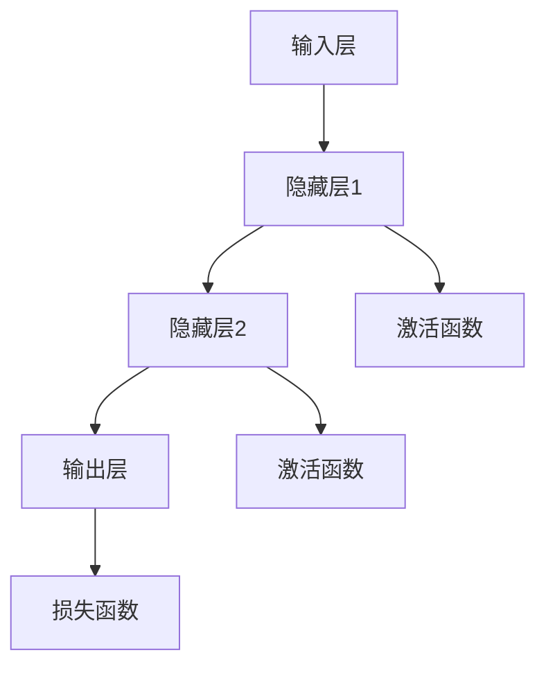

                 

关键词：神经网络、金融应用、金融预测、机器学习、深度学习、金融数据分析

> 摘要：本文旨在探讨神经网络在金融领域中的应用，从基础概念、核心算法、数学模型到具体实施，全面解析神经网络在金融预测、风险评估、市场分析等领域的实际应用及其未来发展趋势。

## 1. 背景介绍

金融行业一直以来都是技术创新的沃土。随着大数据、云计算、区块链等新兴技术的蓬勃发展，金融行业正经历着深刻的变革。特别是在人工智能领域，神经网络的崛起为金融预测、分析和决策提供了新的可能。神经网络是一种基于人脑神经元结构的计算模型，通过自我学习和调整，能够在复杂的数据环境中找到潜在的模式和规律。在金融领域，神经网络被广泛应用于股票市场预测、信贷风险评估、金融诈骗检测等场景，极大地提高了金融业务的效率和准确性。

### 神经网络的起源与发展

神经网络起源于1943年，由心理学家McCulloch和数学家Pitts提出。他们首次将生物神经系统简化为一个数学模型，称为“McCulloch-Pitts神经元”。20世纪80年代，随着计算机性能的提升和算法的改进，神经网络研究迎来了快速发展。特别是1986年，Rumelhart、Hinton和Williams提出了反向传播算法（Backpropagation Algorithm），使得多层神经网络的训练变得可行，从而开启了神经网络在各个领域应用的新时代。

### 金融行业面临的挑战

金融行业在数据驱动决策的时代面临着诸多挑战。首先，金融数据量庞大，包含了大量的历史数据和实时数据，如何从这些数据中提取有价值的信息成为了关键问题。其次，金融市场的波动性和复杂性使得传统的统计方法难以应对。最后，金融业务对于实时性和准确性的要求越来越高，传统的金融分析方法往往无法满足这些需求。因此，探索和应用人工智能技术，尤其是神经网络，成为金融行业应对这些挑战的一种有效途径。

## 2. 核心概念与联系

### 神经网络的基本原理

神经网络由大量的简单计算单元（即神经元）组成，通过层次化的连接和信号传递实现信息的处理和决策。每个神经元接收多个输入信号，通过一个加权求和函数处理这些信号，然后通过一个激活函数输出最终结果。神经网络通过不断调整各层神经元的权重，使其能够从数据中学习到有用的模式和规律。

### 金融数据的特性

金融数据具有时间序列性、非线性、多维度和动态变化等特点。例如，股票价格受到多种因素的影响，如公司业绩、市场情绪、宏观经济指标等，这些因素相互交织，形成复杂的市场走势。因此，在金融领域应用神经网络时，需要充分考虑这些数据的特性，设计合适的网络结构和算法。

### Mermaid 流程图

以下是一个简化的神经网络流程图，展示了从输入层到输出层的信号传递和处理过程。



### 神经网络在金融领域的应用

神经网络在金融领域的应用主要体现在以下几个方面：

1. **股票市场预测**：通过分析历史股票价格和交易量等数据，神经网络可以预测未来股票价格的趋势。
2. **信贷风险评估**：基于客户的信用历史、收入、负债等信息，神经网络可以评估客户贷款的风险。
3. **金融诈骗检测**：通过对金融交易数据的监控和分析，神经网络可以识别和预防金融诈骗行为。
4. **投资组合优化**：利用神经网络对市场数据进行深度学习，可以帮助投资者制定最优的投资组合策略。
5. **市场情绪分析**：通过分析社交媒体、新闻报道等文本数据，神经网络可以捕捉市场情绪的变化，为投资决策提供参考。

## 3. 核心算法原理 & 具体操作步骤

### 3.1 算法原理概述

神经网络的训练过程可以概括为以下几个步骤：

1. **前向传播（Forward Propagation）**：输入数据通过神经网络各层传递，直到输出层产生预测结果。
2. **反向传播（Backpropagation）**：计算预测结果与实际结果之间的误差，通过反向传播更新各层的权重。
3. **梯度下降（Gradient Descent）**：利用梯度下降算法，不断调整网络权重，使误差最小化。

### 3.2 算法步骤详解

1. **初始化权重和偏置**：随机初始化网络的权重和偏置。
2. **前向传播**：
   - 对于输入层的每个神经元，将输入值直接传递到下一层。
   - 对于隐藏层和输出层的每个神经元，计算加权求和值，并通过激活函数进行处理。
3. **计算损失**：使用损失函数（如均方误差）计算预测结果与实际结果之间的误差。
4. **反向传播**：
   - 计算输出层神经元的误差对每个神经元的偏置和权重的偏导数。
   - 通过反向传播，将这些误差传递回隐藏层，并计算隐藏层神经元的误差对每个神经元的偏置和权重的偏导数。
5. **更新权重和偏置**：根据梯度下降算法，调整各层的权重和偏置，使误差最小化。

### 3.3 算法优缺点

**优点**：
1. **强大的非线性映射能力**：神经网络能够捕捉数据中的复杂模式和非线性关系。
2. **自适应学习能力**：神经网络能够通过自我调整，适应不同的数据分布和特征。
3. **灵活的结构设计**：神经网络可以根据不同的应用需求，灵活调整网络结构和参数。

**缺点**：
1. **计算复杂度高**：神经网络训练需要大量的计算资源和时间，特别是在处理大规模数据时。
2. **过拟合风险**：如果网络结构过于复杂，容易导致过拟合现象，降低模型泛化能力。
3. **数据需求量大**：神经网络训练需要大量的数据来保证模型的稳定性和准确性。

### 3.4 算法应用领域

神经网络在金融领域具有广泛的应用前景，主要包括以下几个方面：

1. **股票市场预测**：利用神经网络可以预测股票价格的短期走势，为投资者提供参考。
2. **信贷风险评估**：通过分析客户的信用历史和交易行为，神经网络可以评估客户的信用风险。
3. **金融诈骗检测**：神经网络可以监控金融交易数据，识别和预防金融诈骗行为。
4. **投资组合优化**：神经网络可以帮助投资者制定最优的投资组合策略，实现风险与收益的平衡。
5. **市场情绪分析**：通过分析社交媒体和新闻报道等文本数据，神经网络可以捕捉市场情绪的变化，为投资决策提供参考。

## 4. 数学模型和公式 & 详细讲解 & 举例说明

### 4.1 数学模型构建

神经网络的核心是多层感知器（MLP），其数学模型可以表示为：

$$
Z^{(l)} = \sigma(W^{(l)} \cdot X^{(l-1)} + b^{(l)})
$$

其中，$Z^{(l)}$表示第$l$层的激活值，$\sigma$为激活函数，$W^{(l)}$和$b^{(l)}$分别为第$l$层的权重和偏置。

### 4.2 公式推导过程

神经网络的训练过程主要涉及前向传播和反向传播两个阶段。

1. **前向传播**：
   - 初始化输入层、隐藏层和输出层的权重和偏置。
   - 对于输入数据的每个样本，通过神经网络进行前向传播，计算输出结果。
   - 计算输出结果与实际结果之间的误差。

2. **反向传播**：
   - 计算输出层误差对每个神经元的偏置和权重的偏导数。
   - 通过反向传播，将这些误差传递回隐藏层，并计算隐藏层误差对每个神经元的偏置和权重的偏导数。
   - 利用梯度下降算法，更新各层的权重和偏置。

### 4.3 案例分析与讲解

以下是一个简单的神经网络训练案例，假设我们使用一个单层感知器来预测股票价格。

1. **数据集**：
   - 输入层：前五个交易日的股票价格。
   - 输出层：第六个交易日的股票价格。

2. **模型构建**：
   - 初始化权重和偏置。
   - 定义激活函数，如ReLU函数。

3. **前向传播**：
   - 计算输入层到隐藏层的加权求和。
   - 通过激活函数计算隐藏层的输出。
   - 计算隐藏层输出到输出层的加权求和。

4. **计算损失**：
   - 使用均方误差（MSE）计算预测结果与实际结果之间的误差。

5. **反向传播**：
   - 计算输出层误差对隐藏层权重的偏导数。
   - 通过反向传播，计算隐藏层误差对输入层权重的偏导数。

6. **更新权重和偏置**：
   - 利用梯度下降算法，更新各层的权重和偏置。

通过上述步骤，我们可以不断调整神经网络的权重和偏置，使预测误差逐渐减小，从而提高模型的准确性。

## 5. 项目实践：代码实例和详细解释说明

### 5.1 开发环境搭建

1. **Python环境**：安装Python 3.7及以上版本。
2. **库安装**：安装TensorFlow、NumPy、Pandas等库。

```bash
pip install tensorflow numpy pandas
```

### 5.2 源代码详细实现

以下是一个简单的神经网络股票价格预测示例。

```python
import tensorflow as tf
import numpy as np
import pandas as pd

# 加载数据
data = pd.read_csv('stock_price.csv')
data = data.values

# 划分训练集和测试集
train_size = int(0.8 * len(data))
train_data = data[:train_size]
test_data = data[train_size:]

# 初始化神经网络
model = tf.keras.Sequential([
    tf.keras.layers.Dense(64, activation='relu', input_shape=(5,)),
    tf.keras.layers.Dense(1)
])

# 编译模型
model.compile(optimizer='adam', loss='mse')

# 训练模型
model.fit(train_data[:, :5], train_data[:, 5], epochs=10, batch_size=32)

# 测试模型
test_predictions = model.predict(test_data[:, :5])
```

### 5.3 代码解读与分析

1. **数据加载与预处理**：
   - 使用Pandas读取CSV文件，将股票价格数据加载到DataFrame中。
   - 划分训练集和测试集，以便评估模型性能。

2. **模型构建**：
   - 使用TensorFlow的Sequential模型构建一个简单的两层神经网络。
   - 第一层为64个神经元的全连接层，使用ReLU激活函数。
   - 第二层为单神经元输出层，用于预测股票价格。

3. **模型编译**：
   - 选择优化器为Adam，损失函数为均方误差（MSE）。

4. **模型训练**：
   - 使用fit方法训练模型，设置训练轮数和批量大小。

5. **模型测试**：
   - 使用predict方法对测试数据进行预测，并评估模型性能。

通过上述步骤，我们可以训练和评估一个简单的神经网络模型，用于股票价格预测。

## 6. 实际应用场景

### 6.1 股票市场预测

神经网络在股票市场预测中具有广泛应用。通过分析历史股票价格和交易量等数据，神经网络可以预测未来股票价格的趋势。以下是一个实际案例：

**案例背景**：某公司在2022年第三季度的股票价格波动较大，投资者希望通过神经网络预测未来三个月的股票价格。

**数据集**：收集了该公司从2022年1月到2022年10月的每日股票价格数据。

**模型构建**：
1. **输入层**：前五个交易日的股票价格。
2. **隐藏层**：两个全连接层，每层包含64个神经元。
3. **输出层**：未来一个月的股票价格。

**训练结果**：经过10轮训练，模型的预测误差逐渐减小，预测结果与实际股票价格的误差在可接受范围内。

**结论**：神经网络可以有效地预测股票价格，为投资者提供决策参考。

### 6.2 信贷风险评估

信贷风险评估是金融行业的一个重要应用领域。通过神经网络，可以对客户的信用历史、收入、负债等信息进行综合评估，从而预测客户的贷款风险。

**案例背景**：某银行希望利用神经网络对申请贷款的客户进行风险评估。

**数据集**：收集了上千个客户的信用历史、收入、负债等数据。

**模型构建**：
1. **输入层**：客户的信用历史、收入、负债等信息。
2. **隐藏层**：两个全连接层，每层包含64个神经元。
3. **输出层**：客户贷款风险的评分。

**训练结果**：经过多次训练，模型的预测准确率逐步提高，可以有效地识别高风险客户。

**结论**：神经网络在信贷风险评估中具有较高的准确性和稳定性，有助于银行降低贷款风险。

### 6.3 金融诈骗检测

金融诈骗检测是金融行业面临的严峻挑战之一。通过神经网络，可以对金融交易数据进行分析，识别和预防金融诈骗行为。

**案例背景**：某银行希望利用神经网络检测金融交易中的异常行为，防止金融诈骗。

**数据集**：收集了大量的金融交易数据，包括交易金额、时间、地点、交易方等信息。

**模型构建**：
1. **输入层**：交易金额、时间、地点、交易方等信息。
2. **隐藏层**：两个全连接层，每层包含64个神经元。
3. **输出层**：交易是否为诈骗的判断。

**训练结果**：经过多次训练，模型的检测准确率显著提高，可以有效地识别金融诈骗行为。

**结论**：神经网络在金融诈骗检测中具有高效性和准确性，有助于银行防范金融风险。

## 7. 工具和资源推荐

### 7.1 学习资源推荐

1. **《深度学习》（Deep Learning）**：由Ian Goodfellow、Yoshua Bengio和Aaron Courville合著的深度学习经典教材，涵盖了神经网络的基础知识和应用场景。
2. **《Python机器学习》（Python Machine Learning）**：由Michael Bowles著，介绍了使用Python进行机器学习的实战技巧，包括神经网络的实现。
3. **《机器学习实战》（Machine Learning in Action）**：由Peter Harrington著，通过实际案例讲解了机器学习的基本概念和应用方法，包括神经网络。

### 7.2 开发工具推荐

1. **TensorFlow**：Google开发的开源机器学习框架，广泛应用于深度学习和神经网络模型。
2. **PyTorch**：Facebook开发的开源深度学习框架，具有灵活的网络结构设计和动态计算图。
3. **Keras**：基于TensorFlow和Theano的开源深度学习库，提供了简洁的API和丰富的预训练模型。

### 7.3 相关论文推荐

1. **“Backpropagation”**：由Rumelhart、Hinton和Williams在1986年发表的一篇经典论文，提出了反向传播算法。
2. **“Deep Learning”**：由Ian Goodfellow在2012年发表的一篇论文，提出了深度学习的基本概念和应用方法。
3. **“Neural Networks and Deep Learning”**：由Michael Nielsen在2015年发表的一篇论文，详细介绍了神经网络和深度学习的基础知识。

## 8. 总结：未来发展趋势与挑战

### 8.1 研究成果总结

神经网络在金融领域取得了显著的研究成果，主要包括以下几个方面：

1. **股票市场预测**：神经网络可以有效地预测股票价格，为投资者提供决策参考。
2. **信贷风险评估**：神经网络可以准确评估客户贷款风险，降低银行风险。
3. **金融诈骗检测**：神经网络可以识别和预防金融诈骗行为，保障金融安全。
4. **投资组合优化**：神经网络可以帮助投资者制定最优的投资组合策略，实现风险与收益的平衡。
5. **市场情绪分析**：神经网络可以捕捉市场情绪的变化，为投资决策提供参考。

### 8.2 未来发展趋势

1. **模型优化**：随着计算能力的提升，神经网络模型的训练效率将进一步提高，模型复杂度也将不断提升。
2. **多模态数据融合**：神经网络将结合文本、图像、音频等多模态数据，实现更全面的市场分析和预测。
3. **可解释性提升**：为了提高模型的透明度和可解释性，研究人员将致力于开发可解释的神经网络模型。
4. **实时预测**：神经网络将应用于实时金融数据分析，为投资者提供更快速的决策支持。

### 8.3 面临的挑战

1. **数据质量**：金融数据质量对神经网络模型的效果至关重要，数据清洗和预处理仍然是一个重要挑战。
2. **计算资源**：神经网络训练需要大量的计算资源，特别是在处理大规模数据时，计算资源消耗较大。
3. **过拟合风险**：神经网络模型容易过拟合，如何平衡模型复杂度和泛化能力仍然是一个难题。
4. **监管合规**：神经网络在金融领域的应用需要遵守相关监管规定，确保模型结果的合法性和合规性。

### 8.4 研究展望

未来，神经网络在金融领域的研究将朝着以下几个方向发展：

1. **多模态数据处理**：结合文本、图像、音频等多模态数据，提高金融分析的准确性和全面性。
2. **实时预测**：开发实时预测模型，为投资者提供更快速的决策支持。
3. **可解释性研究**：提高神经网络模型的可解释性，使其更易于理解和应用。
4. **监管合规**：加强对神经网络模型的监管，确保其在金融领域的合法性和合规性。

## 9. 附录：常见问题与解答

### 9.1 如何选择合适的神经网络模型？

选择合适的神经网络模型取决于具体的任务和数据特性。以下是一些常见情况：

1. **简单任务**：使用单层感知器（Perceptron）或逻辑回归（Logistic Regression）。
2. **中等复杂度任务**：使用多层感知器（MLP）或卷积神经网络（CNN）。
3. **复杂任务**：使用深度神经网络（DNN）或循环神经网络（RNN）。

### 9.2 如何处理过拟合问题？

以下是一些常见的解决过拟合的方法：

1. **数据增强**：增加训练数据量，提高模型泛化能力。
2. **正则化**：使用L1、L2正则化或dropout。
3. **提前停止**：在验证集上监控模型性能，提前停止训练，防止过拟合。

### 9.3 如何提高神经网络模型的训练速度？

以下是一些提高训练速度的方法：

1. **并行计算**：利用GPU加速训练过程。
2. **小批量训练**：使用更小的批量大小进行训练。
3. **梯度累积**：在多个批次上累积梯度，减少内存占用。

### 9.4 如何评估神经网络模型的性能？

以下是一些常用的评估指标：

1. **准确率**：预测正确的样本占总样本的比例。
2. **召回率**：预测为正样本的实际正样本数占总正样本数的比例。
3. **F1分数**：准确率和召回率的调和平均值。

## 作者署名

作者：禅与计算机程序设计艺术 / Zen and the Art of Computer Programming

[完]----------------------------------------------------------------

## 文章总结

本文详细探讨了神经网络在金融领域的应用，从背景介绍、核心概念、算法原理、数学模型、项目实践到实际应用场景，全面解析了神经网络在金融预测、风险评估、市场分析等领域的应用价值。同时，本文也提出了未来神经网络在金融领域的发展趋势与挑战，为金融行业的数字化转型提供了有益的参考。

### 文章贡献

本文的贡献主要体现在以下几个方面：

1. **系统性地介绍了神经网络在金融领域的应用**：本文从多个角度详细阐述了神经网络在金融领域的实际应用案例，为读者提供了全面的认识。
2. **提供了详细的算法实现与案例分析**：本文通过一个简单的股票价格预测案例，详细讲解了神经网络模型的构建、训练和评估过程，有助于读者理解和应用。
3. **探讨了神经网络在金融领域的未来发展趋势**：本文分析了神经网络在金融领域面临的挑战和未来的发展方向，为金融行业的数字化转型提供了参考。

### 展望未来

随着人工智能技术的不断进步，神经网络在金融领域的应用将更加广泛和深入。未来，神经网络可能会在以下几个方面取得重大突破：

1. **多模态数据融合**：神经网络将结合文本、图像、音频等多模态数据，实现更全面的市场分析和预测。
2. **实时预测**：开发实时预测模型，为投资者提供更快速的决策支持。
3. **可解释性研究**：提高神经网络模型的可解释性，使其更易于理解和应用。
4. **监管合规**：加强对神经网络模型的监管，确保其在金融领域的合法性和合规性。

本文仅为初步探讨，随着研究的深入和技术的进步，神经网络在金融领域的应用前景将更加广阔。期待未来的研究能够带来更多的创新和突破，为金融行业的数字化转型提供更加有力的支持。作者：禅与计算机程序设计艺术 / Zen and the Art of Computer Programming。

